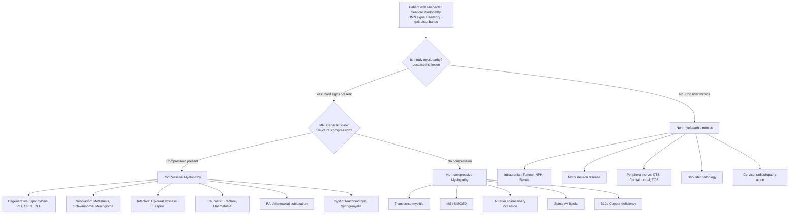

## Differential Diagnosis of Cervical Myelopathy

When a patient presents with progressive upper and lower limb dysfunction, gait disturbance, and UMN signs, the immediate question is: **is this truly cervical myelopathy, or is something else mimicking it?** The differential is broad because many conditions can produce a combination of limb weakness, numbness, and spasticity. The key is to use the history, pattern of signs, tempo of onset, and imaging to distinguish them.

The approach to the differential diagnosis works on two levels:

1. **What is causing the myelopathy?** (i.e., the underlying aetiology of the cord compression — covered extensively in the Etiology section)
2. **What else can mimic cervical myelopathy?** (i.e., conditions that produce similar clinical features but are NOT cervical cord compression)

This section focuses on **Level 2** — the mimics and look-alikes — while also recapping the aetiological differentials within myelopathy itself.

---

### Framework: Thinking from First Principles

Why do we need a differential? Because cervical myelopathy presents with:
- Upper limb numbness/weakness/clumsiness
- Lower limb spasticity and gait disturbance
- UMN signs

These features can be produced by **any lesion along the motor and sensory pathways** — from the brain (cortex, internal capsule), through the brainstem, to the spinal cord, and even peripheral nerves (when multiple are affected). The job is to **localise the lesion** first, then determine the cause.

---

### A. Conditions That Mimic Cervical Myelopathy (Non-Spinal Cord Causes)

#### 1. Intracranial Lesions

| Condition | Why It Can Mimic | Key Distinguishing Features |
|---|---|---|
| **Brain tumour** | A parasagittal meningioma or falx tumour can compress both motor cortices → bilateral leg weakness + UMN signs, resembling myelopathy | Seizures, headache, papilloedema, cognitive changes; no myelopathic hand signs; MRI brain diagnostic |
| **Normal pressure hydrocephalus (NPH)** | Classic triad: gait apraxia, urinary incontinence, dementia — the gait disturbance and incontinence overlap with myelopathy | Gait is "magnetic" (feet stuck to floor), not spastic; dementia present; no UL myelopathic signs; CT/MRI shows ventriculomegaly out of proportion to sulcal atrophy |
| **Stroke / vascular lesion** [5] | Internal capsule lacunar infarct can cause pure motor hemiparesis; bilateral strokes can mimic bilateral UMN signs | Acute onset; usually unilateral; face involved (corticobulbar fibres); MRI brain with diffusion restriction |
| **Subdural haematoma** [5] | Can cause progressive hemiparesis or bilateral weakness in the elderly | History of trauma (even minor); fluctuating consciousness; CT brain diagnostic |
| **Multiple sclerosis (MS)** | Demyelinating plaques in the cervical cord are very common in MS and produce myelopathy | Relapsing-remitting history; optic neuritis; Lhermitte's sign (also present in CSM!); MRI shows characteristic periventricular and cord lesions; oligoclonal bands in CSF |

#### 2. ***Cervical Radiculopathy*** [1]

This is the single most important condition to differentiate from cervical myelopathy, and they frequently coexist (***myeloradiculopathy***) [1].

***Clinical features of cervical radiculopathy*** [1]:
- ***Unilateral arm pain or sensory disturbance***
- ***May have associated weakness***
- ***Dermatomal distribution***
- ***Neck pain***

***Signs of cervical radiculopathy*** [1]:
- ***Spurling's test*** (positive = axial compression + ipsilateral rotation reproduces radicular pain)
- ***Shoulder abduction test*** (positive = abducting shoulder relieves radicular pain by reducing tension on the nerve root)
- ***Myotomal weakness***
- ***Reduced upper limb reflexes*** (LMN pattern — hyporeflexia, NOT hyperreflexia)

| Feature | Cervical Myelopathy | Cervical Radiculopathy |
|---|---|---|
| Pain | ***Not a predominant feature*** [1] | Prominent — unilateral radicular arm pain |
| Distribution | Bilateral, diffuse | Unilateral, dermatomal |
| Motor signs | UMN (spasticity, hyperreflexia) below the level + LMN at level | LMN only (weakness, hyporeflexia) in one myotome |
| Sensory signs | Bilateral, multi-segmental; dorsal column signs | Unilateral, single dermatome |
| Hand signs | Myelopathic: Hoffmann's, finger escape, 10-sec test | Absent |
| Gait | Spastic gait, positive Romberg | Normal gait |
| Sphincter | May be affected (late) | Not affected |
| Spurling's test | Typically negative | Typically positive |

***Radiculopathy level-by-level clinical features*** [1]:

| ***Level*** | ***Muscle Weakness*** | ***Sensory Deficits / Location of Pain*** | ***Reflex*** |
|---|---|---|---|
| ***C5*** | ***Deltoid*** | ***Lateral arm*** | ***Biceps*** |
| ***C6*** | ***Biceps, wrist extension*** | ***Radial forearm, radial two digits*** | ***Brachioradialis*** |
| ***C7*** | ***Triceps, wrist flexion*** | ***Middle finger*** | ***Triceps*** |
| ***C8*** | ***Finger flexors*** | ***Ulnar two digits*** | — |
| ***T1*** | ***Hand intrinsics*** | ***Ulnar forearm, medial to the shoulder blade*** | — |

<Callout title="Myelopathy vs Radiculopathy — The Core Distinction" type="error">
Students commonly confuse these. The easiest way to remember: **Radiculopathy = PERIPHERAL nerve root = LMN = pain + weakness + hyporeflexia in ONE root distribution. Myelopathy = CENTRAL spinal cord = UMN = spasticity + hyperreflexia + bilateral + gait disturbance + myelopathic hand signs.** If both coexist, you have ***myeloradiculopathy*** [1].
</Callout>

#### 3. ***Peripheral Nerve Compression*** [1]

***Differential diagnosis of cervical radiculopathy includes: cervical myelopathy (symptoms may overlap and patients can have myeloradiculopathy), peripheral nerve compression, and shoulder pathology*** [1].

| Condition | Why It Can Mimic | Key Distinguishing Features |
|---|---|---|
| **Carpal tunnel syndrome (CTS)** [2] | Numbness in the hand (median nerve distribution); weakness of thenar muscles. Can be confused with C6/C7 radiculopathy or early myelopathy | Distribution is median nerve (lateral 3½ digits), NOT dermatomal; Tinel's/Phalen's test positive; no UMN signs; NCS diagnostic. DDx includes cervical spondylosis (C6/7) [2] |
| **Cubital tunnel syndrome** [2] | Ulnar nerve palsy → hand clumsiness, intrinsic wasting — mimics C8/T1 myelopathy or radiculopathy | Distribution is ulnar nerve (medial 1½ digits); ***DDx: cervical myelopathy, T1 radiculopathy*** [2]; Tinel's at elbow; NCS diagnostic |
| **Thoracic outlet syndrome (TOS)** [2] | ***Lower brachial plexus injury*** → paraesthesia/weakness in ulnar distribution; can mimic C8/T1 radiculopathy | Provocative tests (Adson's, Roo's); vascular symptoms may be present; ***causes include cervical rib, previous fracture, Pancoast tumour*** [2] |

The concept of ***double crush syndrome*** [2] is important here: ***peripheral entrapment syndromes are often associated with cervical/lumbar spondylosis*** — a proximal compression renders the nerve more susceptible to a distal second compression. So a patient can have BOTH cervical spondylotic myelopathy AND carpal tunnel syndrome simultaneously.

#### 4. ***Shoulder Pathology*** [1]

- Rotator cuff tears, frozen shoulder, and impingement can cause arm pain and weakness.
- Key distinction: pain is localised to the shoulder; no neurological deficit (no numbness, no reflex changes, no myelopathic signs); shoulder examination findings (empty can test, painful arc, reduced passive ROM in frozen shoulder).

#### 5. Motor Neuron Disease (MND / ALS)

| Why It Can Mimic | Key Distinguishing Features |
|---|---|
| Amyotrophic lateral sclerosis produces both UMN and LMN signs — weakness, wasting, fasciculations, hyperreflexia, spasticity — very similar to cervical myelopathy | **No sensory involvement** in MND (pure motor); widespread fasciculations across multiple myotomes (not just cervical); bulbar signs (dysarthria, dysphagia, tongue fasciculations); MRI cervical spine is normal (no cord compression); EMG shows widespread denervation |

<Callout title="MND vs Cervical Myelopathy — A Critical Distinction">
Both produce mixed UMN and LMN signs. The key differentiator: **MND has NO sensory loss** — it is a pure motor disease. Cervical myelopathy almost always has sensory features (numbness, proprioceptive loss, Lhermitte's sign). Also, MND has **normal imaging** of the cord.
</Callout>

#### 6. Subacute Combined Degeneration (Vitamin B12 Deficiency)

- Demyelination of **dorsal columns** (proprioceptive loss, sensory ataxia) + **lateral corticospinal tracts** (UMN weakness, spasticity) — mimics posterior and lateral column disease seen in cervical myelopathy.
- Key distinction: peripheral neuropathy also present (absent ankle jerks despite upgoing plantars); macrocytic anaemia; low serum B12; MRI may show dorsal column T2 signal but no structural compression.

#### 7. ***Spinal Cord Syndromes*** [4]

These are not "differentials" per se but rather **patterns within myelopathy** that help localise the pathology:

| ***Syndrome*** | ***Signs*** | ***Representative Conditions*** |
|---|---|---|
| ***Complete cord lesion*** | ***All function lost 1–2 levels below*** | ***Transverse myelitis, MS, traumatic injury*** |
| ***Brown-Séquard*** | ***Ipsilateral motor and vibration loss; contralateral pain/temperature loss*** | ***Traumatic injury, epidural tumour, varicella zoster, MS*** |
| ***Central cord (small)*** | ***Suspended sensory loss*** | ***Contusion, tumour, syrinx*** |
| ***Central cord (large)*** | ***Dissociated sensory loss involving lateral spinothalamic tract, sparing dorsal column; anterior horn cell at level of lesion; UMN signs below level of lesion*** | ***Syringomyelia, tumour, neuromyelitis optica*** |
| ***Posterior column*** | ***Proprioception and vibration loss; DTRs may be normal*** | ***Ischaemic stroke, syphilis, MS, B12 and copper deficiency*** |
| ***Anterior horn*** | ***Sensation normal, fasciculations, LMN weakness*** | ***Poliomyelitis, West Nile virus*** |
| ***Anterior spinal artery*** | ***Weakness; dissociated sensory loss, sparing dorsal columns*** | ***Ischaemic stroke*** |
| ***Spinothalamic*** | ***Symmetric, longitudinally extensive, isolated pain and temperature loss*** | ***Paraneoplastic syndrome*** |
| ***Root + cord*** | ***One or more roots plus cord*** | ***Spondylosis, sarcoidosis, Lyme disease*** |
| ***Myeloneuropathy*** | ***Myelopathy plus polyneuropathy*** | ***B12 deficiency, vitamin E deficiency, sarcoidosis, genetic syndromes*** |

***Central cord syndrome*** [1][4]:
- ***Most common incomplete spinal cord injury***
- ***Hyperextension injury in a degenerative cervical spine***
- ***Segmental loss: decussating secondary sensory neurons affected → upper limb pain/numbness; anterior horn cells involved*** [4]
- ***Long tract sign: medial motor fibres more affected; sacral sparing*** [4]

***Anterior cord syndrome*** [4]: ***Paraplegia + spinothalamic loss + intact posterior column***

***Posterior cord syndrome*** [4]: ***Pain and paraesthesia in upper limb and trunk; mild UE paraparesis***

---

### B. Aetiological Differentials Within Myelopathy (Recap)

When you've confirmed the patient has myelopathy, you then need to determine the cause. This was covered in the Etiology section, but here is the structured differential by category:

***Compressive causes (space-occupying conditions)*** [3]:
- ***Neoplastic: Primary / Secondary***
- ***Traumatic: Bone fragment / Haematoma***
- ***Degenerative: Prolapsed intervertebral disc, Osteophyte***
- ***Infective: Abscess / TB spine***
- ***Cystic: Arachnoid cyst, Syringomyelia***
- ***Vascular: AVM***

***By location*** [3]:
- ***Extradural*** (most common): disc, osteophyte, metastasis, abscess, haematoma
- ***Intradural extramedullary***: schwannoma, meningioma, neurofibroma [2]
- ***Intradural intramedullary***: ependymoma, astrocytoma, syringomyelia [2]

***Non-compressive causes*** [3]:
- ***Transverse myelitis (Dx by exclusion; LP — high CSF protein)***
- ***Arterial occlusion (thromboembolic occlusion of spinal arteries; iatrogenic e.g. aortic surgery)***
- ***Spinal arteriovenous fistula (spinal cord oedema, haemorrhage)***

Additional non-compressive causes:
- Multiple sclerosis
- Neuromyelitis optica spectrum disorder (NMOSD)
- Subacute combined degeneration (B12 deficiency)
- Radiation myelopathy
- Copper deficiency myelopathy
- HIV-associated vacuolar myelopathy
- Paraneoplastic myelopathy

***Key degenerative aetiologies*** [3][4]:
- ***Spondylosis, disc degeneration/prolapse, apophyseal joint hypertrophy, instability, spinal canal stenosis***
- ***Myelopathy = central compression; Radiculopathy = lateral compression***
- ***Chronic progressive / Acute exacerbation***

***Special aetiologies:***
- ***OPLL: ectopic calcification; much more common in Asian vs non-Asian populations (up to 2–4%); male predominance; younger population; more commonly cervical than thoracic*** [1]
- ***RA: high prevalence of cervical involvement; retroodontoid pannus; atlantoaxial subluxation (C1/2), subaxial subluxation, vertical subluxation (basilar invagination); RA medications reduce incidence*** [1]

---

### C. Systematic Differential Diagnosis Diagram

---

### D. Clinical Clues to Distinguish Key Differentials

| Clue | Favours | Reasoning |
|---|---|---|
| Bilateral UMN signs + myelopathic hand signs + gait disturbance | **Cervical myelopathy** | Cord compression → UMN below, LMN at level |
| Unilateral radicular pain, dermatomal, + Spurling's positive | **Cervical radiculopathy** | Nerve root compression → single root LMN pattern |
| Purely motor, no sensory loss, widespread fasciculations | **Motor neuron disease** | Pure motor pathway degeneration; sensory pathways spared |
| Relapsing-remitting; optic neuritis; young female | **Multiple sclerosis** | CNS demyelination in time and space |
| Sudden onset after fall in elderly with pre-existing stenosis; UL > LL | **Central cord syndrome** | Hyperextension → central cord pinched → medial corticospinal fibres (UL) affected first |
| Absent ankle jerks + upgoing plantars + macrocytosis | **B12 deficiency** | Combined LMN (peripheral neuropathy) + UMN (cord) — "subacute combined degeneration" |
| Pain/temperature loss with preserved proprioception; sudden onset | **Anterior spinal artery syndrome** | Anterior 2/3 cord ischaemia; dorsal columns supplied by posterior spinal arteries → spared |
| Ipsilateral motor/proprioception loss + contralateral pain/temp loss | **Brown-Séquard syndrome** | Hemisection of cord → ipsilateral corticospinal and dorsal column; contralateral spinothalamic |
| ***Old man with degenerated spine after a fall*** [3] | ***Central cord syndrome*** [3] | Pre-existing stenosis + hyperextension = classic scenario |

<Callout title="The Red Flags Within Myelopathy" type="error">
When you diagnose myelopathy, always actively exclude:
1. **Neoplastic causes** — progressive pain worse at night, weight loss, known malignancy
2. **Infective causes** — fever, immunosuppression, IV drug use, TB risk factors
3. **Cauda equina syndrome** — saddle anaesthesia, urinary retention, faecal incontinence (though this is lumbar, not cervical — but always rule out in any spinal presentation) [2]
4. **Acute cord compression** — rapid deterioration is a surgical emergency
</Callout>

---

### E. Special Note: Spinal Tumour Differential [2]

When a myelopathy is caused by a spinal tumour, the type depends on the anatomical compartment:

| ***Compartment*** | ***Tumour*** | ***Key Features*** |
|---|---|---|
| ***Intradural extramedullary*** | ***Schwannoma*** | ***Common at cervical and lumbar spine; 95% arise from sensory nerve root → present as pain; usually sporadic (if multiple → NF2); T1 contrast-enhancing*** [2] |
| | ***Neurofibroma*** | ***Usually multiple, associated with NF1; cannot be separated from nerve fibres (cf. schwannoma)*** [2] |
| | ***Meningioma*** | ***Common at thoracic level (80%); located lateral to spinal cord (70%) except at cervical spine (anterior); homogeneous enhancement + dural tail sign*** [2] |
| ***Intradural intramedullary*** | ***Ependymoma*** | ***More common; discrete from normal cord → surgery; e.g. myxopapillary ependymoma (WHO Grade 1, filum terminale)*** [2] |
| | ***Astrocytoma*** | ***Indistinct from normal cord → biopsy and debulking ± adjuvants*** [2] |
| ***Extradural*** | ***Metastasis*** | Most common spinal tumour overall; lung, breast, prostate, kidney, thyroid |

---

<Callout title="High Yield Summary — Differential Diagnosis">

**The key differentials to distinguish from cervical myelopathy are:**

1. **Cervical radiculopathy** — unilateral, dermatomal, LMN signs, pain-predominant, Spurling's positive (vs bilateral, UMN, painless, myelopathic hand signs in myelopathy)
2. **Motor neuron disease** — mixed UMN/LMN BUT no sensory loss; widespread fasciculations; normal MRI cord
3. **Multiple sclerosis** — relapsing-remitting; optic neuritis; young female; MRI brain + cord shows demyelination
4. **Peripheral nerve compression** — CTS, cubital tunnel, TOS — distribution follows peripheral nerve, not dermatome; NCS diagnostic
5. **Intracranial pathology** — parasagittal tumour, NPH, stroke — face involvement, cognitive changes, MRI brain
6. **B12 deficiency** — absent ankle jerks + upgoing plantars + macrocytosis
7. **Central cord syndrome** — acute UL > LL weakness after hyperextension injury in elderly with pre-existing stenosis

**Within myelopathy, distinguish compressive from non-compressive on MRI, then determine the aetiology by compartment (extradural, intradural extramedullary, intramedullary).**

</Callout>

---

<ActiveRecallQuiz
  title="Active Recall - Differential Diagnosis of Cervical Myelopathy"
  items={[
    {
      question: "A 60-year-old man presents with progressive bilateral hand clumsiness and spastic gait. What are the top 3 differential diagnoses you would consider, and what single examination finding would most strongly support cervical myelopathy over the alternatives?",
      markscheme: "Top 3: (1) Cervical spondylotic myelopathy, (2) Motor neuron disease, (3) Multiple sclerosis. The single most supportive finding for myelopathy is myelopathic hand signs (Hoffmann sign, finger escape sign, inverted reflexes) — these localise to the cervical cord and are absent in MND (which has no sensory loss and widespread fasciculations) and in MS (which would have dissemination in time/space on MRI)."
    },
    {
      question: "How do you distinguish cervical radiculopathy from cervical myelopathy on clinical examination? List at least 4 distinguishing features.",
      markscheme: "(1) Radiculopathy: unilateral dermatomal pain; Myelopathy: bilateral, pain not predominant. (2) Radiculopathy: LMN signs (hyporeflexia, weakness in one myotome); Myelopathy: UMN signs (hyperreflexia, spasticity). (3) Radiculopathy: positive Spurling test; Myelopathy: myelopathic hand signs (Hoffmann, finger escape). (4) Radiculopathy: normal gait; Myelopathy: spastic gait, positive Romberg. (5) Radiculopathy: no sphincter involvement; Myelopathy: sphincter dysfunction in late stages."
    },
    {
      question: "A patient has mixed UMN and LMN signs in all four limbs with no sensory deficit and widespread fasciculations. MRI cervical spine is normal. What is the most likely diagnosis, and what is the key feature that distinguishes it from cervical myelopathy?",
      markscheme: "Motor neuron disease (ALS). Key distinguishing feature: NO sensory loss in MND (pure motor disease), whereas cervical myelopathy almost always has sensory features (numbness, proprioceptive loss, Lhermitte sign). Additionally, MRI cervical spine shows no structural cord compression in MND."
    },
    {
      question: "Name the three intradural extramedullary spinal tumours that can cause myelopathy. For each, give one distinguishing feature.",
      markscheme: "(1) Schwannoma — arises from sensory nerve root, presents as pain, T1 contrast-enhancing, usually sporadic (multiple = NF2). (2) Neurofibroma — usually multiple, associated with NF1, cannot be separated from nerve fibres. (3) Meningioma — common at thoracic level, homogeneous enhancement with dural tail sign."
    },
    {
      question: "Explain the concept of double crush syndrome and its relevance to the differential diagnosis of cervical myelopathy.",
      markscheme: "Double crush syndrome: proximal compression of a peripheral nerve renders it more susceptible to a second, more distal compression. Relevance: a patient with cervical spondylosis (proximal compression) may also develop carpal tunnel syndrome or cubital tunnel syndrome (distal compression) simultaneously. This means cervical myelopathy and peripheral nerve entrapment can coexist, and both must be investigated and treated."
    }
  ]}
/>

## References

[1] Lecture slides: GC 227. Cervical Spine Pathology.pdf (pp. 17, 18, 25, 32, 33, 41, 42, 43, 44, 80)
[2] Senior notes: maxim.md (sections 2.2–2.5, 5.2, 5.6 — compression neuropathy, spine diseases, spinal tumours)
[3] Lecture slides: GC 110. Paraplegia Spinal cord compression Transverse myelitis Spinal dysraphism Neuroimaging III Spinal Cord.pdf (pp. 10, 12, 21, 28)
[4] Lecture slides: GC 110. Paraplegia Spinal cord compression Transverse myelitis Spinal dysraphism Neuroimaging III Spinal Cord.pdf (pp. 10, 12, 28 — spinal cord syndromes and non-compressive causes)
[5] Senior notes: felixlai.md (differential diagnosis of acute neurological presentation)
