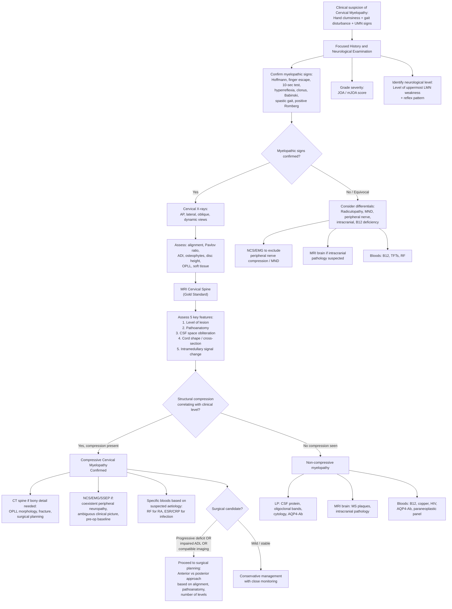

## Diagnosis of Cervical Myelopathy

### Diagnostic Principles: Why Is There No Single "Diagnostic Criteria" Set?

Unlike conditions such as rheumatoid arthritis or SLE, cervical myelopathy does not have a formal, validated set of "diagnostic criteria" like the ACR/EULAR criteria. This is because cervical myelopathy is fundamentally a **clinico-radiological diagnosis** — it requires:

1. **Clinical features consistent with spinal cord dysfunction** (the symptoms and signs we covered)
2. **Imaging confirmation of cervical spinal cord compression** that correlates with the clinical findings
3. **Exclusion of other conditions** that can mimic myelopathy (the differential diagnosis)

Think of it as a three-legged stool: clinical syndrome + imaging evidence + exclusion of mimics. If any leg is missing, the diagnosis is insecure.

---

### Diagnostic Framework

The diagnosis rests on three pillars:

| Pillar | What It Means | How to Assess |
|---|---|---|
| **1. Clinical assessment** | Demonstrate myelopathic signs and symptoms; grade severity | History, physical examination (myelopathic hand signs, UMN signs, gait), JOA/mJOA scoring |
| **2. Imaging correlation** | Demonstrate structural pathology compressing the cord that matches the clinical level | X-ray → CT → MRI (gold standard) |
| **3. Exclude mimics** | Rule out non-myelopathic and non-compressive causes | Neurophysiology, blood tests, lumbar puncture, MRI brain (if needed) |

***Indications for surgery in CSM*** [1] elegantly summarise the diagnostic threshold for action:
- ***Progressive neurologic deficit***
- ***Significantly impaired ADL (JOA score)***
- ***Compatible imaging findings***

This means the diagnosis is confirmed when there is a clinical deficit, it is functionally significant, AND imaging shows a corresponding structural cause.

---

### Clinical Assessment (Pillar 1)

#### History

The key historical features that point toward cervical myelopathy (as opposed to mimics):

- **Insidious onset** — typically months to years of progressive hand clumsiness, gait unsteadiness, numbness
- ***Pain is not a predominant feature*** [1] — if pain dominates, think radiculopathy or other causes
- ***Loss of hand dexterity*** [1] — difficulty with chopsticks (very relevant HK context), buttons, handwriting
- ***Poor proprioception + spastic gait*** [1]
- ***Motor weakness and sphincteric dysfunction appear in the late stage*** [1]
- Lhermitte's sign reported by the patient (electric shock sensation on neck flexion)
- May have **acute-on-chronic deterioration** after minor trauma (especially falls in the elderly → ***central cord syndrome*** [3])

#### Physical Examination

A systematic neurological examination is the cornerstone. Here's the structured approach:

***Physical examination*** [2]:
- ***UL:***
  - ***Myelopathy: hyperreflexia, myelopathic hand signs e.g. Hoffmann sign, finger escape sign*** [2]
  - ***Radiculopathy: hyporeflexia, dermatomal numbness, Spurling sign*** [2]
- ***Trunk: sensory level (T4: nipple; T10: umbilicus)*** [2]
- ***LL:***
  - ***Clonus, hyperreflexia, upgoing plantar reflex*** [2]
  - ***Straight leg raise test*** [2]
  - ***Gait*** [2]

***Signs of cervical myelopathy*** [1]:
- ***Myelopathic hand signs: Hoffmann's sign, 10-sec test, finger escape sign***
- ***Lower limb spasticity***
- ***Positive Romberg sign / failed tandem walking test***
- ***Lower limb upper motor neuron features***

#### Severity Grading: JOA Score [2]

The **Japanese Orthopaedic Association (JOA) score** is the standard severity grading system and is used both diagnostically (to quantify impairment) and to monitor treatment response.

**JOA Scoring System (Total normal = 17 points)** [2]:

| Domain | Parameter | Score Range |
|---|---|---|
| **I. Upper extremity function** | Ability to use chopsticks and spoons; button shirts | 0–4 |
| **II. Lower extremity function** | Ability to walk (normal → wheelchair-bound) | 0–4 |
| **III. Sensory** | Upper extremity + Lower extremity and trunk | 0–2 each (total 0–4) |
| **IV. Bladder function** | Urinary disturbance (normal → retention) | 0–3 |
| **Total** | | **0–17** |

- **Higher score = better function** (17 = normal)
- **Recovery rate** = (Post-op JOA − Pre-op JOA) / (17 − Pre-op JOA) × 100%
- A low JOA score confirms **significantly impaired ADL** — one of the ***indications for surgery*** [1]

**Modified JOA (mJOA) Score** (Western version, max 18):
- Mild: 15–17
- Moderate: 12–14
- Severe: < 12

***Localisation of the symptomatic level*** [1]:
- ***The spinal cord ascends approximately one segment during its development*** [1]
- ***Cervical discs generally lie opposite spinal cord segments which are numbered one lower than the number of roots passing them*** [1]

This means a disc at C4/5 lies opposite the C5/C6 cord segments — so compression at the C4/5 disc level can produce C5 or C6 neurological signs. This concept is critical for correlating clinical level with imaging level.

---

### Imaging (Pillar 2)

Imaging is essential to confirm the diagnosis, identify the pathoanatomy, determine the level(s) of compression, and plan surgery. The approach follows a logical sequence from simple to complex.

#### 1. Plain X-rays (Cervical Spine)

***Cervical X-rays*** [1]: systematic interpretation using:
- ***Coverage / adequacy***
- ***Alignment***
- ***Bone***
- ***Disc space***
- ***Soft tissue***
- ***Dynamic views***
- ***C0/C1/C2 relationship***

**Standard views:**
- ***AP / lateral*** [1]
- ***Oblique views for foraminal narrowing*** [1] (specifically useful for radiculopathy — shows neural foramen encroachment by osteophytes)

***Adequacy*** [2]:
- ***C-spine lateral: from pituitary fossa to C7/T1 junction***
- ***Odontoid view / open mouth view: C1 and C2***
- ***Swimmer's view: cervicothoracic junction***

***Alignment*** [2]:
- ***Curvature: cervical lordosis preserved / increased / decreased / lost / kyphosis*** — loss of lordosis is common in cervical spondylosis and is important for surgical planning (kyphosis favours anterior approach)
- ***Vertebral lines: anterior vertebral line, posterior vertebral line, spinolaminar line, spinous process line***
  - ***Ignore the bony spurs***
  - ***Posterior vertebral line is easiest to detect*** — disruption suggests subluxation or instability

***Bone:*** fracture, bony lesion [2]

***Cartilage / Disc space:***
- ***Pavlov ratio > 0.8*** [2] — ratio of AP diameter of spinal canal to AP diameter of vertebral body at the same level. **< 0.8 indicates congenital stenosis** — these patients are predisposed to myelopathy.
- ***Atlantodental interval (ADI)*** [2]: ***≥ 3 mm (adult) or ≥ 5 mm (children) = atlantoaxial subluxation***

***Soft tissue (only for C-spine)*** [2]:
- ***3×7=21 rule: C1 ≤ 10 mm, C3 ≤ 7 mm, C7 ≤ 21 mm*** — widened prevertebral soft tissue suggests haematoma, abscess, or retropharyngeal pathology

***Measurement of cervical stenosis and instability*** [1]:
- ***a = Midsagittal diameter of the spinal canal. Relative stenosis if < 12 mm; absolute if < 10 mm***
- ***b = Dynamic stenosis = distance from posteroinferior corner of cranial vertebra to anterosuperior edge of caudal lamina. Dynamic stenosis if < 12 mm***
- ***c = Olisthesis (slip)*** — measures any listhesis (slippage) of one vertebra on another

***Dynamic views (flexion/extension)*** [2]:
- ***X-ray spine: dynamic (flexion/extension), sagittal plane to look for any imbalance*** [2]
- Why? Static X-rays may miss instability. Dynamic views reveal abnormal translation or angulation during movement — critical for detecting spondylolisthesis or ligamentous instability.
- Important in RA (to demonstrate atlantoaxial subluxation that may only appear in flexion).

***Investigation — Plain X-ray*** [3]:
- ***Readily available***
- ***Show obvious fracture and malalignment***
- ***Can miss subtle fracture***
- ***Cannot exclude ligamentous instability***
- ***Cannot exclude soft-tissue compressive lesion (e.g. haematoma)***

<Callout title="Limitations of Plain X-rays">
X-rays are a good screening tool but have significant limitations: they cannot directly visualise the spinal cord, cannot assess soft tissue compression (discs, ligamentum flavum, haematoma), and cannot detect intramedullary signal changes. They are useful for assessing alignment, bony anatomy, and canal dimensions — but **MRI is essential for confirming cervical myelopathy**.
</Callout>

| X-ray Finding | Significance |
|---|---|
| Loss of cervical lordosis | Degenerative changes, muscle spasm |
| Osteophytes (anterior/posterior) | Spondylosis — posterior osteophytes may compress cord |
| Reduced disc height | Disc degeneration |
| Pavlov ratio < 0.8 | Congenital stenosis — predisposed to myelopathy |
| ADI ≥ 3 mm | Atlantoaxial subluxation (RA, Down syndrome, trauma) |
| Calcification of PLL | OPLL — important cause in Asian populations |
| Spondylolisthesis on dynamic views | Instability → dynamic cord compression |
| Widened prevertebral soft tissue | Haematoma, abscess, retropharyngeal pathology |

#### 2. CT Scan (Cervical Spine)

***CT scan*** [1]:
- ***Readily available, provides radiographic clearance when X-rays are inadequate*** [1]
- ***CT spine: bony lesions*** [2]

***Investigation: CT*** [3]:
- ***Reasonably available***
- ***Still cannot show soft-tissue injury*** [3]

**When to use CT:**
- Bony detail: fractures (especially subtle ones missed on X-ray), facet joint arthropathy, calcification patterns
- **OPLL**: CT is the best modality to define the extent and morphology of ossification — it shows the bony bar beautifully on sagittal and axial cuts
- **Surgical planning**: bony anatomy for screw placement, assessment of facet joints
- CT myelography: if MRI is contraindicated (e.g., patient with pacemaker), contrast injected into the thecal sac can outline the cord and show compression

| CT Finding | Significance |
|---|---|
| Posterior osteophytes encroaching canal | Spondylotic cord compression |
| Continuous ossified bar behind vertebral bodies | OPLL |
| Ossified ligamentum flavum | OLF |
| Facet joint hypertrophy | Lateral/posterolateral stenosis |
| Fracture lines | Traumatic cause |
| Lytic/sclerotic bony lesion | Tumour (primary or metastatic) |

#### 3. MRI Scan (Cervical Spine) — The Gold Standard

MRI is the **definitive investigation** for cervical myelopathy. It is the only modality that directly visualises the spinal cord, the degree of compression, and intramedullary changes.

***MRI scan*** [1]:
- ***Essential if there are neurological deficits*** [1]
- ***Useful for delineation of soft tissue injury (i.e. discoligamentous)*** [1]
- ***Confirm nerve root / cord compression*** [1]

***Investigation: MRI*** [3]:
- ***Difficult to arrange*** [3]
- ***Shows soft-tissue lesion, cord oedema*** [3]

***Advanced imaging assessment*** [1]:
- ***Evaluation of compression and deformity of spinal cord***
- ***Evaluation of intramedullary lesion***
- ***Detection of pathological spinal factors***
- ***Surgical planning***

***MRI — basic interpretation*** [1]:
- ***Level of lesion, location***
- ***Pathoanatomy (disc, osteophyte, OPLL, flavum)***
- ***Obliteration of the CSF space***
- ***Cord shape / cross-sectional area***
- ***Intramedullary signal change (myelomalacia)***

Let me break each of these down:

| MRI Feature | What to Look For | Clinical Significance |
|---|---|---|
| ***Level of lesion*** | Which disc level(s) show compression | Correlate with clinical neurological level |
| ***Location*** | Anterior (disc, osteophyte, OPLL) vs posterior (ligamentum flavum) vs circumferential | Determines surgical approach (anterior vs posterior) |
| ***Pathoanatomy*** | ***Disc, osteophyte, OPLL, flavum*** — identify the exact structure causing compression | Different pathologies require different surgical techniques |
| ***Obliteration of the CSF space*** | The normal bright CSF signal (T2) surrounding the cord disappears at the level of compression | Indicates significant compression even before cord signal changes appear |
| ***Cord shape / cross-sectional area*** | Cord is flattened, "banana-shaped", or reduced in cross-sectional area | Degree of cord deformity correlates with severity |
| ***Intramedullary signal change*** | **T2 hyperintensity** within the cord = oedema/gliosis/myelomalacia; **T1 hypointensity** = more severe, chronic damage (cavitation/necrosis) | This is the most important prognostic finding — T2 signal change indicates cord injury has occurred; T1 change indicates irreversibility |

<Callout title="MRI Signal Changes — Why They Matter" type="idea">
**T2 hyperintensity** in the cord (bright on T2) = ***myelomalacia*** [1]. This represents oedema, gliosis, or demyelination within the cord substance. It tells you that the compression has already caused **structural damage to the cord**. Patients with T2 signal change have:
- Worse preoperative neurological status
- Poorer recovery after decompression surgery
- More advanced disease

**T1 hypointensity** (dark on T1 in the cord) is even more ominous — it suggests cavitation, necrosis, or chronic gliosis. Recovery is very unlikely.

**No signal change** with compression = the cord is compressed but not yet irreversibly damaged — these patients have the best surgical outcomes. This is why early detection matters.
</Callout>

**MRI Sequences and What They Show:**

| Sequence | What It Shows Best | Relevance to Myelopathy |
|---|---|---|
| **T1-weighted** | Anatomy, fat (bright), bone marrow | Cord morphology; T1 hypointensity in cord = severe damage; contrast enhancement for tumour/infection |
| **T2-weighted** | Fluid (bright), pathology | CSF (bright) outlines cord beautifully; intramedullary T2 hyperintensity = myelomalacia; disc hydration assessment |
| **T2 sagittal** | Overview of entire cervical spine | Level and extent of compression; multisegmental disease; overall alignment |
| **T2 axial** | Cross-section at each level | Cord shape, cross-sectional area, location of compression (anterior/posterior/lateral) |
| **T1 with gadolinium** | Enhancement pattern | Tumour (enhancing), abscess (ring-enhancing), inflammation |
| **STIR** | Bone marrow oedema, ligament injury | Acute injury, infection, metastases |

#### 4. Neurophysiological Studies

***Neurophysiological studies: nerve conduction study (NCS), somatosensory evoked potential (SSEP)*** [2]

***NCV / EMG*** [1]

These are **adjunctive** — not primary diagnostic tools for myelopathy — but have important roles:

| Study | What It Tests | Role in Cervical Myelopathy |
|---|---|---|
| **Nerve Conduction Study (NCS)** | Peripheral nerve conduction velocity and amplitude | **Exclude peripheral nerve compression** (CTS, cubital tunnel, TOS) as the cause of hand symptoms. Also helps identify concurrent **double crush syndrome**. |
| **Electromyography (EMG)** | Muscle electrical activity — detects denervation | Identifies LMN involvement at the level of compression (fibrillations, positive sharp waves in specific myotomes). Helps distinguish myelopathy from MND (in MND, widespread denervation across multiple myotomes and regions including bulbar). |
| **Somatosensory Evoked Potential (SSEP)** | Integrity of sensory pathways from periphery to cortex (primarily dorsal columns) | Objectively demonstrates impaired conduction through the cervical cord. Prolonged latency or reduced amplitude at cervical/cortical level suggests cord dysfunction. Useful for surgical monitoring (intraoperative SSEP). |
| **Motor Evoked Potential (MEP)** | Integrity of corticospinal tract (UMN pathway) | Intraoperative monitoring during decompression surgery to detect real-time cord compromise. Prolonged central motor conduction time supports myelopathy diagnosis. |

**When neurophysiology is particularly useful:**
- When the clinical picture is ambiguous (e.g., coexistent CTS + myelopathy)
- When MRI findings are equivocal or do not match the clinical level
- Intraoperatively for spinal cord monitoring
- To exclude MND (which shows widespread denervation without sensory nerve involvement)

#### 5. Additional Investigations (Depending on Suspected Aetiology)

| Investigation | When to Order | Key Findings |
|---|---|---|
| **Bloods: ESR, CRP** | Suspected infection or inflammation | Elevated in epidural abscess, TB spine, RA |
| **Bloods: Vitamin B12, folate** | Suspected subacute combined degeneration | Low B12 with macrocytosis |
| **Bloods: RF, anti-CCP, ESR** | Suspected RA cervical spine involvement | Positive RF/anti-CCP confirms RA |
| **Bloods: Ca, ALP, PSA, tumour markers** | Suspected metastatic disease | Raised ALP (bone mets), raised PSA (prostate) |
| **Lumbar puncture** | Suspected non-compressive cause (transverse myelitis, MS, NMOSD) | ***Transverse myelitis: Dx by exclusion; LP — high CSF protein*** [3]; MS: oligoclonal bands; NMOSD: AQP4 antibody |
| **MRI Brain** | Suspected MS, intracranial pathology, NMOSD | Periventricular demyelination (MS); parasagittal mass; hydrocephalus |
| **Whole spine MRI** | To exclude other levels of compression; suspected metastatic disease | Multi-level disease; skip lesions in metastases |
| **CT-guided biopsy** | Suspected tumour, atypical infection | Histological diagnosis |
| **Bone scan** | Suspected metastatic disease | Multiple hot spots |

---

### Diagnostic Algorithm

---

### Correlation: Matching Clinical Level to Imaging Level

This is a crucial step that many students overlook. Finding compression on MRI is not enough — you must demonstrate that the **imaging level explains the clinical findings**.

***Localisation of symptomatic disc level*** [1]:
- ***The spinal cord ascends approximately one segment during its development***
- ***Cervical discs generally lie opposite spinal cord segments numbered one lower than the number of roots passing them***

**Practical implication:** A disc herniation at C5/6 lies opposite the C6/C7 cord segments. So compression at C5/6 can produce clinical signs of C6 or C7 myelopathy (C6 LMN signs at the level; C7 and below UMN signs).

***Neurological level diagnosis*** [1]:

| ***Level*** | ***Reflex Pattern*** | ***Uppermost Weak Muscle*** | ***Sensory Dermatome*** |
|---|---|---|---|
| ***C3–C4*** | ***BTR ↑, TTR ↑, FF ↑*** | ***Deltoid*** | ***C4*** |
| ***C4–C5*** | ***BTR ↑ or →, TTR ↑, FF ↑*** | ***Biceps*** | ***C5*** |
| ***C5–C6*** | ***BTR → or ↓, TTR ↑ or →, FF ↑*** | ***Triceps or EDC*** | ***C6*** |
| ***C6–C7*** | ***BTR →, TTR →, FF ↑*** | ***APB or ADM*** | ***C7*** |

Use this table to match clinical findings with the MRI level. If there is a mismatch, consider:
- Multi-level disease (most common scenario in spondylotic myelopathy)
- Concurrent radiculopathy at a different level
- Alternative diagnosis

---

### Summary Table: Investigations at a Glance

| Investigation | Primary Role | Key Findings | Limitations |
|---|---|---|---|
| ***X-ray (AP, lateral, oblique, dynamic)*** [1] | Screening; alignment; bony assessment | Loss of lordosis, osteophytes, Pavlov ratio < 0.8, ADI, OPLL calcification | ***Cannot exclude soft-tissue lesion or ligamentous instability (without dynamic views)*** [3] |
| ***CT scan*** [1] | Bony detail; OPLL characterisation; surgical planning | Ossified PLL/LF, facet hypertrophy, fractures, bony tumour | ***Cannot show soft-tissue injury*** [3] |
| ***MRI*** [1] | **Gold standard**: confirms cord compression and intramedullary damage | ***Level, pathoanatomy, CSF obliteration, cord shape, intramedullary signal change*** [1] | ***Difficult to arrange*** [3]; claustrophobia; contraindicated with some implants |
| ***NCS/EMG*** [1][2] | Exclude peripheral neuropathy / MND; identify level | Denervation in specific myotomes (EMG); prolonged distal latency in CTS (NCS) | Does not directly assess the cord |
| ***SSEP*** [2] | Assess dorsal column conduction; intraoperative monitoring | Prolonged central conduction time | Less sensitive to lateral column disease |
| **Bloods** | Exclude systemic causes | B12 deficiency, RA markers, infection markers, tumour markers | Non-specific |
| **LP** | Non-compressive myelopathy workup | High CSF protein (transverse myelitis), oligoclonal bands (MS), AQP4-Ab (NMOSD) | Invasive; contraindicated if cord compression present (risk of coning if intracranial mass) |

---

<Callout title="High Yield Summary — Diagnosis of Cervical Myelopathy">

**Diagnosis is clinico-radiological** — there are no formal "diagnostic criteria."

**Three pillars:**
1. **Clinical**: Myelopathic hand signs + UMN LL signs + gait disturbance → grade with JOA/mJOA
2. **Imaging**: MRI is the gold standard → look for level, pathoanatomy, CSF obliteration, cord shape, intramedullary signal change (myelomalacia)
3. **Exclude mimics**: NCS/EMG to exclude peripheral nerve/MND; bloods for B12, RA; LP for transverse myelitis/MS

**X-ray pearls**: Pavlov ratio < 0.8 = congenital stenosis; ADI ≥ 3 mm = atlantoaxial subluxation; dynamic views for instability

**MRI prognostic sign**: T2 hyperintensity = myelomalacia = cord damage has occurred; T1 hypointensity = worse prognosis, irreversible damage

**Indications for surgery**: Progressive neurological deficit + impaired ADL (low JOA) + compatible imaging

**Level localisation**: Match the uppermost weak muscle and reflex pattern (Seichi table) to the imaging level of compression. Remember: cervical discs lie opposite cord segments numbered one lower.

</Callout>

---

<ActiveRecallQuiz
  title="Active Recall - Diagnosis and Investigations of Cervical Myelopathy"
  items={[
    {
      question: "What are the 5 key features to systematically assess on MRI cervical spine for cervical myelopathy?",
      markscheme: "(1) Level of lesion and location. (2) Pathoanatomy — disc, osteophyte, OPLL, ligamentum flavum. (3) Obliteration of the CSF space. (4) Cord shape and cross-sectional area. (5) Intramedullary signal change (myelomalacia). T2 hyperintensity indicates cord damage; T1 hypointensity indicates irreversible damage with worse prognosis."
    },
    {
      question: "A lateral cervical spine X-ray shows a Pavlov ratio of 0.65. The midsagittal canal diameter measures 9 mm. What do these values indicate and what is the clinical significance?",
      markscheme: "Pavlov ratio less than 0.8 indicates congenital cervical stenosis. Midsagittal diameter less than 10 mm indicates absolute stenosis (less than 12 mm is relative stenosis). Clinical significance: the patient has a constitutionally narrow canal and is predisposed to developing cervical myelopathy from even mild degenerative changes or minor trauma."
    },
    {
      question: "What are the three indications for surgery in cervical spondylotic myelopathy as stated in the lecture slides?",
      markscheme: "(1) Progressive neurologic deficit. (2) Significantly impaired ADL (assessed by JOA score). (3) Compatible imaging findings. All three should be present to confirm the diagnosis warrants surgical intervention."
    },
    {
      question: "Why can a plain X-ray NOT be used alone to diagnose cervical myelopathy? List at least 3 specific limitations.",
      markscheme: "(1) Cannot directly visualise the spinal cord. (2) Cannot exclude soft-tissue compressive lesions such as disc herniation or haematoma. (3) Cannot exclude ligamentous instability on static views. (4) Cannot detect intramedullary signal changes (myelomalacia). (5) Can miss subtle fractures. MRI is essential for definitive diagnosis."
    },
    {
      question: "A 70-year-old with cervical myelopathy also complains of numbness in the lateral 3.5 fingers. NCS shows prolonged distal motor latency of the median nerve. What is the likely concurrent diagnosis, and what concept explains this coexistence?",
      markscheme: "Concurrent carpal tunnel syndrome (CTS). Explained by double crush syndrome — proximal compression of a peripheral nerve (cervical spondylosis compressing nerve roots or cord) renders it more susceptible to a second, more distal compression (median nerve at carpal tunnel). Both conditions must be investigated and treated."
    },
    {
      question: "Explain why cervical discs generally lie opposite spinal cord segments numbered one lower than the number of roots passing them, and give a clinical example of how this affects level localisation.",
      markscheme: "During development, the spinal cord ascends approximately one segment relative to the vertebral column (differential growth). So C5/6 disc lies opposite C6/C7 cord segments. Clinical example: compression at C5/6 disc can produce C6 LMN signs at the level (inverted brachioradialis reflex, biceps/wrist extension weakness) and C7-and-below UMN signs (hyperreflexia, spasticity in lower limbs)."
    }
  ]}
/>

## References

[1] Lecture slides: GC 227. Cervical Spine Pathology.pdf (pp. 3, 11, 15, 17, 18, 24, 25, 28, 29, 36, 42, 43, 44, 45, 60)
[2] Senior notes: maxim.md (sections 2.2–2.5, 5.6)
[3] Lecture slides: GC 110. Paraplegia Spinal cord compression Transverse myelitis Spinal dysraphism Neuroimaging III Spinal Cord.pdf (pp. 12, 14, 21, 28)
