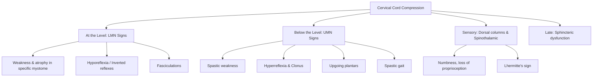

## Definition

Cervical myelopathy refers to the clinical syndrome resulting from **compression of the cervical spinal cord** within the cervical spinal canal [1][2]. The word itself breaks down nicely: "cervical" = pertaining to the neck, "myelo-" (Greek _myelos_) = spinal cord, "-pathy" (Greek _pathos_) = disease/suffering. So literally: a disease of the spinal cord at the neck level.

This is fundamentally different from cervical _radiculopathy_, which is compression of a **nerve root** (peripheral nerve issue → lower motor neuron signs), whereas myelopathy is compression of the **spinal cord itself** (central nervous system issue → upper motor neuron signs below the level, potentially lower motor neuron signs at the level).

<Callout title="Key Distinction">
  Myelopathy = spinal **cord** compression → UMN signs below, LMN signs at the
  level. Radiculopathy = nerve **root** compression → LMN signs in that root's
  distribution only. These can and frequently do coexist — this is called
  **myeloradiculopathy**.
</Callout>

---

## Epidemiology

- **Most common cause of spinal cord dysfunction in adults over 55 years old** worldwide [1].
- **_Cervical spondylotic myelopathy (CSM) is the most common cause_** — degenerative disease accounts for the overwhelming majority of cases [1][2].
- **_Bimodal distribution of spinal cord injury_** [3]:
  - **_Young adults: high-energy trauma_**
  - **_Old adults: low-energy trauma, osteoporotic bone, pre-existing spinal stenosis_** — even a simple fall in an elderly patient with a degenerative narrowed canal can cause acute-on-chronic myelopathy (classically **central cord syndrome**).
- **Male predominance** overall, particularly for OPLL and degenerative spondylosis.
- **Geographic relevance (Hong Kong/Asia)**:
  - **_Ossification of the posterior longitudinal ligament (OPLL) is much more common in Asian vs non-Asian populations (up to 2–4%)_** [3] — this is a distinctly important cause in our population.
  - Rheumatoid arthritis with cervical spine involvement is also relevant, though RA medications have reduced its incidence [3].
  - TB spine (Pott's disease) remains a consideration in Hong Kong given regional TB prevalence.

---

## Anatomy and Function

Understanding cervical myelopathy requires solid knowledge of the cervical spinal anatomy, because the clinical features are entirely dictated by _what gets compressed and where_.

### The Cervical Spine (C1–C7)

- **7 cervical vertebrae**, but **8 cervical nerve roots** (C1–C8).
- **_C8 exits between C7 and T1 (there is no C8 vertebra)_** [2].
- **_Above C8: nerve roots exit above their corresponding vertebra_** (e.g., C4 root exits between C3/C4) [2].
- **_Below C8: nerve roots exit below their corresponding vertebra_** (e.g., L4 exits between L4/L5) [2].

This numbering system matters clinically: a C5/6 disc prolapse will compress the **C6 nerve root** (exits above C7 but below C6).

### The Spinal Canal and Its Contents

The cervical spinal cord sits within the spinal canal, surrounded by:

1. **Anterior structures** (front):
   - Vertebral bodies
   - Intervertebral discs
   - **_Posterior longitudinal ligament (PLL)_** — runs along the posterior aspect of the vertebral bodies inside the canal [1][2]
     - **_Ossification of PLL (OPLL) is very common in Japanese and Chinese — a common cause of cervical myelopathy_** [2]

2. **Posterior structures** (back):
   - Laminae
   - **_Ligamentum flavum (LF)_** — connects adjacent laminae [1][2]
     - **_Dynamic compression: osteophytes + buckled LF during extension_** — this is why extension worsens myelopathy [2]
     - **_Ossification of LF (OLF)_** can also contribute [2]
   - Spinous processes
   - Supraspinous and interspinous ligaments

3. **Lateral structures**:
   - Pedicles
   - Facet (apophyseal/zygapophyseal) joints
   - Neural foramina — where nerve roots exit

### Cross-Sectional Anatomy of the Spinal Cord

This is critical for understanding the clinical signs:

| Tract                             | Location in Cord      | Function                              | What Happens When Compressed                                                  |
| --------------------------------- | --------------------- | ------------------------------------- | ----------------------------------------------------------------------------- |
| **Corticospinal tract (lateral)** | Lateral columns       | Voluntary motor (UMN)                 | Weakness, spasticity, hyperreflexia, upgoing plantars                         |
| **Spinothalamic tract**           | Anterolateral columns | Pain and temperature                  | Loss of pain/temperature sensation                                            |
| **Dorsal columns**                | Posterior columns     | Proprioception, vibration, fine touch | Loss of proprioception → sensory ataxia, positive Romberg                     |
| **Anterior horn cells**           | Central grey matter   | LMN to muscles at that level          | LMN signs at the level of compression (atrophy, fasciculations, hyporeflexia) |

The **somatotopic arrangement** of the corticospinal and spinothalamic tracts is key:

- In the **lateral corticospinal tract**: cervical fibres are **medial** (central), sacral fibres are **lateral** (peripheral).
- This is why **central cord syndrome** (compression from within outward) preferentially affects the **upper limbs** (cervical fibres are central) while relatively sparing the **lower limbs** (sacral fibres are peripheral) [3].

### Vascular Supply

- **Anterior spinal artery** (single) — supplies the anterior 2/3 of the cord (corticospinal tracts, spinothalamic tracts, anterior horn cells).
- **Posterior spinal arteries** (paired) — supply the posterior 1/3 (dorsal columns).
- Compression can compromise these vessels, adding an ischaemic component to the mechanical compression — this is part of why myelopathy can be progressive and irreversible.

### Spinal Canal Dimensions

- **_Pavlov ratio > 0.8 is normal_** (ratio of spinal canal AP diameter to vertebral body AP diameter) [2]. A ratio < 0.8 indicates **congenital spinal stenosis** — these patients have less "reserve space" and are more vulnerable to developing myelopathy from even mild degenerative changes.
- Normal cervical canal AP diameter: ~17 mm. Myelopathy typically develops when the canal narrows to < 13 mm.

<Callout title="Soft Tissue Rules (C-spine X-ray)" type="idea">
  ***3×7=21 rule: C1 ≤ 10 mm, C3 ≤ 7 mm, C7 ≤ 21 mm*** [2]. Increased
  prevertebral soft tissue suggests haematoma, abscess, or retropharyngeal
  pathology — red flags on a lateral C-spine film.
</Callout>

---

## Etiology (Focus on Hong Kong)

The causes of cervical myelopathy can be broadly divided into **compressive** (structural) and **non-compressive** causes [4]. For clinical purposes and exams, the compressive causes dominate.

### Compressive Causes (by location) [4]

**_By location:_**

- **_Extradural_**
- **_Intradural extramedullary_**
- **_Intradural intramedullary_**

#### 1. Degenerative (Most Common Cause Overall) [1][2][4]

**_Cervical spondylosis is the most common (MC) cause_** [2].

Degenerative changes include:

- **_Spondylosis_** (wear-and-tear degeneration of the vertebral column)
- **_Disc degeneration/prolapse_** — herniated disc material directly compresses the cord anteriorly [4]
- **_Osteophytes_** — bony spurs from degenerative vertebral endplates [4]
- **_Apophyseal (facet) joint hypertrophy_** — narrows the canal and foramina [4]
- **_Hypertrophy/buckling of the ligamentum flavum_** — compresses the cord posteriorly, especially in extension [1][2]
- **_Instability_** [4]
- **_Spinal canal stenosis_** [4]
- **_Degenerative spondylolisthesis_** — forward slip of one vertebra on another [2]

**Pathophysiology of cervical spondylotic myelopathy (CSM):**

The degenerative cascade works like this:

1. Disc desiccation and loss of height → abnormal loading on vertebral endplates
2. Osteophyte formation (body's attempt to stabilise) → anterior cord compression
3. Facet joint hypertrophy → lateral and posterolateral narrowing
4. Ligamentum flavum buckling/hypertrophy → posterior cord compression
5. Segmental instability → dynamic compression (worse with movement, especially extension)

The result is **circumferential narrowing** of the spinal canal → direct mechanical compression of the cord + ischaemia from vascular compromise → demyelination, neuronal loss, and gliosis.

**_Myelopathy = central compression; Radiculopathy = lateral compression_** [4].

**_Can present as chronic progressive OR acute exacerbation_** [4] — the classic scenario is an elderly patient with long-standing mild symptoms who deteriorates acutely after a minor fall (acute-on-chronic myelopathy → often **central cord syndrome**).

#### 2. Ossification of the Posterior Longitudinal Ligament (OPLL) [1][3]

- **_Ectopic calcification as a cause of cord compression_** [3]
- **_Much more common in Asian vs non-Asian populations (up to 2–4%)_** [3]
- **_Male predominance, affects younger population_** [3]
- **_More commonly affects cervical than thoracic spine_** [3]

**Pathophysiology:** The PLL, which normally lies just posterior to the vertebral bodies, undergoes heterotopic ossification (the ligament turns to bone). This creates a rigid bony bar that compresses the cord from the front. It is often multi-segmental.

**Why is it relevant in Hong Kong?** OPLL has a strong genetic predisposition in East Asian populations. It should always be in the differential for a younger Asian male presenting with cervical myelopathy.

#### 3. Rheumatoid Arthritis (RA) [3]

- **_High prevalence of cervical spine involvement_** in RA [3]
- **_Formation of retroodontoid pannus_** — synovial inflammatory tissue behind the dens [3]
- **_Synovial inflammation predisposes to cervical instability_** [3]:
  - **_Atlantoaxial subluxation (C1/2)_** — most common pattern; the transverse ligament is destroyed by pannus, allowing C1 to slide forward on C2
  - **_Subaxial subluxation_** — "staircase" pattern of multiple levels subluxing
  - **_Vertical subluxation (basilar invagination)_** — the dens migrates superiorly through the foramen magnum
- **_Use of RA medications reduces the incidence of cervical involvement_** [3] — good disease control with DMARDs/biologics prevents ligamentous destruction.
- **_Atlantodental interval (ADI)_**: abnormal (atlantoaxial subluxation) if **_ADI ≥ 3 mm (adult) or ≥ 5 mm (children)_** [2].
- **_Causes of atlantoaxial subluxation: trauma, Down syndrome (absent transverse ligament), RA (inflammation/rupture of transverse ligament)_** [2].

#### 4. Congenital Spinal Stenosis [2]

- Patients born with a constitutionally narrow canal (Pavlov ratio < 0.8).
- They have less "reserve space" and are more vulnerable to myelopathy from even minor degenerative changes or minor trauma.

#### 5. Trauma [2][3]

- Direct fracture-dislocation → bony fragment or haematoma compressing the cord.
- **_Central cord syndrome: hyperextension injury in a degenerative cervical spine_** [3] — the most classic acute traumatic myelopathy in the elderly.
  - **_Most common incomplete spinal cord injury_** [3]
  - Mechanism: hyperextension → **_pinching of cord between anterior osteophytes and infolded/thickened ligamentum flavum posteriorly_** [3]

#### 6. Neoplastic [4]

- **_Primary or secondary (metastatic) tumours_** [4]
- Extradural metastases (most common spinal tumours) — from lung, breast, prostate, kidney, thyroid (mnemonic: **Pb-KTL** — Lead Kills The Lungs/Liver, or the "paired organs" mnemonic).
- Intradural extramedullary: meningioma, schwannoma/neurofibroma.
- Intradural intramedullary: ependymoma, astrocytoma.

#### 7. Infective [4]

- **_Abscess / TB spine_** [4]
- Epidural abscess — bacterial (Staph aureus most common) or tuberculous.
- Pott's disease (TB spondylitis) — relevant in Hong Kong. Typically involves anterior vertebral body → collapse → kyphotic deformity → cord compression.

#### 8. Cystic [4]

- **_Arachnoid cyst_**
- **_Syringomyelia_** — fluid-filled cavity within the cord itself (technically intramedullary).

#### 9. Vascular [4]

- **_Arteriovenous malformation (AVM)_**

### Non-Compressive Causes [4]

- **_Transverse myelitis_** — inflammatory; **_diagnosis by exclusion; LP shows high CSF protein_** [4]
- **_Arterial occlusion_** — **_thromboembolic occlusion of spinal arteries and segmental supply; iatrogenic (e.g., aortic surgery)_** [4]
- **_Spinal arteriovenous fistula_** — **_spinal cord oedema and haemorrhage_** [4]
- Multiple sclerosis (demyelination)
- Neuromyelitis optica spectrum disorder (NMOSD) — aquaporin-4 antibody-mediated
- Subacute combined degeneration (B12 deficiency)

<Callout title="Hong Kong High-Yield Causes" type="idea">
  For HKU exams, the top causes to remember for cervical myelopathy are: 1.
  **Cervical spondylosis** (MC overall) 2. **OPLL** (especially in Asian
  populations — up to 2–4%) 3. **RA** (atlantoaxial subluxation) 4. **Trauma**
  (central cord syndrome in elderly with pre-existing stenosis) 5. **Infection**
  (TB spine still relevant in HK)
</Callout>

---

## Pathophysiology (Detailed)

The pathophysiology of cervical myelopathy involves a combination of **static mechanical compression**, **dynamic mechanical compression**, and **secondary ischaemia**.

### 1. Static Mechanical Compression

Fixed structural narrowing of the spinal canal by:

- Osteophytes (anterior)
- Disc herniation (anterior/anterolateral)
- OPLL (anterior)
- Hypertrophied/ossified ligamentum flavum (posterior)
- Facet joint hypertrophy (posterolateral)

This directly compresses the spinal cord, damaging axons and myelin sheaths.

### 2. Dynamic Mechanical Compression

**_Dynamic compression: osteophytes + buckled LF during extension_** [2].

During **neck extension**, the ligamentum flavum buckles inward and the spinal canal shortens — this further narrows the canal. Conversely, **neck flexion** opens up the canal. This is why patients often adopt a slightly flexed posture and why extension is dangerous in cervical myelopathy.

During **neck flexion**, the cord is draped over anterior osteophytes like a towel over a clothesline, increasing tension on the cord.

### 3. Ischaemia

Compression of the spinal cord also compromises its blood supply:

- Compression of the **anterior spinal artery** → ischaemia to the anterior 2/3 of the cord (motor tracts, spinothalamic tracts).
- Compression of intramedullary vessels → microvascular ischaemia.
- This ischaemic component explains why recovery after decompression may be incomplete — there is already irreversible neuronal loss.

### 4. Histopathological Changes

The combination of mechanical and vascular injury leads to:

- **Demyelination** of lateral and posterior columns
- **Wallerian degeneration** of ascending and descending tracts
- **Neuronal loss** in grey matter (especially anterior horn cells at the level of compression)
- **Gliosis** (scarring) — this is seen as **intramedullary signal change on MRI** (T2 hyperintensity = myelomalacia/gliosis; T1 hypointensity = more advanced, worse prognosis).

**_MRI interpretation: intramedullary signal change (myelomalacia)_** [1] — this is a marker of irreversible damage and a poor prognostic sign.

---

## Classification

### Japanese Orthopaedic Association (JOA) Score [2]

The JOA score is the most widely used classification for **severity assessment** of cervical myelopathy.

- Assesses: upper limb motor function, lower limb motor function, sensory function, and bladder function.
- **Maximum score = 17** (normal).
- **Lower score = more severe myelopathy**.
- Used to calculate **recovery rate** after surgery:
  - Recovery rate (%) = (Post-op JOA − Pre-op JOA) / (17 − Pre-op JOA) × 100

### Modified JOA (mJOA) Score

- More commonly used in Western literature.
- **Maximum score = 18**.
- Classification:
  - Mild myelopathy: mJOA 15–17
  - Moderate myelopathy: mJOA 12–14
  - Severe myelopathy: mJOA < 12

### Nurick Grading (Historical)

Focuses on gait:

- Grade 0: Root signs only, no cord involvement
- Grade 1: Signs of cord involvement, normal gait
- Grade 2: Gait difficulty, but employed and mobile
- Grade 3: Gait difficulty, needs assistance, unable to work
- Grade 4: Only walks with aid
- Grade 5: Wheelchair-bound or bedridden

### **_Neurological Level Diagnosis of Cervical Stenotic Myelopathy (Seichi et al., 2006)_** [1]

**_A new index of neurological level diagnosis:_**

| Feature                              | **_C3–C4_**        | **_C4–C5_**        | **_C5–C6_**          | **_C6–C7_**        |
| ------------------------------------ | ------------------ | ------------------ | -------------------- | ------------------ |
| **_Reflex_**                         | **_BTR ↑_**        | **_BTR ↑ or →_**   | **_BTR → or ↓_**     | **_BTR →_**        |
|                                      | **_TTR ↑_**        | **_TTR ↑_**        | **_TTR ↑ or →_**     | **_TTR →_**        |
|                                      | **_FF ↑_**         | **_FF ↑_**         | **_FF ↑_**           | **_FF ↑_**         |
| **_Uppermost muscle with weakness_** | **_Deltoid_**      | **_Biceps_**       | **_Triceps or EDC_** | **_APB or ADM_**   |
| **_Sensory disturbance_**            | **_C4 dermatome_** | **_C5 dermatome_** | **_C6 dermatome_**   | **_C7 dermatome_** |

_(BTR = biceps tendon reflex; TTR = triceps tendon reflex; FF = finger flexor reflex; EDC = extensor digitorum communis; APB = abductor pollicis brevis; ADM = abductor digiti minimi)_ [1]

This table is extraordinarily useful for localizing the level of compression based on the clinical examination. The key principle:

- **Reflexes are increased (UMN) below the level** and **decreased or inverted at the level**.
- The **uppermost weak muscle** tells you the level of compression (because LMN damage occurs at that segment).

---

## Clinical Features

### Overview of Presentation

**_Clinical features of cervical myelopathy_** [1]:

- **_Numbness or sensory disturbance (fingers, upper limb)_**
- **_Loss of hand dexterity_**
- **_Poor proprioception + spastic gait_**
- **_Motor weakness and sphincteric dysfunction appear in the late stage_**
- **_Pain is not a predominant feature_**
- **_Upper motor neuron signs below level of compression_**
- **_Lower motor neuron signs at the level of compression_**

<Callout title="Pain Is NOT the Main Feature!" type="error">
  A common mistake is assuming cervical myelopathy presents primarily with pain.
  ***Pain is not a predominant feature*** [1]. The cardinal features are
  **numbness, clumsiness, gait instability, and UMN signs**. Pain is more
  typical of radiculopathy. If a patient has predominantly painless progressive
  dysfunction of the hands and gait — think myelopathy.
</Callout>

### Symptoms

#### 1. Upper Limb Symptoms

| Symptom                                                           | Pathophysiological Basis                                                                                                                                                                                                                                                                                                                      |
| ----------------------------------------------------------------- | --------------------------------------------------------------------------------------------------------------------------------------------------------------------------------------------------------------------------------------------------------------------------------------------------------------------------------------------- |
| **_Numbness/sensory disturbance in fingers and upper limbs_** [1] | Compression of the dorsal columns (proprioception, fine touch, vibration) and/or spinothalamic tracts (pain, temperature) at the cervical level. The hands are often affected first because the cervical cord segments innervating the hands (C6–T1) are the ones being compressed.                                                           |
| **_Loss of hand dexterity_** [1]                                  | LMN damage to anterior horn cells at the level of compression (C7–T1 innervate intrinsic hand muscles) + UMN damage to the corticospinal tract above these segments → loss of fine motor control. Patients report dropping objects, difficulty with buttons, chopsticks (particularly relevant in Hong Kong!), and handwriting deterioration. |
| Upper limb weakness                                               | Combination of LMN weakness at the level (lower motor neuron damage to anterior horn cells) and UMN weakness below the level (corticospinal tract damage).                                                                                                                                                                                    |
| Pseudoathetosis (involuntary writhing movements of fingers)       | Loss of proprioception from dorsal column compression → the brain doesn't know where the fingers are → involuntary slow movements when the eyes are closed [2].                                                                                                                                                                               |

#### 2. Lower Limb Symptoms

| Symptom                                          | Pathophysiological Basis                                                                                                                                                                                                             |
| ------------------------------------------------ | ------------------------------------------------------------------------------------------------------------------------------------------------------------------------------------------------------------------------------------ |
| **_Spastic gait / gait instability_** [1]        | UMN damage to the lateral corticospinal tracts → spasticity and weakness in the lower limbs. The legs are controlled by spinal segments below the cervical cord, so any cervical cord compression will affect them via UMN pathways. |
| **_Poor proprioception_** [1]                    | Dorsal column compression → impaired joint position sense → sensory ataxia → unsteady gait, especially in the dark or with eyes closed.                                                                                              |
| Difficulty with tandem (heel-to-toe) walking [2] | Combined posterior column (proprioceptive) and lateral column (corticospinal/spasticity) dysfunction makes balance tasks extremely difficult.                                                                                        |
| Lower limb numbness                              | Spinothalamic and/or dorsal column involvement.                                                                                                                                                                                      |

#### 3. Neck Symptoms

| Symptom                                                                                            | Pathophysiological Basis                                                                                                                                                                                                                        |
| -------------------------------------------------------------------------------------------------- | ----------------------------------------------------------------------------------------------------------------------------------------------------------------------------------------------------------------------------------------------- |
| Neck pain and stiffness [2]                                                                        | From the underlying degenerative spondylosis (facet joint arthritis, disc degeneration) rather than the cord compression itself. Remember: **pain is not a predominant feature of myelopathy itself** — it comes from the degenerative process. |
| **Lhermitte's sign** (electric shock sensation radiating down the spine/limbs on neck flexion) [2] | Neck flexion stretches the already-compressed and demyelinated dorsal columns over anterior osteophytes → mechanosensitivity of damaged axons → electrical discharge sensation. Named after Jean Lhermitte (French neurologist).                |
| Reversed Lhermitte's sign (same sensation on neck extension) [2]                                   | Extension causes ligamentum flavum to buckle into the cord posteriorly → compression of dorsal columns.                                                                                                                                         |

#### 4. Autonomic / Late Symptoms

| Symptom                                                            | Pathophysiological Basis                                                                                                                                                                                                                                                                                      |
| ------------------------------------------------------------------ | ------------------------------------------------------------------------------------------------------------------------------------------------------------------------------------------------------------------------------------------------------------------------------------------------------------- |
| **_Sphincteric dysfunction (urinary retention/incontinence)_** [1] | **_Appears in the late stage_** [1]. The descending pathways controlling the sacral micturition centre (S2–S4) are interrupted by cervical cord compression. Initially presents as urgency/frequency (loss of inhibitory control → detrusor hyperreflexia), later as retention (loss of coordinated voiding). |
| Bowel dysfunction                                                  | Similar mechanism — loss of descending control over sacral defecation centre.                                                                                                                                                                                                                                 |
| Sexual dysfunction                                                 | Disruption of sacral autonomic pathways.                                                                                                                                                                                                                                                                      |

### Signs

#### Neck Signs

| Sign                          | How to Elicit                | What It Means                                                                 |
| ----------------------------- | ---------------------------- | ----------------------------------------------------------------------------- |
| Loss of cervical lordosis [2] | Inspection on lateral view   | Muscle spasm from degenerative disease straightens the normal cervical curve. |
| Lhermitte's sign [2]          | Passive neck flexion         | Electric shock down spine/limbs — dorsal column irritation (see above).       |
| Reduced range of motion       | Active/passive neck movement | Degenerative changes + pain limit movement.                                   |

#### **_Myelopathic Hand Signs_** [1][2]

These are the hallmark examination findings for cervical myelopathy. They all reflect UMN dysfunction affecting the hands.

| Sign                                                | How to Elicit                                                                                                                                  | Pathophysiology                                                                                                                                                                                                                                                   |
| --------------------------------------------------- | ---------------------------------------------------------------------------------------------------------------------------------------------- | ----------------------------------------------------------------------------------------------------------------------------------------------------------------------------------------------------------------------------------------------------------------- |
| **_Hoffmann's sign_** [1]                           | Flick the distal phalanx of the middle finger downward; positive if thumb and index finger flex reflexly.                                      | Analogous to a Babinski sign for the upper limb. Release of primitive flexor reflex due to loss of corticospinal tract inhibition → UMN sign.                                                                                                                     |
| **_Finger escape sign_** [1]                        | Ask patient to hold all fingers extended and adducted; positive if the little finger (and then ring finger) drifts into abduction and flexion. | The ulnar-innervated intrinsic muscles (controlled by C8/T1 segments) are the earliest to lose corticospinal input → the little finger "escapes" because it can no longer maintain its position against intrinsic muscle tone imbalance.                          |
| **_10-second grip-and-release test_** [1]           | Ask patient to rapidly open and close fists for 10 seconds; count the number of cycles. Normal: ≥ 20 cycles. Abnormal: < 20 cycles.            | Impaired fine motor control from corticospinal tract dysfunction → slowed rapid alternating movements.                                                                                                                                                            |
| **Inverted supinator (brachioradialis) reflex** [2] | Tap the brachioradialis tendon at the distal radius. Instead of elbow flexion (normal), you get finger flexion.                                | LMN damage at C5/C6 (brachioradialis segment) abolishes the normal reflex arc, but UMN damage below releases the C8/T1 finger flexor reflex → the reflex is "inverted" — you tap C6 but get a C8 response. This is pathognomonic of cervical myelopathy at C5/C6. |
| **Inverted biceps reflex** [2]                      | Tap biceps tendon. Instead of biceps contraction, you get triceps contraction (elbow extension) or finger flexion.                             | Same principle: LMN damage at C5/C6 (biceps level) + UMN release of C7 (triceps) or C8 (finger flexors) reflexes below.                                                                                                                                           |
| **Grip and release test** [2]                       | Patient repeatedly grips and releases — observe speed and clumsiness.                                                                          | Corticospinal tract dysfunction → impaired rapid alternating hand movements.                                                                                                                                                                                      |

<Callout title="Inverted Reflexes — The Key Concept">
An "inverted reflex" is the **single most localising sign** in cervical myelopathy. It tells you:
1. **LMN damage AT the level** (the normal reflex is lost)
2. **UMN damage BELOW the level** (a reflex from a lower segment is released)

Example: Inverted supinator reflex = LMN lesion at C5/C6 + UMN lesion below C6. This localises compression to the C5/C6 level precisely.

</Callout>

#### Lower Limb Signs (UMN Pattern) [1][2]

| Sign                                             | How to Elicit                                                                   | Pathophysiology                                                                                                                                                                                                              |
| ------------------------------------------------ | ------------------------------------------------------------------------------- | ---------------------------------------------------------------------------------------------------------------------------------------------------------------------------------------------------------------------------- |
| **_Lower limb spasticity_** [1]                  | Increased tone on passive movement (clasp-knife pattern)                        | Loss of corticospinal tract inhibition → increased gamma motor neuron activity → hypertonicity.                                                                                                                              |
| Hyperreflexia [2]                                | Exaggerated knee and ankle jerks                                                | UMN lesion releases segmental reflex arcs from supraspinal inhibition.                                                                                                                                                       |
| Clonus [2]                                       | Sustained rhythmic involuntary contractions on dorsiflexion of ankle            | Same mechanism as hyperreflexia — sustained stretch reflex release.                                                                                                                                                          |
| Upgoing plantar reflex (Babinski sign) [2]       | Stroke the lateral sole of the foot                                             | Pathological release of the flexion withdrawal reflex due to corticospinal tract damage. The normal adult plantar response (toe flexion) requires an intact corticospinal tract to suppress the primitive extension pattern. |
| **_Positive Romberg sign_** [1]                  | Patient stands with feet together, eyes closed; positive if patient sways/falls | Dorsal column dysfunction → loss of proprioception. Patient can compensate with vision (eyes open OK), but removing visual input (eyes closed) unmasks the proprioceptive deficit.                                           |
| **_Failed tandem walking test_** [1]             | Heel-to-toe walking                                                             | Requires intact proprioception + corticospinal tract function. Both are impaired in myelopathy → patient cannot maintain balance on a narrow base.                                                                           |
| **_Lower limb upper motor neuron features_** [1] | General category                                                                | All of the above signs represent UMN involvement below the level of cervical cord compression.                                                                                                                               |

#### Sensory Signs

| Sign                                                  | Pathophysiology                                                                                                                                                                                                                      |
| ----------------------------------------------------- | ------------------------------------------------------------------------------------------------------------------------------------------------------------------------------------------------------------------------------------ |
| Dermatomal sensory loss at the level of compression   | Direct damage to the spinothalamic tract or dorsal column fibres entering at that segment                                                                                                                                            |
| Sensory level (if severe)                             | Complete interruption of ascending sensory tracts → loss of sensation below the level. T4 = nipple, T10 = umbilicus [2]. However, in cervical myelopathy a clear-cut sensory level is less common than in thoracic cord compression. |
| Loss of proprioception and vibration (dorsal columns) | Compression of posterior columns → impaired joint position sense, impaired vibration sense in hands and feet                                                                                                                         |
| Dissociated sensory loss (in central cord syndrome)   | Central cord lesion preferentially damages crossing spinothalamic fibres → "cape-like" loss of pain/temperature with preserved dorsal column function                                                                                |

#### **_Central Cord Syndrome_** [3][4]

**_Most common incomplete spinal cord injury_** [3].

- **_Hyperextension injury in a degenerative cervical spine_** [3]
- **_Pinching of cord between anterior osteophytes and posterior ligamentum flavum_** [3]
- Affects **central grey matter and medial portions of the corticospinal and spinothalamic tracts**
- Clinical pattern:
  - **Upper limbs affected more than lower limbs** (because cervical motor fibres are located centrally in the corticospinal tract, while sacral/lumbar fibres are peripheral)
  - Variable sensory loss (often dissociated — loss of pain/temperature in a cape distribution due to crossing spinothalamic fibres being damaged centrally)
  - Bladder dysfunction common
- Classic scenario: **_Old man with degenerated spine after a fall_** [4]

### Summary of Clinical Feature Localisation

---

## Summary of Key Examination Findings by Level

| Level | Motor (LMN at level)    | Reflex Change                     | Sensory                            |
| ----- | ----------------------- | --------------------------------- | ---------------------------------- |
| C3/4  | Deltoid weakness        | BTR ↑, TTR ↑, FF ↑                | C4 dermatome (shoulder)            |
| C4/5  | Biceps weakness         | BTR ↑ or →, TTR ↑                 | C5 dermatome (lateral arm)         |
| C5/6  | Triceps or EDC weakness | BTR → or ↓ (inverted), TTR ↑ or → | C6 dermatome (thumb, index finger) |
| C6/7  | APB or ADM weakness     | BTR →, TTR →                      | C7 dermatome (middle finger)       |

_(Adapted from Seichi et al. 2006)_ [1]

---

<Callout title="High Yield Summary">

**Definition:** Cervical myelopathy = compression of the cervical spinal cord → UMN signs below the level, LMN signs at the level.

**Epidemiology:** Most common cause of spinal cord dysfunction in adults > 55. Bimodal age distribution for traumatic causes. OPLL prevalence 2–4% in Asian populations.

**Top Causes (HK-focused):**

1. Cervical spondylosis (MC)
2. OPLL (Asian predominance)
3. RA (atlantoaxial subluxation)
4. Trauma (central cord syndrome in elderly)
5. TB spine / epidural abscess

**Pathophysiology:** Static + dynamic mechanical compression + ischaemia → demyelination, neuronal loss, gliosis.

**Cardinal Clinical Features:**

- Numbness and loss of hand dexterity (NOT primarily pain!)
- Spastic gait with poor proprioception
- Myelopathic hand signs: Hoffmann's, finger escape, 10-second test, inverted reflexes
- LL: spasticity, hyperreflexia, clonus, upgoing plantars, positive Romberg
- Sphincteric dysfunction is LATE

**Key Exam Concepts:**

- Inverted reflexes = LMN at the level + UMN below = pathognomonic
- Central cord syndrome = hyperextension + degenerative spine → UL > LL weakness
- Pavlov ratio < 0.8 = congenital stenosis
- ADI ≥ 3 mm (adult) = atlantoaxial subluxation
- MRI intramedullary signal change = myelomalacia = poor prognosis

</Callout>

---

<ActiveRecallQuiz
  title="Active Recall - Cervical Myelopathy (Definition, Epidemiology, Anatomy, Etiology, Pathophysiology, Clinical Features)"
  items={[
    {
      question:
        "A 65-year-old man presents with progressive hand clumsiness, difficulty using chopsticks, and unsteady gait over 6 months. Pain is minimal. On examination, he has a positive Hoffmann sign bilaterally, finger escape sign, hyperreflexia in the lower limbs, and upgoing plantars. What is the most likely diagnosis, and why is pain NOT the predominant feature?",
      markscheme:
        "Cervical myelopathy (most likely cervical spondylotic myelopathy). Pain is not predominant because myelopathy involves compression of the spinal cord itself (dorsal columns, corticospinal tracts), which produces numbness, weakness, and UMN signs rather than nociceptive pain. Pain is more a feature of radiculopathy (nerve root compression) or the underlying spondylosis (facet joints, disc).",
    },
    {
      question:
        "Explain the pathophysiology of an inverted supinator (brachioradialis) reflex. What two things does it tell you?",
      markscheme:
        "Tapping the brachioradialis (C5/C6) produces finger flexion (C8) instead of elbow flexion. It indicates: (1) LMN damage at C5/C6 level (normal brachioradialis reflex arc is disrupted), and (2) UMN damage below C6 (loss of corticospinal inhibition releases the C8 finger flexor reflex). Localises the lesion to C5/C6.",
    },
    {
      question:
        "Why does central cord syndrome affect the upper limbs more than the lower limbs? Describe the typical mechanism of injury.",
      markscheme:
        "Somatotopic arrangement of the corticospinal tract: cervical fibres are located centrally (medially) and sacral/lumbar fibres are located peripherally (laterally). Central cord compression damages the central cervical fibres first, sparing the peripheral sacral fibres. Mechanism: hyperextension injury in an elderly patient with pre-existing degenerative cervical stenosis — cord is pinched between anterior osteophytes and posterior buckling ligamentum flavum.",
    },
    {
      question:
        "What is OPLL? Why is it particularly relevant in a Hong Kong clinical context? What are its key demographic features?",
      markscheme:
        "OPLL = Ossification of the Posterior Longitudinal Ligament. Ectopic calcification/ossification of the PLL creates an anterior bony bar compressing the spinal cord. Prevalence up to 2-4% in Asian (Japanese, Chinese) populations vs much lower in non-Asian populations. Male predominance, affects younger population, more commonly cervical than thoracic spine.",
    },
    {
      question:
        "Name four myelopathic hand signs and briefly explain the mechanism of each.",
      markscheme:
        "(1) Hoffmann sign — flicking middle finger DIP causes thumb/index flexion; release of primitive flexor reflex due to corticospinal tract damage (UMN sign). (2) Finger escape sign — little finger abducts/flexes when trying to hold fingers extended/adducted; earliest loss of corticospinal input to ulnar-innervated intrinsics (C8/T1). (3) 10-second grip-and-release test — fewer than 20 cycles in 10s; impaired rapid alternating movements from corticospinal dysfunction. (4) Inverted reflexes (supinator/biceps) — LMN loss at level + UMN release below level.",
    },
    {
      question:
        "What Pavlov ratio indicates congenital cervical stenosis, and what ADI value indicates atlantoaxial subluxation in an adult? Name three causes of atlantoaxial subluxation.",
      markscheme:
        "Pavlov ratio less than 0.8 indicates congenital cervical stenosis. ADI 3 mm or more in adults indicates atlantoaxial subluxation. Three causes: (1) Trauma, (2) Down syndrome (absent/lax transverse ligament), (3) Rheumatoid arthritis (inflammation/rupture of transverse ligament by pannus).",
    },
  ]}
/>

## References

[1] Lecture slides: GC 227. Cervical Spine Pathology.pdf (pp. 17, 18, 25, 29, 32, 33, 37, 55, 80)
[2] Senior notes: maxim.md (sections 2.2–2.5, 5.6)
[3] Lecture slides: GC 110. Paraplegia Spinal cord compression Transverse myelitis Spinal dysraphism Neuroimaging III Spinal Cord.pdf (pp. 12, 21)
[4] Lecture slides: GC 110. Paraplegia Spinal cord compression Transverse myelitis Spinal dysraphism Neuroimaging III Spinal Cord.pdf (pp. 12, 21 — causes of myelopathy and non-compressive causes)
