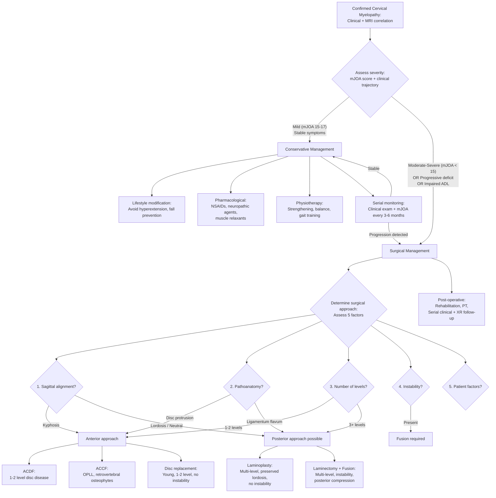

## Management of Cervical Myelopathy

### Guiding Principles

Before diving into the specifics, let's establish the key principles that govern management decisions. These come directly from understanding the pathophysiology:

1. **The spinal cord is unforgiving** — unlike peripheral nerves, the spinal cord has very limited capacity for regeneration. Once neurons and axons are lost, they do not come back. This means **early intervention matters**.
2. ***Maximal damage occurs at the time of injury (primary injury)*** [1]. ***Inappropriate or delayed management can result in further oedema and cord damage (secondary injury) which is preventable*** [1]. This applies to both traumatic and degenerative myelopathy — the goal is to prevent secondary deterioration.
3. ***The spinal cord is very unforgiving*** [3]. ***Sphincter dysfunction — a point of no return*** [3]. By the time sphincteric dysfunction develops, significant irreversible cord damage has occurred. This underscores the importance of early detection and treatment.
4. ***Complete injury — prognosis is generally poor. Incomplete injury — prognosis highly variable*** [3].

<Callout title="The Natural History Problem" type="error">
The natural history of cervical spondylotic myelopathy is **progressive deterioration** in the majority of patients. Studies show that ~75% of untreated patients with moderate-severe CSM will worsen over time. This is NOT a condition where "wait and see" is safe in most cases. Conservative management is reserved only for **truly mild, stable** disease.
</Callout>

---

### Overview of Management Options

Management of cervical myelopathy broadly divides into:

| Approach | When to Use |
|---|---|
| **Non-operative (conservative)** | Mild myelopathy (high mJOA ≥ 15), stable symptoms, no progressive deficit, patient unfit for surgery |
| **Operative (surgical)** | Progressive neurological deficit, moderate-severe myelopathy (mJOA < 15), significantly impaired ADL, compatible imaging findings |

***Management: surgical decompression and stabilization*** [2]:
- ***Non-operative: NSAID, lifestyle modification, PT*** [2]
- ***Operative: surgical decompression and restoration of lordosis — Laminoplasty / Laminectomy +/- fusion*** [2]

---

### Non-Operative (Conservative) Management

Conservative treatment does **not** cure cervical myelopathy — it cannot remove the structural compression. Its role is to manage symptoms, prevent further injury, and buy time in patients with mild disease who are being monitored or who are unfit for surgery.

#### Indications for Conservative Management

- Mild myelopathy (mJOA 15–17) with **stable** symptoms over serial assessments
- Patient is unfit for surgery (severe comorbidities, anaesthetic risk)
- Patient declines surgery (after informed discussion about natural history)
- Very early presentation with minimal functional impairment

<Callout title="Critical Caveat" type="error">
Conservative management of cervical myelopathy requires **close serial monitoring** (clinical examination + repeat JOA scoring every 3–6 months). Any evidence of progression mandates re-evaluation for surgery. There is strong evidence from the AOSpine CSM North America and International studies that patients with moderate-severe myelopathy do better with surgery than with conservative management.
</Callout>

#### Components of Conservative Management

**1. Lifestyle Modification**

- **Avoidance of high-risk activities**: no contact sports, no diving, no heavy overhead work — any activity that involves cervical hyperextension or axial loading increases the risk of acute deterioration.
- **Neck care education**: avoid prolonged extension (e.g., looking up for extended periods, sleeping with multiple pillows causing extreme flexion or extension).
- **Fall prevention**: particularly important in the elderly with gait instability. Home modifications, walking aids if needed.

*Why?* The degenerative cervical spine with stenosis has minimal reserve. A minor hyperextension injury (even a stumble) can cause ***acute-on-chronic myelopathy*** or ***central cord syndrome*** [3]. Prevention of such events is paramount.

**2. Pharmacological**

- ***NSAIDs*** [2]: for associated neck pain from spondylosis/facet joint arthritis. These treat the pain from the degenerative process — they do NOT treat the myelopathy itself (remember: ***pain is not a predominant feature*** [1] of myelopathy).
- **Neuropathic pain agents** (gabapentin, pregabalin): if there is concurrent radiculopathic pain (neuropathic character).
- **Muscle relaxants** (e.g., baclofen, tizanidine): for spasticity. These act centrally on GABA receptors (baclofen = GABA-B agonist) or alpha-2 adrenergic receptors (tizanidine) to reduce spastic tone.

*Important: No medication reverses myelopathy. Pharmacological treatment is purely symptomatic.*

**3. Physiotherapy (PT)** [2]

- Cervical strengthening exercises (deep neck flexor strengthening)
- Postural training
- Balance and gait training (to reduce falls risk)
- Range of motion exercises (gentle — avoiding extremes of extension)
- Proprioceptive training

***Physical therapy*** [1]: for radiculopathy, evidence supports ***traction, ROM exercises, strength training and stretching*** [1]. For myelopathy, PT is more focused on maintaining function, improving balance, and preventing deconditioning.

**4. Cervical Collar / Immobilisation**

- ***Limited evidence for use of neck collar and bedrest*** [1] — this is specifically stated for radiculopathy and applies to myelopathy as well.
- Soft collar may provide comfort and a kinesthetic reminder to limit extreme neck movements, but there is no evidence it alters the course of myelopathy.
- Hard collar may be used temporarily after acute-on-chronic exacerbation to limit dangerous movements while surgical planning is underway.

---

### Operative (Surgical) Management

Surgery is the **definitive treatment** for cervical myelopathy. The fundamental goal is to **decompress the spinal cord** — physically remove the pressure that is crushing it — and, where indicated, to **stabilise the spine** to prevent recurrent compression.

#### Indications for Surgery

***Indications for surgery in CSM*** [1]:
- ***Progressive neurologic deficit***
- ***Significantly impaired ADL (JOA score)***
- ***Compatible imaging findings***

***Principles of management — surgical treatment if*** [3]:
- ***Progressive neurological deficit***
- ***Myelopathy / Radiculopathy***
- ***Intractable pain***

***Indications for surgery*** (trauma context, but principles apply broadly) [1]:
- ***Structural: Instability***
- ***Decompression: Neurological deficit; Lack of improvement / deteriorating neurology***
- ***Polytrauma: To facilitate mobilization and rehabilitation***

**In practical terms**, the decision for surgery is made when:

| Factor | Threshold |
|---|---|
| Neurological deficit | Progressive worsening on serial examination |
| Functional impairment | mJOA < 15 (moderate), or < 12 (severe) |
| Imaging | MRI showing cord compression ± intramedullary T2 signal change correlating with clinical level |
| Duration | Some evidence that earlier surgery (before significant cord damage) leads to better outcomes |

<Callout title="Don't Wait Too Long">
The evidence strongly supports that **earlier surgery yields better outcomes**. The presence of T2 intramedullary signal change (***myelomalacia*** [1]) on MRI indicates that cord damage has already occurred. Patients operated on before signal change develops have significantly better recovery rates. ***Sphincter dysfunction is a point of no return*** [3] — by the time bladder dysfunction appears, recovery is limited.
</Callout>

#### Surgical Goals

1. **Decompress the spinal cord** — remove the compressive pathology
2. ***Restoration of lordosis*** [2] — restore normal cervical alignment
3. **Stabilise the spine** — if instability is present or created by the decompression
4. **Preserve motion** — where possible (e.g., laminoplasty preserves more motion than fusion)

#### Choice of Surgical Approach

This is one of the most important clinical decisions and is the focus of much of the lecture material.

***Choice of surgery*** [1]:
- ***Decompression: Anterior / Posterior***
- ***Stabilisation: Internal (Anterior / Posterior) / External***

***General considerations: Anterior vs posterior approach*** [1]:

| ***Factor*** | ***Favours Anterior*** | ***Favours Posterior*** |
|---|---|---|
| ***1. Sagittal alignment*** | ***Fixed kyphotic deformities*** — you need to go anteriorly to correct the kyphosis and decompress the cord which is draped over the front | Preserved lordosis or neutral alignment — cord can fall back away from anterior compression once posterior decompression is performed |
| ***2. Pathoanatomy*** | ***Disc protrusions into the spinal cord*** — these are anterior structures; direct anterior approach removes the offending disc | ***Infolding / thickening of ligamentum flavum*** — this is a posterior structure; posterior approach directly addresses it |
| ***3. Number of levels*** | 1–2 levels (some say up to 3) | ***3 level pathology or more favours posterior approach*** — anterior approaches spanning > 3 levels have higher complication rates (pseudarthrosis, graft subsidence) |
| ***4. Subluxation or instability*** | ***Fusion is indicated*** [1] — can be done anteriorly or posteriorly, but instability generally requires fusion (not laminoplasty alone) | |
| ***5. Neck pain*** | | ***Laminoplasty patients may experience more post-op axial neck pain*** [1] — this is a consideration but not a contraindication |

#### Anterior Surgical Approaches

**A. Anterior Cervical Discectomy and Fusion (ACDF)**

- **What it is:** Access the cervical spine from the front (anterior approach between the carotid sheath laterally and the trachea/oesophagus medially). Remove the disc at the offending level. Place a graft (bone or cage) in the disc space. Fixate with a plate and screws.
- **Mechanism:** Directly removes the anterior compressive pathology (disc, small osteophyte) and fuses the segment to prevent re-compression.
- **Indications:**
  - 1–2 level cervical spondylotic myelopathy
  - ***Disc protrusions into the spinal cord*** [1]
  - ***Fixed kyphotic deformity*** [1] (can correct alignment)
  - Concurrent radiculopathy (***anterior cervical discectomy and fusion*** [1])
- **Advantages:** Direct removal of anterior pathology; excellent for kyphosis correction; can be combined with foraminotomy for radiculopathy
- **Disadvantages:** Loss of motion at fused segment; risk of adjacent segment disease (ASD) — the levels above and below the fusion bear increased stress; risk of graft/cage subsidence
- **Specific complications:** Dysphagia (oesophageal retraction), recurrent laryngeal nerve palsy (hoarseness), vertebral artery injury, graft dislodgement, pseudarthrosis (failure of fusion), adjacent segment disease

***For radiculopathy: anterior cervical discectomy and fusion, artificial disk replacement*** [1]

**B. Anterior Cervical Corpectomy and Fusion (ACCF)**

- **What it is:** Removes one or more vertebral bodies (not just the disc) along with the adjacent discs, then reconstructs with a strut graft and plate.
- **Mechanism:** Provides wider decompression than ACDF — removes both discs and the intervening vertebral body with its posterior osteophytes. Necessary when OPLL extends behind the vertebral body (cannot be reached by discectomy alone).
- **Indications:**
  - OPLL (especially continuous type extending behind vertebral bodies)
  - Multi-level anterior compression (2–3 level corpectomy)
  - Severe retrovertebral body osteophytes
  - ***Anterior corpectomy*** [3]
- **Disadvantages:** Larger procedure; higher complication rate than ACDF; graft-related complications (dislodgement, subsidence)

**C. Artificial Disc Replacement (Cervical Total Disc Arthroplasty)**

- ***Artificial disk replacement*** [1]
- **What it is:** After discectomy, instead of fusion, an artificial disc device is placed to maintain motion at that segment.
- **Indication:** Primarily for 1–2 level disease in younger patients where motion preservation is desired and there is no significant instability.
- **Advantage:** Preserves motion → theoretically reduces adjacent segment disease.
- **Contraindication:** Significant instability, severe facet joint arthropathy, OPLL, multi-level disease, osteoporosis.

#### Posterior Surgical Approaches

**D. Laminoplasty**

- **What it is:** The laminae are opened on one side (hinge) and propped open with a spacer, expanding the spinal canal like opening a door. The word breaks down: "lamino-" = lamina, "-plasty" = to mold/reshape.
- **Mechanism:** Expands the spinal canal posteriorly → the cord drifts backward away from anterior compressive pathology → indirect decompression without removing the anterior pathology.
- **Indications:**
  - ***3 or more levels of pathology*** [1]
  - Multi-level spondylotic myelopathy
  - OPLL (when anterior approach is too risky)
  - **Preserved or lordotic cervical alignment** (the cord must be able to drift backward — if there is kyphosis, the cord is tethered anteriorly and will NOT drift back)
- **Advantages:** Preserves motion (no fusion required); lower pseudarthrosis risk; can decompress multiple levels in one procedure
- **Disadvantages:** ***Laminoplasty patients may experience more post-op axial neck pain*** [1]; does NOT correct kyphosis; does not address anterior pathology directly; risk of door closure (hinge fracture); C5 palsy (segmental motor paralysis — see complications)
- **Contraindication:** Kyphotic alignment (***fixed kyphotic deformities favour anterior approach*** [1])

**E. Laminectomy ± Fusion**

- ***Laminectomy +/- fusion*** [2]
- **What it is:** Complete removal of the laminae at the affected levels. If fusion is added, lateral mass screws and rods are placed to stabilise the spine.
- **Mechanism:** Removes the posterior bony arch entirely → maximal posterior decompression. Fusion prevents post-laminectomy instability and kyphosis.
- **Indications:**
  - Multi-level myelopathy (≥ 3 levels)
  - ***Infolding / thickening of ligamentum flavum*** [1]
  - Posterior compression
  - When fusion is also needed (instability, spondylolisthesis)
- **Laminectomy alone (without fusion):** Rarely performed now because removal of the posterior elements destabilises the spine → progressive kyphotic deformity → recurrent cord compression. Almost always combined with instrumented fusion in current practice.
- **Advantages:** Maximum decompression; can address instability simultaneously
- **Disadvantages:** Loss of motion at fused segments; muscle dissection and denervation (posterior approach is more muscle-destructive); risk of adjacent segment disease

**F. Posterior Cervical Foraminotomy**

- ***Posterior cervical foraminotomy*** [1]
- **What it is:** Keyhole decompression of the neural foramen from behind. A small part of the facet joint and lamina is removed to free the nerve root.
- **Indication:** This is primarily for **radiculopathy** (not myelopathy) — specifically for lateral/foraminal disc herniations or foraminal osteophytes compressing a single nerve root.
- **Advantage:** Motion-preserving (no fusion needed)
- **NOT typically used for myelopathy** (does not adequately decompress the central spinal canal)

#### Summary Table: Surgical Options

| Procedure | Approach | Levels | Key Indication | Motion Preserved? |
|---|---|---|---|---|
| **ACDF** | Anterior | 1–2 | Disc herniation, kyphosis, instability | No (fusion) |
| **ACCF** | Anterior | 1–3 bodies | OPLL, retrovertebral osteophytes | No (fusion) |
| **Disc replacement** | Anterior | 1–2 | Young patient, motion preservation desired | Yes |
| **Laminoplasty** | Posterior | ≥ 3 | Multi-level, preserved lordosis, no instability | Yes (partial) |
| **Laminectomy + fusion** | Posterior | ≥ 3 | Multi-level, instability, posterior compression | No (fusion) |
| **Foraminotomy** | Posterior | 1 | Radiculopathy (not myelopathy) | Yes |

---

### Special Situations

#### 1. Acute Traumatic Cervical Myelopathy / Spinal Cord Injury

***Principles of management*** [3]:
- ***Resuscitation (NB: spinal shock)***
- ***Collar and log roll to protect spine***
- ***Assume multiple injury / head injury***
- ***Imaging studies***
- ***Methylprednisolone (?)***
- ***Surgery to decompress spinal cord***
- ***Mechanical stabilisation***
- ***Prevent / Treat complications***
- ***Rehabilitation***

***Cervical spine stabilization*** [1]:
- ***Rigid collar (correct size)***
- ***Sand-bags and tape***
- ***Skull traction***

***Management — primary and secondary injury*** [1]:
- ***Maximal damage occurs at the time of injury (primary injury)***
- ***Inappropriate or delayed management can result in further oedema and cord damage (secondary injury) which is preventable***

**Methylprednisolone controversy:** The NASCIS (National Acute Spinal Cord Injury Study) trials suggested high-dose methylprednisolone within 8 hours of acute SCI may have marginal benefit. However, subsequent analysis showed significant complications (infection, GI bleeding, pneumonia). **Current guidelines (2024–2026) do NOT recommend routine methylprednisolone for acute SCI** — it is at best "an option" and at worst harmful. The lecture slides appropriately flag this with a question mark [3].

**Timing of surgery:** For acute traumatic myelopathy, current evidence (STASCIS trial, Fehlings et al.) supports **early decompression within 24 hours** of injury for incomplete SCI, as this improves neurological outcomes.

#### 2. Spinal Tumours

***Principles of management*** [3]:
- ***Steroids to reduce oedema***
- ***Surgical resection within safety limit***
- ***Intraoperative monitoring with motor evoked potential (MEP) and somatosensory evoked potential (SSEP)***
- ***Adjuvant radiotherapy for some***

***For metastasis*** [3]:
- ***Primarily external radiation therapy (ERT)***
- ***Surgery for pain, instability, or lesions resistant to RT***
- ***Palliative in nature***

#### 3. Rheumatoid Arthritis

- Cervical involvement requires **surgical stabilisation** (typically posterior C1/C2 fusion for atlantoaxial subluxation using screws ± wiring).
- ***Use of RA medications reduces the incidence of cervical involvement*** [1] — good disease control with DMARDs/biologics is the best prevention.

#### 4. Epidural Abscess / TB Spine

- **Urgent surgical decompression** + **appropriate antimicrobials** (anti-TB regime for Pott's disease).
- Anterior approach often preferred (abscess is typically anterior to the cord; vertebral body debridement may be needed in TB).

---

### Management Algorithm

---

### Post-Operative Care and Rehabilitation

***Rehabilitation*** [3] is a critical component:

- **Immediate post-op:** Cervical collar (soft or hard depending on procedure); wound care; monitoring for neurological deterioration
- **Physiotherapy:** Early mobilisation, gait retraining, upper limb dexterity exercises, balance training
- **Occupational therapy:** Adaptive strategies for ADLs (if residual deficit)
- **Serial follow-up:** Clinical examination (JOA score), X-rays (check alignment, hardware position, fusion progress)
- **Adjacent segment monitoring:** Patients with fusion are at risk of accelerated degeneration at adjacent levels — long-term surveillance required

***Conclusion*** [3]:
- ***Acute paraplegia is an EMERGENCY***
- ***Early detection and investigation***
- ***Treatment depends on condition***
- ***Long-term issues with dysreflexia, neurogenic bladder, spasticity, contracture, and skin problems***

---

### Prognostic Factors

| Factor | Better Prognosis | Worse Prognosis |
|---|---|---|
| Duration of symptoms | Short (< 1 year) | Long (> 2 years) |
| Severity at presentation | Mild (mJOA ≥ 15) | Severe (mJOA < 12) |
| MRI signal change | No intramedullary signal | T2 hyperintensity (worse: T1 hypointensity) |
| Age | Younger | Older (> 70) |
| Number of levels | Single level | Multi-level |
| Cause | Disc herniation (softer, more responsive) | OPLL, severe spondylosis (harder, multi-level) |
| Completeness | Incomplete injury | Complete injury |
| Sphincter function | Preserved | ***Sphincter dysfunction — a point of no return*** [3] |

---

<Callout title="High Yield Summary — Management of Cervical Myelopathy">

**Conservative management** (mild, stable myelopathy only):
- Lifestyle modification (avoid hyperextension, fall prevention)
- NSAIDs for pain, muscle relaxants for spasticity
- Physiotherapy (strengthening, balance, gait)
- Serial monitoring with mJOA every 3–6 months — any progression → surgery

**Indications for surgery:**
- ***Progressive neurologic deficit***
- ***Significantly impaired ADL (JOA score)***
- ***Compatible imaging findings***

**5 factors guiding anterior vs posterior approach:**
1. ***Sagittal alignment***: kyphosis → anterior
2. ***Pathoanatomy***: disc → anterior; ligamentum flavum → posterior
3. ***Number of levels***: 1–2 → anterior; ≥ 3 → posterior
4. ***Instability***: fusion is indicated
5. ***Neck pain***: laminoplasty may cause more post-op axial neck pain

**Surgical options:**
- Anterior: ACDF, ACCF, disc replacement
- Posterior: Laminoplasty, laminectomy + fusion
- Decompression and restoration of lordosis is the goal

**Key principles:**
- Spinal cord is unforgiving — early surgery yields better outcomes
- Sphincter dysfunction = point of no return
- T2 signal change on MRI = cord damage already present → operate before this develops
- Methylprednisolone for acute SCI: NOT routinely recommended

</Callout>

---

<ActiveRecallQuiz
  title="Active Recall - Management of Cervical Myelopathy"
  items={[
    {
      question: "List the 3 indications for surgery in cervical spondylotic myelopathy as stated in the lecture slides.",
      markscheme: "(1) Progressive neurologic deficit. (2) Significantly impaired ADL as measured by JOA score. (3) Compatible imaging findings (MRI showing cord compression correlating with clinical level)."
    },
    {
      question: "A 55-year-old patient has 4-level cervical spondylotic myelopathy with preserved cervical lordosis, predominant compression from hypertrophied ligamentum flavum, and no instability. What surgical approach and procedure would you recommend? Explain your reasoning using the 5 factors.",
      markscheme: "Posterior approach with laminoplasty. Reasoning: (1) Sagittal alignment: lordosis preserved — posterior approach is suitable (cord can drift back). (2) Pathoanatomy: ligamentum flavum is a posterior structure — posterior approach directly addresses it. (3) Number of levels: 4 levels — favours posterior (3+ levels). (4) Instability: absent — laminoplasty without fusion is appropriate. (5) No kyphosis to correct anteriorly. Laminoplasty preserves motion, which is an advantage."
    },
    {
      question: "Why is a fixed kyphotic deformity a contraindication to posterior-only decompression such as laminoplasty?",
      markscheme: "Posterior decompression works by allowing the cord to drift posteriorly away from anterior compression. In kyphosis, the cord is draped and tethered over the anterior vertebral bodies like a bowstring — it cannot drift backward even if the posterior canal is opened. Therefore, anterior decompression is needed to directly remove the pathology the cord is compressed against, and to correct the kyphotic alignment."
    },
    {
      question: "What are the key components of conservative management for mild cervical myelopathy, and why is serial monitoring essential?",
      markscheme: "Components: (1) Lifestyle modification — avoid hyperextension, fall prevention. (2) NSAIDs for associated spondylotic pain. (3) Physiotherapy — strengthening, balance, gait training. (4) Muscle relaxants for spasticity. Serial monitoring (mJOA every 3-6 months) is essential because the natural history of CSM is progressive deterioration in the majority. Any progression in neurological deficit or functional decline mandates re-evaluation for surgery. Early intervention before irreversible cord damage yields better outcomes."
    },
    {
      question: "Compare ACDF and laminoplasty: give one advantage and one disadvantage of each.",
      markscheme: "ACDF: Advantage — directly removes anterior compressive pathology (disc, osteophytes) and can correct kyphosis. Disadvantage — loss of motion at fused segment; risk of adjacent segment disease. Laminoplasty: Advantage — preserves motion (no fusion); can decompress multiple levels. Disadvantage — does not address anterior pathology directly; cannot be used in kyphosis; may cause more post-operative axial neck pain."
    },
    {
      question: "In the context of acute traumatic cervical myelopathy, what does 'secondary injury' mean and how is it prevented?",
      markscheme: "Secondary injury refers to further spinal cord damage that occurs after the initial (primary) traumatic insult, caused by oedema, ischaemia, inflammation, and ongoing mechanical instability. It is preventable by: (1) Immediate spinal immobilisation (rigid collar, log roll). (2) Avoid hypotension and hypoxia (resuscitation). (3) Early imaging to identify compression. (4) Early surgical decompression (within 24 hours for incomplete SCI). (5) Mechanical stabilisation to prevent further movement-related cord injury. Methylprednisolone is no longer routinely recommended."
    }
  ]}
/>

## References

[1] Lecture slides: GC 227. Cervical Spine Pathology.pdf (pp. 29, 36, 37, 38, 47, 48, 49, 62, 84, 87, 88)
[2] Senior notes: maxim.md (sections 2.4, 2.5)
[3] Lecture slides: GC 110. Paraplegia Spinal cord compression Transverse myelitis Spinal dysraphism Neuroimaging III Spinal Cord.pdf (pp. 16, 20, 22, 27)
