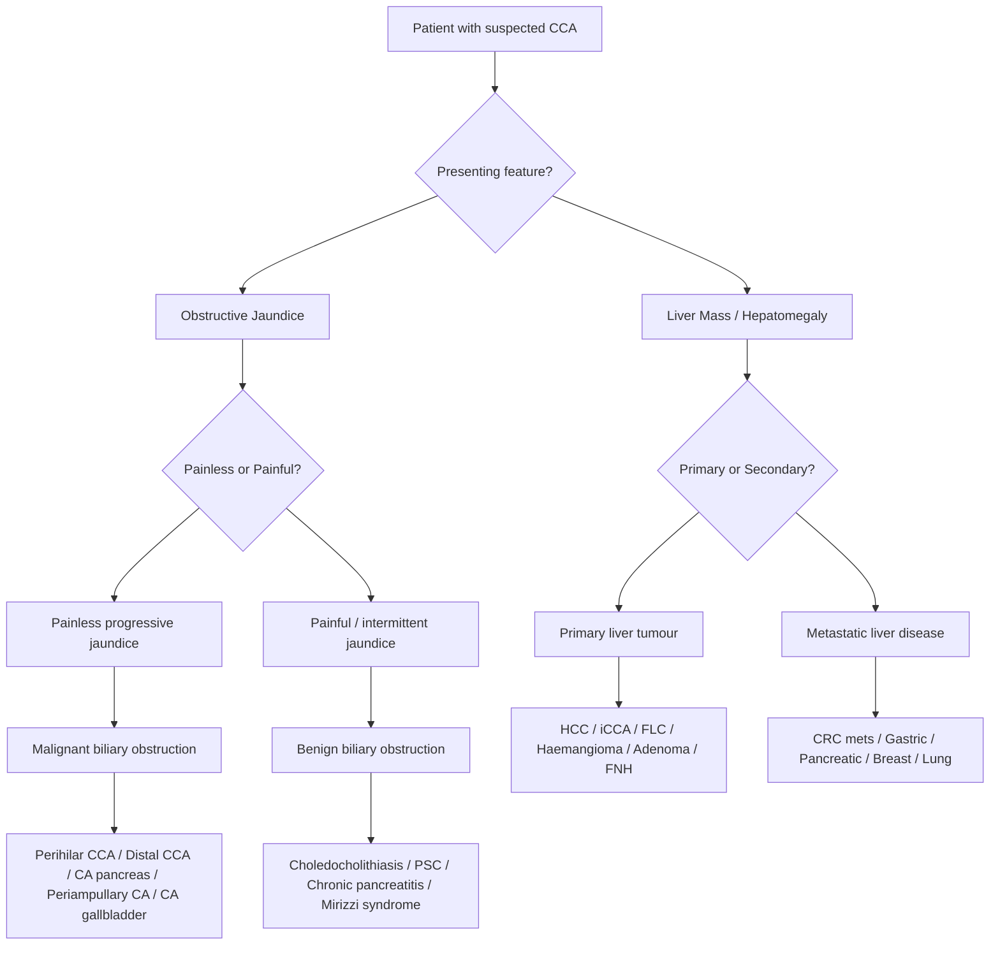

## Differential Diagnosis of Cholangiocarcinoma

The differential diagnosis of cholangiocarcinoma depends entirely on **how the patient presents**. Think about it from first principles: a patient walks into your clinic — what do they look like? There are essentially **two main clinical scenarios:**

1. **Obstructive jaundice** (extrahepatic CCA — perihilar or distal)
2. **Liver mass / hepatomegaly** (intrahepatic CCA)

Each scenario has its own differential. Let's work through them systematically.

---

### Framework: Approach by Clinical Presentation

---

### A. Differential Diagnosis of Obstructive Jaundice (Extrahepatic CCA)

When a patient presents with **painless progressive obstructive jaundice**, you need to think about causes at **three anatomical levels**: intraluminal, mural, and extramural. This is the classic surgical approach [8].

***Painless progressive obstructive jaundice in elderly is malignant biliary obstruction until proven otherwise*** [8]

#### Differentiating Stone vs Tumour

This is one of the most important clinical distinctions to make at the bedside. The history alone often tells you the answer [8]:

| Feature | ***Stone*** | ***Tumour*** |
|---------|-----------|------------|
| ***Jaundice*** | ***Intermittent (stone may pass out)*** | ***Progressive. For HCC, jaundice only when functional liver reserve drops to 25%*** |
| ***Pain*** | ***Painful: as stones go through Ampulla of Vater*** | ***Painless (until advanced). Except CA pancreatic head: well innervated, spread to coeliac ganglion early*** |
| ***Infection (fever)*** | ***More likely: accumulation of bile refluxed from GI tract (normally prevented by ampulla of Vater)*** | ***Until late stage, malnourished*** |
| ***Others*** | | ***Constitutional Sx: LOW, LOA, night sweats*** |

**Why is stone jaundice intermittent but tumour jaundice progressive?**
- A gallstone can act as a ball-valve — sometimes it obstructs the CBD, sometimes it dislodges and bile flows again. Hence the jaundice waxes and wanes.
- A tumour grows relentlessly. Once it narrows the duct, it only gets worse. The obstruction never relieves spontaneously.

**Why is stone disease more commonly associated with fever?**
- When a stone obstructs the CBD, stagnant bile becomes infected (bacteria from the duodenum reflux upwards). The stone creates a closed space → pressure builds → bacteria translocate into the bloodstream → cholangitis/sepsis.
- Tumours obstruct more gradually, and until the duct is completely occluded, some bile still flows → less stasis → less infection (until late stage).

#### 1. Malignant Causes of Biliary Obstruction (MBO)

***Pathology causing malignant biliary obstruction:*** [9][10]

**i. Cholangiocarcinoma at hilum (Klatskin tumour)**
- ***Cholangiocarcinoma at hilum, Klatskin tumour*** [9]
- ***Obstruction to just left or right hepatic duct alone will not cause obstructive jaundice*** [1] — you need bilateral obstruction or obstruction at the confluence for clinical jaundice. Why? Because the contralateral liver lobe continues to excrete bilirubin through its unobstructed duct.

**ii. Carcinoma of Head of Pancreas**
- ***Carcinoma of pancreas*** [9]
- The most common cause of malignant obstructive jaundice overall
- 70% of pancreatic cancers are in the head → they compress or invade the intrapancreatic CBD → progressive painless jaundice
- ***Severe epigastric pain radiating to the back*** is characteristic (retroperitoneal infiltration of coeliac plexus) — but this is a feature of body/tail tumours rather than head tumours [11]
- ***Double duct sign*** on CT/MRCP: simultaneous dilatation of both the CBD and pancreatic duct — highly suggestive of pancreatic head cancer [11]

**iii. Periampullary Carcinoma**
- ***Periampullary carcinoma*** [9][10]
- This is a group term for tumours arising at or near the ampulla of Vater, including:
  - ***Carcinoma of the ampulla of Vater*** — has the **best prognosis** among periampullary tumours because it presents **earlier** (even a small tumour at the ampulla blocks bile flow and causes jaundice) [1]
  - ***Carcinoma of the duodenum*** [9][10]
  - ***Carcinoma of lower end of (distal) CBD*** [1]
  - ***Carcinoma of head of pancreas*** [1]
- These are grouped because their presentation (painless jaundice) and surgical management (Whipple procedure) are similar [1]

**iv. Carcinoma of Gallbladder**
- ***Carcinoma of gallbladder — cystic duct LN, direct infiltration of CBD, tumour fragments*** [9]
- Can cause obstructive jaundice by three mechanisms [1]:
  - Spread to cystic duct lymph nodes → extrinsic compression of CBD
  - Direct infiltration of CBD
  - Tumour fragments breaking off into the CBD

**v. Hepatocellular Carcinoma (HCC)**
- ***HCC — direct infiltration, compression, tumour fragments in CBD*** [9]
- ***Usually occurs when mass is situated near confluence site of left and right intrahepatic ducts*** [1]
  - ***From anterior liver = Segment 4/5*** [1]
  - ***From posterior liver = Caudate segment (uncommon)*** [1]
- HCC causing obstructive jaundice is NOT common — it is much more likely to cause jaundice from **loss of hepatic reserve** in the cirrhotic liver [12]

**vi. Secondary Lymphadenopathy**
- ***Porta lymphadenopathy*** [10]
- ***Lymph node metastases to the coeliac axis or porta hepatis*** [13]
- ***Carcinoma of stomach with metastatic lymph node in the porta hepatis*** [13]
- ***GI malignancy (CRC), Lymphoma*** [1]
- Extrinsic compression of the bile duct by enlarged lymph nodes at the hepatoduodenal ligament

<Callout title="Causes of MBO by Level of Obstruction" type="idea">

Think anatomically — what structure is obstructed and at which level? [1]

**Hilum:** CA gallbladder, HCC, Klatskin tumour, Mirizzi syndrome, Porta lymphadenopathy, PSC, RPC

**Mid-CBD:** CA CBD, CA head of pancreas, Lymphadenopathy

**Distal CBD:** Bile duct strictures, Periampullary carcinoma, Choledochal cysts, Pancreatic cysts, Chronic pancreatitis
</Callout>

#### 2. Benign Causes of Biliary Obstruction

***Benign causes of biliary obstruction:*** [1]

**i. Choledocholithiasis**
- ***Choledocholithiasis*** [2]
- Most common benign cause of obstructive jaundice
- Key differentiating feature: **intermittent jaundice with pain and fever** (Charcot's triad) vs. the painless progressive jaundice of CCA

**ii. Primary Sclerosing Cholangitis (PSC)**
- ***Primary sclerosing cholangitis (PSC)*** [2]
- Creates multifocal strictures with a "beaded" appearance on MRCP
- Important: PSC itself is a **risk factor** for CCA, and a **dominant stricture** in PSC may represent superimposed CCA → always suspect malignancy in any PSC patient with worsening jaundice or a new dominant stricture
- ***Common in Westerners, less common in Asia*** [3]

**iii. IgG4-Related Sclerosing Cholangitis**
- A critical mimic of CCA! Can produce a stricture that looks identical to CCA on imaging
- Elevated serum IgG4 level is a clue
- **Responds dramatically to corticosteroids** — which CCA obviously does not
- Always check ***serum IgG4*** before assuming a biliary stricture is malignant [2]

<Callout title="IgG4-Related Cholangitis vs CCA" type="error">
This is a classic exam pitfall and a real clinical trap. IgG4-related sclerosing cholangitis can mimic CCA so closely that patients undergo unnecessary surgery. Always check IgG4 levels in any patient with a biliary stricture, especially if there is concurrent autoimmune pancreatitis (type 1). A trial of steroids may be warranted before committing to surgery.
</Callout>

**iv. Primary Biliary Cholangitis (PBC)**
- ***Primary biliary cirrhosis (PBC)*** [2] (now renamed Primary Biliary Cholangitis)
- Autoimmune destruction of small intrahepatic bile ducts
- Anti-mitochondrial antibody (AMA) positive
- Predominantly affects middle-aged women
- Causes **intrahepatic** cholestasis rather than extrahepatic obstruction — so it causes cholestatic LFTs and pruritus, but the bile ducts are NOT dilated on imaging

**v. Other Benign Causes**
- ***Blood clot (Haemobilia) / Mucus / Foreign body / Tumour thrombus*** [1]
- ***Benign strictures: TB, Autoimmune, Iatrogenic, RPC*** [1]
- ***Chronic pancreatitis, Pancreatic cysts*** [1]
- ***Mirizzi syndrome — common hepatic duct obstruction caused by extrinsic compression from an impacted stone in the cystic duct or Hartmann's pouch of the gallbladder*** [1]

---

### B. Differential Diagnosis of Liver Mass / Hepatomegaly (Intrahepatic CCA)

When intrahepatic CCA presents as a liver mass, the differential is that of **any hepatic space-occupying lesion** [14]:

***Malignant liver tumours:*** [14]
- ***Primary: Hepatocellular carcinoma, Cholangiocarcinoma, Others (e.g. lymphoma)*** [14]
- ***Secondary: Metastasis from GI tract, Metastasis from other primary*** [14]

#### 1. Primary Malignant Liver Tumours

| Tumour | Key Distinguishing Features |
|--------|-----------------------------|
| ***Hepatocellular Carcinoma (HCC)*** | ***MC primary liver cancer (80%)*** [12]. AFP elevated. Arterial enhancement with portal venous washout on CT/MRI. Associated with HBV, cirrhosis. HepPar-1+, CK7− |
| **Intrahepatic CCA** | CK7+, CK19+, AFP negative. Peripheral rim enhancement, delayed central enhancement on CT. Desmoplastic stroma. Associated with PSC, RPC, flukes |
| ***Fibrolamellar carcinoma*** | ***Younger patients, not associated with HBV or cirrhosis; good prognosis*** [12]. Central scar with calcification. AFP usually normal |
| ***Hemangioendothelioma*** | Rare vascular tumour. Multiple hepatic nodules. Can occur in young adults |
| **Combined HCC-CCA** | Rare mixed tumour. AFP may be elevated. Behaves more aggressively than either alone |

**How to distinguish iCCA from HCC on imaging?**
- **HCC:** Arterial hyperenhancement → portal venous **washout** (the tumour "lights up then fades"). Classic LIRADS-5 pattern.
- **iCCA:** Peripheral arterial rim enhancement → progressive **centripetal fill-in** on delayed phase (because the dense desmoplastic stroma enhances slowly). Does NOT show washout.

#### 2. Benign Primary Liver Tumours

| Tumour | Key Features |
|--------|-------------|
| ***Haemangioma*** | Most common benign liver tumour. Peripheral nodular enhancement with centripetal fill-in (but slower and more complete than iCCA). Bright on T2 MRI |
| ***Hepatic adenoma*** | Associated with OCP use. Risk of haemorrhage and malignant transformation |
| ***Focal nodular hyperplasia (FNH)*** | Central scar. Homogeneous arterial enhancement. No malignant potential |

#### 3. Metastatic / Secondary Liver Tumours

***Metastatic carcinoma to liver is commoner than primary liver cancer*** [15]
***Commonest site from GI tract (portal venous circulation): colorectal, stomach, pancreas*** [15]

- Always look for a **primary source** — CRC is the most common (CEA elevated), followed by gastric, pancreatic, breast, lung
- ***Elevated CEA or CA 19-9 in some cases with primary GI malignancy*** [15]
- ***Investigation for primary: CXR, endoscopy, CT scan abdomen*** [15]
- Multiple liver lesions with a known primary → likely metastatic rather than primary liver cancer

#### 4. Other Causes

- ***Cysts (simple cyst, polycystic disease)*** [14]
- ***Liver abscess*** (pyogenic or amoebic) — fever, raised WCC, rim-enhancing lesion with internal debris
- ***Haematological malignancies (lymphoma, leukaemia, myeloproliferative disease)*** [14]

---

### C. Other Conditions Mimicking CCA

**i. Recurrent Pyogenic Cholangitis (RPC)**
- Can cause biliary strictures that mimic CCA on cholangiography
- ***Complications of RPC include cholangiocarcinoma*** [5] — so RPC and CCA can coexist
- Key clue: ***intrahepatic pigment stones, left lobe predilection, middle-age onset, recurrent cholangitis episodes*** [5]

**ii. Choledochal Cysts**
- ***Complications: cholangiocarcinoma*** [6]
- A choledochal cyst with a mural nodule or wall thickening should raise suspicion for malignant transformation

**iii. Viral Hepatitis**
- ***Viral hepatitis*** [2]
- Acute viral hepatitis can cause cholestatic LFTs mimicking biliary obstruction
- Key differences: hepatocellular pattern (ALT >> ALP), positive viral serology, no bile duct dilatation on imaging

---

### D. Pathology Producing Jaundice AND Epigastric Mass

This is a specific clinical scenario worth highlighting as it comes directly from the lecture [13]:

***Pathology producing jaundice and epigastric mass:*** [13]
- ***Hepatomegaly secondary to biliary obstruction***
- ***Hepatomegaly due to metastases or HCC***
- ***Lymph node metastases to the coeliac axis or porta hepatis***
- ***Carcinoma of stomach with metastatic lymph node in the porta hepatis***
- ***Distended stomach due to duodenal obstruction by tumour which obstructs the bile duct as well***

---

### E. Summary: DDx Listed by Felix Notes [2]

***Differential diagnosis of cholangiocarcinoma:***
- ***Choledocholithiasis***
- ***Viral hepatitis***
- ***Hepatocellular carcinoma***
- ***Malignant obstruction of biliary tract:***
  - ***Pancreatic cancer***
  - ***Cancer of the ampulla of Vater***
- ***Intrahepatic cholestasis:***
  - ***Primary sclerosing cholangitis (PSC)***
  - ***Primary biliary cirrhosis (PBC)***

---

### F. Key Differentiating Investigations (Preview)

When working up the differential, the following investigations help narrow the diagnosis:

| Investigation | What it tells you |
|--------------|-------------------|
| **LFT pattern** | Cholestatic (ALP >> ALT) = obstruction; Hepatocellular (ALT >> ALP) = hepatitis/HCC |
| **AFP** | Elevated → HCC (or rarely combined HCC-CCA). Normal in pure CCA |
| **CA 19-9** | Elevated in CCA, but also in CA pancreas, cholangitis, gallstones — not specific [2] |
| **CEA** | Elevated in CRC metastasis, can be mildly elevated in CCA [2] |
| ***IgG4*** | Elevated → IgG4-related sclerosing cholangitis (mimic of CCA) [2] |
| **AMA** | Positive → PBC |
| **Viral serology** | HBsAg/Anti-HCV → viral hepatitis / HCC risk |
| **USG** | Dilated ducts (obstruction) vs. mass lesion vs. stones |
| **CT/MRI** | Characterise mass, determine level of obstruction, assess resectability |
| ***FNAC/Trucut biopsy*** | ***ONLY for unresectable cases*** [3] — avoids needle-track seeding in potentially resectable disease |

---

<Callout title="High Yield Summary">

**Clinical approach to DDx:**
1. Determine if presentation is obstructive jaundice (extrahepatic CCA) or liver mass (intrahepatic CCA)
2. For obstructive jaundice: differentiate stone vs tumour (intermittent/painful/fever vs progressive/painless/constitutional)
3. For liver mass: differentiate HCC vs iCCA vs metastasis (AFP, imaging characteristics, IHC)

**Malignant causes of biliary obstruction (must know list from lectures):**
- CCA at hilum (Klatskin tumour)
- CA head of pancreas
- Periampullary carcinoma (ampulla, duodenum, distal CBD)
- CA gallbladder (cystic duct LN, direct infiltration, tumour fragments)
- HCC (compression from Seg 4/5, direct infiltration, tumour fragments in CBD)
- Porta lymphadenopathy (CRC, lymphoma, gastric cancer)

**Critical mimics of CCA:**
- IgG4-related sclerosing cholangitis (check IgG4, responds to steroids)
- PSC with dominant stricture (beaded appearance on MRCP)
- RPC (intrahepatic pigment stones, left lobe predilection)

**Key rule:** Painless progressive obstructive jaundice in elderly = malignant biliary obstruction until proven otherwise.
</Callout>

---

<ActiveRecallQuiz
  title="Active Recall - Differential Diagnosis of Cholangiocarcinoma"
  items={[
    {
      question: "List 6 malignant causes of biliary obstruction as taught in lectures.",
      markscheme: "1. Cholangiocarcinoma at hilum (Klatskin tumour). 2. CA head of pancreas. 3. Periampullary carcinoma (ampulla of Vater, duodenum, distal CBD). 4. CA gallbladder. 5. HCC (direct infiltration, compression, tumour fragments in CBD). 6. Porta lymphadenopathy (CRC, lymphoma, gastric CA)."
    },
    {
      question: "How do you clinically differentiate biliary obstruction caused by gallstones from that caused by a tumour?",
      markscheme: "Stone: intermittent jaundice, painful (colic), more likely to have fever/cholangitis, no constitutional symptoms. Tumour: progressive jaundice, painless (until advanced), less likely fever (until late), constitutional symptoms (LOW, LOA, night sweats)."
    },
    {
      question: "What is IgG4-related sclerosing cholangitis and why is it a critical differential for cholangiocarcinoma?",
      markscheme: "IgG4-related sclerosing cholangitis is an autoimmune condition causing biliary strictures that can be radiologically and clinically indistinguishable from CCA. It is critical because it responds to corticosteroids and does not require surgery. Serum IgG4 levels should be checked. Failure to consider it may lead to unnecessary surgery."
    },
    {
      question: "On cross-sectional imaging, how does intrahepatic CCA differ from HCC in enhancement pattern?",
      markscheme: "HCC: arterial hyperenhancement with portal venous washout (LIRADS-5 pattern). iCCA: peripheral arterial rim enhancement with progressive centripetal (delayed) fill-in due to desmoplastic stroma. iCCA does NOT show washout."
    },
    {
      question: "Why does obstruction of only the left or right hepatic duct alone NOT cause clinical jaundice?",
      markscheme: "Because the contralateral liver lobe continues to excrete bilirubin through its unobstructed duct. Jaundice only occurs when both hepatic ducts are obstructed (e.g. at the confluence) or when the common hepatic duct or CBD is blocked."
    }
  ]}
/>

## References

[1] Senior notes: felixlai.md (Biliary obstruction, causes by level)
[2] Senior notes: felixlai.md (Cholangiocarcinoma, sections IV–V, differential diagnosis)
[3] Lecture slides: WCS 064 - A large liver - by Prof R Poon [20191108].doc.pdf (p5, Cholangiocarcinoma)
[5] Senior notes: maxim.md (Recurrent pyogenic cholangitis section)
[6] Senior notes: maxim.md (Choledochal cyst section)
[8] Senior notes: maxim.md (Obstructive jaundice, stone vs tumour table)
[9] Lecture slides: WCS 056 - Painless jaundice and epigastric mass - by Prof R Poon.ppt (1).pdf (p23, Pathology causing MBO)
[10] Lecture slides: Malignant biliary obstruction.pdf (p5, Causes of MBO)
[11] Senior notes: maxim.md (Pancreatic carcinoma section)
[12] Senior notes: maxim.md (Hepatocellular carcinoma section)
[13] Lecture slides: WCS 056 - Painless jaundice and epigastric mass - by Prof R Poon.ppt (1).pdf (p32, Pathology producing jaundice and epigastric mass)
[14] Lecture slides: WCS 064 - A large liver - by Prof R Poon [20191108].doc.pdf (p2, Hepatomegaly DDx and Malignant liver tumours)
[15] Lecture slides: WCS 064 - A large liver - by Prof R Poon [20191108].doc.pdf (p6, Metastatic carcinoma to liver)
