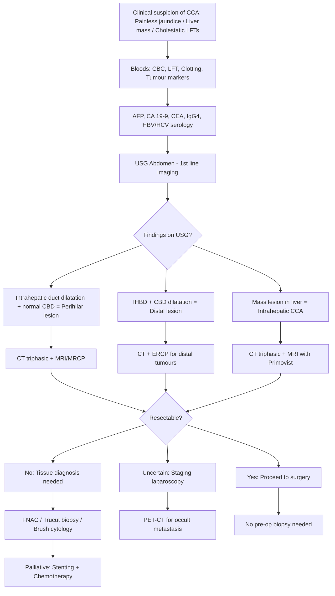

## Diagnosis of Cholangiocarcinoma

### Diagnostic Principles — The "Why" Behind the Workup

Before diving into individual tests, let's understand **what we're trying to achieve** when working up suspected cholangiocarcinoma. There are essentially **five diagnostic goals**, and every investigation serves at least one:

1. **Confirm biliary obstruction** — Is there truly an obstruction? At what level?
2. **Characterise the lesion** — Is it benign or malignant? What type of malignancy?
3. **Define the anatomy** — Exactly where is the tumour? How far does it extend along the ducts?
4. **Stage the disease** — Is there vascular invasion? Nodal metastasis? Distant metastasis?
5. **Assess resectability** — Can we offer curative surgery? Is the future liver remnant (FLR) adequate?

There is **no single diagnostic criterion** for CCA (unlike, say, the Tokyo Guidelines for cholangitis). The diagnosis is established through a **combination** of clinical features, biochemistry, imaging, and histology. Let me walk you through each component systematically.

---

### Diagnostic Algorithm

<Callout title="The Diagnostic Logic">
Start with bloods and USG (cheap, non-invasive, available). USG tells you IF there is obstruction and WHERE it is. Then get cross-sectional imaging (CT/MRI/MRCP) to characterise the lesion and assess resectability. Only get tissue diagnosis if the patient is NOT going to surgery (i.e., unresectable disease) — because biopsy risks tumour seeding along the needle tract.
</Callout>

---

## 1. Physical Examination

Physical examination is the first step and can give you crucial clues about the nature and level of obstruction.

### General Examination
- ***Jaundice*** [2] — scleral icterus first (detectable at bilirubin > 35–40 µmol/L)
- ***Cachexia, pallor*** [14] — suggests advanced malignancy
- ***Lymphadenopathy*** [14] — check left supraclavicular (Virchow's node), periumbilical (Sister Mary Joseph nodule)
- ***Chronic stigmata of liver disease*** [14] — spider naevi, palmar erythema, gynaecomastia → suggests underlying cirrhosis

### Abdominal Examination
- ***Hepatomegaly – size, tenderness, consistency, surface, edge, bruit*** [14]
  - iCCA: palpable mass with firm/hard consistency, irregular surface
  - Extrahepatic CCA: hepatomegaly from biliary obstruction (smooth, non-tender)
- ***Right upper quadrant tenderness*** [2]
- ***Palpable gallbladder*** [2]
  - ***Courvoisier's law: In painless jaundice if the gallbladder is palpable, it is unlikely to be due to gallstones and points towards biliary or pancreatic malignancy (lower end of CBD / head of pancreas / ampulla of Vater)*** [2]
  - **Why does Courvoisier's law work?** Gallstones develop chronically → chronic cholecystitis → fibrosed, contracted gallbladder → cannot distend. Malignant obstruction is "acute" to the gallbladder (the gallbladder was previously healthy) → distends with mucus under back-pressure [16]
  - **Remember:** Courvoisier's sign is positive only in **distal CCA** (obstruction below cystic duct insertion). In perihilar CCA (Klatskin tumour), the obstruction is ABOVE the cystic duct → gallbladder cannot fill → Courvoisier's sign is NEGATIVE
- ***Other organomegaly (spleen), mass, ascites*** [14]
- ***PR examination*** [14] — check for Blumer's shelf (peritoneal drop metastasis)

---

## 2. Biochemical Tests (Blood Investigations)

### 2.1 Complete Blood Count (CBC) with Differentials
- **Anaemia** — anaemia of chronic disease (normocytic normochromic) in malignancy; or iron deficiency from chronic blood loss
- **Leukocytosis** — if superimposed cholangitis; or pancytopenia if underlying cirrhosis with hypersplenism [16]
- **Thrombocytopenia** — important to check before any invasive procedure (ERCP, PTC, biopsy) [16]

### 2.2 Clotting Profile (PT/INR)
- ***↑ PT/INR*** [2]
- **Why?** Biliary obstruction → no bile salts in gut → no fat absorption → no absorption of fat-soluble vitamins (A, D, E, K) → **Vitamin K deficiency** → impaired synthesis of clotting factors II, VII, IX, X → prolonged PT/INR [16]
- **Clinical importance:** Must correct coagulopathy before any invasive procedure (give IV Vitamin K or FFP). This is also important pre-operatively.

### 2.3 Liver Function Tests (LFT)

This is where understanding the **pattern** matters more than individual values:

| Parameter | Finding in CCA | Explanation |
|-----------|---------------|-------------|
| ***ALP and GGT*** | ***↑↑↑ (Cholestatic pattern)*** | ALP is released from bile duct epithelium under cholestatic stress. ***Elevation of GGT can confirm excess ALP is of hepatobiliary origin*** [2] (as opposed to bone ALP) |
| ***AST and ALT*** | ***↑ (mild–moderate)*** | ***Transaminase level may initially be normal but will be elevated when chronic biliary obstruction leads to liver dysfunction*** [2]. This is hepatocyte "collateral damage" from back-pressure |
| ***Bilirubin*** | ***↑ (conjugated)*** | ***Elevated in extrahepatic cholangiocarcinoma; Normal or slightly elevated in intrahepatic cholangiocarcinoma*** [2] |
| **Albumin** | ↓ in advanced disease | Impaired hepatic synthetic function; also malnutrition/cachexia |

**Key pattern recognition:**
- **Cholestatic pattern** (ALP >> ALT): Suggests biliary obstruction → think CCA, CA pancreas, CBD stones
- **Hepatocellular pattern** (ALT >> ALP): Suggests hepatitis, drug injury → less likely CCA
- In CCA, expect **cholestatic pattern** with **conjugated hyperbilirubinaemia** [4]

### 2.4 Electrolyte Profile
- ***Hypercalcemia and hypophosphatemia*** [2]
  - ***Hypercalcemia of malignancy associated with low PTH and vitamin D levels*** [2]
  - Mechanism: PTHrP secretion by tumour (humoral hypercalcaemia of malignancy) — this is uncommon in CCA but can occur

### 2.5 Hepatitis Serology
- ***HBV and HCV serology*** [14]
- **Why?** To assess for underlying chronic liver disease/cirrhosis which affects both aetiology and surgical planning (cirrhotic livers tolerate less resection)

### 2.6 Serum AFP (Alpha-Fetoprotein)
- ***Serum AFP: Differentiate between intrahepatic cholangiocarcinoma and HCC*** [2]
- AFP is typically **normal** in pure CCA
- ***Rare combined hepatocellular-cholangiocarcinoma tumour may have high levels of AFP*** [2]
- ***AFP sensitivity in cholangiocarcinoma is only ~10%*** [17]
- In contrast, AFP is elevated in 70–90% of HCC

### 2.7 Serum IgG4
- ***Serum IgG4: Evaluate for the possibility of IgG4-related sclerosing cholangitis*** [2]
- **Why is this critical?** IgG4-related sclerosing cholangitis is the most important **benign mimic** of CCA. It creates strictures that look identical on imaging. If you miss it, you may subject a patient to unnecessary major hepatectomy for a disease that responds to steroids.

### 2.8 Tumour Markers

***Tumour markers: carcinoembryonic antigen (CEA), CA 19-9 (may or may not be elevated, nonspecific)*** [3]

#### CA 19-9

| Property | Detail |
|----------|--------|
| ***Upper normal limit*** | ***37 U/mL*** [17] |
| ***Sensitivity in CCA*** | ***~67–73% for biliary cancer*** [17] |
| ***Specificity*** | **Low** — elevated in many other conditions |
| **Clinical use** | ***Established serum marker for diagnosis of cholangiocarcinoma. Monitor effect of treatment and detect disease recurrence*** [2] |
| ***Also elevated in*** | ***Cholestatic diseases such as cholangitis and gallstones; Other cancers including gastric, pancreatic cancer and HCC*** [2] |
| **Important caveat** | ***Requires the presence of Lewis blood group antigen to be expressed*** [16] — ~5–10% of the population are Lewis antigen negative and will NEVER produce CA 19-9 regardless of the disease. A negative CA 19-9 in these patients is meaningless |

> **Why is CA 19-9 not a good screening test?** Because it lacks both sensitivity (misses ~30% of CCA) and specificity (elevated in many benign conditions like cholangitis and any cause of cholestasis). However, very high levels ( > 1000 U/mL) in the absence of cholangitis are more suggestive of malignancy.

> **Why is CA 19-9 still useful clinically?** For **serial monitoring** — a rising CA 19-9 after resection suggests recurrence; a falling CA 19-9 during chemotherapy suggests response.

#### CEA

- ***↑ CEA: May be elevated in cholangiocarcinoma but neither sensitive nor specific*** [2]
- ***Primarily a tumour marker for CRC but can be used in CC workup*** [2]
- ***Also elevated in GI diseases such as gastritis, peptic ulcer disease, diverticulitis and other cancers including lung, breast, gastric and colorectal cancer*** [2]
- ***CEA upper normal limit: 5 ng/mL*** [17]
- ***CEA sensitivity in CRC: 30–70%*** [17]

<Callout title="Tumour Markers — Bottom Line" type="error">
CA 19-9 and CEA are NOT sensitive and NOT specific enough for screening or definitive diagnosis. They are useful for prognostication and monitoring treatment response. Never exclude CCA based on normal tumour markers. Never diagnose CCA based on elevated tumour markers alone.
</Callout>

---

## 3. Radiological Investigations

### 3.1 Ultrasound (USG) Abdomen — First Line

***USG, CT scan, MRI*** [3]

USG is always the **initial imaging test** [2]. It is cheap, non-invasive, widely available, and radiation-free. Here's what it tells you:

**What to look for:**

| Finding | Significance |
|---------|-------------|
| **Bile duct dilatation** | ***Malignant obstruction is suggested by ductal dilatation ( > 6 mm in adults) in the absence of stones*** [2] |
| **Level of obstruction** | ***Perihilar lesion = Intrahepatic duct dilatation with normal extrahepatic duct*** [2]. ***Distal extrahepatic lesion = Intrahepatic AND extrahepatic duct dilatation*** [2] |
| **Mass lesion** | ***Intrahepatic cholangiocarcinoma usually presents as a malignant-appearing mass lesion in a non-cirrhotic liver*** [2] |
| **Gallstones** | ***Confirm biliary ductal dilatation and exclude gallstones*** [2] |
| **Vascular involvement** | ***Evaluate for vascular involvement with Duplex ultrasound: Encasement, compression or thrombosis of portal vein; Encasement or occlusion of hepatic artery*** [2] |

**Why does the level of ductal dilatation tell you the level of obstruction?**
- If only **intrahepatic ducts** are dilated but the CBD is normal → the block is at the **hilum** (perihilar CCA)
- If **both intrahepatic and extrahepatic ducts** are dilated → the block is at the **distal CBD** (distal CCA or pancreatic head cancer)
- This is analogous to diagnosing the level of a river dam by seeing which tributaries are flooded

***Invasion into portal vein or hepatic artery is an important finding as it may indicate surgical unresectability*** [2]

**Normal bile duct measurements:**
- Intrahepatic ducts: normally < 2–3 mm (often not visible on USG) [16]
- CBD: normal ≤ 6–8 mm in adults; ***CBD > 0.8 cm is pathological*** [16]
- ***CBD limit: 0.1 cm for every 10 years old*** (i.e., acceptable CBD diameter increases slightly with age and post-cholecystectomy) [8]

### 3.2 Contrast-Enhanced CT Scan (Triphasic / Multiphase)

***Contrast-enhanced multidetector-row helical triphasic CT scan*** [2]:

- ***Indicated in patients with suspected perihilar or intrahepatic cholangiocarcinoma*** [2]

**What CT tells you (the 4 key questions):**

| Question | CT Findings |
|----------|-------------|
| **Where is the tumour?** | ***Detect intrahepatic tumour, clarify level of biliary obstruction*** [2] |
| **What does the tumour look like?** | iCCA: peripheral rim enhancement with progressive centripetal fill-in (delayed enhancement due to desmoplastic stroma). pCCA: may see thickened enhancing bile duct wall |
| **Is there liver atrophy?** | ***Presence of liver atrophy*** [2] — ipsilateral lobar atrophy suggests chronic obstruction ± portal vein involvement. Atrophy-hypertrophy complex is a clue to longstanding perihilar CCA |
| **Is it resectable?** | ***Assessment for extra-regional LN involvement, invasion of critical adjacent structures and evidence of distant metastasis for tumour staging*** [2] |

**Why triphasic (three phases)?**
- **Arterial phase:** Shows hepatic arterial anatomy (surgical planning) and tumour arterial enhancement
- **Portal venous phase:** Shows portal vein anatomy, portal vein invasion/thrombosis, and liver parenchymal enhancement
- **Delayed phase (equilibrium):** Critical for CCA — the desmoplastic stroma of CCA enhances LATE, so delayed-phase images show the tumour best. This distinguishes CCA from HCC (which washes out on delayed phase)

***CT-guided biopsy can be obtained if a mass lesion is seen, with a risk of seeding the biopsy tract with malignant cells*** [2]

***Lower sensitivity than MRI scan to detect extra-regional nodal disease such as metastasis to periaortic, pericaval or celiac artery LN and peritoneum*** [2]

### 3.3 MRI / MRCP (Magnetic Resonance Imaging / Cholangiopancreatography)

MRCP deserves special attention because it is the **single most informative non-invasive investigation** for CCA, especially perihilar disease.

***MRCP = Non-contrast, T2-weighted*** imaging of the biliary system [8]

#### MRCP

- ***Indicated in patients with suspected perihilar or intrahepatic cholangiocarcinoma*** [2]
- ***Superior to ERCP for assessing tumour anatomy and resectability*** [2]
- ***Does NOT require contrast injection into ductal system unlike in ERCP and PTC*** [2]
- ***Higher sensitivity than CT scan to detect extra-regional nodal disease such as metastasis to periaortic, pericaval or celiac artery LN and peritoneum*** [2]

**What MRCP specifically shows:**
- Precise extent of ductal involvement (which Bismuth-Corlette type)
- Length of the stricture
- Presence/absence of intrahepatic metastases
- Biliary anatomy proximal to the obstruction (CT and ERCP cannot see ducts above a complete obstruction as well)

#### MRI Liver with Primovist (Gadoxetic acid)
- ***Liver-specific contrast (Primovist): superior to CT in detecting small HCC vs regenerative nodules*** [8] — also excellent for detecting small intrahepatic metastases from CCA
- Primovist is taken up by functioning hepatocytes → hepatobiliary phase at 20 minutes shows lesions that LACK hepatocyte function (tumours appear as "dark holes")
- Particularly useful for distinguishing iCCA from HCC

**MRI enhancement pattern of iCCA:**
1. **T1-weighted:** Hypointense mass
2. **T2-weighted:** Hyperintense (due to high water content and mucin)
3. **Arterial phase:** Peripheral rim enhancement
4. **Delayed phase:** Progressive centripetal enhancement (desmoplastic stroma retains contrast)
5. **Hepatobiliary phase (Primovist):** Hypointense (tumour cells are not hepatocytes → no Primovist uptake)

> This pattern is essentially opposite to HCC, which is hyperintense on arterial phase and hypointense on portal venous/delayed phase (washout).

### 3.4 Cholangiography (ERCP, PTC, Cholangioscopy)

These are **invasive investigations** that directly visualize the bile duct lumen and allow tissue sampling and therapeutic intervention.

#### ERCP (Endoscopic Retrograde Cholangiopancreatography)

- ***ERCP: indicated in patients with suspected distal extrahepatic cholangiocarcinoma*** [2]
- ***ERCP are both diagnostic and therapeutic*** [16]
- ***Direct visualization of the area of abnormality*** [2]
- ***Superior to MRCP by enabling biopsy with FNA or brush cytology and therapeutic intervention using stent placement*** [2]
- ***Involves injection of contrast into bile duct and hence risk for ascending cholangitis in cases of impaired biliary drainage*** [2]

**Key findings on ERCP cholangiogram:**
- Abrupt stricture with "apple-core" or "rat-tail" narrowing
- Shouldering (irregular margins of the stricture)
- Upstream ductal dilatation proximal to the stricture
- Non-passage of contrast beyond the stricture

**ERCP tissue sampling:**
- **Brush cytology:** Sensitivity ~40–70% (low because CCA is desmoplastic with few cancer cells)
- **Intraductal biopsy:** Slightly better sensitivity (~50–80%)
- **FISH (Fluorescence In Situ Hybridisation):** Can be performed on brush cytology specimens to detect polysomy, increasing sensitivity

***Cholangiography: ERCP for distal tumours, PTC for proximal tumours — define level of obstruction ± stenting*** [4]

#### PTC (Percutaneous Transhepatic Cholangiography)

- ***PTC: Preferred to ERCP in stricture/obstruction at or above the level of confluence of hepatic ducts*** [8]
- ***Examples: cholangiocarcinoma, PSC, RPC*** [8]
- **Why PTC for proximal lesions?** ERCP approaches from below — in perihilar CCA, the scope reaches the stricture but cannot opacify the ducts ABOVE the obstruction (you cannot push contrast past a complete block). PTC approaches from above via a transhepatic needle, directly opacifying the intrahepatic ducts proximal to the tumour.
- ***Permit direct visualization of the area of abnormality, enable biopsy with FNA or brush cytology and therapeutic intervention using stent placement*** [2]
- ***Complications: bacteraemia (thus antibiotic prophylaxis required), haemobilia*** [8]
- ***Largely replaced by MRCP and MDCT*** for diagnostic purposes [2] — now used mainly when therapeutic drainage is needed or ERCP has failed

#### Cholangioscopy (SpyGlass / Mother-Baby Cholangioscopy)

- Direct peroral visualization of the bile duct lumen using a miniaturized scope passed through the ERCP working channel
- Allows **direct visual inspection** of strictures and **targeted biopsies** under direct vision
- ***EUS with brush cytology can be performed but with low sensitivity and specificity for diagnosing cholangiocarcinoma; EUS cannot reach the lumen of bile duct in majority of cases which will require a mother-baby cholangioscopy*** [16]
- Significantly improves diagnostic yield compared to blind brush cytology (sensitivity ~75–90%)

### 3.5 Endoscopic Ultrasound (EUS) ± FNAC

- ***Endoscopic ultrasound ± FNAC or brush cytology*** [2]
- ***Indicated in patients with suspected distal extrahepatic cholangiocarcinoma*** [2]
- ***Enable biopsy with FNA or brush cytology*** [2]
- ***Assess local extent of primary tumour and status of regional LNs*** [2]
- ***Staging: EUS for nodal involvement*** [4]
- EUS is particularly good for:
  - Distal CBD lesions (the EUS transducer in the duodenum is very close to the distal CBD)
  - Regional lymph node sampling (EUS-guided FNA of suspicious nodes)
- **Limitation:** Not useful for perihilar lesions (too far from the EUS transducer) [16]

### 3.6 PET-CT (Positron Emission Tomography)

- ***PET scan with fluorodeoxyglucose (FDG) contrast*** [2]
- ***Evaluate for occult distant metastasis that MRCP and MDCT are unable to detect*** [2]
- FDG-PET detects metabolically active tissue — CCA cells have high glucose uptake (Warburg effect)
- **Sensitivity:** Good for mass-forming iCCA (~85–95%); lower for perihilar CCA (~50–60%) because the sclerosing/infiltrating growth pattern has less tumour cellularity and more fibrosis
- **Main role:** Detecting **occult metastases** (e.g., distant lymph nodes, peritoneal disease, bone) that would change management from curative to palliative
- **Limitation:** False positives in cholangitis, granulomatous disease, or any inflammation

### 3.7 Staging Laparoscopy

- ***Staging: staging laparoscopy*** [4]
- Performed before committing to major hepatectomy
- Detects peritoneal metastases and small liver surface metastases that CT/MRI cannot see
- **Yield:** Upstages ~25–30% of patients thought to be resectable on cross-sectional imaging → avoids unnecessary laparotomy
- Particularly useful for perihilar CCA (Bismuth III/IV) and iCCA with high CA 19-9

---

## 4. Tissue Diagnosis

### The Cardinal Rule

***FNAC or Trucut biopsy (ONLY for unresectable cases)*** [3]
***Tissue diagnosis (not must): brush cytology/CT-guided biopsy if uncertain*** [4]
***Biopsy: fine needle aspiration cytology (FNAC), Trucut biopsy*** [14]

**Why NOT biopsy potentially resectable CCA?**
- **Needle-tract seeding:** CCA cells can implant along the biopsy tract → peritoneal or abdominal wall metastasis → converting a potentially curative situation into an incurable one
- If imaging and clinical features strongly suggest CCA AND the tumour is resectable → proceed directly to surgery without pre-operative tissue confirmation
- Tissue diagnosis is only required when:
  1. The patient is **unresectable** and needs histological confirmation before starting chemotherapy
  2. There is diagnostic **uncertainty** (e.g., cannot distinguish from IgG4-cholangitis, lymphoma, or metastatic disease)
  3. ***CT failed to demonstrate typical features, before chemotherapy, or suspected secondary metastasis*** [11]

### Methods of Tissue Sampling

| Method | Best For | Sensitivity | Notes |
|--------|----------|-------------|-------|
| **ERCP brush cytology** | Distal CCA | 40–70% | Low sensitivity due to desmoplastic tumour; can add FISH to improve |
| **ERCP intraductal biopsy** | Distal CCA | 50–80% | Better than brush alone |
| **Cholangioscopy-directed biopsy** | Perihilar/distal CCA | 75–90% | Best endoscopic yield |
| **EUS-guided FNA** | Distal CCA, LN sampling | 60–85% | Good for regional node assessment |
| **CT-guided percutaneous biopsy** | iCCA (liver mass) | 80–90% | ***Risk of seeding the biopsy tract with malignant cells*** [2] |
| **PTC-guided brush/biopsy** | Perihilar CCA | 40–70% | When ERCP cannot access |

### Histology and Immunohistochemistry

***Immunohistochemical stain is useful in differential diagnosis of cholangiocarcinoma with other malignancy*** [2]

| Marker | CCA | HCC | Metastatic CRC |
|--------|-----|-----|----------------|
| **CK7** | ***Positive*** | Negative | Variable |
| **CK19** | Positive | Negative | Negative |
| **CK20** | Variable | Negative | **Positive** |
| **HepPar-1** | Negative | Positive | Negative |
| **Glypican-3** | Negative | Positive | Negative |
| **AFP** | Negative | Often positive | Negative |
| **CDX2** | Negative | Negative | **Positive** |

---

## 5. Comprehensive Investigation Summary by CCA Subtype

| Investigation | Intrahepatic CCA | Perihilar CCA | Distal CCA |
|--------------|------------------|---------------|------------|
| **1st line** | USG + CT triphasic | USG + CT triphasic | USG + CT |
| **Key imaging** | MRI with Primovist | ***MRCP*** | ***ERCP*** |
| **Cholangiography** | MRCP if ductal | ***PTC for proximal tumours*** | ***ERCP for distal tumours*** |
| **Tissue diagnosis** | CT-guided biopsy (if unresectable) | Brush cytology / cholangioscopy | EUS-FNA / brush cytology |
| **Staging** | CT T+A+P, PET-CT | CT T+A+P, staging laparoscopy | CT T+A+P, EUS for nodes |
| **Vascular assessment** | CT angiography / Duplex USG | CT angiography / Duplex USG | CT angiography |

---

## 6. Assessment of Resectability

This is the critical output of the entire diagnostic workup. The question is: **can we cure this patient with surgery?**

***Indicators of unresectability*** [4]:

| Criterion | Explanation |
|-----------|-------------|
| ***Invasion of major vessels (e.g. main PV, main hepatic artery, coeliac trunk, SMA, SMV)*** | Main portal vein or bilateral portal vein branches cannot be reconstructed. Main hepatic artery involvement precludes safe resection |
| ***Extensive involvement of biliary tree (bilaterally > 2° radicles)*** | Bilateral involvement of second-order bile ducts means insufficient remaining biliary drainage even after resection |
| ***LN metastasis (retropancreatic, paracoeliac, paraaortic)*** | These are considered distant (N2) nodes — constitutes M1 disease in many staging systems |
| ***Distal organ metastasis (lung, peritoneum)*** | Self-explanatory — systemic disease precludes curative resection |

**Additional considerations for resectability:**
- **Future liver remnant (FLR):** Must be > 25–30% (or > 40% if cirrhotic). May need pre-operative portal vein embolisation (PVE) to hypertrophy the contralateral lobe
- **Liver atrophy-hypertrophy complex:** Ipsilateral atrophy with contralateral hypertrophy suggests chronic portal vein involvement → actually makes contralateral resection more feasible (the hypertrophied lobe is already compensating)
- **Bilateral hepatic artery involvement:** Absolute contraindication
- **Hepatic duct involvement beyond second-order branches bilaterally:** Cannot achieve R0 resection

***Hepatic resection is the treatment of choice (resectability rate about 20%)*** [3]

<Callout title="Only ~20% Resectable" type="error">
The sobering reality: only about 10–20% of CCA patients have resectable disease at presentation. This is because CCA tends to present late (especially iCCA with no jaundice), grows along ducts (perineural invasion), and involves critical vascular structures early. This underscores the importance of thorough pre-operative staging to avoid futile surgery.
</Callout>

---

<Callout title="High Yield Summary">

**No single diagnostic criterion for CCA** — diagnosis is based on combination of clinical, biochemical, radiological, and histological findings.

**Investigation sequence:** Bloods → USG (1st line) → CT triphasic / MRI-MRCP → Cholangiography (ERCP for distal, PTC for proximal) → Tissue diagnosis ONLY if unresectable.

**Key bloods:**
- LFT: cholestatic pattern (ALP/GGT >> AST/ALT), conjugated hyperbilirubinaemia
- Tumour markers: CA 19-9 (sensitivity ~70%, NOT specific, requires Lewis antigen), CEA (not sensitive)
- AFP: to differentiate from HCC (normal in CCA)
- IgG4: to exclude IgG4-related sclerosing cholangitis (critical mimic)
- Clotting: prolonged PT/INR from Vitamin K malabsorption

**USG findings:** Ductal dilatation without stones = malignant until proven otherwise. Level of dilatation localises the obstruction.

**CT/MRI:** Triphasic CT for staging + resectability. MRI/MRCP superior for ductal anatomy and nodal disease. iCCA shows peripheral rim enhancement with delayed centripetal fill-in (opposite of HCC washout).

**Cholangiography:** ERCP for distal CCA (diagnostic + therapeutic). PTC for proximal/perihilar CCA. MRCP has largely replaced both for pure diagnostic purposes.

**Biopsy:** FNAC/Trucut ONLY for unresectable cases (risk of tumour seeding). CK7+/CK19+ on IHC.

**Resectability rate:** Only ~20%. Unresectable if: major vessel invasion, bilateral 2° radicle involvement, distant LN or organ metastasis.

</Callout>

---

<ActiveRecallQuiz
  title="Active Recall - Diagnosis of Cholangiocarcinoma"
  items={[
    {
      question: "What is the first-line imaging investigation for suspected cholangiocarcinoma, and what are the key findings that suggest malignant obstruction?",
      markscheme: "USG abdomen. Key findings: ductal dilatation > 6 mm without visible stones suggests malignant obstruction. IHBD dilatation with normal CBD = perihilar lesion. IHBD + CBD dilatation = distal lesion. Mass lesion in non-cirrhotic liver = intrahepatic CCA."
    },
    {
      question: "Why should FNAC or Trucut biopsy be performed ONLY for unresectable cases of CCA?",
      markscheme: "Because of the risk of tumour seeding along the needle tract, which can convert a potentially curable (resectable) case into an incurable one by causing peritoneal or abdominal wall metastasis. If imaging strongly suggests CCA and it is resectable, proceed directly to surgery."
    },
    {
      question: "For cholangiographic assessment, when would you use ERCP vs PTC?",
      markscheme: "ERCP for distal extrahepatic CCA (approaches from below, good for distal strictures, allows stenting). PTC for perihilar/proximal CCA (approaches from above via transhepatic needle, can opacify ducts proximal to a complete obstruction that ERCP cannot pass). MRCP has largely replaced both for diagnostic purposes."
    },
    {
      question: "A patient with painless jaundice has CA 19-9 of 500 U/mL. Can you diagnose CCA based on this? Explain the limitations of CA 19-9.",
      markscheme: "No. CA 19-9 is neither sensitive (misses approximately 30% of CCA) nor specific (elevated in cholangitis, gallstones, pancreatic cancer, gastric cancer, HCC). Also requires Lewis blood group antigen expression (5-10% of population are Lewis-negative and will never produce CA 19-9). Useful for serial monitoring of treatment response and recurrence, not for definitive diagnosis."
    },
    {
      question: "Describe the typical MRI enhancement pattern of intrahepatic CCA and explain why it differs from HCC.",
      markscheme: "iCCA: peripheral rim arterial enhancement with progressive centripetal delayed fill-in (due to dense desmoplastic stroma retaining contrast slowly). Hypointense on hepatobiliary phase (no hepatocyte function). HCC: arterial hyperenhancement with portal venous washout (highly vascular tumour without desmoplastic stroma, composed of hepatocytes that may take up Primovist). The key difference is the desmoplastic stroma in CCA vs vascular nature of HCC."
    },
    {
      question: "List 4 criteria that make perihilar cholangiocarcinoma unresectable.",
      markscheme: "1. Invasion of major vessels (main portal vein, main hepatic artery, coeliac trunk, SMA, SMV). 2. Extensive bilateral biliary involvement beyond second-order radicles. 3. Distant lymph node metastasis (retropancreatic, paracoeliac, paraaortic). 4. Distal organ metastasis (lung, peritoneum)."
    }
  ]}
/>

## References

[2] Senior notes: felixlai.md (Cholangiocarcinoma, sections IV–VI: Pathogenesis, Clinical manifestation, Diagnosis)
[3] Lecture slides: WCS 064 - A large liver - by Prof R Poon [20191108].doc.pdf (p5, Cholangiocarcinoma)
[4] Senior notes: maxim.md (Cholangiocarcinoma section: Investigations, Management, Unresectable criteria)
[8] Senior notes: maxim.md (HBP investigations section: USG, MRCP, PTC)
[11] Senior notes: maxim.md (Pancreatic carcinoma section: Investigations)
[14] Lecture slides: WCS 064 - A large liver - by Prof R Poon [20191108].doc.pdf (p2, Clinical Approach to Hepatomegaly)
[16] Senior notes: felixlai.md (Obstructive jaundice / MBO sections: Physical exam, Biochemical tests, Radiological tests)
[17] Lecture slides: Malignant biliary obstruction.pdf (p8, Tumour marker table)
