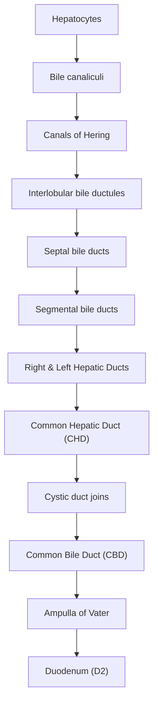
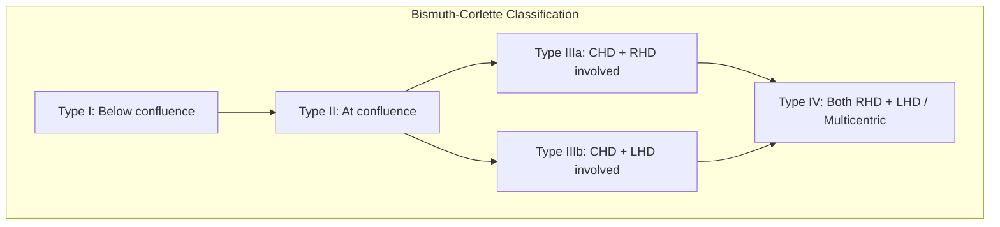

# Cholangiocarcinoma

## 1. Definition

Cholangiocarcinoma (CCA) — let's break the name down: "cholangio" = bile duct (Greek *cholē* = bile + *angeion* = vessel), "carcinoma" = malignant epithelial tumour. So, quite literally, **cancer arising from the epithelial lining of the bile ducts**.

Key definitional points:
- ***Cholangiocarcinoma refers to bile duct cancer arising from epithelial cells of intrahepatic, perihilar, and distal extrahepatic bile ducts*** [1][2]
- ***> 90% are adenocarcinoma***; the remainder are squamous cell carcinoma or other rare subtypes [2]
- **Exclusive of gallbladder carcinoma and ampullary carcinoma** — these are distinct entities even though they share the biliary tree. This is a common exam pitfall. [2]
- Perihilar cholangiocarcinoma involving the common hepatic duct (CHD) bifurcation is historically called a **Klatskin tumour** (named after Gerald Klatskin, 1965) [1][2]

<Callout title="Exam Pitfall" type="error">
Students often confuse cholangiocarcinoma with other periampullary cancers. Remember: cholangiocarcinoma is ONLY bile duct epithelium. Ampullary carcinoma, pancreatic head carcinoma, and duodenal carcinoma are separate entities, though they may present similarly (painless jaundice). Gallbladder carcinoma is also distinct.
</Callout>

---

## 2. Epidemiology

### Incidence and Trends
- ***Adenocarcinoma of intrahepatic bile duct accounts for 5–20% of primary liver malignancy*** [3]
- ***Mostly occurs in patients > 50 years*** [3]
- Overall incidence is increasing worldwide, driven particularly by rising **intrahepatic cholangiocarcinoma (iCCA)** — thought to relate to metabolic risk factors (obesity, NAFLD, diabetes) and improved imaging/diagnosis [4]
- Perihilar CCA remains the **most common subtype (~50–60%)**, followed by distal extrahepatic (~20–30%), then intrahepatic (~10–20%) [1][2]
- Geographic variation is striking:
  - **Southeast Asia** (Thailand, especially Isan region): highest worldwide incidence due to endemic liver fluke (*Opisthorchis viverrini*) infection — incidence can be 85 per 100,000
  - **East Asia** (including Hong Kong, China, Korea): elevated risk due to *Clonorchis sinensis* infection and recurrent pyogenic cholangitis (RPC)
  - **Western countries**: PSC is the dominant risk factor; overall incidence lower (~1–2 per 100,000)

### Hong Kong Context
- ***Association with recurrent pyogenic cholangitis (common in Orientals)*** [3]
- Hepatitis B is endemic in Hong Kong — chronic HBV contributes to both HCC and iCCA
- Hepatolithiasis and RPC ("Hong Kong disease") are important local risk factors [5]
- PSC-associated CCA is ***common in Westerners*** but relatively uncommon in Hong Kong [3]

### Sex and Age
- Slight male predominance overall (M:F ≈ 1.2–1.5:1) for extrahepatic CCA
- Intrahepatic CCA has roughly equal sex distribution
- ***Increasing incidence with age***; peak incidence in the 7th–8th decade [2]

---

## 3. Anatomy and Function

Understanding cholangiocarcinoma requires a solid grasp of biliary anatomy. Think of the biliary tree as a drainage system — like tributaries flowing into a river.

### The Biliary Tree: From Periphery to Duodenum

**Key anatomical landmarks for classification:**

| Region | Anatomical Boundaries | Tumour Type |
|--------|----------------------|-------------|
| **Intrahepatic** | Proximal to second-order bile ducts (i.e., proximal to CHD bifurcation) | Intrahepatic CCA (iCCA) |
| **Perihilar** | Between CHD bifurcation and the insertion of the cystic duct into the CBD | Perihilar CCA (pCCA) / Klatskin tumour |
| **Distal extrahepatic** | From cystic duct insertion to the ampulla of Vater | Distal CCA (dCCA) |

### Intrahepatic CCA Sub-classification
- ***Intrahepatic cholangiocarcinoma originates from:*** [2]
  - **Small intrahepatic ducts** (peripheral cholangiocarcinoma) — these form a mass lesion within the liver parenchyma, behaving more like a liver mass
  - **Large intrahepatic ducts** proximal to the bifurcation of left and right intrahepatic ducts — these behave more like perihilar tumours

### Extrahepatic CCA Division
- ***Divided into perihilar and distal segments with the transition occurring at the point where the CBD lies posterior to the duodenum, distal to the insertion of the cystic duct into the CBD*** [2]

### Blood Supply and Lymphatic Drainage
- The bile ducts receive their blood supply from the **hepatic arterial system** (peribiliary vascular plexus), NOT the portal vein. This is important because:
  - CCA tends to cause **ischaemic-type strictures** as it invades the arterial plexus
  - Hepatic artery involvement is a key determinant of resectability
- Lymphatic drainage follows the hepatoduodenal ligament → coeliac, periportal, and para-aortic lymph nodes
- ***Common mode of spread includes lymphatic spread*** [2]

### Nerve Supply
- The biliary tree has extensive perineural networks within the hepatoduodenal ligament
- This explains why CCA has a notorious tendency for **perineural invasion** (tumour spreads along nerve sheaths) — one of its hallmark histological features [2]

### Function of Bile Duct Epithelium (Cholangiocytes)
Cholangiocytes are not passive conduits. They:
- Modify bile composition (secrete bicarbonate, chloride; absorb water, glucose, amino acids)
- Participate in the **cholehepatic shunt** for bile salt recycling
- Express various receptors and growth factors that, when dysregulated, can promote carcinogenesis

---

## 4. Etiology and Pathophysiology

The unifying theme across most risk factors is **chronic inflammation → cholestasis → DNA damage → malignant transformation** of cholangiocytes. Think of it like any chronic inflammatory malignancy (e.g., Barrett's → oesophageal adenocarcinoma, UC → colorectal cancer).

### 4.1 Risk Factors (with Pathophysiology)

#### A. Cholestatic / Inflammatory Biliary Disease

**i. Primary Sclerosing Cholangitis (PSC)**
- ***Strong association with cholangiocarcinoma, especially perihilar disease*** [2]
- ***PSC is an inflammatory disorder of the biliary tree that leads to fibrosis and stricturing of intrahepatic and extrahepatic bile ducts*** [2]
- ***PSC is strongly associated with ulcerative colitis*** [2]
- ***Association with ulcerative colitis (common in Westerners)*** [3]
- **Pathophysiology:** Chronic bile duct inflammation → oxidative stress → DNA damage in cholangiocytes → dysplasia → carcinoma. The strictured, stagnant bile environment promotes bacterial overgrowth and secondary bile acid formation, which are carcinogenic.
- Lifetime risk of CCA in PSC patients: **10–20%**
- PSC is the strongest known risk factor in Western populations, but is ***less common in Asia*** [4]

<Callout title="PSC and CCA">
PSC patients can develop CCA at ANY point — even early in their disease. This makes surveillance extremely difficult. Any dominant stricture in a PSC patient should raise suspicion for CCA until proven otherwise.
</Callout>

**ii. Recurrent Pyogenic Cholangitis (RPC)**
- ***Association with recurrent pyogenic cholangitis (common in Orientals)*** [3]
- Also known as "Hong Kong disease" or oriental cholangiohepatitis [5]
- **Pathophysiology:** ***Usually starts in left intrahepatic ducts*** [5]. Parasitic infestation (e.g., *Clonorchis sinensis*) → epithelial damage → bacterial translocation → stricture formation → biliary stasis → brown pigment stone formation → recurrent cholangitis → chronic inflammation → malignant transformation [5]
- RPC causes a cycle: stones → obstruction → infection → more stones → more damage → eventually CCA

**iii. Cholelithiasis / Hepatolithiasis**
- ***Cholelithiasis refers to gallstones; hepatolithiasis refers to chronic intrahepatic stone disease which leads to biliary stasis and recurrent pyogenic cholangitis*** [2]
- Hepatolithiasis is particularly relevant in East Asia
- **Pathophysiology:** Chronic mechanical irritation and inflammation of bile duct epithelium by stones → metaplasia → dysplasia → carcinoma. Biliary stasis also concentrates potentially carcinogenic substances in bile.

#### B. Fibrocystic Liver Disease (Congenital)

**i. Choledochal Cysts**
- ***Choledochal cysts are congenital cystic dilatation of bile ducts*** [2]
- Lifetime risk of CCA: **10–30%**, increasing with age (hence why prophylactic excision is recommended)
- ***Associated with abnormal pancreaticobiliary junction (APBJ) in 70–90% of patients*** [6]

**ii. Caroli's Disease**
- ***Caroli's disease is a variant of choledochal cyst characterized by multiple cystic dilations of intrahepatic biliary ducts*** [2]

**iii. Pathophysiology of Fibrocystic Disease → CCA**
- ***Fibrocystic liver disease leads to cholangiocarcinoma by:*** [2]
  - **Biliary stasis** — pooling of bile promotes bacterial overgrowth and formation of carcinogenic secondary bile acids
  - **Chronic inflammation from reflux of pancreatic juice** — APBJ allows pancreatic enzymes (trypsin, lipase) to enter the biliary tree, causing chemical cholangitis
  - **Abnormalities in bile salt transporter proteins** → unstable bile content
  - **Deconjugation of carcinogens** previously conjugated in the liver → reactivation of carcinogens in bile

#### C. Chronic Liver Disease

- ***Viral hepatitis (HBV/HCV)*** [2]
- ***Liver cirrhosis*** [2]
- ***Alcoholic liver disease*** [2]
- **Pathophysiology:** Chronic hepatic inflammation → hepatic stellate cell activation → fibrosis → altered microenvironment with growth factor dysregulation (TGF-β, PDGF, VEGF) → cholangiocyte proliferation and malignant transformation
- HCV has a particularly strong association with iCCA (adjusted OR ~4–5) [4]
- HBV is relevant in Hong Kong given endemic prevalence

#### D. Parasitic Infection (High Yield for Hong Kong)

***Infection of liver flukes by consumption of undercooked freshwater fish which leads to adult worms inhabiting and laying eggs in the biliary system:*** [2]
- ***Clonorchis sinensis*** — endemic in southern China including Hong Kong, Korea, Vietnam
- ***Opisthorchis viverrini*** — endemic in Thailand, Laos, Cambodia

***Induction of chronic inflammatory state in proximal biliary tree leading to malignant transformation of the lining epithelium*** [2]

**Pathophysiology (detailed):**
1. Ingestion of metacercariae in raw/undercooked freshwater fish (e.g., grass carp, snakehead fish)
2. Excystation in duodenum → larvae migrate up the ampulla of Vater into bile ducts
3. Adult flukes reside in bile ducts for **15–25 years**, feeding on bile duct epithelium
4. Mechanical damage from fluke suckers + toxic metabolites + egg deposition → chronic periductal inflammation
5. Cholangiocyte hyperplasia → goblet cell metaplasia → dysplasia → adenocarcinoma
6. Additionally, fluke-secreted proteins (e.g., granulin-like growth factor) directly promote cell proliferation

***Diagnosis of Clonorchis: stool microscopy for eggs, duodenal aspirate for eggs, USG for adult flukes, intra-op choledochoscopy for adult flukes*** [5]
***Treatment: praziquantel 25 mg/kg PO tds × 1 day*** [5]

<Callout title="Hong Kong Relevance">
In Hong Kong, Clonorchis sinensis infection from eating raw freshwater fish (鯇魚 grass carp sashimi) is a well-known risk factor. Always ask about dietary history of raw freshwater fish consumption in a patient presenting with cholangiocarcinoma.
</Callout>

#### E. Genetic Disorders

- ***Lynch syndrome (Hereditary nonpolyposis colorectal cancer)*** [2]
  - ***Autosomal dominant disorder caused by germline mutation in one of several DNA mismatch repair (MMR) genes*** (MLH1, MSH2, MSH6, PMS2) [2]
  - Lifetime risk of CCA is elevated but still relatively low (~2%)
  - The MMR deficiency leads to microsatellite instability → accumulation of mutations in cholangiocytes
  
- ***Multiple biliary papillomatosis*** [2]
  - ***Multiple adenomatous polyps of variable distribution and extent in intrahepatic bile ducts*** [2]
  - These are premalignant lesions with high recurrence rate

#### F. Other Risk Factors

- ***Obesity, Diabetes mellitus, Metabolic syndrome*** [2][4]
  - Pathophysiology: Insulin resistance → hyperinsulinaemia → IGF-1 activation → cell proliferation. Adipose tissue inflammation → IL-6, TNF-α → pro-carcinogenic microenvironment. NAFLD/NASH → hepatic inflammation
- ***Thorotrast (thorium dioxide) exposure*** [2][4]
  - Historical contrast agent used in the 1930s–50s for radiological imaging
  - Alpha-emitting radioactive material deposited in the reticuloendothelial system → chronic radiation-induced DNA damage
  - Latency period of 20–40 years before CCA development
  - Now banned, but elderly patients may still present with Thorotrast-related cancers

### 4.2 Summary Table: Risk Factors by Category

| Category | Risk Factor | Relevance to HK |
|----------|-------------|-----------------|
| **Inflammatory/Cholestatic** | PSC | Less common in Asia |
| | RPC | ***Very common in Orientals*** |
| | Hepatolithiasis | Common in East Asia |
| | Cholelithiasis | Universal |
| **Congenital** | Choledochal cysts | Common in Asians |
| | Caroli's disease | Uncommon |
| **Infectious** | *Clonorchis sinensis* | ***Endemic in HK/South China*** |
| | *Opisthorchis viverrini* | Southeast Asia |
| | HBV | ***Endemic in HK*** |
| | HCV | Less common in HK |
| **Metabolic** | Obesity/DM/MetS | Increasing |
| | NAFLD/NASH | Increasing |
| | ALD | Present |
| **Genetic** | Lynch syndrome | Rare |
| | Biliary papillomatosis | Rare |
| **Toxic** | Thorotrast | Historical |

---

## 5. Pathogenesis and Histopathology

### 5.1 Molecular Pathogenesis

The carcinogenesis of CCA follows a multi-step model, similar to the adenoma–carcinoma sequence in colorectal cancer but occurring in cholangiocytes:

**Normal cholangiocyte → Hyperplasia → Dysplasia → Carcinoma in situ → Invasive carcinoma**

Key molecular pathways:
1. **Chronic inflammation** → NF-κB activation → COX-2 upregulation → prostaglandin-mediated cell proliferation and inhibition of apoptosis
2. **IL-6/STAT3 pathway** — IL-6 released by inflammatory cells activates STAT3 in cholangiocytes → promotes survival and proliferation
3. **Bile acid toxicity** — hydrophobic bile acids cause oxidative DNA damage and activate EGFR/MAPK signalling
4. **Growth factor dysregulation** — overexpression of VEGF, PDGF, HGF → angiogenesis and tumour growth
5. **Tumour suppressor loss** — p53 mutations (especially in Thorotrast-related CCA), p16/CDKN2A silencing, SMAD4 loss
6. **Oncogenic mutations** — IDH1/IDH2 mutations (especially in iCCA, ~15–20%), FGFR2 fusions (iCCA, ~15%), KRAS mutations (extrahepatic CCA)

<Callout title="Why IDH and FGFR2 Matter" type="idea">
These molecular targets are therapeutically actionable! Ivosidenib (IDH1 inhibitor) and pemigatinib/futibatinib (FGFR2 inhibitors) are now approved for advanced iCCA with these specific mutations. This is a major shift towards precision oncology in CCA.
</Callout>

### 5.2 Histological Features

***Majority of cholangiocarcinoma (> 90%) are adenocarcinoma*** [2]

***Cholangiocarcinoma is characterized by:*** [2]
- ***Slow growth***
- ***High rate of local invasion***
- ***Mucin production***
- ***Tendency to invade perineural sheath and spread along nerves*** (perineural invasion is a hallmark and explains why margins are often positive even after seemingly complete resection)

### 5.3 Macroscopic Subtypes of Adenocarcinoma

***Adenocarcinoma is further divided into 3 types:*** [2]

| Subtype | Characteristics | Clinical Significance |
|---------|----------------|----------------------|
| ***Sclerosing*** | ***Characterized by intense desmoplastic reaction with extensive fibrosis*** | Most common type for perihilar/distal CCA. The dense fibrosis makes biopsy difficult (low cellularity) and causes firm, constricting strictures |
| ***Nodular*** | ***Characterized by constricting annular lesion of bile duct*** | Causes circumferential narrowing of the duct lumen |
| ***Papillary*** | ***Characterized by bulky masses in CBD and cause biliary obstruction*** | Better prognosis — tends to grow intraluminally rather than invasively; more likely to be resectable |

> Why does the sclerosing type have such dense fibrosis? Because the tumour cells secrete TGF-β and PDGF, which activate surrounding stromal fibroblasts (cancer-associated fibroblasts) to produce collagen. This desmoplastic reaction actually creates a protective microenvironment for the tumour and makes it resistant to chemotherapy penetration.

### 5.4 Growth Patterns (WHO Classification)

Particularly for iCCA, the WHO recognizes:
- **Mass-forming** — a discrete intrahepatic mass (most common pattern for iCCA)
- **Periductal-infiltrating** — tumour grows along bile duct walls causing strictures without a discrete mass
- **Intraductal-growing** — papillary growth within the bile duct lumen (best prognosis)
- **Mixed patterns** — combinations of the above

### 5.5 Immunohistochemistry

***Cytokeratin-7 (CK7) positivity is consistent with biliary tract origin*** [2]

Typical IHC profile of CCA:
| Marker | CCA | HCC |
|--------|-----|-----|
| CK7 | **Positive** | Negative |
| CK19 | **Positive** | Negative |
| CK20 | Variable | Negative |
| HepPar-1 | Negative | **Positive** |
| Glypican-3 | Negative | **Positive** |
| AFP | Negative | Often positive |
| Arginase-1 | Negative | **Positive** |

This IHC panel is critical when distinguishing iCCA from HCC, especially when a liver mass is identified and biopsy is performed.

---

## 6. Classification

### 6.1 Anatomical Classification (Most Clinically Important)

***Classification by site:*** [4]

| Type | Frequency | Location | Key Features |
|------|-----------|----------|--------------|
| ***Intrahepatic (iCCA)*** | ***~10%*** | ***Proximal to CHD bifurcation*** | ***Bulky tumour similar to HCC; increasing incidence*** |
| ***Perihilar (pCCA)*** | ***MC, ~60%*** | ***Between CHD bifurcation and cystic duct origin*** | ***Prone to cholangitis, resection difficult*** |
| ***Distal extrahepatic (dCCA)*** | ***~20–30%*** | ***Distal to cystic duct origin*** | ***Decreasing incidence*** |

- ***Klatskin's tumour: cholangiocarcinoma that involves the common hepatic duct bifurcation (usually perihilar type)*** [4]

<Callout title="Key Anatomical Point">
The CHD bifurcation (confluence of right and left hepatic ducts) is the most strategically important location. A tumour here blocks drainage from BOTH lobes of the liver → early jaundice. This is why perihilar CCA presents earlier than intrahepatic CCA.
</Callout>

### 6.2 Bismuth-Corlette Classification (for Perihilar CCA)

This classification describes the **extent of ductal involvement** and is crucial for surgical planning:

***Bismuth-Corlette classification for perihilar tumour:*** [2][4]

| Type | Description | Resectability |
|------|-------------|---------------|
| ***Type I*** | ***Tumour below the confluence of the left and right hepatic ducts*** | Usually resectable |
| ***Type II*** | ***Tumour reaching the confluence*** | Usually resectable |
| ***Type IIIa*** | ***Tumour occluding common hepatic and right hepatic ducts*** | May require right hepatectomy |
| ***Type IIIb*** | ***Tumour occluding common hepatic and left hepatic ducts*** | May require left hepatectomy |
| ***Type IV*** | ***Tumour that involves the confluence and both the right and left hepatic duct / Tumour that are multicentric*** | Often unresectable |

> ***Bile duct tumours that involve common hepatic duct bifurcation are referred to as Klatskin tumour regardless of whether they arise from intrahepatic or extrahepatic portion of biliary tree*** [2]

<Callout title="Surgical Significance of Bismuth-Corlette" type="idea">
Types I and II are potentially curable with bile duct resection alone. Types IIIa/IIIb require major hepatectomy (right or left) combined with bile duct resection. Type IV is generally considered unresectable — these patients typically receive palliative biliary drainage and chemotherapy.
</Callout>

### 6.3 Staging (AJCC TNM 8th Edition)

Note: iCCA, pCCA, and dCCA each have **separate TNM staging systems** because they behave as biologically distinct diseases.

**Intrahepatic CCA (staged like liver tumours):**
- T1a: Solitary ≤ 5 cm without vascular invasion
- T1b: Solitary > 5 cm without vascular invasion
- T2: Solitary with intrahepatic vascular invasion, OR multiple tumours
- T3: Tumour perforating visceral peritoneum
- T4: Direct invasion of local extrahepatic structures

**Perihilar CCA:**
- Staging considers depth of invasion into bile duct wall, hepatic artery, portal vein, and unilateral vs bilateral hepatic duct involvement

**Distal CCA:**
- Staged similarly to other pancreaticobiliary cancers, based on depth of invasion into bile duct wall and surrounding structures

### 6.4 Metastatic Patterns

***Metastatic sites depend on type of cholangiocarcinoma:*** [2]

| Type | Common Metastatic Sites |
|------|------------------------|
| ***Intrahepatic*** | ***Peritoneum / Lung / Pleura*** |
| ***Perihilar*** | ***Liver / Peritoneum / Lung / Brain / Bone*** |
| ***Distal extrahepatic*** | ***Liver / Peritoneum / Lung*** |

---

## 7. Clinical Features

### Conceptual Framework

The clinical presentation of CCA depends heavily on **anatomical location**:
- **Intrahepatic CCA** behaves like a liver mass — often silent until large
- **Perihilar CCA** causes early biliary obstruction — presents with jaundice
- **Distal CCA** presents like other periampullary tumours — painless obstructive jaundice

### 7.1 Symptoms

#### A. Jaundice (Obstructive / Post-hepatic)

- ***ONLY in extrahepatic (perihilar/distal) cholangiocarcinoma, especially Klatskin tumour in which blockage of the bifurcation of left and right hepatic duct will cause jaundice in early stage*** [2]
- ***Intrahepatic cholangiocarcinoma will NOT cause jaundice since bilirubin can be reabsorbed into blood and re-excreted through unaffected parts of liver*** [2]

**Pathophysiological explanation:**
- The liver has enormous reserve capacity. If one segmental duct is blocked, the rest of the liver continues to excrete bilirubin normally. Only when the CHD bifurcation (or both main ducts) is blocked does conjugated bilirubin back up into the blood → jaundice
- Perihilar CCA (Klatskin tumour) blocks this critical junction early → **early jaundice**
- iCCA must grow very large or directly invade the hilum before causing jaundice
- The jaundice is typically **progressive and painless** (vs. the colicky, intermittent jaundice of choledocholithiasis)

> This is a classic ***painless jaundice*** presentation — one of the most important clinical scenarios in surgery exams [7]

#### B. Dark Urine and Pale Stools

***Dark urine and pale stools*** [2]

**Pathophysiology:**
- **Dark urine:** Conjugated bilirubin (water-soluble) that cannot drain into the duodenum backs up into the blood → filtered by kidneys → excreted in urine → dark "cola-coloured" or "tea-coloured" urine
- **Pale stools:** Normally, conjugated bilirubin reaches the gut → bacterial conversion to stercobilinogen → stercobilin (gives stool its brown colour). In obstruction, no bilirubin reaches the gut → acholic (pale/clay-coloured) stools
- These features together with jaundice = **obstructive (post-hepatic) jaundice triad**

#### C. Pruritus

***Pruritus*** [2]

**Pathophysiology:**
- Bile salts that cannot be excreted into the gut accumulate in the blood → deposit in the skin → irritate cutaneous nerve endings
- The exact mechanism remains debated; lysophosphatidic acid (LPA) and autotaxin (bile salt metabolites) acting on itch-specific nerve fibres (via TGR5 receptors) may be involved
- Can be severe and debilitating — often worse at night, affecting palms and soles first
- Pruritus may **precede** jaundice (as sub-clinical cholestasis can cause bile salt accumulation before bilirubin rises enough to cause visible jaundice)

#### D. Right Upper Quadrant (RUQ) Pain

***RUQ pain*** [2][3]

**Pathophysiology:**
- **Intrahepatic CCA:** Hepatomegaly from tumour growth stretches Glisson's capsule (the fibrous capsule of the liver) → dull, aching RUQ pain. The liver parenchyma itself has no pain receptors — it's the capsular distension that hurts
- **Extrahepatic CCA:** Biliary obstruction → upstream ductal dilatation → stretching of the bile duct wall. If superimposed cholangitis occurs, acute inflammation of the duct wall causes more intense pain
- Pain is typically **dull and constant** (unlike biliary colic which is episodic)

#### E. Constitutional Symptoms

- ***Anorexia, weight loss*** [3]
  - **Pathophysiology:** Cancer-related cachexia mediated by pro-inflammatory cytokines (TNF-α, IL-6) → increased basal metabolic rate, decreased appetite, muscle wasting. Additionally, bile salt malabsorption → fat malabsorption → steatorrhoea → weight loss
- ***Fever*** [2][3]
  - **Pathophysiology:** Biliary obstruction → biliary stasis → bacterial colonisation of stagnant bile → ascending cholangitis. Tumour necrosis can also release pyrogens. Cholangitis occurs particularly in perihilar CCA where obstruction is proximal

<Callout title="Charcot's Triad in CCA" type="error">
While Charcot's triad (fever, jaundice, RUQ pain) classically describes acute cholangitis from gallstone disease, CCA-related cholangitis can also produce this triad. The key difference: in CCA, the jaundice is progressive and the fever is recurrent, whereas in gallstone cholangitis, both tend to be episodic and fluctuating.
</Callout>

#### F. Malabsorption Symptoms
- Steatorrhoea (fatty, foul-smelling stools) — because bile salts cannot reach the duodenum → impaired fat emulsification → fat malabsorption
- Fat-soluble vitamin deficiency (A, D, E, K) — prolonged obstruction leads to:
  - Vitamin K deficiency → coagulopathy (prolonged PT/INR) — this is important pre-operatively!
  - Vitamin D deficiency → osteomalacia
  - Vitamin A deficiency → night blindness (rare, requires prolonged obstruction)

### 7.2 Signs

#### A. General Examination

- **Jaundice** — yellow discolouration of skin and sclera (scleral icterus is detectable at bilirubin > 35–40 µmol/L)
- **Cachexia / wasting** — evidence of advanced malignancy
- **Scratch marks / excoriations** — secondary to pruritus
- **Xanthomata / xanthelasma** — cholesterol deposits in skin, seen in chronic cholestasis

#### B. Abdominal Examination

- ***Hepatomegaly*** [3]
  - iCCA: palpable liver mass from tumour itself
  - Perihilar/distal CCA: hepatomegaly from biliary obstruction → hepatic congestion and bile duct dilatation
  
- **Palpable gallbladder (Courvoisier's sign)**
  - ***In distal CCA***: the gallbladder distends because bile cannot drain past the obstruction. The cystic duct is patent → gallbladder fills with mucus → palpable, non-tender
  - **Courvoisier's Law:** "In the presence of painless obstructive jaundice, a palpable gallbladder is unlikely to be due to gallstones" — because chronic gallstone disease causes fibrosis and a shrunken, non-distensible gallbladder. A palpable gallbladder + painless jaundice suggests malignant obstruction (pancreatic head cancer, distal CCA, ampullary cancer)
  - **Important:** In perihilar CCA (Klatskin tumour), the obstruction is ABOVE the cystic duct entry → gallbladder does NOT distend → Courvoisier's sign is NEGATIVE [7]

<Callout title="Courvoisier's Sign — Location Matters!" type="error">
A very common exam question: Courvoisier's sign is positive in distal CCA and pancreatic head cancer, but NEGATIVE in perihilar CCA (Klatskin tumour) because the obstruction is above the cystic duct insertion. The gallbladder cannot fill if bile cannot reach it!
</Callout>

- **Ascites** — suggests peritoneal metastasis (advanced disease) or portal hypertension in cirrhotic patients
- **Splenomegaly** — rare; suggests portal hypertension from advanced liver disease or portal vein involvement

#### C. Signs of Chronic Liver Disease (if underlying cirrhosis)
- Spider naevi, palmar erythema, gynaecomastia, caput medusae, etc.

#### D. Metastatic Disease Signs
- **Sister Mary Joseph nodule** — periumbilical nodule suggesting peritoneal metastasis
- **Virchow's node** (left supraclavicular lymphadenopathy) — suggests distant lymphatic spread
- **Blumer's shelf** — drop metastasis in the rectovesical/rectouterine pouch (palpable on PR exam)

### 7.3 Clinical Presentation by Subtype (Summary)

| Feature | Intrahepatic CCA | Perihilar CCA (Klatskin) | Distal CCA |
|---------|------------------|-------------------------|------------|
| **Jaundice** | Late/absent | Early (progressive, painless) | Early (progressive, painless) |
| **Pain** | RUQ dull ache (capsular stretch) | RUQ pain if cholangitis | Epigastric/RUQ |
| **Mass** | Hepatomegaly/palpable mass | Usually no mass | Usually no mass |
| **Courvoisier's sign** | Negative | Negative | **Positive** |
| **Weight loss** | Common (late presentation) | Variable | Variable |
| **Cholangitis** | Uncommon | ***Prone to cholangitis*** | Possible |

---

## 8. Differential Diagnosis of Cholangiocarcinoma

The differential depends on the clinical presentation:

### For Obstructive Jaundice (Extrahepatic CCA)

***Differential diagnosis:*** [2]
- ***Choledocholithiasis*** — intermittent jaundice, colicky pain, fluctuating LFTs
- ***Pancreatic cancer*** (head) — painless jaundice, Courvoisier's sign, weight loss
- ***Cancer of the ampulla of Vater*** — intermittent jaundice (tumour sloughs → obstruction relieved), better prognosis
- ***Viral hepatitis*** — hepatocellular pattern LFTs, viral markers positive
- ***Primary sclerosing cholangitis (PSC)*** — "beaded" appearance on MRCP, multifocal strictures
- ***Primary biliary cholangitis (PBC)*** — AMA positive, cholestatic LFTs, middle-aged women
- ***IgG4-related sclerosing cholangitis*** — important mimic! Responds to steroids; elevated IgG4 levels
- **Mirizzi syndrome** — extrinsic compression of CHD by impacted gallstone
- **Benign biliary stricture** — post-surgical, post-ERCP, chronic pancreatitis

### For Liver Mass (Intrahepatic CCA)

- ***Hepatocellular carcinoma (HCC)*** — AFP elevated, arterial enhancement + washout on CT/MRI
- **Liver metastases** — look for primary tumour (CRC, breast, lung)
- **Hepatic abscess** — fever, leukocytosis, rim-enhancing lesion
- **Haemangioma** — peripheral nodular enhancement, centripetal fill-in
- **Focal nodular hyperplasia** — central scar, homogeneous enhancement

> Key: ***Immunohistochemical stain is useful in differential diagnosis of cholangiocarcinoma with other malignancy*** [2] — CK7/CK19 positive for CCA vs. HepPar-1/Glypican-3/AFP positive for HCC

---

> **Key points from lecture slides [3]:**
> - ***Tumour markers: carcinoembryonic antigen (CEA), CA 19-9 (may or may not be elevated, nonspecific)***
> - ***USG, CT scan, MRI*** for diagnosis
> - ***FNAC or Trucut biopsy (ONLY for unresectable cases)*** — because biopsy risks tumour seeding along the needle tract in potentially resectable disease
> - ***Hepatic resection is the treatment of choice (resectability rate about 20%)***
> - ***Other treatment: no proven effect*** (this was 2019; now in 2025, gemcitabine-cisplatin ± durvalumab is standard for advanced CCA — TOPAZ-1 trial)

---

<Callout title="High Yield Summary">

**Definition:** Cancer arising from bile duct epithelium; > 90% adenocarcinoma. Excludes gallbladder and ampullary carcinoma.

**Classification by location:**
- Intrahepatic (10%): behaves as liver mass, NO early jaundice
- Perihilar (60%, MC): Klatskin tumour if at bifurcation, EARLY jaundice, Courvoisier NEGATIVE
- Distal extrahepatic (20–30%): behaves like periampullary tumour, Courvoisier POSITIVE

**Bismuth-Corlette (perihilar):** I (below confluence) → II (at confluence) → IIIa (+ RHD) → IIIb (+ LHD) → IV (both/multicentric)

**Key risk factors (HK):** RPC, hepatolithiasis, Clonorchis sinensis (raw freshwater fish), HBV, choledochal cysts, obesity/DM. In West: PSC + UC.

**Pathophysiology:** Chronic inflammation → cholestasis → DNA damage → metaplasia → dysplasia → adenocarcinoma. Perineural invasion is hallmark.

**Histology:** Sclerosing (desmoplastic, MC), Nodular (annular), Papillary (bulky, best prognosis). CK7+/CK19+ on IHC.

**Clinical features:**
- Painless progressive jaundice (extrahepatic CCA)
- Dark urine + pale stools (obstructive)
- Pruritus (bile salt deposition in skin)
- RUQ pain, hepatomegaly (capsular stretch)
- Weight loss, fever (cholangitis)
- Intrahepatic CCA: NO jaundice until late

**Tumour markers:** CEA, CA 19-9 (non-specific, may be normal)

**Resection:** Only curative treatment; resectability rate ~20%. FNAC/biopsy ONLY for unresectable cases.

</Callout>

---

<ActiveRecallQuiz
  title="Active Recall - Cholangiocarcinoma (Definition to Clinical Features)"
  items={[
    {
      question: "Why does intrahepatic cholangiocarcinoma NOT cause jaundice early, whereas perihilar cholangiocarcinoma does?",
      markscheme: "Intrahepatic CCA only blocks segmental ducts; remaining liver continues to excrete bilirubin through unaffected ducts. Perihilar CCA blocks the CHD bifurcation, preventing drainage from both lobes, causing early jaundice."
    },
    {
      question: "Name the Bismuth-Corlette classification types I through IV for perihilar cholangiocarcinoma.",
      markscheme: "Type I: below confluence. Type II: at confluence. Type IIIa: CHD + right hepatic duct. Type IIIb: CHD + left hepatic duct. Type IV: both hepatic ducts or multicentric."
    },
    {
      question: "Explain why Courvoisier's sign is positive in distal CCA but negative in perihilar CCA (Klatskin tumour).",
      markscheme: "In distal CCA, obstruction is below the cystic duct insertion, so bile backs up into the gallbladder causing distension. In Klatskin tumour, obstruction is above the cystic duct, so bile cannot reach the gallbladder and it does not distend."
    },
    {
      question: "What is the pathophysiology of CCA development in patients with liver fluke infection (Clonorchis sinensis)?",
      markscheme: "Ingestion of metacercariae in raw freshwater fish. Adult flukes reside in bile ducts for decades. Mechanical damage plus toxic metabolites cause chronic periductal inflammation. Cholangiocyte hyperplasia leads to goblet cell metaplasia, then dysplasia, then adenocarcinoma. Fluke-secreted granulin-like growth factor also promotes cell proliferation."
    },
    {
      question: "A liver biopsy shows CK7+, CK19+, HepPar-1 negative, AFP negative. What is the most likely diagnosis, and how does this distinguish it from HCC?",
      markscheme: "Cholangiocarcinoma (biliary origin). HCC is typically CK7 negative, CK19 negative, HepPar-1 positive, AFP often positive, Glypican-3 positive."
    },
    {
      question: "List 4 risk factors for cholangiocarcinoma that are particularly relevant to Hong Kong.",
      markscheme: "Any 4 of: Recurrent pyogenic cholangitis (RPC), hepatolithiasis, Clonorchis sinensis infection from raw freshwater fish, chronic HBV infection, choledochal cysts (common in Asians), obesity and diabetes mellitus."
    }
  ]}
/>

## References

[1] Senior notes: felixlai.md (Cholangiocarcinoma, sections I–III)
[2] Senior notes: felixlai.md (Cholangiocarcinoma, sections III–VI)
[3] Lecture slides: WCS 064 - A large liver - by Prof R Poon [20191108].doc.pdf (p5, Cholangiocarcinoma)
[4] Senior notes: maxim.md (Cholangiocarcinoma section)
[5] Senior notes: maxim.md (Recurrent pyogenic cholangitis section)
[6] Senior notes: felixlai.md (Biliary cysts / Choledochal cyst section)
[7] Lecture slides: WCS 056 - Painless jaundice and epigastric mass - by Prof R Poon.ppt (1).pdf
