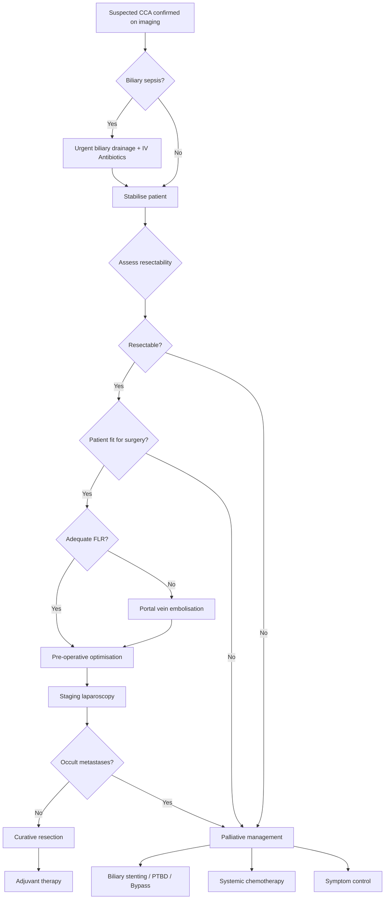

## Management of Cholangiocarcinoma

### Management Principles — Thinking From First Principles

Before we go into specific treatments, let's understand the **strategic logic** of managing CCA. There are only **three questions** you need to answer, in this exact order:

1. **Is the patient septic?** → If yes, treat the sepsis FIRST (biliary drainage + antibiotics)
2. **Is the tumour resectable?** → If yes, surgery is the ONLY curative option
3. **Is the patient fit for surgery?** → If no, palliate

Everything else flows from these three decisions.

***Management:*** [18]
- ***Treat SEPSIS***
- ***Assess tumour resectability + Patient general fitness + Liver function reserve***
- ***Resectable → Surgery; Non-resectable → Palliation***

---

### Overall Management Algorithm

---

## 1. Initial Management — Treat Sepsis First

***Treat sepsis*** [18][19]

**Why treat sepsis before anything else?**
A jaundiced patient with cholangitis is in a life-threatening state. Obstructed, infected bile is a closed-space infection → bacteraemia → septic shock. You cannot take a septic, jaundiced patient to major hepatectomy — the mortality would be unacceptable. The liver is already compromised by obstruction; adding the stress of major surgery to an infected, failing liver is a recipe for post-operative liver failure and death.

### Measures:
- **Resuscitation:** IV fluids, NPO, monitor vitals and urine output
- **Antibiotics:** ***Augmentin (OR) Cefuroxime (Zinacef) + Metronidazole (Flagyl)*** [16]
  - Must cover Gram-negative rods (E. coli, Klebsiella) and anaerobes
  - **Why these bugs?** They ascend from the GI tract into the obstructed biliary tree. The ampulla of Vater normally acts as a barrier, but obstruction → stasis → bacterial overgrowth → ascending infection
- **Urgent biliary drainage** if:
  - Reynolds pentad (fever + jaundice + pain + shock + confusion) [19]
  - Not responding to antibiotics within 24 hours [19]
  - **Why drainage when antibiotics are given?** Because antibiotics are secreted into bile — if the bile duct is obstructed, the antibiotic cannot reach the infected bile. Drainage decompresses the system and allows antibiotics to work.

---

## 2. Assessment of Resectability

This is the **pivotal decision point**. Surgery is the only curative treatment, but taking an unresectable patient to laparotomy is harmful (morbidity + delays palliative care).

### Criteria of Resectability

***Criteria of resectability:*** [18]
- ***No distant metastases***
- ***SMA and celiac axis not involved***
- ***Patent superior mesenteric-portal venous confluence***
- ***PV involvement is NOT absolute contraindication*** [18]
  - ***Venous resection is appropriate to improve resectability and achieve R0 resection*** [18]
  - ***Significant morbidity and mortality*** [18]
  - ***Reasonable survival: median = 13 months, 5-year = 7%*** [18]

### Indicators of Unresectability

***Unresectable if:*** [4]
- ***Invasion of major vessels (e.g. main PV, main hepatic artery, celiac trunk, SMA, SMV)*** [4]
- ***Extensive involvement of biliary tree (bilaterally > 2° radicles)*** [4] — meaning the tumour extends beyond the second-order bile duct branches on BOTH sides. Why does this make it unresectable? Because even if you resect the extrahepatic bile ducts, you cannot reconstruct drainage from both sides if the 2nd-order branches are involved bilaterally — there would be insufficient healthy duct to anastomose to a jejunal loop.
- ***LN metastasis (retropancreatic, paracoeliac, paraaortic)*** [4] — these are considered distant (M1) nodes, indicating systemic disease
- ***Distal organ metastasis (lung, peritoneum)*** [4]

Additional criteria [2]:
- **Bilateral or multifocal intrahepatic disease** [2]
- **Hepatic artery and portal vein invasion** (bilateral main branches) [2]
- **Extrahepatic adjacent organ invasion** [2]

### Pre-operative Assessment — Patient Fitness

***Assessment of patient status:*** [16]
- ***Age / Concomitant medical illness***
- ***Hidden medical illness = CXR / ECG / Spirometry***
- ***Nutrition = LFT***
- ***Fluid and electrolytes = RFT***
- ***Coagulopathy = CBC / Clotting profile***

***Assessment of tumour status:*** [16]
- **Clinical signs of inoperability:**
  - ***Irregular surface hepatomegaly***
  - ***Troisier's sign (Virchow's node) — left supraclavicular LN***
  - ***Blumer's shelf — peritoneal metastasis***
  - ***Sister Mary Joseph nodules — peritoneal metastasis***
  - ***Ascites — peritoneal metastasis***

### Future Liver Remnant (FLR) Assessment

For perihilar CCA, major hepatectomy is often required. You need to ensure the patient will have enough functioning liver left after resection:
- **FLR must be > 25–30%** of total liver volume in a normal liver
- **FLR must be > 40%** in a cirrhotic or cholestatic liver (impaired regeneration capacity)
- ***If FLR inadequate: portal vein embolisation (PVE) to induce atrophy of affected segment + hypertrophy of unaffected segments*** [4]
  - **Why does PVE work?** By embolising the portal vein branch feeding the side to be resected, you redirect portal blood flow to the contralateral lobe → that lobe hypertrophies over 4–6 weeks → now the FLR is large enough to sustain life after resection. Essentially you are "training" the liver before surgery.

---

## 3. Pre-operative Biliary Drainage

***Relief of biliary obstruction before surgery*** [20]
***Target level: Serum bilirubin < 50 µmol/L or < 20 µmol/L for concomitant partial hepatectomy*** [20]

### Rationale

***Reasons why MBO is high risk for operation and measures to reduce complications:*** [16]
- ***Cancer cachexia → Malnutrition → Nutritional support***
- ***Liver derangement → Bleeding tendency → IV Vitamin K and FFP during surgery***
- ***Superimposed biliary infection → Antibiotics cover***

**Why drain pre-operatively?**
A jaundiced liver is a sick liver. Biliary obstruction causes:
- Impaired hepatocyte function (cannot synthesise clotting factors, albumin)
- Vitamin K malabsorption → coagulopathy
- Impaired reticuloendothelial function → susceptibility to sepsis
- Impaired wound healing (poor protein synthesis)
Operating on a deeply jaundiced patient → high risk of post-operative liver failure, bleeding, and sepsis.

### Theory vs Practice (QMH Approach)

***Theoretically: Do NOT need to drain if no sepsis + early surgery can be offered within 1–2 weeks*** [16]
- Pre-operative drainage itself carries risks (cholangitis, pancreatitis, stent complications)
- Some evidence suggests it increases overall complications even in expert centres

***Practically (QMH): Drain ALL patients since QMH cannot offer early surgery*** [16]
- ***Whipple operation has to wait for 6–8 weeks and the chance of biliary sepsis will be very high without drainage while waiting for this period*** [16]

### Methods of Pre-operative Drainage

#### ERCP with Endoprosthesis (Endoscopic Stenting) — 1st Line

***ERCP with endoprosthesis is ALWAYS 1st line regardless of the level of obstruction*** [16]

**Except when:** [16]
- ***Contraindications for ERCP (e.g. structural upper GI abnormalities / partial gastrectomy with Billroth II or Roux-en-Y anastomosis)***
- ***Multiple stenting required or difficulty in reaching intrahepatic bile ducts*** (i.e., proximal/perihilar obstruction where ERCP cannot access above the stricture)

#### PTBD (Percutaneous Transhepatic Biliary Drainage)

***ERCP with endoprosthesis is preferred over PTBD because:*** [16]
- ***PTBD is technically more difficult***
- ***Bleeding is common due to puncture of hepatic artery or portal vein before reaching the bile duct (Portal triad)***

**Types of PTBD:**
- ***Simple external PTBD: indicated for short-term drainage to bridge to surgery. Prone to electrolyte and fluid loss due to bile output*** [16]
- ***External-internal type PTBD: indicated for long-term palliation*** [16] — catheter pushed through the obstruction so bile drains internally into the duodenum

**PTBD complications and management:** [16]
- ***If bleeding occurs: Stabilise and resuscitate → Clamp the PTBD catheter → Perform cholangiogram by injecting contrast into PTBD to delineate whether the catheter is in hepatic artery or portal vein → Remove catheter slowly to control bleeding and do NOT attempt to remove immediately since it will convert into free hemoperitoneum***

### Staging Laparoscopy

***No promise of resection until laparotomy finding documents absence of spread*** [16]
***Look for peritoneal nodules after laparotomy before resection and send for frozen section to rule out malignancy if suspicious*** [16]

- Upstages ~25–30% of patients thought to be resectable on cross-sectional imaging
- Particularly important for Bismuth III/IV perihilar CCA, and any case with high CA 19-9

---

## 4. Curative Surgical Treatment

***Hepatic resection is the treatment of choice (resectability rate about 20%)*** [3]

The surgical approach depends entirely on the **anatomical location** of the tumour:

***In general:*** [18]
- ***Whipple operation for carcinoma of pancreas, distal CBD cholangiocarcinoma, CA duodenum and CA ampulla***
- ***Radical cholecystectomy for CA gallbladder***
- ***Major hepatectomy + caudate lobectomy together with confluence of hepatic ducts for Klatskin tumour***

### 4.1 Intrahepatic CCA

***Intrahepatic: partial hepatectomy + portal LN dissection*** [4]

| Component | Details |
|-----------|---------|
| **Hepatic resection** | ***Hepatic resection ± Portal lymphadenectomy*** [2]. Aim for R0 margins (microscopically clear). May require anatomical hepatectomy (segmentectomy, sectorectomy, or lobectomy) depending on tumour size and location |
| **Portal LN dissection** | ***Portal lymphadenectomy is performed only in selected patients but not routinely*** [2]. Why? Because iCCA has a lower rate of nodal involvement than perihilar CCA, and routine lymphadenectomy adds morbidity without proven survival benefit in node-negative patients |
| **Margin** | Aim for ≥ 1 cm negative margin. Wide margins improve survival |

### 4.2 Perihilar CCA (by Bismuth-Corlette Type)

***Perihilar: extrahepatic bile duct resection + cholecystectomy + portal LN dissection (± partial hepatectomy) + reconstruction (Roux-en-Y hepaticojejunostomy)*** [4]

This is the most surgically complex subtype. The operation must remove the tumour-bearing bile duct AND any liver lobe with involved duct branches, while preserving enough liver to sustain life.

**Detailed surgical approach by Bismuth type:** [2]

| Type | Surgical Procedure | Rationale |
|------|-------------------|-----------|
| ***Type I*** | ***Resection of extrahepatic bile ducts and gallbladder + Hepatic lobectomy + Regional lymphadenectomy + Roux-en-Y hepaticojejunostomy*** | ***Hepatic lobectomy is indicated to achieve adequate negative bile duct margins*** [2]. Even though the tumour is "below" the confluence, the duct margins may be involved microscopically — hepatic lobectomy ensures a wider margin |
| ***Type II*** | ***Resection of extrahepatic bile ducts and gallbladder + Hepatic lobectomy including caudate lobectomy + Regional lymphadenectomy + Roux-en-Y HJ*** | ***Caudate ducts are often involved in Type II and III lesions so caudate lobe must be resected*** [2]. Why? The caudate lobe (segment 1) has multiple small bile ducts that drain directly into the right and left hepatic ducts at the confluence — they are virtually always infiltrated by perihilar tumours |
| ***Type IIIa*** | Right hepatectomy + caudate lobectomy + extrahepatic bile duct resection + cholecystectomy + regional LN dissection + Roux-en-Y HJ | Tumour involves the right hepatic duct → must remove the entire right liver |
| ***Type IIIb*** | Left hepatectomy + caudate lobectomy + extrahepatic bile duct resection + cholecystectomy + regional LN dissection + Roux-en-Y HJ | Tumour involves the left hepatic duct → must remove the entire left liver |
| ***Type IV*** | ***Generally considered unresectable*** | Bilateral involvement of second-order radicles → insufficient biliary drainage post-resection. Some highly selected centres may attempt extended resections, but most patients require palliative care |

> **Why is the Roux-en-Y hepaticojejunostomy (HJ) necessary?** Once you resect the extrahepatic bile ducts, you have cut the bile "highway" between liver and gut. You need to reconnect the remaining hepatic duct stump(s) to a loop of jejunum so bile can drain into the intestine. A Roux-en-Y configuration is used (defunctionalised jejunal limb) to prevent reflux of intestinal contents into the biliary tree, which would cause ascending cholangitis.

### 4.3 Distal Extrahepatic CCA

***Distal CBD tumour: Whipple's procedure (pancreaticoduodenectomy)*** [4]

The Whipple procedure removes:
- Head of pancreas
- Duodenum (D1–D3)
- Distal CBD
- Gallbladder
- ± Distal stomach (classic Whipple) or pylorus-preserving (PPPD)

**Why such an extensive operation for a bile duct tumour?** Because the distal CBD runs through the head of the pancreas and behind the duodenum. You cannot resect just the distal CBD without removing the surrounding structures that share the same blood supply (the pancreaticoduodenal arteries supply all these structures en bloc). Removing one without the others would leave devascularised tissue.

**Reconstruction after Whipple (3 anastomoses):**
1. **Pancreaticojejunostomy** — reconnect pancreatic remnant to jejunum
2. **Hepaticojejunostomy** — reconnect bile duct to jejunum
3. **Gastrojejunostomy** (or duodenojejunostomy in PPPD) — reconnect stomach/duodenum to jejunum

### 4.4 Summary Table: Surgical Approach by Location

| Location | Operation | Key Points |
|----------|-----------|------------|
| **Intrahepatic** | Partial hepatectomy ± portal LN dissection | Aim for R0 margins ≥ 1 cm |
| **Perihilar (Types I–III)** | Extrahepatic bile duct resection + cholecystectomy + hepatic lobectomy + caudate lobectomy + portal LN dissection + Roux-en-Y HJ | Always include caudate lobe for Type II+ |
| **Perihilar (Type IV)** | Usually unresectable → palliative | Highly selected cases only |
| **Distal CBD** | Whipple procedure / PPPD | Same operation as CA pancreas head |

---

## 5. Adjuvant Therapy (Post-operative)

***Adjuvant chemotherapy has survival advantage for patients with resected cholangiocarcinoma*** [2]

### Chemotherapy Regimens

**Current standard (2025):**
- **Capecitabine** for 6 months — this became standard after the **BILCAP trial** (2019), which showed significantly improved overall survival in resected biliary tract cancers (including CCA) with adjuvant capecitabine vs observation
- **Alternatives:** [2]
  - ***Gemcitabine***
  - ***Capecitabine***
  - ***Leucovorin-modulated fluorouracil (5-FU)***

**Why capecitabine?** Capecitabine ("cape" = capacity to become 5-FU) is an oral prodrug that is converted to 5-FU preferentially in tumour tissue by thymidine phosphorylase (which is overexpressed in tumour cells). This provides targeted drug delivery with less systemic toxicity than IV 5-FU.

<Callout title="BILCAP Trial — Must Know">
The BILCAP trial (Primrose et al., Lancet Oncol 2019) established capecitabine as the standard adjuvant chemotherapy after curative resection of biliary tract cancer. In the per-protocol analysis, median OS was 51 months (capecitabine) vs 36 months (observation). This is the highest level of evidence for adjuvant therapy in CCA.
</Callout>

### Liver Transplantation

- **Role:** Very select patients with **perihilar CCA** (unresectable by conventional surgery but no distant metastases) may be considered for liver transplantation
- This follows the **Mayo Clinic protocol:** neoadjuvant chemoradiation → staging laparoscopy → liver transplant
- Strict selection criteria: tumour ≤ 3 cm, no intrahepatic/extrahepatic metastasis, arising in PSC background
- 5-year recurrence-free survival ~65–70% in selected patients
- **Not widely available** and requires a specialised transplant centre with dedicated protocol

---

## 6. Systemic Therapy for Advanced/Unresectable CCA

***Other treatment: no proven effect*** — this was stated in the 2019 lecture [3]. However, since then, landmark trials have dramatically changed the landscape:

### First-Line Systemic Therapy

**Current standard (2025): Gemcitabine + Cisplatin + Durvalumab**
- **TOPAZ-1 trial** (Oh et al., NEJM Evidence 2022): Adding durvalumab (anti-PD-L1 immune checkpoint inhibitor) to gemcitabine-cisplatin improved overall survival in advanced biliary tract cancer (median OS 12.8 vs 11.5 months; 2-year OS 24.9% vs 10.4%)
- This is now the global standard first-line regimen

**Previous standard: Gemcitabine + Cisplatin (GemCis)**
- Established by the **ABC-02 trial** (Valle et al., NEJM 2010)
- Remains the backbone; durvalumab is added on top

### Second-Line and Targeted Therapy

**Molecular-targeted therapies (precision oncology):**

| Target | Drug | Indication | Frequency |
|--------|------|------------|-----------|
| **IDH1 mutation** | Ivosidenib | Advanced iCCA with IDH1 mutation | ~15–20% of iCCA |
| **FGFR2 fusion/rearrangement** | Pemigatinib, Futibatinib | Advanced iCCA with FGFR2 alteration | ~15% of iCCA |
| **HER2 amplification** | Trastuzumab + pertuzumab | Advanced BTC with HER2 overexpression | ~5–15% of extrahepatic CCA |
| **BRAF V600E mutation** | Dabrafenib + trametinib | Advanced BTC with BRAF V600E | ~5% |
| **MSI-H / dMMR** | Pembrolizumab | Any advanced MSI-H solid tumour | ~2–3% of CCA |
| **NTRK fusion** | Larotrectinib, entrectinib | Any NTRK fusion-positive tumour | Rare |

> **Why is molecular profiling now essential?** Because ~40–50% of iCCA and ~15–25% of extrahepatic CCA harbour actionable mutations. All patients with advanced CCA should undergo comprehensive genomic profiling (next-generation sequencing) to identify targetable alterations.

<Callout title="Key Update Since 2019 Lectures" type="idea">
The lecture slides stated "other treatment: no proven effect." This is now outdated. As of 2025:
1. Adjuvant capecitabine improves survival after resection (BILCAP)
2. Gemcitabine-cisplatin-durvalumab is standard first-line for advanced disease (TOPAZ-1)
3. IDH1 inhibitors (ivosidenib) and FGFR2 inhibitors (pemigatinib/futibatinib) offer targeted second-line options for iCCA
All advanced CCA patients should undergo molecular profiling.
</Callout>

---

## 7. Palliative Management

***Palliative care:*** [18][19]
- ***Treat sepsis***
- ***Relieve obstruction (enteric / biliary)***
- ***Pain control***

The three pillars of palliative care in CCA match the three main symptoms: **sepsis** (from biliary stasis), **jaundice** (from obstruction), and **pain** (from tumour invasion).

### 7.1 Relief of Biliary Obstruction — Palliative Stenting

***Palliation for obstructive jaundice:*** [2]
- ***Endoscopic or percutaneous transhepatic biliary stenting***
- ***Self-expanding metallic stent is usually used*** [2]

#### Approach Selection

***Endoscopic method is preferred due to less inconvenience without external drainage, lower risk of bile leaks and bleeding*** [2]
***Percutaneous method has a higher success rate of palliation of jaundice and lower risk of early cholangitis but external drainage is inconvenient*** [2]

| Approach | Method | Advantages | Disadvantages |
|----------|--------|------------|---------------|
| ***Internal drainage*** | ***ERCP + stenting*** [4] | No external drain, lower morbidity | Cannot access proximal/hilar obstruction easily |
| ***External drainage*** | ***PTBD*** [4] | Higher success for hilar tumours | Fluid/electrolyte loss, infection risk, inconvenient external bag |
| ***Internal-external*** | ***PTBD pushed past obstruction → internalized*** [4] | Combines benefits | Technically demanding |

#### Stent Types

***Self-expandable metallic stents (SEMS): for established malignancy (longer patency, but cannot be removed)*** [4]
***Uncovered stents preferred: lower risk of occluding branches of biliary system*** [4]

| Type | Patency | Removable? | Best Use |
|------|---------|------------|----------|
| **Plastic stent** | ~3 months | Yes | Temporary pre-operative drainage; diagnostic uncertainty (can remove if benign) |
| **Metal stent (SEMS)** | ~6–12 months | No (uncovered) | ***Confirmed inoperable malignancy*** [16] since more durable |
| **Covered SEMS** | ~6–12 months | Yes (theoretically) | Avoids tumour ingrowth but higher migration risk |

***Use of unilateral or bilateral stents is controversial for hilar obstruction*** [2]
- For perihilar CCA: draining ≥ 50% of the liver volume is the goal
- Unilateral stent may suffice if it drains the larger lobe
- Bilateral stenting increases complication risk but may be needed for bilateral obstruction

***Complications of stenting:*** [4]
- ***Stent occlusion (e.g. tumour ingrowth, bile sludge): Management by sweeping or placing new stent***
- ***Stent migration***
- ***Cholangitis / Cholecystitis*** [16]

### 7.2 Palliative Surgical Bypass

***Surgical bypass*** [2] — reserved for patients found to be unresectable at laparotomy, or those with expected survival > 6 months where stent complications would be problematic.

***Single bypass = Hepaticojejunostomy / Choledochojejunostomy*** [16]
- Just bypasses the biliary tree
- ***Hepaticojejunostomy refers to anastomosis between common hepatic duct and jejunum*** [16]

***Double bypass = + Gastrojejunostomy*** [16]
- Bypasses both biliary tree AND enteric obstruction
- ***Especially for CA head of pancreas since apart from compression on bile duct it also compresses on duodenum to cause gastric outlet obstruction (GOO)*** [16]

***Triple bypass = + Pancreaticojejunostomy*** [16]
- Bypasses biliary tree, enteric obstruction AND pancreatic duct
- ***Pancreatic duct is small and anastomosis is difficult to achieve which leads to high risk of anastomotic leakage*** [16]

#### Stenting vs Surgical Bypass — Comparison

***Comparison between stenting/PTBD with surgical bypass as palliative treatment:*** [16]

| Feature | ***ERCP Stenting / PTBD*** | ***Surgical Bypass*** |
|---------|---------------------------|----------------------|
| ***Initial morbidity/mortality*** | ***Lower*** | ***Higher*** |
| ***Hospital stay*** | Shorter | ***Longer*** |
| ***Delayed biliary complications*** | ***More (biliary sepsis)*** | Less |
| ***Reinterventions*** | ***More (stent exchange)*** | Less |
| ***Long-term results*** | Inferior | ***Better*** |

> **Bottom line:** Stenting is preferred for patients with short expected survival ( < 6 months) or poor fitness. Surgical bypass is better for patients with longer expected survival who can tolerate surgery.

### 7.3 Photodynamic Therapy (PDT)

***Photodynamic therapy:*** [2]
- ***Involves injection of IV porphyrin photosensitizer followed by the endoscopic application of light of a specific wavelength to the tumour bed*** [2]
- The photosensitizer accumulates preferentially in tumour cells → when activated by specific wavelength light → generates reactive oxygen species → local tumour necrosis
- Improves biliary drainage and may improve survival in perihilar CCA when combined with stenting
- Not widely available; considered in specialised centres for non-resectable perihilar CCA

### 7.4 Pain Control

***Pain control*** [19]

- **Analgesics:** WHO pain ladder (paracetamol → weak opioids → strong opioids such as morphine)
- ***Celiac plexus block*** [16]
  - ***Endoscopic USG / CT-guided celiac plexus neurolysis*** [21]
  - **Why does this work?** The celiac plexus (located at the aortic bifurcation at T12–L1) transmits visceral pain from the upper abdominal organs including the biliary tree and pancreas. Chemical neurolysis (injection of absolute alcohol or phenol) destroys these pain fibres → dramatic pain relief
  - Particularly effective for pancreatic/biliary cancer pain that is refractory to opioids

### 7.5 Other Palliative Measures

- **Nutritional support:** Oral nutritional supplements, pancreatic enzyme replacement (if Whipple was considered but not done — these patients often have pancreatic exocrine insufficiency from bile duct obstruction affecting the pancreatic duct)
- **Pruritus management:** Cholestyramine (bile acid sequestrant), rifampicin, naltrexone, sertraline
- **Duodenal stenting or gastrojejunostomy** if gastric outlet obstruction develops

---

## 8. Management Summary by Location and Stage

| Scenario | Management |
|----------|------------|
| **Resectable iCCA** | Partial hepatectomy ± portal LN dissection → adjuvant capecitabine |
| **Resectable pCCA (Type I–III)** | Extrahepatic bile duct resection + hepatic lobectomy + caudate lobectomy + portal LN dissection + Roux-en-Y HJ → adjuvant capecitabine |
| **Resectable dCCA** | Whipple procedure → adjuvant capecitabine |
| **Unresectable / locally advanced** | Biliary drainage (ERCP stent / PTBD) + GemCis-Durvalumab ± PDT |
| **Metastatic** | GemCis-Durvalumab 1st line → molecular profiling for targeted therapy 2nd line |
| **Perihilar CCA in PSC (select)** | Neoadjuvant chemoradiation → liver transplantation (Mayo protocol) |
| **Found unresectable at laparotomy** | Palliative bypass (single/double) + tissue biopsy + celiac plexus block |

---

## 9. Prognosis

| Subtype | 5-year OS (resected) | 5-year OS (unresected) | Median OS (advanced, with chemo) |
|---------|---------------------|------------------------|----------------------------------|
| **Intrahepatic** | 25–40% | < 5% | ~12 months |
| **Perihilar** | 20–35% | < 5% | ~12 months |
| **Distal** | 25–45% | < 5% | ~12 months |

**Prognostic factors after resection:**
- R0 (margin-negative) vs R1 (margin-positive) — most important surgical factor
- Lymph node status (N0 vs N+)
- Tumour differentiation (well vs poorly differentiated)
- Vascular invasion
- Perineural invasion
- CA 19-9 level post-resection (should normalise; persistent elevation suggests residual disease)

---

<Callout title="High Yield Summary">

**Three management steps:** (1) Treat sepsis first → (2) Assess resectability → (3) Operate if fit and resectable, palliate if not.

**Resectability criteria:** No distant mets, no SMA/celiac involvement, patent SMV-PV confluence. PV involvement is NOT absolute contraindication.

**Pre-operative drainage:** ERCP stenting 1st line. Target bilirubin < 50 µmol/L (or < 20 for concomitant hepatectomy). QMH practice: drain ALL patients (surgery wait 6–8 weeks).

**Curative surgery by location:**
- iCCA → Hepatectomy ± portal LN dissection
- pCCA → Bile duct resection + hepatic lobectomy + caudate lobectomy + LN dissection + Roux-en-Y HJ
- dCCA → Whipple procedure

**Adjuvant:** Capecitabine × 6 months (BILCAP trial)

**Advanced disease (2025 standard):** Gemcitabine + Cisplatin + Durvalumab (TOPAZ-1). Molecular profiling for IDH1/FGFR2/HER2/BRAF/MSI-H.

**Palliation:** ERCP stenting (preferred) or PTBD or surgical bypass. Metal stents for confirmed inoperable disease. Pain: celiac plexus block.

**Only ~20% resectable at presentation. R0 resection is the strongest prognostic factor.**

</Callout>

---

<ActiveRecallQuiz
  title="Active Recall - Management of Cholangiocarcinoma"
  items={[
    {
      question: "What are the three sequential steps in managing a patient with suspected cholangiocarcinoma presenting with jaundice and fever?",
      markscheme: "1. Treat sepsis first: IV antibiotics (Augmentin or Cefuroxime + Metronidazole) + urgent biliary drainage if not responding. 2. Assess tumour resectability (imaging, staging laparoscopy) and patient fitness. 3. If resectable and fit: curative surgery. If not: palliative stenting/bypass + systemic chemotherapy."
    },
    {
      question: "Describe the surgical approach for a Bismuth Type IIIa perihilar cholangiocarcinoma.",
      markscheme: "Right hepatectomy + caudate lobectomy + extrahepatic bile duct resection + cholecystectomy + regional lymphadenectomy + Roux-en-Y hepaticojejunostomy reconstruction. Caudate must be resected because caudate bile ducts drain directly into the confluence and are almost always involved."
    },
    {
      question: "Why is pre-operative biliary drainage performed in CCA, and what is the target bilirubin level?",
      markscheme: "Jaundiced liver has impaired synthetic function (coagulopathy), impaired immunity (sepsis risk), and poor wound healing. Target bilirubin less than 50 micromol/L (or less than 20 for concomitant hepatectomy). ERCP stenting is first-line. QMH drains all patients because surgery wait is 6-8 weeks."
    },
    {
      question: "What is the current standard first-line systemic therapy for advanced unresectable cholangiocarcinoma as of 2025?",
      markscheme: "Gemcitabine + Cisplatin + Durvalumab (anti-PD-L1), based on the TOPAZ-1 trial. This replaced the previous standard of gemcitabine-cisplatin alone (ABC-02 trial). All patients should also undergo molecular profiling for targetable mutations (IDH1, FGFR2, HER2, BRAF, MSI-H)."
    },
    {
      question: "Compare ERCP stenting vs surgical bypass for palliative management of malignant biliary obstruction.",
      markscheme: "ERCP stenting: lower initial morbidity and mortality, shorter hospital stay, but more delayed biliary complications (sepsis), more reinterventions (stent exchange), inferior long-term results. Surgical bypass: higher initial morbidity, longer stay, but better long-term palliation. Stenting preferred for short expected survival or poor fitness; bypass for longer survival and surgical fitness."
    },
    {
      question: "What is portal vein embolisation and why is it performed before surgery for perihilar CCA?",
      markscheme: "PVE involves embolising the portal vein branch feeding the liver lobe to be resected. This redirects portal blood flow to the contralateral lobe, causing compensatory hypertrophy over 4-6 weeks. Performed when the future liver remnant (FLR) is inadequate (less than 25-30% in normal liver or less than 40% in cholestatic/cirrhotic liver) to prevent post-operative liver failure."
    }
  ]}
/>

## References

[2] Senior notes: felixlai.md (Cholangiocarcinoma, sections IV–VII: Pathogenesis, Treatment, Surgical approach table)
[3] Lecture slides: WCS 064 - A large liver - by Prof R Poon [20191108].doc.pdf (p5, Cholangiocarcinoma — Treatment)
[4] Senior notes: maxim.md (Cholangiocarcinoma section: Management, Unresectable criteria, Surgical approach, Palliative care)
[16] Senior notes: felixlai.md (MBO sections: Treatment general principles, Surgical treatment palliative/curative, ERCP vs PTBD, Pre-op drainage, Palliative bypass comparison)
[18] Lecture slides: Malignant biliary obstruction.pdf (p18, MBO management flowchart; p23, Criteria of resectability; p30, Palliative care)
[19] Senior notes: maxim.md (Acute cholangitis: RAD management)
[20] Lecture slides: WCS 056 - Painless jaundice and epigastric mass - by Prof R Poon.ppt (1).pdf (p67, Relief of biliary obstruction before surgery — target bilirubin)
[21] Senior notes: felixlai.md (Pancreatic cancer section: Treatment — celiac plexus block, chemotherapy regimens)
