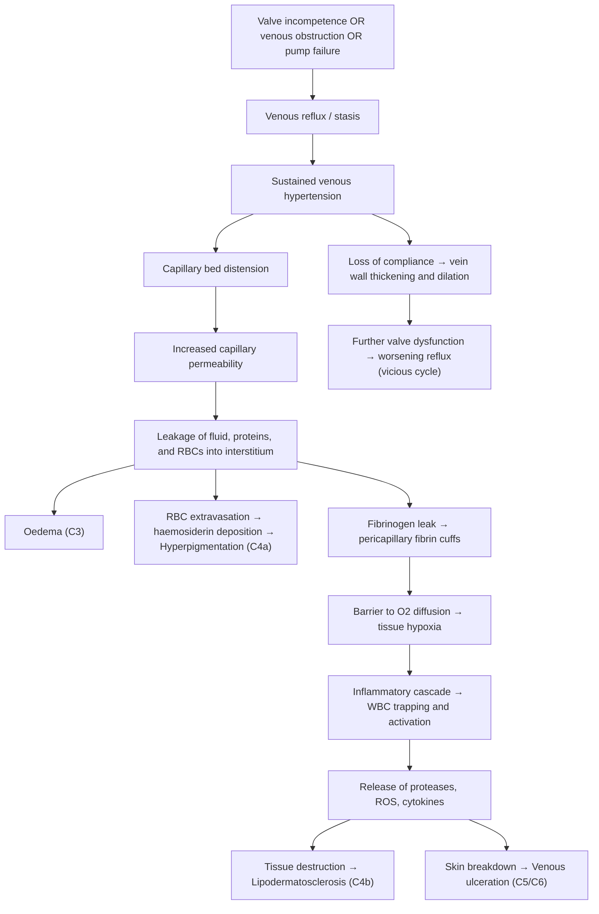

# Chronic Venous Insufficiency and Varicose Veins

## 1. Definition and Terminology

**Chronic venous disease (CVD)** is the most common vascular disorder and refers to the presence of morphological (e.g., venous dilation) and/or functional (e.g., venous reflux) abnormalities of the venous system of prolonged duration [1][2].

Let's break down the key terminology, because students constantly mix these up:

- **Chronic venous disease (CVD)**: The umbrella term — encompasses the entire spectrum from asymptomatic spider veins (C1) through to active venous ulceration (C6). Think of it as "anything wrong with the veins over time."
- **Chronic venous insufficiency (CVI)**: A subset of CVD referring specifically to the presence of **oedema, skin changes, or ulceration** (i.e., CEAP C3–C6). It implies the venous system has failed to the point that tissue damage is occurring. Most commonly associated with chronic venous reflux [1][2].
- **Varicose veins**: ***Dilated, tortuous subcutaneous veins ≥ 3 mm in diameter measured in the upright position with demonstrable reflux*** [1][2]. The "≥ 3 mm" and "upright position" qualifiers are important — veins that are dilated when supine may be physiological.
- **Telangiectasia** (spider veins): Intradermal venules < 1 mm [3].
- **Reticular veins**: Dilated subdermal veins 1–2.9 mm, typically bluish and non-palpable [3].

<Callout title="Don't Confuse CVD and CVI">
CVD = entire spectrum (C0–C6). CVI = only the clinically significant end (C3–C6, i.e., oedema, skin changes, or ulceration). Every patient with CVI has CVD, but not every patient with CVD has CVI.
</Callout>

---

## 2. Epidemiology

### Global and Hong Kong Context

- **Prevalence**: CVD is extremely common. Varicose veins affect approximately 25–30% of women and 15–20% of men in Western populations. In the Edinburgh Vein Study, trunk varices were seen in ~40% of men and ~32% of women [4].
- ***More common in older people*** [1]
- ***More common in females (~10× more common than males in some series)*** — though modern epidemiological data suggests the sex ratio is closer to 1.5–3:1 (F:M) when standardised assessment is used. The older "10×" figure likely reflects reporting/cosmetic consultation bias [1].
- ***More common in Europe and North America*** compared to Africa and Asia, though prevalence in urbanised Asian populations (including Hong Kong) is rising with lifestyle changes (sedentary jobs, obesity) [1].
- CVI (C3–C6) affects ~5% of the adult population; venous ulcers affect ~1%, with enormous healthcare cost implications.
- In Hong Kong, the ageing population and high prevalence of sedentary office work contribute to significant disease burden. Exact local prevalence data is limited but clinical experience suggests it is common in surgical outpatient clinics.

---

## 3. Anatomy and Function of the Lower Limb Venous System

Understanding the anatomy is absolutely essential — you cannot understand varicose veins or CVI without knowing how blood gets back to the heart from the legs.

### 3.1 Three Venous Systems

The lower limb venous system is divided into three compartments, separated by the **deep fascia** [1][2][3]:

| System | Location | Key Veins |
|---|---|---|
| **Deep veins** | Below the deep fascia, within the muscular compartments | Common femoral, femoral (formerly "superficial femoral" — a misnomer!), deep femoral (profunda femoris), popliteal, anterior tibial, posterior tibial, fibular (peroneal), soleal and gastrocnemius sinuses |
| **Superficial veins** | Above the deep fascia, in the subcutaneous tissue | ***Great saphenous vein (GSV)***, ***Small (lesser/short) saphenous vein (SSV)*** |
| **Perforator (communicating) veins** | Penetrate the deep fascia, connecting superficial to deep systems | Named perforators (Hunterian, Dodd, Boyd, Cockett I/II/III, May) |

<DiagramCard src="/diagrams/llveins.jpg" alt="Anterior/medial and posterior/lateral views of the lower limb venous system showing superficial veins (great and small saphenous), deep veins (femoral, popliteal, tibial), and pelvic veins (iliac)" caption="Lower limb venous anatomy — superficial and deep systems" />

### 3.2 Great Saphenous Vein (GSV)

The GSV is the longest vein in the body [1][2]:

- **Origin**: Arises from the **medial side** of the dorsal venous arch of the foot
- **Course**: Ascends **anterior to the medial malleolus** → runs up the leg **posterior to the medial border of the patella** → ascends obliquely along the **medial aspect of the thigh**
- **Termination**: Pierces the **cribriform fascia** at the **saphenofemoral junction (SFJ)** and drains into the **common femoral vein**
  - ***SFJ is located approximately 2.5 cm lateral and inferior to the pubic tubercle*** [1]
- **Nerve companion**: The ***saphenous nerve*** accompanies the GSV, especially below the knee — this is why GSV stripping below the knee risks saphenous nerve injury (numbness along medial calf/foot)

<Callout title="High Yield – SFJ Location" type="idea">
The SFJ is 2.5 cm lateral and inferior to the pubic tubercle. This is where you'd feel a saphena varix and where the Trendelenburg operation is performed. The "Mickey Mouse sign" on duplex ultrasound shows the CFV, CFA, and GSV in cross-section at this level.
</Callout>

### 3.3 Small Saphenous Vein (SSV)

- **Origin**: Arises from the **lateral side** of the dorsal venous arch of the foot
- **Course**: Ascends **posterior to the lateral malleolus** → runs up the **midline of the calf** posteriorly
- **Termination**: Pierces the deep fascia over the **popliteal fossa** and drains into the **popliteal vein** at the **saphenopopliteal junction (SPJ)**
- **Nerve companion**: The ***sural nerve*** accompanies the SSV — SSV surgery risks sural nerve injury (numbness along posterolateral leg and lateral foot) [1][2]

### 3.4 Perforator (Communicating) Veins

These are ***valved veins that join the superficial to the deep veins at inconstant sites, allowing blood to flow from superficial → deep venous system*** [1][2]. They are critical because when their one-way valves fail, high-pressure deep venous blood refluxes into the superficial system, contributing to CVI.

Named perforators (from proximal to distal):

| Perforator | Location | Drains Into |
|---|---|---|
| **Hunterian** | Proximal thigh | Femoral vein |
| **Dodd** | Mid-thigh | Superficial femoral vein |
| **Boyd** | Below knee (proximal calf) | Gastrocnemius vein |
| **Cockett I, II, III** | Lower leg (medial aspect) | Posterior tibial vein |
| **May** | Ankle | Posterior tibial vein and plantar vein |

The Cockett perforators are particularly important because they are in the **"gaiter area"** (lower medial calf/ankle) — this is precisely where venous ulcers develop.

### 3.5 Physiology of Venous Return

Why doesn't blood just pool in our legs when we stand up? Several mechanisms work together [2][3]:

1. **Calf muscle pump (the "peripheral heart")** — ***this is the major mechanism***
   - Contraction of calf muscles (gastrocnemius, soleus) compresses the large venous sinuses within the muscles
   - This squeezes blood into the popliteal veins and propels it cephalad towards the heart
   - During **relaxation**, the deep venous pressure drops, and blood flows from the superficial system into the deep system via the perforator veins
   
2. **One-way bicuspid valves**
   - Present in all three venous systems (deep, superficial, perforator)
   - Ensure **unidirectional flow**: deep veins → towards the heart; superficial → towards deep; perforators → superficial to deep only
   - Valve closure is triggered by retrograde flow — when blood starts to fall back, the valve cusps fill and coapt

3. **Respiratory pump**
   - ***Decreased intrathoracic pressure during inspiration*** creates a pressure gradient that sucks blood from the abdomen and lower limbs into the thorax

4. **Vis a tergo** (force from behind) — residual arterial pressure transmitted through capillary beds
5. **Venous tone** — smooth muscle in venous walls maintains basal tone under sympathetic control

<Callout title="Key Concept – The Calf Muscle Pump">
Think of it as a "second heart." When you walk, your calf muscles squeeze blood upward through the deep veins. During relaxation, the deep venous pressure drops below the superficial venous pressure, allowing blood to flow inward through perforators. Valves prevent backflow. When any part of this system fails (valves, muscles, or venous patency), venous hypertension develops.
</Callout>

---

## 4. Etiology and Risk Factors

### 4.1 Risk Factors

The risk factors make intuitive sense once you understand the physiology — anything that increases venous pressure, damages valves, or impairs the calf pump [1][2][3]:

| Risk Factor | Mechanism |
|---|---|
| ***Female sex*** | Oestrogen/progesterone cause venous wall relaxation and valve dysfunction; pregnancy; higher collagen laxity |
| ***Increasing age*** | Progressive loss of venous wall elastin and collagen, cumulative valve damage |
| ***Obesity*** | Increased abdominal pressure → impedes venous return; chronic inflammation; reduced physical activity |
| ***Family history*** | Genetic predisposition to weak venous wall/valve structure (collagen subtypes, MMPs) |
| ***Prolonged standing (occupational)*** | Sustained hydrostatic pressure column without calf pump activation (teachers, surgeons, hairdressers) |
| ***Pregnancy*** | ① Increased blood volume, ② Hormonal venous wall relaxation, ③ Uterine compression of IVC/iliac veins, ④ Increased abdominal pressure |
| ***Previous DVT*** | Valve destruction by thrombotic/inflammatory process (post-thrombotic syndrome) |
| ***Chronic cough / constipation*** | ***Increased abdominal pressure*** → impedes venous return |
| Sedentary lifestyle | Reduced calf muscle pump activity |
| Smoking | Endothelial damage, chronic inflammation |
| Previous superficial thrombophlebitis | Direct valve damage |
| Trauma | Direct venous/valve damage |

### 4.2 Causes — Primary vs. Secondary

#### Primary Varicose Veins / CVI (~70–80%)
- ***Idiopathic*** — most common
- Intrinsic abnormalities in the venous wall:
  - ***Dysfunctional smooth muscle cell proliferation***
  - ***Abnormal collagen deposition***
  - ***Decreased elastin content***
  - ***Increased matrix metalloproteinase (MMP) activity*** — MMPs degrade the extracellular matrix of the venous wall, weakening it [1]
- The vein wall weakens → dilates → the valve leaflets can no longer coapt → reflux → further dilation → a vicious cycle

#### Secondary Varicose Veins / CVI

Secondary causes are classified by mechanism [1][2][3]:

| Mechanism | Causes | Explanation |
|---|---|---|
| **Obstruction to venous flow** | ***Pregnancy***; superficial thrombophlebitis; external compression (***ovarian cysts, fibroids, pelvic cancers — CA cervix/uterus/ovary/rectum***); ***May-Thurner syndrome*** | If outflow is blocked, pressure builds up distally. May-Thurner = left common iliac vein compressed by right common iliac artery against lumbar vertebra — important cause of left-sided DVT/CVI in young women |
| **Valvular destruction/dysfunction** | ***DVT (accounts for most secondary cases)*** — post-thrombotic syndrome | Thrombus organisation and recanalisation damages valve leaflets → permanent reflux. This is the most important secondary cause [1] |
| **Increased flow and pressure** | ***Arterio-venous (AV) fistula*** (congenital or acquired) | High-pressure arterial blood entering the venous system overwhelms venous capacity |
| **Failure of venous pump** | ***Stroke, musculoskeletal weakness***, paralysis, prolonged immobility | Without functioning calf muscles, venous return depends on gravity and respiratory pump alone — totally inadequate |

#### Congenital Causes of CVI (rare but examinable) [3]

- ***Klippel-Trénaunay syndrome***: Congenital venous malformation causing a triad of:
  1. Varicose veins (classically over **lateral aspect of thigh** — i.e., NOT in typical GSV/SSV distribution)
  2. Port wine stains (capillary malformation)
  3. Bony and soft tissue hypertrophy of the affected limb
  
- ***Parkes-Weber syndrome***: Multiple congenital AV fistulae with limb hypertrophy, potentially causing **high-output heart failure** (because the fistulae shunt blood from the arterial to the venous system, increasing preload)

<Callout title="May-Thurner Syndrome" type="idea">
If a young woman presents with left leg swelling and varicose veins, think May-Thurner: the left common iliac vein is compressed between the right common iliac artery and the lumbar spine. It predisposes to left ilio-femoral DVT and chronic venous insufficiency. This is a favourite exam question.
</Callout>

---

## 5. Pathophysiology

### 5.1 The Central Concept: Venous Hypertension

***The core pathophysiology of both varicose veins and CVI is venous hypertension*** [2][3].

Normal ambulatory venous pressure in the foot is ~20–25 mmHg (because the calf muscle pump effectively empties the veins during walking). In CVI, ambulatory venous pressure rises to 60–90 mmHg.

Here is the pathophysiological cascade:

### 5.2 Key Pathophysiological Mechanisms in Detail

1. **Reflux (>80% of cases)** [1]: When valves are incompetent, blood refluxes during relaxation of the calf pump. In the standing position, this creates a continuous column of hydrostatic pressure from the heart to the ankle, with no effective "breaks."

2. **White cell trapping hypothesis** (Coleridge-Smith): Venous hypertension causes leucocytes to marginate, adhere to capillary endothelium, become activated, and release inflammatory mediators (proteolytic enzymes, free radicals) → endothelial damage and tissue destruction.

3. **Fibrin cuff hypothesis** (Browse and Burnand): Fibrinogen leaks through distended capillaries, polymerises into pericapillary fibrin cuffs → acts as a physical barrier to O₂ and nutrient diffusion → tissue ischaemia.

4. **Growth factor trapping hypothesis** (Falanga and Eaglstein): Macromolecules that leak into the interstitium bind and "trap" growth factors essential for tissue repair, impeding wound healing.

In practice, all three mechanisms likely operate simultaneously.

### 5.3 Why the "Gaiter Area"?

Venous ulcers classically occur at the **medial gaiter area** (the zone between the lower calf and medial malleolus). Why?

- This is the site of the **medial calf perforators (Cockett perforators)**, which connect the posterior tibial vein to the GSV tributaries
- When these perforator valves fail, high-pressure deep venous blood is transmitted directly to the superficial subcutaneous tissues in this area
- The skin here is thin and poorly vascularised to begin with, making it particularly vulnerable to venous hypertension-mediated injury [3]

---

## 6. Classification — CEAP

The **CEAP classification** is the internationally accepted classification system for chronic venous disease. It stands for **Clinical-Etiological-Anatomical-Pathophysiological** [1][2][3].

### Clinical (C) Classification

| Class | Description | Key Details / Pathophysiology |
|---|---|---|
| **C0** | No visible or palpable signs of venous disease | Patient may still be symptomatic (e.g., heaviness, aching) |
| **C1** | ***Telangiectasia (< 1 mm) or reticular veins (1–2.9 mm)*** | Intradermal venules; "spider veins." Malleolar flare / ***corona phlebectatica*** (fan-shaped telangiectasia below medial malleolus) is technically C1 but has prognostic significance — it is often the earliest visible sign of CVI [3] |
| **C2** | ***Varicose veins (≥ 3 mm)*** | Dilated, tortuous subcutaneous veins with demonstrable reflux |
| **C3** | ***Oedema*** without skin changes | Pitting oedema from increased capillary permeability and interstitial fluid accumulation due to venous hypertension |
| **C4a** | ***Pigmentation and/or eczema*** | **Pigmentation**: Haemosiderin deposition from extravasated RBCs broken down by macrophages. **Eczema (venous stasis dermatitis)**: Inflammatory response to leaked plasma proteins; itchy, erythematous, sometimes weeping |
| **C4b** | ***Lipodermatosclerosis (LDS) and/or atrophie blanche*** | **LDS**: Progressive fibrosis of skin and subcutaneous tissue due to chronic inflammation and fibrin deposition. Clinically: ***hyperpigmentation + erythema + induration + tenderness*** (palpate!). Gives the classic "inverted champagne bottle" appearance. **Atrophie blanche**: ***Avascular fibrotic scars — ivory-white areas with hyperpigmented borders***. Prone to secondary ulceration due to poor blood supply [3] |
| **C5** | ***Healed venous ulceration*** with skin changes as above | Evidence of prior tissue breakdown. At medial gaiter area. ***Long-standing ulcer → Marjolin's ulcer (2%)*** — malignant transformation, usually to SCC [3] |
| **C6** | ***Active venous ulceration*** | Full-thickness skin loss. ***Usually painless unless infected (commonly S. aureus)*** [3]. Located at medial gaiter area |

Each C class is further subscripted as **S** (symptomatic) or **A** (asymptomatic). For example, C2S = symptomatic varicose veins.

### Etiological (E) Classification

| Code | Meaning |
|---|---|
| **Ec** | Congenital |
| **Ep** | Primary (most common — degenerative, idiopathic) |
| **Es** | Secondary (e.g., post-thrombotic) |
| **En** | No venous cause identified |

### Anatomical (A) Classification

| Code | Meaning |
|---|---|
| **As** | Superficial veins |
| **Ap** | Perforator veins |
| **Ad** | Deep veins |
| **An** | No venous location identified |

### Pathophysiological (P) Classification

| Code | Meaning |
|---|---|
| **Pr** | Reflux |
| **Po** | Obstruction |
| **Pr,o** | Reflux + Obstruction |
| **Pn** | No venous pathophysiology identified |

**Example**: A patient with symptomatic varicose veins from primary GSV reflux would be classified as: **C2S, Ep, As, Pr**

<Callout title="CEAP is High Yield" type="error">
Students often only memorise the C classification and forget E, A, and P. The full CEAP classification is frequently asked in summative exams. Remember: C = what you see, E = why it happened, A = where it is, P = what went wrong mechanistically.
</Callout>

---

## 7. Clinical Features

### 7.1 Symptoms (with pathophysiological basis)

| Symptom | Details | Pathophysiological Basis |
|---|---|---|
| **Cosmetic concern / unsightly veins** | ***The principal complaint for many patients*** — visible dilated, tortuous veins. Truncal, tributary, reticular, and perforatory varicosities [1] | Venous wall weakness and valve failure → vein dilation and tortuosity |
| ***Pain / Aching*** | ***Dull ache, tingling, or burning, usually in the calf and lower leg. Worse with prolonged standing; relieved by lying down, leg elevation, or compression stockings*** [1][3] | Venous hypertension → distension of vein walls → stimulation of nociceptors. Standing worsens the hydrostatic column; elevation reduces it. Compression counteracts the distension |
| ***Heaviness / dragging sensation*** | Heavy, tired legs, especially at end of day [1][3] | Increased venous pooling → increased leg volume → sensation of heaviness |
| ***Ankle swelling*** | Usually worse at end of day, improves overnight [1] | Venous hypertension → increased capillary hydrostatic pressure → transudation of fluid into interstitium (Starling forces) |
| ***Night cramps*** | Painful involuntary muscle contractions at night [1] | Mechanism not fully understood — possibly related to electrolyte shifts from chronic oedema, or muscle metabolite accumulation from venous stasis |
| ***Itchiness (pruritus)*** | Especially around ankles [1][3] | Venous stasis dermatitis — inflammatory mediators released from trapped leucocytes and degraded blood products stimulate cutaneous nerve endings |
| ***Early fatigue*** | Legs tire easily [1] | Impaired venous return → reduced clearance of metabolic waste products from exercising muscle → early fatigue |
| **Worsening pattern** | ***Symptoms typically worsen throughout the course of the day / with standing and are relieved by lying down / leg elevation*** [3] | Cumulative venous pooling during the day with hydrostatic load; elevation eliminates the hydrostatic component |

### 7.2 Signs (with pathophysiological basis)

On examination, signs progress along the CEAP spectrum:

#### Inspection

- ***Surgical scars*** — previous venous surgery? (recurrent varicose veins) [1][3]
- ***Location of varicosities*** — this tells you which system is incompetent [1][2][3]:
  - **Medial thigh and medial calf** → ***GSV incompetence***
  - **Posterior calf** → ***SSV incompetence***
  - **Anterolateral thigh and anterolateral calf** → ***Isolated incompetence of proximal anterolateral GSV tributary***
- **Skin changes of CVI**:
  - ***Corona phlebectatica (malleolar flare)***: ***Fan-shaped telangiectasia on the ankle/foot, first appearing in a triangular area below the medial malleolus*** with the apex over the first/second lower leg communicating vein [3]. This is often the earliest visible sign of CVI.
  - ***Hyperpigmentation***: Brown discolouration from haemosiderin (breakdown product of extravasated RBCs). May cover the entire lower limb in severe cases [3].
  - ***Venous stasis eczema***: Erythematous, scaly, weeping skin — inflammatory response to leaked plasma proteins and haemosiderin.
  - ***Lipodermatosclerosis (LDS)***: ***Hyperpigmentation + erythema + induration + tenderness*** — progressive fibrosis giving the "inverted champagne bottle" leg [3]. **Acute LDS** is often ***misdiagnosed as cellulitis or acute thrombophlebitis*** because it is painful, hot, red, and tender [3].
  - ***Atrophie blanche***: ***Ivory-white avascular scars with hyperpigmented borders*** — represents areas where tissue has undergone fibrosis and the microvasculature has been obliterated [3].
  - ***Venous ulcers***: At medial gaiter area (see Section 5.3 for why). Typically **shallow**, **irregular but gently sloping edges**, with **slough or granulation tissue at base**. ***Usually painless unless infected*** [3].
  - ***Fixed flexion of ankle*** — subcutaneous fibrosis from chronic LDS and/or painful ulceration may cause contracture [3]

<Callout title="Acute Lipodermatosclerosis — Common Misdiagnosis" type="error">
Acute LDS presents with a painful, hot, red, tender area on the medial lower leg — it looks exactly like cellulitis. The key differentiator: acute LDS occurs in the context of known CVI, is bilateral (or at least in the expected distribution), and does not respond to antibiotics. Always examine for underlying CVI when you see "cellulitis" on the lower leg.
</Callout>

#### Palpation

- ***Palpate along the course of the GSV and SSV and their tributaries*** to feel for varicosities and tenderness [1][3]
- ***Check peripheral pulses*** — this is critical because:
  - You need to ***rule out peripheral arterial disease (PAD)*** before applying compression therapy
  - Compression on an ischaemic limb can cause tissue necrosis
  - ***ABPI must be checked — absolute contraindication to compression if ABPI < 0.4*** [3]
- ***Pitting oedema*** — increased interstitial fluid from venous hypertension; usually confined to the ankle but can extend to the foot and rest of the leg [1]
- ***Saphena varix*** — a compressible lump in the inguinal region (at the SFJ) that:
  - Empties on pressure and refills when released
  - Has a ***cough impulse*** (transmitted venous pressure)
  - Must be distinguished from femoral hernia (which has a cough impulse but is not easily reducible and lies below/lateral to the pubic tubercle) [1][3]
- ***Palpate inguinal lymph nodes*** — if venous ulcers are present, check for lymphadenopathy (infection, or rarely Marjolin's ulcer — malignant transformation) [3]
- ***Test neurological function*** (e.g., sural nerve) if surgical scars are present — to assess for iatrogenic nerve injury from prior surgery [3]

#### Auscultation

- ***Auscultate over varicosities for AV malformations*** — a continuous bruit suggests an arteriovenous fistula as the cause of the varicosities [1]

#### Special Tests

**Tourniquet Test (Trendelenburg Test)** — a bedside test to assess the level of venous incompetence [1][3]:

1. **Patient supine** → elevate the leg to empty the superficial veins
2. **Apply a tourniquet** to occlude the superficial veins (this blocks SFJ reflux)
3. **Patient stands up** → observe filling of varicose veins
   - If veins **remain empty** (fill slowly from below over > 30 seconds) → the tourniquet has controlled the point of reflux. This implies **SFJ incompetence**
   - If veins **fill rapidly from below** despite the tourniquet → there is incompetence **below the level of the tourniquet** (perforator or other level of reflux)
4. **Release the tourniquet** → if veins suddenly fill from above → confirms SFJ incompetence
5. The test can be repeated at different levels: ***just below SFJ, mid-thigh, above knee, below knee*** to localise the level of perforator incompetence [3]

> **Note**: In modern practice, the tourniquet test has been largely replaced by duplex ultrasound, which is far more accurate. However, it is still examined in clinical exams.

#### Completing the Examination

- ***Examine the inguinal region for mass or lymphadenopathy*** causing venous outflow obstruction [1]
- ***Abdominal and pelvic examination*** if secondary causes are suspected (ovarian cyst, fibroid, pelvic tumour)
- ***ABPI measurement*** — essential before planning any compression or surgical therapy

### 7.3 Differentiating Venous from Arterial Ulcers

This is a classic exam comparison [3][5]:

| Feature | Venous Ulcer | Arterial Ulcer |
|---|---|---|
| **Location** | ***Medial gaiter area*** | Tips of toes, between digits, lateral malleolus, heel — pressure points and most distal areas |
| **Depth** | Shallow | Deep |
| **Edge** | Gently sloping | Punched-out |
| **Base** | Slough with granulation tissue | Unhealthy, necrotic, pale |
| **Pain** | ***Usually painless unless infected*** | Very painful (ischaemic pain) |
| **Surrounding skin** | ***Haemosiderin-stained, eczematous, fibrotic (LDS), oedema*** | Cold, thin, shiny, hairless skin |
| **Pulses** | Present | Absent or weak |
| **Associated conditions** | Varicose veins, DVT, recurrent phlebitis | DM, hypertension, PAD, smoking |

### 7.4 Comparison with Other Ulcer Types

| Feature | Venous | Arterial | Neuropathic | Pressure |
|---|---|---|---|---|
| **Location** | Gaiter area | Toes, heel, lateral malleolus | Plantar foot, tips of toes, lateral to 5th MT | Bony prominences, heel |
| **Pain** | Minimal | Severe | Painless | Variable |
| **Surrounding skin** | Pigmented, eczematous | Cold, shiny, hairless | Dry, cracked, calluses | Atrophic, macerated |
| **Pulses** | Present | Absent/weak | Present | Present |
| **Sensation** | Normal | Normal | Diminished | Normal |

---

## 8. Relevant Lecture Slide Highlights

From the lecture slides on toe gangrene and leg ulcers [5]:

- ***Venous ulcers account for ~70% of all lower limb ulcers***
- ***Arterial ulcers account for ~10–15%***
- ***Mixed venous-arterial ulcers are common (~15%)***
- ***Always check ABPI before applying compression — compression on an ischaemic limb is dangerous***

From the wound healing lecture [6]:

- ***Chronic venous ulcers represent wounds "stuck" in the inflammatory phase of healing***
- ***Bacterial colonisation (especially S. aureus) delays healing but does not necessarily mean clinical infection — clinical infection requires signs of surrounding cellulitis, purulent discharge, or systemic features***
- ***Biofilms are common in chronic venous ulcers and contribute to treatment resistance***

<Callout title="High Yield Summary">

**Definition**: Varicose veins = dilated, tortuous subcutaneous veins ≥ 3 mm with demonstrable reflux. CVI = oedema, skin changes, or ulceration from chronic venous dysfunction (CEAP C3–C6).

**Core pathophysiology**: Venous valve incompetence → reflux → sustained venous hypertension → capillary distension → leakage of RBCs, fluid, proteins → haemosiderin deposition, fibrin cuffs, WBC trapping → inflammation, tissue hypoxia → skin changes, fibrosis, and ulceration.

**CEAP**: C0 (no signs) → C1 (telangiectasia/reticular) → C2 (varicose veins) → C3 (oedema) → C4a (pigmentation/eczema) → C4b (LDS/atrophie blanche) → C5 (healed ulcer) → C6 (active ulcer). Plus E (aetiology), A (anatomy), P (pathophysiology).

**Anatomy**: GSV runs medially (SFJ at groin, saphenous nerve companion). SSV runs posteriorly in calf (SPJ at popliteal fossa, sural nerve companion). Perforators (Hunterian → Dodd → Boyd → Cockett → May) connect superficial to deep.

**Risk factors**: Female, age, obesity, family history, prolonged standing, pregnancy, previous DVT, increased abdominal pressure.

**Primary (idiopathic, intrinsic wall weakness) vs. Secondary (DVT → post-thrombotic syndrome is the most important secondary cause)**.

**Clinical features**: Cosmetic concern, aching (worse standing, better elevation), heaviness, ankle swelling, night cramps, itching → skin changes (pigmentation, eczema, LDS, atrophie blanche) → ulceration (medial gaiter area, painless unless infected).

**Must check ABPI** before compression — absolute CI if < 0.4.

**Venous ulcer**: Shallow, sloping edge, gaiter area, painless, haemosiderin-stained surrounding skin, pulses present.

**Acute LDS mimics cellulitis** — don't be fooled.

**Marjolin's ulcer** (SCC transformation) in 2% of long-standing venous ulcers.
</Callout>

---

<ActiveRecallQuiz
  title="Active Recall - CVI and Varicose Veins (Definition to Clinical Features)"
  items={[
    {
      question: "Define varicose veins and state the minimum diameter and position for measurement.",
      markscheme: "Dilated tortuous subcutaneous veins at least 3 mm in diameter, measured in the upright position, with demonstrable reflux."
    },
    {
      question: "Describe the three mechanisms of venous return from the lower limb and explain which is the most important.",
      markscheme: "1. Calf muscle pump (most important) - contraction squeezes venous sinuses into popliteal veins. 2. One-way bicuspid venous valves ensure unidirectional flow. 3. Respiratory pump - negative intrathoracic pressure during inspiration. Also vis a tergo and venous tone."
    },
    {
      question: "Explain why venous ulcers characteristically occur at the medial gaiter area.",
      markscheme: "Site of medial calf perforators (Cockett perforators) connecting posterior tibial vein to superficial system. When perforator valves fail, high-pressure deep venous blood is transmitted to thin, poorly vascularised subcutaneous tissue at this location."
    },
    {
      question: "A young woman presents with isolated left leg varicose veins and left leg DVT. What anatomical condition should you suspect and what is its pathophysiology?",
      markscheme: "May-Thurner syndrome. Left common iliac vein compressed between right common iliac artery and lumbar vertebral body, causing venous outflow obstruction, predisposing to left iliofemoral DVT and CVI."
    },
    {
      question: "List the full CEAP classification components and give an example classification for a patient with symptomatic varicose veins from primary great saphenous vein reflux.",
      markscheme: "C = Clinical (C0-C6), E = Etiological (Ec/Ep/Es/En), A = Anatomical (As/Ap/Ad/An), P = Pathophysiological (Pr/Po/Pro/Pn). Example: C2S, Ep, As, Pr."
    },
    {
      question: "What is the critical investigation that must be performed before applying compression therapy for venous disease, and what is the absolute contraindication threshold?",
      markscheme: "Ankle-Brachial Pressure Index (ABPI). Absolute contraindication to compression if ABPI less than 0.4 (indicates severe peripheral arterial disease - compression could cause tissue necrosis)."
    }
  ]}
/>

---

## References

[1] Senior notes: felixlai.md (Chapter 13: Vascular System — Chronic Venous Disease, pp. 941–949; Varicose Veins, pp. 950–961)
[2] Senior notes: maxim.md (Section 7.3: Chronic Venous Insufficiency, pp. 169–175)
[3] Senior notes: maxim.md (CEAP Classification, Varicose Veins section, pp. 170–175)
[4] Edinburgh Vein Study epidemiological data (referenced in lecture context)
[5] Lecture slides: WCS 002 - Toe gangrene and leg ulcer - by Prof SWK Cheng.pdf
[6] Lecture slides: GC 178. An ugly wound Wound healing; Wound infection; Anti-septic technique.pdf
