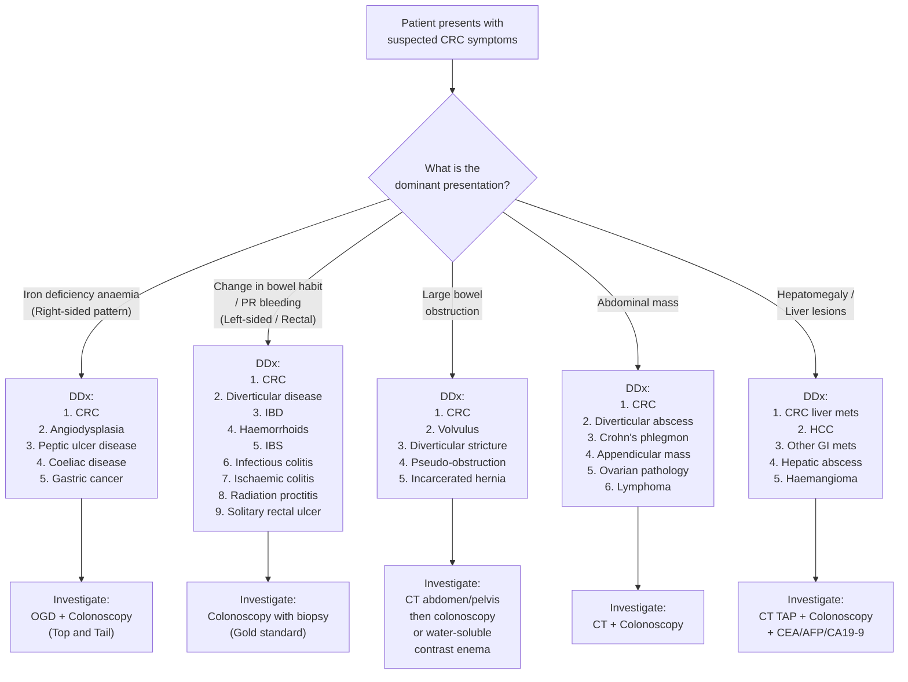

## Differential Diagnosis of Colorectal Cancer

The differential diagnosis of CRC is really the differential of **its presenting symptoms**. Since CRC has protean presentations — anaemia, change in bowel habit, PR bleeding, abdominal mass, bowel obstruction — you need to think about what else can cause each of those symptom complexes. The key clinical skill is to **never dismiss these symptoms** until CRC has been excluded, especially in patients ≥ 50.

Let me organise the differentials by the three major clinical presentations, then provide a unifying approach.

---

### 1. Approach to Differential Diagnosis by Presentation

#### 1A. Iron Deficiency Anaemia / Occult GI Blood Loss (Typically Right-Sided CRC)

This is the classic presentation of right-sided CRC — the patient presents to a GP or medical clinic with fatigue, pallor, and microcytic anaemia. The differential includes any cause of chronic GI blood loss:

| Differential | Key Distinguishing Features | Why It Can Mimic CRC |
|---|---|---|
| ***Angiodysplasia*** | Most common in age > 65; dilated tortuous submucosal vessels lacking smooth muscle; often in caecum/ascending colon; bleeding is venous and tends to be less massive than diverticular bleeding [1] | Right-sided location, occult blood loss, presents as IDA in elderly — identical to right-sided CRC |
| **Peptic ulcer disease** | Epigastric pain, NSAID/H. pylori history; may cause IDA from chronic erosive gastritis or ulcer ooze | Upper GI cause of IDA that must be excluded — always do OGD as well as colonoscopy in unexplained IDA |
| **Coeliac disease** | Malabsorption (diarrhoea, steatorrhoea, weight loss), anti-tTG antibodies positive; iron malabsorption rather than blood loss | Can cause IDA through poor duodenal iron absorption; younger patients; must consider in IDA workup |
| **Gastric cancer** | Weight loss, early satiety, epigastric mass; more common in East Asia | Chronic occult blood loss; like CRC can cause IDA |
| ***Diverticular bleeding*** | ***Painless profuse haematochezia*** — typically acute and self-limiting rather than chronic; right-sided diverticula common in Asians [1] | Can cause chronic low-grade blood loss, but usually presents acutely rather than insidiously |

<Callout title="Clinical Pearl" type="idea">
In any patient with unexplained iron deficiency anaemia (especially males of any age and post-menopausal females), the standard approach is **"top and tail" — OGD + colonoscopy**. You need to exclude both upper and lower GI malignancy. Don't stop at finding one lesion — synchronous pathology is common.
</Callout>

#### 1B. Change in Bowel Habit / PR Bleeding / Tenesmus (Typically Left-Sided / Rectal CRC)

This is the presentation that most clinicians associate with CRC. The differential includes conditions that cause similar symptoms:

| Differential | Key Distinguishing Features | Why It Can Mimic CRC |
|---|---|---|
| ***Diverticular disease / Diverticulitis*** | ***Similar clinical features and bowel wall thickening on CT*** [2]. Features suggestive of diverticulitis over CRC on CT: pericolonic/mesenteric inflammation, involvement of > 10 cm of colon, ***absence of enlarged pericolonic lymph nodes*** [2]. ***CRC can only be excluded with colonoscopy after resolution of acute inflammation*** [2] | Left-sided, change in bowel habit, LLQ pain, PR bleeding, can cause stricture and obstruction — almost identical to sigmoid CRC |
| ***Inflammatory bowel disease (UC and Crohn's)*** | ***Diarrhoea rather than abdominal pain is the predominant symptom*** [2]. Younger patients; chronic relapsing course; extra-intestinal manifestations (arthritis, uveitis, erythema nodosum); UC = bloody diarrhoea with mucus; Crohn's = RLQ pain, perianal disease, skip lesions [2][3] | Chronic PR bleeding, change in bowel habit, weight loss, anaemia; and IBD itself is a risk factor for CRC (dysplasia-carcinoma sequence) |
| ***Haemorrhoids*** | ***Fresh outlet-type bleed***, blood separate from stool (drips after defaecation or on toilet paper), ***perianal mass/pain***, associated with constipation/straining [4]. Most common cause of PR bleeding in age < 50 [1] | Bright red PR bleeding — but haemorrhoidal bleeding is characteristically "outlet-type" (separate from stool, on paper, dripping into bowl). **Critical point: never attribute PR bleeding to haemorrhoids in a patient ≥ 50 without a colonoscopy** |
| ***Irritable bowel syndrome (IBS)*** | ***Chronic abdominal pain and altered bowel habits in the absence of an organic cause*** [3]. Rome IV criteria: recurrent abdominal pain ≥ 1 day/week in last 3 months, related to defaecation, with change in stool frequency/form. No red flag features (no weight loss, no PR bleeding, no anaemia, no nocturnal symptoms) | Alternating constipation/diarrhoea, abdominal discomfort — overlaps with left-sided CRC. IBS is a **diagnosis of exclusion** — if red flags present, must colonoscope |
| ***Infectious colitis*** | ***Diarrhoea rather than abdominal pain is the predominant symptom*** [2]. Acute onset; stool cultures positive (E. coli, Salmonella, Shigella, Campylobacter, Yersinia, C. difficile); travel history, antibiotic use [3] | Acute bloody diarrhoea, abdominal cramps — can mimic acute presentation of CRC; C. difficile particularly relevant in hospitalised patients |
| ***Ischaemic colitis*** | ***Rapid onset of abdominal pain, haematochezia or bloody diarrhoea*** [2]. Risk factors: advanced age, hypertension, DM, atherosclerosis, AF, dehydration, laxative use [2]. Watershed areas (splenic flexure, rectosigmoid) affected. CT shows thumbprinting (submucosal oedema) | Elderly patient with LLQ pain and PR bleeding — similar demographic to CRC. Colonoscopy shows segmental mucosal ischaemia |
| ***Radiation colitis / proctitis*** | History of abdominal/pelvic radiotherapy (cervical, prostate, rectal cancer); can occur weeks to years after irradiation [1][3]. Telangiectasias on endoscopy | PR bleeding, tenesmus, diarrhoea — similar to rectal cancer. History of previous pelvic RT is the key distinguishing feature |
| **Solitary rectal ulcer syndrome** | ***Presents with abdominal pain, altered bowel habits and bleeding; characteristic histology with thickened mucosal layer and distortion of crypt architecture*** [3]. Associated with rectal prolapse and excessive straining | PR bleeding and tenesmus — can mimic low rectal cancer. Biopsy is essential to differentiate |
| ***Anal fissure*** | Severe pain on defaecation with small amount of bright red blood on paper; visible tear on inspection (usually posterior midline); associated with constipation and hypertonic sphincter | Outlet-type PR bleeding with pain — rarely confused with CRC, but included in the differential of any PR bleeding |

#### 1C. Bowel Obstruction (Emergency Presentation)

***CRC is the commonest cause of large bowel obstruction (LBO) in adults*** [5][6].

| Differential | Key Distinguishing Features |
|---|---|
| ***Sigmoid/caecal volvulus*** | Sigmoid volvulus: elderly, institutionalised, psychiatric patients, chronic constipation; "coffee bean" sign on AXR. Caecal volvulus: younger patients, mobile caecum |
| ***Diverticular stricture*** | History of recurrent diverticulitis → fibrotic stricture; CT shows long segment thickening without mass or lymphadenopathy; ***CRC cannot be excluded until colonoscopy after inflammation resolves*** [2] |
| ***Pseudo-obstruction (Ogilvie's syndrome)*** | Massive colonic dilation without mechanical obstruction; post-operative, electrolyte disturbance, opioids; no transition point on CT |
| ***Hernia (incarcerated)*** | Examine hernial orifices — always check! An incarcerated inguinal or femoral hernia can cause LBO |
| ***Adhesions*** | More typically cause small bowel obstruction (SBO) than LBO; history of previous abdominal surgery |
| ***Crohn's stricture*** | History of known Crohn's disease; can cause stricturing at any point in the GI tract |

<Callout title="Exam Tip" type="error">
***In any patient with large bowel obstruction, the four common causes to remember are: Cancer of colon, Volvulus, Diverticular stricture, Pseudo-obstruction*** [6]. Always examine hernial orifices and do a digital rectal examination — don't forget the basics.
</Callout>

#### 1D. Abdominal Mass

When a palpable abdominal mass is the presenting feature:

| Location | Differential Considerations |
|---|---|
| **Right iliac fossa mass** | CRC (caecal/ascending colon), Crohn's disease (ileocaecal mass/phlegmon/abscess), appendicular mass/abscess, ovarian pathology (torsion, tumour), ileocaecal TB, lymphoma |
| **Left iliac fossa mass** | CRC (sigmoid), diverticular abscess/phlegmon, ovarian pathology, constipated sigmoid colon (faecal loading) |
| **Epigastric / central** | Transverse colon CRC, gastric cancer, pancreatic cancer, omental metastatic cake, lymphoma |

#### 1E. Hepatomegaly / Liver Metastases

When the presenting complaint is from the liver rather than the bowel:

> ***Metastatic carcinoma to the liver is commoner than primary liver cancer. The commonest site of primary is the GI tract (portal venous circulation): colorectal, stomach, pancreas*** [7].

| Differential of Liver Mass/Hepatomegaly | Distinguishing Features |
|---|---|
| **CRC liver metastases** | Multiple lesions, elevated CEA, primary CRC found on colonoscopy |
| ***Hepatocellular carcinoma (HCC)*** | Background of chronic liver disease/cirrhosis, elevated AFP, arterial enhancement on CT |
| **Other GI metastases** (gastric, pancreatic) | Epigastric symptoms, elevated CA 19-9 |
| **Hepatic abscess** (amoebic/pyogenic) | Fever, RUQ pain, travel history; single/few lesions with rim enhancement |
| **Haemangioma** | Asymptomatic, incidental, characteristic peripheral nodular enhancement on CT |

---

### 2. Specific Conditions That Closely Mimic CRC

Some conditions deserve special emphasis because they are **diagnostic pitfalls**:

#### 2A. Diverticulitis vs. Sigmoid CRC

This is the most important differential in clinical practice and ***one of the most common exam scenarios*** [2].

| Feature | Diverticulitis | Sigmoid CRC |
|---|---|---|
| Onset | Acute (hours to days) | Chronic/insidious (weeks to months) |
| Pain | LLQ pain, constant, with tenderness | Colicky pain, change in bowel habit |
| CT findings | Pericolonic fat stranding, ***involvement > 10 cm***, diverticula seen, ***no enlarged LN*** [2] | Focal mass, ***enlarged pericolonic LN***, shouldering/irregular wall thickening |
| Colonoscopy | Deferred until acute inflammation resolves (6–8 weeks) | Diagnostic — mass with biopsy |
| Key principle | ***CRC can only be excluded with colonoscopy after resolution of acute inflammation*** [2] | — |

**Why is this so important?** Because on CT, an inflamed segment of sigmoid with diverticulitis can look identical to a perforated sigmoid cancer. You cannot safely colonoscope during acute diverticulitis (risk of perforation), so you must wait, treat conservatively, then scope. If you don't scope, you will miss cancers.

#### 2B. Haemorrhoids vs. Rectal CRC

> ***Haemorrhoids are the most common cause of PR bleeding in patients aged < 50*** [1], but they also commonly co-exist with CRC. **Never assume haemorrhoids are the sole diagnosis in a patient with red flag symptoms.**

Red flags mandating colonoscopy even if haemorrhoids are present: age ≥ 50, family history of CRC, change in bowel habit, weight loss, anaemia, tenesmus, mixed blood with stool (not just outlet-type), or positive FIT.

---

### 3. Differential Diagnosis Decision Framework (Mermaid Diagram)

---

### 4. How to Distinguish CRC from Its Key Differentials: Summary Table

| Feature | Favours CRC | Favours Alternative Diagnosis |
|---|---|---|
| Age ≥ 50 | ✓ (dominant risk factor) | Younger age more typical of IBD, IBS, haemorrhoids |
| Chronicity | Insidious, progressive over weeks-months | Acute onset (diverticulitis, ischaemic colitis, infectious) |
| Weight loss / anorexia | ✓ (cancer cachexia) | Absent in haemorrhoids, IBS |
| PR bleeding pattern | Dark blood mixed with stool | Outlet-type (haemorrhoids), bloody diarrhoea (IBD, infectious) |
| Change in stool calibre | ✓ (annular constricting lesion) | Not typical of other conditions |
| Tenesmus | ✓ (rectal mass) | Can occur with proctitis (IBD, radiation) |
| Family history of CRC / polyps | ✓ | Family history of IBD, coeliac, etc. |
| Iron deficiency anaemia (male/post-menopausal female) | ✓ — CRC until proven otherwise | Coeliac, menorrhagia (pre-menopausal), angiodysplasia |
| CT: focal mass + enlarged LN | ✓ | Long-segment inflammation without LN (diverticulitis) |
| ***Colonoscopy: endoluminal mass with friability, induration, ulceration*** [3] | ✓ (diagnostic gold standard with biopsy) | Normal mucosa, diverticula, inflammatory changes, etc. |

---

### 5. Don't Forget These Associations

| Association | Why It Matters |
|---|---|
| ***Streptococcus gallolyticus (bovis) bacteraemia → CRC*** | Always colonoscope — strong association with CRC/adenomas |
| ***Acromegaly → CRC*** | ***IGF-1 as growth factor for colonic mucosal cells*** [8] |
| ***IBD (especially UC) → CRC*** | Dysplasia-carcinoma sequence; risk increases with duration > 8–10 years |
| ***Hereditary syndromes (FAP, Lynch) → CRC*** | Family history + early-onset CRC = genetic testing + extended surveillance |
| ***Dermatomyositis in an older patient → occult malignancy (including CRC)*** | Paraneoplastic; always screen for underlying cancer |

---

<Callout title="High Yield Summary">

**Key Differentials by Presentation:**

1. **IDA / occult blood loss (right-sided pattern):** CRC, angiodysplasia, PUD, coeliac disease, gastric cancer → investigate with "top and tail" (OGD + colonoscopy).

2. **Change in bowel habit / PR bleeding (left-sided/rectal):** CRC, diverticular disease (most important DDx — cannot exclude CRC without colonoscopy after acute episode resolves), IBD, haemorrhoids, IBS, infectious/ischaemic colitis, radiation proctitis. Never attribute PR bleeding to haemorrhoids in ≥ 50 without colonoscopy.

3. **Large bowel obstruction:** CRC (commonest cause in adults), volvulus, diverticular stricture, pseudo-obstruction. Always check hernial orifices and do DRE.

4. **Abdominal mass:** CRC, diverticular abscess, Crohn's phlegmon, appendicular mass, ovarian pathology.

5. **Liver mass/hepatomegaly:** CRC liver mets (commonest cause of liver secondaries from GI), HCC, other GI mets, abscess.

**Critical pitfall:** Diverticulitis vs. sigmoid CRC — CT alone cannot distinguish; colonoscopy after inflammation resolves is mandatory.

</Callout>

---

<ActiveRecallQuiz
  title="Active Recall - Differential Diagnosis of Colorectal Cancer"
  items={[
    {
      question: "A 65-year-old man presents with LLQ pain, fever, and CT showing sigmoid wall thickening with pericolonic fat stranding. Name three CT features that favour diverticulitis over sigmoid CRC.",
      markscheme: "1. Pericolonic and mesenteric inflammation (fat stranding). 2. Involvement of more than 10 cm of colon (long segment). 3. Absence of enlarged pericolonic lymph nodes. Key point: CRC cannot be excluded without colonoscopy after resolution of acute inflammation."
    },
    {
      question: "List the four most common causes of large bowel obstruction in adults.",
      markscheme: "1. Cancer of the colon (commonest). 2. Volvulus (sigmoid or caecal). 3. Diverticular stricture. 4. Pseudo-obstruction (Ogilvie syndrome)."
    },
    {
      question: "A 55-year-old post-menopausal woman presents with fatigue and Hb 85 g/L, MCV 68 fL. What investigations would you request to identify the cause, and why?",
      markscheme: "Iron deficiency anaemia in a post-menopausal female: must exclude GI malignancy. Perform both OGD (upper GI cause e.g. gastric cancer, PUD) and colonoscopy (lower GI cause e.g. CRC, angiodysplasia) - the top and tail approach. Also iron profile to confirm IDA. Do not stop if one lesion found - synchronous pathology is common."
    },
    {
      question: "Why should you never attribute PR bleeding solely to haemorrhoids in a patient aged 50 or above?",
      markscheme: "Haemorrhoids and CRC can co-exist. CRC is common in age 50 or older and presents with PR bleeding. Attributing bleeding to haemorrhoids without colonoscopy risks missing an underlying CRC. Any patient with red flags (age 50 or above, change in bowel habit, weight loss, anaemia, tenesmus, blood mixed with stool, positive FIT, family history) needs colonoscopy."
    },
    {
      question: "Name two conditions outside the GI tract that are strongly associated with occult CRC and mandate colonoscopy.",
      markscheme: "1. Streptococcus gallolyticus (formerly S. bovis) bacteraemia or endocarditis. 2. Dermatomyositis (paraneoplastic - screen for underlying malignancy including CRC). Also accept: acromegaly (IGF-1 promotes colonic mucosal proliferation)."
    }
  ]}
/>

## References

[1] Senior notes: felixlai.md (Lower GI bleeding, pages 343, 510–511)
[2] Senior notes: felixlai.md (Diverticulitis differential diagnosis, page 641)
[3] Senior notes: felixlai.md (Ulcerative colitis / Crohn's disease differential diagnosis, pages 650, 663)
[4] Senior notes: maxim.md (LGIB DDx table, page 158)
[5] Lecture slides: GC 194. Intestinal obstruction colorectal cancer.pdf
[6] Lecture slides: GC 195. Lower and diffuse abdominal pain RLQ problems; pelvic inflammatory disease; peritonitis and abdominal emergencies.pdf (page 28)
[7] Lecture slides: WCS 064 - A large liver - by Prof R Poon [20191108].doc.pdf (page 6)
[8] Senior notes: maxim.md (Risk factors, page 214)
