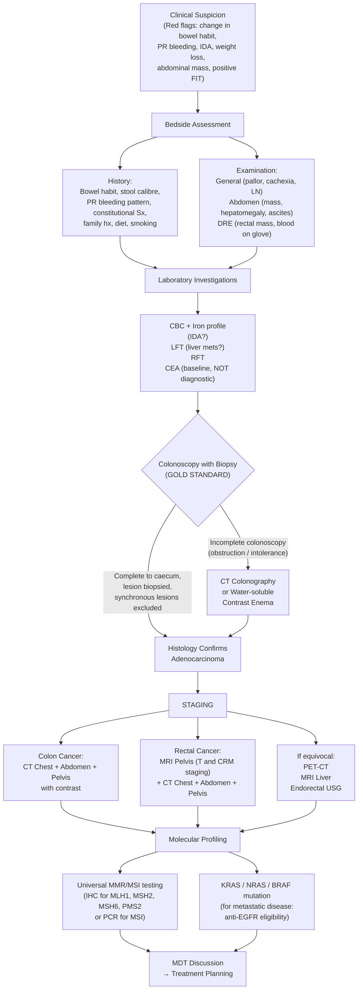

## Diagnostic Criteria, Diagnostic Algorithm, and Investigation Modalities for Colorectal Cancer

---

### 1. Diagnostic Criteria — What Establishes the Diagnosis of CRC?

Unlike some conditions (e.g., rheumatoid arthritis with ACR criteria, or SLE with SLICC criteria), CRC does not have a formal "diagnostic criteria checklist." Instead, the diagnosis rests on a fundamental principle:

> **CRC is diagnosed by histopathological confirmation of adenocarcinoma on biopsy obtained at colonoscopy.** There is no substitute — imaging, tumour markers, and clinical features raise suspicion, but only tissue biopsy proves the diagnosis.

That said, there are well-defined criteria and systems used at various stages of the diagnostic journey:

#### 1A. Clinical Suspicion Criteria (When to Investigate)

Any of the following "red flags" in a patient should trigger investigation for CRC:

| Red Flag | Rationale |
|---|---|
| Age ≥ 50 with new change in bowel habit > 4 weeks | CRC is the commonest cancer in HK; > 90% occurs in patients ≥ 50 [1] |
| Iron deficiency anaemia in males or post-menopausal females | Right-sided CRC causes chronic occult blood loss; IDA in these demographics is GI malignancy until proven otherwise |
| New rectal bleeding not fully explained by anorectal pathology | PR bleeding mixed with stool, dark blood, or persistent despite haemorrhoid treatment |
| Palpable abdominal or rectal mass | Direct evidence of tumour |
| Unexplained weight loss with GI symptoms | Suggests underlying malignancy |
| ***Positive faecal immunochemical test (FIT)*** or gFOBT | Screening test that detects haemoglobin in stool — must be followed by colonoscopy [9] |

#### 1B. Hereditary CRC — Diagnostic Criteria for Lynch Syndrome

Since hereditary syndromes account for ~10% of CRC and demand a completely different management approach (extended surgery, intensive surveillance), recognising them is critical:

***Amsterdam II Criteria (3-2-1 rule)*** [1]:
- ***≥ 3 relatives*** with a Lynch syndrome-associated cancer (CRC, endometrial, small bowel, ureter, renal pelvis)
- ***≥ 2 successive generations*** affected
- ***≥ 1 cancer*** diagnosed before age 50
- FAP must be excluded
- Tumours verified by pathological examination

***Revised Bethesda Criteria*** (lower threshold — selects patients for MSI testing) [1]:
- CRC diagnosed < 50 years
- CRC + ≥ 1 first-degree relative with HNPCC-related tumour, one diagnosed < 50
- CRC + ≥ 2 first-/second-degree relatives with HNPCC-related tumour regardless of age
- Synchronous/metachronous CRC or other HNPCC-related tumours
- CRC with ***MSI-H-like histology*** (tumour-infiltrating lymphocytes, Crohn's-like reaction, mucinous/signet ring, medullary, poorly differentiated) diagnosed < 60

Current practice (2024–2026 guidelines): **Universal MMR/MSI testing on all newly diagnosed CRC** is now recommended regardless of age or family history, because:
1. It identifies Lynch syndrome even when family history is incomplete
2. It predicts response to immunotherapy (checkpoint inhibitors) in metastatic disease
3. It informs adjuvant chemotherapy decisions (MSI-H stage II → no 5-FU benefit; MSI-H stage IV → pembrolizumab first-line)

#### 1C. FAP — Diagnostic Criteria

- Colonoscopy showing ***> 100 adenomatous polyps*** + extra-colonic features [1]
- Genetic testing: ***APC mutation positive in ~75%*** of FAP [1]
- Attenuated FAP: < 100 polyps, later onset, right-sided predominance, APC mutation in only ~30% [1]

#### 1D. TNM Staging System (AJCC/UICC 8th Edition, 2017)

Once CRC is diagnosed histologically, staging determines prognosis and treatment. This is not "diagnostic criteria" per se, but it is the framework that defines the extent of disease.

**Primary Tumour (T)** [1][10]:

| Stage | Definition | Why This Matters |
|---|---|---|
| Tis | Carcinoma in situ — ***intramucosal carcinoma involving lamina propria with no extension through muscularis mucosae*** | No metastatic risk (no lymphatics in mucosa above muscularis mucosae) — endoscopic resection curative |
| T1 | ***Invades submucosa (through muscularis mucosae)*** | First stage with metastatic potential — submucosa contains lymphatics. LN metastasis risk ~5% [1] |
| T2 | ***Invades muscularis propria*** | LN metastasis risk ~20% [1] |
| T3 | ***Invades through muscularis propria into pericolorectal tissues*** | Most common T stage at diagnosis. LN risk > 50% [1] |
| T4a | ***Penetrates to surface of visceral peritoneum*** (including gross perforation through tumour) | Peritoneal seeding risk |
| T4b | ***Directly invades or adheres to other organs or structures*** | En bloc resection required |

**Regional Lymph Nodes (N)** [1][10]:

| Stage | Definition |
|---|---|
| N0 | No regional LN metastasis |
| N1a | Metastasis in ***1*** regional LN |
| N1b | Metastasis in ***2–3*** regional LNs |
| N1c | ***Tumour deposits*** in subserosa/mesentery/non-peritonealised pericolic or perirectal tissues ***without*** regional LN metastasis |
| N2a | Metastasis in ***4–6*** regional LNs |
| N2b | Metastasis in ***≥ 7*** regional LNs |

**Distant Metastasis (M)** [10]:

| Stage | Definition |
|---|---|
| M0 | No distant metastasis |
| M1a | Metastasis to ***one*** site/organ without peritoneal metastasis |
| M1b | Metastasis to ***≥ 2*** sites/organs without peritoneal metastasis |
| M1c | ***Peritoneal metastasis*** ± other sites |

**Stage Grouping and Prognosis** [1][10]:

| Stage | TNM | 5-Year Survival |
|---|---|---|
| 0 | Tis N0 M0 | ~100% |
| I | T1–2 N0 M0 | ***90%*** |
| II | T3–4 N0 M0 | ***60–80%*** |
| III | Any T, N1–2, M0 | ***~60%*** |
| IV | Any T, Any N, M1 | ***~10%*** |

**Modified Dukes Classification (historical, still referenced)** [10]:
- ***Dukes A*** = tumour within wall of bowel (T1–2 N0)
- ***Dukes B*** = tumour invades through wall (T3–4 N0)
- ***Dukes C*** = regional LN metastasis (Any T, N+)
- ***Dukes D*** = distant metastasis (M1)

<Callout title="Why Do We Need ≥ 12 Lymph Nodes?">
***A minimum of 12 lymph nodes in the resected specimen are necessary for adequate staging*** [1][10]. This is because with fewer nodes examined, there is a risk of "stage migration" — understaging an N+ cancer as N0 simply because too few nodes were sampled. The number serves as a quality indicator for the adequacy of surgical resection and pathological examination. Paradoxically, higher node counts also correlate with better outcomes because they reflect both better surgery (wider lymphadenectomy) and better pathology (more diligent node retrieval).
</Callout>

---

### 2. Diagnostic Algorithm

The diagnostic pathway for CRC follows a logical sequence: **clinical suspicion → bedside assessment → laboratory tests → definitive endoscopic diagnosis → staging → molecular profiling → treatment planning**.

---

### 3. Investigation Modalities — Detailed Breakdown

I'll organise these as: **Bedside → Blood tests → Tumour markers → Endoscopy → Imaging for diagnosis → Imaging for staging → Molecular profiling**.

---

#### 3A. Bedside / Physical Examination

***Physical examination findings to look for:*** [1]

| Examination | What to Look For | Significance |
|---|---|---|
| ***General examination*** | ***Pallor***, cachexia, ***jaundice***, ***lymphadenopathy (supraclavicular — Virchow's node)*** | Anaemia (IDA), metastatic disease (liver mets causing jaundice; left supraclavicular LN = Troisier's sign) |
| ***Abdominal examination*** | ***Hepatomegaly*** (hard, irregular, nodular), ***ascites***, palpable mass (RIF or LIF), tenderness, distension, bowel sounds | Hepatomegaly = liver mets; ascites = peritoneal carcinomatosis; mass = locally advanced tumour |
| ***Digital rectal examination (DRE)*** | ***Per rectal bleeding, rectal masses*** [1] | Up to 75% of rectal cancers palpable on DRE. Assess: distance from anal verge, fixity (mobile/tethered/fixed), circumferential involvement, sphincter tone |
| ***Proctoscopy*** | For anorectal pathology — haemorrhoids, low rectal lesions | Quick bedside test; can visualise low rectal tumours and exclude haemorrhoids as sole cause |

<Callout title="Clinical Pearl" type="idea">
***DRE is mandatory in every patient with suspected CRC.*** It costs nothing, takes 30 seconds, and can identify rectal cancers, assess sphincter function (relevant for surgical planning), and detect blood on the glove. Missing a palpable rectal cancer because you didn't do a DRE is indefensible.
</Callout>

---

#### 3B. Blood Tests

| Test | What It Shows | Interpretation / Why |
|---|---|---|
| ***CBC with differential*** | ***Anaemia*** — specifically microcytic hypochromic (IDA) | Chronic occult blood loss from tumour; right-sided CRC classically causes IDA [1][10] |
| ***Iron profile*** (serum iron, ferritin, TIBC, transferrin saturation) | ***Iron deficiency anaemia pattern***: low ferritin, low serum iron, high TIBC | Confirms IDA as the mechanism. Ferritin < 30 μg/L is diagnostic of iron deficiency (< 100 in context of chronic disease/inflammation) |
| ***LFT*** | Elevated ALP, GGT ± elevated bilirubin | Suggests ***liver metastases*** — ALP rises first (from infiltration/compression of intrahepatic bile ducts). Isolated ALP elevation with normal bilirubin is a common early finding [10] |
| ***RFT*** (renal function) | Elevated creatinine, urea | Obstructive uropathy from pelvic tumour; dehydration from obstruction |
| Coagulation profile | Prolonged PT/INR | Liver dysfunction from extensive hepatic metastases |
| Albumin | Low albumin | Marker of nutritional status / chronic disease; prognostic indicator |

---

#### 3C. Tumour Markers

##### ***Carcinoembryonic Antigen (CEA)*** [1][10]

CEA is a glycoprotein ("carcino-" = cancer, "embryonic" = normally expressed in foetal tissue, "antigen" = protein detectable by antibody) found on the surface of epithelial cells. It is the most widely used tumour marker for CRC, but it is **fundamentally a monitoring tool, not a diagnostic test**.

| Feature | Detail |
|---|---|
| ***Cut-off*** | ***< 4.7 ng/mL*** (some use < 5.0) [10] |
| ***Sensitivity*** | ***Low*** — ***elevated in only ~50% of CRC***; ***serum level can be normal in 30–40% of patients in early disease*** [1]. ***Sensitivity ~30% for early CRC*** [11] |
| ***Specificity*** | ***Low*** — ***false positives: pregnancy, smoking, TB, IBD, other carcinomas (GI tract, pancreas, breast)*** [10]. CEA may be first-pass metabolised by the liver, so portal-drained tumours may have falsely low CEA [10] |
| ***Diagnostic role*** | ***NOT recommended as a screening or diagnostic test for CRC*** [1] |
| ***Clinical significance*** | (1) ***Pre-operative baseline*** to facilitate surgical planning; (2) ***Post-operative follow-up to detect recurrence or metastasis*** — a rising CEA post-surgery strongly suggests recurrence; (3) ***Prognostication*** — very high pre-op CEA (> 200) suggests advanced/metastatic disease [1][10] |
| ***Post-op kinetics*** | ***Takes 4–6 weeks to return to normal*** post-operatively [10]. If CEA does not normalise, suspect residual disease |

> ***CEA can pick up non-portovenous distant metastases (e.g., lung) even if pre-op CEA was normal*** [10] — because when the primary tumour drained via the portal system, the liver metabolised CEA (first-pass effect), keeping serum levels low. If metastases develop outside the portal drainage (e.g., lung), CEA now enters the systemic circulation directly and becomes elevated.

##### ***Elevated CEA or CA 19-9*** in context of liver metastases [7]

***In some cases of primary GI malignancy with liver metastases, elevated CEA or CA 19-9 may be found*** [7]. CA 19-9 is more relevant for pancreaticobiliary malignancy but can be modestly elevated in CRC.

<Callout title="Exam Pitfall" type="error">
A common mistake: using CEA to diagnose CRC. CEA has terrible sensitivity for early-stage disease (normal in 30–40% of patients). It is NOT a screening or diagnostic test. Its value is in **monitoring** — baseline pre-op, post-op follow-up, and detecting recurrence. If the exam asks "what tumour marker do you use to diagnose CRC?", the answer is "none — diagnosis is by colonoscopy and biopsy."
</Callout>

---

#### 3D. Endoscopy — The Diagnostic Gold Standard

##### ***Colonoscopy with Biopsy***

> ***Colonoscopy is the current gold standard in detecting colonic neoplasm*** [1][10][11].

| Feature | Detail |
|---|---|
| ***Principle*** | Direct visualisation of the entire colonic mucosa from rectum to caecum using a flexible fibreoptic endoscope |
| ***Diagnostic capability*** | ***Most accurate — can localise and biopsy lesions through the large bowels*** [1]. Obtains tissue for histological confirmation of adenocarcinoma |
| ***Typical findings in CRC*** | ***Majority of colon and rectal cancers are endoluminal masses arising from mucosa and protruding into the lumen with exophytic or polypoid appearance. Bleeding may be seen in lesions that are friable, necrotic or ulcerated*** [1] |
| ***Synchronous lesions*** | ***Exclude synchronous cancers (3–5%) and synchronous polyps (30–50%)*** [10]. This is why complete colonoscopy to the caecum is mandatory |
| ***Pre-operative localisation*** | ***Tattooing (inject ink to stain tumour)*** — especially important for small tumours that may not be palpable at surgery; ink marks guide the surgeon intra-operatively [10] |
| ***Therapeutic capability*** | Polypectomy for benign polyps; ***therapeutic modalities include clipping, electrocoagulation, laser, argon plasma coagulation, sclerotherapy*** [11] |
| ***Requirements*** | ***Diet and bowel preparation ± sedation*** [11] |
| ***Complications*** | ***Chance of perforation ≤ 0.1%*** [11]; bleeding (especially post-polypectomy); post-polypectomy syndrome (transmural burn without frank perforation — localised peritonism); sedation risks |

##### When Colonoscopy Cannot Be Completed

***Incomplete colonoscopy*** occurs when the scope cannot reach the caecum due to:
- Mechanical obstruction by the tumour (obstructing CRC)
- Patient intolerance / inadequate bowel preparation
- Tortuosity / adhesions

In these situations, alternative investigations are used:

##### ***CT Colonography (CTC) / Virtual Colonoscopy***

> ***Also known as virtual colonoscopy — computer-simulated endoluminal perspective of the air-filled distended colon*** [1].

| Feature | Detail |
|---|---|
| ***Indication*** | ***Incomplete colonoscopy due to mechanical obstruction or patient intolerance*** [1]. ***Accepted alternative to colonoscopy*** [11]. ***Useful when colonoscopy is relatively contraindicated*** [11] |
| ***Sensitivity*** | ***> 90% sensitivity for lesions ≥ 1 cm*** [11]. ***Similar diagnostic accuracy for tumours > 1 cm*** [10] |
| ***Advantages*** | Non-invasive (no sedation); provides ***extraluminal information*** (can detect incidental findings, lymphadenopathy, liver lesions); ***lower risk of perforation*** [10] |
| ***Disadvantages*** | ***High radiation dose***; ***not therapeutic*** — ***still need colonoscopy to take biopsy*** [10]; may miss flat polyps < 6 mm; requires bowel preparation and air insufflation |

##### ***Double-Contrast Barium Enema (DCBE)***

| Feature | Detail |
|---|---|
| ***Principle*** | Barium + air instilled into colon; provides mucosal detail on plain X-rays |
| ***Classical finding*** | ***"Apple-core" appearance — near-circumferential involvement of bowel walls*** [1][10] — an annular constricting lesion with shouldered edges and mucosal destruction |
| ***Current status*** | ***Becoming obsolete due to its low sensitivity*** [11]. ***Superseded by CT colonography*** [10]. Risk of ***barium peritonitis*** if there is unrecognised perforation [10] |
| ***When still used*** | Water-soluble contrast (***Gastrografin***) enema rather than barium — indicated when colonoscopy is unsuccessful due to obstruction [1]. Gastrografin is preferred over barium in suspected obstruction/perforation because it is absorbed and does not cause peritonitis |

<Callout title="Apple-Core Lesion">
The "apple-core" or "napkin-ring" lesion on barium enema or CT is pathognomonic for an annular constricting CRC. It shows a short segment of luminal narrowing with irregular mucosal destruction and overhanging edges ("shoulders"). The name comes from its resemblance to an apple core after the fruit has been eaten around it. This is most commonly seen with left-sided CRC where annular growth patterns predominate.
</Callout>

---

#### 3E. Imaging for Staging

Once CRC is confirmed histologically, staging determines treatment. The approach differs for **colon cancer** vs. **rectal cancer**.

##### ***CT Chest + Abdomen + Pelvis (CT TAP) with Contrast***

> The workhorse staging investigation for all CRC [1][10].

| Feature | Detail |
|---|---|
| ***Indication*** | All patients with confirmed CRC [1] |
| ***What it assesses*** | ***Tumour extension, regional lymphatic and distant metastasis, and tumour-related complications (obstruction, perforation, fistula)*** [1] |
| ***CT chest*** | ***Assess possible metastasis to lungs, particularly from rectal cancer*** [1] — recall that distal rectal cancers drain via IVC to lungs, so pulmonary mets can occur without liver mets |
| ***CT abdomen/pelvis*** | T staging (depth of invasion — though MRI is superior for rectal cancer), N staging (lymph node enlargement), M staging (liver metastases, peritoneal deposits, ascites) |
| ***Key CT findings*** | Focal wall thickening with shouldering, pericolonic fat stranding, enlarged regional LN (> 1 cm short axis), liver lesions (hypodense on portal venous phase), ascites |
| ***Staging accuracy*** | ***CT is the most sensitive for T-staging of colon cancer*** [10]. For rectal cancer, MRI is superior |

##### ***MRI Pelvis — For ALL Rectal Cancer***

> ***MRI is IMPORTANT in ALL rectal cancer for tumour staging to determine whether neoadjuvant chemoradiation is indicated*** [1].

| Feature | Detail |
|---|---|
| ***Why MRI over CT for rectal cancer?*** | ***MRI is superior to CT in delineating the fat planes for T staging of rectal cancer*** [1]. The mesorectum is a fatty envelope around the rectum — MRI has excellent soft-tissue contrast to distinguish tumour from fat. CT cannot do this as well |
| ***Key assessments*** | (1) T stage — depth of invasion through rectal wall; (2) ***Mesorectal involvement*** — tumour extension into mesorectal fat [1]; (3) ***Circumferential resection margin (CRM)*** — distance from tumour to mesorectal fascia [10]; (4) ***N stage*** — mesorectal and lateral pelvic LN; (5) ***Extramural venous invasion (EMVI)*** |
| ***Clinical decision impact*** | ***When the radial margin is threatened or involved, neoadjuvant chemoradiation is recommended*** [1]. ***T3/4 or N1 cancers should receive neoadjuvant chemoradiation before surgery due to high risk of recurrence*** [1] |
| ***NOT routinely indicated for colon cancer*** | Because colon cancer surgery does not face the same anatomical constraints as rectal surgery (no narrow bony pelvis, no sphincter preservation decisions) [1] |

<Callout title="Why Is MRI So Important for Rectal Cancer?">
Rectal surgery is uniquely challenging because the rectum sits in a narrow bony pelvis surrounded by vital structures (bladder, ureters, seminal vesicles/vagina, sacral nerves). The surgical technique of **total mesorectal excision (TME)** requires dissecting along the "holy plane" between the mesorectal fascia and the pelvic sidewall. **MRI pelvis** tells the surgeon:

1. Can I get a clear circumferential margin? (CRM threatened = neoadjuvant chemoRT first)
2. How deep has the tumour invaded? (T3 with threatened CRM vs. T2 = different approach)
3. Are there involved lymph nodes? (N+ = neoadjuvant chemoRT)

Without MRI, you are operating blind. This is why ***MRI pelvis is mandatory for ALL rectal cancer*** — no exceptions.
</Callout>

##### ***Endorectal Ultrasound (ERUS / TRUS)***

| Feature | Detail |
|---|---|
| ***Principle*** | High-frequency ultrasound probe inserted into the rectum; excellent near-field resolution of rectal wall layers |
| ***Role*** | ***Integral part of staging rectal tumours — evaluates depth of invasion, CRM, and LN status*** [1]. ***Distinguishes localised cancer involving only mucosa and submucosa from those penetrating muscularis propria or extending transmurally into perirectal fat*** [1] |
| ***Best for*** | ***T staging*** — particularly early rectal cancer (T1 vs. T2), where the decision between local excision (transanal endoscopic microsurgery) and radical surgery hinges on depth of invasion |
| ***Limitations*** | ***Operator-dependent***; ***might not admit endoscope for obstructive tumours*** [10]; limited for N staging compared with MRI; limited field of view (cannot assess CRM as well as MRI) |
| ***Complementary to MRI*** | ERUS is excellent for early T staging; MRI is better for advanced T staging, CRM, and overall pelvic assessment. Together they provide comprehensive local staging |

##### ***PET-CT (Positron Emission Tomography)***

> ***FDG-PET is used in patients with CRC*** [1].

| Feature | Detail |
|---|---|
| ***Principle*** | 18F-fluorodeoxyglucose (FDG) is taken up by metabolically active cells (cancer cells have high glucose uptake due to the Warburg effect). PET detects sites of abnormal FDG uptake; combined with CT for anatomical localisation |
| ***Indications*** | ***Patients with distant metastasis or tumour recurrence*** [1]: (1) ***Localising site of recurrence in patients with rising CEA and non-diagnostic conventional imaging*** [1]; (2) ***Localising occult disease to permit selection of patients for exploratory laparotomy*** [1]; (3) Better for detecting distant metastasis than CT alone [10] |
| ***NOT used for*** | Primary diagnosis or routine staging (CT TAP + MRI pelvis are sufficient for most patients) |
| ***Limitations*** | False positives (infection, inflammation); false negatives (mucinous tumours may be FDG-cold); expensive; radiation exposure |

##### ***MRI Liver***

| Feature | Detail |
|---|---|
| ***Indication*** | ***Useful if there are concerning hepatic lesions on CT scan*** [1] — when CT is equivocal about whether liver lesions are metastases vs. benign (haemangioma, cyst) |
| ***Sequences*** | Gadolinium-enhanced + diffusion-weighted imaging (DWI). Hepatobiliary-specific contrast agents (gadoxetic acid / Primovist) improve detection of small metastases |
| ***Superiority*** | Most sensitive imaging modality for detecting liver metastases — picks up small lesions (< 1 cm) that CT may miss |

##### ***CXR***

| Feature | Detail |
|---|---|
| Indication | Baseline investigation; part of pre-operative assessment [1] |
| What to look for | Pulmonary metastases (cannonball lesions), pleural effusion |
| Limitation | Low sensitivity for small metastases — CT chest is far superior |

##### ***Liver Ultrasound***

| Feature | Detail |
|---|---|
| Role | Quick, non-invasive initial assessment for liver lesions; used in follow-up |
| Limitation | Operator-dependent; less sensitive than CT/MRI for small metastases |

---

#### 3F. Molecular Profiling / Biomarkers

This is increasingly central to CRC management — molecular testing now directly determines treatment eligibility.

##### ***MMR / MSI Testing*** [1][10]

| Feature | Detail |
|---|---|
| ***Methods*** | ***Immunohistochemistry (IHC) for MMR proteins (MLH1, MSH2, MSH6, PMS2)*** — loss of expression indicates deficiency; ***PCR for MSI*** — compares microsatellite lengths in tumour vs. normal tissue |
| ***Why test?*** | ***CRCs with MSI/dMMR status have a distinct phenotype***: (1) ***Predilection for proximal (right-sided) colon***; (2) ***Poor differentiation***; (3) ***Better prognosis in terms of stage-adjusted survival***; (4) ***Respond differently to 5-FU-based adjuvant chemotherapy*** [1] — specifically, MSI-H stage II tumours do NOT benefit from 5-FU; (5) ***Excellent response to immune checkpoint inhibitors*** (pembrolizumab, nivolumab) in metastatic setting |
| ***When to test*** | **Universal testing on ALL newly diagnosed CRC** is now standard of care. If IHC shows loss of MLH1/PMS2, reflex testing for ***BRAF V600E mutation*** and/or ***MLH1 promoter methylation*** distinguishes sporadic (methylation +, BRAF +) from Lynch syndrome (germline MMR mutation) |

##### ***KRAS / NRAS / BRAF Mutation Testing*** [1][10]

| Feature | Detail |
|---|---|
| ***KRAS & NRAS*** | ***Signalling molecules downstream of EGFR; mutated in ~45% of CRC*** [10]. ***Mutated RAS → no response to anti-EGFR therapy (cetuximab, panitumumab)*** [10]. Only ***RAS wild-type*** patients benefit from anti-EGFR agents |
| ***BRAF V600E*** | Mutated in ~8–10% of CRC; associated with poor prognosis (except in MSI-H context). BRAF V600E mutation + MLH1 loss = almost certainly sporadic (not Lynch). Targeted therapy: encorafenib + cetuximab |
| ***When to test*** | ***For metastatic disease only*** — determines eligibility for anti-EGFR targeted therapy and immunotherapy [10]. No evidence to support targeted therapy in the adjuvant (non-metastatic) setting [1] |

##### ***Other Emerging Biomarkers***

| Biomarker | Role |
|---|---|
| HER2 amplification | Rare (~3–5%); trastuzumab-based therapy emerging for RAS/BRAF wild-type, HER2+ metastatic CRC |
| NTRK fusion | Very rare (< 1%); larotrectinib/entrectinib — tumour-agnostic therapy |
| Circulating tumour DNA (ctDNA) | Emerging role in minimal residual disease detection post-surgery; may guide adjuvant chemotherapy decisions in future |

---

#### 3G. Screening Investigations (For Completeness)

While screening is for asymptomatic populations, understanding the modalities is essential:

| Modality | Principle | Key Points |
|---|---|---|
| ***Guaiac-based FOBT (gFOBT)*** | ***Identifies Hb by peroxidase reaction*** [9] | ***Requires 3 stool specimens; diet/drug restrictions (red meat, NSAIDs, aspirin, vitamin C > 250 mg); cannot detect polyps; false positives common*** [9] |
| ***Faecal immunochemical test (FIT)*** | Uses antibodies specific to ***human haemoglobin*** | ***Only requires 1 stool sample; no dietary restriction; more specific to LGIB because globin is digested during GI transit (so UGIB doesn't cause false positive unless massive)*** [9]. Used in HK government screening programme |
| ***Faecal DNA test*** | Detects mutated DNA and methylation markers shed by CRC cells into stool | ***More sensitive and specific (especially for early-stage disease); costly*** [9] |
| ***Colonoscopy*** | Direct visualisation | ***Gold standard; diagnostic and therapeutic; if normal, repeat Q10y*** [9]. Requires bowel prep, invasive |
| ***Flexible sigmoidoscopy*** | Examines up to splenic flexure | ***Less stringent bowel prep, no sedation; diagnostic and therapeutic; still require colonoscopy if positive; right-sided cancers missed*** [9]. Recommended Q5y |
| ***CT colonography*** | Virtual colonoscopy | As described above; alternative when colonoscopy contraindicated |
| ***Capsule endoscopy*** | Swallowed camera pill | Limited role in CRC screening; more useful for small bowel assessment |

**Hong Kong Colorectal Cancer Screening Programme**: Two-tier approach for persons aged 50–75:
1. **FIT** (one stool sample) → if positive:
2. **Colonoscopy** (subsidised)

---

#### 3H. Investigation for Liver Metastases (When Liver is the Presenting Problem)

When CRC presents as a liver mass (metastatic CRC discovered before the primary), the diagnostic approach is:

***Diagnosis of liver metastases:*** [7]
- ***Elevated CEA or CA 19-9 in some cases with primary GI malignancy***
- ***Investigation for primary: CXR, endoscopy, CT scan abdomen***
- ***Biopsy — FNAC or Trucut (ONLY for inoperable cases)*** [7]

> Why biopsy only for inoperable cases? Because in resectable liver metastases, you proceed directly to surgery. Biopsy risks needle-tract seeding and is unnecessary if histology is already confirmed from the primary tumour colonoscopy biopsy. You only biopsy the liver if you need to confirm metastatic adenocarcinoma to plan palliative chemotherapy and the primary is not amenable to biopsy.

***Triphasic CT scan findings for liver metastases:*** ***hypodense lesion on all phases*** [10] — unlike HCC which shows arterial phase hyperenhancement and portal venous washout. CRC liver mets are hypovascular (unlike HCC, renal cell, or neuroendocrine mets which are hypervascular).

---

### 4. Follow-Up Investigations After Treatment

Understanding the follow-up schedule is crucial — ***~40% of CRC patients develop recurrence***, and early detection improves outcomes [10].

***Follow-up intervals*** [10]:
- ***First 2 years: every 3 months***
- ***3rd year: every 6 months***
- ***4th–5th year: yearly***
- ***> 5 years: considered in remission***

***Investigations at each follow-up*** [10]:
- ***CEA, rigid sigmoidoscopy, LFT***
- ***CT TAP or PET-CT every 1 year***
- ***Colonoscopy:***
  - ***Pre-op incomplete scope: within 6 months of surgery*** (risk of synchronous tumour = 3–5%)
  - ***Pre-op complete scope: 1 year post-op, then at 3 years, 5 years, then every 5 years***

<Callout title="Why Follow Up for 5 Years?">
Most CRC recurrences (80%) occur within the first 3 years. After 5 years disease-free, the patient is considered in remission with very low risk of late recurrence. The intensive early schedule (Q3m in years 1–2) reflects this high early recurrence risk. CEA is particularly useful here — a rising CEA with negative conventional imaging → PET-CT to localise occult recurrence.
</Callout>

---

### 5. Summary Diagnostic Algorithm — Putting It All Together

| Step | Investigation | Purpose |
|---|---|---|
| 1 | History + Examination + DRE | Clinical suspicion; palpable rectal mass |
| 2 | CBC, Iron profile, LFT, RFT, CEA | Baseline bloods; confirm IDA; CEA baseline (not diagnostic) |
| 3 | ***Colonoscopy with biopsy*** | ***GOLD STANDARD diagnosis*** — histological confirmation; exclude synchronous lesions; tattooing for localisation |
| 4 | If incomplete: CT colonography or Gastrografin enema | Alternative visualisation if scope cannot pass |
| 5 | ***CT TAP with contrast*** (all CRC) | Staging: T, N, M assessment for colon cancer |
| 6 | ***MRI Pelvis*** (all rectal cancer) | ***Mandatory for rectal cancer:*** accurate T staging, CRM, mesorectal involvement → determines neoadjuvant chemoRT |
| 7 | ERUS (selected rectal cancer) | Early T staging (T1 vs. T2) for local excision decisions |
| 8 | PET-CT (selected cases) | Rising CEA with negative conventional imaging; equivocal distant mets |
| 9 | MRI Liver (if equivocal CT liver lesions) | Characterise liver lesions |
| 10 | ***Universal MMR/MSI testing*** | All CRC — Lynch screening + treatment implications |
| 11 | ***KRAS/NRAS/BRAF testing*** | Metastatic CRC — targeted therapy eligibility |
| 12 | MDT discussion | Treatment planning based on stage and molecular profile |

---

<Callout title="High Yield Summary">

**Diagnosis = Colonoscopy with biopsy. Full stop.** CEA is NOT diagnostic — it is for monitoring, prognostication, and recurrence detection. Sensitivity for early CRC is only ~30–50%.

**Staging:**
- **Colon cancer:** CT TAP with contrast.
- **Rectal cancer:** CT TAP + **MRI pelvis** (mandatory — determines neoadjuvant chemoRT). MRI is superior to CT for delineating mesorectal fat planes. Threatened CRM → neoadjuvant chemoRT before surgery.

**Molecular profiling (all CRC):** Universal MMR/MSI testing (IHC for MLH1/MSH2/MSH6/PMS2 or PCR for MSI). Metastatic CRC: add KRAS/NRAS/BRAF.

**Key numbers:** ≥ 12 LN for adequate staging; CRM ≤ 1 mm = positive (predicts local recurrence); T1 → 5% LN risk; T2 → 20%; T3/4 → > 50%.

**Screening (HK):** FIT → colonoscopy if positive. Two-tier programme for ages 50–75.

**Follow-up:** Q3m for 2 years, Q6m year 3, yearly years 4–5. CEA + colonoscopy + CT TAP.

</Callout>

---

<ActiveRecallQuiz
  title="Active Recall - CRC Diagnostic Criteria, Algorithm, and Investigations"
  items={[
    {
      question: "What is the gold standard investigation for diagnosing CRC, and what additional role does it serve beyond obtaining a biopsy?",
      markscheme: "Colonoscopy with biopsy is the gold standard. Additional roles: (1) exclude synchronous cancers (3-5%) and synchronous polyps (30-50%); (2) pre-operative localisation by tattooing; (3) therapeutic polypectomy. Must be complete to caecum."
    },
    {
      question: "Why is CEA NOT recommended as a diagnostic or screening test for CRC? What are its three main clinical roles?",
      markscheme: "CEA has low sensitivity (elevated in only 50% of CRC, normal in 30-40% of early disease) and low specificity (false positives: smoking, IBD, pregnancy, TB, other cancers). Three roles: (1) pre-operative baseline for surgical planning; (2) post-operative monitoring for recurrence; (3) prognostication. Takes 4-6 weeks to normalise post-op."
    },
    {
      question: "Why is MRI pelvis mandatory for ALL rectal cancer but NOT routinely indicated for colon cancer?",
      markscheme: "MRI is superior to CT in delineating mesorectal fat planes for T staging. Key assessments: depth of invasion, circumferential resection margin (CRM), mesorectal LN, EMVI. Determines need for neoadjuvant chemoRT (indicated if CRM threatened or T3/4 or N+). Colon cancer does not face the same pelvic anatomical constraints, so CT TAP suffices."
    },
    {
      question: "What is the minimum number of lymph nodes required in a CRC resection specimen for adequate staging, and why?",
      markscheme: "Minimum 12 lymph nodes. Rationale: fewer nodes risk stage migration (understaging N+ as N0 due to insufficient sampling). Serves as quality indicator for surgical adequacy and pathological examination. Higher node counts correlate with better outcomes."
    },
    {
      question: "A patient has rising CEA 18 months after CRC surgery, but CT TAP is normal. What investigation would you order next, and why?",
      markscheme: "PET-CT. FDG-PET detects metabolically active cancer cells via the Warburg effect. Indicated for localising site of recurrence when CEA is rising but conventional imaging is non-diagnostic. Can identify occult disease and guide decision for exploratory laparotomy."
    },
    {
      question: "Explain the rationale for universal MMR/MSI testing in all newly diagnosed CRC. Give three clinical implications of finding MSI-H/dMMR status.",
      markscheme: "(1) Identifies Lynch syndrome even without clear family history; (2) MSI-H stage II tumours do NOT benefit from 5-FU adjuvant chemotherapy; (3) MSI-H metastatic CRC has excellent response to immune checkpoint inhibitors (pembrolizumab first-line). Additional: better stage-adjusted prognosis, right-sided predominance, poor differentiation."
    }
  ]}
/>

## References

[1] Senior notes: felixlai.md (Colorectal Cancer sections: pages 677–690)
[7] Lecture slides: WCS 064 - A large liver - by Prof R Poon [20191108].doc.pdf (page 6)
[9] Senior notes: maxim.md (Colorectal cancer screening section, page 209)
[10] Senior notes: maxim.md (Investigations and staging sections, pages 217–218, 227)
[11] Lecture slides: GC 186. Lower and diffuse abdominal painfresh blood in stool.pdf (pages 20–22)
