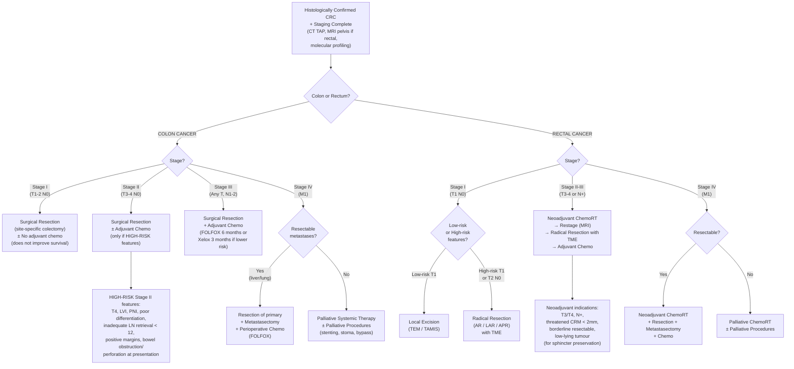

## Management of Colorectal Cancer — Algorithm and Treatment Modalities

---

### 1. Overarching Principles

Before diving into stage-specific algorithms, understand the three pillars of CRC management and the logic behind each:

| Pillar | Purpose | When |
|---|---|---|
| **Surgery** | Remove the primary tumour with adequate margins and lymph node clearance — this is the only curative modality for localised disease | Stages I–III (curative intent); selected Stage IV |
| **Chemotherapy** | Eradicate micro-metastases after surgery (adjuvant); shrink tumour before surgery (neoadjuvant); control disseminated disease (palliative) | Adjuvant: Stage III + high-risk Stage II; Neoadjuvant: locally advanced rectal cancer; Palliative: Stage IV |
| **Radiotherapy** | Local control — reduce pelvic recurrence in rectal cancer; palliate symptoms | Neoadjuvant chemoRT for rectal cancer (main role); palliative for pain/bleeding |

> The fundamental question in CRC management is: **Can I cut it out and cure the patient?** If yes → surgery ± chemotherapy. If no → systemic therapy ± palliative procedures.

---

### 2. Management Overview by Stage

***Management overview*** [10]:
- ***Stage I: surgery + analysis of ≥ 12 LN***
- ***Stage II: surgery ± adjuvant chemo (consider in high-risk Stage II)***
- ***Stage III: surgery + adjuvant chemo (FOLFOX) ± adjuvant RT (rectal only) ± neoadjuvant chemoRT (in high-risk rectal only)***
- ***Stage IV: chemo ± surgery for isolated liver metastasis***

---

### 3. Management Algorithm — Master Mermaid Diagram

---

### 4. Preoperative Preparation

Before any elective CRC surgery, the patient must be optimised [1]:

| Step | Detail | Why |
|---|---|---|
| ***Bowel preparation*** | ***Mechanical bowel preparation with polyethylene glycol (PEG) solution*** [1] | Clears faecal content to reduce bacterial load and improve surgical field; however, there is debate about its necessity for right-sided resections |
| ***IV antibiotic prophylaxis*** | ***Significantly decreases wound infections*** [1]. Typically cefuroxime + metronidazole (covers aerobes and anaerobes) given at induction | The colon is teeming with bacteria (~10¹¹/g stool) — any breach during surgery risks contamination |
| ***Thromboprophylaxis*** | ***Unfractionated or LMW heparin for moderate-to-high risk patients*** [1] | Cancer patients are hypercoagulable (Virchow's triad: stasis from immobility, endothelial injury from surgery, hypercoagulability from cancer) |
| Nutritional optimisation | Correct anaemia (iron infusion/transfusion), albumin, nutritional support | Malnutrition impairs wound healing and increases complications |
| ***Stoma counselling and marking*** | If a stoma is likely (APR, Hartmann's, defunctioning loop ileostomy), mark the optimal stoma site pre-operatively | Improper siting leads to poor appliance fit, leakage, and devastating impact on quality of life |
| ***Pre-operative tattooing*** | ***Tattoo should be placed in the area of tumour at time of endoscopy so it can be reliably identified at colectomy*** [1] | Small tumours may not be palpable at surgery, especially laparoscopically |
| MDT discussion | Multidisciplinary team: surgeon, oncologist, radiologist, pathologist, stoma nurse, palliative care | Ensures optimal treatment plan tailored to patient, tumour, and surgeon factors |

---

### 5. Surgical Treatment — Colon Cancer

#### 5A. Goals of Curative Resection

***Surgical principles (important!)*** [10]:

1. ***Complete removal of tumour with adequate proximal and distal margin*** — ***at least 5 cm proximally and distally*** [1][10]
2. ***En bloc resection of contiguous structures*** if there is attachment or infiltration of tumour into potentially resectable organ or structure [1]
3. ***High ligation of arterial pedicle*** for lymph node clearance — ***excise colonic mesentery, ligate arterial supply at its origin, and excise all accompanying LN*** [10]
4. ***A minimum of 12 lymph nodes*** in the resected specimen for adequate staging [1][10]. ***Inadequate LN might require adjuvant chemo*** [10]
5. ***Tension-free anastomosis*** with ***good blood supply*** to the ensuing anastomosis or stoma [1]
6. ***Restore bowel continuity whenever possible*** [10]

> Why 5 cm margins? Because microscopic intramural spread rarely extends beyond 2 cm from the gross tumour edge, and 5 cm provides a comfortable safety margin while accounting for shrinkage of the specimen after fixation.

> Why high ligation? The lymph node drainage follows the arterial supply. To clear all potentially involved nodes, you must ligate the feeding artery at its origin from the SMA or IMA and resect the entire mesentery within that vascular territory.

#### 5B. Choice of Resection by Tumour Site

***The type of operation depends on the location of the tumour because you must resect the vascular pedicle and its associated lymphatic drainage basin*** [1][10]:

| Tumour Site | ***Operation*** | ***Vessels Ligated*** |
|---|---|---|
| ***Caecum / Ascending colon*** | ***Right hemicolectomy*** | ***Ileocolic, right colic, right branch of middle colic (all branches of SMA)*** [10] |
| ***Hepatic flexure / Transverse colon / Splenic flexure*** | ***Extended right hemicolectomy*** | ***Ileocolic, right colic, middle colic (SMA); marginal artery of Drummond*** [10] |
| ***Splenic flexure / Descending colon*** | ***Left hemicolectomy*** | ***Left colic artery (from IMA)*** [10] |
| ***Sigmoid colon*** | ***Sigmoidectomy (high anterior resection)*** | ***IMA and left colic artery*** [10] |
| Synchronous cancers in multiple segments / Lynch syndrome / FAP | ***Subtotal / Total colectomy*** | Multiple pedicles |

***For splenic flexure tumours: peritumoral subserosal ICG injection can be done to demonstrate the lymphatic drainage of the tumour*** [10] — because the splenic flexure sits at the watershed between SMA and IMA territories, so lymphatic drainage is variable.

#### 5C. Surgical Approach

| Approach | Advantages | When |
|---|---|---|
| ***Laparoscopic*** (preferred for elective) | ***Less postoperative pain, faster recovery, shorter hospital stay, better cosmetics, less wound infection, less intra-abdominal adhesions*** [1] | Standard for elective, uncomplicated CRC |
| ***Robotic*** | ***High-quality 3D vision, restoration of eye-hand-target axis*** [1][10], less post-op pain, faster recovery | Increasingly used, especially for rectal cancer in narrow pelvis |
| ***Open*** | ***Shorter operative time*** [1]; no conversion rate | ***Preferred for complicated CRC (obstruction, perforation)*** [1]; large/bulky tumours; when laparoscopic conversion needed |

***Temporary diverting colostomy is preferred for left-sided anastomosis*** [10] — because left-sided anastomoses (especially low colorectal/coloanal) have a higher leak rate (lower blood supply, harder stool, greater tension), and a proximal diverting stoma protects the anastomosis during healing.

#### 5D. Emergency Surgery for Colon Cancer

***Emergency surgery is indicated if complicated: obstruction, perforation, haemorrhage*** [10][5]:

| Scenario | Approach |
|---|---|
| ***Right-sided lesion*** | ***Right hemicolectomy with primary anastomosis ± bowel decompression if stable; temporary ostomy if unstable*** [10] — the right colon can usually be anastomosed primarily even in emergency because the ileum is clean (liquid content, good blood supply) |
| ***Left-sided lesion*** | ***Hartmann's operation*** [10][12] |

##### Hartmann's Operation — In Detail

***Indications: often an emergency operation*** [12]:
- ***Left-sided CRC with complications requiring urgent resection (obstruction, perforation, bleeding)***
- Severe complicated diverticulitis (Hinchey III or above)
- Sigmoid volvulus with complications

***Procedure*** [12]:
1. ***Sigmoid resection*** — remove the diseased segment
2. ***Formation of a temporary end colostomy at LIF*** — the proximal bowel is brought out as a stoma
3. ***Closure of rectal stump*** (or mucous fistula if high risk of breakdown)
4. ***Re-anastomosis 2–3 months post-op*** — second operation to restore bowel continuity (Hartmann's reversal)

> Why not primary anastomosis in emergency left-sided surgery? Because in the setting of obstruction or perforation, the bowel is unprepared (loaded with faeces), oedematous, and the peritoneum is contaminated. An anastomosis in this setting has a very high leak rate — a leak is catastrophic (faecal peritonitis, sepsis, death). Hartmann's is the safe option: remove the problem, bring out a stoma, come back later when everything has settled.

##### Other Emergency Options for Left-Sided Obstruction [5]

***Primary resection and anastomosis is possible in selected cases:*** [5]
- ***Segmental resection with primary anastomosis (on-table lavage)*** — the colon is lavaged intra-operatively to clean the proximal bowel, allowing safe anastomosis
- ***Subtotal colectomy with anastomosis of ileum and distal colon/rectum*** [5] — removes all the dilated, unprepared colon proximal to the obstruction; the ileum is then anastomosed to the sigmoid or rectum. This avoids a stoma but results in more frequent bowel movements

##### Endoluminal Stenting [5][10]

> ***Stenting for colorectal malignancy*** has two roles [5]:

***1. Definitive palliation*** [5]:
- ***Avoids surgery***
- ***Avoids stoma***
- For patients unfit for surgery or with unresectable metastatic disease

***2. Bridge to surgery*** [5]:
- ***Avoids emergency surgery***
- ***Elective operation with bowel preparation***
- ***More time to stage the disease***
- ***Lower operative mortality and morbidity***
- ***Reduces stoma rate***

***Contraindication: not for distal rectal tumour*** — ***can cause tenesmus and pain*** [10]. Stents in the very low rectum are not tolerated because of the sensory innervation and proximity to the sphincter complex.

<Callout title="Bridge to Surgery vs. Emergency Resection" type="idea">
The concept of "bridge to surgery" is elegant: instead of performing a high-risk emergency Hartmann's on an unprepared, obstructed patient, you place a self-expanding metal stent (SEMS) endoscopically to relieve the obstruction. The patient then has bowel preparation, full staging, nutritional optimisation, and an elective one-stage resection with primary anastomosis — converting an emergency into an elective. However, there is debate about potential tumour dissemination from stent insertion, and some centres prefer primary resection.
</Callout>

---

### 6. Stage-Specific Treatment — Colon Cancer

#### Stage I (T1–2, N0, M0)

***Surgical resection ± adjuvant chemotherapy*** [1]:
- ***Adjuvant chemotherapy does not improve survival*** in Stage I [1]
- Surgery alone is curative in ~90% [1]

**Special consideration — Malignant polyps** [1]:
If a polyp removed at colonoscopy turns out to harbour carcinoma (T1 on histology), the decision is whether the polypectomy was sufficient or radical surgery is needed:

***Features requiring radical resection after polypectomy*** [1]:
- Poorly differentiated histology
- Lymphovascular invasion
- Positive resection margin (< 1 mm)
- Sm3 invasion (deep submucosal invasion)
- Tumour budding

If none of these adverse features are present and the polypectomy margins are clear, the patient can be observed with surveillance colonoscopy.

#### Stage II (T3–4, N0, M0)

***Surgical resection ± adjuvant chemotherapy*** [1]:
- ***Adjuvant chemotherapy does not improve survival*** in unselected Stage II patients [1]
- ***Adjuvant chemotherapy can be considered in selected patients with "high-risk" Stage II disease*** [1][10]

***High-risk features for Stage II*** [1][10]:
- ***T4 tumour***
- ***Lymphovascular invasion (LVI)***
- ***Perineural invasion (PNI)***
- ***Poorly differentiated histology***
- ***Inadequate LN retrieval (< 12 nodes)***
- ***Positive resection margins***
- ***Bowel obstruction or perforation at presentation***

> Why doesn't chemo help most Stage II? Because Stage II is N0 — there are no detected LN metastases, meaning micro-metastatic burden is low. The absolute survival benefit of chemotherapy is small (~3–5%), so it is not routinely given. However, the high-risk features listed above identify a subset with higher recurrence risk where the benefit-risk balance favours treatment.

<Callout title="MSI-H and Stage II" type="error">
***Patients with MSI-high Stage II CRC have an excellent prognosis and do NOT benefit from 5-FU-based adjuvant chemotherapy*** [1]. In fact, 5-FU may be detrimental in this subgroup. This is why universal MMR/MSI testing is so important — it directly changes management. If a Stage II tumour is MSI-H, you can safely withhold chemotherapy even if other high-risk features are present.
</Callout>

#### Stage III (Any T, N1–2, M0)

***Surgical resection + adjuvant chemotherapy*** [1][10]:
- ***Adjuvant chemotherapy is routinely given since patients with LN involvement are at significant risk of both local and distant recurrence*** [1]
- ***Use of chemotherapy improves survival in this group*** [1]

***Chemotherapy regimen*** [10]:
- ***FOLFOX for 6 months: folinic acid (leucovorin) + 5-fluorouracil + oxaliplatin***
- ***Xelox (CapeOx) for 3 months if lower risk (T1–3, N1)*** [10] — the IDEA trial showed that 3 months of oxaliplatin-based therapy is non-inferior to 6 months for low-risk Stage III (T1–3 N1), with significantly less neurotoxicity

> ***Note: patients with MSI-high Stage III disease do NOT benefit from chemotherapy and therefore molecular profiling can help patients safely avoid systemic chemotherapy*** [1]. This is a controversial point — current guidelines still generally recommend adjuvant chemo for Stage III regardless of MSI status, but the evidence is evolving (some clinicians omit 5-FU in MSI-H).

#### Stage IV (Any T, Any N, M1)

***Resection in highly selected patients + adjuvant chemotherapy / palliative procedures*** [1]:

This is the most complex stage — the approach depends entirely on whether metastases are resectable.

**Resectable Liver Metastases:**
- ***20% of liver metastases are potentially resectable for cure*** [1]
- ***5-year survival rate improves from 20% to 40% after resection*** [1]
- ***ALL patients require adjuvant chemotherapy*** [1]

***Management of colorectal liver metastasis*** [10][12][7]:
- ***5-year survival 40–50%*** with resection [10]
- ***Resectability criteria*** [10]:
  - ***Liver factor: adequate future liver remnant > 25%*** (normal liver) or > 40% (cirrhotic liver)
  - ***Tumour factor: R0 resection (> 1 cm resection margin)***; risk scores (disease course, CEA, number and size of metastases)
  - ***Patient factor: fitness for surgery***
- ***Contraindication: unresectable extrahepatic malignancy*** [10]
- ***Approach: laparotomy*** [10]:
  - ***Search for regional LN involvement, peritoneal deposits***
  - ***Intra-operative USG to assess number of lesions and determine resectability***
  - ***Total vascular exclusion: may allow resection with involvement of major vessels***
- ***Perioperative chemotherapy: FOLFOX*** [10]

***Hepatic resection for CRC liver metastases*** [7]:
- ***Can prolong survival in patients with resectable liver metastasis (solitary or ≤ 4 metastases all located within one lobe)***
- ***5-year survival 25%*** (older data; more recent series report 40–50%)
- ***One-third recurrence in the liver remnant***
- ***Biopsy — FNAC or Trucut — ONLY for inoperable cases*** [7] (to confirm histology for chemotherapy planning; otherwise proceed directly to surgery)

**Resectable Lung Metastases:**
- ***1–2% of lung metastases are potentially resectable for cure*** [1]
- ***Long-term survival benefit is approximately 30–40%*** [1]
- Criteria: isolated pulmonary metastasis, controlled primary, adequate pulmonary reserve

**Unresectable Stage IV — Palliative Management:**

***Palliative management for colorectal cancer*** [10]:

| Modality | Detail |
|---|---|
| ***Palliative surgery*** | ***Endoluminal stenting*** for obstruction / bridging to surgery (***not for distal rectal tumour***) [10]; ***Palliative colostomy ± tumour resection*** (palliative intent) [10] |
| ***Palliative radiotherapy*** | ***Control local symptoms: pain, discharge, bleeding, incontinence; bone pain*** [10] |
| ***Palliative chemotherapy*** | ***Oral capecitabine*** for disseminated disease [10]; systemic combination therapy (FOLFOX, FOLFIRI) with targeted agents |
| Angiographic embolization | For haemorrhage from primary tumour [1] |
| ***Bypass surgery*** | For obstruction when stenting is not feasible [1] |

---

### 7. Surgical Treatment — Rectal Cancer

Rectal cancer deserves its own section because it is fundamentally different from colon cancer:

***Differences from colon cancer*** [1][10]:
- ***+ve: Transanal accessibility*** — distal 10 cm of rectum accessible transanally [1]
- ***+ve: Easier to treat with neoadjuvant radiotherapy*** due to relative paucity of small bowel in the pelvis [1]
- ***-ve: Confinement to pelvis and presence of sphincter makes wide excision impossible*** [1][10]
- ***-ve: Proximity to urogenital structures and nerves (bladder, ureter, prostate, vagina, iliac vessels, sacrum)*** makes resection more challenging [1][10]
- ***-ve: More difficult to achieve negative radial margins*** due to anatomical limitation of pelvis [1]

#### 7A. Principles of Rectal Cancer Surgery

***Principles*** [1]:
1. ***Adequate circumferential margin*** — ***narrow distal margin (2 cm) is adequate provided TME is performed*** [1]
2. ***Total mesorectal excision (TME)*** — the gold standard technique
3. ***Lymph node clearance with high ligation of the IMA***
4. ***Sphincter and autonomic nerve preservation — consideration of continence and urogenital function*** [1]

***Resection margins*** [1]:
- ***Proximal margin: minimum 5 cm***
- ***Distal margin:***
  - ***Cancer above distal mesorectal margin: minimum 2 cm***
  - ***Cancer at or below distal mesorectal margin: minimum 1 cm***
  - ***Failure to achieve negative distal margin → convert to APR*** [1][10]
- ***Circumferential radial margin (CRM): minimum 1 mm*** [1]

##### Total Mesorectal Excision (TME)

***TME: precise dissection of the mesorectal envelope (containing tumour, surrounding mesorectal fat, LN and vessels), preserving pelvic autonomic nerves*** [10].

| Feature | Detail |
|---|---|
| ***Plane*** | ***"Holy plane"*** — ***avascular alveolar plane between presacral and mesorectal fascia*** [10] |
| ***Rationale*** | Rectal cancer cells can spread within mesorectum; TME ensures adequate negative CRM and complete removal of all draining lymphatics [1] |
| ***Benefits*** | ***↓ Local recurrence rate*** (from ~30% to < 5%); ***↓ postoperative genitourinary dysfunction*** (pelvic autonomic nerve preservation); less blood loss compared with blunt dissection [1][10] |
| ***Approaches*** | ***Transabdominal (open / laparoscopic / robotic), transanal (rarely)*** [10] |

> Why is the "holy plane" called that? Because finding and staying in this avascular plane is the surgeon's holy grail — it provides a bloodless dissection field that ensures complete excision of the mesorectum without damaging the pelvic autonomic nerves. Straying outside this plane risks catastrophic presacral venous bleeding and nerve injury.

##### Selection Factors for Rectal Cancer Surgery [1]

***Three factors determine the choice of operation:***
- ***Tumour factor:*** size, distance from anal verge, distance from anorectal ring, LN status, lateral pelvic wall invasion
- ***Patient factor:*** fitness, pre-surgical anorectal sphincter function, pelvic anatomy
- ***Surgeon factor:*** experience, hospital equipment [1]

#### 7B. Rectal Cancer Operations

##### Local Excision [1]

| Feature | Detail |
|---|---|
| ***Indications*** | ***ALL of the following must be met:*** T1N0, superficial rectal cancer, ***tumour < 3 cm***, mobile and non-fixed, able to achieve clear margins, ***favourable histological features*** (well/moderately differentiated, no LVI, no PNI) [1] |
| ***Techniques*** | Transanal endoscopic microsurgery (TEM); transanal minimally invasive surgery (TAMIS) |
| ***Why so strict?*** | Local excision does not remove mesorectal lymph nodes. T1 cancers have ~5% LN metastasis risk — local excision is only safe if features predict minimal risk |

##### Anterior Resection (AR) / Low Anterior Resection (LAR) [1]

| Feature | Detail |
|---|---|
| ***Indications*** | ***T2–4 invasive rectal cancer; adequate pre-surgical sphincter function; able to achieve clear margins*** [1] |
| ***Technique*** | ***MUST be performed with TME*** [1] |
| | ***Anterior resection:*** margin and anastomosis ***above*** peritoneal reflection |
| | ***Low anterior resection (LAR):*** margin and anastomosis ***below*** peritoneal reflection — more common [1] |
| ***Anastomosis options*** | Colonic J-pouch reservoir; side-to-end anastomosis; transverse coloplasty — all aim to create a neorectal reservoir to improve functional outcomes |
| ***Defunctioning stoma*** | Temporary loop ileostomy usually fashioned to protect a low colorectal anastomosis — reversed in ~3 months after confirming anastomotic integrity with water-soluble contrast enema |

##### Abdominoperineal Resection (APR) [1][10]

| Feature | Detail |
|---|---|
| ***Indications*** | ***Any ONE of:*** ***poor pre-op sphincter function; failure to achieve negative distal margin; locally advanced or recurrent low-lying CA rectum*** [10] |
| ***Technique*** | (1) Insert catheter to protect membranous urethra in males; (2) Abdominal part (open/lap) similar to AR; (3) ***Perineal dissection via circumanal incision*** for en bloc resection of sigmoid, ***rectum and anus***; (4) Construction of ***permanent end colostomy*** [1][10] |
| ***Key point*** | APR results in a ***permanent colostomy*** — this has significant quality-of-life implications. One goal of neoadjuvant therapy for low-lying tumours is to downsize the tumour enough to convert an APR into a sphincter-sparing LAR |

##### Multivisceral Resection [1]

| Feature | Detail |
|---|---|
| ***Indications*** | ***T4 locally advanced rectal cancer involving adjacent organs; locally recurrent rectal cancer*** [1] |
| ***Technique*** | Resection of rectum + one or more adjacent organs (total or partial pelvic exenteration); en bloc resection of ureters, bladder, prostate, uterus, vagina; sacrum may be resected up to S2–3 junction [1] |
| ***Outcome*** | Permanent colostomy + ileal conduit may be necessary; patients with T4M0 have better 5-year survival than those with M1 disease [1] |

#### 7C. Neoadjuvant Therapy for Rectal Cancer

This is a critical concept — ***no role for neoadjuvant therapy in colon cancer*** [10], but it is central to rectal cancer management.

***Neoadjuvant therapy for CA rectum — 3 main indications (need to know!)*** [10]:

1. ***Resectable but locally advanced disease:*** ***sterilize tumour bed, ↓ intra-operative tumour spillage, ↓ local recurrence rate***
   - ***T3/T4 disease → only definite indication proven by RCT*** (German Rectal Cancer Study Group) [10]
   - ***Nodal disease***
   - ***Threatened CRM (< 2 mm)***
2. ***Borderline resectable disease:*** ***downstage the tumour and ↑ resectability rate***
3. ***Low-lying tumour:*** ***downsize the tumour and ↑ sphincter preservation rate*** [10]

***Advantages of neoadjuvant chemoradiation*** [1]:
- ***Tumour downstaging by treating locally involved lymph nodes***
- ***Tumour shrinkage to increase likelihood of resection and sphincter-sparing procedure***
- ***Associated with similar results but significantly less toxicity than postoperative chemotherapy***

***Disadvantages*** [1]:
- ***Overtreatment of early-stage tumours***
- ***Impaired wound healing***
- ***Increased postoperative complications***
- ***Pelvic fibrosis***

***Regimens*** [10]:

| | ***Long-course chemoRT (standard in HK)*** | ***Short-course high-dose RT*** |
|---|---|---|
| ***Protocol*** | ***5-FU-based chemotherapy × 2 cycles + concurrent RT (50.4 Gy = 1.8 Gy daily × 28 fractions) → Wait 8–10 weeks before surgery → 4 cycles of chemo as adjuvant*** | ***RT 25 Gy = 5 Gy × 5 days → Wait 7–10 days before surgery*** |
| ***Advantages*** | Allows tumour downstaging and downsizing; can achieve complete response | Shorter treatment time; single-week course |
| ***Disadvantages*** | ***Maximum dose of RT for lifetime; delays surgery*** | ***More side effects of high-dose RT; can only sterilise local tumour bed but not enough time to downstage/downsize tumour*** [10] |

***Response to neoadjuvant chemoRT*** [10]:
- ***Clinical complete remission (CCR) ~20%:*** consider ***"watch and wait"*** for 3 years with MRI Q3m, flexible sigmoidoscopy Q3m, PET-CT/CT Q6m [10]
- ***Pathological complete remission (PCR) ~15%:*** surgical specimen found tumour-free; may not require adjuvant chemo (case-by-case) [10]

<Callout title="Total Neoadjuvant Therapy (TNT) — 2024–2026 Update">
The latest paradigm shift is **Total Neoadjuvant Therapy (TNT)**: all chemotherapy and chemoRT are given BEFORE surgery (e.g., induction FOLFOX × 4 cycles → long-course chemoRT → restaging → surgery). This increases pathological complete response rates to 25–30%, may allow more patients to undergo "watch and wait," and ensures all systemic therapy is delivered (many patients cannot complete adjuvant chemo after major pelvic surgery due to poor recovery).
</Callout>

---

### 8. Medical Treatment — Chemotherapy and Targeted Therapy

#### 8A. Cytotoxic Chemotherapy Backbone

***Indicated for all Stage III and high-risk Stage II disease*** [1]:

| Drug | Class | Mechanism | Key Side Effects |
|---|---|---|---|
| ***5-Fluorouracil (5-FU)*** | ***Anti-metabolite (pyrimidine analogue)*** | Inhibits thymidylate synthase → blocks DNA synthesis ("5-FU" = fluorine substitution on uracil → the cell incorporates this "fake" pyrimidine into DNA/RNA, causing cell death) [1] | ***Mucositis, diarrhoea, myelosuppression*** |
| ***Capecitabine (Xeloda)*** | ***Anti-metabolite (pyrimidine analogue — oral prodrug of 5-FU)*** | Converted to 5-FU in tumour tissue (thymidine phosphorylase is overexpressed in tumour cells) [1] | ***Hand-foot syndrome*** (painful erythema and desquamation of palms/soles — because capecitabine is activated in skin); diarrhoea |
| ***Oxaliplatin*** | ***Alkylating agent (platinum compound)*** | Forms platinum-DNA adducts → prevents DNA replication and transcription → cell death | ***Peripheral sensory neuropathy*** (cold-triggered paraesthesia — "can't open the fridge" — due to oxaliplatin's effect on voltage-gated sodium channels); myelosuppression |
| ***Irinotecan*** | ***Topoisomerase I inhibitor*** | Topoisomerase I unwinds DNA for replication; irinotecan stabilises the enzyme-DNA complex → DNA strand breaks → cell death | ***Delayed diarrhoea*** (cholinergic); myelosuppression; alopecia |
| ***Folinic acid (Leucovorin)*** | Reduced folate | Enhances 5-FU cytotoxicity by stabilising the 5-FU–thymidylate synthase complex | Not cytotoxic on its own |

***Common regimens:***
- ***FOLFOX = FOLinic acid + Fluorouracil + OXaliplatin*** → standard adjuvant for Stage III (6 months) [10]
- ***FOLFIRI = FOLinic acid + Fluorouracil + IRInotecan*** → commonly used in metastatic setting
- ***Xelox (CapeOx) = Capecitabine + Oxaliplatin*** → oral alternative; ***3 months if lower-risk Stage III (T1–3, N1)*** [10]

***General adverse effects of chemotherapy:*** ***mucositis, nausea/vomiting, diarrhoea, febrile neutropenia, alopecia, hand-foot syndrome (especially capecitabine)*** [1]

#### 8B. Targeted Therapy (Stage IV Only)

> ***ONLY indicated in Stage IV (metastatic) disease — no evidence to support use of targeted therapy in the adjuvant setting*** [1]

##### Anti-VEGF Agents

***Bevacizumab (OR) Aflibercept (OR) Regorafenib*** [1]:

| Feature | Detail |
|---|---|
| ***Mechanism*** | ***Monoclonal antibody targeting VEGF-A*** [1] ("bevacizumab" → "beva" = derived from humanised antibody, "cizumab" = -cizumab = chimeric/humanised monoclonal antibody). VEGF-A promotes angiogenesis — tumours need new blood vessels to grow beyond ~2 mm. Blocking VEGF starves the tumour of blood supply |
| ***Indication*** | ***Added to cytotoxic chemotherapy backbone particularly for patients with KRAS and BRAF mutations when anti-EGFR are contraindicated*** [1] — i.e., if the tumour has a RAS or BRAF mutation (making anti-EGFR agents useless), anti-VEGF is the targeted therapy of choice |
| ***Contraindications*** | ***Haemorrhage, wound healing (impaired), arterial thromboembolic diseases*** [1] — all directly related to VEGF inhibition (VEGF promotes wound healing and vascular integrity; blocking it increases bleeding and thrombosis risk) |
| ***Side effects*** | Hypertension, proteinuria, GI perforation, haemorrhage, impaired wound healing, arterial thromboembolism |

##### Anti-EGFR Agents

***Cetuximab (OR) Panitumumab*** [1]:

| Feature | Detail |
|---|---|
| ***Mechanism*** | ***Monoclonal antibody against EGFR*** [1]. EGFR is a receptor tyrosine kinase on cell surface; when ligand (EGF) binds, it activates RAS-RAF-MEK-ERK proliferative cascade. Blocking EGFR stops this signal |
| ***Indication*** | ***Added to irinotecan-based cytotoxic backbone for patients with wild-type KRAS and BRAF*** [1] |
| ***Key predictive biomarkers*** | ***Wild-type KRAS: favourable response*** [1]. ***Mutant KRAS: will NOT benefit*** — KRAS mutation results in ***constitutive activation of RAS-RAF-ERK pathway leading to resistance to anti-EGFR therapy*** [1]. ***KRAS and BRAF mutations are mutually exclusive; mutant BRAF is unlikely to benefit*** [1] |
| ***Side effects*** | ***Acneiform rash, diarrhoea, electrolyte disturbance (hypomagnesaemia)*** [1]. The acneiform rash is actually a positive prognostic sign — EGFR is expressed in skin, so rash indicates effective EGFR blockade |
| ***Tumour sidedness*** | Right-sided metastatic CRC responds poorly to anti-EGFR even if RAS wild-type (biological differences in right vs. left CRC); anti-EGFR is primarily beneficial for ***left-sided, RAS/BRAF wild-type metastatic CRC*** |

##### Immune Checkpoint Inhibitors (MSI-H / dMMR)

| Agent | Mechanism | Indication |
|---|---|---|
| ***Pembrolizumab*** (anti-PD-1) | Blocks PD-1 on T-cells → prevents tumour PD-L1 from "turning off" the immune response → restores anti-tumour immunity | ***First-line for MSI-H/dMMR metastatic CRC*** (KEYNOTE-177 trial). Also: ***second-line for MSI-H CRC after progression on chemotherapy*** |
| ***Nivolumab ± Ipilimumab*** | Anti-PD-1 ± anti-CTLA-4 | MSI-H/dMMR metastatic CRC; dual checkpoint blockade increases response rates |

> Why do MSI-H tumours respond so well to immunotherapy? Because MSI-H tumours have a very high mutational burden → they produce many abnormal "neoantigen" proteins → these are foreign to the immune system → the tumour is inherently immunogenic. However, the tumour upregulates PD-L1 to evade the immune response. Blocking PD-1 "unleashes" the pre-existing anti-tumour immune response.

##### Other Targeted Agents (Emerging)

| Agent | Target | Indication |
|---|---|---|
| ***Encorafenib + Cetuximab*** | BRAF V600E + EGFR | BRAF V600E mutant metastatic CRC (BEACON trial) |
| Trastuzumab + pertuzumab | HER2 | HER2-amplified, RAS wild-type metastatic CRC (rare) |
| Larotrectinib / Entrectinib | NTRK fusion | NTRK fusion-positive CRC (tumour-agnostic approval) |

---

### 9. Management of Hereditary CRC (Brief Recap)

| Syndrome | Surgical Management |
|---|---|
| ***FAP*** | ***Total proctocolectomy with IPAA*** (if profuse polyposis) or ***total colectomy with IRA*** (if rectum relatively spared, < 10 rectal adenomas) [1][12] |
| ***Lynch syndrome*** | ***Prophylactic total colectomy + IRA; prophylactic TAHBSO; aspirin to reduce CRC risk*** [12] |

---

### 10. High Tie vs. Low Tie of IMA

This is a nuanced surgical decision relevant to left-sided and rectal resections [10]:

| | ***High Tie*** | ***Low Tie*** |
|---|---|---|
| Definition | Ligate IMA at its origin from the aorta | Ligate IMA distal to left colic artery |
| Advantage | ***Reduces tension on anastomosis*** (more length); more LN harvest | ***Avoids damage to the hypogastric nerve → lower risk of autonomic dysfunction*** [10]; preserves left colic artery (better blood supply to proximal colon) |
| Disadvantage | Risk of hypogastric nerve injury; may compromise blood supply to proximal stump | Fewer LN harvested; may have more tension on anastomosis |

---

### 11. Post-Operative Complications (Summary — Detailed in Complications Section)

***Immediate:*** [10]
- ***Massive bleeding requiring conversion to laparotomy (< 10%)***
- ***Injury to neighbouring structures:***
  - ***Left ureter and gonadal vessels***
  - Iliac artery
  - GB, D2 (right hemicolectomy)
  - Seminal vesicles (LAR)
  - Spleen (splenic flexure mobilisation in TME)
  - ***Autonomic nerve injury*** (especially rectal surgery): ***sympathetic damage → incontinence, impaired ejaculation; parasympathetic damage → urinary retention, erectile dysfunction*** [10]

***Early:*** ***post-op ileus, infection, anastomotic leak*** [10]

***Late:***
- ***Anastomotic stricture*** — may require finger/endoscopic balloon dilation [10]
- ***Fistula:*** enterocutaneous (conservative), rectovaginal/rectourinary (proximal faecal diversion) [10]
- ***Perineal hernia*** (after APR) [10]
- ***LAR syndrome*** [10]:
  - ***S/S: change in bowel movement (constipation to faecal urgency/incontinence) persisting ≥ 1 month after surgery***
  - ***Pathophysiology: colonic dysmotility, neorectal reservoir dysfunction, anal sphincter dysfunction***
  - ***Prevention: post-op pelvic floor muscle exercise, anterograde colonic irrigation, faecal diversion***
  - ***Management: antidiarrhoeal, transanal irrigation, pelvic floor rehab, sacral nerve stimulation***

---

### 12. Follow-Up After Curative Resection

***Aim: detect recurrence (40%) and metachronous tumours (new primary CA diagnosed ≥ 6 months afterwards)*** [10].

| Time | Interval | Investigations |
|---|---|---|
| ***First 2 years*** | ***Every 3 months*** | ***CEA, rigid sigmoidoscopy, LFT*** |
| ***3rd year*** | ***Every 6 months*** | As above |
| ***4th–5th year*** | ***Yearly*** | As above |
| ***> 5 years*** | ***Considered in remission*** | Discharge or routine screening |
| ***Imaging*** | ***CT TAP or PET-CT every 1 year*** | Detect distant recurrence |
| ***Colonoscopy*** | ***Pre-op incomplete: within 6 months of surgery***; ***Pre-op complete: 1 year post-op, then 3 years, 5 years, then Q5y*** | Synchronous / metachronous tumours |

---

<Callout title="High Yield Summary">

**Colon Cancer Management:**
- **Stage I:** Surgery alone. No adjuvant chemo benefit.
- **Stage II:** Surgery ± adjuvant chemo (only if high-risk features: T4, LVI, PNI, < 12 LN, poor differentiation, obstruction/perforation). MSI-H Stage II → NO 5-FU.
- **Stage III:** Surgery + adjuvant chemo (FOLFOX 6 months or Xelox 3 months for low-risk).
- **Stage IV:** Systemic chemo ± surgery for resectable liver/lung mets. Palliative stenting/stoma/bypass for unresectable.

**Rectal Cancer Key Differences:**
- MRI pelvis mandatory → determines neoadjuvant chemoRT.
- Neoadjuvant chemoRT for T3/4, N+, threatened CRM, borderline resectable, low-lying tumours.
- TME ("holy plane") is the gold standard surgical technique.
- Local excision only for T1N0 with ALL favourable features.
- APR = permanent colostomy when distal margin cannot be cleared.

**Targeted Therapy (Stage IV only):**
- Anti-EGFR (cetuximab/panitumumab): only for wild-type KRAS/BRAF, left-sided tumours.
- Anti-VEGF (bevacizumab): for RAS/BRAF mutant tumours.
- Immune checkpoint inhibitors (pembrolizumab): first-line for MSI-H/dMMR metastatic CRC.

**Emergency CRC:**
- Right-sided: right hemicolectomy + primary anastomosis.
- Left-sided: Hartmann's operation (resection + end colostomy + rectal stump closure; reversal in 2–3 months). Or: stenting as bridge to elective surgery.

</Callout>

---

<ActiveRecallQuiz
  title="Active Recall - CRC Management"
  items={[
    {
      question: "List the three main indications for neoadjuvant chemoradiotherapy in rectal cancer.",
      markscheme: "(1) Resectable but locally advanced: T3/T4, nodal disease, threatened CRM less than 2mm - to sterilise tumour bed and reduce local recurrence. (2) Borderline resectable disease - to downstage and increase resectability. (3) Low-lying tumour - to downsize and increase sphincter preservation rate."
    },
    {
      question: "A patient has Stage III colon cancer with wild-type KRAS. What is the standard adjuvant treatment and what targeted therapy would be considered if the disease were metastatic?",
      markscheme: "Adjuvant: FOLFOX for 6 months (or Xelox 3 months if low-risk T1-3 N1). Targeted therapy is ONLY for Stage IV, not adjuvant. If metastatic and wild-type KRAS/BRAF: add anti-EGFR (cetuximab or panitumumab) to irinotecan-based chemotherapy, especially for left-sided tumours."
    },
    {
      question: "Why is a Hartmann's operation performed instead of primary anastomosis for emergency left-sided CRC with obstruction?",
      markscheme: "In emergency setting, bowel is unprepared (faecally loaded), oedematous, and peritoneum may be contaminated. Primary anastomosis has very high leak rate leading to faecal peritonitis and death. Hartmann's is safer: resect sigmoid, form end colostomy at LIF, close rectal stump, reverse in 2-3 months when patient has recovered."
    },
    {
      question: "Name the four goals of curative surgical resection for colon cancer.",
      markscheme: "(1) Complete tumour removal with at least 5 cm proximal and distal margins. (2) High ligation of arterial pedicle for lymph node clearance. (3) At least 12 lymph nodes in specimen for adequate staging. (4) Tension-free anastomosis with good blood supply, restoring bowel continuity whenever possible."
    },
    {
      question: "What is Total Mesorectal Excision and why has it revolutionised rectal cancer surgery?",
      markscheme: "TME = precise dissection along the holy plane (avascular alveolar plane between presacral and mesorectal fascia) to remove the entire mesorectal envelope containing tumour, fat, lymph nodes and vessels, while preserving pelvic autonomic nerves. Benefits: reduced local recurrence from 30% to less than 5%, reduced genitourinary dysfunction, less blood loss."
    },
    {
      question: "Explain why MSI-H status changes the management of Stage II and Stage IV CRC in opposite directions.",
      markscheme: "Stage II MSI-H: excellent prognosis, does NOT benefit from 5-FU adjuvant chemo (may even be harmful) - so chemo is withheld. Stage IV MSI-H: tumour has high mutational burden producing many neoantigens, making it highly responsive to immune checkpoint inhibitors (pembrolizumab first-line). So MSI-H means less chemo in early stage but more immunotherapy in metastatic stage."
    }
  ]}
/>

## References

[1] Senior notes: felixlai.md (CRC treatment sections: pages 690–706)
[5] Lecture slides: GC 194. Intestinal obstruction colorectal cancer.pdf (pages 49, 53, 59)
[7] Lecture slides: WCS 064 - A large liver - by Prof R Poon [20191108].doc.pdf (page 6)
[10] Senior notes: maxim.md (CRC management, staging, follow-up sections: pages 218–227, 271)
[12] Senior notes: maxim.md (Hartmann's operation: page 198; FAP/Lynch treatment: page 202)
