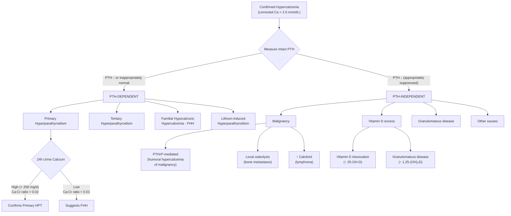

## Differential Diagnosis of Hyperparathyroidism

The differential diagnosis of hyperparathyroidism is really two overlapping clinical problems that the examiner can frame in different ways:

1. **"The patient has hypercalcemia — what is the cause?"** (i.e., DDx of hypercalcemia, where primary HPT is one possibility)
2. **"The patient has elevated PTH — what is the cause?"** (i.e., DDx of elevated PTH, distinguishing primary from secondary from tertiary HPT and other PTH-dependent causes)

Both approaches converge on the same diagnostic logic: **measure PTH, and then bifurcate into PTH-dependent vs PTH-independent causes**. Let me walk you through this systematically.

---

### 1. The Master Framework: PTH-Dependent vs PTH-Independent Hypercalcemia

When a patient is found to have confirmed hypercalcemia (corrected calcium > 2.6 mmol/L or ionized calcium elevated), the single most important next step is to **measure the intact PTH level**. This splits the differential cleanly into two camps [2][10]:

<Callout title="The PTH Pivot Point" type="idea">
This is the single most important branch point. A "normal" PTH in the setting of hypercalcemia is NOT normal — it is **inappropriately unsuppressed**. If calcium is genuinely high, PTH should be suppressed via the CaSR negative feedback loop. A PTH that is even within the reference range with concurrent hypercalcemia should be treated as "PTH-dependent" and investigated as probable primary HPT. [2]
</Callout>

---

### 2. PTH-Dependent Causes of Hypercalcemia (PTH Elevated or Inappropriately Normal)

These are conditions where the parathyroid gland itself is driving the hypercalcemia:

| Condition | Frequency | Key Differentiating Features | Pathophysiology |
|:----------|:----------|:----------------------------|:----------------|
| ***Primary HPT*** | ***Most common cause of outpatient hypercalcemia*** [2][3] | ↑ PTH, ↑ Ca, ↓ PO₄, ***↑ 24h urine Ca*** (> 200 mg/d, Ca:Cr clearance ratio > 0.02); often asymptomatic; usually solitary adenoma | Autonomous PTH secretion from adenoma/hyperplasia → unregulated bone resorption, renal Ca retention, and calcitriol synthesis |
| **Tertiary HPT** | Uncommon; CKD context | ↑ PTH, ↑ Ca; **history of long-standing CKD/dialysis** or recent **renal transplant** with persistent hypercalcemia | Prolonged secondary HPT → monoclonal transformation → autonomous parathyroid function that persists even after correction of renal failure |
| ***Familial Hypocalciuric Hypercalcemia (FHH)*** | Uncommon but critical DDx | ↑ Ca (usually mild, < 3.0 mmol/L), PTH normal or mildly ↑, ***↓↓ 24h urine Ca (Ca:Cr clearance ratio < 0.01)***, often family history of "hypercalcemia" investigated but never treated | ***Inactivating mutation in CaSR*** → parathyroid glands and kidneys cannot sense high calcium → PTH remains unsuppressed + kidneys reabsorb too much calcium. **Benign condition — does NOT require surgery** [1][2] |
| **Lithium-induced HPT** | Uncommon | History of lithium use (usually bipolar disorder); ↑ PTH, ↑ Ca | Lithium shifts the CaSR set point to the right → higher calcium concentration required to suppress PTH → functional hyperparathyroidism. May also cause true parathyroid adenoma formation with long-term use |

<Callout title="FHH: The Must-Not-Miss Mimic" type="error">
FHH is the most important differential to exclude before sending a patient with primary HPT to surgery. Why? Because FHH is **benign** and surgery will **not cure** it (the kidneys also have defective CaSR). The test is simple: ***24-hour urine calcium is mandatory in every case of suspected primary HPT*** [1]. A Ca:Cr clearance ratio < 0.01 strongly suggests FHH. If in doubt, genetic testing for CaSR mutations is available.
</Callout>

#### How to differentiate Primary HPT from FHH:

| Feature | Primary HPT | FHH |
|:--------|:-----------|:----|
| **Inheritance** | Sporadic (mostly) or MEN | Autosomal dominant |
| **Family history** | Usually negative (unless MEN) | Often positive for mild hypercalcemia in multiple family members |
| **Calcium level** | Variable (can be very high in carcinoma) | Usually mildly elevated ( < 3.0 mmol/L) |
| **PTH** | ↑ or inappropriately normal | Normal or mildly ↑ |
| ***24h urine calcium*** | ***↑ (hypercalciuric)*** | ***↓↓ (hypocalciuric)*** |
| ***Ca:Cr clearance ratio*** | ***> 0.02*** | *** < 0.01*** |
| **Management** | Surgery (parathyroidectomy) | **No treatment needed** |
| **Genetic test** | MEN1/RET if familial | CaSR mutation |

> The **Ca:Cr clearance ratio** is calculated as: (24h urine Ca × Plasma Cr) / (Plasma Ca × 24h urine Cr). A ratio < 0.01 = FHH; > 0.02 = primary HPT; 0.01–0.02 is a grey zone requiring further workup including genetic testing.

---

### 3. PTH-Independent Causes of Hypercalcemia (PTH Appropriately Suppressed)

These are conditions where the hypercalcemia is driven by something other than the parathyroid glands, and PTH is appropriately suppressed by negative feedback:

| Condition | Frequency | Key Differentiating Features | Pathophysiology |
|:----------|:----------|:----------------------------|:----------------|
| ***Malignancy*** | ***Most common cause of inpatient hypercalcemia*** [2] | PTH ↓ (suppressed); often very high Ca ( > 3.0 mmol/L); usually clinically apparent cancer; check PTHrP, imaging | Multiple mechanisms — see below |
| **Vitamin D intoxication** | Uncommon | History of excessive vitamin D supplementation; ***↑ 25(OH)D***; PTH suppressed | Exogenous excess → ↑ gut Ca absorption + ↑ bone resorption |
| **Granulomatous disease** (sarcoidosis, TB) | Uncommon; ***important in HK (TB endemic)*** | ***↑ 1,25(OH)₂D₃ (calcitriol)*** with normal/low 25(OH)D; PTH suppressed; clinical/radiological features of granulomatous disease | Activated macrophages in granulomas express **1α-hydroxylase** autonomously → unregulated conversion of 25(OH)D to active 1,25(OH)₂D₃ → ↑ gut Ca absorption [2][10] |
| ***Milk-alkali syndrome*** | Uncommon | History of ***excessive calcium + alkali intake*** (e.g. calcium carbonate for GERD, tums); metabolic alkalosis; renal impairment | ↑ oral Ca → hypercalcemia → renal vasoconstriction → ↓ GFR → ↓ Ca excretion → worsening hypercalcemia. Alkalosis ↑ renal Ca reabsorption → vicious cycle [10] |
| **Thyrotoxicosis** | Uncommon cause | Clinical features of thyrotoxicosis; ↑ T4, ↓ TSH | Thyroid hormones directly stimulate osteoclastic bone resorption → release of calcium |
| **Immobilization** | In context of prolonged bed rest | History of prolonged immobilization (e.g. spinal cord injury, prolonged ICU stay); young patients and Paget's disease particularly susceptible | Loss of mechanical loading → uncoupled bone remodelling with ↑ osteoclast and ↓ osteoblast activity → net calcium release |
| **Paget's disease of bone** | Uncommon; usually normocalcemic | ↑↑ ALP; characteristic X-ray changes; calcium usually only elevated if immobilized or coincident hyperPTH | Highly increased bone turnover with ↑ osteoclast activity; normally compensated, but immobilization removes osteoblast stimulus → hypercalcemia [3b] |
| **Adrenal insufficiency** | Rare cause | Features of Addison's disease; ↑ K, ↓ Na, ↓ cortisol | Cortisol normally opposes vitamin D action on gut Ca absorption and promotes renal Ca excretion; deficiency → ↑ Ca reabsorption + ↑ gut absorption; also haemoconcentration → apparent ↑ total Ca [10] |
| **Thiazide diuretics** | Common medication; usually mild | History of thiazide use; mild hypercalcemia | Thiazides ↑ Ca reabsorption in the DCT (by enhancing Na/Ca exchange) → ↓ urinary Ca → ↑ serum Ca. Important: thiazides can **unmask** underlying primary HPT |
| ***Paraproteinemia*** (e.g. MGUS, myeloma) | Check if ↑ globulin gap | ***Factitious hypercalcemia***: ↑ total Ca but **normal ionized Ca**; ↑ total protein with normal albumin → ↑ globulin | Immunoglobulins bind calcium → ↑ total calcium measurement. ***Always check ionized calcium*** to distinguish true from factitious hypercalcemia [2] |

#### Malignancy-Related Hypercalcemia — Sub-mechanisms:

This deserves special attention because it is the **most common cause of inpatient hypercalcemia** [2] and has multiple distinct mechanisms:

| Mechanism | Frequency | Cancer Types | Biochemistry | How It Works |
|:----------|:----------|:-------------|:-------------|:-------------|
| ***Humoral hypercalcemia of malignancy (HHM) — PTHrP*** | ~80% of malignancy-related hypercalcemia | ***SCC lung, HCC, breast CA, renal cell CA, small cell CA ovary*** [2] | ↑ PTHrP, ↓ PTH, ***↓ PO₄*** (PTHrP mimics PTH at kidney → phosphaturia), ***↑ ALP (variable)*** | Tumour secretes PTHrP (parathyroid hormone-related peptide) which binds the same receptor as PTH → mimics PTH actions on bone and kidney. But note: PTHrP does NOT upregulate 1α-hydroxylase as effectively as PTH → calcitriol usually normal/low |
| ***Local osteolytic hypercalcemia (LOH)*** | ~20% | ***Breast CA (bone mets), multiple myeloma*** [2] | ↓ PTH, ***↑ ALP, ↑ PO₄*** (released from destroyed bone) | Tumour cells in bone secrete local cytokines (IL-6, TNF-β, RANKL) → activate osteoclasts → focal bone destruction → calcium release. In myeloma, this is a key feature (**CRAB**: ***C***alcium, ***R***enal, ***A***naemia, ***B***one lytic lesions) |
| **Calcitriol-mediated** | Rare | **Lymphoma** (Hodgkin's and non-Hodgkin's) | ↑ 1,25(OH)₂D₃ | Similar to granulomatous disease — lymphoma cells express 1α-hydroxylase → autonomous calcitriol production |
| ***Ectopic PTH secretion*** | Very rare | Various | ↑ PTH (true PTH, not PTHrP) | Extremely rare — tumour actually produces intact PTH |

<Callout title="PTHrP vs PTH: Why the distinction matters">
PTHrP is structurally similar to PTH at the N-terminal (first 13 amino acids are highly homologous) → it activates the same PTH/PTHrP receptor (PTH1R) on bone and kidney. This is why it mimics PTH effects: ↑ bone resorption, ↑ renal Ca reabsorption, ↓ PO₄ reabsorption. However, PTHrP does NOT effectively stimulate 1α-hydroxylase → 1,25(OH)₂D₃ is usually normal/low (unlike primary HPT where calcitriol may be elevated). Also, PTHrP is a different molecule from PTH — it does NOT cross-react with intact PTH assays. So the intact PTH will be **suppressed** (appropriately) by the hypercalcemia while PTHrP is doing the damage. [2]
</Callout>

---

### 4. Differential Diagnosis of Elevated PTH (PTH-centric Approach)

Sometimes the clinical question is framed differently: "PTH is elevated — what is the cause?" This is particularly relevant when a patient has elevated PTH but calcium may be high, normal, or low:

| PTH Status | Calcium | Condition | Key Clue |
|:-----------|:--------|:----------|:---------|
| ↑ PTH | **↑ Ca** | Primary HPT | Most common outpatient hypercalcemia; check 24h urine Ca to exclude FHH |
| ↑ PTH | **↑ Ca** | Tertiary HPT | History of CKD/dialysis; persistent hypercalcemia post-transplant |
| ↑ PTH | **↑ Ca** (mild) | FHH | Low urine Ca, Ca:Cr ratio < 0.01, family history |
| ↑ PTH | **↑ Ca** | Lithium-induced | Lithium use history |
| ↑↑ PTH | **↓ or N Ca** | Secondary HPT | CKD (check creatinine), Vitamin D deficiency (check 25-OH-D), malabsorption |
| ↑ PTH | **N Ca** | Normocalcemic primary HPT | Persistently elevated PTH with consistently normal calcium AFTER excluding all secondary causes |
| ↑ PTH | **↓ Ca** | Secondary HPT (severe) | Actively hypocalcemic patient — the PTH is compensatory |

---

### 5. Differential Diagnosis by Clinical Presentation

Since hyperparathyroidism presents through its complications, it is also important to consider where HPT sits in the differential for each of these presenting complaints:

#### 5.1 Recurrent Renal Stones

Primary HPT should be considered in any patient with **recurrent calcium stones**, especially if:
- Stones are calcium phosphate (more suggestive of HPT than calcium oxalate)
- Hypercalcemia or hypercalciuria is documented
- Bilateral or recurrent stones in a young patient

Other DDx for recurrent calcium stones [7]:
- Idiopathic hypercalciuria (most common)
- Hyperoxaluria (dietary, enteric post-bariatric surgery, primary)
- Hypocitraturia (renal tubular acidosis type 1, chronic diarrhea)
- Hyperuricosuria
- Medullary sponge kidney
- ***Primary hyperparathyroidism*** (must check calcium and PTH in all recurrent stone formers) [7]

#### 5.2 Osteoporosis / Low Bone Mineral Density

Primary HPT should be considered in:
- **Premenopausal women** or **men** with unexplained osteoporosis
- Osteoporosis predominantly at the **distal 1/3 radius** (cortical bone site)
- Any patient with osteoporosis + hypercalcemia

Other DDx: postmenopausal osteoporosis, glucocorticoid-induced, vitamin D deficiency, hypogonadism, myeloma, metastatic bone disease.

#### 5.3 Pseudogout / CPPD Disease

***Hyperparathyroidism is a recognized metabolic cause of CPPD deposition (3.35× risk)*** [5]. In any patient presenting with chondrocalcinosis or pseudogout, especially if younger than expected (< 55 years), screen for:
- ***Hyperparathyroidism*** (check calcium and PTH)
- **Haemochromatosis** (check ferritin, transferrin saturation)
- **Hypomagnesemia** (check magnesium)
- **Hypophosphatasia** (check ALP — paradoxically low)
- **Wilson's disease** (if young; check ceruloplasmin)

#### 5.4 Hypertension — Secondary Causes

***Hyperparathyroidism is listed as an endocrine cause of secondary hypertension*** [6]:

The endocrine causes to consider (from the "DANCER" mnemonic for secondary HTN) [6]:
- **Thyroid**: hyperthyroidism, hypothyroidism
- **Adrenals**: Cushing's, Conn's (primary aldosteronism), phaeochromocytoma
- ***Parathyroid: hyperparathyroidism*** [6]
- Others: pre-eclampsia, acromegaly

#### 5.5 Psychiatric Symptoms (Depression, Cognitive Impairment)

***Parathyroid disease is listed as a medical cause of secondary mood disorders*** [11]. Hypercalcemia from primary HPT can cause depression, anxiety, cognitive impairment, and even psychosis. Always check calcium in patients with new-onset psychiatric symptoms, especially if:
- Older patient with new depression + fatigue + constipation
- Psychiatric symptoms refractory to standard treatment

#### 5.6 Acute Pancreatitis

Hypercalcemia from primary HPT is a recognized but uncommon cause of acute pancreatitis. The mnemonic for causes of pancreatitis includes "Hyperparathyroidism/Hypercalcemia" under metabolic causes (the "GET SMASHED" mnemonic: Gallstones, Ethanol, Trauma, Steroids, Mumps/Malignancy, Autoimmune, Scorpion stings, Hyperlipidemia/Hypercalcemia/Hypothermia, ERCP, Drugs).

#### 5.7 Bone Marrow Fibrosis

Secondary HPT is listed among non-haematological causes of myelofibrosis — though this is rare, it demonstrates the systemic effects of chronic PTH excess on the marrow microenvironment [12].

---

### 6. Key Distinguishing Investigations in the DDx

| Investigation | Purpose | Interpretation |
|:-------------|:--------|:--------------|
| **Corrected calcium / ionized Ca** | Confirm true hypercalcemia | Rule out factitious hypercalcemia from ↑ albumin or paraprotein [2] |
| ***Intact PTH*** | ***Most important branch point*** | PTH-dependent vs PTH-independent [2][10] |
| ***24h urine calcium*** | ***Distinguish primary HPT from FHH*** | ↑ in primary HPT, ↓↓ in FHH (Ca:Cr ratio < 0.01) [1] |
| **Phosphate** | Supports diagnosis | ↓ in primary HPT (PTH causes phosphaturia); ↑ in CKD-related secondary HPT; ↓ in PTHrP-mediated malignancy [2][10] |
| **25(OH)D** | Rule out vitamin D deficiency/excess | ↓ in secondary HPT; ↑↑ in vitamin D intoxication |
| **1,25(OH)₂D₃** | Granulomatous disease/lymphoma | ↑ in sarcoidosis, TB, lymphoma (autonomous 1α-hydroxylase) |
| **PTHrP** | Malignancy workup | ↑ in humoral hypercalcemia of malignancy |
| **ALP** | Bone turnover marker | ↑ in HPT with bone disease, Paget's, bone metastases. ***↑ ALP predicts risk of hungry bone syndrome post-op*** [1] |
| **RFT (creatinine, eGFR)** | Rule out CKD | Elevated creatinine points toward secondary or tertiary HPT |
| **Serum protein electrophoresis** | Exclude myeloma/paraproteinemia | If ↑ globulin gap or factitious hypercalcemia suspected [2] |
| **Vitamin D, ferritin, Mg** | Screen for secondary causes of CPPD/secondary HPT | Comprehensive metabolic workup |

---

### 7. Summary Table: Differentiating the Major Causes of Hypercalcemia

| Feature | Primary HPT | FHH | Malignancy (PTHrP) | Malignancy (LOH) | Granulomatous | Vitamin D excess |
|:--------|:-----------|:----|:-------------------|:-----------------|:-------------|:----------------|
| **PTH** | ↑ or inappropriately N | N or mildly ↑ | ↓ | ↓ | ↓ | ↓ |
| **Ca** | ↑ | ↑ (mild) | ↑↑ | ↑↑ | ↑ | ↑ |
| **PO₄** | ↓ | N | ↓ | ↑ | N or ↓ | N or ↑ |
| **ALP** | N or ↑ | N | Variable | ↑ | N | N |
| **24h urine Ca** | ↑ | ↓↓ | ↑ | Variable | ↑ | ↑ |
| **PTHrP** | N | N | ↑↑ | N | N | N |
| **25(OH)D** | N | N | N | N | N | ↑↑ |
| **1,25(OH)₂D₃** | N or ↑ | N | N or ↓ | N | ↑↑ | Variable |
| **Clinical context** | Asymptomatic, postmenopausal | Family history, young, benign | Known cancer, acute | Bone pain, known mets | Sarcoid, TB, CXR findings | Supplement Hx |

---

<Callout title="High Yield Summary — Differential Diagnosis">

1. **The PTH level is the single most important differentiating test** in the workup of hypercalcemia. PTH-dependent (↑/inappropriately normal PTH) vs PTH-independent (↓ PTH).

2. **Primary HPT** is the most common cause of **outpatient** hypercalcemia. **Malignancy** is the most common cause of **inpatient** hypercalcemia.

3. ***24h urine calcium must always be checked*** to exclude **FHH** before proceeding to surgery for primary HPT. FHH = Ca:Cr clearance ratio < 0.01; primary HPT = ratio > 0.02.

4. **Malignancy-related hypercalcemia** has multiple mechanisms: PTHrP (80%, humoral; SCC lung, HCC, breast), local osteolysis (20%; breast mets, myeloma — CRAB), calcitriol (lymphoma), ectopic PTH (very rare).

5. **Granulomatous diseases** (sarcoidosis, ***TB — important in Hong Kong***) cause hypercalcemia via autonomous 1α-hydroxylase in macrophages → ↑ 1,25(OH)₂D₃.

6. **Secondary HPT**: think CKD, vitamin D deficiency. PTH is elevated but calcium is low/normal. This is a compensatory response.

7. **Tertiary HPT**: autonomous PTH after prolonged secondary HPT. Classic scenario: persistent hypercalcemia after renal transplant.

8. Hyperparathyroidism should be considered in the DDx of: recurrent renal stones, unexplained osteoporosis, pseudogout/CPPD, secondary hypertension, depression, and acute pancreatitis.

</Callout>

---

<ActiveRecallQuiz
  title="Active Recall - Differential Diagnosis of Hyperparathyroidism"
  items={[
    {
      question: "A patient has confirmed hypercalcemia with serum calcium 2.9 mmol/L. Intact PTH is 8.2 pmol/L (ref 1.5-6.9). 24-hour urine calcium is 0.8 mmol/day (low) and Ca:Cr clearance ratio is 0.005. What is the most likely diagnosis, what is the underlying mechanism, and why must you distinguish it from primary HPT?",
      markscheme: "Familial hypocalciuric hypercalcemia (FHH). Caused by inactivating mutation of the calcium-sensing receptor (CaSR) on parathyroid cells and renal tubular cells, so glands cannot sense high calcium and kidneys reabsorb excessive calcium. Must distinguish from primary HPT because FHH is benign, does not require surgery, and parathyroidectomy will not cure it. Key differentiator: Ca:Cr clearance ratio less than 0.01 in FHH versus greater than 0.02 in primary HPT.",
    },
    {
      question: "A 68-year-old man with known squamous cell carcinoma of the lung presents with confusion, dehydration, and serum calcium of 3.8 mmol/L. PTH is suppressed. What is the most likely mechanism of his hypercalcemia, and how does the biochemical profile differ from primary HPT?",
      markscheme: "Humoral hypercalcemia of malignancy via ectopic PTHrP secretion. PTHrP binds the same PTH1R receptor, mimicking PTH actions on bone (increased resorption) and kidney (phosphaturia). Key differences from primary HPT: PTH is suppressed (not elevated), PTHrP is elevated, 1,25(OH)2D3 is usually normal/low (PTHrP does not upregulate 1-alpha-hydroxylase as effectively as PTH), and calcium levels tend to be much higher.",
    },
    {
      question: "List the two most common causes of hypercalcemia in the outpatient and inpatient settings respectively, and state the single most important investigation to differentiate between PTH-dependent and PTH-independent causes.",
      markscheme: "Outpatient: primary hyperparathyroidism. Inpatient: malignancy. The single most important investigation is the intact PTH level. Elevated or inappropriately normal PTH indicates PTH-dependent causes; suppressed PTH indicates PTH-independent causes.",
    },
    {
      question: "A 45-year-old woman presents with acute pseudogout of the knee. Synovial fluid shows weakly positive birefringent rhomboid crystals. What metabolic conditions should you screen for, and which specific blood tests would you order?",
      markscheme: "Screen for: hyperparathyroidism (calcium, PTH), haemochromatosis (ferritin, transferrin saturation), hypomagnesemia (serum magnesium), hypophosphatasia (ALP - paradoxically low), and Wilson disease if young (ceruloplasmin). Hyperparathyroidism carries a 3.35x risk of CPPD disease.",
    },
    {
      question: "Explain why granulomatous diseases such as sarcoidosis and tuberculosis cause hypercalcemia. Which vitamin D metabolite is elevated, and how does this differ from vitamin D intoxication?",
      markscheme: "Activated macrophages within granulomas express 1-alpha-hydroxylase autonomously (not regulated by PTH or calcium feedback), converting 25(OH)D to 1,25(OH)2D3 (calcitriol). So calcitriol (1,25(OH)2D3) is elevated in granulomatous disease. In vitamin D intoxication, the elevated metabolite is 25(OH)D (calcidiol) from exogenous excess. This distinction is key: check 25(OH)D for intoxication, 1,25(OH)2D3 for granulomatous causes.",
    },
  ]}
/>

## References

[1] Senior notes: maxim.md (Primary hyperparathyroidism section)
[2] Senior notes: Ryan Ho Chemical Path.pdf (p23, Hypercalcemia section)
[3] Senior notes: Ryan Ho Endocrine.pdf (p41, Primary Hyperparathyroidism section)
[5] Senior notes: Ryan Ho Rheumatology.pdf (p41-42, CPPD Disease section)
[6] Senior notes: Ryan Ho Cardiology.pdf (p177, Secondary Hypertension workup)
[7] Senior notes: felixlai.md (Urinary stones — Risk factors section)
[10] Senior notes: Ryan Ho Fundamentals.pdf (p430, Hypercalcemia section)
[11] Senior notes: Ryan Ho Psychiatry.pdf (p140, Mood Disorders — secondary to medical condition)
[12] Senior notes: Ryan Ho Haemtology.pdf (p77, Myelofibrosis — non-haematological causes)
[13] Senior notes: felixlai.md (Localization studies section)
[14] Senior notes: Ryan Ho Diagnostic Radiology.pdf (p60, Parathyroid Scintigraphy)
