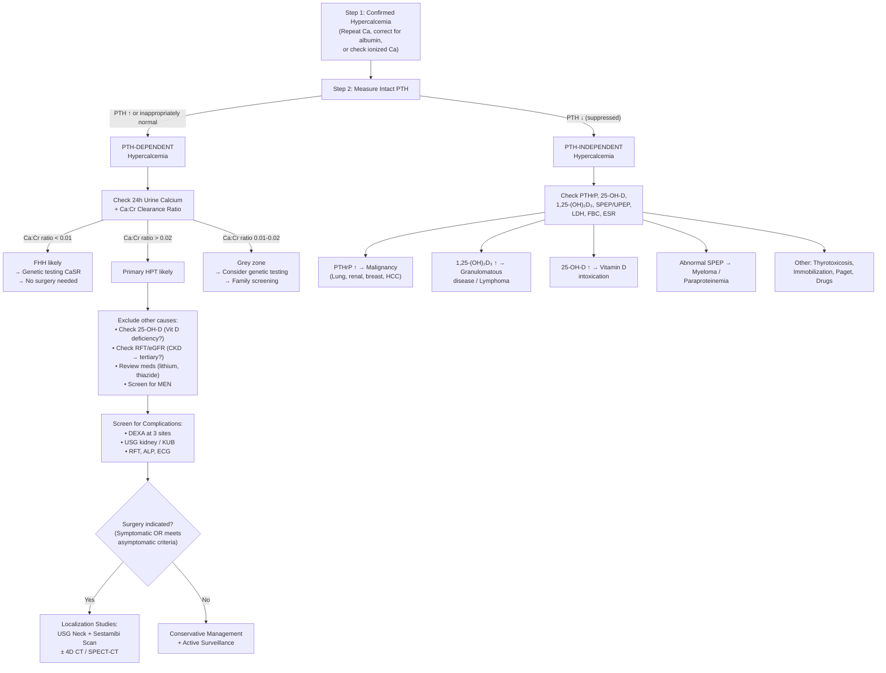

## Diagnostic Criteria, Algorithm, and Investigation Modalities

### 1. Diagnostic Criteria

#### 1.1 Primary Hyperparathyroidism — Biochemical Diagnosis

There is no single "diagnostic criteria checklist" like the Jones criteria or SLICC criteria for lupus. Instead, the diagnosis of primary HPT is fundamentally **biochemical** — it rests on demonstrating the characteristic hormone-calcium pattern and systematically excluding mimics.

***Diagnosis: ↑ serum calcium + inappropriately ↑ PTH (need not be above the reference range) in the setting of normal renal function*** [3]

Let me break this down from first principles:

| Criterion | Explanation | Why This Makes Sense |
|:----------|:-----------|:--------------------|
| **Hypercalcemia** (corrected Ca > 2.6 mmol/L or ↑ ionized Ca) | Confirmed on **at least 2 occasions** to exclude transient or laboratory artefact | A single elevated value could be spurious — dehydration, tourniquet artifact, postprandial variation |
| ***Elevated or inappropriately normal PTH*** | Even a PTH within the reference range is "inappropriate" if calcium is high — because CaSR should have suppressed it | This is the key conceptual point: the normal feedback loop (high Ca²⁺ → CaSR activation → PTH suppression) is broken. A "normal" PTH with high calcium = the parathyroid is not responding to feedback = autonomous secretion [2][3] |
| **Normal renal function** (eGFR) | Must exclude CKD to differentiate from tertiary HPT | In CKD, PTH elevation could represent secondary or tertiary HPT rather than primary |
| ***Exclusion of FHH*** (24h urine calcium mandatory) | Ca:Cr clearance ratio > 0.02 supports primary HPT; < 0.01 suggests FHH | FHH is benign and does not require surgery — failing to exclude it leads to unnecessary parathyroidectomy [1][3] |
| **Exclusion of other causes of elevated PTH** | Vitamin D deficiency, medications (lithium, thiazides) | These cause secondary elevations of PTH that can mimic primary HPT |

<Callout title="The 'inappropriately normal' PTH" type="error">
This is a classic exam pitfall. Students see a PTH of 5.5 pmol/L (reference 1.5–6.9) and say "PTH is normal — it can't be primary HPT." But if the calcium is 2.95 mmol/L, that PTH should be **suppressed to near zero**. A "normal" PTH with hypercalcemia is functionally the same as an elevated PTH — the gland is not responding to feedback. ***Always interpret PTH in the context of the calcium level.*** [2][3]
</Callout>

#### 1.2 Normocalcemic Primary HPT — Diagnostic Criteria (5th International Workshop, 2022)

This is a more recently recognized entity. The criteria are:

1. **Persistently elevated PTH** on at least 2 occasions separated by ≥ 3 months
2. **Consistently normal albumin-corrected total calcium AND normal ionized calcium**
3. **Systematic exclusion of ALL secondary causes of elevated PTH**:
   - Vitamin D deficiency (25-OH-D must be > 50 nmol/L / 20 ng/mL)
   - CKD (eGFR must be > 60 mL/min)
   - Medications (thiazides, lithium, denosumab)
   - Malabsorption syndromes
   - Hypercalciuria (idiopathic)

> This is essentially a diagnosis of exclusion: "I've corrected everything that could secondarily elevate PTH, and it's still high, but calcium is stubbornly normal."

#### 1.3 Secondary Hyperparathyroidism — Diagnostic Framework

No formal "criteria" — the diagnosis is clinical and biochemical:

| Feature | Expected Finding |
|:--------|:----------------|
| PTH | ↑↑ (often markedly elevated, can be > 10× normal in advanced CKD) |
| Calcium | ↓ or normal (NOT elevated) |
| Phosphate | ↑ (in CKD); ↓ or N (in vitamin D deficiency/malabsorption) |
| 25-OH-D | ↓ if vitamin D deficiency is the cause |
| eGFR | ↓ if CKD is the cause |
| **Context** | Known CKD, vitamin D deficiency, or malabsorption |

#### 1.4 Tertiary Hyperparathyroidism — Diagnostic Framework

| Feature | Expected Finding |
|:--------|:----------------|
| PTH | ↑↑ (persistently) |
| Calcium | **↑** (this is what distinguishes it from secondary HPT) |
| **Context** | Long-standing CKD/dialysis history OR persistent hypercalcemia after renal transplant |
| Parathyroid glands | Typically nodular hyperplasia (may be very large) |

The key distinguishing feature from secondary HPT: **calcium is elevated** (the glands have become autonomous and are now overproducing PTH irrespective of calcium feedback).

---

### 2. Diagnostic Algorithm

The diagnostic approach follows a stepwise, logical sequence. I'll walk through the thinking, then present it as a mermaid diagram.

**Step 1: Confirm true hypercalcemia**
- Repeat calcium measurement
- Calculate albumin-corrected calcium OR measure ionized calcium
- Rule out factitious hypercalcemia (paraproteinemia → check ionized Ca) [2]

**Step 2: Measure intact PTH — the pivot point**
- This splits the differential into PTH-dependent vs PTH-independent

**Step 3: If PTH-dependent — work up for primary HPT**
- Check 24h urine calcium to exclude FHH
- Check vitamin D to exclude secondary HPT (vitamin D deficiency with compensatory PTH rise that has "escaped" into hypercalcemia is possible but unusual)
- Check renal function to exclude tertiary HPT
- Review medications (lithium, thiazides)

**Step 4: Screen for complications of hypercalcemia/HPT**
- Renal: imaging for stones, renal function
- Bone: DEXA scan (3 sites)
- Other: ECG, ALP

**Step 5: If surgery is planned — localization studies**
- ***Localization studies are NOT for diagnosis and do NOT determine the need for surgery*** [1][13]
- They are performed ONLY after the biochemical diagnosis is confirmed and the decision to operate is made
- Purpose: guide the surgical approach (focused/minimally invasive vs bilateral exploration)

**Step 6: If PTH-independent — work up for malignancy and other causes**

---

### 3. Investigation Modalities — Detailed Breakdown

I will organize investigations into three categories:
1. **Biochemical investigations** (for diagnosis)
2. **Complication screening** (for staging severity)
3. **Localization studies** (for surgical planning)

#### 3.1 Biochemical Investigations (Diagnostic)

##### 3.1.1 Serum Calcium

| Aspect | Detail |
|:-------|:-------|
| **What to order** | Total serum calcium + serum albumin (to calculate corrected calcium) OR ionized calcium directly |
| **Corrected calcium formula** | ***Corrected Ca (mmol/L) = Total Ca + 0.02 × (40 − [Albumin in g/L])*** [10] |
| **Why correct for albumin** | ~40% of total serum calcium is bound to albumin. If albumin is low (e.g., liver disease, nephrotic syndrome), total Ca will be falsely low even though the physiologically active ionized fraction is normal. Conversely, if albumin is high, total Ca may be falsely elevated |
| **When to use ionized Ca** | Acid-base disturbances (acidosis ↑ ionized Ca by displacing Ca from albumin; alkalosis ↓ ionized Ca), suspected paraproteinemia, critical illness |
| **Key interpretation** | Corrected Ca > 2.6 mmol/L = hypercalcemia. Repeat at least once to confirm |

<Callout title="Factitious Hypercalcemia" type="error">
***Paraproteinemia (e.g. MGUS, myeloma) can cause factitious hypercalcemia*** [2]. The immunoglobulin molecules bind calcium, raising the TOTAL calcium measurement, but ionized calcium is normal. Clue: ↑ total protein with normal albumin → ↑ globulin gap. Always check ionized calcium if the clinical picture doesn't match. Also, ***phosphate may appear abnormal because immunoglobulin can precipitate with phosphate, interfering with the assay*** [2].
</Callout>

##### 3.1.2 Intact PTH

| Aspect | Detail |
|:-------|:-------|
| **Assay** | "Intact PTH" (also called "whole PTH" or "2nd generation PTH") measures the full 84-amino-acid molecule. Older "mid-molecule" assays are obsolete |
| **Reference range** | Typically 1.5–6.9 pmol/L (varies by lab) |
| **Key interpretation** | ↑ PTH with ↑ Ca = primary HPT (or tertiary, or FHH). ***An inappropriately "normal" PTH with hypercalcemia is still diagnostic*** [2][3]. ↓ PTH with ↑ Ca = PTH-independent cause (malignancy, vitamin D, etc.) |
| **Pitfalls** | PTH has a short half-life (~4 minutes) → blood sample must be handled properly (transport on ice, avoid hemolysis). Also, renal failure → accumulation of PTH fragments → can interfere with some assays |

##### 3.1.3 Serum Phosphate

| Finding | Interpretation | Mechanism |
|:--------|:--------------|:----------|
| **↓ PO₄** | Supports primary HPT or PTHrP-mediated malignancy | PTH (and PTHrP) ↓ phosphate reabsorption in the PCT → phosphaturia → hypophosphatemia [15] |
| **↑ PO₄** | Suggests CKD (secondary/tertiary HPT) or local osteolysis from bone metastases | CKD → ↓ renal PO₄ excretion; bone destruction releases stored PO₄ |
| **Normal PO₄** | Does not exclude HPT but less supportive | Early disease or dietary influences |

##### 3.1.4 Alkaline Phosphatase (ALP)

| Aspect | Detail |
|:-------|:-------|
| **Source** | Bone-specific isoenzyme reflects osteoblast activity (bone formation/turnover) |
| **In primary HPT** | Normal or ↑. Elevated ALP indicates significant bone disease (osteitis fibrosa cystica, active bone remodelling) |
| ***Clinical significance*** | ***↑ ALP predicts risk of hungry bone syndrome post-operatively*** [1]. Why? High ALP = high bone turnover = lots of osteoblasts actively laying down bone. After parathyroidectomy, PTH suddenly drops → osteoclasts stop resorbing → but osteoblasts continue forming bone → they "suck up" calcium, phosphate, and magnesium from the blood → profound hypocalcemia, hypophosphatemia, hypomagnesemia |
| **Also useful for** | DDx: markedly ↑ ALP with normal Ca/PO₄ → think Paget's disease rather than HPT |

##### 3.1.5 24-Hour Urine Calcium (and Ca:Cr Clearance Ratio)

| Aspect | Detail |
|:-------|:-------|
| ***Mandatory investigation*** | ***Must check in every case of suspected primary HPT*** [1][3] |
| **Purpose** | Distinguish primary HPT (↑ urine Ca) from FHH (↓ urine Ca) |
| **Calculation** | Ca:Cr clearance ratio = (24h urine Ca × Plasma Cr) / (Plasma Ca × 24h urine Cr) |
| **Interpretation** | > 0.02 → primary HPT; < 0.01 → FHH; 0.01–0.02 → indeterminate (consider genetic testing for CaSR mutation) |
| **Also documents** | Degree of hypercalciuria — important for assessing renal stone risk and is one of the criteria for surgical intervention in asymptomatic primary HPT [13] |

##### 3.1.6 Vitamin D (25-OH-D)

| Aspect | Detail |
|:-------|:-------|
| **Purpose** | Rule out vitamin D deficiency as a cause of secondary HPT; rule out vitamin D excess as a cause of PTH-independent hypercalcemia |
| **In primary HPT** | 25-OH-D may be normal or low. Vitamin D deficiency is extremely common in the general population (including HK) and can coexist with primary HPT — this is important because: (a) Vitamin D deficiency can mask hypercalcemia (the Ca may be "normal" when it should be high); (b) It worsens bone disease; (c) It should be cautiously repleted before/after surgery |
| **Interpretation** | Low 25-OH-D with ↑ PTH and low/normal Ca → secondary HPT. Low 25-OH-D with ↑ PTH and ↑ Ca → primary HPT with concurrent vitamin D deficiency |

##### 3.1.7 Renal Function Tests (Creatinine, eGFR)

| Aspect | Detail |
|:-------|:-------|
| **Purpose** | Rule out CKD (which would point to secondary or tertiary HPT); establish baseline renal function; assess for renal complications of HPT |
| **In primary HPT** | Should be normal unless chronic hypercalcemia has caused renal damage (nephrocalcinosis, renal stones, tubular dysfunction) |
| **Interpretation** | ↓ eGFR + ↑ PTH + ↑ Ca + history of CKD/dialysis → tertiary HPT. ↓ eGFR + ↑ PTH + ↓/N Ca → secondary HPT |

##### 3.1.8 Other Blood Tests

| Test | Purpose | Interpretation |
|:-----|:--------|:--------------|
| **1,25(OH)₂D₃ (calcitriol)** | Not routinely measured in primary HPT workup but useful if suspecting granulomatous disease or lymphoma | ↑ in sarcoidosis, TB, lymphoma (autonomous 1α-hydroxylase) [10] |
| **PTHrP** | If PTH is suppressed (PTH-independent hypercalcemia) | ↑ in humoral hypercalcemia of malignancy |
| **ECG** | Screen for cardiac effects of hypercalcemia | Shortened QT interval (accelerated repolarization), arrhythmias at very high Ca |
| **Serum magnesium** | Baseline; important perioperatively | Severe hypoMg can impair PTH secretion; also drops in hungry bone syndrome |
| **FBC, ESR, LDH** | If malignancy suspected | Anaemia, ↑ ESR, ↑ LDH suggest haematological malignancy |
| **Serum protein electrophoresis (SPEP)** | If paraproteinemia/myeloma suspected | Monoclonal band = myeloma/MGUS [2] |

---

#### 3.2 Complication Screening Investigations

Once primary HPT is diagnosed biochemically, you need to assess for end-organ damage. This determines both the severity of disease and whether the patient meets criteria for surgery (even if "asymptomatic"):

***Investigations are targeted at defining possible complications due to increased PTH levels and hypercalcemia*** [13]

| Investigation | What It Assesses | Key Findings in HPT |
|:-------------|:----------------|:-------------------|
| ***DEXA bone densitometry*** (3 sites) | Bone mineral density at **lumbar spine** (L1–L4, trabecular bone), **hip** (femoral neck, mixed), and ***distal 1/3 radius*** (cortical bone) [3][13] | ***Osteopenia/osteoporosis preferentially at cortical sites*** (distal 1/3 radius > hip > spine). T-score ≤ −2.5 at any site = surgical indication. Remember: PTH preferentially resorbs cortical bone |
| **Vertebral fracture assessment** (VFA or lateral spine X-ray) | Subclinical vertebral fractures | Vertebral compression fractures may be present even without symptoms; if found, constitutes a surgical indication |
| ***USG kidneys / KUB X-ray*** | ***Detect stones in the urinary tract*** [1][13] | Nephrolithiasis (surgical indication even if asymptomatic on imaging), nephrocalcinosis (medullary calcification) |
| **RFT** | Renal function | eGFR < 60 mL/min = surgical indication (even if asymptomatic) |
| ***24h urine calcium*** | Document degree of hypercalciuria [13] | > 10 mmol/day (or > 400 mg/day) = surgical indication. Also risk factor for stone formation |
| ***ALP*** | Bone turnover | ***↑ ALP predicts risk of hungry bone syndrome post-op*** [1] |
| **ECG** | Cardiac effects of hypercalcemia | Shortened QT interval |

<Callout title="Why DEXA Must Include the Distal 1/3 Radius">
In standard osteoporosis screening (e.g., postmenopausal women), DEXA typically measures the lumbar spine and hip. But in primary HPT, the characteristic bone loss is at **cortical** sites due to PTH's preferential resorption of cortical bone. The distal 1/3 of the radius is the most cortical site routinely measured by DEXA, and it is the most sensitive site for detecting HPT-related bone loss. If you only measure spine and hip, you may miss significant cortical bone loss. [3]
</Callout>

---

#### 3.3 Localization Studies (Pre-operative, NOT Diagnostic)

This is one of the most frequently tested and most misunderstood concepts:

> ***Localization studies are NOT used in the diagnosis of primary hyperparathyroidism NOR to determine the need for surgery. They are indicated ONLY when primary HPT is confirmed with biochemical tests and the decision for surgery has been made.*** [1][13][14]

The purpose of localization studies is to:
1. **Guide the surgical approach**: Can the surgeon do a focused/minimally invasive parathyroidectomy (if a single adenoma is clearly localized)? Or is bilateral neck exploration needed?
2. **Identify ectopic glands**: Intrathymic, retroesophageal, carotid sheath, mediastinal
3. ***5% of patients present with double adenomas*** — localization helps identify these [1]

##### 3.3.1 First-Line Localization: ***USG Neck + Sestamibi Scan*** [1][14]

**a) Ultrasound (USG) Neck**

| Aspect | Detail |
|:-------|:-------|
| **Advantages** | Non-invasive, no radiation, inexpensive, widely available, can be done at bedside, can assess concurrent thyroid pathology |
| ***Sonographic features*** | ***Homogeneous hypoechoic*** nodule posterior to the thyroid lobe, often with ***an extra-thyroidal feeding vessel with peripheral vascularity on Doppler imaging*** [13] |
| **Limitations** | Operator-dependent; poor sensitivity for ectopic glands (cannot see mediastinal/retroesophageal locations); may miss small or multigland disease; affected by concurrent thyroid nodules |
| **Sensitivity** | ~75–80% for single adenoma; much lower for multigland disease |

**b) ⁹⁹ᵐTc-Sestamibi Scintigraphy (Parathyroid Scan)**

This is the workhorse nuclear medicine study for parathyroid localization. Understanding the mechanism from first principles is key:

| Aspect | Detail |
|:-------|:-------|
| ***Radiopharmaceutical*** | ***⁹⁹ᵐTc-sestamibi*** [1][14] |
| ***Mechanism*** | ***Sestamibi accumulates in mitochondria***. The washout rate depends on the number of mitochondria in the tissue. ***Parathyroid adenomas are rich in oxyphilic cells*** which have ***abundant mitochondria*** → ***slow washout*** compared to the thyroid gland, which has fewer mitochondria [1][14] |
| ***Technique: dual-phase*** | ***Early image (10–20 min)***: tracer uptake in BOTH thyroid and parathyroid glands (both take it up initially). ***Delayed image (2h)***: faster tracer washout from thyroid tissue → the ***parathyroid adenoma persists as a focus of retained activity*** [1][14] |
| **Protocols** | ***Single isotope dual-phase scan***: as described above — most commonly used. ***Dual isotope subtraction imaging (⁹⁹Tc-sestamibi + ⁹⁹Tc-pertechnetate)***: subtract the thyroid signal (pertechnetate is thyroid-specific) to isolate parathyroid uptake [1] |
| **SPECT/CT** | ***Single-photon emission CT (SPECT)***: 3D reconstruction with higher anatomical resolution; can be fused with CT images (SPECT/CT) for precise anatomical localization [1][14] |
| ***False positive*** | ***Hurthle cell adenoma*** of the thyroid — also rich in mitochondria/oxyphil cells → slow washout mimics parathyroid adenoma [1] |
| **False negative** | Parathyroid hyperplasia (all 4 glands mildly enlarged — less dramatic uptake), multiple adenomas, small adenomas, concurrent thyroid disease. ***A negative Sestamibi scan does NOT preclude the diagnosis of primary HPT*** [13] |
| **Sensitivity** | ~80–90% for single adenoma; ~30–45% for multigland disease |

<Callout title="Clinical Pearl: Sestamibi and Surgery">
The combination of concordant USG + Sestamibi findings pointing to a single adenoma allows the surgeon to proceed with a ***focused (minimally invasive) parathyroidectomy*** — a smaller incision, less dissection, shorter operating time, and lower complication risk. If the two imaging modalities are discordant or suggest multigland disease, the surgeon should plan for ***bilateral neck exploration***. [1]
</Callout>

##### 3.3.2 Second-Line / Adjunct Localization Studies

| Modality | Indication | Details |
|:---------|:-----------|:-------|
| ***4D CT scan*** | When USG + Sestamibi are negative/discordant; re-operative cases | Multiphase CT with pre-contrast, arterial, venous, and delayed phases. Parathyroid adenomas show characteristic **early arterial enhancement and rapid washout** (the "4th dimension" is time/contrast dynamics). Advantage: excellent anatomical detail. Disadvantage: ***high radiation dose*** [1] |
| **MRI** | Mediastinal ectopic glands, pregnant patients (no radiation) | Parathyroid adenomas show ***low intensity on T1, high intensity on T2*** [13]. Good for identifying ectopic mediastinal or retroesophageal glands |
| **PET scan** | Refractory cases | ***¹¹C-methionine*** or ***¹⁸F-fluorocholine*** PET/CT — used when conventional imaging fails. Methionine is taken up by metabolically active parathyroid tissue [13] |
| ***Selective venous sampling*** | ***Invasive — reserved for re-operative cases or unrevealing non-invasive tests*** [1][13] | Catheterization of cervical veins (superior/middle/inferior thyroid, thymic, vertebral veins) with measurement of PTH levels. ***A 1.5–2× increase in PTH from a representative cervical vein compared to a peripheral site is considered abnormal*** [13]. Most common invasive modality for parathyroid localization |
| ***Selective arteriography*** | ***Invasive — reserved for re-operative/difficult cases*** [13] | Performed by combining ***selective transarterial hypocalcemic stimulation*** (injection of sodium citrate to induce hypocalcemia) ***with non-selective venous sampling***. The induced hypocalcemia stimulates PTH release from the abnormal gland, which is then detected in the venous samples [13] |

##### 3.3.3 Intraoperative Adjuncts

| Modality | Purpose | How It Works |
|:---------|:--------|:-------------|
| ***Intraoperative PTH monitoring*** | Confirm successful removal of hyperfunctioning tissue | ***Miami criteria: PTH drops to normal range AND falls > 50% from the highest pre-excision value at 10 minutes post-resection*** [1]. If criteria NOT met → suspect multigland disease → convert to bilateral exploration |
| **Intraoperative ultrasound** | Real-time identification of adenoma during surgery | Handheld probe placed directly on surgical field |
| ***Frozen section*** | Confirm excised tissue is parathyroid | Rapid histological examination during surgery. Especially important in ***subtotal parathyroidectomy*** ("3.5 resection") to confirm the remnant tissue contains parathyroid tissue [1] |
| **Gamma probe** | Used with Sestamibi injection pre-op | Handheld probe detects radioactivity to guide surgeon to the "hot" adenoma |

---

### 4. Standard Investigation Protocol — Putting It All Together (JCEM/5th International Workshop Guidelines)

***Standard investigations for primary HPT (JCEM 2014, updated 5th International Workshop 2022)*** [3]:

**A. Confirm the diagnosis:**
- PTH, serum calcium (corrected), phosphate, ALP
- 24h urine calcium + Ca:Cr clearance ratio (exclude FHH)
- 25-OH-D (exclude vitamin D deficiency)
- Creatinine, eGFR (exclude CKD/tertiary HPT)
- Review medications (thiazides → stop and recheck; lithium → stop if safe and recheck)

**B. Screen for MEN syndromes** (if clinical suspicion or young age, family history, multigland disease):
- Genetic testing for MEN1, RET
- Screen for pituitary tumours (prolactin, IGF-1), pancreatic endocrine tumours, phaeochromocytoma (urinary catecholamines/metanephrines)

**C. Screen for complications:**
- ***DEXA at 3 sites: lumbar spine, hip, distal 1/3 radius*** [3][13]
- Vertebral fracture assessment (lateral spine X-ray or VFA)
- ***USG kidneys / KUB*** for nephrolithiasis/nephrocalcinosis [1][13]
- RFT
- ECG

**D. If surgery decided → Localization:**
- ***USG neck + Sestamibi scan*** (first-line) [1][14]
- ± 4D CT, SPECT/CT, MRI if needed
- ± Invasive studies (selective venous sampling, arteriography) for re-operative/difficult cases

---

### 5. Investigations for Secondary and Tertiary HPT

#### 5.1 Secondary HPT (CKD context — KDIGO guidelines)

| Investigation | Purpose | Key Findings |
|:-------------|:--------|:-------------|
| **Intact PTH** | Confirm elevated PTH | Markedly elevated (often > 3–9× ULN in CKD Stage 5) |
| **Calcium and phosphate** | Assess Ca-PO₄ balance | Ca low/normal; PO₄ elevated |
| **25-OH-D** | Assess vitamin D status | Often low in CKD |
| **Ca × PO₄ product** | Assess metastatic calcification risk | > 4.4 mmol²/L² (or > 55 mg²/dL²) = high risk |
| **ALP / Bone-specific ALP** | Assess bone turnover | ↑ in high-turnover renal osteodystrophy |
| **Hand X-ray** | Subperiosteal resorption | Radial aspect of middle phalanges — classic finding |
| **Lateral spine X-ray** | "Rugger jersey spine" | Alternating sclerotic and lucent bands in vertebral bodies |
| **Skull X-ray** | "Salt-and-pepper skull" | Diffuse mottled lucencies |
| **Bone biopsy (rarely done)** | Gold standard for renal osteodystrophy classification | Distinguishes high-turnover (osteitis fibrosa) from low-turnover (adynamic bone) disease |

#### 5.2 Tertiary HPT

- Same investigations as secondary HPT PLUS:
- Confirm **hypercalcemia** (this is what distinguishes it from secondary)
- If post-transplant: confirm the transplant has restored renal function (the persistence of ↑ PTH + ↑ Ca despite normal renal function = tertiary)
- Localization studies (USG + Sestamibi) if parathyroidectomy is planned

---

### 6. Radiological Findings in Hyperparathyroidism — Summary

| Finding | Where to Look | Significance |
|:--------|:-------------|:-------------|
| ***Subperiosteal bone resorption*** | **Hand X-ray — radial aspect of middle phalanges** | Pathognomonic of hyperparathyroidism; also distal phalangeal tufts, medial aspect of proximal tibiae, distal clavicles |
| ***"Salt-and-pepper" skull*** | **Skull X-ray / CT** | Diffuse mottled tiny lucencies from trabecular bone resorption |
| ***"Rugger jersey" spine*** | **Lateral thoracolumbar spine X-ray** | Alternating bands of sclerosis (endplates) and lucency (central body) — characteristic of **secondary HPT / renal osteodystrophy** |
| **Brown tumours** | Long bones, jaw, pelvis, ribs | Lytic lesions with well-defined margins; can mimic metastases |
| **Tapering of distal clavicles** | Shoulder X-ray | Resorption of the distal acromial end |
| **Bone cysts** | Central medullary portions of MCP, ribs, pelvis | Advanced disease [3] |
| **Nephrolithiasis / nephrocalcinosis** | KUB / USG kidneys | Calcium stones; medullary calcification |
| **Chondrocalcinosis** | Knee X-ray (most commonly menisci), wrist (triangular fibrocartilage) | Linear calcification in cartilage — think CPPD / pseudogout secondary to HPT |
| ***Parathyroid adenoma on USG*** | ***Posterior to thyroid lobe*** | ***Hypoechoic nodule with peripheral vascularity on Doppler*** [13] |
| ***Sestamibi: persistent focal uptake*** | ***Delayed 2h image*** | ***Persistent activity after thyroid washout = hyperfunctioning parathyroid tissue*** [1][14] |

---

<Callout title="High Yield Summary — Diagnosis">

1. **Diagnosis of primary HPT is BIOCHEMICAL**: ↑ Ca + ↑/inappropriately normal PTH + normal RFT. PTH must always be interpreted in context of calcium.

2. ***24h urine calcium is MANDATORY*** to exclude FHH. Ca:Cr clearance ratio < 0.01 = FHH; > 0.02 = primary HPT.

3. **Standard workup**: PTH, Ca, PO₄, ALP, 25-OH-D, RFT, 24h urine Ca. Screen complications: DEXA (3 sites including distal 1/3 radius), USG kidneys, ECG.

4. ***Localization studies (USG + Sestamibi) are NOT diagnostic and do NOT determine the need for surgery.*** They are performed ONLY after biochemical diagnosis is confirmed and surgery is decided → guide surgical approach.

5. ***Sestamibi mechanism***: accumulates in mitochondria; parathyroid adenomas rich in oxyphilic cells (abundant mitochondria) → slow washout at 2h vs thyroid. False positive: Hurthle cell adenoma. False negative: hyperplasia, small adenomas.

6. ***Intraoperative PTH (Miami criteria)***: PTH drops to normal + falls > 50% at 10 min post-excision → confirms successful removal. If NOT met → convert to bilateral exploration.

7. ***↑ ALP predicts hungry bone syndrome*** post-parathyroidectomy — high bone turnover means osteoblasts will rapidly sequester calcium after PTH drops.

8. **Normocalcemic primary HPT**: persistently ↑ PTH with normal Ca after excluding ALL secondary causes (Vit D deficiency, CKD, medications, malabsorption).

</Callout>

---

<ActiveRecallQuiz
  title="Active Recall - Diagnosis of Hyperparathyroidism"
  items={[
    {
      question: "A patient with suspected primary HPT has PTH of 9.0 pmol/L and corrected calcium of 2.88 mmol/L. Name the single most important investigation you MUST order before referring for surgery, explain why, and describe how you interpret the result.",
      markscheme: "24-hour urine calcium with Ca:Cr clearance ratio calculation. Must exclude FHH (benign, no surgery needed). Ca:Cr ratio greater than 0.02 confirms primary HPT; less than 0.01 suggests FHH; 0.01-0.02 is indeterminate requiring genetic testing for CaSR mutation.",
    },
    {
      question: "Explain the mechanism of Sestamibi scintigraphy in localizing parathyroid adenomas. Include the radiopharmaceutical, the cellular basis of uptake, the imaging protocol, and one cause of a false positive result.",
      markscheme: "Radiopharmaceutical: 99mTc-sestamibi. Accumulates in mitochondria. Parathyroid adenomas are rich in oxyphilic cells with abundant mitochondria, causing slow washout compared to thyroid. Dual-phase protocol: early image at 10-20 minutes (uptake in both thyroid and parathyroid), delayed image at 2 hours (thyroid washes out, parathyroid persists). False positive: Hurthle cell adenoma of the thyroid (also mitochondria-rich). A negative scan does NOT exclude the diagnosis.",
    },
    {
      question: "Why must DEXA scanning in primary HPT include the distal one-third radius in addition to the standard lumbar spine and hip sites?",
      markscheme: "Primary HPT causes preferential cortical bone loss due to continuous PTH-driven osteoclast activation. The distal one-third radius is the most cortical DEXA site and is the most sensitive location for detecting HPT-related bone loss. Measuring only spine and hip (which have more trabecular bone, relatively preserved by PTH) may miss significant cortical osteoporosis.",
    },
    {
      question: "Explain why elevated ALP in primary HPT predicts hungry bone syndrome after parathyroidectomy.",
      markscheme: "Elevated ALP reflects high osteoblast activity and bone turnover from chronic PTH stimulation. After parathyroidectomy, PTH drops suddenly. Osteoclasts cease resorbing, but osteoblasts (which were highly active) continue forming bone, rapidly sequestering calcium, phosphate, and magnesium from the bloodstream. This causes profound hypocalcemia, hypophosphatemia, and hypomagnesemia (hungry bone syndrome). Higher pre-op ALP equals greater post-op risk.",
    },
    {
      question: "A surgeon is performing a focused parathyroidectomy. The pre-excision PTH is 18 pmol/L. Ten minutes after removing the adenoma, PTH is 7 pmol/L. What criteria is the surgeon using and has the adenoma been successfully removed?",
      markscheme: "Miami criteria for intraoperative PTH monitoring: PTH must drop to normal range AND fall more than 50 percent of the highest pre-excision value at 10 minutes post-resection. 50 percent of 18 = 9 pmol/L, and the value dropped to 7 which is less than 9 (more than 50 percent drop). If 7 is within the normal range (typically 1.5-6.9 pmol/L), then 7 is slightly above - borderline. If the lab normal range goes up to 7, criteria may be met. If not met, suspect multigland disease and convert to bilateral neck exploration.",
    },
    {
      question: "What is the role of localization studies in primary HPT? When should they be performed and when should they NOT be performed?",
      markscheme: "Localization studies (USG neck + Sestamibi scan) are NOT for diagnosis and do NOT determine the need for surgery. They should be performed ONLY after biochemical diagnosis is confirmed and the decision for surgery has been made. Their role is to guide the surgical approach: concordant findings allow focused minimally invasive parathyroidectomy; discordant or negative results necessitate bilateral neck exploration. A negative scan does not preclude diagnosis or surgery.",
    },
  ]}
/>

## References

[1] Senior notes: maxim.md (Primary hyperparathyroidism section)
[2] Senior notes: Ryan Ho Chemical Path.pdf (p23, Hypercalcemia section; p25-26, Hypocalcemia and Vitamin D sections)
[3] Senior notes: Ryan Ho Endocrine.pdf (p42, Primary Hyperparathyroidism — Dx and Standard Ix)
[10] Senior notes: Ryan Ho Fundamentals.pdf (p430-432, Hypercalcemia and Hypocalcemia sections)
[13] Senior notes: felixlai.md (Localization studies section, p1016-1025)
[14] Senior notes: Ryan Ho Diagnostic Radiology.pdf (p60, Parathyroid Scintigraphy)
[15] Senior notes: Ryan Ho Urogenital.pdf (p33, Phosphate homeostasis)
