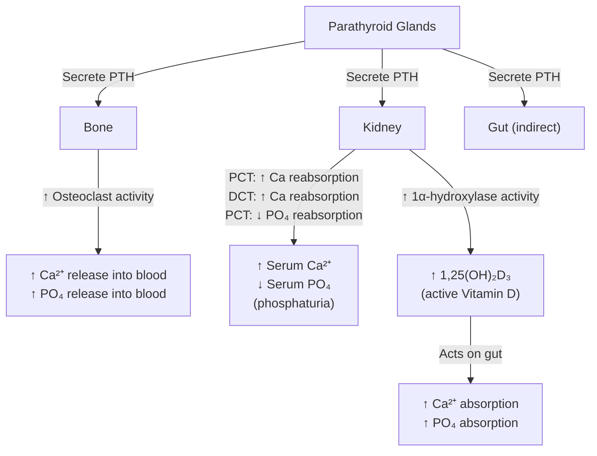

# Hyperparathyroidism

## 1. Definition

Hyperparathyroidism (HPT) refers to a state of excessive parathyroid hormone (PTH) secretion, resulting in disordered calcium-phosphate homeostasis. Let's break down the word:

- **"Hyper"** = excessive
- **"Para"** = beside (the parathyroid glands sit *beside* the thyroid)
- **"Thyroid"** = shield-shaped (Greek *thyreos*) — refers to the thyroid gland adjacent to which the parathyroids sit
- **"ism"** = a condition or state

So the name literally tells you: *a condition of excessive activity of the glands beside the thyroid*.

There are **three distinct types**, each with a fundamentally different mechanism:

| Type | Mechanism | PTH Level | Calcium Level |
|:-----|:----------|:----------|:--------------|
| **Primary (1° HPT)** | Autonomous, unregulated PTH overproduction from intrinsic parathyroid pathology | ↑ or inappropriately normal | ↑ (hypercalcemia) |
| **Secondary (2° HPT)** | Physiological, compensatory PTH hypersecretion in response to chronic hypocalcemia (e.g. CKD, vitamin D deficiency) | ↑ | ↓ or normal |
| **Tertiary (3° HPT)** | Autonomous PTH secretion that has become independent of the original stimulus, after prolonged secondary HPT (the glands become hyperplastic/autonomous) | ↑ | ↑ (hypercalcemia) |

<Callout title="Conceptual Key: Primary vs Secondary vs Tertiary">
Think of it this way:
- **Primary** = the parathyroid itself is broken (intrinsic disease, usually an adenoma).
- **Secondary** = the parathyroid is doing its job correctly — responding to low calcium — but the underlying problem (CKD, vitamin D deficiency) keeps calcium low, so it keeps working overtime.
- **Tertiary** = the parathyroid has been working overtime for so long (years of secondary HPT, typically in CKD patients on dialysis) that it has undergone irreversible hyperplasia and now functions autonomously — even if you fix the underlying calcium, it won't stop.
</Callout>

---

## 2. Epidemiology

### 2.1 Primary Hyperparathyroidism

- ***Most common cause of hypercalcemia*** in the outpatient/ambulatory setting [1][2]
- **Prevalence**: ~1–2 per 1,000 in the general population [3]
- **Demographics**: peaks in the **6th–7th decade**, average age ~59 years [3]
- **Sex**: ***M:F ≈ 1:2–3*** — significantly more common in **postmenopausal women** [3]
  - Why? Estrogen has a protective role in calcium homeostasis; after menopause, the loss of estrogen unmasks subtle parathyroid pathology and increases bone turnover, making the disease manifest
- **Incidence**: approximately 25–30 per 100,000 person-years in Western populations; increasingly recognized in Asian populations including Hong Kong with wider use of routine biochemistry panels
- The vast majority of cases are now detected incidentally through routine blood tests showing asymptomatic hypercalcemia — the "asymptomatic" form is by far the most common presentation in developed countries

### 2.2 Secondary Hyperparathyroidism

- Extremely common in **CKD patients**, especially those on dialysis
- Prevalence increases with advancing CKD stage: nearly universal in CKD Stage 5 (ESKD)
- In Hong Kong, with a large dialysis population, secondary HPT is a very significant clinical problem

### 2.3 Tertiary Hyperparathyroidism

- Occurs in a subset of long-standing secondary HPT patients, particularly those with **CKD who have received a renal transplant** — the transplanted kidney corrects the renal failure, but the parathyroids remain autonomous
- Less common overall

> **High Yield**: Primary HPT is the **#1 cause of hypercalcemia in the outpatient setting**. Malignancy is the #1 cause of hypercalcemia in the **inpatient** setting. [2]

---

## 3. Risk Factors

### 3.1 Primary Hyperparathyroidism

| Category | Risk Factor | Explanation |
|:---------|:-----------|:------------|
| **Demographics** | ***Female sex*** (postmenopausal) | Estrogen withdrawal unmasks parathyroid disease |
| | Age > 50 years | Accumulating somatic mutations in parathyroid tissue |
| **Radiation** | ***Previous head and neck irradiation*** | Ionizing radiation damages parathyroid cell DNA, promoting adenoma formation (similar mechanism to thyroid cancer post-radiation) [1][4] |
| | Brain irradiation for childhood leukemia | |
| | Total body irradiation for bone marrow transplant | |
| | Environmental radiation exposure | |
| **Familial/Genetic** | ***MEN1*** (menin gene on chromosome 11q13) | Causes 4-gland parathyroid hyperplasia [1][2] |
| | ***MEN2A*** (RET proto-oncogene) | Causes parathyroid hyperplasia/adenoma [1][2] |
| | Familial isolated hyperparathyroidism | |
| | Hyperparathyroidism-jaw tumour (HPT-JT) syndrome (CDC73/HRPT2 gene) | Associated with parathyroid carcinoma |
| **Drugs** | ***Lithium*** | Shifts the calcium-PTH set point to the right (higher calcium needed to suppress PTH) |
| | Thiazide diuretics (unmasking) | Thiazides reduce urinary calcium excretion → can unmask underlying HPT |

### 3.2 Secondary Hyperparathyroidism

- **CKD** (most important and common)
- **Vitamin D deficiency** (very common in Hong Kong — indoor lifestyle, limited sun exposure, elderly)
- **Malabsorption syndromes** (celiac disease, inflammatory bowel disease, bariatric surgery)
- **Chronic dietary calcium deficiency**

### 3.3 Tertiary Hyperparathyroidism

- **Prolonged secondary HPT** (especially CKD patients on dialysis for years)
- **Post-renal transplant** (the stimulus is removed but glands remain autonomous)

---

## 4. Anatomy and Function of the Parathyroid Glands

### 4.1 Gross Anatomy

- ***Typically 4 parathyroid glands*** (superior pair + inferior pair), though ~13% of people have supernumerary glands (5 or more)
- Each gland is tiny: **~5 × 3 × 1 mm**, weighing **30–50 mg** (the size of a grain of rice)
- Located on the **posterior surface of the thyroid gland**, within or just outside the thyroid capsule
- **Colour**: yellow-brown (due to fat content), which helps surgeons identify them

#### Embryology (clinically important for ectopic glands):

| Gland | Embryological Origin | Clinical Significance |
|:------|:--------------------|:---------------------|
| **Superior parathyroids** | 4th pharyngeal pouch | Relatively constant position (posterolateral to upper thyroid poles) — less likely to be ectopic |
| **Inferior parathyroids** | 3rd pharyngeal pouch (with the thymus) | Migrate further during development → **more variable position** → may be found anywhere from the angle of the mandible down to the anterior mediastinum (within the thymus) |

<Callout title="Why does ectopic location matter?" type="idea">
If a patient has biochemically confirmed primary HPT but imaging cannot localize the adenoma in the usual position, think about ectopic locations — especially **intrathymic** (anterior mediastinum), **retroesophageal**, **carotid sheath**, or **intrathyroidal**. The inferior glands are far more commonly ectopic because they have a longer embryological migration path (from the 3rd pharyngeal pouch, traveling with the thymus).
</Callout>

#### Blood Supply
- Supplied by the **inferior thyroid artery** (branch of the thyrocervical trunk from the subclavian artery)
- Superior glands may also receive supply from the superior thyroid artery or anastomoses
- This is why surgeons must be extremely careful during thyroidectomy to preserve parathyroid blood supply — devascularization leads to **hypoparathyroidism**

#### Nerve Relations
- The **recurrent laryngeal nerve (RLN)** runs in close proximity to the parathyroid glands (between the trachea and esophagus, posterior to the thyroid lobe)
- Surgeons identify the RLN as a landmark during parathyroidectomy

### 4.2 Histology

The parathyroid gland contains two main cell types:

| Cell Type | Function | Appearance |
|:----------|:---------|:-----------|
| **Chief cells** | Produce and secrete **PTH** | Small, pale, principal cell type |
| ***Oxyphil cells*** | Function less well understood; rich in **mitochondria** | Larger, eosinophilic cytoplasm; ***important for Sestamibi scanning*** because the tracer accumulates in mitochondria [1] |

- With age, the glands accumulate more fat and oxyphil cells
- In **parathyroid adenomas**, there is a predominance of chief cells (often with a rim of normal compressed parathyroid tissue)
- ***Parathyroid adenomas are rich in oxyphilic cells*** (which have abundant mitochondria) — this is the basis for ***Sestamibi scanning*** [1]

### 4.3 Parathyroid Hormone (PTH) Physiology

PTH is an 84-amino acid polypeptide hormone. Its primary role is to **raise serum calcium** and **lower serum phosphate**. Understanding PTH physiology is essential to understanding every aspect of hyperparathyroidism.

#### PTH Actions — Three Target Organs:

**Detailed PTH actions:**

1. **Bone** (most rapid effect for acute calcium correction):
   - Stimulates **osteoclast-mediated bone resorption** → releases calcium *and* phosphate into blood
   - In chronic excess: causes **osteitis fibrosa cystica** (brown tumours, subperiosteal resorption, salt-and-pepper skull)

2. **Kidney** (dual action):
   - **↑ Calcium reabsorption** in the distal convoluted tubule (DCT)
   - **↓ Phosphate reabsorption** in the proximal convoluted tubule (PCT) → ***phosphaturia*** → this is why primary HPT causes **low phosphate** (hypophosphatemia)
   - **↑ 1α-hydroxylase** activity in the PCT → converts 25(OH)D₃ to ***1,25(OH)₂D₃ (calcitriol)*** → the active form of vitamin D

3. **Gut** (indirect, via vitamin D):
   - Calcitriol increases intestinal calcium and phosphate absorption

#### PTH Regulation — The Calcium-Sensing Receptor (CaSR):

- The **calcium-sensing receptor (CaSR)** on parathyroid chief cells is the master regulator
- When serum ionized calcium rises → CaSR is activated → **suppresses PTH secretion**
- When serum ionized calcium falls → CaSR is less active → **stimulates PTH secretion**
- This is a classic **negative feedback loop**

<Callout title="CaSR and Familial Hypocalciuric Hypercalcemia (FHH)" type="error">
***FHH results from an inactivating mutation in the CaSR*** [2]. This means the parathyroid glands cannot "sense" the high calcium → PTH remains inappropriately normal or mildly elevated despite hypercalcemia. Crucially, the renal CaSR is also affected → the kidney reabsorbs too much calcium → **low urinary calcium excretion** (Ca:Cr clearance ratio < 0.01). FHH is a **benign condition** that does NOT require surgery — it is the most important mimic of primary HPT that you must exclude with a ***24-hour urine calcium*** [1].
</Callout>

#### Other Hormones in Calcium Homeostasis:

| Hormone | Source | Effect on Ca²⁺ | Effect on PO₄ |
|:--------|:-------|:---------------|:--------------|
| **PTH** | Parathyroid chief cells | ↑↑ | ↓ |
| **Calcitriol (1,25(OH)₂D₃)** | Kidney (1α-hydroxylase) | ↑ | ↑ |
| **Calcitonin** | Thyroid C cells (parafollicular) | ↓ (inhibits osteoclasts) | ↓ |
| **FGF-23** | Osteocytes | — | ↓↓ (phosphaturic) |

---

## 5. Etiology and Pathophysiology

### 5.1 Primary Hyperparathyroidism

#### 5.1.1 Causes (Pathology)

| Cause | Frequency | Key Features |
|:------|:----------|:-------------|
| ***Solitary parathyroid adenoma*** | ***~80–85%*** | Benign, clonal neoplasm of one gland; remaining glands are suppressed/atrophic [1][3] |
| ***Multi-gland hyperplasia*** | ***~10–15%*** | All four glands enlarged; associated with ***MEN1, MEN2A*** [1][2] |
| ***Double adenomas*** | ***~1–2%*** (some series up to 5–10%) | Two separate adenomas; important to consider during surgical planning [1] |
| ***Parathyroid carcinoma*** | *** < 1%*** | Very rare; often presents with **very high calcium ( > 3.5 mmol/L)** and a **palpable neck mass**; associated with **HRPT2/CDC73** gene mutation and HPT-JT syndrome [1][2] |

#### 5.1.2 Pathophysiology of Primary HPT

The fundamental problem is **autonomous, unregulated PTH secretion** that is not appropriately suppressed by high serum calcium:

1. **Adenoma/hyperplasia** → autonomous PTH secretion → the normal negative feedback via CaSR is lost or the "set point" is shifted upward
2. **Excess PTH actions**:
   - **Bone**: ↑ osteoclast activity → bone resorption → **hypercalcemia** + bone disease (osteoporosis, osteitis fibrosa cystica)
   - **Kidney**: ↑ Ca reabsorption + ↓ PO₄ reabsorption → **hypercalcemia + hypophosphatemia**
   - ↑ 1α-hydroxylase → ↑ calcitriol → ↑ gut Ca absorption → further **hypercalcemia**
   - Despite ↑ renal Ca reabsorption, the filtered load of calcium is so high that **hypercalciuria** still occurs → **renal stones** (calcium oxalate and calcium phosphate)
3. **Biochemical signature**: ***Hypercalcemia + elevated (or inappropriately normal) PTH + low phosphate + high/normal ALP*** [2]

<Callout title="Why is PTH 'inappropriately normal' still abnormal?">
Even if the PTH level falls within the laboratory reference range, it should be SUPPRESSED in the presence of hypercalcemia (because high calcium should turn off the parathyroids via CaSR). A "normal" PTH in the setting of hypercalcemia is therefore inappropriately unsuppressed and highly suggestive of primary HPT. [2]
</Callout>

#### 5.1.3 Genetic Associations

| Syndrome | Gene | Parathyroid Pathology | Other Features |
|:---------|:-----|:---------------------|:---------------|
| ***MEN1*** | ***MEN1 (encoding MENIN)*** on 11q13 | ***Parathyroid hyperplasia*** (most common manifestation, ~95%) | ***Pancreatic endocrine tumours*** (gastrinoma, insulinoma); ***Pituitary tumours (prolactinoma)*** [1][4] |
| ***MEN2A*** | ***RET proto-oncogene*** | ***Parathyroid hyperplasia*** (~20–30%) | ***Medullary thyroid carcinoma***; ***Phaeochromocytoma*** [1][4] |
| ***MEN2B*** | ***RET proto-oncogene*** | NOT typically associated with HPT | ***Medullary thyroid carcinoma***; ***Phaeochromocytoma***; ***Mucosal neuromas / intestinal ganglioneuromatosis*** [4] |
| **HPT-JT syndrome** | **CDC73 (HRPT2)** | Parathyroid carcinoma risk ↑↑ | Ossifying fibromas of jaw, renal cysts/tumours |
| **Familial isolated HPT** | Various (MEN1, CDC73, CaSR, GCM2) | Adenoma or hyperplasia | No other syndromic features |

> **Exam High Yield**: ***MEN1 = 3 P's: Parathyroid, Pancreas, Pituitary*** [1][4]. ***MEN2A = Medullary thyroid carcinoma + Phaeochromocytoma + Parathyroid hyperplasia*** [1][4]. ***MEN2B does NOT include parathyroid disease*** — instead has mucosal neuromas.

### 5.2 Secondary Hyperparathyroidism

#### 5.2.1 Causes

The common denominator is **chronic hypocalcemia** or **hyperphosphatemia** driving compensatory PTH hypersecretion:

| Cause | Mechanism |
|:------|:----------|
| **CKD (most important)** | (1) ↓ 1α-hydroxylase → ↓ calcitriol → ↓ gut Ca absorption → hypocalcemia; (2) ↓ renal PO₄ excretion → hyperphosphatemia → complexes with Ca → ↓ ionized Ca; (3) hyperphosphatemia directly stimulates PTH; (4) ↑ FGF-23 in CKD also suppresses 1α-hydroxylase |
| **Vitamin D deficiency** | ↓ calcitriol → ↓ gut Ca absorption → hypocalcemia |
| **Malabsorption** (celiac, IBD, bariatric surgery) | ↓ Ca and vitamin D absorption → hypocalcemia |
| **Chronic dietary Ca deficiency** | Inadequate Ca intake → hypocalcemia |

#### 5.2.2 Pathophysiology of Secondary HPT in CKD (in detail)

This is a stepwise cascade — understanding the sequence is crucial:

1. **Declining GFR** → ↓ renal phosphate excretion → **hyperphosphatemia**
2. Hyperphosphatemia → **directly stimulates PTH secretion** AND complexes with calcium → ↓ ionized calcium
3. Declining GFR → ↓ functioning renal mass → **↓ 1α-hydroxylase activity** → ↓ calcitriol production
4. ↓ Calcitriol → ↓ intestinal Ca absorption → **hypocalcemia**
5. ↓ Calcitriol also normally suppresses PTH gene transcription → loss of this suppression → **further ↑ PTH**
6. Hypocalcemia + hyperphosphatemia + ↓ calcitriol → **compensatory parathyroid hyperplasia and ↑ PTH secretion**
7. Over time → **all four glands become hyperplastic** (diffuse hyperplasia initially, then may become nodular)
8. Consequences of chronic 2° HPT:
   - **Renal osteodystrophy** (high-turnover bone disease / osteitis fibrosa cystica)
   - **Vascular calcification** (Ca × PO₄ product elevation → metastatic calcification in vessels and soft tissues)
   - **Calciphylaxis** (rare but devastating — calcification of small dermal vessels → skin necrosis)

### 5.3 Tertiary Hyperparathyroidism

#### 5.3.1 Pathophysiology

- After years of secondary HPT stimulation (usually in CKD patients on long-term dialysis), the parathyroid glands undergo **monoclonal transformation**
- The glands become **autonomously functioning** — they secrete PTH independently of serum calcium
- Even if the underlying cause is corrected (e.g. successful renal transplant restoring normal GFR and vitamin D metabolism), PTH remains elevated → **persistent hypercalcemia**
- Biochemical signature: **↑ PTH + ↑ calcium** (similar to primary HPT but in the context of known CKD/prior secondary HPT)
- The glands are typically **nodular hyperplastic** with reduced expression of CaSR and vitamin D receptors, making them resistant to normal feedback

---

## 6. Classification

### 6.1 By Pathophysiology (as above)

| | Primary | Secondary | Tertiary |
|:---|:--------|:----------|:---------|
| **Pathology** | Intrinsic parathyroid disease | Compensatory response to hypocalcemia | Autonomous after prolonged 2° HPT |
| **PTH** | ↑ or inappropriately normal | ↑↑ | ↑↑ |
| **Calcium** | ↑ | ↓ or normal | ↑ |
| **Phosphate** | ↓ (phosphaturia from PTH) | ↑ (in CKD) | Variable |
| **Common cause** | Adenoma (85%) | CKD, Vit D deficiency | Long-standing CKD on dialysis |

### 6.2 Primary HPT — Clinical Classification

Modern classification recognizes several phenotypes:

| Phenotype | Description |
|:----------|:------------|
| **Symptomatic** | Classic "stones, bones, moans, thrones, psychic overtones" |
| ***Asymptomatic*** | ***The majority of primary HPT cases today*** — detected incidentally on routine bloodwork showing hypercalcemia |
| **Normocalcemic primary HPT** | Persistently elevated PTH with **consistently normal** serum calcium (after excluding all causes of secondary HPT) — a relatively new entity; may represent the earliest form of primary HPT |

<Callout title="Normocalcemic Primary HPT" type="idea">
This is a recently recognized entity. The patient has elevated PTH but normal calcium on repeated testing. You MUST first exclude all secondary causes (vitamin D deficiency, CKD, malabsorption, medications). If PTH remains elevated after correction of these factors, and calcium is normal, the diagnosis is normocalcemic primary HPT. These patients may still develop complications (osteoporosis, kidney stones) and require monitoring.
</Callout>

---

## 7. Clinical Features

### 7.1 Clinical Features of Primary Hyperparathyroidism

The classic teaching mnemonic for hypercalcemia symptoms is ***"Stones, Bones, Moans, Thrones, and Psychic Overtones"*** [2]. However, **the majority of primary HPT patients today are asymptomatic** and detected incidentally.

#### 7.1.1 Symptoms

| System | Symptom | Pathophysiological Basis |
|:-------|:--------|:------------------------|
| **General** | ***Fatigue, malaise, weakness*** | Hypercalcemia depresses neuromuscular excitability (Ca²⁺ raises the threshold potential of nerves and muscles, making them harder to depolarize) |
| | ***Depression, anxiety*** | Direct CNS effects of hypercalcemia on neuronal function |
| **Renal ("Stones" + "Thrones")** | ***Renal colic / flank pain*** (nephrolithiasis) | Hypercalciuria (despite ↑ tubular reabsorption, the filtered load is so high that net urinary calcium is elevated) → calcium oxalate and calcium phosphate stone formation |
| | ***Polyuria*** | Hypercalcemia inhibits **aquaporin-2** expression in the collecting duct by inhibiting adenylyl cyclase → ↓ cAMP → ***nephrogenic diabetes insipidus*** → inability to concentrate urine [2] |
| | ***Polydipsia*** | Secondary to polyuria → dehydration → thirst |
| | ***Nocturia*** | Consequence of polyuria |
| **GI ("Moans")** | ***Constipation*** | Hypercalcemia decreases smooth muscle contractility (similar mechanism — raised depolarization threshold in smooth muscle cells) |
| | ***Anorexia, nausea, vomiting*** | Hypercalcemia stimulates gastrin secretion → ↑ gastric acid; also direct effects on GI smooth muscle and the chemoreceptor trigger zone |
| | ***Abdominal pain*** | May be from constipation, peptic ulcer disease (↑ gastrin), or pancreatitis |
| | Peptic ulcer disease | PTH and hypercalcemia stimulate gastrin release → ↑ HCl secretion |
| | ***Acute pancreatitis*** | Mechanism debated but likely: (1) calcium deposits in pancreatic duct → obstruction; (2) intracellular calcium activation of trypsinogen → autodigestion |
| **Skeletal ("Bones")** | ***Bone pain*** | Excessive osteoclast-mediated bone resorption → microfractures, periosteal stretching |
| | ***Pathological fractures*** | Severe bone resorption → osteoporosis and cortical bone loss, especially at sites rich in cortical bone (distal 1/3 radius) |
| | Joint pain / arthralgia | CPPD crystal deposition (pseudogout) — ***hyperPTH is a recognized metabolic cause of CPPD disease*** [5] |
| **Neuropsychiatric ("Psychic Overtones")** | ***Confusion, cognitive impairment*** | Hypercalcemia impairs synaptic transmission and neuronal excitability |
| | ***Depression, anxiety, psychosis*** | Altered CNS calcium signalling |
| | ***Drowsiness → coma*** (severe hypercalcemia) | Progressive CNS depression |
| **Cardiovascular** | ***Hypertension*** | Hypercalcemia increases vascular smooth muscle tone (↑ intracellular Ca²⁺ in vascular smooth muscle → vasoconstriction) [6] |
| | Shortened QT interval (on ECG) | Ca²⁺ accelerates phase 2 (plateau) repolarization of cardiac myocytes |
| | Arrhythmias | At very high calcium levels, cardiac conduction abnormalities occur |
| **Muscular** | Proximal muscle weakness | Hypercalcemia impairs neuromuscular junction transmission and muscle contractility |

#### 7.1.2 Signs

| Sign | Pathophysiological Basis |
|:-----|:------------------------|
| **Usually no specific signs** (most patients are asymptomatic) | Modern detection is biochemical, not clinical |
| ***Dehydration*** (dry mucous membranes, reduced skin turgor, tachycardia) | Polyuria from nephrogenic DI → volume depletion; also anorexia/vomiting contribute. ***Hypercalcemia is often clinically associated with dehydration*** [3] |
| **Band keratopathy** | Calcium deposition in the cornea (at the medial and lateral limbus in the interpalpebral fissure) — visible on slit lamp. Occurs in chronic hypercalcemia. |
| **Palpable neck mass** (rare) | Suggests ***parathyroid carcinoma*** (adenomas are far too small to palpate) |
| **Proximal myopathy** (difficulty rising from chair) | Hypercalcemia impairs muscle function |
| **Hypertension** | Present in up to 40–60% of primary HPT patients [6] |
| **Shortened QT interval on ECG** | Accelerated cardiac repolarization due to hypercalcemia |
| **Chondrocalcinosis / pseudogout** | CPPD crystal deposition secondary to hyperPTH — may see acute joint swelling [5] |

<Callout title="The 'Classic' vs 'Modern' Presentation" type="error">
The full-blown "stones, bones, moans" presentation is now the **exception**, not the rule, in developed countries. Most primary HPT is discovered as **asymptomatic hypercalcemia** on routine blood tests. Don't be fooled into thinking every patient will present dramatically. However, in exam scenarios, they love to test the classic features!
</Callout>

### 7.2 Clinical Features of Secondary Hyperparathyroidism

These patients typically present with features of the **underlying disease** (e.g. CKD) rather than hypercalcemia (calcium is usually low or normal):

| Feature | Pathophysiological Basis |
|:--------|:------------------------|
| **Bone pain / fractures** | Renal osteodystrophy — high-turnover bone disease (osteitis fibrosa cystica) from chronic PTH excess |
| **Muscle weakness** | Hypocalcemia → neuromuscular irritability paradoxically combined with myopathy from vitamin D deficiency and uraemia |
| **Pruritus** (especially in CKD) | Elevated Ca × PO₄ product → metastatic calcification in skin; also uraemic pruritus |
| **Vascular calcification** | Chronic hyperphosphatemia + elevated Ca × PO₄ product → calcification of blood vessel walls → ↑ cardiovascular risk |
| **Calciphylaxis** (calcific uraemic arteriolopathy) | Small vessel calcification → skin ischemia → painful necrotic ulcers (livedo reticularis → violaceous plaques → black eschar). Very high mortality. |
| **Soft tissue calcification** | Periarticular deposits, conjunctival calcium, visceral calcification |
| **Growth retardation** (children) | Disturbed bone metabolism in growing skeleton |
| Symptoms of **hypocalcemia** (if present) | Perioral/acral paraesthesia, Trousseau's sign, Chvostek's sign, tetany, seizures |

### 7.3 Clinical Features of Tertiary Hyperparathyroidism

- Features of **hypercalcemia** (similar to primary HPT) in a patient with a history of **longstanding CKD/dialysis**
- Persistent hypercalcemia after renal transplant is a classic scenario
- Bone disease may be severe (long-standing renal osteodystrophy)

### 7.4 Specific Bone Disease in Hyperparathyroidism — Osteitis Fibrosa Cystica

This is the **classic skeletal manifestation** of severe, prolonged hyperparathyroidism (now rare in developed countries due to early detection):

| Feature | Description | Mechanism |
|:--------|:-----------|:----------|
| **Subperiosteal bone resorption** | Best seen on X-ray of hands (radial aspect of middle phalanges) | Osteoclast activity beneath the periosteum — PTH-driven |
| **Brown tumours** (osteoclastomas) | Lytic bone lesions filled with fibrous tissue, hemosiderin-laden macrophages (giving brown colour), and giant cells | Localized areas of intense osteoclast activity → bone destruction → hemorrhage → fibrosis |
| **Salt-and-pepper skull** | Diffuse mottled appearance on skull X-ray | Multiple tiny lytic and sclerotic areas from alternating resorption and repair |
| **Bone cysts** | Radiolucent areas in long bones | Advanced resorption → cystic degeneration |
| **Osteoporosis** | Generalized bone loss, especially cortical bone (distal 1/3 radius) | Chronic PTH preferentially resorbs cortical bone |
| **Pathological fractures** | Fractures through weakened bone | Severely compromised bone integrity |

> **Key Point**: In primary HPT, bone loss preferentially affects **cortical bone** (e.g. distal 1/3 radius on DEXA) rather than trabecular bone. In contrast, postmenopausal osteoporosis preferentially affects **trabecular bone** (e.g. vertebral bodies). This is because PTH has a **catabolic effect on cortical bone** but a relatively **anabolic effect on trabecular bone** (via intermittent PTH stimulation of osteoblasts — the same principle behind teriparatide therapy).

### 7.5 Renal Complications as Clinical Features

| Feature | Frequency | Mechanism |
|:--------|:----------|:----------|
| **Nephrolithiasis** | ~15–20% of primary HPT patients | Hypercalciuria → calcium stone formation (calcium oxalate > calcium phosphate) |
| **Nephrocalcinosis** | Less common than stones | Diffuse calcium deposition within the renal parenchyma (medullary > cortical) |
| **Renal impairment** | Variable | Chronic hypercalcemia → renal vasoconstriction + tubular damage + nephrocalcinosis |
| **Nephrogenic diabetes insipidus** | Common subclinical | As described above — hypercalcemia inhibits aquaporin-2 expression |

---

## 8. Associations and Complications as Presenting Features

### 8.1 Hyperparathyroidism and Hypertension
- ***Hyperparathyroidism is a recognized secondary cause of hypertension*** [6]
- Mechanism: hypercalcemia → ↑ vascular smooth muscle tone, ↑ RAAS activity, vascular remodelling
- Should be considered in the workup of secondary hypertension

### 8.2 Hyperparathyroidism and Urinary Stones
- ***Primary hyperparathyroidism is a medical cause of recurrent calcium stones*** [7]
- Leads to **hypercalciuria** → should be screened for in all recurrent stone formers
- Risk factors for stones in HPT: hypercalciuria, hyperphosphaturia, and possibly low urine citrate

### 8.3 Hyperparathyroidism and CPPD Disease (Pseudogout)
- ***HyperPTH is a metabolic cause of CPPD deposition (3.35× risk)*** [5]
- Should be considered in younger patients presenting with pseudogout or chondrocalcinosis

---

## 9. Summary of Biochemical Patterns

| Parameter | Primary HPT | Secondary HPT | Tertiary HPT | FHH | Malignancy (PTHrP) |
|:----------|:-----------|:-------------|:-------------|:----|:-------------------|
| **Serum Ca** | ↑ | ↓ or N | ↑ | ↑ (mild) | ↑↑ |
| **PTH** | ↑ or inappropriately N | ↑↑ | ↑↑ | N or mildly ↑ | ↓ (suppressed) |
| **Phosphate** | ↓ | ↑ (CKD) | Variable | N | ↓ (PTHrP mimics PTH) |
| **ALP** | N or ↑ | ↑ | ↑ | N | ↑ (bone mets) or N |
| **24h urine Ca** | ↑ (> 200 mg/d) | Variable | Variable | ***↓↓ (Ca:Cr ratio < 0.01)*** | Variable |
| **Vitamin D** | N or ↑ (1,25) | ↓ | ↓ | N | N |
| **Creatinine** | N (unless renal complication) | ↑ (CKD) | ↑ (CKD) | N | Variable |

---

<Callout title="High Yield Summary">

**Definition**: Hyperparathyroidism = excessive PTH. Primary (intrinsic parathyroid disease → hypercalcemia), Secondary (compensatory to hypocalcemia, usually CKD), Tertiary (autonomous after prolonged secondary).

**Epidemiology**: Primary HPT is the **most common cause of outpatient hypercalcemia**. Prevalence 1–2/1000. Peak 6th–7th decade. F:M = 2–3:1.

**Risk Factors**: Female sex, postmenopausal, head/neck irradiation, MEN1 (parathyroid + pancreas + pituitary), MEN2A (MTC + pheo + parathyroid), lithium use.

**Causes of Primary HPT**: Solitary adenoma (~85%) > Hyperplasia (~10–15%, think MEN) > Double adenoma (1–2%) > Carcinoma ( < 1%).

**Biochemistry**: Primary HPT = ↑Ca + ↑/inappropriately normal PTH + ↓PO₄. Must do 24h urine Ca to exclude FHH.

**Clinical Features**: Most are **asymptomatic**. Classic = "Stones, Bones, Moans, Thrones, Psychic Overtones." Hypercalcemia causes: nephrolithiasis, osteoporosis/osteitis fibrosa cystica, constipation, polyuria, depression/confusion, hypertension.

**Key Differentiator from FHH**: 24h urine calcium — HIGH in primary HPT, LOW in FHH (Ca:Cr clearance ratio < 0.01).

**Secondary HPT in CKD**: ↓GFR → ↑PO₄ + ↓calcitriol → ↓Ca → ↑PTH → renal osteodystrophy, vascular calcification, calciphylaxis.

**Localization (NOT diagnosis)**: ***USG + Sestamibi scan*** — Sestamibi accumulates in mitochondria of oxyphil-cell-rich adenomas with slow washout compared to thyroid tissue.

</Callout>

---

<ActiveRecallQuiz
  title="Active Recall - Hyperparathyroidism (Definition, Epidemiology, Etiology, Pathophysiology, Clinical Features)"
  items={[
    {
      question: "A 62-year-old postmenopausal woman is found to have serum calcium of 2.85 mmol/L on routine blood tests. PTH is 9.5 pmol/L (reference 1.5-6.9). Phosphate is low. What is the most likely diagnosis and what single investigation must you do before confirming it?",
      markscheme: "Primary hyperparathyroidism (elevated PTH with hypercalcemia). Must perform 24-hour urine calcium to exclude familial hypocalciuric hypercalcemia (FHH). FHH has low urine calcium with Ca:Cr clearance ratio less than 0.01.",
    },
    {
      question: "Explain the step-by-step pathophysiology of secondary hyperparathyroidism in CKD, starting from declining GFR.",
      markscheme: "Declining GFR leads to: (1) decreased renal phosphate excretion causing hyperphosphatemia; (2) decreased 1-alpha-hydroxylase activity causing decreased calcitriol production; (3) decreased intestinal calcium absorption from low calcitriol; (4) hypocalcemia; (5) hyperphosphatemia directly stimulates PTH and complexes with calcium further lowering ionized calcium; (6) loss of calcitriol-mediated suppression of PTH gene transcription; (7) all these drive compensatory parathyroid hyperplasia and elevated PTH secretion.",
    },
    {
      question: "What is the mechanism by which hypercalcemia causes polyuria in hyperparathyroidism?",
      markscheme: "Hypercalcemia inhibits adenylyl cyclase in the renal collecting duct, leading to decreased cAMP and decreased aquaporin-2 expression/insertion into the apical membrane. This causes nephrogenic diabetes insipidus with inability to concentrate urine, resulting in polyuria.",
    },
    {
      question: "Name the components of MEN1 and MEN2A syndromes, including the defective genes and their respective parathyroid pathology.",
      markscheme: "MEN1: MEN1 gene encoding MENIN on 11q13. Components: parathyroid hyperplasia (most common manifestation, ~95%), pancreatic endocrine tumours (gastrinoma, insulinoma), pituitary tumours (prolactinoma). MEN2A: RET proto-oncogene. Components: medullary thyroid carcinoma, phaeochromocytoma, parathyroid hyperplasia (~20-30%).",
    },
    {
      question: "Why does primary hyperparathyroidism preferentially cause cortical bone loss rather than trabecular bone loss? How does this manifest on DEXA scan?",
      markscheme: "Chronic continuous PTH excess has a catabolic effect on cortical bone through sustained osteoclast activation, but relatively preserves or even has an anabolic effect on trabecular bone (similar to the mechanism exploited by intermittent teriparatide therapy). On DEXA, bone loss is most pronounced at the distal one-third radius (cortical bone site), which is why this site should be measured in HPT patients.",
    },
    {
      question: "How does a Sestamibi scan work to localize a parathyroid adenoma? What causes a false positive?",
      markscheme: "Tc-99m Sestamibi accumulates in mitochondria. Parathyroid adenomas are rich in oxyphil cells which have abundant mitochondria, causing slow washout compared to thyroid tissue. Dual-phase protocol: early image at 10-20 minutes shows uptake in both thyroid and parathyroid, delayed image at 2 hours shows thyroid washout with persistent parathyroid uptake. False positive: Hurthle cell adenoma of the thyroid (also rich in mitochondria/oxyphil cells).",
    },
  ]}
/>

## References

[1] Senior notes: maxim.md (Primary hyperparathyroidism section)
[2] Senior notes: Ryan Ho Chemical Path.pdf (p23, Hypercalcemia section)
[3] Senior notes: Ryan Ho Endocrine.pdf (p41, Primary Hyperparathyroidism section)
[4] Senior notes: felixlai.md (Etiology — MEN table, Head and neck irradiation section)
[5] Senior notes: Ryan Ho Rheumatology.pdf (p41, CPPD Disease section)
[6] Senior notes: Ryan Ho Cardiology.pdf (p177, Secondary Hypertension workup)
[7] Senior notes: felixlai.md (Urinary stones — Risk factors section)
[8] Lecture slides: GC 218. I have a swelling in the neck Neck mass (Notes).pdf
[9] Senior notes: Ryan Ho Diagnostic Radiology.pdf (p60, Parathyroid Scintigraphy)
[10] Senior notes: Ryan Ho Fundamentals.pdf (p430, Hypercalcemia section)
