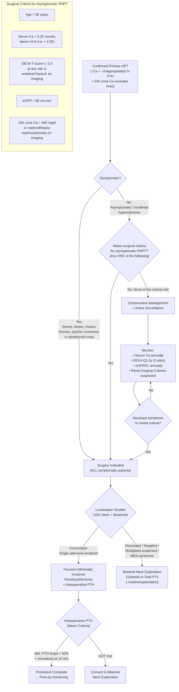

## Management of Hyperparathyroidism

The management of hyperparathyroidism depends fundamentally on **which type** you are dealing with (primary, secondary, or tertiary), **whether the patient is symptomatic**, and **whether they meet criteria for surgical intervention**. Surgery is the only curative option for primary HPT, but the decision of *when* to operate — especially in asymptomatic patients — is one of the most commonly tested topics.

---

### 1. Overview Management Algorithm — Primary Hyperparathyroidism

---

### 2. Indications for Surgery — Primary HPT

This is one of the highest-yield topics. Surgery (parathyroidectomy) is the **only curative treatment** for primary HPT with a cure rate of ***~95–98%*** [3].

#### 2.1 Absolute Indications (Surgery Recommended)

***ALL symptomatic patients*** should be offered surgery [1][3][13]:
- Symptomatic renal stones / nephrocalcinosis
- Bone disease (pathological fractures, osteitis fibrosa cystica)
- Severe hypercalcemia symptoms (psychic overtones, recurrent pancreatitis, etc.)
- **Parathyroid crisis** (severe, life-threatening hypercalcemia)
- **Parathyroid carcinoma** (suspected or confirmed)

#### 2.2 Indications for Surgery in Asymptomatic Primary HPT

The guidelines for operating on *asymptomatic* patients have been refined through several International Workshops. The most current criteria (5th International Workshop 2022, building on JCEM 2014) [3][13]:

***Surgery is indicated if ANY ONE of the following is present:***

| Criterion | Threshold | Rationale (Why this criterion) |
|:----------|:----------|:-------------------------------|
| ***Age*** | *** < 50 years*** | Younger patients have longer lifetime exposure to PTH excess → cumulative bone loss, renal damage, and cardiovascular risk. Also, monitoring compliance over decades is difficult [1][3] |
| ***Serum calcium*** | ***Corrected Ca > 0.25 mmol/L (1 mg/dL) above ULN*** (i.e., > 2.85 mmol/L if ULN is 2.60) | Higher calcium = higher complication risk. The degree of hypercalcemia correlates with symptom severity and end-organ damage [3][13] |
| ***Skeletal*** | ***DEXA T-score ≤ −2.5 at lumbar spine, total hip, femoral neck, OR distal 1/3 radius; OR vertebral fracture on imaging*** (XR, CT, MRI, VFA) | Significant bone disease indicates PTH is causing material harm even if the patient feels fine [1][3] |
| ***Renal*** | ***eGFR < 60 mL/min; OR 24h urine Ca > 400 mg/d (10 mmol/d) + ↑ biochemical stone risk; OR nephrolithiasis/nephrocalcinosis on imaging*** (XR, USG, CT) | Renal complications indicate end-organ damage that will worsen without intervention [1][3][13] |

<Callout title="Mnemonic: CASR for Surgical Criteria in Asymptomatic PHPT" type="idea">
***CASR*** (like the calcium-sensing receptor!) [1]:
- **C**alcium ≥ 2.8 mmol/L (or > 0.25 above ULN)
- **A**ge < 50
- **S**keletal (T-score ≤ −2.5 or vertebral fracture)
- **R**enal (eGFR < 60 / urine Ca > 10 mmol/d / stones on imaging)
</Callout>

#### 2.3 Additional Indications

| Indication | Rationale |
|:-----------|:---------|
| ***Persistent or recurrent primary HPT*** | Failed prior surgery → re-exploration needed [13] |
| ***Familial primary HPT*** (MEN1, MEN2A) | Multigland disease → surgery planned differently (bilateral exploration, cervical thymectomy) |
| ***Suspected parathyroid carcinoma*** | Must perform en-bloc resection (not simple adenoma excision) |
| ***Parathyroid crisis*** | Severe hypercalcemia (typically Ca > 3.5 mmol/L) with acute deterioration → medical stabilization then urgent surgery |
| **Patient preference** | Some informed patients with asymptomatic PHPT who do not meet criteria may still opt for surgery rather than lifelong monitoring |

#### 2.4 Contraindications to Surgery

| Contraindication | Explanation |
|:----------------|:-----------|
| ***Known contralateral recurrent laryngeal nerve (RLN) injury*** | If the patient already has a unilateral RLN palsy (e.g., from prior thyroid surgery), operating on the other side risks ***bilateral RLN injury → bilateral vocal cord paralysis → airway compromise*** requiring emergent tracheostomy. This is a life-threatening complication [13] |
| **Severe comorbidities making patient unfit for GA/surgery** | e.g., severe heart failure, advanced malignancy, severe COPD — risks of surgery outweigh benefits |
| **Symptomatic cervical disc disease** | Relative contraindication — neck extension required during surgery may be poorly tolerated [13] |
| ***Familial hypocalciuric hypercalcemia (FHH)*** | ***Surgical intervention does NOT result in cure*** because the defect is in the CaSR, not the parathyroid glands. The patient does not have primary HPT [13] |

---

### 3. Surgical Treatment Options

#### 3.1 Focused (Minimally Invasive) Parathyroidectomy

This is the **preferred approach** when localization studies identify a single adenoma:

| Aspect | Detail |
|:-------|:-------|
| ***Indication*** | ***Adenoma identified on pre-operative localization studies*** (concordant USG + Sestamibi) [1] |
| **Premise** | Based on the fact that ***~80–85% of primary HPT is caused by a solitary adenoma*** [1] |
| **Approach** | ***Open with < 3 cm incision***, video-assisted, or imaging-guided (gamma probe if Sestamibi given pre-op) [1] |
| **Anaesthesia** | Can be performed under local/regional anaesthesia (cervical block) or GA |
| ***Intraoperative PTH monitoring*** | ***REQUIRED*** — takes advantage of PTH's ***short half-life (~3–5 minutes)*** [13] |
| ***Miami criteria*** | ***PTH drops > 50% from the highest pre-excision value AND returns to normal range at 10 minutes post-resection*** [1][3] |
| **If Miami criteria NOT met** | Suspect ***multigland disease*** → ***convert to bilateral neck exploration*** [1] |
| ***Benefits*** | ***↓ operative time, ↓ dissection, ↓ cost, smaller incision, ↓ post-operative hypocalcemia, equal success rate*** compared with bilateral exploration [13] |
| **Cure rate** | ***~98%*** [3] |
| **Nerve injury rate** | *** < 1%*** [3] |

#### 3.2 Bilateral Neck Exploration (BCE)

| Aspect | Detail |
|:-------|:-------|
| ***Indications*** | ***Conversion from focused parathyroidectomy*** (Miami criteria not met); ***MEN1/MEN2A*** (known multigland disease); ***uncertain or discordant imaging*** (e.g., USG not consistent with Sestamibi findings); negative localization studies; suspected double adenomas [1] |
| **Approach** | ***Kocher's incision*** (transverse collar incision in a skin crease ~2 cm above the sternal notch) — the same incision used for thyroidectomy |
| **Procedure** | All four parathyroid glands are identified and assessed. The strategy depends on the pathology found: |

##### 3.2.1 Options During Bilateral Exploration

**a) Subtotal Parathyroidectomy ("3.5 gland resection")**

This is the standard approach for **multigland hyperplasia** (e.g., MEN1, MEN2A, 4-gland hyperplasia):

- ***3 glands are completely resected***
- ***Fourth gland: half is excised and sent for frozen section*** (to confirm it is parathyroid tissue) [1]
- ***The remaining half-gland is left in situ***, with its blood supply preserved
- ***Marked with non-absorbable sutures*** to aid identification if re-operation is needed in the future [1]
- **Goal**: preserve ~50–80 mg of vascularized parathyroid tissue to maintain calcium homeostasis while removing most of the hyperfunctioning tissue

**b) Total Parathyroidectomy with Autotransplantation**

| Aspect | Detail |
|:-------|:-------|
| **When used** | Rare; primarily in tertiary HPT or severe multigland disease where subtotal resection is insufficient; when renal transplant is highly unlikely |
| **Procedure** | All 4 glands are removed entirely. Small fragments of parathyroid tissue (~60 mg) are ***immediately autotransplanted*** into a muscle pocket |
| ***Transplant sites*** | ***Forearm (brachioradialis muscle)*** — preferred because it provides easy access for future excision if the graft becomes hyperplastic. Alternatively, ***neck (sternocleidomastoid muscle)*** [1] |
| **Cryopreservation** | Additional parathyroid tissue may be cryopreserved for ***delayed autotransplantation*** if the initial graft fails [3] |
| **Verification of graft function** | After ~6 weeks, a PTH gradient between the transplant arm and the contralateral arm can confirm graft function |

**c) Cervical Thymectomy**

- ***Indicated if MEN1*** — to resect ***supernumerary parathyroid glands*** that may be located within the thymus [1]
- The inferior parathyroid glands embryologically develop from the 3rd pharyngeal pouch along with the thymus → ectopic supernumerary glands are commonly intrathymic
- A transcervical thymectomy (removing the cervical horns of the thymus through the neck incision) is performed at the time of parathyroidectomy

#### 3.3 Management of Parathyroid Carcinoma

| Aspect | Detail |
|:-------|:-------|
| **Suspicion clues** | Very high Ca ( > 3.5 mmol/L), palpable neck mass, very high PTH ( > 5–10× ULN), hoarseness (RLN invasion) |
| **Surgical approach** | ***En-bloc resection***: removal of the parathyroid tumour with the ipsilateral thyroid lobe, surrounding soft tissue, and any involved structures. Simple enucleation must be avoided (→ tumour spillage → recurrence) |
| **Adjuvant** | No proven effective adjuvant therapy (neither RT nor chemo is highly effective). Cinacalcet and denosumab may help control hypercalcemia |
| **Prognosis** | Variable; 5-year survival ~85% if R0 resection; recurrence is common |

---

### 4. Medical Management — Primary HPT

Medical therapy is **NOT curative** but is used when surgery is contraindicated or declined:

#### 4.1 Indications for Medical/Conservative Management [1][3]

- **Surgically unfit patients** (severe comorbidities, high anaesthetic risk)
- **Patient declines surgery**
- **Asymptomatic primary HPT not meeting surgical criteria**

#### 4.2 Medical Treatment Options

| Agent | Mechanism | Effect | Indication |
|:------|:---------|:-------|:-----------|
| ***Cinacalcet*** ("calci-mimetic" = "calcium-mimic") | ***Allosteric agonist of the CaSR*** → mimics the action of calcium on the receptor → ***↓ PTH secretion*** from parathyroid cells [3][13] | ***Effective in ↓/normalizing serum Ca***; less consistent effect on PTH levels; ***no proven benefit on BMD*** [3] | ***Patients in whom parathyroidectomy is indicated but surgery is contraindicated*** [3][13] |
| **Bisphosphonates** (e.g., alendronate) | Inhibit osteoclast-mediated bone resorption by binding to hydroxyapatite in bone → taken up by osteoclasts → induce apoptosis | ↑ BMD (especially at spine and hip); minimal effect on serum Ca | Patients with osteoporosis who cannot undergo surgery |
| **Denosumab** (RANKL inhibitor) | Monoclonal antibody against RANKL → prevents RANK-RANKL interaction → ↓ osteoclast formation and activity | ↑ BMD; ↓ serum Ca | Alternative to bisphosphonates; useful in renal impairment (bisphosphonates are contraindicated in severe CKD) |
| **SERMs** (e.g., raloxifene) | Selective estrogen receptor modulators → estrogen-like effects on bone → ↓ bone resorption | ↑ BMD at some sites | Postmenopausal women with primary HPT and osteoporosis |
| **HRT** (hormone replacement therapy) | Estrogen replacement → ↓ bone resorption | ↑ BMD; modest ↓ serum Ca | Postmenopausal women (limited use due to risk profile) |

<Callout title="Cinacalcet: Important Limitations" type="error">
Cinacalcet is very effective at lowering calcium, but it does NOT address the underlying bone disease — BMD does not consistently improve. It also does not reduce stone risk or reverse other complications. Therefore, it is a **temporizing measure**, not a cure. Surgery remains the definitive treatment whenever possible. [3]
</Callout>

#### 4.3 Conservative Monitoring Protocol (Asymptomatic PHPT Not Meeting Surgical Criteria)

***Regular monitoring is essential*** because disease can progress [3]:

| Parameter | Frequency | Purpose |
|:----------|:----------|:--------|
| ***Serum calcium*** | ***Annually*** | Detect worsening hypercalcemia |
| ***DEXA at 3 sites*** | ***Every 1–2 years*** (lumbar spine, hip, distal 1/3 radius) | Detect progressive bone loss |
| **Vertebral imaging** (XR/VFA) | If clinically indicated (height loss, back pain) | Detect subclinical vertebral fractures |
| ***eGFR/Creatinine*** | ***Annually*** | Detect renal deterioration |
| ***Renal imaging*** (USG/XR/CT) | If stones suspected (new flank pain, haematuria) | Detect new nephrolithiasis/nephrocalcinosis |
| **24h urine biochemical stone profile** | If stone risk assessment needed | Document hypercalciuria / stone risk |

**General advice for conservatively managed patients:**
- **Adequate hydration** (≥ 1.5–2 L/day) — to reduce stone risk and prevent dehydration-related worsening of hypercalcemia
- **Avoid dehydration triggers** (excess diuretics, hot weather without fluid replacement)
- **Moderate calcium intake** (~1000 mg/day) — do NOT restrict calcium excessively (paradoxically worsens PTH secretion)
- **Correct vitamin D deficiency** cautiously (maintain 25-OH-D > 50 nmol/L) — low vitamin D worsens PTH elevation and bone disease
- **Avoid thiazides** (reduce renal calcium excretion → worsen hypercalcemia)
- **Avoid lithium** if possible (shifts CaSR set point)

---

### 5. Acute Management — Severe Hypercalcemia / Parathyroid Crisis

When a patient presents with severe hypercalcemia (typically Ca > 3.5 mmol/L) — often called **hypercalcemic crisis** — this is a medical emergency requiring rapid treatment before definitive surgery [3b]:

***Aims: (1) rapid control of severe hypercalcemia, (2) early diagnosis of cause*** [3b]

#### Step-by-Step Emergency Management:

| Step | Treatment | Mechanism | Details |
|:-----|:---------|:----------|:--------|
| **1. Remove precipitants** | ***Stop offending drugs*** | Remove exacerbating factors | ***Calcium supplements, vitamin D, thiazides, lithium, ranitidine*** [3b] |
| **2. Volume resuscitation** | ***Normal saline (NS) rehydration*** at ***100–500 mL/h*** | Restores intravascular volume → ↑ GFR → ↑ renal calcium excretion. In the PCT and loop of Henle, Na and Ca reabsorption are coupled — rehydration ↓ Na reabsorption → ↓ Ca reabsorption [3b] | Target ***euvolemia*** (estimated 3–4 L/day). Guided by urine output and CVP. Most hypercalcemic patients are severely dehydrated from polyuria + poor oral intake |
| **3. Loop diuretic** | ***Furosemide 20–40 mg IV Q4–12h*** | ↑ urinary calcium excretion by blocking the Na-K-2Cl cotransporter in the loop of Henle → ↓ lumen-positive voltage → ↓ paracellular Ca reabsorption | ***ONLY after adequate rehydration*** — giving loop diuretics to a dehydrated patient worsens volume depletion and can precipitate renal failure [3b]. Monitor UO (~200 mL/h target), Na, K, Ca, Mg |
| **4. Bisphosphonate** | ***IV pamidronate 30–90 mg*** in 250–500 mL NS over 4–6h; OR ***IV zoledronate 4 mg*** over 15 min | ↓ osteoclast-mediated bone resorption → ↓ calcium release from bone | ***Pamidronate***: max effect in several days; ***do NOT repeat before 7 days***. ***Zoledronate***: max effect at 72h [3b]. Caution in renal impairment: pamidronate C/I if eGFR < 30, renal dose adjustment if eGFR < 60 |
| **5. Calcitonin** | ***Salmon calcitonin 4 U/kg IM/SC Q12h*** | ↓ osteoclast activity + ↑ renal Ca excretion → ↓ serum Ca | ***Rapid onset (2–3 hours)*** — bridges the gap while waiting for bisphosphonate to take effect. ***BUT tachyphylaxis develops within 2–3 days*** → effect wanes [3b]. Given together with bisphosphonate initially |
| **6. Other agents** | ***Denosumab*** (if renal impairment precludes bisphosphonates); ***Cinacalcet*** (calcimimetic); ***Corticosteroids*** (hydrocortisone 50 mg IV Q8h) for granulomatous disease / lymphoma / vitamin D intoxication; ***Haemodialysis*** with zero/low-Ca dialysate as last resort [3b] | Various mechanisms | Denosumab especially useful in CKD (does not require renal clearance). Corticosteroids: onset 3–5 days, reduce 1α-hydroxylase activity in granulomas |

| | Pamidronate | Calcitonin |
|:-----|:-----------|:-----------|
| ***Action*** | ***More potent, commonly used. Slow onset (days). Do NOT repeat before 7 days. Long-lasting effect (~2–4 weeks*** [3b] | ***Rapid onset (2–3h). Tachyphylaxis in 2–3 days → given together with bisphosphonate initially*** [3b] |
| ***Precaution*** | ***↓ eGFR: C/I if < 30, renal dosing if < 60*** [3b] | Minimal renal concerns |

---

### 6. Management of Secondary Hyperparathyroidism (CKD-Related)

The goal is to **treat the underlying cause** and **suppress PTH to an appropriate range** while avoiding complications of over-treatment (adynamic bone disease):

#### 6.1 Stepwise Approach (KDIGO Guidelines)

| Step | Intervention | Mechanism | Target |
|:-----|:------------|:----------|:-------|
| **1. Phosphate control** | **Low phosphate diet** (800–1000 mg/day); **Phosphate binders** with meals (e.g., calcium carbonate/acetate, sevelamer, lanthanum) | ↓ gut PO₄ absorption → ↓ serum PO₄ → removes stimulus for PTH secretion + ↓ Ca×PO₄ product → ↓ metastatic calcification | Serum PO₄ toward normal range |
| **2. Vitamin D supplementation** | **Nutritional vitamin D** (cholecalciferol/ergocalciferol) if 25-OH-D < 30 ng/mL; **Active vitamin D** (calcitriol or alfacalcidol) in advanced CKD | Nutritional vit D: replenish substrate. Active vit D: bypasses impaired 1α-hydroxylase → ↑ Ca absorption, direct suppression of PTH gene transcription | 25-OH-D > 30 ng/mL; PTH in target range for CKD stage |
| **3. Calcimimetics** | **Cinacalcet** | Allosteric CaSR agonist → ↓ PTH secretion | CKD 3–5D with PTH above target despite phosphate control and vitamin D |
| **4. Dialysis optimization** | Appropriate dialysate Ca concentration | Adjust Ca influx/efflux during dialysis | Avoid hypercalcemia and hypocalcemia |
| **5. Surgery** (if refractory) | Subtotal parathyroidectomy or total parathyroidectomy with autotransplantation | Remove autonomously hyperplastic glands | Indicated when medical therapy fails (severe, refractory HPT with progressive bone disease, calciphylaxis, or intractable symptoms) |

---

### 7. Management of Tertiary Hyperparathyroidism

***Definition: persistent autonomous hypercalcemic hyperparathyroidism after renal replacement therapy*** [1]

#### 7.1 Indications for Surgery in Tertiary HPT [1]

- ***Persistent severe hypercalcemia***
- ***Impaired graft function*** (in post-transplant patients — hypercalcemia can damage the transplanted kidney)
- ***Progressive symptoms*** (e.g., osteoporotic fractures, nephrolithiasis in transplanted kidney, calciphylaxis)

#### 7.2 Surgical Options [1]

| Procedure | When to Use | Details |
|:----------|:-----------|:--------|
| ***Total parathyroidectomy*** | ***Only when renal transplant is highly unlikely*** (i.e., patient will remain on dialysis indefinitely) | Removes all glands → patient becomes permanently hypoparathyroid → requires lifelong calcium and vitamin D |
| ***Total parathyroidectomy with autotransplantation*** | Standard approach | All glands removed; ***parathyroid fragments transplanted to forearm (brachioradialis)*** or ***neck (SCM)*** for easy access if future regrowth [1] |
| ***Subtotal parathyroidectomy ("3.5 resection")*** | Alternative approach | Same as for primary HPT multigland disease — 3 glands removed, half of 4th preserved in situ |

#### 7.3 Medical Management (Temporizing)

- **Cinacalcet**: can reduce calcium while awaiting surgery or in non-surgical candidates
- **Bisphosphonates**: if significant bone disease (but caution with renal function)

---

### 8. Post-operative Management and Monitoring

#### 8.1 Immediate Post-operative Care

| Action | Timing | Rationale |
|:-------|:-------|:---------|
| ***Check serum calcium*** | ***Post-op Day 1*** (and serially Q6–12h if high-risk for hungry bone syndrome) [1] | Detect post-op hypocalcemia — the most common early complication |
| **Monitor for hypocalcemia symptoms** | Continuous for 24–48h | Perioral tingling, paraesthesia, Trousseau/Chvostek signs, tetany |
| **Check Mg and PO₄** | Post-op Day 1 | May also drop in hungry bone syndrome |
| **Voice assessment** | Post-op and before discharge | Screen for RLN injury → hoarseness |
| **Neck observation** | First 6–12h | Reactionary haemorrhage → neck haematoma → airway compromise |

#### 8.2 Management of Post-operative Hypocalcemia

| Severity | Treatment |
|:---------|:---------|
| **Mild / asymptomatic** | Oral calcium carbonate (1–3 g/day in divided doses) ± oral calcitriol (0.25–0.5 μg BD) |
| **Symptomatic (tetany, prolonged QTc)** | ***IV calcium gluconate 10–20 mL of 10% solution over 10 minutes (slow bolus)*** [13b], followed by continuous infusion if needed. Switch to oral when stable |
| ***Hungry bone syndrome*** | ***Severe and prolonged hypocalcemia*** despite normal/elevated PTH → aggressive IV and oral calcium + calcitriol + magnesium. May require high-dose calcium for weeks. ***Predicted by pre-op ↑ ALP*** [1] |

<Callout title="Hungry Bone Syndrome — Understanding the Mechanism">
***Hungry bone syndrome = severe and prolonged hypocalcemia despite normal or even elevated levels of PTH*** [13b]. It is ***exacerbated by suppressed remaining PTH levels*** and ***associated with hypophosphatemia and hypomagnesemia*** [13b].

**Pathogenesis**: After parathyroidectomy, the ***sudden removal of high circulating PTH*** causes the previously over-stimulated osteoclasts to cease resorbing bone. However, osteoblasts — which had been activated by chronic PTH — continue to form bone avidly. This creates a massive net influx of calcium, phosphate, and magnesium into the "hungry" skeleton. The result is profound, prolonged hypocalcemia that can be life-threatening.

**Risk factors**: Pre-op ↑ ALP (indicates high bone turnover), large adenoma, severe/prolonged hyperparathyroidism, older age, vitamin D deficiency. [1][13b]
</Callout>

#### 8.3 Long-term Follow-up

| Complication / Outcome | Definition | Management |
|:----------------------|:-----------|:-----------|
| **Cure** | Normocalcemia for > 6 months post-op | Routine follow-up; may discharge if stable |
| ***Persistent hyperparathyroidism*** | ***Hypercalcemia < 6 months post-op*** | ***Due to missed pathology*** at initial surgery → re-localization studies → ***bilateral neck exploration*** [1] |
| ***Recurrent hyperparathyroidism*** | ***Hypercalcemia > 6 months post-op*** (after initial normocalcemia) | Due to ***missed pathology, regrowth of remnant, or parathyromatosis*** (disseminated parathyroid tissue in the neck/mediastinum soft tissues from ***rupture of parathyroid gland during the initial operation***) → Sestamibi scan → bilateral exploration [1] |
| ***Permanent hypoparathyroidism*** | Requiring ***calcium/vitamin D supplementation ≥ 1 year post-op*** [1] | Lifelong oral calcium + calcitriol. Monitor for complications (nephrocalcinosis from calcitriol, cataracts, basal ganglia calcification) |

---

### 9. Special Situations

#### 9.1 Hyperparathyroidism in Pregnancy

- Primary HPT in pregnancy can cause neonatal hypocalcemia (maternal hypercalcemia suppresses fetal parathyroids) and other complications (miscarriage, pre-eclampsia)
- **Mild**: conservative management with hydration and monitoring
- **Severe or symptomatic**: surgery in the **2nd trimester** (safest period for anaesthesia)
- Bisphosphonates, cinacalcet, and calcitonin are generally avoided or used with extreme caution

#### 9.2 Lithium-Associated Hyperparathyroidism

- ***Lithium causes hyperparathyroidism and hypercalcemia*** by shifting the CaSR set point [16]
- First step: if clinically safe, ***stop lithium and re-evaluate calcium/PTH after washout***
- If hypercalcemia persists after lithium cessation → true primary HPT has developed (lithium may have triggered adenoma formation)
- If lithium cannot be discontinued → manage as primary HPT; cinacalcet can be used as a bridge; surgery if criteria met

#### 9.3 CPPD Disease Secondary to HPT

- ***Correction of underlying hyperparathyroidism*** is part of the management of CPPD disease [5]
- However, existing chondrocalcinosis may not resolve after parathyroidectomy
- Acute pseudogout attacks: manage as per standard CPPD guidelines (joint aspiration, intra-articular steroids, NSAIDs, colchicine)

---

### 10. Summary of Management by Type

| | Primary HPT | Secondary HPT | Tertiary HPT |
|:---|:-----------|:-------------|:-------------|
| **Definitive Rx** | Parathyroidectomy | Treat underlying cause (CKD management, vitamin D) | Parathyroidectomy |
| **Surgical approach** | Focused PTx (single adenoma) or BCE (multigland) | Surgery only if refractory | Subtotal PTx or Total PTx + autotransplant |
| **Medical Rx** | Cinacalcet, bisphosphonates (if unfit for surgery) | Phosphate binders, vitamin D, cinacalcet, dialysis | Cinacalcet (temporizing) |
| **Monitoring (if conservative)** | Annual Ca, DEXA Q1–2y, annual eGFR, renal imaging PRN | Per KDIGO guidelines (frequent PTH, Ca, PO₄, vitamin D) | Usually proceed to surgery |

---

<Callout title="High Yield Summary — Management">

1. **Surgery is the ONLY cure for primary HPT**. Cure rate ~95–98%.

2. **All symptomatic patients** should undergo parathyroidectomy.

3. **Asymptomatic PHPT surgical criteria (CASR mnemonic)**: ***Ca ≥ 2.85 (> 0.25 above ULN); Age < 50; Skeletal (T-score ≤ −2.5 or vertebral fracture); Renal (eGFR < 60, urine Ca > 400 mg/d, or stones/nephrocalcinosis on imaging)***. Any ONE criterion met = operate.

4. **Focused parathyroidectomy**: for localized single adenoma. Requires pre-op localization (USG + Sestamibi) + intraoperative PTH (Miami criteria: > 50% drop + normalize at 10 min). If criteria not met → convert to bilateral exploration.

5. **Bilateral exploration**: for MEN syndromes, discordant imaging, multigland disease. Subtotal (3.5 gland) or total parathyroidectomy ± autotransplantation.

6. ***Cervical thymectomy***: add for MEN1 (supernumerary intrathymic glands).

7. **Medical options** (if surgery C/I): cinacalcet (↓ Ca but no BMD benefit), bisphosphonates/denosumab (↑ BMD), SERMs.

8. **Contraindications to surgery**: contralateral RLN injury, FHH, surgically unfit.

9. **Post-op**: Check Ca on Day 1. Watch for hungry bone syndrome (predicted by ↑ pre-op ALP) — treat with aggressive Ca + calcitriol + Mg. Permanent hypoparathyroidism = needing supplements ≥ 1 year.

10. **Severe hypercalcemia emergency**: Rehydrate (NS) → loop diuretic (AFTER rehydration) → calcitonin (rapid, tachyphylaxis in 2–3d) + bisphosphonate (slow onset, lasts weeks) → cinacalcet/denosumab/steroids/dialysis for refractory cases.

</Callout>

---

<ActiveRecallQuiz
  title="Active Recall - Management of Hyperparathyroidism"
  items={[
    {
      question: "List the surgical criteria for parathyroidectomy in asymptomatic primary HPT using the CASR mnemonic. State the specific thresholds for each criterion.",
      markscheme: "CASR: C = Calcium greater than 0.25 mmol/L above ULN (i.e., greater than 2.85 mmol/L); A = Age less than 50; S = Skeletal: DEXA T-score at or below -2.5 at any site (lumbar spine, hip, femoral neck, distal 1/3 radius) OR vertebral fracture on imaging; R = Renal: eGFR less than 60 mL/min OR 24h urine Ca greater than 400 mg/d with increased stone risk OR nephrolithiasis/nephrocalcinosis on imaging. Any ONE criterion met indicates surgery.",
    },
    {
      question: "A surgeon is performing a focused parathyroidectomy. Describe the Miami criteria for intraoperative PTH monitoring and explain what should be done if the criteria are NOT met.",
      markscheme: "Miami criteria: intraoperative PTH must drop by more than 50% from the highest pre-excision value AND return to the normal range at 10 minutes post-resection. This works because PTH half-life is only 3-5 minutes. If criteria NOT met, suspect multigland disease (double adenoma or hyperplasia) and convert to bilateral neck exploration.",
    },
    {
      question: "In the emergency management of severe hypercalcemia, explain why loop diuretics must only be given AFTER adequate rehydration, and describe the stepwise treatment protocol.",
      markscheme: "Loop diuretics increase urinary calcium excretion by blocking Na-K-2Cl cotransporter, but they also cause volume depletion. Giving furosemide to a dehydrated patient worsens hypovolemia, reduces GFR further, and can precipitate renal failure. Protocol: (1) Stop precipitants (Ca supplements, thiazides, vitamin D, lithium); (2) NS rehydration 100-500 mL/h until euvolemic; (3) Loop diuretic only after rehydration; (4) Calcitonin for rapid onset (2-3h, tachyphylaxis in 2-3d); (5) IV bisphosphonate (pamidronate or zoledronate) for sustained effect (days, lasting weeks); (6) Other agents as needed (denosumab, cinacalcet, steroids, dialysis).",
    },
    {
      question: "Explain the pathogenesis of hungry bone syndrome, identify its key risk factor, and describe its biochemical profile and treatment.",
      markscheme: "After parathyroidectomy, sudden removal of high PTH causes osteoclasts to cease resorbing bone while osteoblasts (previously stimulated by chronic PTH) continue avidly forming bone. This creates massive net calcium, phosphate, and magnesium influx into the skeleton. Key risk factor: elevated pre-operative ALP (indicating high bone turnover). Biochemical profile: severe prolonged hypocalcemia, hypophosphatemia, and hypomagnesemia despite normal/elevated PTH. Treatment: aggressive IV calcium gluconate, high-dose oral calcium, calcitriol (active vitamin D), magnesium supplementation. May require weeks of treatment.",
    },
    {
      question: "Compare focused parathyroidectomy and bilateral neck exploration in terms of indications, approach, and when cervical thymectomy should be added.",
      markscheme: "Focused parathyroidectomy: indicated when single adenoma identified on concordant pre-op localization (USG + Sestamibi); small incision (less than 3 cm), requires intraoperative PTH monitoring; lower complication rate, equal cure rate. Bilateral neck exploration: indicated for MEN1/2A, discordant imaging, conversion from focused (failed Miami criteria), negative localization; Kocher incision; subtotal (3.5 gland) or total parathyroidectomy with autotransplantation. Cervical thymectomy should be added in MEN1 to resect supernumerary intrathymic parathyroid glands.",
    },
    {
      question: "A patient with primary HPT is deemed surgically unfit. What medical treatment options are available and what are their respective effects on calcium and BMD?",
      markscheme: "Cinacalcet (calcimimetic, CaSR agonist): effectively lowers/normalizes serum calcium but has no consistent benefit on BMD. Bisphosphonates (e.g., alendronate): increase BMD but minimal effect on serum calcium. Denosumab (RANKL inhibitor): increases BMD and lowers calcium; useful in renal impairment where bisphosphonates are contraindicated. SERMs (e.g., raloxifene): increase BMD at some sites; for postmenopausal women. None of these are curative.",
    },
  ]}
/>

## References

[1] Senior notes: maxim.md (Primary hyperparathyroidism — Management section; Tertiary hyperparathyroidism section)
[3] Senior notes: Ryan Ho Endocrine.pdf (p42-43, Primary Hyperparathyroidism — Surgical treatment, Conservative Tx)
[3b] Senior notes: Ryan Ho Endocrine.pdf (p41, Management of Severe Hypercalcemia)
[5] Senior notes: Ryan Ho Rheumatology.pdf (p42, CPPD Disease — Management)
[13] Senior notes: felixlai.md (Treatment section, p1021-1025; Localization studies, p1016-1020)
[13b] Senior notes: felixlai.md (Hungry bone syndrome, p1011)
[16] Senior notes: Ryan Ho Psychiatry.pdf (p53, Lithium — Unwanted effects, Hyperparathyroidism)
