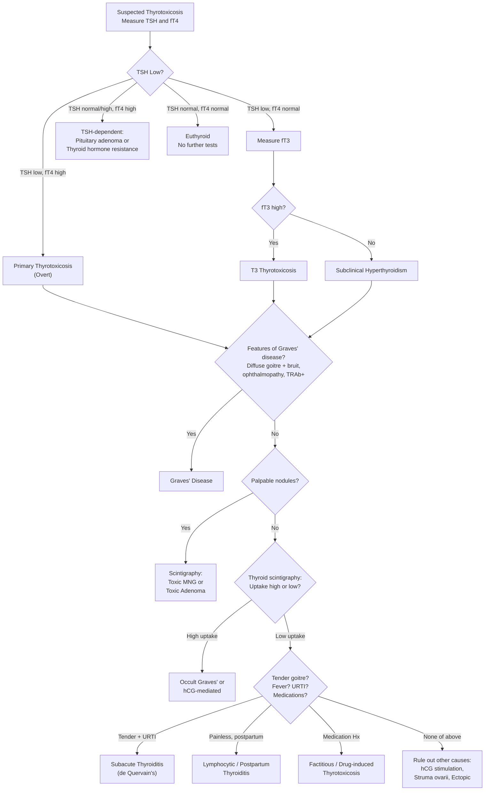
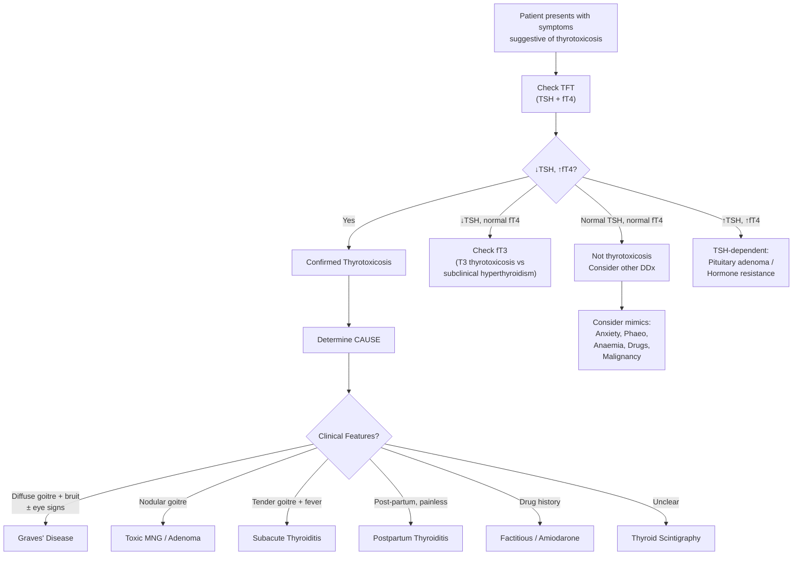

## Differential Diagnosis of Hyperthyroidism / Thyrotoxicosis

Before we can diagnose and manage hyperthyroidism, we need to think systematically about what *else* could explain the presenting complaints. The differential diagnosis operates at **two levels**:

1. **What is causing the thyrotoxicosis?** (i.e., differentiating among the various aetiologies of thyrotoxicosis itself)
2. **What else could mimic thyrotoxicosis?** (i.e., conditions that share overlapping clinical features but are NOT thyrotoxicosis)

Let me walk you through both, because an exam question can test either angle.

---

## 1. Differential Diagnosis AMONG Causes of Thyrotoxicosis

This is the most clinically important differential — once you've confirmed biochemical thyrotoxicosis (↓TSH, ↑fT4/T3), you must determine **why**. The approach hinges on a simple framework:

> **Is the thyroid gland overactive (true hyperthyroidism) or not (thyrotoxicosis without hyperthyroidism)?**

The single best investigation to resolve this is ***thyroid scintigraphy*** — it tells you whether the gland is avidly trapping iodine (overactive) or not [5][6].

### 1.1 Systematic Aetiological Differential

| Category | Condition | Key Differentiating Clinical Clue | Scintigraphy Pattern | TFT Pattern |
|---|---|---|---|---|
| **Diffuse overactivity** | ***Graves' disease*** | ***Diffuse goitre + bruit***, ophthalmopathy, pretibial myxoedema, young F [1] | ***Diffuse ↑uptake*** | ↓TSH, ↑fT4, ↑T3 |
| **Nodular overactivity** | ***Toxic MNG*** | ***Palpable nodules***, elderly, long-standing goitre [2][7] | Patchy ↑uptake, multiple hot/cold areas | ↓TSH, ↑fT4 |
| | ***Toxic adenoma*** | ***Solitary nodule***, middle-aged [7] | Single hot nodule, suppressed surrounding gland | ↓TSH, ↑fT4 |
| **Destructive thyroiditis** | ***Subacute (de Quervain's) thyroiditis*** | ***Recent URTI, fever, tender goitre***, ↑ESR [1][2] | ***↓uptake (globally)*** | ↓TSH, ↑fT4 (thyrotoxic phase) |
| | ***Subacute lymphocytic / Postpartum thyroiditis*** | ***Painless***, ***recent pregnancy ( < 6 months)***, self-limiting [1] | ↓uptake | ↓TSH, ↑fT4 |
| | Hashitoxicosis | Firm rubbery goitre, strongly +ve anti-TPO, trajectory towards hypothyroidism [1] | Variable (↑ early, then ↓) | ↓TSH, ↑fT4 |
| **Exogenous / Factitious** | ***Factitious thyrotoxicosis*** | ***Intake of medications, esp slimming pills*** [2], no goitre, low thyroglobulin | ↓uptake, atrophic gland | ↓TSH, ↑fT4 |
| **Drug-induced** | Amiodarone-induced thyrotoxicosis | Amiodarone use; Type 1 (Jod-Basedow, underlying thyroid disease) vs Type 2 (destructive) | Type 1: ↑/N uptake; Type 2: ↓uptake | ↓TSH, ↑fT4 |
| | Iodine-induced (Jod-Basedow) | Recent iodine load (contrast, supplements) in patient with pre-existing nodular disease | ↓uptake (iodine pool already saturated) | ↓TSH, ↑fT4 |
| **hCG-mediated** | Gestational thyrotoxicosis / Hydatidiform mole / Choriocarcinoma | ***Hydatidiform mole may secrete large amounts of hCG, which mimics the structure of TSH*** [2]; pregnancy, hyperemesis gravidarum, very high β-hCG | ↑uptake (gland is being stimulated) | ↓TSH, ↑fT4 |
| **TSH-dependent** | ***TSH-secreting pituitary adenoma*** | ***↑TSH ↑T3 ↑fT4*** (TSH-dependent hyperthyroidism — very rare) [1][2]; headache, visual field defects | ↑uptake (TSH-driven) | ↑TSH, ↑fT4 |
| | Thyroid hormone resistance | Similar biochemical pattern but usually clinically euthyroid; familial | Variable | ↑TSH, ↑fT4 |

<Callout title="The Three Questions That Differentiate Causes" type="idea">
When you have confirmed thyrotoxicosis biochemically, ask yourself:

1. **Is there a goitre? What type?** Diffuse (Graves') vs nodular (toxic MNG/adenoma) vs tender (thyroiditis) vs absent (factitious, ectopic)
2. **Is radioiodine uptake high or low?** High = gland overactive; Low = destructive/exogenous
3. **Are there any extra-thyroidal features?** Ophthalmopathy/pretibial myxoedema = Graves'; Pregnancy = gestational/mole; Medications = factitious/amiodarone
</Callout>

### 1.2 Clinical Decision Algorithm

The following algorithm integrates the ***diagnostic protocol for evaluation of thyrotoxicosis*** [6]:

***Key decision points from the diagnostic protocol*** [6]:
- ***Measure TSH, unbound T4*** as the initial step
- ***If TSH low and fT4 normal → measure fT3*** (to catch T3 thyrotoxicosis or subclinical hyperthyroidism)
- ***If TSH normal/increased and fT4 high → TSH-secreting pituitary adenoma or thyroid hormone resistance syndrome***
- ***If primary thyrotoxicosis confirmed → ask "Features of Graves' disease?"***
- ***If no Graves' features → consider toxic nodular hyperthyroidism → if not → low radionuclide uptake → destructive thyroiditis, iodine excess, or excess thyroid hormone → if not → rule out other causes including stimulation by chorionic gonadotropin***

<Callout title="T3 Thyrotoxicosis — Don't Forget to Check T3" type="error">
In ~5% of thyrotoxic patients (especially early Graves' or toxic adenoma), fT4 may be **normal** while **T3 is elevated** — this is "T3 thyrotoxicosis." If you only check fT4, you will miss it. Always check T3 when TSH is suppressed but fT4 is normal.
</Callout>

### 1.3 Important Differentiating Features Between Major Causes

| Feature | Graves' Disease | Toxic MNG | Toxic Adenoma | Subacute Thyroiditis | Factitious |
|---|---|---|---|---|---|
| **Age** | 20–50y | >50y | 30–50y | Any (post-viral) | Any |
| **Goitre** | Diffuse, smooth, bruit | Irregular, multiple nodules | Solitary nodule | Diffuse, tender | No goitre (atrophic) |
| **Pain** | No | No | No | ***Yes (radiates to jaw/ears)*** [1] | No |
| **Eye signs (Graves'-specific)** | Proptosis, ophthalmoplegia | No | No | No | No |
| **Thyroid antibodies** | TRAb +ve | Usually −ve | Usually −ve | ***Low titres*** [1] | −ve |
| **Scintigraphy** | Diffuse ↑ | Patchy hot/cold | Single hot, rest suppressed | Globally ↓ | Globally ↓ |
| **Thyroglobulin** | ↑ or N | ↑ or N | ↑ or N | ↑ (follicular destruction) | ***↓ (suppressed gland)*** |
| **ESR** | Normal | Normal | Normal | ***↑↑↑*** | Normal |

---

## 2. Differential Diagnosis of Conditions MIMICKING Thyrotoxicosis

Many conditions share individual symptoms with thyrotoxicosis. In clinical practice (and exams), you need to consider these when a patient presents with the *symptom complex* rather than a confirmed biochemical diagnosis.

### 2.1 By Presenting Symptom

#### 2.1.1 Weight Loss Despite Good Appetite

| Condition | Why It Mimics | How to Differentiate |
|---|---|---|
| **Diabetes mellitus** | ↑appetite + weight loss (due to glycosuria and catabolism) [8] | Polyuria, polydipsia, ↑glucose; TFTs normal |
| **Malabsorption** (coeliac disease, chronic pancreatitis) | ↑appetite as compensation for nutrient loss | Steatorrhoea, bloating; TFTs normal |
| **Malignancy** (any) | Cachexia, but typically with ↓appetite | Anorexia, constitutional symptoms; TFTs normal |
| **Eating disorders** (anorexia nervosa in differential, though appetite ↓) | Weight loss, lanugo hair, bradycardia | ***Hyperthyroidism is a medical disorder that can mimic anorexia nervosa*** [10]; check TFTs |
| **Chronic infection** (TB, HIV) | Weight loss + sweats | Fever pattern, risk factors; TFTs normal |

#### 2.1.2 Palpitations / Tachycardia / Atrial Fibrillation

| Condition | Why It Mimics | How to Differentiate |
|---|---|---|
| **Primary cardiac arrhythmias** (e.g. lone AF, SSS, WPWS) | Palpitations, tachycardia | ECG characterisation; ***thyroid disease is a systemic/metabolic cause of arrhythmia*** [9]; always check TFTs in new AF |
| **Phaeochromocytoma** | Paroxysmal HTN, sweating, palpitations, tremor | Episodic (paroxysmal), severe HTN; 24h urine metanephrines |
| **Anxiety / Panic disorder** | Palpitations, tremor, sweating, heat intolerance | Situational, psychosocial triggers; TFTs normal |
| **Anaemia** | Tachycardia, palpitations, exertional dyspnoea | Pallor, ↓Hb; TFTs normal |
| **Drugs** (caffeine, sympathomimetics, salbutamol) | Tachycardia, tremor | Drug history; TFTs normal |

> Always check TFTs in **any patient presenting with new-onset atrial fibrillation** — thyrotoxicosis is a reversible cause.

#### 2.1.3 Tremor

| Condition | Key Differentiator |
|---|---|
| **Essential tremor** | Postural/action tremor, often familial, improves with alcohol; no thyrotoxic symptoms |
| **Parkinsonism** | Resting tremor (pill-rolling), bradykinesia, rigidity — opposite of thyrotoxic hyperkinesia |
| **Anxiety** | Fine tremor with situational/psychological trigger |
| **Drug-induced** (salbutamol, lithium, valproate) | Medication history |
| **Alcohol withdrawal** | Context of alcohol dependence, other features (delirium, seizures) |

#### 2.1.4 Proximal Myopathy / Muscle Weakness

| Condition | Key Differentiator |
|---|---|
| **Cushing's syndrome** | Proximal myopathy + central obesity, striae, moon face, ↑cortisol |
| **Polymyositis / Dermatomyositis** | Proximal weakness + ↑CK, skin rash (dermatomyositis) |
| **Vitamin D deficiency / Osteomalacia** | Proximal weakness + bone pain, ↓Ca, ↓PO4, ↑ALP |
| **Steroid myopathy** | Steroid use history |
| ***Thyrotoxic periodic paralysis*** | ***Episodic weakness***, hypoK during attacks, normal between attacks; ***precipitated by CHO load, rest after exercise*** [1] — must differentiate from **primary hypoK periodic paralysis** (familial, no thyrotoxic features, genetic CACNA1S) [11] |

#### 2.1.5 Neck Swelling / Goitre

This is a major clinical differential — ***the approach to thyroid nodules*** [7]:

| Diagnosis | Clinical Clue |
|---|---|
| ***Solitary nodule: dominant nodule in MNG, cyst, adenoma, toxic adenoma, carcinoma*** [7] | Solitary palpable lump; functional status varies |
| ***Multiple nodules: MNG, multiple cysts, multiple adenoma*** [7] | Multiple palpable nodules |
| ***Diffuse: Graves' disease, physiological (pregnancy, puberty), Hashimoto's thyroiditis, de Quervain's thyroiditis*** [7] | Diffuse enlargement; functional status and tenderness distinguish |
| **Thyroid carcinoma** | Hard, fixed, rapid growth, cervical lymphadenopathy, RLN palsy |
| **Thyroid lymphoma** | Rapidly enlarging, usually in context of Hashimoto's |
| **Non-thyroid neck mass** | Lymphadenopathy, branchial cyst, thyroglossal cyst (moves with tongue protrusion, not just swallowing) |

#### 2.1.6 Diarrhoea

***Hyperthyroidism is listed as a metabolic cause of motility-type chronic diarrhoea*** [12]. Other causes of chronic watery diarrhoea to consider:

- **IBS** (motility disorder, no weight loss or systemic features)
- **Secretory diarrhoea**: VIPoma, carcinoid syndrome, bile salt malabsorption [12]
- **Osmotic diarrhoea**: lactase deficiency, osmotic laxatives [12]
- **Inflammatory**: IBD, chronic infection [12]

On physical examination: ***look for goitre and thyrotoxic signs to differentiate hyperthyroidism as a cause of diarrhoea*** [12].

#### 2.1.7 Mood / Psychiatric Symptoms

***Thyroid disease*** is listed as a **secondary medical cause** of both depression and anxiety [13]. Important psychiatric differentials:

- **Generalised anxiety disorder**: chronic anxiety, but no weight loss, heat intolerance, or goitre; TFTs normal
- **Depression** (Graves' patients can appear depressed due to fatigue/irritability): check TFTs
- **Mania / Hypomania**: elevated mood, pressured speech — superficially resembles hyperactive thyrotoxicosis but distinct psychiatric history
- **Panic disorder**: episodic palpitations, tremor, sweating — resembles thyrotoxicosis but situational and TFTs normal

<Callout title="Always Check TFTs In">
1. New-onset atrial fibrillation
2. Unexplained weight loss
3. New anxiety or mood disorder
4. Unexplained diarrhoea
5. Proximal myopathy of unclear cause
6. Menstrual irregularity in young women
7. Osteoporosis workup

Thyrotoxicosis is a **reversible** cause of all of these — missing it is inexcusable.
</Callout>

### 2.2 Other Factors Affecting TFT Interpretation (Differential of Abnormal TFTs)

Not every suppressed TSH means thyrotoxicosis. Consider:

| Pattern | Possible Explanations |
|---|---|
| ***↓TSH, normal fT4, normal T3*** | ***Subclinical hyperthyroidism*** [1]; OR: ***central hypothyroidism (pituitary/hypothalamic insufficiency)***, systemic illness, pregnancy (1st trimester hCG effect), drugs (dopamine, glucocorticoids) [1] |
| ***Low/normal TSH, low/normal/high fT4, low T3*** | ***Sick euthyroidism (non-thyroidal illness syndrome)*** — systemic illness may cause transient ↓conversion of T4 → T3; ***T3 should be checked if suspected hyperthyroidism with concurrent illness (↓T3 in sick euthyroidism)*** [1][2] |
| ↑TSH, ↑fT4 | TSH-secreting pituitary adenoma, thyroid hormone resistance, assay interference (heterophilic antibodies, biotin) |
| ↓TSH, ↑fT4 in pregnancy | Gestational thyrotoxicosis (hCG effect) — usually transient, resolves after 1st trimester |

<Callout title="Sick Euthyroidism — A Classic Trap" type="error">
A hospitalised patient with pneumonia has ↓TSH and slightly ↑fT4. Is this thyrotoxicosis? Probably not — this is likely **sick euthyroidism** (non-thyroidal illness). The T3 will typically be **low** (↓peripheral T4→T3 conversion). Do NOT start anti-thyroid drugs. Repeat TFTs after recovery from the acute illness.
</Callout>

---

## 3. Special Differential Considerations by Clinical Setting

### 3.1 Post-Operative Fever

***Hyperthyroidism*** (alongside phaeochromocytoma and Addisonian crisis) is listed under ***"Wonky glands"*** as a cause of post-operative fever [14]. Thyroid storm can be precipitated by surgery in undiagnosed/poorly controlled thyrotoxicosis.

### 3.2 Secondary Hypertension Workup

In the workup for secondary hypertension, ***thyroid disease*** and ***phaeochromocytoma*** are both considered [9]. Thyrotoxicosis causes **systolic hypertension** with a **wide pulse pressure** (↑cardiac output + ↓peripheral vascular resistance), while phaeochromocytoma causes **paroxysmal severe hypertension**.

### 3.3 Obstructive Sleep Apnoea

***Hypothyroidism*** (not hyperthyroidism) is listed as a secondary cause of OSA (submucosal infiltration and narrowing of upper airway) [15]. However, acromegaly and hypothyroidism should both be excluded in OSA patients — this is relevant because **thyroid disease** (both hypo and hyper) is a systemic consideration in the broad endocrine differential.

### 3.4 Causes of Diabetes Mellitus

***Hyperthyroidism*** is listed as an endocrine cause of diabetes / hyperglycaemia [8] — thyroid hormone promotes gluconeogenesis, glycogenolysis, and insulin resistance.

---

## 4. Summary: A Structured Approach to Differential Diagnosis

<Callout title="High Yield Summary — Differential Diagnosis of Hyperthyroidism">

**Among causes of thyrotoxicosis:**
- Graves' disease (commonest) = diffuse goitre + bruit + ↑uptake on scintigraphy
- Toxic MNG = elderly, nodular, patchy uptake
- Toxic adenoma = solitary hot nodule
- Subacute thyroiditis = post-viral, tender, LOW uptake (destructive, NOT hyperthyroidism)
- Factitious = medication history, no goitre, low thyroglobulin, LOW uptake
- TSH-secreting pituitary adenoma = ↑TSH + ↑fT4 (inappropriate TSH)

**Conditions mimicking thyrotoxicosis:**
- Anxiety/panic disorder (palpitations, tremor, sweating)
- Phaeochromocytoma (paroxysmal HTN, sweating, palpitations)
- Anaemia (tachycardia, palpitations)
- Drug effects (caffeine, sympathomimetics)

**Key traps:**
- Sick euthyroidism: ↓TSH, ↑fT4, ↓T3 in acute illness — do NOT treat
- T3 thyrotoxicosis: ↓TSH, normal fT4, ↑T3 — always check T3 when TSH is suppressed
- Central hypothyroidism can also have ↓TSH — but fT4 is LOW (not high)

**Always check TFTs in**: new AF, unexplained weight loss, anxiety/mood disorder, chronic diarrhoea, proximal myopathy, osteoporosis

</Callout>

---

<ActiveRecallQuiz
  title="Active Recall - Differential Diagnosis of Hyperthyroidism"
  items={[
    {
      question: "A patient has suppressed TSH and elevated fT4. Thyroid scintigraphy shows globally decreased uptake. List 3 possible diagnoses and explain why uptake is low in each.",
      markscheme: "(1) Subacute thyroiditis — follicular destruction releases stored hormone, gland cannot trap iodine, TSH suppressed. (2) Factitious thyrotoxicosis — exogenous T4 suppresses TSH and gland activity, gland is atrophic. (3) Amiodarone-induced thyrotoxicosis Type 2 — drug toxicity destroys follicles. In all cases the gland is NOT hyperactive, hence low uptake.",
    },
    {
      question: "A patient has elevated TSH AND elevated fT4. What two diagnoses should you consider and how do they differ clinically?",
      markscheme: "(1) TSH-secreting pituitary adenoma (thyrotropinoma) — patient is clinically thyrotoxic, may have headache/visual field defects from mass effect, inappropriately non-suppressed TSH. (2) Thyroid hormone resistance syndrome — patient is usually clinically euthyroid despite high fT4, often familial. Both show inappropriately normal/high TSH with high fT4.",
    },
    {
      question: "What is sick euthyroidism and why is it important in the differential diagnosis of thyrotoxicosis? What is the typical TFT pattern?",
      markscheme: "Sick euthyroidism (non-thyroidal illness syndrome): systemic illness causes transient decrease in peripheral T4 to T3 conversion. TFT: TSH low/low-normal, fT4 low/normal/high, T3 usually LOW. Important because suppressed TSH and elevated fT4 can mimic thyrotoxicosis, but T3 is low (opposite of true thyrotoxicosis where T3 is high). Should NOT treat with anti-thyroid drugs. Repeat TFTs after recovery.",
    },
    {
      question: "Name 4 clinical scenarios where you should always check TFTs, and explain why for each.",
      markscheme: "(1) New-onset AF — thyrotoxicosis is a reversible cause (T4 increases atrial excitability). (2) Unexplained weight loss — thyrotoxicosis increases BMR. (3) New anxiety/mood disorder — thyroid disease is a secondary medical cause of psychiatric symptoms. (4) Chronic diarrhoea — hyperthyroidism causes motility-type diarrhoea. Also accept: proximal myopathy, osteoporosis, menstrual irregularity.",
    },
    {
      question: "How do you differentiate Graves' disease from toxic MNG and subacute thyroiditis on clinical examination alone (before any investigations)?",
      markscheme: "Graves': young female, DIFFUSE smooth goitre with thyroid BRUIT, may have ophthalmopathy (proptosis, ophthalmoplegia) and pretibial myxoedema. Toxic MNG: elderly, IRREGULAR goitre with multiple palpable NODULES, no eye signs. Subacute thyroiditis: any age, TENDER goitre, recent viral URTI, FEVER, elevated ESR, no eye signs. Pain radiating to jaw/ears is characteristic of de Quervain's.",
    },
  ]}
/>

## References

[1] Senior notes: Ryan Ho Endocrine.pdf (Sections 1.4–1.5, pp. 23–31)
[2] Senior notes: Ryan Ho Fundamentals.pdf (pp. 421–426)
[5] Senior notes: Ryan Ho Diagnostic Radiology.pdf (Section 2a, p. 59)
[6] Senior notes: felixlai.md (Section V. Diagnosis — Evaluation of Thyrotoxicosis flowchart)
[7] Senior notes: maxim.md (Approach to thyroid nodules — Differential diagnosis)
[8] Senior notes: Ryan Ho Endocrine.pdf (Section 4.1.2.2, p. 80 — other causes of DM)
[9] Senior notes: Ryan Ho Cardiology.pdf (pp. 83, 178 — causes of arrhythmia, secondary HTN)
[10] Senior notes: Ryan Ho Psychiatry.pdf (p. 213 — DDx of anorexia nervosa)
[11] Senior notes: Ryan Ho Neurology.pdf (p. 194 — periodic paralysis)
[12] Senior notes: Ryan Ho GI.pdf (p. 115 — chronic diarrhoea)
[13] Senior notes: Ryan Ho Psychiatry.pdf (p. 140 — DDx of low mood)
[14] Senior notes: maxim.md (Post-operative fever — "Wonky glands")
[15] Senior notes: Ryan Ho Respiratory.pdf (pp. 155–156 — OSA secondary causes)
