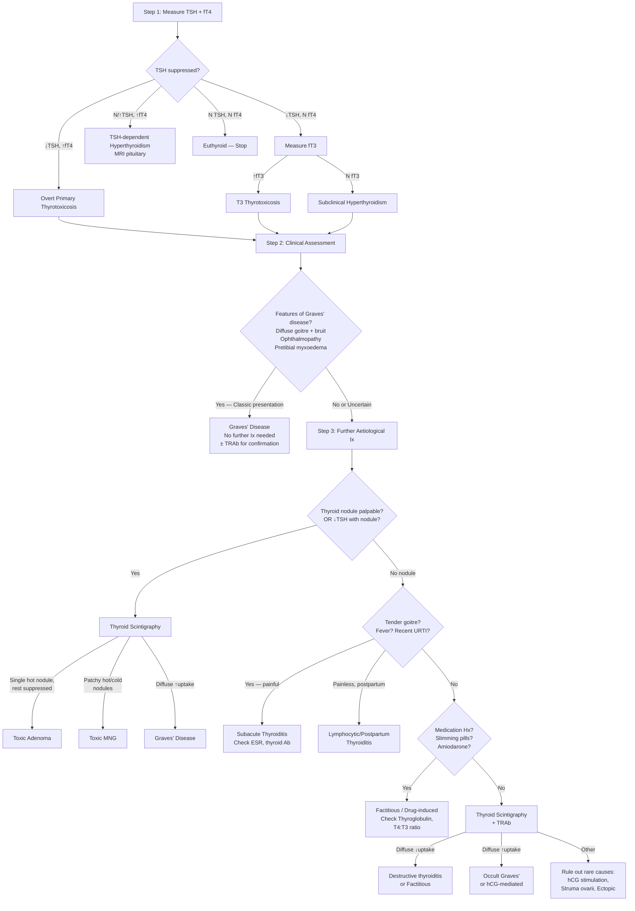

## Diagnostic Criteria, Algorithm, and Investigations for Hyperthyroidism

Let me take you through the diagnostic approach to hyperthyroidism in a logical, stepwise fashion — the way you'd actually think about it on the ward. The diagnosis of hyperthyroidism is fundamentally a **two-step process**:

1. **Confirm the biochemical diagnosis** (Is this patient truly thyrotoxic?)
2. **Determine the aetiology** (Why is this patient thyrotoxic?)

Each step uses different investigations, and understanding *why* we order each test matters far more than memorising a list.

---

## 1. Diagnostic Criteria — Biochemical Confirmation

There are no formal "diagnostic criteria" for hyperthyroidism in the way there are for, say, rheumatoid arthritis or diabetes. Instead, the diagnosis is established biochemically by thyroid function tests (TFTs) and then confirmed aetiologically.

### 1.1 TFT Interpretation — The Foundation

***TSH is the MOST sensitive indicator of thyroid function*** [6] due to the **log-linear relationship** between TSH and fT4. A small change in fT4 produces a disproportionately large change in TSH. This means TSH becomes abnormal long before fT4 does.

***Measure TSH and unbound T4*** as the initial step [6][16]:

| TFT Pattern | Interpretation | Next Step |
|---|---|---|
| ***↓TSH, ↑fT4*** | ***Primary thyrotoxicosis (overt)*** [1][6] — TSH usually undetectable ( < 0.01 mU/L) | Determine aetiology |
| ***↓TSH, normal fT4*** | ***Measure fT3*** [6] — two possibilities: **T3 thyrotoxicosis** (↑fT3) or **subclinical hyperthyroidism** (normal fT3) | If ↑fT3 → T3 thyrotoxicosis; if normal fT3 → subclinical hyperthyroidism |
| ***↑TSH (or normal), ↑fT4*** | ***TSH-secreting pituitary adenoma or thyroid hormone resistance syndrome*** [1][6] — the TSH is "inappropriately" non-suppressed despite elevated T4 | MRI pituitary, α-subunit, TRH stimulation test |
| Normal TSH, normal fT4 | ***No further tests*** [6] — euthyroid | Reassure |

<Callout title="Why TSH is 'Most Sensitive'" type="idea">
Think of it this way: the pituitary is exquisitely sensitive to circulating T4/T3. Even a tiny rise in free T4 that is still within the "normal" laboratory range will cause a measurable fall in TSH. This is why subclinical hyperthyroidism (suppressed TSH but normal fT4/fT3) exists — the pituitary has detected the excess before the lab reference range catches it.
</Callout>

### 1.2 Important Caveats in TFT Interpretation

| Situation | TFT Pattern | Why It Happens | How to Avoid the Trap |
|---|---|---|---|
| ***Sick euthyroidism*** | ***↓/N TSH, ↓/N/↑ fT4, ↓↓ T3*** [1] | Systemic illness ↓peripheral T4→T3 conversion; cytokines suppress TSH | ***T3 should be checked if suspected hyperthyroidism with concurrent illness (↓T3 in sick euthyroidism)*** [1] — if T3 is LOW, it's probably not true thyrotoxicosis |
| ***Other causes of ↓TSH*** | ↓TSH, ↓fT4 | ***Central hypothyroidism (pituitary/hypothalamic insufficiency), systemic illness, pregnancy*** [1] | fT4 will be LOW (not high) — completely different clinical picture |
| Pregnancy (1st trimester) | ↓TSH, ↑/N fT4 | hCG cross-reacts with TSHr (structural homology) → transient physiological thyrotoxicosis | Usually self-limiting; only treat if severely symptomatic or very high fT4 |
| ***Factitious thyrotoxicosis*** | ↓TSH, ↑fT4, ↑T4:T3 ratio > 70:1 | ***In exogenous thyroxine intake, the serum T3 content is entirely dependent on peripheral conversion while thyroid T3 secretion is suppressed*** [1]. Normal ratio ~30:1; factitious rises to > 70:1 | Check thyroglobulin (will be ↓) and T4:T3 ratio |
| Subclinical hyperthyroidism | ↓TSH, normal fT4, normal fT3 | Early/mild autonomous thyroid hormone production that has suppressed TSH but not yet exceeded normal T4/T3 range | Important to identify: ↑risk of AF and osteoporosis |

<Callout title="T4:T3 Ratio — A Clever Discriminator" type="error">
***In factitious thyrotoxicosis (exogenous T4 intake), the T4:T3 ratio rises to > 70:1*** [1] because the patient is taking pure T4, and the only T3 in their blood comes from peripheral conversion (no thyroidal T3 secretion, which is suppressed). In genuine endogenous thyrotoxicosis (e.g. Graves'), the thyroid secretes both T4 and T3 directly, so the ratio stays around 30:1. This is a subtle but powerful diagnostic clue.
</Callout>

---

## 2. Diagnostic Algorithm — Determining the Aetiology

Once you have confirmed biochemical thyrotoxicosis, you need to figure out **why**. The algorithm below integrates the ***evaluation of thyrotoxicosis diagnostic protocol*** [6] with the ***aetiological investigation approach*** [1]:

### 2.1 Step-by-Step Logic

**Step 1 — TFTs**: As above. Confirm thyrotoxicosis biochemically.

**Step 2 — Clinical Assessment**: Before ordering any further investigations, *examine the patient*. In many cases, the aetiology is clinically obvious:
- ***Diffuse goitre + bruit ± ophthalmopathy*** → Graves' disease (often no further investigation needed) [1]
- ***Palpable nodules*** → toxic MNG or toxic adenoma [7][16]
- ***Tender goitre + fever + recent URTI*** → subacute thyroiditis [1]
- ***Recent pregnancy*** → postpartum thyroiditis
- ***Medication history (esp slimming pills)*** → factitious thyrotoxicosis [1][2]

**Step 3 — Aetiological Investigations** (when the diagnosis is not clinically obvious):

***Aetiological investigations if not clinically apparent*** [1]:

| Investigation | When to Order | What It Tells You |
|---|---|---|
| ***TRAb (anti-TSHr)*** | ***Diffuse toxic goitre with −ve clinical Graves' features; when suspecting Graves' but uncertain*** [1] | ***Sensitivity 97%, Specificity 99% with newer assays*** [1]; virtually confirms Graves' if positive |
| ***Thyroid scintigraphy*** | ***When suspecting destructive thyroiditis; diffuse toxic goitre with −ve TRAb; painful goitre; ↓TSH with thyroid nodule*** [1][16] | Differentiates uptake pattern (see below) |
| ***USG thyroid*** | ***Routine for ALL goitre/nodules*** [1][2][16] | Look for nodules, ↑blood flow in Graves'; guide FNAC |
| ***ESR, thyroid antibodies*** | Suspecting thyroiditis [1][2] | ↑↑ESR in subacute thyroiditis; anti-TPO in Hashimoto's/Hashitoxicosis |
| ***Serum thyroglobulin*** | Suspecting factitious thyrotoxicosis [1] | ↓ in factitious (suppressed gland), ↑ in destructive thyroiditis |

---

## 3. Investigation Modalities — Detailed Interpretation

### 3.1 Thyroid Function Tests (TFTs)

***TSH + fT4 are the first-line investigations*** [1][2][6][16].

| Analyte | What It Measures | Normal Range (approx.) | Interpretation in Hyperthyroidism |
|---|---|---|---|
| **TSH** | Pituitary response to circulating T4/T3 | 0.4–4.0 mU/L | **Suppressed** ( < 0.01 mU/L) in primary thyrotoxicosis |
| **fT4** | Unbound (biologically active) thyroxine | 9–25 pmol/L | **Elevated** in overt hyperthyroidism |
| **fT3** | Unbound triiodothyronine | 3.1–6.8 pmol/L | Check when ↓TSH but normal fT4 (T3 thyrotoxicosis) |
| **Total T4/T3** | Bound + unbound hormone | Variable | Affected by TBG changes (pregnancy, OCP, liver disease) — less useful than free fractions |

**When to check T3 specifically:**
- ***↓TSH with normal fT4*** → must measure fT3 to diagnose T3 thyrotoxicosis [6]
- ***Suspected hyperthyroidism with concurrent illness*** → ***T3 should be checked (↓T3 in sick euthyroidism)*** [1]
- Early Graves' disease or toxic adenoma may present with T3 elevation before T4 rises (T3 is preferentially secreted from hyperactive thyroid tissue)

### 3.2 Thyroid Antibodies

| Antibody | Target | Clinical Significance |
|---|---|---|
| ***TRAb (anti-TSHr)*** | TSH receptor | ***Sensitivity 97%, Specificity 99%*** [1] for Graves'; prognostic (***+ve TRAb at end of Tx → ↑chance of relapse; −ve TRAb → prolonged remission***) [1]; assesses risk of neonatal Graves' (***↑risk if ↑TRAb level***) [1] |
| **Anti-TPO (anti-microsomal)** | Thyroid peroxidase | Most specific for autoimmune thyroid disease; ↑ in Hashimoto's (90–100%), also elevated in Graves' (~75%); ***low titres in subacute thyroiditis*** [1] |
| **Anti-Tg** | Thyroglobulin | Less specific; ↑ in Hashimoto's (80–90%), other thyroid diseases, and even some euthyroid individuals; ***anti-Tg should be measured to assess whether thyroglobulin can be used as a tumour marker*** [6] |

***TRAb is NOT routinely done (quite expensive)*** [1] — but has specific indications:
1. ***Prognostic indicator of outcome of anti-thyroid drugs*** [1]
2. ***Assessing risk of neonatal Graves' disease*** (in pregnant women with Graves') [1]
3. ***Establishing diagnosis of Graves' disease when not clinically obvious*** [1]

### 3.3 Thyroid Scintigraphy (Radionuclide Scan)

This is one of the most important discriminating investigations. Let's break it down from first principles.

#### 3.3.1 Principle

***Radioactive iodine (or technetium) is handled in the same manner as normal iodine*** [5]. The level of uptake reflects the **metabolic activity** of the thyroid gland — areas that are actively trapping and organifying iodine will "light up" [5].

#### 3.3.2 Radiopharmaceuticals

| Agent | What It Assesses | Notes |
|---|---|---|
| ***⁹⁹ᵐTc pertechnetate*** | ***Iodine trapping only*** [5] | ***Has a similar ionic size as iodide ion, allowing it to be taken up by NIS*** [5]; cheaper, more widely available, quicker (imaging within 20 min) |
| ***¹²³I*** | ***Trapping + organification*** [5] | More specific than ⁹⁹ᵐTc; used for definitive assessment |
| **¹³¹I** | Trapping + organification | Higher radiation dose; mainly used therapeutically (RAI ablation) rather than diagnostically |

***Images often obtained at anterior, left anterior oblique (LAO) and right anterior oblique (RAO)*** [5].

#### 3.3.3 Indications

***Thyroid scintigraphy is NOT recommended for routine diagnostic use*** [6][16]. It has specific indications:

| ***Indication*** [1][6][16] | ***Rationale*** |
|---|---|
| ***When suspecting destructive thyroiditis*** | Globally ↓uptake confirms follicular destruction rather than overactivity |
| ***Diffuse toxic goitre with −ve TRAb*** | Need to confirm whether it's truly Graves' (diffuse ↑uptake) or thyroiditis (↓uptake) |
| ***S/S suggestive of destructive thyroiditis, e.g. painful goitre*** | Differentiates subacute thyroiditis from other causes |
| ***↓TSH with thyroid nodule(s)*** | ***Determine functional status of the nodule*** — this is critical for distinguishing between Graves' with co-existent nodule, toxic adenoma, and toxic MNG [1][6] |
| ***Determine functional status of dominant nodule in toxic MNG*** | ***Hot nodules are almost never malignant*** [1] → does NOT require FNAC [6][16] |

***NOT performed in euthyroid (normal TSH) or ↑TSH patients since the thyroid nodule will never be hyperfunctioning and will require USG ± FNAC to confirm anyways*** [6].

#### 3.3.4 Interpretation — Key Uptake Patterns

| ***Scintigraphy Finding*** | ***Diagnosis*** [1][16] | ***Why This Pattern?*** |
|---|---|---|
| ***Diffuse ↑uptake*** | ***Graves' disease*** vs ***secondary hyperthyroidism*** [1] | TRAb stimulates ALL follicular cells uniformly → entire gland is hyperactive |
| ***Heterogeneous ↑uptake*** | ***Toxic MNG*** [1] | Multiple autonomous nodules (hot) interspersed with suppressed/normal tissue (cold) |
| ***Focal ↑uptake with ↓uptake elsewhere*** | ***Toxic adenoma*** [1][16] | Single autonomous nodule produces enough T4 to suppress TSH → rest of gland shuts down |
| ***Diffuse ↓uptake*** | ***Destructive thyroiditis*** vs ***factitious thyrotoxicosis*** [1] | Damaged follicles cannot trap iodine (thyroiditis); OR gland is suppressed by exogenous T4 (factitious) |

***To differentiate destructive thyroiditis from factitious thyrotoxicosis*** when both show ↓uptake [1]:
- ***Factitious thyrotoxicosis***: ***↑T4:T3 ratio*** (> 70:1) + ***↓serum thyroglobulin*** (gland suppressed, not releasing Tg)
- **Destructive thyroiditis**: normal or ↓T4:T3 ratio + **↑serum thyroglobulin** (follicular contents leaking out)

***Regarding malignancy*** [6][16]:
- ***Radio-isotope scintigraphy has low sensitivity and specificity for diagnosis of malignancy*** [16]
- Its main role is ***functional assessment in thyrotoxic patients*** [16]
- ***Hyperfunctioning (hot) nodules are rarely cancer and hence do NOT require FNA*** [6][16]
- ***Hypofunctioning (cold) nodules have 10–20% risk of being cancer and hence require FNA provided that sonographic criteria are met*** [6]

<Callout title="Hot Nodule = Almost Never Cancer">
A "hot" nodule on scintigraphy means it is autonomously trapping iodine and making thyroid hormone. These are functioning benign adenomas. The cancer risk is extremely low ( < 1%), so **FNAC is NOT indicated**. Conversely, "cold" nodules (10–20% cancer risk) need further workup with USG ± FNAC. This is one of the most important practical points in thyroid investigation [6][16].
</Callout>

### 3.4 Thyroid Ultrasound (USG)

***USG is routine for ALL patients with goitre/palpable nodules*** [1][2][16] — it is essentially an extension of the physical examination.

#### 3.4.1 Technical Details

***7.5 or 10 MHz probes, B mode*** [1][2]

#### 3.4.2 Pros and Cons

***Readily available, non-invasive, ↑sensitivity but ↓specificity*** [1][2]

***NOT a screening test for healthy subjects*** (because high sensitivity means you'll find incidental nodules that are almost certainly benign — creating unnecessary anxiety and investigations) [1][2]

#### 3.4.3 Roles of Thyroid USG

| Role | Details |
|---|---|
| ***Define anatomy and size of goitre*** [1][2] | Measure dimensions, volume, extent |
| ***Identify whether lesion is solid or cystic, solitary or multiple*** [6] | Solid nodules have higher malignancy risk than purely cystic |
| ***Ascertain risk of CA in thyroid nodules*** [1][2] | By TI-RADS classification (see below) |
| ***Cervical lymph node assessment*** | ***Esp. deep nodes, e.g. level VI nodes*** [6][7]; sonographic features of malignant LN (see below) |
| ***Assess retrosternal extension*** [7] | Though limited — retrosternal goitre cannot be fully visualised by USG [7] |
| ***Detect extrathyroidal invasion*** [6] | Supports diagnosis of cancer |
| ***Guide FNAC*** [1][2][7] | Confirm presence of nodule, ***target biopsy to more suspicious regions*** [1] |
| **Assess blood flow** (Doppler) | ↑diffuse vascularity in Graves'; intranodular vascularity suspicious for malignancy |

#### 3.4.4 Sonographic Features Suggestive of Malignancy

***Features suggestive of malignancy (TI-RADS classification)*** [1][2]:

**The nodule itself:**

| Feature | Significance |
|---|---|
| ***Hypoechoic, heterogeneous*** | Solid hypoechoic nodules are most suspicious |
| ***Taller than wide*** (AP > transverse on transverse view) | Suggests infiltrative growth crossing tissue planes |
| ***Irregular shape*** | Loss of smooth capsular margins |
| ***Solid or cystic with irregular septa*** | Mixed solid-cystic with mural nodules |
| ***Microcalcification ( < 0.2mm)*** | ***Represents the Psammoma bodies of papillary CA*** [1][2] — tiny echogenic foci without posterior shadowing |
| ***Absent or incomplete perilesional halo*** | Normal halo ***represents compression of surrounding tissues without invasion*** [1][2]; loss of halo → invasion |
| ***Intranodular vascularity*** | Central blood flow suggests active tumour angiogenesis |
| ***Local invasion: esp into strap muscles*** [1][2] | Direct evidence of extrathyroidal extension |

**Surrounding tissues:**

| Feature | Significance |
|---|---|
| ***Other nodules (likely MNG → reassuring)*** [1][2] | Multiple benign-appearing nodules suggest MNG |
| ***Parenchymal abnormalities*** [1][2] | Heterogeneous parenchyma → Hashimoto's or chronic thyroiditis |
| ***Sonographic features of malignant LN*** [6] | ***Large > 2cm, roundish (taller than wide), heterogeneous hypoechoic, loss of central fatty hilum, microcalcification, intranodal cystic or coagulative necrosis*** |

> ***Sonographic features suspicious for malignancy mnemonic: "SHIT CME"*** [7] — the most important features are ***solid and hypoechoic***.

### 3.5 Fine Needle Aspiration Cytology (FNAC)

***FNAC is the single most important investigation for thyroid nodule if TSH not depressed*** [1].

Why "if TSH not depressed"? Because if TSH is suppressed, the nodule might be a hot nodule (functioning autonomously) → you should do **scintigraphy first** to determine functional status. Hot nodules don't need FNAC (almost never malignant).

#### 3.5.1 Technique

***Trans-isthmic approach ± USG guidance*** [1]
- ***Advantage of USG guidance: confirm presence of nodule, target biopsy to more suspicious regions*** [1]

#### 3.5.2 Indications

***ATA 2015 Guidelines*** [1]:

| Nodule Category | Size Threshold for FNAC |
|---|---|
| ***Suspicious nodules*** | ***≥1 cm*** |
| ***Low suspicion nodules*** | ***≥1.5 cm*** |
| ***Very low suspicion nodules*** | ***≥2 cm*** |
| ***Symptomatic/large cysts*** | Therapeutic aspiration |
| **Dominant or atypical nodule in MNG** | FNAC indicated [6] |
| **Nodules associated with abnormal LN** | FNAC indicated [6] |
| **Complex or recurrent cystic nodules** | FNAC indicated [6] |

Can proceed directly to total thyroidectomy (bypassing FNAC) ***if > 4cm, gross invasion, or LN positive*** [1].

#### 3.5.3 Bethesda Classification

***Standard reporting system*** [1][6]:

| ***Class*** | ***Diagnostic Category*** | ***Cancer Risk*** | ***Usual Management*** |
|---|---|---|---|
| ***I*** | ***Non-diagnostic*** | ***1–4%*** | ***Repeat FNA*** (or operate if radiologically suspicious) [1] |
| ***II*** | ***Benign*** | ***0–3%*** | ***Clinical follow-up*** [1] |
| ***III*** | ***AUS or FLUS*** | ***5–15%*** | ***Repeat FNA, molecular testing, hemiT if AUS ×2*** [1] |
| ***IV*** | ***Follicular neoplasm*** | ***15–30%*** | ***Hemithyroidectomy, molecular testing*** [1] |
| ***V*** | ***Suspicious for malignancy*** | ***60–75%*** | ***Hemithyroidectomy + frozen section + total thyroidectomy*** [1] |
| ***VI*** | ***Malignant*** | ***97–99%*** | ***Total thyroidectomy*** [1] |

Why is Bethesda important? Because ***FNAC accuracy is 90–95%*** [1] — it is excellent at stratifying risk and avoiding unnecessary diagnostic thyroidectomies. However, it has one major limitation:

***Histological demonstration of capsular or vascular invasion is required to diagnose whether a follicular lesion is benign or malignant*** [1] — FNAC cannot distinguish follicular adenoma from follicular carcinoma (both appear as "follicular neoplasm" on cytology). This is why Bethesda IV (follicular neoplasm) requires hemithyroidectomy for definitive histological diagnosis.

<Callout title="FNAC Cannot Distinguish Follicular Adenoma from Carcinoma" type="error">
This is a favourite exam point. FNAC tells you the cells look "follicular" but cannot see capsular/vascular invasion (which is what defines follicular carcinoma). That's why Bethesda IV ("follicular neoplasm") leads to diagnostic hemithyroidectomy — you need the whole specimen to assess invasion histologically [1].
</Callout>

### 3.6 Other Blood Tests

| Investigation | Indication | Interpretation |
|---|---|---|
| ***CBC with differentials*** [6] | Baseline; leukocytosis in subacute thyroiditis | ↑WBC supports inflammatory aetiology |
| ***ESR/CRP*** | Suspecting subacute thyroiditis [1][2] | ***↑↑ESR*** (often > 50) in de Quervain's thyroiditis |
| ***Serum Ca²⁺ and PO₄³⁻*** [6] | Baseline; ***hypercalcaemia of malignancy; hypocalcaemia due to parathyroid compromise*** [6] | ↑Ca in ~10% of thyrotoxicosis (↑osteoclast activity) |
| ***Serum thyroglobulin*** [6] | ***Baseline tumour marker for differentiated thyroid carcinoma*** [6]; distinguishing factitious from destructive thyroiditis | ↓ in factitious (suppressed gland); ↑ in destructive thyroiditis and thyroid cancer |
| ***Serum calcitonin*** [6] | ***Baseline tumour marker; 95% of medullary thyroid carcinoma produces calcitonin*** [6] | Ordered if suspecting MTC or MEN2 |
| ***Serum CEA*** [6] | ***80% of medullary thyroid carcinoma produces CEA*** [6] | Ordered with calcitonin if suspecting MTC |
| ***Genetic testing (RET mutation)*** [6] | ***All patients with MTC should be tested for RET mutation*** [6] | If positive → screen family members, offer prophylactic thyroidectomy |
| **Liver function tests** | Baseline before starting anti-thyroid drugs (can cause hepatotoxicity) | Document baseline ALT/AST |

### 3.7 Additional Imaging

| Investigation | Indication | Key Findings |
|---|---|---|
| ***CXR (thoracic inlet view)*** [16] | Retrosternal goitre, tracheal deviation/compression | Mediastinal widening, tracheal narrowing/deviation |
| ***CT/MRI*** [7][16] | ***Only when (1) retrosternal goitre or (2) locally advanced thyroid cancer*** [7]; NOT routine | ***Retrosternal goitre requires CT because: (1) cannot be visualised by USG, (2) surgical planning, (3) retrosternal goitre may be malignant*** [7]; locally advanced disease for ***better delineation of structures within cervical fascia*** [7]. **Note: iodinated contrast may affect post-op radioactive iodine scan** [1] |
| ***PET scan*** [7] | ***No diagnostic role at all*** [7] in initial thyroid workup; role limited to staging/monitoring in thyroid cancer with negative RAI scan but ↑Tg |
| **Flow-volume loop study** | Obstructive goitre [1][2] | ***Upper airway obstruction results in a blunted flow-volume loop*** [1][2] |

### 3.8 Endoscopy

| Investigation | Indication |
|---|---|
| ***Direct laryngoscopy*** [1][2] | ***For RLN palsy*** — should be done pre-operatively in all patients undergoing thyroidectomy to document baseline vocal cord function |
| ***OGD*** [1][2] | ***For oesophageal involvement*** — rarely needed, only in locally advanced disease |

### 3.9 ECG

Always obtain an ECG in thyrotoxic patients:
- **Sinus tachycardia**: most common finding
- **Atrial fibrillation**: found in 10–25% of thyrotoxic patients; ***thyroid disease is a metabolic/systemic cause of arrhythmia*** [9]
- **Short QT interval**: due to ↑sympathetic tone
- **ST-T changes**: may indicate ischaemia in elderly patients with coexistent coronary artery disease

---

## 4. Summary: Routine vs Selective Investigations

***Routine for all patients: History + Physical exam, TFT, thyroid USG*** [7][16]

***Selective investigations*** [7][16]:

| Investigation | When |
|---|---|
| ***Thyroid scan*** | ***Only in toxic (↓TSH) + nodules*** [7] |
| ***CT scan*** | ***Only when (1) retrosternal goitre or (2) locally advanced thyroid cancer*** [7] |
| ***PET scan*** | ***No diagnostic role at all*** [7] |
| ***FNAC*** | Suspicious nodules on USG (per Bethesda/TI-RADS criteria); NOT for hot nodules |
| ***TRAb*** | When Graves' not clinically obvious; prognostic; pregnancy |
| ***ESR, thyroid Ab*** | Suspecting thyroiditis |
| ***Calcitonin, CEA, RET*** | Suspecting MTC or MEN2 |

---

## 5. Special Investigations for Graves' Ophthalmopathy

When moderate-to-severe Graves' orbitopathy is suspected [4]:

| Investigation | Finding |
|---|---|
| ***TFT ± TRAb*** | ***Underlying thyroid condition and assess severity*** [4] |
| ***NECT orbit*** | ***Characteristic tendon-sparing EOM enlargement; apical crowding indicates risk of ON compression*** [4] — the extraocular muscles enlarge but their tendons remain normal-sized (unlike orbital myositis where tendons are also involved) |
| ***Exophthalmometry*** | ***Normal = 18.6mm (Chinese); proptosis can be up to 30mm*** [4] |
| ***Clinical Activity Score (CAS)*** [4] | Assess disease activity: ***7 criteria: (1) spontaneous retrobulbar pain, (2) pain on eye movements, (3) eyelid erythema, (4) conjunctival injection, (5) chemosis, (6) swelling of caruncle, (7) eyelid oedema/fullness → > 3 = active disease*** → ***↑likelihood to respond to immunomodulatory treatment*** |
| ***EUGOGO classification*** [4] | Severity grading |

<Callout title="Tendon-Sparing EOM Enlargement — Pathognomonic">
On CT orbit, Graves' ophthalmopathy shows enlarged extraocular muscle bellies with **normal-sized tendons** ("tendon-sparing"). This is pathognomonic and distinguishes it from orbital myositis (where the tendon is also involved) and orbital lymphoma (diffuse infiltration) [4].
</Callout>

---

<Callout title="High Yield Summary — Diagnosis of Hyperthyroidism">

**Biochemical confirmation:**
- TSH (most sensitive) + fT4 = first line
- ↓TSH + ↑fT4 = overt primary thyrotoxicosis
- ↓TSH + N fT4 → check fT3 (T3 thyrotoxicosis vs subclinical)
- ↑TSH + ↑fT4 = TSH-dependent (pituitary adenoma or hormone resistance)

**Aetiological workup:**
- Clinical assessment FIRST (goitre type, eye signs, tenderness, drug Hx)
- TRAb: Sens 97%, Spec 99% for Graves'; prognostic role
- Scintigraphy: only when ↓TSH + nodule, or uncertain aetiology; diffuse ↑ = Graves', focal hot = adenoma, patchy = toxic MNG, ↓ = thyroiditis/factitious
- NOT routine: scintigraphy, CT, PET

**USG: routine for ALL goitre/nodules**
- TI-RADS for malignancy risk; most suspicious = solid + hypoechoic + microcalcification

**FNAC: single most important test for thyroid nodule if TSH not depressed**
- Bethesda classification guides management
- Cannot distinguish follicular adenoma from carcinoma (needs histological capsular/vascular invasion)
- Hot nodules do NOT need FNAC (almost never malignant)

**Key traps:**
- Sick euthyroidism: ↓TSH but ↓T3 (not true thyrotoxicosis)
- Factitious: T4:T3 ratio > 70:1, ↓thyroglobulin
- Use iodinated contrast cautiously if RAI scan planned post-op

</Callout>

---

<ActiveRecallQuiz
  title="Active Recall - Diagnosis of Hyperthyroidism"
  items={[
    {
      question: "A patient has suppressed TSH but normal fT4. What is your next step and what two diagnoses are you distinguishing between?",
      markscheme: "Next step: measure fT3. If fT3 is elevated = T3 thyrotoxicosis (early Graves' or toxic adenoma preferentially secreting T3). If fT3 is also normal = subclinical hyperthyroidism (suppressed TSH but normal fT4 and fT3).",
    },
    {
      question: "List 4 specific indications for thyroid scintigraphy in the workup of thyrotoxicosis. When is it NOT indicated?",
      markscheme: "Indications: (1) Suspecting destructive thyroiditis. (2) Diffuse toxic goitre with negative TRAb. (3) Symptoms suggestive of destructive thyroiditis e.g. painful goitre. (4) Suppressed TSH with thyroid nodule(s) to determine functional status. NOT indicated in euthyroid or elevated TSH patients, because the nodule will never be hyperfunctioning.",
    },
    {
      question: "A thyroid nodule is 'hot' on scintigraphy. Does it need FNAC? Why or why not? What if it is 'cold'?",
      markscheme: "Hot nodule does NOT need FNAC because hyperfunctioning nodules are almost never malignant (less than 1% cancer risk). Cold nodule has 10-20% cancer risk and requires FNAC provided that sonographic criteria are met.",
    },
    {
      question: "What is the major limitation of FNAC in thyroid nodule assessment? How does this affect management of Bethesda IV lesions?",
      markscheme: "FNAC cannot distinguish follicular adenoma from follicular carcinoma because histological demonstration of capsular or vascular invasion is required for this distinction, which is not possible on cytology. Bethesda IV (follicular neoplasm) therefore requires diagnostic hemithyroidectomy to examine the whole specimen histologically.",
    },
    {
      question: "How do you differentiate factitious thyrotoxicosis from destructive thyroiditis when both show globally decreased uptake on scintigraphy?",
      markscheme: "Factitious thyrotoxicosis: T4:T3 ratio greater than 70:1 (only peripheral T4 to T3 conversion, no thyroidal T3 secretion) AND decreased serum thyroglobulin (gland is suppressed). Destructive thyroiditis: normal T4:T3 ratio (approximately 30:1) AND increased serum thyroglobulin (follicular contents leaking out from damaged follicles).",
    },
    {
      question: "What is the characteristic CT finding in Graves' ophthalmopathy and how does it differ from orbital myositis?",
      markscheme: "Graves' ophthalmopathy: tendon-sparing EOM enlargement (muscle bellies enlarged but tendons remain normal-sized) with possible apical crowding. Orbital myositis: both muscle bellies AND tendons are enlarged/inflamed. Tendon-sparing pattern is pathognomonic for Graves' orbitopathy.",
    },
  ]}
/>

## References

[1] Senior notes: Ryan Ho Endocrine.pdf (Sections 1.4–1.6, pp. 13, 19–20, 23–31)
[2] Senior notes: Ryan Ho Fundamentals.pdf (pp. 421–427)
[4] Senior notes: Ryan Ho Opthalmology.pdf (Section 7.1, pp. 128–129)
[5] Senior notes: Ryan Ho Diagnostic Radiology.pdf (Section 2a, pp. 59–60)
[6] Senior notes: felixlai.md (Sections V, VIII — Diagnosis, pp. 985, 1004–1006)
[7] Senior notes: maxim.md (Investigations — thyroid nodule approach)
[9] Senior notes: Ryan Ho Cardiology.pdf (p. 83 — causes of arrhythmia)
[16] Lecture slides: GC 177. A thyroid nodule benign thyroid nodules; thyroid cancer.pdf (pp. 7, 13)
