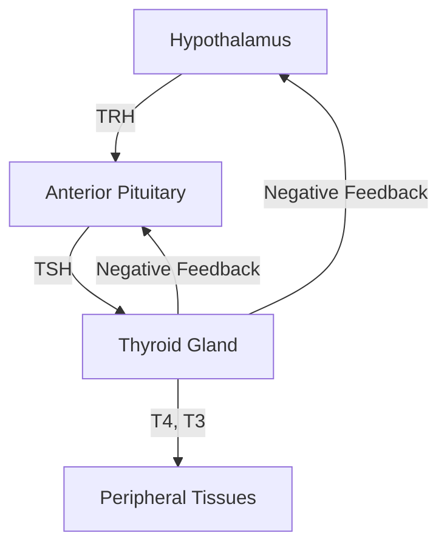
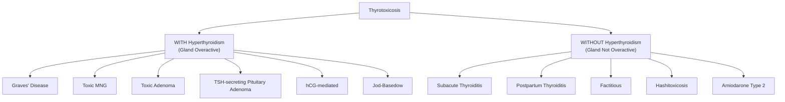

# Hyperthyroidism

## 1. Definition and Terminology

Let's get the terminology straight from the outset, because this trips up students constantly.

***Thyrotoxicosis*** refers to the **clinical syndrome** associated with excess thyroid hormone at the tissue level, **regardless of source** [1][2]. ***Hyperthyroidism*** refers specifically to **endogenous hyperactivity of the thyroid gland** — i.e., the thyroid itself is overproducing hormone [1][2].

This distinction matters clinically:
- **All hyperthyroidism causes thyrotoxicosis**, but **not all thyrotoxicosis is hyperthyroidism**
- Factitious thyrotoxicosis (e.g. exogenous thyroxine ingestion, slimming pills) and destructive thyroiditis (subacute thyroiditis, postpartum thyroiditis) cause thyrotoxicosis *without* hyperthyroidism — the gland is not hyperactive; stored hormone is simply leaking out or being ingested

> **Thyrotoxicosis** = clinical syndrome of excess thyroid hormone (any source). **Hyperthyroidism** = the thyroid gland itself is overactive. The words are NOT interchangeable.

<Callout title="Common Exam Pitfall" type="error">
Students often use "hyperthyroidism" and "thyrotoxicosis" interchangeably. In MCQs and OSCEs, you will be tested on this distinction. Subacute thyroiditis causes thyrotoxicosis but NOT hyperthyroidism — the gland is being destroyed, not hyperactive.
</Callout>

---

## 2. Epidemiology

### Global and Hong Kong Perspective

- **Prevalence of overt hyperthyroidism**: ~1.2–1.3% of the population (females), ~0.2–0.5% (males) [3]
- **Female predominance**: F:M ≈ 5–10:1 for Graves' disease (the commonest cause)
- ***Graves' disease***: peak incidence **20–50 years** (women of reproductive age), M:F = 1:4.8 [1]
- **Toxic multinodular goitre (MNG)**: more common in **older adults** (>50 years), especially in areas with historical iodine deficiency
- **Toxic adenoma**: middle-aged adults

**Hong Kong-specific points:**
- Hong Kong is traditionally an **iodine-sufficient** region (seafood-rich diet), so Graves' disease predominates over iodine-deficiency-related causes
- ***Thyrotoxic periodic paralysis (TPP)***: up to **2% of Asian patients with hyperthyroidism** (vs 0.1–0.2% in non-Asians) — a high-yield Hong Kong exam topic [1]
- Increasing prevalence of Hashimoto's thyroiditis in HK (?dietary westernisation), which can initially present with "Hashitoxicosis" before progressing to hypothyroidism [1]

---

## 3. Anatomy and Physiology of the Thyroid

### 3.1 Anatomy

The thyroid gland sits in the anterior neck, wrapping around the trachea at the level of C5–T1:

- **Two lateral lobes** connected by an **isthmus** (overlying tracheal rings 2–4)
- **Pyramidal lobe** (remnant of thyroglossal duct) present in ~50%
- **Blood supply**: superior thyroid artery (from external carotid) and inferior thyroid artery (from thyrocervical trunk of subclavian)
- **Venous drainage**: superior and middle thyroid veins → IJV; inferior thyroid veins → brachiocephalic veins
- **Lymphatic drainage**: pre-tracheal, para-tracheal (level VI = central compartment), then deep cervical nodes
- **Key relations**:
  - **Recurrent laryngeal nerve (RLN)**: runs in the tracheo-oesophageal groove — vulnerable during surgery (injury → hoarseness)
  - **Parathyroid glands**: 4 glands embedded on the posterior surface — vulnerable during thyroidectomy (injury → hypocalcaemia)
  - **External branch of superior laryngeal nerve**: runs with superior thyroid artery — injury causes loss of high-pitched voice

### 3.2 Histology

- **Follicular cells** (thyrocytes): produce and secrete T4 and T3
  - Arranged in follicles surrounding colloid (thyroglobulin storage)
- **Parafollicular C cells**: produce calcitonin (relevant to medullary thyroid carcinoma, not hyperthyroidism per se)

### 3.3 Thyroid Hormone Physiology (First Principles)

Understanding this is essential to grasp every clinical feature and investigation result.

**Synthesis pathway (step by step):**

1. **Iodide trapping**: Sodium-iodide symporter (NIS) on the basolateral membrane of follicular cells actively transports I⁻ into the cell (against concentration gradient, Na⁺-dependent)
2. **Iodide transport to colloid**: Pendrin transporter moves I⁻ across the apical membrane into the colloid
3. **Oxidation and organification**: Thyroid peroxidase (TPO) oxidises I⁻ → I₂ and incorporates it into tyrosine residues on thyroglobulin (Tg) → forms monoiodotyrosine (MIT) and diiodotyrosine (DIT)
4. **Coupling**: TPO couples MIT + DIT → T3 (triiodothyronine); DIT + DIT → T4 (thyroxine)
5. **Storage**: T3 and T4 remain bound to Tg in the colloid
6. **Secretion**: TSH stimulates endocytosis of colloid → lysosomal proteolysis of Tg → release of T4 and T3 into blood
7. **Peripheral conversion**: Most circulating T3 comes from peripheral deiodination of T4 by deiodinases (type 1 and 2). T4 is the major secretory product (~90%), but T3 is 3–5× more biologically active

**HPT axis regulation:**

- **TRH** (thyrotropin-releasing hormone) from hypothalamus → stimulates **TSH** from anterior pituitary
- **TSH** → binds TSH receptor (TSHr) on follicular cells → stimulates all steps of hormone synthesis + gland growth
- **T4/T3** → negative feedback on both hypothalamus and pituitary → ↓TRH and ↓TSH
- This is why in primary hyperthyroidism, **TSH is suppressed** (usually undetectable) — because high T4/T3 feeds back powerfully

**Thyroid hormone transport:**
- >99% of T4/T3 is protein-bound (mainly to thyroxine-binding globulin, TBG; also albumin and transthyretin)
- Only the **free** fraction (fT4, fT3) is biologically active
- Conditions that alter TBG (e.g. pregnancy ↑TBG → ↑total T4 but normal fT4) must be considered when interpreting results

**Thyroid hormone actions (why excess hormone causes symptoms):**
- **Metabolic**: ↑basal metabolic rate (BMR), ↑oxygen consumption, ↑heat production → weight loss, heat intolerance, sweating
- **Cardiovascular**: ↑cardiac β₁-receptor expression → ↑heart rate, ↑contractility, ↑cardiac output → palpitations, high-output cardiac failure
- **Neurological**: ↑CNS excitability → anxiety, irritability, tremor, hyperreflexia
- **GI**: ↑gut motility → diarrhoea, ↑frequency
- **Musculoskeletal**: ↑protein catabolism → proximal myopathy, muscle wasting
- **Bone**: ↑osteoclastic activity → osteoporosis (especially in postmenopausal women with prolonged thyrotoxicosis)
- **Reproductive**: menstrual irregularity (oligomenorrhoea/amenorrhoea due to ↑SHBG and altered gonadotropin pulsatility)

<Callout title="Why TSH is the Most Sensitive Test">
TSH has a log-linear relationship with fT4. A small change in fT4 produces a large change in TSH. This means TSH becomes abnormal much earlier than fT4 does — hence it is the best screening test for thyroid dysfunction.
</Callout>

---

## 4. Risk Factors

| Risk Factor | Mechanism / Relevance |
|---|---|
| **Female sex** | Autoimmune diseases (Graves', Hashimoto's) strongly female-predominant due to X-chromosome-linked immune genes and oestrogen effects on immune tolerance |
| **Family history** | Graves' disease: 50% monozygotic twin concordance; HLA-DR3 association [1] |
| **Smoking** | ***Associated with development of Graves' ophthalmopathy*** (but not Graves' disease itself) [1]; also ↑severity of eye disease |
| **Iodine status** | Iodine excess can precipitate hyperthyroidism in those with autonomous nodules (Jod-Basedow phenomenon); iodine deficiency → endemic goitre → toxic MNG |
| **Other autoimmune diseases** | ***Associated with MG, T1DM*** [1]; part of autoimmune polyendocrine syndromes |
| **Stress, postpartum state** | May trigger Graves' disease or postpartum thyroiditis |
| **Medications** | Amiodarone (iodine-rich), lithium (paradoxical), immune checkpoint inhibitors, interferon-α |
| **Age** | Graves' peaks 20–50y; toxic MNG in elderly |
| **Ethnicity (for TPP)** | ***Asian ethnicity*** — susceptibility locus at 17q24.3 (discovered by HKU) [1] |
| **Post-RAI treatment** | ***Radioactive iodine treatment ↑risk of development or worsening of Graves' ophthalmopathy*** [4] |

---

## 5. Aetiology and Pathophysiology

The causes of thyrotoxicosis can be classified by whether the thyroid gland is **hyperactive (true hyperthyroidism)** or **not hyperactive (thyrotoxicosis without hyperthyroidism)**. This classification directly guides investigation (especially thyroid scintigraphy — hot vs cold) and treatment.

### 5.1 Causes WITH Hyperthyroidism (Thyroid Gland is Overactive)

#### 5.1.1 ***Graves' Disease*** (Commonest Cause Overall — ~60–80%)

**Pathophysiology [1]:**
- ***Self-reactive lymphocytes*** act against the **TSH receptor** (TSHr) antigen
- This produces an **IgG autoantibody** called ***thyrotropin-receptor antibody (TRAb)*** — specifically the *thyroid-stimulating immunoglobulin (TSI)* subtype
- TRAb **mimics TSH**: binds the TSHr → constitutive activation → stimulates thyroid hormone synthesis and release → ↑T4/T3
- Additionally, TRAb stimulates thyroid growth → **diffuse goitre**
- TSH itself is profoundly suppressed by negative feedback → **TSH undetectable**

**Why the goitre is diffuse**: TRAb stimulates ALL follicular cells uniformly (unlike TSH, which might be regulated; the autoantibody is not subject to negative feedback at the gland level).

**Why there is a thyroid bruit**: TRAb stimulation causes massive ↑vascularity of the gland → turbulent blood flow → audible bruit on auscultation. This is essentially the same concept as a cardiac murmur — turbulent flow through a hypervascular organ.

**Extrathyroid manifestations** — these occur because TSHr is expressed in tissues beyond the thyroid:

| Manifestation | Pathophysiology |
|---|---|
| ***Graves' ophthalmopathy*** (20–25%) | ***TSHr antigen expressed in orbital fibroblasts*** → TRAb binds → ***stimulates cytokine release → triggers adipogenesis and glycosaminoglycan (GAG) accumulation → ↑tissue volume of retroocular tissue*** [4]. T-cell activation → ***inflammatory infiltrate → orbital and EOM oedema → ↑tissue volume*** [4]. Result: proptosis, ophthalmoplegia, corneal exposure |
| ***Pretibial myxoedema*** ( < 10%) | TRAb activates fibroblasts in pretibial skin → GAG deposition → ***raised pink/purplish plaques on anterior aspect of leg*** [1] |
| ***Thyroid acropachy*** | ***Periosteal hypertrophy clinically indistinguishable from finger clubbing*** [2] — rare, pathognomonic of Graves' |

<Callout title="Graves' Ophthalmopathy — Not Just Hyperthyroidism">
Graves' ophthalmopathy can occur in hypothyroid and even euthyroid patients — because it is driven by TRAb acting on orbital TSHr, NOT by thyroid hormone levels themselves. The eye disease runs an independent course from the thyroid disease [4].
</Callout>

#### 5.1.2 Toxic Multinodular Goitre (Plummer's Disease)

- **Pathophysiology**: long-standing multinodular goitre → some nodules acquire **somatic activating mutations** in the TSHr gene or Gsα subunit → constitutive, TSH-independent thyroid hormone production
- **Why it causes hyperthyroidism gradually**: autonomous nodules slowly increase hormone output; hyperthyroidism develops insidiously, often in elderly patients
- **Scintigraphy**: multiple hot and cold nodules; patchy uptake with suppression of surrounding normal tissue
- **Hong Kong relevance**: less common than Graves' in HK (iodine-sufficient area), but still seen in elderly

#### 5.1.3 Toxic Adenoma (Solitary Autonomous Nodule)

- **Pathophysiology**: single benign follicular adenoma with a somatic activating mutation (TSHr or Gsα) → autonomous T4 production
- **Why it suppresses TSH**: the autonomous nodule produces enough T4 to suppress TSH via negative feedback → the rest of the normal thyroid tissue is suppressed ("cold" on scintigraphy)
- **Scintigraphy**: single "hot" nodule with suppression of surrounding gland

#### 5.1.4 TSH-Dependent Hyperthyroidism (Very Rare)

- ***↑TSH ↑T3 ↑fT4***: this unusual pattern suggests **TSH-secreting pituitary adenoma** (thyrotropinoma) [1][2]
- Why? The pituitary is autonomously secreting TSH despite high thyroid hormone levels — negative feedback is broken
- Other rare cause: thyroid hormone resistance (mutation in TR-β → pituitary resistance to feedback)

#### 5.1.5 hCG-Mediated Hyperthyroidism

- **Pathophysiology**: hCG shares structural homology with TSH (both are glycoprotein hormones with a common α-subunit) → at very high concentrations, hCG cross-reacts with the TSHr → stimulates T4 secretion
- ***Hydatidiform mole may secrete large amounts of hCG, which mimics the structure of TSH, stimulating T4 secretion*** [2]
- Also seen in: hyperemesis gravidarum (high hCG in 1st trimester), choriocarcinoma, multiple pregnancy

#### 5.1.6 Iodine-Induced Hyperthyroidism (Jod-Basedow Effect)

- **Mechanism**: in patients with pre-existing autonomous thyroid tissue (e.g. subclinical MNG), a sudden iodine load provides substrate for autonomous hormone synthesis → overt hyperthyroidism
- **Sources of excess iodine**: amiodarone (37% iodine by weight!), CT contrast, kelp supplements, Lugol's iodine
- **Amiodarone-induced thyrotoxicosis (AIT)** has two types:
  - Type 1: iodine-induced (Jod-Basedow) — in patients with underlying thyroid disease
  - Type 2: destructive thyroiditis — drug toxicity damages follicles → hormone release

### 5.2 Causes WITHOUT Hyperthyroidism (Thyrotoxicosis Without Gland Overactivity)

The thyroid gland is NOT hyperactive — hormone is leaking from damaged follicles or being ingested exogenously. **Radioactive iodine uptake is LOW** (because the gland is suppressed by negative feedback and/or damaged).

#### 5.2.1 ***Subacute (de Quervain's) Thyroiditis*** [1]

- **Setting**: ***recent URTI***, often preceded by viral infection (Coxsackie, mumps, adenoviruses) [1]
- **Pathophysiology**: viral-triggered inflammatory destruction of thyroid follicles → release of pre-formed stored T4/T3 into circulation → thyrotoxicosis
- ***Why iodine uptake is LOW***: damaged follicles cannot trap iodine + TSH is suppressed by released T4/T3 [1]
- ***Clinical course*** [1]:
  1. ***Thyrotoxic phase (4–6 weeks)***: stored T4 leaks out until depleted
  2. ***Hypothyroid phase (4–6 months)***: follicular cells damaged → ↓synthesis
  3. ***Resolution***: follicular regeneration

- **Key clinical clue**: ***fever, tender goitre***, ↑ESR, ↑WBC [1][2]
- ***Low titres of thyroid autoantibodies*** [1]

#### 5.2.2 ***Subacute Lymphocytic and Postpartum Thyroiditis*** [1]

- Similar triphasic course (thyrotoxic → hypothyroid → recovery) but **painless**
- Postpartum thyroiditis: occurs within **6 months of delivery**; thought to be autoimmune rebound after pregnancy-related immune suppression
- ***Pain: present in de Quervain's but NOT in lymphocytic/postpartum thyroiditis*** [1]

#### 5.2.3 ***Factitious Thyrotoxicosis*** [2]

- ***Intake of ANY medications (esp slimming pills)*** → factitious thyrotoxicosis [2]
- Exogenous T4/T3 ingestion suppresses TSH and thyroid gland → gland is atrophic, low uptake on scintigraphy
- **Low thyroglobulin** (because the gland is suppressed) — this distinguishes it from endogenous causes

#### 5.2.4 Hashitoxicosis [1]

- ***Minority of Hashimoto's patients may initially present with hyperthyroidism*** and ↑iodine uptake due to severe follicular disruption and thyroid hormone release → ***subsequently progresses to typical Hashimoto's trajectory*** [1]
- Transient; the overall trajectory is towards hypothyroidism

### 5.3 Summary Classification of Causes

| Feature | Hyperthyroidism (e.g. Graves') | Thyrotoxicosis w/o Hyperthyroidism (e.g. Subacute Thyroiditis) |
|---|---|---|
| Gland activity | ↑↑ | ↓ (damaged or suppressed) |
| Radioactive iodine uptake | ↑ | ↓ |
| Thyroglobulin | ↑ or normal | ↑ (in destructive) or ↓ (factitious) |
| Anti-thyroid drugs useful? | Yes | **No** — no overproduction to block |
| Treatment | ATDs, RAI, surgery | Supportive (β-blockers, NSAIDs/steroids) |

---

## 6. Classification

### 6.1 By Mechanism (as above)

1. **Primary hyperthyroidism** (thyroid gland origin): Graves', toxic MNG, toxic adenoma
2. **Secondary hyperthyroidism** (TSH-driven): TSH-secreting pituitary adenoma
3. **Thyrotoxicosis without hyperthyroidism**: destructive thyroiditis, factitious, drug-induced

### 6.2 By Severity

| Category | Definition | TFT Pattern |
|---|---|---|
| ***Overt hyperthyroidism*** | Clinical symptoms + ***↓TSH ↑T3 ↑fT4*** [1][2] | ↓TSH, ↑fT4 and/or ↑T3 |
| ***Subclinical hyperthyroidism*** | Usually asymptomatic; ***↓TSH, normal T3, normal fT4*** [1][2] | ↓TSH, normal fT4, normal T3 |
| ***Thyroid storm*** (thyrotoxic crisis) | Life-threatening decompensation of thyrotoxicosis | Severely deranged TFTs + multi-organ dysfunction |

<Callout title="Subclinical Hyperthyroidism">
Subclinical hyperthyroidism is not "mild hyperthyroidism" — it is defined purely biochemically (suppressed TSH with normal fT4/T3). It may or may not have subtle symptoms. It matters because it increases risk of AF, osteoporosis, and progression to overt disease.
</Callout>

---

## 7. Clinical Features

The clinical features of hyperthyroidism can be understood by remembering that thyroid hormone:
1. ↑ Basal metabolic rate
2. ↑ Sympathetic nervous system responsiveness (by upregulating β-adrenergic receptors)
3. ↑ Protein catabolism
4. Has direct effects on virtually every organ system

***Cardiopulmonary symptoms may dominate in older patients*** [2].

### 7.1 Symptoms

| System | Symptom | Pathophysiological Basis |
|---|---|---|
| **Constitutional** | ***Weight loss despite increased appetite*** [2] | ↑BMR → ↑energy expenditure outstrips intake |
| | ***Heat intolerance, increased sweating*** [2] | ↑thermogenesis from ↑metabolic rate; ↑peripheral vasodilation to dissipate heat |
| **Cardiovascular** | ***Palpitations*** [2] | ↑cardiac β₁-receptor expression → ↑HR, ↑contractility; predisposes to AF |
| | Exertional dyspnoea | ↑cardiac output demand; in severe/prolonged cases → high-output cardiac failure |
| **Neuropsychiatric** | ***Hyperactivity, irritability, anxiety*** [2] | ↑CNS excitability; ↑β-adrenergic activity in the CNS |
| | ***Tremor*** [2] (fine, high-frequency) | ↑sympathetic drive → enhanced physiological tremor |
| | Emotional lability, insomnia | ↑neuronal excitability |
| | Psychosis (rare, "myxoedema madness" is actually hypothyroid — thyrotoxic psychosis is rare but real) | Severe CNS overstimulation |
| **GI** | ***Diarrhoea / increased frequency*** [2] | ↑GI motility (thyroid hormone ↑enteric smooth muscle contractility) |
| **Reproductive** | Oligomenorrhoea / amenorrhoea | ↑SHBG → altered free oestrogen; disrupted GnRH pulsatility |
| | ***Loss of libido*** [2] | Multifactorial — ↑SHBG, psychological |
| | Gynecomastia (males) | ↑aromatase activity → ↑peripheral conversion of androgens to oestrogens |
| **Musculoskeletal** | Proximal muscle weakness | ↑protein catabolism → myopathy (type II fibre atrophy) |
| | Difficulty climbing stairs, rising from chair | Proximal myopathy — same mechanism |
| **Dermatological** | Hair thinning, soft fine hair | ↑hair growth cycle turnover |
| | Pruritus | ↑metabolic rate affecting cutaneous nerve endings |
| | Palmar erythema, warm moist palms | Peripheral vasodilation |
| **Ophthalmological** | Grittiness, tearing, blurred vision | If Graves' ophthalmopathy — see below |
| **Bone** | Bone pain (rare), fractures | ↑osteoclastic activity → ↑bone resorption → osteoporosis |

#### Special Symptom Clusters in Specific Populations:

- **Elderly ("apathetic thyrotoxicosis")**: may present atypically with weight loss, AF, heart failure, depression rather than classic hyperadrenergic features — easily missed!
- ***Thyrotoxic periodic paralysis (TPP)***: ***always preceded by thyrotoxic symptoms*** [1]; ***attacks of motor paralysis***, proximal > distal, LL > UL, ***seldom respiratory/bulbar muscles*** [1]
  - ***Precipitants***: ***rest after strenuous activity***, ***stress***, ***SABA use*** (events causing ↑adrenaline); ***↑carbohydrate load*** (↑insulin release) [1]

### 7.2 Signs

#### 7.2.1 General Examination Signs

| Sign | Pathophysiological Basis |
|---|---|
| **Tachycardia** (resting HR > 90) | ↑β₁-adrenergic activity → ↑sinoatrial node firing rate |
| **Atrial fibrillation** (10–25% of thyrotoxic patients) | T4 ↑atrial myocyte excitability + shortens refractory period → substrate for re-entry |
| **Wide pulse pressure / bounding pulse** | ↑cardiac output + ↓peripheral vascular resistance (vasodilation) |
| **Fine tremor** | ↑sympathetic drive — ask patient to hold hands outstretched with fingers spread, place paper on hands |
| **Warm, moist skin** | Peripheral vasodilation + ↑sweating |
| **Hyperreflexia** (brisk reflexes, shortened relaxation phase) | ↑neuromuscular excitability |
| **Proximal myopathy** | ↑protein catabolism → type II muscle fibre atrophy; test by asking patient to stand from squat |
| **Onycholysis** (Plummer's nails) | Separation of nail plate from nail bed — mechanism unclear but associated with thyrotoxicosis |

#### 7.2.2 Thyroid Gland Examination Signs

| Sign | Interpretation |
|---|---|
| ***Diffuse, non-tender, vascular goitre with audible bruit*** [1] | Pathognomonic of Graves' disease; bruit due to ↑vascularity from TRAb stimulation |
| **Multinodular goitre** | Suggests toxic MNG |
| **Solitary nodule** | Suggests toxic adenoma |
| ***Tender goitre*** | Suggests ***subacute thyroiditis*** [1][2] |
| No palpable goitre | Consider factitious thyrotoxicosis, ectopic thyroid tissue, or thyroiditis with small gland |

#### 7.2.3 Eye Signs

This is a critical area for clinical exams. Eye signs in thyrotoxicosis fall into two categories:

**A. Non-specific eye signs (due to sympathetic overactivity — can occur in ANY cause of thyrotoxicosis):**

| Sign | Mechanism |
|---|---|
| ***Lid retraction*** | ***Due to overactive sympathetic activity → ↑Müller's muscle contraction*** [2][4] — the upper lid rides higher than the superior limbus, exposing sclera above the iris |
| ***Lid lag*** | ***Upper eyelid higher than normal with globe in downgaze*** [4] — same sympathetic mechanism; Müller's muscle doesn't relax quickly enough during downgaze |

***Note: lid lag and lid retraction are due to overactive sympathetic activity (↑Müller's muscle contraction) and thus are NOT specific to Graves' disease*** [2][4].

**B. Graves' ophthalmopathy (specific to Graves' disease):**

| Sign | Mechanism |
|---|---|
| ***Proptosis / exophthalmos*** | ***↑tissue volume of retroocular tissue*** from adipogenesis + GAG accumulation + inflammatory oedema [4]; pushes globe forward |
| ***Ophthalmoplegia / squint*** | ***EOM infiltration*** by inflammatory cells + oedema → restricted movement; ***most commonly affects IR > MR > SR > LPS > LR*** [4] |
| **Chemosis** (conjunctival oedema) | Venous congestion from ↑retroorbital pressure |
| ***Lagophthalmos*** | ***Incomplete closure of eye*** [4] — because proptosis prevents full lid closure |
| Corneal exposure / ulceration | Lagophthalmos → corneal drying |
| **Optic neuropathy** (sight-threatening) | Compression of optic nerve at orbital apex by swollen EOMs |
| Periorbital oedema | Impaired venous and lymphatic drainage from orbital congestion |

<Callout title="Graves' Ophthalmopathy Risk Factors" type="idea">
Risk factors for more severe ophthalmopathy [4]:
- ***Male sex*** (though F > M overall, males get more severe disease)
- ***Smoking*** (2.22× risk, tends to be more severe)
- ***RAI treatment*** (↑risk of development or worsening)
- ***Higher TRAb titres*** (correlates with clinical severity)
</Callout>

#### 7.2.4 ***Graves'-Specific Extrathyroidal Signs***

| Sign | Description | Mechanism |
|---|---|---|
| ***Pretibial myxoedema*** | ***Raised pink/purplish plaques on anterior aspect of leg*** [1] | TRAb activates pretibial fibroblasts → GAG deposition |
| ***Thyroid acropachy*** | ***Periosteal hypertrophy clinically indistinguishable from finger clubbing*** [2] | TRAb-mediated periosteal activation; very rare; pathognomonic |
| ***Diffuse toxic goitre with bruit*** | ***Diffuse, non-tender, vascular*** [1] | TRAb stimulation of entire gland |

> **The classic Graves' triad**: Diffuse toxic goitre + Ophthalmopathy + Pretibial myxoedema (± acropachy). Only ~10% have all three. You can have eye disease without obvious hyperthyroidism.

#### 7.2.5 Signs Specific to Thyrotoxic Periodic Paralysis (TPP)

- ***Typically hypotonia with hypo/areflexia*** during attacks [1]
- ***Proximal > distal, LL > UL*** [1]
- ***Weekly/monthly attacks lasting minutes to days*** [1]
- ***Cardiac arrhythmia due to severe hypoK*** (mean serum K = 2.1 but can be < 1.5) [1]
- Between attacks: completely normal neurological examination

**Pathophysiology of TPP [1]:**
- Hyperthyroidism → ***↑Na⁺/K⁺-ATPase activity*** → ↑intracellular shift of K⁺
- Additionally, ***↑insulin release (esp after carbohydrate load)*** → further intracellular K⁺ shift
- Result: severe hypokalemia → muscle membrane hyperpolarization → paralysis
- This is a **redistributive** hypokalemia (total body K⁺ is normal) — hence the risk of ***rebound hyperkalemia*** with replacement [1]

---

## 8. Complications (Brief Overview — Will Be Covered in Detail Later)

For completeness at this stage:

| Complication | Mechanism |
|---|---|
| **Atrial fibrillation** | ↑atrial excitability; affects ~10–25% of thyrotoxic patients |
| **High-output cardiac failure** | Prolonged ↑cardiac workload |
| **Osteoporosis** | ↑bone resorption from ↑osteoclast activity |
| **Thyroid storm** | Acute severe decompensation — fever, confusion, tachycardia, multi-organ failure |
| **Thyrotoxic periodic paralysis** | As above — hypoK, paralysis |
| **Graves' ophthalmopathy → sight-threatening disease** | Optic nerve compression, corneal ulceration |

---

## 9. Approach to History-Taking for Suspected Hyperthyroidism

***When taking a history, ask about*** [2]:

1. **Symptoms of thyrotoxicosis**: hyperactivity, irritability, weight loss despite ↑appetite, heat intolerance, ↑sweating, diarrhoea, palpitations, tremor, loss of libido
2. **Neck lump**: onset, duration, diffuse vs nodular, painful?, sudden ↑ in size?
3. **Clues to aetiology**:
   - ***Recent URTI, fever, tender goitre*** → subacute thyroiditis [2]
   - ***Palpable nodules*** → toxic adenoma, toxic MNG [2]
   - ***Intake of ANY medications (esp slimming pills)*** → factitious thyrotoxicosis [2]
   - Recent pregnancy ( < 6 months) → postpartum thyroiditis [2]
   - Eye symptoms → Graves'
4. **Complications**: dyspnoea (HF/AF), confusion/fever (thyroid storm), muscle weakness (TPP or myopathy)
5. **Compressive symptoms**: dyspnoea, dysphagia, dysphonia (large goitre compressing trachea, oesophagus, RLN)
6. ***Risk factors***: autoimmune disease history (T1DM, SLE, RA, pernicious anaemia), FHx thyroid disease, radiation exposure, smoking [2]

---

## 10. Key Investigations (Brief Overview — Detailed in Diagnostics Section)

| Investigation | Purpose |
|---|---|
| ***TFT (TSH most sensitive)*** [1][2] | ↓TSH = most sensitive marker; ↑fT4 confirms overt hyperthyroidism |
| **T3** | May be elevated before fT4 ("T3 thyrotoxicosis"); also important in sick euthyroidism differentiation |
| **TRAb** | Confirms Graves' disease; ***prognostic indicator*** (↑TRAb at end of ATD treatment → ↑relapse risk) [1] |
| **Anti-TPO, Anti-Tg** | Hashimoto's/autoimmune thyroiditis |
| ***Thyroid scintigraphy*** (⁹⁹ᵐTc or ¹²³I) [5] | Differentiates causes: ***diffuse ↑uptake*** (Graves') vs ***patchy/nodular uptake*** (toxic MNG/adenoma) vs ***↓uptake*** (thyroiditis/factitious) |
| **Thyroid ultrasound** | Assess nodules, guide FNAC |
| **CBC, ESR/CRP** | ↑ESR in subacute thyroiditis |
| **ECG** | AF, sinus tachycardia |

<Callout title="Scintigraphy — The Key Differentiator">
Thyroid scintigraphy is the definitive investigation to distinguish causes of thyrotoxicosis when the aetiology is unclear. It answers one question: is the gland taking up iodine or not?
- **High uptake (diffuse)** = Graves'
- **High uptake (patchy/focal)** = Toxic MNG or toxic adenoma
- **Low uptake** = Thyroiditis, factitious, or recent iodine load

⁹⁹ᵐTc pertechnetate assesses iodine trapping only; ¹²³I/¹³¹I assesses trapping + organification [5].
</Callout>

---

<Callout title="High Yield Summary">

**Definitions:**
- Thyrotoxicosis = excess thyroid hormone at tissue level (any source)
- Hyperthyroidism = endogenous thyroid gland overactivity (subset of thyrotoxicosis)

**Commonest causes:**
- Graves' disease (~60–80%) — diffuse goitre + bruit, TRAb-mediated, associated with ophthalmopathy, pretibial myxoedema, acropachy
- Toxic MNG — elderly, patchy uptake on scintigraphy
- Toxic adenoma — single hot nodule, rest suppressed

**Key pathophysiology:**
- Graves': IgG TRAb → mimics TSH → stimulates TSHr → ↑T4 + gland growth
- Subacute thyroiditis: viral damage → stored T4 leaks → thyrotoxicosis (NOT hyperthyroidism); ↓uptake on scintigraphy

**Clinical features driven by:**
1. ↑BMR: weight loss, heat intolerance, sweating
2. ↑Sympathetic activity: tachycardia, tremor, lid lag/retraction, anxiety
3. ↑Protein catabolism: proximal myopathy

**Graves' ophthalmopathy**: TRAb → orbital fibroblasts → adipogenesis + GAG → proptosis; EOM infiltration → ophthalmoplegia. NOT dependent on thyroid hormone levels.

**Lid lag/retraction**: sympathetic (Müller's muscle) — NOT specific to Graves'

**TPP**: Asian males, ↑Na/K-ATPase + ↑insulin → redistributive hypoK → paralysis; watch for rebound hyperK

**TSH is the most sensitive test** (log-linear relationship with fT4)

**Scintigraphy**: high uptake = true hyperthyroidism; low uptake = thyroiditis/factitious

</Callout>

---

<ActiveRecallQuiz
  title="Active Recall - Hyperthyroidism (Definition, Epidemiology, Pathophysiology, Clinical Features)"
  items={[
    {
      question: "Explain the difference between thyrotoxicosis and hyperthyroidism. Give one example of thyrotoxicosis WITHOUT hyperthyroidism.",
      markscheme: "Thyrotoxicosis = clinical syndrome of excess thyroid hormone at tissue level (any source). Hyperthyroidism = endogenous overactivity of the thyroid gland. Example: subacute thyroiditis (stored hormone leaks from damaged follicles, gland not hyperactive) OR factitious thyrotoxicosis OR postpartum thyroiditis.",
    },
    {
      question: "What is the pathophysiology of Graves' disease? Why is the goitre diffuse and why is there an audible bruit?",
      markscheme: "Self-reactive lymphocytes produce IgG thyrotropin-receptor antibody (TRAb) that mimics TSH, binds TSHr on all follicular cells uniformly causing diffuse stimulation (hence diffuse goitre). TRAb stimulates massive increased vascularity causing turbulent blood flow hence audible bruit. TSH is suppressed by negative feedback.",
    },
    {
      question: "Why are lid lag and lid retraction NOT specific to Graves' disease? What is the mechanism?",
      markscheme: "Lid lag and lid retraction are caused by overactive sympathetic activity causing increased Muller muscle contraction. This occurs in ANY cause of thyrotoxicosis (not just Graves'). In contrast, proptosis and ophthalmoplegia are specific to Graves' (TRAb acting on orbital TSHr).",
    },
    {
      question: "Explain the pathophysiology of thyrotoxic periodic paralysis (TPP). Why is there a risk of rebound hyperkalaemia during treatment?",
      markscheme: "Hyperthyroidism causes increased Na/K-ATPase activity and increased insulin release (especially after carbohydrate load), leading to intracellular shift of K+. This is redistributive hypokalaemia (total body K is normal). When the transcellular shift reverses (especially with K replacement + treatment of hyperthyroidism), K moves back out of cells causing rebound hyperkalaemia (40-59%).",
    },
    {
      question: "How does thyroid scintigraphy help differentiate causes of thyrotoxicosis? Describe the expected uptake pattern in Graves' disease, toxic MNG, and subacute thyroiditis.",
      markscheme: "Graves' = diffuse increased uptake (entire gland uniformly stimulated by TRAb). Toxic MNG = patchy uptake with multiple hot and cold nodules. Subacute thyroiditis = globally decreased uptake (gland damaged and TSH suppressed, cannot trap iodine). Scintigraphy answers whether the gland is actively making hormone or not.",
    },
    {
      question: "A 30-year-old Asian male presents with acute onset bilateral lower limb weakness after a heavy rice meal. He has a fine tremor, tachycardia, and K+ is 1.8 mmol/L. What is the diagnosis and what are two key management principles?",
      markscheme: "Thyrotoxic periodic paralysis (TPP). Key management: (1) Cautious IV K replacement (10-20 mmol/h over 2h, do not exceed) with monitoring for rebound hyperkalaemia. (2) Treat the underlying hyperthyroidism (ATDs for Graves etc). Also: cardiac monitoring, low-CHO diet prophylaxis. IV propranolol may be useful in refractory cases.",
    },
  ]}
/>

---

## References

[1] Senior notes: Ryan Ho Endocrine.pdf (Sections 1.4–1.5, pp. 23–31)
[2] Senior notes: Ryan Ho Fundamentals.pdf (pp. 421–426)
[3] UpToDate / Davidson's Principles and Practice of Medicine (general epidemiology)
[4] Senior notes: Ryan Ho Opthalmology.pdf (Section 7.1, p. 128)
[5] Senior notes: Ryan Ho Diagnostic Radiology.pdf (Section 2a, p. 59)
