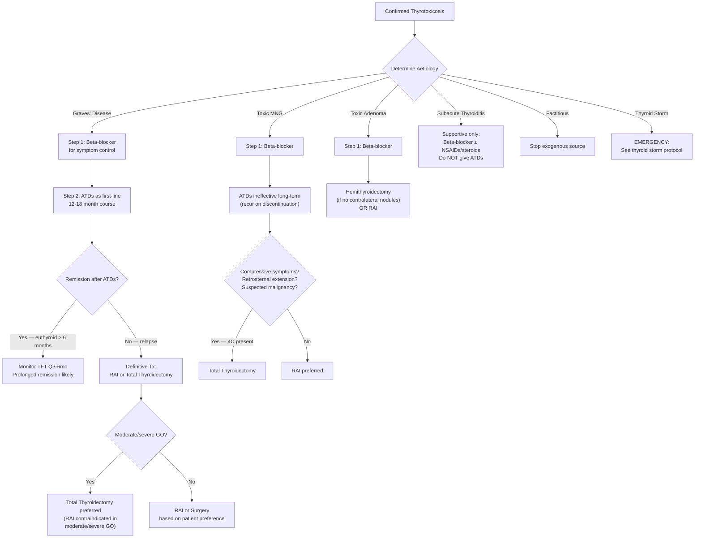
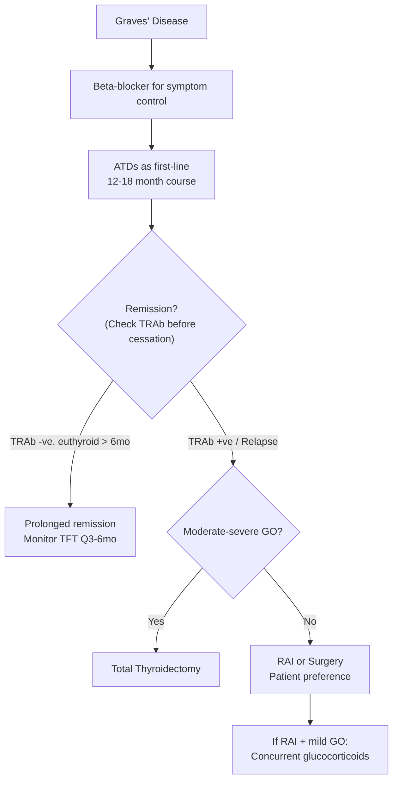

## Management of Hyperthyroidism

The management of hyperthyroidism follows a logical framework: **control symptoms immediately**, **reduce thyroid hormone levels**, and then decide on **definitive treatment** based on the underlying cause. Think of it as three layers:

1. **Symptomatic relief** (β-blockers — works in minutes to hours)
2. **Anti-thyroid drugs** (works in weeks — blocks new hormone synthesis)
3. **Definitive treatment** (RAI or surgery — cures the disease permanently)

The choice between these depends on the **aetiology**, **severity**, **patient demographics** (age, sex, pregnancy status), **comorbidities**, and **patient preference**.

---

## 1. Management Algorithm — Overview

---

## 2. Symptomatic Control — Beta-Blockers

### 2.1 Rationale

Many symptoms of thyrotoxicosis (tachycardia, tremor, anxiety, palpitations, sweating) are mediated by **enhanced β-adrenergic receptor sensitivity** — thyroid hormones upregulate β₁-receptor expression in the heart and increase catecholamine sensitivity throughout the body. Beta-blockers directly antagonise this.

### 2.2 Drug Choice

***Non-selective short-acting β-blocker (e.g. propranolol, nadolol) for short-term alleviation of symptoms*** [1].

| Drug | Dose | Why This Drug? |
|---|---|---|
| **Propranolol** | 20–80 mg TDS/QDS | Non-selective β-blocker; additionally **inhibits peripheral T4→T3 conversion** (a unique bonus over cardioselective agents); lipophilic → crosses BBB → ↓CNS symptoms (anxiety, tremor) |
| **Atenolol** | ***25–50 mg/d*** [1] | Cardioselective β₁-blocker; useful when propranolol contraindicated (e.g. asthma) but does NOT inhibit T4→T3 conversion |
| **Nadolol** | 40–160 mg OD | Long-acting non-selective; good for compliance (once daily) |

### 2.3 Important Notes

- Beta-blockers provide **symptomatic relief only** — they do NOT reduce thyroid hormone levels
- They are a **bridge** while waiting for ATDs or definitive treatment to take effect
- **Consider diltiazem** (non-dihydropyridine CCB) ***if β-blockers are contraindicated*** [6] (e.g. severe asthma, decompensated heart failure)
- Use with caution in thyrotoxic periodic paralysis — propranolol IV may paradoxically be useful to reverse ↑Na⁺/K⁺-ATPase activity in refractory cases [1]

---

## 3. Anti-Thyroid Drugs (ATDs)

### 3.1 Overview

***ATDs are usually the first-line treatment for Graves' disease*** — given as an initial trial of ***12–18 months*** [1][6]. The logic is: Graves' disease can undergo spontaneous remission (the autoimmune process may burn out), so you give ATDs time to control the disease while waiting to see if remission occurs.

### 3.2 Drug Classes — Thionamides

The three drugs in this class are:
- **Carbimazole** (CBZ) — prodrug converted to methimazole *in vivo*
- **Methimazole** (MMI) — active drug
- **Propylthiouracil** (PTU)

"Thionamide" → "thio" = sulphur, "amide" = nitrogen-containing functional group. These drugs contain a thiourea group that inhibits the thyroid peroxidase enzyme.

### 3.3 Mechanism of Action

***Thionamides inhibit the action of peroxidase*** [6]:
1. ***Inhibit iodination (organification) of tyrosine residues of thyroglobulin*** [6] — TPO normally oxidises iodide and incorporates it into Tg; thionamides block this step
2. ***Inhibit coupling of iodotyrosine*** [6] — TPO normally couples MIT+DIT→T3 and DIT+DIT→T4; thionamides block this too
3. ***Inhibit production of T3 and T4*** [6] — net result of steps 1 and 2
4. ***Inhibit peripheral conversion of T4 into T3 — only for PTU*** [1][6] — this is why PTU has a specific role in thyroid storm (need rapid ↓T3)
5. **Immunosuppressive effect** → ***↓serum TRAb levels*** [1] — this is why ATDs can lead to true remission in Graves' disease (not just biochemical control)

<Callout title="Why Is There a Delay in Effect?">
***The onset of euthyroid takes 3–4 weeks since the thyroid gland has large storage of hormones*** [6]. ATDs block NEW hormone synthesis but do nothing about the T4/T3 already stored in thyroid follicular colloid. The existing stores must be depleted before the drug's effect becomes clinically apparent. This is why we need beta-blockers as a bridge.
</Callout>

### 3.4 Choice of ATD

***Prefer carbimazole (over PTU)*** [1] for most patients:
- ***Achieves euthyroid more rapidly than PTU***
- ***Once daily dosing*** (better compliance)
- ***↓hepatotoxicity*** (PTU → hepatic necrosis; CBZ → cholestatic hepatitis, which is milder)
- ***↓bitter taste***
- ***Little or no effect on subsequent success of RAI***

***Prefer PTU only in*** [1]:
1. ***1st trimester of pregnancy (↓teratogenicity)*** — methimazole/carbimazole are associated with **aplasia cutis** and **choanal atresia**; PTU has lower teratogenicity and lower placental/breast milk transfer
2. ***Thyroid storm (↓peripheral conversion of T4 into T3)*** — faster reduction of active T3
3. ***Minor reactions to CBZ*** — cross-reactivity between CBZ and PTU is only ~50%, so some patients can tolerate the alternative

### 3.5 Dosing Regimens

***Two approaches*** [1]:

| Regimen | Description | Advantage | Disadvantage |
|---|---|---|---|
| **Titrating regimen** | ***Start high → titrate down by TSH*** [1]; e.g. CBZ 15–40 mg/d initially, then ↓ to 5–15 mg/d maintenance | Lower total drug dose → fewer S/E | Requires more frequent TFT monitoring |
| **Block and replace** | ***High-dose ATD + T4 replacement*** [1] | ***Useful in those where control is difficult (e.g. puberty)*** [1]; avoids hypothyroid swings | Higher drug dose → more S/E; cannot use in pregnancy |

***Initiation: start CBZ at 15–60 mg/d in 2–3 divided doses (depends on initial TFT) with baseline CBC and LFT*** [1].

***Subsequent: monitor TFT ± CBC/LFT every 4–6 weeks until euthyroid, then tail down gradually to 5–15 mg/d maintenance*** [1].

### 3.6 Duration and Outcome

***Duration of treatment: usually 12–18 months*** [1][6].

***Remission rate: usually < 40% after 1–2 years of treatment but can be > 80% if 5–10 years*** [1].

***Cessation: take TRAb titre before cessation*** [1]:
- ***+ve TRAb at end of treatment → ↑chance of relapse*** [1] → consider definitive treatment
- ***−ve TRAb → more likely to have prolonged remission*** [1]
- ***Monitor TFT every 2–3 months for recurrence → likely prolonged remission if euthyroid for > 6 months*** [1]

If relapse occurs: consider **repeating one more course** or proceeding to **definitive treatment** (RAI or surgery) [1].

### 3.7 Side Effects

| Side Effect | Frequency | Mechanism / Notes |
|---|---|---|
| ***Skin rash / urticaria / pruritus*** | ***5%*** [6] | ***Allergy — triggers release of histamine; treated by antihistamine*** [6] |
| ***Fever*** [6] | Uncommon | Drug hypersensitivity |
| ***Arthritis / Arthralgia*** [6] | Uncommon | Immune-mediated |
| ***Agranulocytosis*** | ***0.1–0.5%*** [1][6] | ***Occurs within first 2–3 months of treatment*** [1][6]; ***reversible***; ***↑with age ( > 40y) or high doses*** [1]; ***predicted by HLA-B*38:02:01 allele (mainly found in Asian population)*** [1]; ***presents with infection symptoms + fever (classically fever/sore throat while on ATD)*** [1] |
| ***Hepatotoxicity*** | Varies | ***Hepatic necrosis*** [6] — more common with PTU (up to 1/3 associated with ↑ALT/AST but rarely fulminant failure) [1]; CBZ causes cholestatic pattern (milder) |
| ***Teratogenicity*** | — | ***Aplasia cutis, choanal atresia (methimazole/carbimazole >> PTU)*** [1]; ***PTU preferred in 1st trimester*** |

<Callout title="Agranulocytosis — The Critical Side Effect" type="error">
***Agranulocytosis (0.1–0.5%)*** is the most feared side effect of thionamides. It typically occurs in the ***first 2–3 months*** and presents as ***fever and sore throat*** (because the patient has no neutrophils to fight infection). Every patient starting ATDs must be ***advised to seek help immediately if any symptoms of infection*** [1]. Check an urgent FBC if suspected. This is an **absolute contraindication** to continuing the same ATD.
</Callout>

---

## 4. Definitive Treatment — Radioactive Iodine (RAI)

### 4.1 Principle

***RAI (¹³¹I) is taken up and processed by the thyroid gland in the same way as normal iodide*** [6]. Its ***specificity to thyroid is due to preferential thyroid uptake via the Na-I cotransporter (NIS)*** [6]. Once inside follicular cells, ***it becomes incorporated into thyroglobulin*** and ***emits β-radiation*** (short-range, high-energy electrons) that ***destroys thyroid follicular cells by necrosis*** [6].

The result: **controlled destruction of the overactive thyroid tissue** → the gland can no longer produce excess hormone.

### 4.2 Indications

***RAI indications*** [1][6][17]:

| Indication | Rationale |
|---|---|
| ***Relapse after a course of ATD*** [1] | ATDs have failed to achieve permanent remission |
| ***Intolerant/allergic to ATDs*** [1] | Cannot use medical therapy |
| ***Complications (e.g. TPP)*** [1] | Need definitive cure to prevent recurrent attacks |
| ***Contemplating pregnancy in next 1–2 years*** [1] | Need stable euthyroid state before conception; ATDs have teratogenicity risk |
| ***Patient preference*** [1] | Some patients prefer definitive one-time treatment |
| ***Toxic MNG — preferred if no 4C*** [17] | See below for 4C criteria |
| ***Ablation of residual tumour tissues after thyroidectomy*** [6] | For differentiated thyroid cancer (separate indication) |

***For Graves' disease: RAI is generally second-line*** (after ATD trial) [17]:

| Condition | Preferred Treatment |
|---|---|
| ***Graves' disease*** | ***ATDs first-line; RAI second-line*** [17] |
| ***Toxic MNG (Plummer's)*** | ***ATDs ineffective long-term (recur upon discontinuation); RAI preferred if no 4C; surgery preferred if 4C*** [17] |
| ***Toxic adenoma*** | ***Hemithyroidectomy or RAI*** [17] |

### 4.3 Contraindications

***RAI is contraindicated in*** [6]:

| Contraindication | Rationale |
|---|---|
| ***Pregnancy*** (all trimesters, but specifically noted ***3rd trimester*** [6]) | ***Damage of thyroid gland of fetus*** [6] — fetal thyroid begins concentrating iodine from ~12 weeks gestation |
| ***Breastfeeding*** | ***Secreted in breastmilk*** [6] — radiation exposure to infant |
| ***Children and adolescents*** | ***Avoid potential teratogenicity in young age*** [6] — although evidence of actual long-term harm is limited, caution is exercised |
| ***Moderate/severe Graves' ophthalmopathy*** | ***Moderate/severe GO is a contraindication to RAI treatment*** [1][4] — RAI can worsen eye disease by releasing thyroid antigens during gland destruction → ↑TRAb → ↑orbital inflammation |

***If RAI is used in patients with active mild orbitopathy, glucocorticoids should be administered concurrently for those with risk factors for progression (smoking, high baseline T3 or TRAb levels)*** [1][4].

### 4.4 Preparation and Precautions

***Before ¹³¹I therapy*** [6]:
- ***Discussion of treatment options and patient's consent***
- ***Instruct patients on post-therapy precautions and follow-ups***
- ***Avoid iodine-containing food, medicine (cough suppressant) or radiological contrast for ≥ 4 weeks*** before therapy — excess stable iodine competes with ¹³¹I for uptake by NIS, reducing therapeutic efficacy
- ***Avoid anti-thyroid medications for ≥ 4 weeks*** before therapy — ATDs inhibit organification and thus ↓¹³¹I incorporation into thyroglobulin, reducing efficacy
- ***Symptomatic control of hyperthyroidism by propranolol*** during this washout period
- ***Pregnancy test for patients with child-bearing potential***

***After ¹³¹I therapy*** [6]:
- ***Symptomatic control of hyperthyroidism by propranolol*** (effect of RAI takes weeks)
- ***Discharge home immediately and avoid close contact with others*** (radiation precaution)
- ***Safe contraception ≥ 6 months***
- ***Avoid pregnancy and breastfeeding ≥ 6 months***

### 4.5 Complications of RAI

| Complication | Frequency | Mechanism |
|---|---|---|
| ***Hypothyroidism (permanent)*** | ***10–15% in first 2 years, then 3% per year*** [6] | ***Late effects of radiation and of lymphocytic infiltration and destruction of thyroid tissue*** [6]; virtually all patients become hypothyroid eventually → require lifelong T4 replacement |
| ***Transient hypothyroidism*** | ***3.5–28%*** [6] | Temporary gland dysfunction in early post-treatment period |
| **Radiation thyroiditis** | ~1–5% | Acute inflammation in first 1–2 weeks; painful neck |
| **Worsening of Graves' ophthalmopathy** | Variable | Release of thyroid antigens → ↑TRAb → orbital inflammation |
| **Transient thyrotoxicosis** | Rare | Release of stored hormone from damaged follicles |

***Important reassurances*** [6]:
- ***NO effect on fertility***
- ***NO effect on congenital malformations*** (in future pregnancies after appropriate waiting period)
- ***NO effect on increased cancer risk of offspring***

<Callout title="RAI and Graves' Ophthalmopathy — Key Exam Point">
RAI can worsen Graves' ophthalmopathy because destruction of thyroid tissue releases thyroid antigens, triggering an immune flare that ↑TRAb levels. This is why **moderate/severe GO is a contraindication** to RAI [1][4]. For mild GO, concurrent glucocorticoids should be given to mitigate this risk in patients with risk factors (smokers, high T3/TRAb) [1][4].
</Callout>

---

## 5. Definitive Treatment — Surgery (Thyroidectomy)

### 5.1 Types of Surgery

| Procedure | What It Involves | When Used |
|---|---|---|
| **Total thyroidectomy** | Removal of entire thyroid gland | Graves' disease (definitive), toxic MNG, thyroid cancer |
| **Hemithyroidectomy (lobectomy)** | Removal of one lobe + isthmus | ***Toxic adenoma (if no evidence of nodules in contralateral lobe)*** [17] |
| **Subtotal thyroidectomy** | Leave a small remnant (~4–8g) | Historically used for Graves'; now largely replaced by total thyroidectomy (↓recurrence risk) |

### 5.2 Indications for Surgery

***Surgical indications*** [6][17]:

| Indication | Rationale |
|---|---|
| ***Obstructive goitre*** [6] | Compressing trachea/oesophagus causing dyspnoea, dysphagia, stridor |
| ***Multinodular goitre*** [6] | Multiple nodules requiring histological assessment and definitive treatment |
| ***Thyroid carcinoma*** [6] | Oncological indication |
| ***Pregnant women intolerant to anti-thyroid medications*** [6] | Cannot use ATDs (allergic/agranulocytosis) and RAI is absolutely contraindicated in pregnancy → surgery is the only option (best performed in 2nd trimester) |
| ***Refractory to ATDs / Refused ¹³¹I / Thyroid eye signs*** [6] | When other modalities are not feasible or not preferred |
| ***Relapsed after ATD course*** [1] | Definitive cure needed |
| ***Patient preference*** [1] | Some prefer definitive surgical cure |

***The "4C" indications for surgery over RAI in toxic MNG*** [17]:

The concept of "4C" determines whether surgery or RAI is preferred for toxic MNG:

| 4C | Meaning | Why Surgery Is Preferred |
|---|---|---|
| **Compression** | Obstructive symptoms (dyspnoea, stridor, dysphagia) | RAI may cause initial gland swelling → worsening compression; surgery provides immediate decompression |
| **Cancer** suspected | Suspicious nodule on USG/FNAC | Need histological diagnosis that RAI cannot provide |
| **Cosmesis** | Large visible goitre causing cosmetic concern | RAI may not adequately shrink a very large goitre |
| **Co-existing hyperparathyroidism** | Concomitant primary hyperparathyroidism needing surgery | Can address both in one operation |

***For toxic MNG: RAI preferred if no 4C; surgery preferred if 4C*** [17].

### 5.3 Pre-operative Preparation in Thyrotoxic Patients

This is critically important: ***patients should be brought to euthyroid before surgery to avoid possible thyroid storm*** [6].

**Why?** An uncontrolled thyrotoxic patient undergoing the stress of surgery (anaesthesia, pain, catecholamine release) is at high risk of precipitating thyroid storm — a life-threatening emergency.

**Pre-operative protocol:**

| Step | Details | Rationale |
|---|---|---|
| **ATDs** | Continue carbimazole/PTU until euthyroid (TFTs normalised) | Block new hormone synthesis |
| **Beta-blockers** | Propranolol to achieve resting HR < 80 bpm | Control adrenergic symptoms |
| **Lugol's iodine** (potassium iodide) | 5–10 drops TDS for **10–14 days** before surgery | **Wolff-Chaikoff effect**: high iodine concentration paradoxically inhibits organification → ↓hormone synthesis; also ↓thyroid vascularity (makes surgery easier and reduces blood loss) |
| **Achieve euthyroid state** | Confirm normal TFTs before proceeding | Safety requirement |

<Callout title="Lugol's Iodine — The Wolff-Chaikoff Effect">
Lugol's iodine is given pre-operatively for two reasons: (1) The Wolff-Chaikoff effect — acute high-dose iodine inhibits TPO-mediated organification, providing a rapid temporary block on hormone synthesis. (2) It reduces thyroid blood flow and vascularity, making the gland firmer and less vascular at surgery → ↓intraoperative bleeding. It must be given AFTER starting ATDs (otherwise it could paradoxically fuel more hormone synthesis in autonomous tissue via the Jod-Basedow effect).
</Callout>

### 5.4 Complications of Thyroidectomy

| Complication | Mechanism | Frequency |
|---|---|---|
| ***Hypothyroidism*** | Removal of thyroid tissue → insufficient T4 production | ***100% after total thyroidectomy*** [17] → requires lifelong T4 replacement |
| ***Hypoparathyroidism → Hypocalcaemia*** | ***Compromise of parathyroid gland*** [6][17] — parathyroids are tiny and embedded in the posterior thyroid capsule; can be devascularised, injured, or inadvertently removed | Transient: 10–30%; Permanent: 1–3% |
| ***Recurrent laryngeal nerve (RLN) injury → Vocal cord paralysis*** [6][17] | RLN runs in the tracheo-oesophageal groove, intimately related to the inferior thyroid artery and Berry's ligament; can be stretched, compressed, or transected | Unilateral: hoarseness (1–2%); Bilateral: airway obstruction → emergency tracheostomy |
| ***Thyroid storm*** [6] | If patient not adequately prepared pre-operatively | Preventable with proper pre-op preparation |
| ***Haemorrhage*** [6] | Post-operative bleeding into the surgical bed | ***Compression and oedematous effect compresses on trachea*** [6] → airway emergency; may require urgent wound exploration |
| **External branch of SLN injury** | Runs with superior thyroid artery; damage → loss of high-pitched voice (important for singers, teachers) | 0–25% (often subclinical) |
| **Wound infection / Scar** | Standard surgical complications | Low |

***Hungry bone syndrome leading to hypocalcaemia*** [6]:
- ***Definition: severe and prolonged hypocalcaemia despite normal or even elevated levels of PTH***
- ***Pathogenesis: sudden removal of the effect of high circulating levels of PTH*** (in previously hyperthyroid patients with ↑bone turnover) → ***leads to increased influx of calcium into bones***
- ***Associated with hypophosphataemia and hypomagnesaemia***

<Callout title="Post-Thyroidectomy Hypocalcaemia — Must Know" type="error">
Always monitor Ca²⁺ post-thyroidectomy. Symptoms: perioral tingling, Chvostek's sign (facial twitch on tapping), Trousseau's sign (carpopedal spasm with BP cuff). ***Fast replacement: IV 10–20 mL of 10% calcium gluconate over 10 minutes (slow bolus). Maintenance: calcium carbonate + calcitriol (Vitamin D)*** [6].
</Callout>

---

## 6. Management by Specific Aetiology

### 6.1 Graves' Disease

***Approach to management (with reference to ETA 2018)*** [1]:
1. ***Symptom control: β-blockers (e.g. atenolol 25–50 mg/d) to ↓adrenergic symptoms*** [1]
2. ***ATDs: usually as first-line for 12–18 month course as initial trial of treatment*** [1]
3. ***Definitive treatment: RAI, total thyroidectomy*** [1]

***Indications for definitive treatment*** [1]:
- ***Relapsed after a course of ATD***
- ***Intolerant/allergic to ATDs***
- ***Complications (e.g. TPP)***
- ***Contemplating pregnancy (in next 1–2 years)***
- ***Patient preference***

***ATDs are generally preferred as initial treatment especially if high likelihood of remission (small goitre, −ve/low TRAb, mild disease) and unsuitable for other modalities*** [1].

### 6.2 Toxic Multinodular Goitre

***ATDs are ineffective long-term (recur upon discontinuation)*** [17] — because the underlying problem is autonomous nodular tissue with somatic mutations, not an autoimmune process that can remit. ATDs can achieve biochemical control but will not cure the disease.

***Prolonged use of ATDs only if patient does not want RAI or surgery*** [17].

***Definitive treatment*** [17]:
- ***RAI preferred if no 4C*** (compression, cancer, cosmesis, co-existing hyperparathyroidism)
- ***Surgery (total thyroidectomy) preferred if 4C present***

### 6.3 Toxic Adenoma

- ***Hemithyroidectomy (if no evidence of nodules in contralateral lobe)*** [17]
- RAI is an alternative for patients preferring non-surgical approach

### 6.4 Subacute Thyroiditis

***Self-limiting → do NOT give anti-thyroid medications*** [1] — because the gland is NOT overproducing hormone; stored T4 is simply leaking from damaged follicles. ATDs block synthesis (which is already suppressed), so they serve no purpose here.

***Management*** [1]:
- ***No treatment needed in mild cases: spontaneous resolution***
- ***NSAIDs/corticosteroids for severe cases → manage systemic upset + pain*** [1]
- ***β-blocker for hyperthyroid phase (usually mild) → for symptomatic control only*** [1]
- ***Temporary T4 replacement for hypothyroid phase if pronounced or symptomatic*** [1]

### 6.5 Surgery for Benign Thyroid Nodules (Non-Toxic)

***Indications of treatment for benign thyroid nodules*** [16]:
- ***Symptomatic (size of goitre/nodule)***
- ***Increase in goitre size***
- ***Trachea compression or deviation***
- ***Retrosternal extension***
- ***Suspected malignancy***
- ***Cosmetic considerations / patient wish***

---

## 7. Management of Graves' Ophthalmopathy

This deserves special attention because it follows its own management pathway, independent of thyroid status.

***Key principles*** [1][4]:

1. ***Smoking cessation: smoking renders patients more refractory to anti-inflammatory therapy*** [1][4]
2. ***Reversal of hyperthyroidism if present*** [1][4]:
   - ***Choice: total thyroidectomy, thionamides***
   - ***Effect: ↓thyroid antigen load → usually associated with ↓TRAb titres***
   - ***Moderate/severe GO is a contraindication to RAI treatment*** [1][4]
3. ***Local symptomatic control*** [1][4]:
   - ***Exposure-related discomfort: eye shades, artificial tears, eye lubricants (e.g. 1% methylcellulose)***
   - ***Diplopia: eye patching, prisms***

### 7.1 Severity-Based Management

| ***Severity*** | ***Features*** | ***Management*** [1][4] |
|---|---|---|
| ***Sight-threatening*** | ***Dysthyroid optic neuropathy (DON)*** | ***IV glucocorticoids (e.g. dexamethasone 4 mg IV) + urgent orbital decompression surgery*** |
| | ***Exposure keratopathy*** | ***Eyelid taping or temporary tarsorrhaphy; ocular lubrication; ± orbital decompression surgery*** |
| ***Moderate to severe*** | ***Lid retraction ≥ 2 mm; moderate/severe soft tissue involvement; exophthalmos ≥ 3 mm above normal; inconstant/constant diplopia*** | **Active disease:** ***Oral or IV glucocorticoids (e.g. prednisolone 30 mg/d × 4 weeks); rituximab, MMF, orbital RT if ineffective; newer therapy: tocilizumab (anti-IL6), teprotumumab (anti-IGF-1 receptor); consider orbital decompression surgery*** |
| | | **Inactive disease (surgery in order):** ***Orbital decompression surgery (↓DON, ↓proptosis) → EOM surgery (↓diplopia, 6–8 weeks after orbital surgery) → Eyelid surgery (↓ocular exposure, enhance cosmesis)*** |
| ***Mild*** | ***Lid retraction < 2 mm; transient or no diplopia; corneal exposure responsive to lubricants*** | ***Local measures for relief of symptoms; selenium for 6 months may improve soft-tissue swelling*** |

---

## 8. Management of Thyroid Storm

Thyroid storm is a **life-threatening emergency** — essentially decompensated thyrotoxicosis with multi-organ dysfunction. Mortality is 10–30% even with treatment.

### 8.1 Pathophysiology

***Thyroid storm develops in patients with longstanding untreated hyperthyroidism which is precipitated by acute event such as surgery, trauma or infection*** [6]. ***Rapid ↑ in serum thyroid hormone levels leads to increased response to sympathetic inputs from catecholamines by permissive effect*** [6]. This causes ***cardiovascular symptoms including hyperpyrexia, tachycardia, hypertension followed by heart failure with hypotension and arrhythmia*** [6].

### 8.2 Management Protocol

**Treatment must address multiple targets simultaneously:**

***General measures*** [6]:
- ***Correction of hyperthermia with paracetamol (NOT salicylate) and physical cooling*** — Why not aspirin/salicylates? Because salicylates displace T4 from TBG → ↑free T4 → worsens thyrotoxicosis
- ***Correction of dehydration with IV fluid replacement***
- ***Supportive therapy: O₂ supplementation, digoxin or diuretic for congestive heart failure and AF***

***Medical treatment*** [6]:

| Timing | Drug | Mechanism |
|---|---|---|
| ***Initial regimen*** | ***Propylthiouracil*** | Blocks new T4/T3 synthesis + ***↓peripheral T4→T3 conversion*** (unique to PTU — this is why PTU is preferred over CBZ in thyroid storm) |
| | ***Hydrocortisone*** (100 mg IV Q8h) | ↓peripheral T4→T3 conversion; treats possible relative adrenal insufficiency (↑metabolic clearance of cortisol in thyrotoxicosis); anti-inflammatory |
| | ***Propranolol*** | ↓adrenergic symptoms; ↓peripheral T4→T3 conversion (non-selective β-blocker) |
| ***Following regimen (after 1 hour)*** | ***Iodide: Lugol's solution, sodium iodide (NaI), or ipodate*** | ***Block thyroid hormone RELEASE*** via Wolff-Chaikoff effect. **MUST be given ≥1 hour AFTER ATD** — if given before, the iodine load could serve as substrate for new hormone synthesis (Jod-Basedow effect in a gland not yet blocked by ATDs) |

***If β-blockers contraindicated*** → ***consider diltiazem*** [6]

***If anti-thyroid drugs contraindicated*** → ***consider lithium carbonate (LiCO₃)*** [6] — lithium inhibits thyroid hormone release (blocks proteolysis of thyroglobulin)

***Desperate cases*** → ***consider plasmapheresis and charcoal haemoperfusion*** [6] — physically removes circulating thyroid hormone from the blood

<Callout title="Thyroid Storm Treatment Order — Must Memorise">
The order matters:
1. **PTU first** (block synthesis)
2. **Wait 1 hour**
3. **Then iodide** (block release)

If you give iodide BEFORE PTU, the iodine floods into an unblocked gland and becomes substrate for MORE hormone synthesis → worsens the storm. Always block synthesis first, THEN block release.
</Callout>

---

## 9. Post-Treatment Follow-Up and Thyroid Hormone Replacement

### 9.1 After Total Thyroidectomy

- ***Hypothyroidism is 100% after total thyroidectomy*** [17] → **lifelong levothyroxine (T4) replacement**
- ***Start T4 therapy immediately postoperatively*** (unless RAI ablation is planned) [6]
- Monitor TSH to titrate dose

### 9.2 After Hemithyroidectomy

- ***Do NOT start T4 therapy immediately postoperatively*** [6]
- ***Measure serum TSH 6 weeks after surgery and determine the need for T4 based upon TSH and evaluation of postoperative disease status*** [6]
- Many patients remain euthyroid with one functioning lobe

### 9.3 After RAI

- Virtually all patients eventually become hypothyroid → lifelong T4 replacement
- Monitor TFTs at 4–6 weeks, then 3-monthly for the first year, then annually
- May need repeat RAI if persistent thyrotoxicosis (10–20% need second dose)

### 9.4 Thyroid Hormone Replacement — Precautions

***Precautions with levothyroxine*** [6]:
- ***Osteoporosis → calcium supplements required*** (over-replacement ↑bone resorption)
- ***Atrial fibrillation and cardiac dysfunction → may withhold or reduce treatment*** (excess T4 ↑cardiac workload → ↑AF risk, ↑angina)
- ***Acute adrenal crisis*** — ***↑metabolic clearance of adrenocortical hormones → ↓cortisol and aldosterone → contraindicated in patients with adrenal insufficiency*** [6] (always exclude/treat adrenal insufficiency BEFORE starting T4 — otherwise the ↑metabolic rate from T4 will ↑cortisol demand that the adrenals cannot meet → crisis)

---

## 10. Subclinical Hyperthyroidism — When to Treat

Not all patients with suppressed TSH need treatment. The decision depends on the **degree of TSH suppression** and **risk factors**:

| TSH Level | Risk Category | Management |
|---|---|---|
| TSH < 0.1 mU/L (grade 2) | Higher risk of AF, osteoporosis | Consider treatment, especially if age > 65, postmenopausal women, cardiovascular risk factors |
| TSH 0.1–0.4 mU/L (grade 1) | Lower risk | Observe and repeat TFTs in 3–6 months; treat if progresses or if high-risk patient |

---

<Callout title="High Yield Summary — Management of Hyperthyroidism">

**Three pillars:** Beta-blockers (symptom control) → ATDs (reduce hormone synthesis) → Definitive Tx (RAI or surgery)

**ATDs (thionamides):**
- CBZ preferred over PTU (except 1st trimester pregnancy, thyroid storm, CBZ allergy)
- MoA: inhibit TPO → ↓organification, coupling; PTU also ↓peripheral T4→T3 conversion
- Duration: 12–18 months; remission rate < 40% at 1–2 years
- Feared S/E: agranulocytosis (0.1–0.5%, first 2–3 months, presents as fever + sore throat)
- Check TRAb before cessation: +ve → ↑relapse risk

**RAI:**
- Contraindicated in pregnancy, breastfeeding, children, moderate/severe GO
- Stop ATDs and iodine-containing substances ≥ 4 weeks before
- Nearly all patients become hypothyroid eventually → lifelong T4
- Safe contraception ≥ 6 months after

**Surgery:**
- Total thyroidectomy for Graves'/toxic MNG; hemithyroidectomy for toxic adenoma
- Pre-op: ATDs + beta-blocker + Lugol's iodine (Wolff-Chaikoff effect + ↓vascularity)
- Complications: hypothyroidism (100%), hypoparathyroidism, RLN injury, haemorrhage

**By aetiology:**
- Graves': ATDs first-line → definitive if relapse
- Toxic MNG: ATDs ineffective long-term; RAI if no 4C, surgery if 4C
- Toxic adenoma: hemithyroidectomy or RAI
- Subacute thyroiditis: do NOT give ATDs; supportive only

**Thyroid storm:** PTU + hydrocortisone + propranolol → then iodide (after ≥ 1 hour). NOT salicylates (displaces T4 from TBG). Order matters: block synthesis BEFORE blocking release.

**GO management:** Smoking cessation; moderate/severe GO = contraindication to RAI; sight-threatening = IV steroids + urgent orbital decompression

</Callout>

---

<ActiveRecallQuiz
  title="Active Recall - Management of Hyperthyroidism"
  items={[
    {
      question: "Why is carbimazole preferred over PTU in most patients? Give 3 specific exceptions where PTU is preferred instead.",
      markscheme: "CBZ preferred because: achieves euthyroid faster, once daily dosing, lower hepatotoxicity, less bitter taste, no effect on subsequent RAI success. PTU preferred in: (1) First trimester of pregnancy (lower teratogenicity — CBZ causes aplasia cutis and choanal atresia). (2) Thyroid storm (PTU uniquely inhibits peripheral T4 to T3 conversion). (3) Minor allergic reactions to CBZ.",
    },
    {
      question: "A patient with Graves' disease and moderate-severe ophthalmopathy relapses after 18 months of ATDs. What definitive treatment do you recommend and why?",
      markscheme: "Total thyroidectomy is preferred. RAI is contraindicated in moderate/severe Graves' ophthalmopathy because RAI causes release of thyroid antigens during gland destruction, triggering increased TRAb production, which worsens orbital inflammation. Surgery removes the antigenic stimulus without this immune flare.",
    },
    {
      question: "In thyroid storm management, why must PTU be given at least 1 hour BEFORE iodide? What happens if you reverse the order?",
      markscheme: "PTU must be given first to block thyroid peroxidase (organification and coupling). If iodide is given before the gland is blocked by PTU, the large iodine load provides substrate for increased hormone synthesis (Jod-Basedow effect), paradoxically worsening the thyroid storm. The sequence is: block synthesis first (PTU), then block release (iodide after 1 hour).",
    },
    {
      question: "Why are ATDs ineffective as long-term treatment for toxic multinodular goitre, unlike in Graves' disease?",
      markscheme: "In Graves' disease, the underlying problem is autoimmune (TRAb production), which can undergo spontaneous remission — ATDs buy time for this to occur plus have an immunosuppressive effect (reduce TRAb). In toxic MNG, the problem is somatic activating mutations in TSHr or Gs-alpha in autonomous nodules — these are structural genetic changes that will not remit. ATDs control hormone synthesis while taken but the autonomous nodules resume overproduction immediately on discontinuation.",
    },
    {
      question: "List the 4C indications that favour surgery over RAI for toxic multinodular goitre.",
      markscheme: "4C: (1) Compression — obstructive symptoms (dyspnoea, stridor, dysphagia). (2) Cancer suspected — suspicious nodule on USG/FNAC needing histological diagnosis. (3) Cosmesis — large visible goitre. (4) Co-existing hyperparathyroidism — can address both surgically in one operation.",
    },
    {
      question: "Why is paracetamol used instead of aspirin for hyperpyrexia in thyroid storm?",
      markscheme: "Aspirin (salicylates) displaces T4 from thyroxine-binding globulin (TBG), increasing the free T4 fraction in the blood, which paradoxically worsens thyrotoxicosis. Paracetamol does not affect TBG binding and is therefore safe to use for temperature control in thyroid storm.",
    },
  ]}
/>

## References

[1] Senior notes: Ryan Ho Endocrine.pdf (Sections 1.4.1–1.4.2, pp. 24–28)
[4] Senior notes: Ryan Ho Opthalmology.pdf (Section 7.1, pp. 129–130)
[5] Senior notes: Ryan Ho Diagnostic Radiology.pdf (Section 2a, p. 59)
[6] Senior notes: felixlai.md (Sections VI–VII, pp. 985–989, 1011–1012)
[16] Lecture slides: GC 177. A thyroid nodule benign thyroid nodules; thyroid cancer.pdf (pp. 14, 20)
[17] Senior notes: maxim.md (Thyrotoxicosis — Indications table; Surgery for thyroid nodules)
