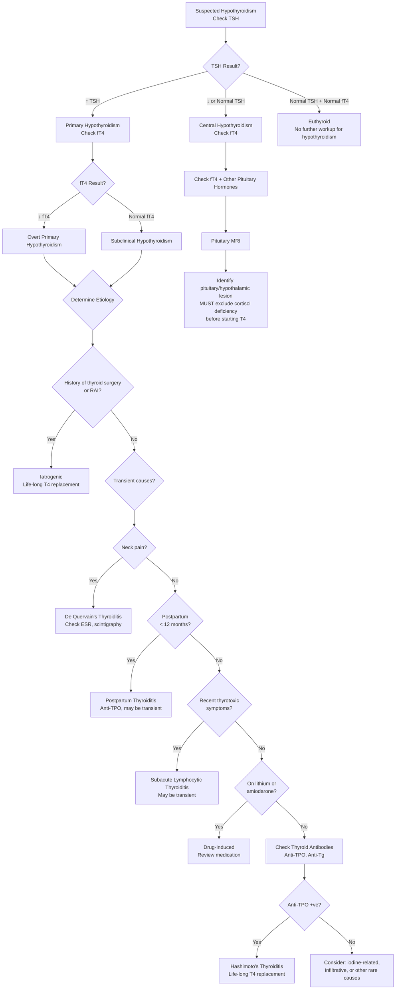

## Differential Diagnosis of Hypothyroidism

### Framing the Problem

When we say "differential diagnosis of hypothyroidism," we are really asking two related but distinct questions:

1. **The patient presents with symptoms suggestive of hypothyroidism** (fatigue, weight gain, constipation, cold intolerance, etc.) — **what else could mimic this clinical picture?** (i.e., clinical DDx)
2. **The TFTs confirm hypothyroidism** (↑TSH ± ↓fT4) — **what is the underlying cause?** (i.e., etiological DDx)

Both are essential for exams. Let's tackle each systematically.

---

### Part A: Clinical Differential Diagnosis — "What Else Looks Like Hypothyroidism?"

The symptoms of hypothyroidism are notoriously **non-specific**. Fatigue, weight gain, constipation, and low mood are among the most common presenting complaints in primary care for *any* reason. This is why hypothyroidism is a great mimic — and why TFTs are so frequently checked.

The clinical DDx depends on the **dominant presenting symptom(s)**:

#### 1. Fatigue / Lethargy as the Dominant Complaint

| Differential | Key Distinguishing Features | Why It Mimics Hypothyroidism |
|---|---|---|
| **Depression** | Pervasive low mood, anhedonia, sleep disturbance (early morning waking), guilt, suicidal ideation. ***TFT for hypothyroidism is part of minimum workup for dementia and depression*** [13][14] | Both cause fatigue, psychomotor slowing, weight change, poor concentration |
| **Anaemia** (iron def, B12 def, chronic disease) | Pallor, tachycardia (cf. bradycardia in hypothyroidism), koilonychia (iron def), glossitis (B12 def). Check CBC, iron studies, B12/folate | Both cause fatigue and pallor; pernicious anaemia may coexist with autoimmune hypothyroidism [9] |
| **Chronic fatigue syndrome** | Diagnosis of exclusion; ≥6 months unexplained fatigue not relieved by rest; no specific lab abnormalities | Fatigue is the dominant symptom in both |
| **Obstructive sleep apnoea** | Snoring, witnessed apnoeas, daytime somnolence, obesity, large neck. ***Secondary causes of OSA include acromegaly and hypothyroidism (submucosal infiltration)*** [10] | Both cause fatigue and daytime sleepiness; hypothyroidism itself is a risk factor for OSA |
| **Diabetes mellitus** | Polyuria, polydipsia, weight loss (T1DM) or insidious fatigue with metabolic syndrome features (T2DM) [12] | Fatigue is prominent in both; DM and hypothyroidism may coexist |
| **Addison's disease (adrenal insufficiency)** | Hyperpigmentation, postural hypotension, hyperkalaemia, hyponatraemia, weight *loss* (cf. weight *gain* in hypothyroidism) | Both cause fatigue, lethargy, and may coexist in autoimmune polyendocrine syndrome |
| **Heart failure** | Dyspnoea, orthopnoea, peripheral oedema (pitting, cf. non-pitting myxoedema), raised JVP | Fatigue, oedema, and exercise intolerance in both |
| **Chronic kidney disease** | Uraemic symptoms (nausea, pruritus), pallor, oedema; elevated creatinine. ***Hypothyroidism can also cause ↑creatinine (↓GFR)*** | Fatigue, pallor, oedema overlap |
| **Malignancy (occult)** | Weight loss (cf. weight gain), night sweats, specific organ symptoms | Fatigue, anaemia, low energy in both |

#### 2. Weight Gain as the Dominant Complaint

| Differential | Key Distinguishing Features |
|---|---|
| **Simple obesity / sedentary lifestyle** | Most common cause of weight gain; no other hypothyroid features |
| **Cushing's syndrome** | Central obesity, moon face, buffalo hump, striae (purple/wide), proximal myopathy, thin skin, easy bruising, HTN, hyperglycaemia. Key distinction: Cushing's has *thin* skin and purple striae; hypothyroidism has *thick*, dry skin |
| **Polycystic ovarian syndrome (PCOS)** | Young women with oligomenorrhoea, hirsutism, acne, insulin resistance [12] |
| **Medication-related** | Corticosteroids, antipsychotics (olanzapine, clozapine), insulin, sulfonylureas, valproate, gabapentin |
| **Oedema from other causes** | Nephrotic syndrome (periorbital + dependent pitting oedema, proteinuria), heart failure, liver cirrhosis |

#### 3. Constipation as the Dominant Complaint

| Differential | Key Distinguishing Features |
|---|---|
| **Functional constipation / IBS-C** | No alarm features, normal investigations |
| **Medication-induced** | Opioids, anticholinergics, calcium channel blockers, iron supplements |
| **Colorectal pathology** | Change in bowel habit + rectal bleeding → consider malignancy |
| **Hypercalcaemia** | Polyuria, polydipsia, confusion, "bones, stones, groans, moans" |
| **Parkinson's disease** | Tremor, rigidity, bradykinesia → autonomic dysfunction causes constipation |
| ***Hypothyroidism*** | ↓GI motility; ***hypothyroidism is listed as a cause of paralytic ileus*** [8] |

#### 4. Cognitive Decline / Depression as the Dominant Complaint

| Differential | Key Distinguishing Features |
|---|---|
| **Major depressive disorder** | Meets criteria for depressive episode; ***hypothyroidism is a key secondary cause of depression that must be excluded*** [14] |
| **Dementia (early)** | Progressive cognitive decline with ADL impairment; ***TFT for hypothyroidism is part of NICE minimum workup for dementia*** [13] |
| **Vitamin B12 deficiency** | Subacute combined degeneration, peripheral neuropathy, macrocytic anaemia, glossitis [9] |
| **Normal pressure hydrocephalus** | Classic triad: gait apraxia, urinary incontinence, dementia [13] |
| **Medication side effects** | Sedatives, anticholinergics, beta-blockers |

#### 5. Bradycardia as the Dominant Finding

| Differential | Key Distinguishing Features |
|---|---|
| **Sick sinus syndrome** | ***Extrinsic causes include hypothyroidism*** [15]. ECG: inappropriate severe bradycardia < 50, sinus pauses, tachy-brady syndrome |
| **Drug-induced** | Beta-blockers, calcium channel blockers (verapamil, diltiazem), digoxin, amiodarone |
| **Athlete's heart** | Young, fit individual with physiological resting bradycardia; asymptomatic |
| **↑Intracranial pressure** | Cushing's reflex: bradycardia + hypertension + irregular breathing |
| **Heart block** | ECG: prolonged PR (1st degree), dropped beats (2nd degree), AV dissociation (3rd degree) |

#### 6. Menorrhagia / Subfertility as the Dominant Complaint

| Differential | Key Distinguishing Features |
|---|---|
| **Hypothyroidism** | ↑TRH → ↑prolactin → menstrual disturbance; ↓T4 → anovulation |
| **Uterine fibroids / polyps** | Pelvic ultrasound findings; heavy periods with clots |
| **Coagulopathy** (e.g. von Willebrand disease) | Lifelong heavy periods, easy bruising, family history |
| **PCOS** | Oligomenorrhoea (not menorrhagia), hirsutism, ↑androgens |
| **Hyperprolactinaemia** (other causes) | Pituitary adenoma, medications (antipsychotics, metoclopramide) |

#### 7. Hypercholesterolaemia on Blood Tests

***Hypothyroidism is a key secondary cause of elevated LDL cholesterol*** [5]. Before starting statins for newly discovered hyperlipidaemia, always check TFTs — treating the hypothyroidism may normalize the lipid profile without the need for lipid-lowering therapy.

Other secondary causes of ↑LDL to consider [5]:
- Nephrotic syndrome
- DM
- Cholestasis
- Immunoglobulin disorders (myeloma)
- Anorexia nervosa

<Callout title="Clinical Pearl — Always Check TFTs" type="idea">
Hypothyroidism is such a common mimic that TFTs should be checked in the workup of:
- ***New-onset depression or cognitive decline*** [13][14]
- Unexplained fatigue
- ***New-onset hyperlipidaemia*** [5]
- Unexplained bradycardia [15]
- ***Dementia workup (NICE minimum investigation)*** [13]
- Unexplained menorrhagia or subfertility
- Unexplained weight gain
- ***Daytime sleepiness / suspected OSA*** [10]
- Unexplained hyponatraemia (hypothyroidism can cause ↓free water clearance; must exclude before diagnosing SIADH) [16]
</Callout>

---

### Part B: Etiological Differential Diagnosis — "The TFTs Confirm Hypothyroidism. What Is the Cause?"

Once TFTs confirm hypothyroidism (typically ↑TSH + ↓fT4 for primary), the next step is to determine the **underlying etiology**, because management differs:

The approach is ***mainly directed to differentiate those who require life-long T4 replacement from those who may only have transient hypothyroidism*** [1]:

**Life-long T4 replacement needed** [1]:
- ***Autoimmune thyroiditis*** (Hashimoto's, atrophic thyroiditis)
- ***Thyroid ablation*** (post-thyroidectomy, post-RAI)

**Possibly transient hypothyroidism** [1]:
- ***Transient thyroiditis*** as suggested by:
  - ***Neck pain*** (de Quervain's)
  - *** < 12 months postpartum*** (postpartum thyroiditis)
  - ***Recent symptoms of thyrotoxicosis*** (hypothyroid phase following destructive thyroiditis)
- *** < 6 months since ¹³¹I or thyroidectomy*** (may still be evolving)
- ***On lithium or amiodarone*** (drug-induced, may be reversible)

#### Systematic Etiological DDx Table

| Category | Specific Cause | Goitre? | Key Distinguishing Features | Permanence |
|---|---|---|---|---|
| **Autoimmune** | Hashimoto's thyroiditis | Yes (firm, rubbery, diffuse) or No (atrophic variant) | Anti-TPO +ve (90–100%), anti-Tg (80–90%); firm diffuse goitre; other autoimmune diseases [1] | Permanent (usually) |
| **Autoimmune** | Atrophic thyroiditis | No | Anti-TSHr blocking Ab predominant; no goitre [1] | Permanent |
| **Iatrogenic** | Post-thyroidectomy | No (thyroidectomy scar) | History + surgical scar; ***100% after total thyroidectomy*** [1] | Permanent |
| **Iatrogenic** | Post-RAI | No (or small remnant) | History of RAI for Graves'/toxic nodule; may develop months to years after | Permanent |
| **Iatrogenic** | External radiation | No | History of radiotherapy to head/neck (e.g. NPC — relevant in HK, lymphoma) | Permanent |
| **Thyroiditis** | ***De Quervain's (subacute granulomatous)*** | Yes (tender) | ***Neck pain radiating to jaw/ears***, fever, ↑ESR, ***recent viral illness***; ***low radioiodine uptake*** [1] | **Transient** (usually) |
| **Thyroiditis** | ***Subacute lymphocytic*** | Yes (non-tender) | Painless; similar course to de Quervain's but without pain [1] | **Transient** (usually) |
| **Thyroiditis** | ***Postpartum thyroiditis*** | Mild | *** < 12 months postpartum***; may follow initial thyrotoxic phase; anti-TPO often +ve [1] | Transient (70–80%); permanent in 20–30% |
| **Drug-induced** | Amiodarone | Variable | High iodine load → Wolff-Chaikoff effect; check drug history | May be reversible if drug stopped |
| **Drug-induced** | Lithium | Variable (may cause goitre) | Psychiatric history; lithium inhibits hormone release | May be reversible |
| **Drug-induced** | Immune checkpoint inhibitors | No | Oncology context; immune-related thyroiditis | Often permanent |
| **Iodine** | Iodine deficiency | Yes (endemic goitre) | Geographic history (mountainous regions); rare in HK | Reversible with iodine supplementation |
| **Iodine** | Iodine excess | Variable | Recent contrast, Betadine exposure, kelp supplements | Usually transient |
| **Infiltrative** | Riedel's thyroiditis | Yes ("woody" hard) | Very rare; fibrosis extending beyond capsule; may mimic malignancy | Permanent |
| **Infiltrative** | Haemochromatosis | No | Bronze skin, DM, hepatomegaly, arthropathy; ***↑ferritin, ↑transferrin sat*** [3] | May be partially reversible with phlebotomy |
| **Congenital** | Thyroid dysgenesis / ectopic / dyshormonogenesis | Variable | Newborn screening; ***thyroid scintigraphy differentiates causes*** [4] | Permanent (usually) |
| **Central** | Pituitary disease | No | TSH low/normal (not elevated!); other pituitary hormone deficits; pituitary MRI | Permanent (usually) |
| **Central** | Hypothalamic disease | No | TSH low/normal; other hypothalamic features; cranial MRI | Permanent (usually) |

---

### Part C: Diagnostic Algorithm for Differentiating the Cause

The flowchart from the senior notes [17] provides an excellent framework. Here is the expanded algorithm:

<Callout title="Algorithm Logic — Why This Order?" type="idea">
The algorithm follows a logical sequence:
1. **TSH first** — because it is the most sensitive test (log-linear relationship with fT4) [17]
2. **fT4 next** — to confirm overt vs. subclinical
3. **History** — iatrogenic causes are the most common overall and are immediately evident from surgical scar/history [1]
4. **Exclude transient causes** — because these don't need lifelong treatment [1]
5. **Thyroid antibodies** — to confirm autoimmune etiology (Hashimoto's)
6. **If antibodies negative** — consider rarer causes (infiltrative, iodine-related, congenital)
</Callout>

---

### Part D: Distinguishing Primary from Central Hypothyroidism

This is a critical distinction because management differs substantially:

| Feature | Primary Hypothyroidism | Central Hypothyroidism |
|---|---|---|
| **TSH** | ↑↑ (often > 10) | ↓, normal, or mildly ↑ (biologically inactive) |
| **fT4** | ↓ | ↓ |
| **Goitre** | Often present (Hashimoto's) | Absent (no TSH drive) |
| **Myxoedema / oedema** | ***Much more pronounced*** | ***Much less in secondary hypothyroidism*** [1] — because ACTH deficiency usually occurs before TSH depletion, meaning aldosterone is relatively preserved but overall severity is less |
| **Other pituitary deficits** | Absent | May be present (GH, ACTH, gonadotrophins, ADH) |
| **Anti-thyroid antibodies** | Often +ve | Usually -ve |
| **Monitoring** | TSH | fT4 (TSH unreliable) |
| **Before starting T4** | Can start directly | ***Must exclude and treat cortisol deficiency first*** |

---

### Part E: Key Differential for Specific Lab Patterns

#### ↑TSH + ↓fT4 (Overt Primary Hypothyroidism)
- Hashimoto's thyroiditis (most common spontaneous cause)
- Post-thyroidectomy / post-RAI (most common overall cause) [1]
- Drug-induced (amiodarone, lithium, ICIs)
- Severe iodine deficiency
- Thyroiditis — hypothyroid phase (de Quervain's, postpartum, subacute lymphocytic) [1]
- Infiltrative (Riedel's, haemochromatosis, sarcoidosis)

#### ↑TSH + Normal fT4 (Subclinical Hypothyroidism)
- Early/mild Hashimoto's thyroiditis
- Recovery phase of thyroiditis
- Drug effects (lithium, amiodarone — early)
- Iodine excess (Wolff-Chaikoff, early)
- Non-thyroidal illness recovery phase

#### ↓/Normal TSH + ↓fT4 (Central Hypothyroidism)
- Pituitary adenoma / mass effect
- Pituitary surgery / radiation
- Sheehan's syndrome (postpartum pituitary necrosis)
- Infiltrative (sarcoidosis, haemochromatosis, histiocytosis)
- Hypothalamic lesions (craniopharyngioma, tumours)
- Traumatic brain injury

#### ↓/Normal TSH + ↓T3 + ↑/Normal T4 (Sick Euthyroid Syndrome — NOT True Hypothyroidism)
- ***Any acute systemic illness → ↓peripheral conversion of T4 → T3 → ↓↓T3, ↑rT3*** [11]
- ***Do NOT treat with T4; resolves with treatment of underlying illness*** [11]
- **Important**: this is the most common "abnormal TFT" you will see in hospital inpatients, and it is almost always NOT hypothyroidism

<Callout title="Exam Trap: Sick Euthyroid Syndrome" type="error">
In an acutely unwell hospitalized patient with ↓T3, ↓/normal TSH, and ↑/normal T4 — this is ***sick euthyroid syndrome*** [11], NOT hypothyroidism. The body is deliberately downregulating T4→T3 conversion to reduce metabolic demands during illness. Treating with thyroxine is harmful. Defer TFT checks unless there is strong clinical suspicion of pre-existing thyroid disease.
</Callout>

---

### Part F: Hypothyroidism as a Secondary Cause of Other Conditions

An important exam angle is recognizing when hypothyroidism is lurking as the **underlying cause** of another presenting condition. Key scenarios:

| Presenting Condition | How Hypothyroidism Causes It | Exam Relevance |
|---|---|---|
| ***Hyperlipidaemia (↑LDL)*** | ↓LDL receptor expression → ↓LDL clearance [5] | Always check TFTs before starting statins |
| ***Hyponatraemia (euvolaemic)*** | ↓Free water clearance (↓CO → ↓renal perfusion + ↓GFR); ***must be excluded before diagnosing SIADH*** [16] | SIADH is a diagnosis of exclusion |
| ***Bradycardia / SSS*** | ↓Chronotropic effect on SA node; ***hypothyroidism is an extrinsic cause of SSS*** [15] | Check TFTs in unexplained bradycardia |
| ***Carpal tunnel syndrome*** | Myxoedematous tissue compresses median nerve in carpal tunnel [6] | Always screen for hypothyroidism in bilateral CTS |
| ***Pericardial effusion*** | GAG deposition + ↑capillary permeability [1] | Check TFTs in unexplained pericardial effusion |
| ***Macrocytic anaemia*** | Direct effect on erythropoiesis + associated pernicious anaemia [9] | Part of B12/folate/TFT workup for macrocytosis |
| ***Dementia / cognitive decline*** | Reversible metabolic cause; ***NICE minimum workup includes TFT*** [13] | Treatable cause of "dementia" |
| ***Depression*** | ↓CNS neurotransmitter metabolism; ***TFT is minimum workup*** [14] | Treatable cause |
| ***Rapid cycling bipolar disorder*** | ***Often concomitant hypothyroidism*** [18] | Screen TFTs in rapid cycling BAD |
| ***OSA*** | ***Submucosal infiltration narrows upper airway*** [10] | Secondary cause of OSA |
| ***Prolonged ileus*** | ↓GI motility [8] | Check TFTs in unexplained ileus |
| ***Rhabdomyolysis / ↑CK*** | Myopathy + ↓CK clearance [19] | Check TFTs in unexplained elevated CK |
| ***Elevated creatinine*** | ↓GFR from ↓CO and ↓renal blood flow | Reversible with T4 replacement |
| ***Hyperprolactinaemia*** | ↑TRH → stimulates prolactin release [1] | Exclude hypothyroidism before investigating pituitary for prolactinoma |
| ***Peripheral neuropathy*** | Axonal degeneration, entrapment from myxoedema [7] | ↓T4 listed as a cause of polyneuropathy |
| ***Digoxin toxicity*** | ***Risk factors for digoxin toxicity include hypothyroidism*** (↓clearance + ↑myocardial sensitivity) [16] | Watch for toxicity in hypothyroid patients on digoxin |
| ***Anorexia nervosa workup*** | ***TFT and ESR are part of the differential diagnosis workup for anorexia nervosa*** [20] | To exclude medical causes of weight loss/gain |
| ***Thyroid myopathy*** | Proximal weakness; ***TFT to rule out thyroid myopathy in inflammatory myositis workup*** [19] | ↑CK can mimic polymyositis |

---

### Summary DDx Mnemonic: **"HYPOTHYROID"**

| Letter | Category |
|---|---|
| **H** | Hashimoto's (autoimmune) |
| **Y** | Yielded thyroid tissue (iatrogenic — surgery, RAI, radiation) |
| **P** | Postpartum thyroiditis |
| **O** | Other thyroiditis (de Quervain's, subacute lymphocytic) |
| **T** | Tablets (drugs — amiodarone, lithium, ICIs) |
| **H** | Hypothalamic/pituitary (central causes) |
| **Y** | "Young" = congenital (dysgenesis, dyshormonogenesis, ectopic) |
| **R** | Riedel's / rare infiltrative |
| **O** | "Out of iodine" = iodine deficiency |
| **I** | Iodine excess (Wolff-Chaikoff) |
| **D** | Deceptive mimics (sick euthyroid, depression, CFS — not actually hypothyroidism) |

---

<Callout title="High Yield Summary — Differential Diagnosis of Hypothyroidism">

**Clinical DDx (mimics of hypothyroidism)**:
- Depression, anaemia, CFS, OSA, DM, Addison's, heart failure, CKD, Cushing's syndrome, malignancy
- Hypothyroidism symptoms are extremely non-specific — always check TFTs

**Etiological DDx (causes once confirmed)**:
- ***Most common overall***: Iatrogenic (post-thyroidectomy, post-RAI) [1]
- ***Most common spontaneous***: Hashimoto's thyroiditis [1]
- ***Transient causes***: de Quervain's, postpartum thyroiditis, subacute lymphocytic thyroiditis, drug-induced [1]
- ***Central***: pituitary/hypothalamic disease (TSH low/normal — trap!)
- ***Rarer***: infiltrative (Riedel's, haemochromatosis), congenital, iodine-related

**Key approach**: ***Differentiate permanent vs. transient causes*** — look for neck pain, postpartum state, recent thyrotoxicosis, drug history, recent RAI/ surgery [1]

**Hypothyroidism as a secondary cause**: Always check TFTs in unexplained hyperlipidaemia [5], hyponatraemia [16], bradycardia/SSS [15], CTS [6], pericardial effusion, macrocytic anaemia [9], depression [14], dementia [13], OSA [10], ↑CK, hyperprolactinaemia

**Sick euthyroid syndrome is NOT hypothyroidism** — do not treat [11]

</Callout>

---

<ActiveRecallQuiz
  title="Active Recall - Differential Diagnosis of Hypothyroidism"
  items={[
    {
      question: "A patient presents with fatigue, weight gain, and elevated LDL cholesterol. TFTs show elevated TSH and low fT4. The clinician's first step in etiological workup is to check the history. What specific historical features would distinguish transient from permanent hypothyroidism?",
      markscheme: "Transient: neck pain (de Quervain's thyroiditis), less than 12 months postpartum (postpartum thyroiditis), recent thyrotoxic symptoms (destructive thyroiditis in hypothyroid phase), less than 6 months since RAI or thyroidectomy, current use of lithium or amiodarone. Permanent: prior total thyroidectomy, prior RAI more than 6 months ago, positive anti-TPO antibodies suggesting Hashimoto's."
    },
    {
      question: "Name four clinical conditions where checking TFTs is part of the standard minimum workup, and explain why for each.",
      markscheme: "1. Depression - hypothyroidism is a treatable secondary cause. 2. Dementia - NICE minimum workup includes TFT to exclude reversible metabolic cause. 3. New-onset hyperlipidaemia - hypothyroidism causes raised LDL by reducing LDL receptor expression. 4. Hyponatraemia - must exclude hypothyroidism before diagnosing SIADH (diagnosis of exclusion). Also acceptable: unexplained bradycardia, bilateral CTS, unexplained raised CK, rapid cycling bipolar disorder."
    },
    {
      question: "How do you distinguish primary from central hypothyroidism on TFTs, and what critical step must you take before starting thyroxine in central hypothyroidism?",
      markscheme: "Primary: high TSH, low fT4. Central: low or inappropriately normal TSH with low fT4. Before starting T4 in central hypothyroidism, must exclude concurrent cortisol deficiency (secondary adrenal insufficiency) and replace cortisol first - otherwise T4 increases metabolic rate and cortisol demand, risking adrenal crisis."
    },
    {
      question: "A hospitalized patient with pneumonia has TFTs showing low T3, low/normal TSH, and high/normal T4. What is the most likely explanation and how should you manage it?",
      markscheme: "Sick euthyroid syndrome (non-thyroidal illness syndrome). The body downregulates T4 to T3 conversion via reduced type 1 deiodinase activity during acute illness, producing low T3 and elevated reverse T3. This is a protective adaptive response. Management: do NOT treat with thyroxine. Treat the underlying illness; TFTs will normalize during recovery."
    },
    {
      question: "A young woman 4 months postpartum presents with fatigue, weight gain, and mildly elevated TSH with low-normal fT4. What is the most likely diagnosis, expected clinical course, and what antibody would you check?",
      markscheme: "Postpartum thyroiditis. Expected course: initial thyrotoxic phase (4-6 weeks) followed by hypothyroid phase (4-6 months) then resolution. 20-30% progress to permanent hypothyroidism. Check anti-TPO antibodies - positivity predicts higher risk of progression to permanent hypothyroidism and recurrence in future pregnancies."
    }
  ]}
/>

## References

[1] Senior notes: Ryan Ho Endocrine.pdf (Sections 1.3.2, 1.4.2, 1.5)
[3] Senior notes: Ryan Ho GI.pdf (p294 — Haemochromatosis, hypothyroidism from iron deposition)
[4] Senior notes: Ryan Ho Diagnostic Radiology.pdf (p59–60 — Thyroid scintigraphy, congenital hypothyroidism)
[5] Senior notes: Ryan Ho Chemical Path.pdf (p46 — Secondary causes of dyslipidaemia including hypothyroidism)
[6] Senior notes: maxim.md (Carpal tunnel syndrome — hypothyroidism as risk factor)
[7] Senior notes: Ryan Ho Neurology.pdf (p180 — Polyneuropathy causes including ↓T4)
[8] Senior notes: Ryan Ho GI.pdf (p141 — Paralytic ileus causes including hypothyroidism)
[9] Senior notes: Ryan Ho Haemtology.pdf (p29 — Pernicious anaemia, autoimmune associations)
[10] Senior notes: Ryan Ho Respiratory.pdf (p155–158 — OSA risk factors including hypothyroidism)
[11] Senior notes: Ryan Ho Fundamentals.pdf (p421 — Sick euthyroidism)
[12] Senior notes: Ryan Ho Endocrine.pdf (p76–77 — DM associations with thyroid disease)
[13] Senior notes: Ryan Ho Psychiatry.pdf (p82 — Dementia workup, TFT as minimum investigation); Senior notes: Ryan Ho Neurology.pdf (p129 — Dementia evaluation, TFT included)
[14] Senior notes: Ryan Ho Psychiatry.pdf (p140 — Depression DDx, secondary to thyroid disease)
[15] Senior notes: Ryan Ho Cardiology.pdf (p83 — SSS extrinsic causes including hypothyroidism)
[16] Senior notes: Ryan Ho Chemical Path.pdf (p10 — SIADH diagnosis of exclusion, normal TFT required)
[17] Senior notes: felixlai.md (Section V — Diagnostic protocol, evaluation of hypothyroidism flowchart)
[18] Senior notes: Ryan Ho Psychiatry.pdf (p165 — Rapid cycling bipolar disorder, concomitant hypothyroidism)
[19] Senior notes: Ryan Ho Rheumatology.pdf (p92 — Myositis workup, TFT to rule out thyroid myopathy)
[20] Senior notes: Ryan Ho Psychiatry.pdf (p213 — Anorexia nervosa DDx, TFT/ESR in workup)
