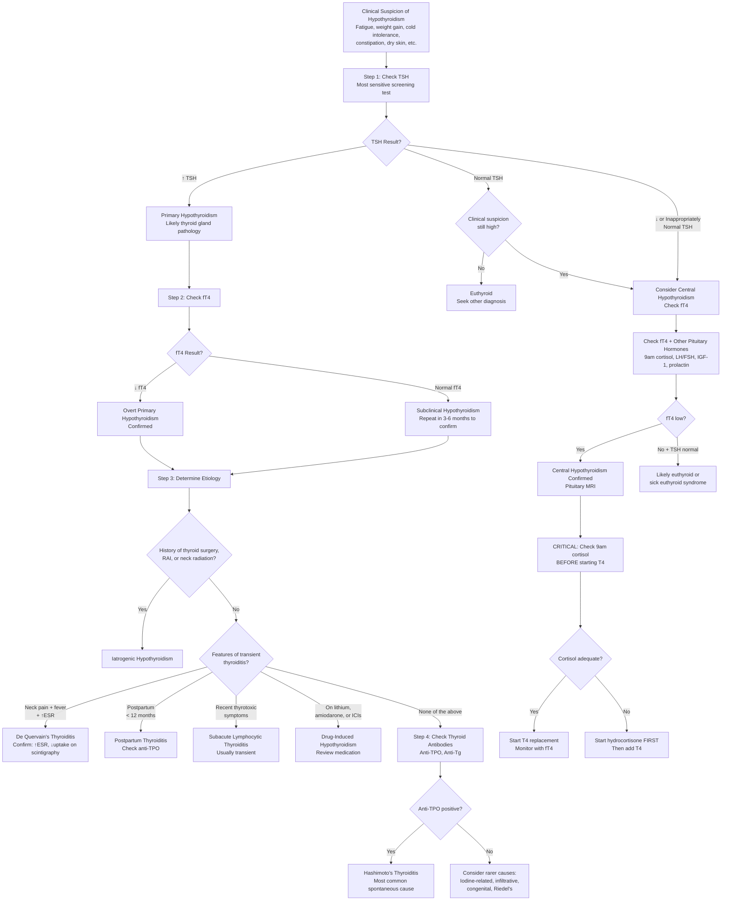

## Diagnostic Criteria, Algorithm, and Investigations for Hypothyroidism

### Diagnostic Criteria — What Defines Hypothyroidism Biochemically?

Unlike many conditions in medicine, hypothyroidism does not have a complex set of clinical diagnostic criteria (like, say, SLE or rheumatoid arthritis). The diagnosis is fundamentally **biochemical**, confirmed by thyroid function tests (TFTs). The clinical features raise suspicion; the blood tests confirm it.

#### Why Is This the Case?

Because hypothyroid symptoms are **extremely non-specific** (fatigue, weight gain, constipation — half the population could qualify on symptoms alone). We therefore rely on objective biochemistry to make the diagnosis. The clinical picture helps us decide *who to test* and *how to interpret* the results.

---

#### A. Primary Hypothyroidism

| Category | TSH | fT4 | fT3 | Definition |
|---|---|---|---|---|
| **Overt primary hypothyroidism** | **↑↑** (usually > 10 mIU/L) | **↓** (below reference range) | ↓ or low-normal | Thyroid gland failure with insufficient hormone production — requires treatment |
| **Subclinical primary hypothyroidism** | **↑** (4.5–10 mIU/L, varies by lab) | **Normal** | Normal | Early thyroid failure; TSH rises first due to log-linear relationship — fT4 hasn't dropped below range yet |

**Why does TSH rise before fT4 falls?** Because of the **log-linear relationship**: a 50% drop in fT4 causes a ~100-fold rise in TSH. The pituitary is exquisitely sensitive to even tiny reductions in circulating thyroid hormone. This makes ***TSH the single most sensitive test for primary hypothyroidism*** [17][21].

<Callout title="Diagnostic Thresholds — Important Caveats">

- **TSH reference range** varies by lab, age, and population (~0.4–4.0 or 0.3–4.5 mIU/L in most labs)
- In **elderly patients ( > 70 years)**, the upper limit of normal TSH may be higher (~6–7 mIU/L) — avoid overtreating age-appropriate TSH elevation
- In **pregnancy**, trimester-specific references apply: 1st trimester upper limit ~4.0 mIU/L (ATA 2017) or population-based if available
- **TSH alone is insufficient** in two scenarios: (1) central hypothyroidism (TSH unreliable), (2) recent change in thyroid status (TSH lags behind fT4 changes by 6–8 weeks)

</Callout>

#### B. Central (Secondary/Tertiary) Hypothyroidism

| Feature | Biochemistry | Notes |
|---|---|---|
| **TSH** | ↓, normal, or mildly ↑ | TSH may be *inappropriately normal* — the key word is "inappropriate" because a truly functioning pituitary should produce much more TSH when fT4 is low |
| **fT4** | ↓ | This is the diagnostic anchor in central hypothyroidism |

***Diagnosis of central hypothyroidism***: ↓fT4 with low, normal, or mildly elevated TSH (inappropriately non-elevated) + evidence of pituitary/hypothalamic pathology [1][21]

***Key diagnostic principle***: in central hypothyroidism, TSH is unreliable for both diagnosis and monitoring — ***always use fT4*** [21]

#### C. Subclinical Hypothyroidism — When to Treat?

This is a high-yield exam topic because subclinical hypothyroidism is extremely common (4–10% of adults) and the decision to treat is nuanced:

| Scenario | Recommendation | Rationale |
|---|---|---|
| **TSH > 10 mIU/L** | Treat with levothyroxine | High risk of progression to overt hypothyroidism (~5%/year); associated with cardiovascular risk |
| **TSH 4.5–10 + symptoms** | Consider trial of levothyroxine | Symptoms may improve; reassess after 3–6 months |
| **TSH 4.5–10 + anti-TPO positive** | Consider treatment | Anti-TPO positivity predicts progression to overt hypothyroidism (~4.3%/year vs 2.6% if Ab-negative) |
| **TSH 4.5–10 + pregnant or planning pregnancy** | Treat | Maternal hypothyroidism (even subclinical) impairs fetal neurodevelopment |
| **TSH 4.5–10, asymptomatic, Ab-negative** | Monitor with repeat TFT in 3–6 months | May be transient; repeat to confirm before committing to treatment |
| **Elderly ( > 70–80 years) with TSH mildly elevated** | Generally do NOT treat | Higher TSH may be physiologically normal in elderly; treatment may cause harm (subclinical hyperthyroidism from overreplacement → AF, osteoporosis) |

---

### Master Diagnostic Algorithm

The following algorithm integrates the diagnostic approach from the evaluation flowcharts in the senior notes [1][17] and expands them into a comprehensive step-by-step pathway:

<Callout title="Algorithm Summary — The 4-Step Approach" type="idea">

***Step 1***: **TSH** — the most sensitive screening test [17][21]
***Step 2***: **fT4** — to distinguish overt from subclinical
***Step 3***: **History** — iatrogenic? transient causes? drugs? [1]
***Step 4***: **Thyroid antibodies** — to confirm autoimmune etiology

For central hypothyroidism: fT4 is the diagnostic anchor + must exclude cortisol deficiency before treatment [21]

</Callout>

---

### Investigation Modalities — Comprehensive Guide

#### 1. Thyroid Function Tests (TFTs) — The Foundation

***TFT is routinely done for all patients*** [22][23]. It is the first and most important investigation.

| Test | What It Measures | Normal Range (approx.) | Key Interpretation |
|---|---|---|---|
| ***TSH*** | Pituitary TSH output; reflects integrated thyroid hormone exposure | 0.3–4.5 mIU/L | ***Most sensitive indicator of thyroid function due to short half-life*** [17]. ↑ in primary hypothyroidism; ↓/normal in central |
| ***Free T4 (fT4)*** | Unbound, biologically active thyroxine | 9–25 pmol/L (varies by assay) | ↓ in overt hypothyroidism; normal in subclinical. Used for monitoring in central hypothyroidism |
| ***Free T3 (fT3)*** | Unbound triiodothyronine | 3.5–6.5 pmol/L | Usually not needed for hypothyroidism diagnosis. T3 is preserved until late (preferential T3 secretion by failing thyroid + ↑TSH-driven deiodination) |

**Why check TSH first and not fT4?** Because of the log-linear amplification: TSH changes are *much* more sensitive than fT4 changes. A patient can have a TSH of 15 with a fT4 still just within the normal range — that's subclinical hypothyroidism. If you only checked fT4, you'd miss it entirely.

**Why is fT3 usually normal in hypothyroidism until very late?** Because the failing thyroid preferentially secretes T3 over T4 (T3 is more biologically active per molecule), and the elevated TSH drives increased Type 1 and Type 2 deiodinase activity, converting whatever T4 remains into T3. T3 only falls in severe, advanced hypothyroidism.

***Interpretation patterns*** [1][11][17]:

| TSH | fT4 | fT3 | Interpretation |
|---|---|---|---|
| ↑↑ | ↓ | ↓ or N | **Overt primary hypothyroidism** |
| ↑ | N | N | **Subclinical primary hypothyroidism** |
| ↓/N | ↓ | ↓ | ***Central hypothyroidism*** (secondary/tertiary) [21] |
| ↓/N | ↑/N | ↓↓ | ***Sick euthyroid syndrome*** — ↓peripheral conversion of T4→T3; do NOT treat [11] |
| ↑ | ↑ | ↑ | TSH-secreting pituitary adenoma OR thyroid hormone resistance (very rare) |

<Callout title="Exam Trap: Factors Affecting TFT Interpretation" type="error">

Several factors can alter TFT results and lead to misdiagnosis:

- ***Sick euthyroid syndrome***: ↓T3, ↓/N TSH, ↑/N T4 in acutely ill patients — NOT hypothyroidism [11]
- **Biotin supplementation**: interferes with immunoassays → falsely ↓TSH, falsely ↑fT4 (mimics hyperthyroidism) — stop biotin 48h before testing
- **Assay interference**: heterophilic antibodies can cause spurious results
- **Pregnancy**: ↑TBG → ↑total T4 (but free T4 normal); hCG has TSH-like activity → ↓TSH in 1st trimester
- **Medications**: amiodarone (↑T4, ↓T3 from inhibiting deiodinase), heparin (falsely ↑fT4), phenytoin/carbamazepine (↓total T4 by displacing from TBG)
- **TSH lag**: after starting T4 replacement or changing dose, TSH takes **6–8 weeks** to equilibrate — do not recheck earlier

</Callout>

---

#### 2. Thyroid Autoantibodies

| Antibody | Target | Sensitivity in Hashimoto's | Specificity | Clinical Use |
|---|---|---|---|---|
| ***Anti-TPO (anti-microsomal) Ab*** | Thyroid peroxidase enzyme | ***90–100%*** [1] | Moderate–High (most specific for hypothyroidism among thyroid antibodies) | **Best single antibody test** for confirming autoimmune hypothyroidism; predicts progression of subclinical → overt hypothyroidism |
| ***Anti-thyroglobulin (anti-Tg) Ab*** | Thyroglobulin protein | ***80–90%*** [1] | Lower (also found in other thyroid diseases and even euthyroid individuals) | Adjunct; ***important to measure to assess whether thyroglobulin can be used as a tumour marker after total thyroidectomy*** [17] |
| ***Anti-TSH receptor Ab (TRAb) — blocking type*** | TSH receptor | ***10–20%*** in Hashimoto's [1] | High | Found mainly in ***atrophic variant*** of Hashimoto's; blocks TSH action → no goitre + hypothyroidism [1] |

**Clinical significance of anti-TPO positivity**:
- Confirms autoimmune etiology (Hashimoto's thyroiditis)
- In subclinical hypothyroidism: anti-TPO +ve increases annual progression rate to overt hypothyroidism (~4.3%/year vs ~2.6% if negative) — this influences treatment decisions
- Found in ~5% of the general population (most remain euthyroid)

**When to check antibodies**: Not strictly required in all cases of hypothyroidism (e.g., if post-thyroidectomy, the cause is obvious). Most useful when:
- Confirming autoimmune etiology in spontaneous hypothyroidism
- Assessing prognosis in subclinical hypothyroidism (anti-TPO +ve → more likely to progress)
- Postpartum thyroiditis (anti-TPO predicts recurrence and progression)

---

#### 3. Blood Tests — Beyond TFTs

The biochemical consequences of hypothyroidism affect multiple organ systems. These are both **supportive of the diagnosis** and **important for monitoring complications**:

| Test | Expected Finding in Hypothyroidism | Pathophysiological Basis |
|---|---|---|
| **CBC** | Normocytic anaemia (most common); may be macrocytic (if concurrent B12 def/pernicious anaemia) or microcytic (if iron def from menorrhagia) [17] | ↓Erythropoietin production; associated autoimmune conditions |
| **Lipid profile** | ***↑Total cholesterol, ↑LDL-C, ± ↑TG*** [5] | ↓LDL receptor expression → ↓hepatic LDL clearance; ↓lipoprotein lipase activity |
| **Serum Na** | ***Hyponatraemia*** | ↓Free water clearance (↓GFR + ↓CO + inappropriate ADH release) [16] |
| **CK** | ↑ (may be significantly elevated) | Hypothyroid myopathy + ↓CK clearance [19] |
| **LFT** | ↑AST, ↑LDH (mild) | From myopathy (CK, AST, LDH are all muscle enzymes); also mild hepatic effects |
| **Glucose** | May be ↓ (hypoglycaemia in severe cases, esp. myxoedema coma) | ↓Gluconeogenesis, ↓glycogenolysis |
| **Prolactin** | ↑ | ↑TRH → stimulates prolactin release from lactotrophs [1] |
| ***Serum Ca²⁺ and PO₄³⁻*** | Usually normal unless concurrent parathyroid disease | ***Check to rule out hypocalcaemia from parathyroid compromise (especially post-thyroidectomy)*** [17] |
| **Homocysteine** | ↑ | ↓Metabolism of homocysteine → cardiovascular risk |

<Callout title="The Lipid-Hypothyroid Connection — High Yield">
***Hypothyroidism is a secondary cause of both ↑LDL and ↑TG*** [5]. The mechanism for ↑LDL is reduced LDL receptor expression on hepatocytes (T4 normally upregulates these receptors). Always check TFTs in newly diagnosed hyperlipidaemia before starting statins — treating hypothyroidism alone may normalize the lipid profile.
</Callout>

---

#### 4. Thyroid Ultrasonography (USG)

***Thyroid USG is routine for all patients with goitre or palpable nodules*** [22][23].

| Feature | Details |
|---|---|
| **Indication** | ***Routine for ALL goitre/nodules*** [22][23]; NOT for screening healthy subjects (high sensitivity but low specificity) [22] |
| **Purpose** | Define anatomy and size of goitre; characterize nodules; assess cervical lymph nodes; assess retrosternal extension; guide FNAC [22] |
| **Probe** | 7.5 or 10 MHz linear probe, B-mode [22] |
| **Role in hypothyroidism specifically** | Assess gland size (diffuse enlargement in Hashimoto's vs small/atrophic in atrophic thyroiditis vs post-surgical); look for nodules that may coexist; look for heterogeneous echotexture (autoimmune thyroiditis) |

**Sonographic findings in Hashimoto's thyroiditis**:
- Diffusely enlarged, hypoechoic gland with heterogeneous echotexture
- Pseudonodular pattern (fibrous septae creating a lobulated appearance)
- ↑Vascularity on Doppler (in early active inflammation)
- May have coexistent true nodules (which need assessment as per TI-RADS/Bethesda)

***Sonographic features suspicious of malignancy (if a nodule is found)*** [22][23]:

The mnemonic from the senior notes is ***"SHIT CME"*** [22] — though the ***most important features are solid and hypoechoic*** [22]:

| Feature | Significance |
|---|---|
| **S**olid | Solid nodules have higher malignancy risk than purely cystic |
| **H**ypoechoic | Lower echogenicity than surrounding thyroid tissue |
| **I**rregular margins/shape | Infiltrative borders suggest invasion |
| **T**aller than wide | Grows against tissue planes (suspicious) |
| **C**alcification (micro < 0.2mm) | ***Microcalcification represents psammoma bodies of papillary CA*** [22] |
| **M**issing halo | Absent or incomplete perilesional halo |
| **E**xtra-thyroidal extension | Local invasion into strap muscles |

**TI-RADS classification**: Stratifies nodules by ultrasound features into risk categories to guide whether FNAC is needed.

---

#### 5. Thyroid Scintigraphy (Radionuclide Scan)

***Thyroid scintigraphy is NOT routinely performed in hypothyroidism.*** Its main role is in:
- ***Diagnosis of causes of thyrotoxicosis or hypothyroidism*** [4]
- ***Functional assessment in thyrotoxic patients with nodules*** [23][24]
- Evaluation of ***ectopic thyroid*** [4]
- ***Post-surgery or radiotherapy assessment of residual thyroid gland*** [4]
- ***Differentiating causes of congenital hypothyroidism*** [4]

| Radiopharmaceutical | Mechanism | Specifics |
|---|---|---|
| ***⁹⁹ᵐTc pertechnetate*** | ***Iodine trapping only*** (has similar ionic size as iodide → taken up by NIS) [4] | Quick, convenient; widely available |
| ***¹²³I*** | ***Trapping + organification*** [4] | More physiological; preferred for definitive functional assessment |
| ***¹³¹I*** | Trapping + organification + therapeutic | Used for RAI therapy and post-therapy scans |

**Key findings relevant to hypothyroidism** [4][24]:

| Scintigraphy Pattern | Diagnosis |
|---|---|
| ***Diffuse ↓ uptake*** | ***Destructive thyroiditis*** (de Quervain's, subacute lymphocytic, postpartum) OR ***factitious thyrotoxicosis*** [1]. Why ↓ uptake? Because follicles are damaged → cannot trap iodine; TSH is also suppressed |
| ***Diffuse ↑ uptake*** | Graves' disease (if thyrotoxic); also seen in early Hashimoto's with Hashitoxicosis |
| ***Heterogeneous uptake*** | Toxic multinodular goitre |
| ***Focal ↑ uptake ("hot" nodule)*** with ↓ elsewhere | ***Toxic adenoma*** — hot nodules are rarely cancer → ***does NOT require FNA*** [17] |
| ***Focal ↓ uptake ("cold" nodule)*** | ***10–20% risk of cancer → requires FNA provided sonographic criteria met*** [17] |
| **Absent uptake** (in neonate) | Thyroid agenesis |
| **Ectopic uptake** (e.g. base of tongue) | ***Lingual ectopic thyroid — requires lifelong T4 replacement*** [4] |
| **Large gland with ↑ uptake** (in neonate) | ***Dyshormonogenesis*** [4] |

**When to use scintigraphy in hypothyroidism** [22][23][24]:
- ***Only if nodule + ↓TSH*** (to determine if the nodule is autonomous/toxic) [22]
- To differentiate causes of congenital hypothyroidism [4]
- To confirm destructive thyroiditis (low uptake) when diagnosis is uncertain [1]

<Callout title="Scintigraphy Is NOT Routine for Hypothyroidism">
For straightforward primary hypothyroidism (↑TSH, ↓fT4, diffuse goitre, anti-TPO+), scintigraphy adds nothing. It is most useful when the clinical picture is atypical — e.g., painful thyroid (de Quervain's?), nodules with suppressed TSH, or neonatal hypothyroidism [4][22].
</Callout>

---

#### 6. Fine Needle Aspiration Cytology (FNAC)

FNAC is not part of the standard workup for hypothyroidism per se — it is indicated when a **thyroid nodule** is found (which may coexist with hypothyroidism, especially in Hashimoto's).

***FNAC is the single most important investigation for a thyroid nodule when TSH is not depressed*** [22][23]

| Aspect | Details |
|---|---|
| ***Indications for FNAC*** [17][22] | Suspicious nodules ≥ 1cm; Low suspicion nodules ≥ 1.5cm; Very low suspicion nodules ≥ 2cm (ATA 2015); ***Hypofunctioning ("cold") nodules on scintigraphy***; ***Dominant or atypical nodule in MNG***; ***Nodules associated with abnormal LN***; ***Complex or recurrent cystic nodules*** [17] |
| **Technique** | ***Trans-isthmic approach ± USG guidance*** [22]; USG guidance confirms nodule presence and targets biopsy to most suspicious region |
| **Accuracy** | 90–95% [22] |
| **Limitation** | Cannot distinguish follicular adenoma from follicular carcinoma (requires histological demonstration of capsular or vascular invasion) [22] |

***Bethesda Classification*** for reporting FNAC [17][22]:

| Class | Diagnostic Category | Cancer Risk | Usual Management |
|---|---|---|---|
| **I** | Non-diagnostic | 1–4% | Repeat FNA |
| **II** | Benign | 0–3% | Clinical follow-up |
| **III** | ***Atypia of undetermined significance (AUS) / Follicular lesion of undetermined significance (FLUS)*** | 5–15% | Repeat FNA; molecular testing; hemithyroidectomy if AUS ×2 |
| **IV** | Follicular neoplasm | 15–30% | Hemithyroidectomy; molecular testing |
| **V** | Suspicious for malignancy | 60–75% | Hemithyroidectomy + frozen section → total thyroidectomy |
| **VI** | Malignant | 97–99% | Total thyroidectomy |

---

#### 7. Additional Investigations (Selective, Not Routine)

| Investigation | Indication | Key Findings |
|---|---|---|
| ***ESR*** | Suspected de Quervain's thyroiditis | ***Markedly ↑ ESR*** (often > 50); normal in Hashimoto's [1] |
| ***CT/MRI neck and thorax*** | ***Retrosternal goitre*** (cannot be visualized by USG); locally advanced thyroid cancer [22] | Extent of retrosternal extension; airway compression; surgical planning |
| ***CXR (thoracic inlet view)*** | Retrosternal goitre; tracheal deviation [24] | Tracheal deviation/compression; retrosternal soft tissue shadow |
| ***Flow-volume loop study*** | Suspected upper airway obstruction from large goitre [22] | ***Blunted flow-volume loop*** indicating upper airway obstruction (UAO) [22] |
| **ECG** | Cardiac assessment | Sinus bradycardia; low voltage complexes (pericardial effusion); prolonged QT |
| **Echocardiography** | Suspected pericardial effusion or cardiac dysfunction | Pericardial effusion; ↓LVEF (rare, in severe cases) |
| ***Pituitary MRI*** | Suspected central hypothyroidism | Pituitary adenoma, empty sella, infiltrative disease |
| ***Direct laryngoscopy*** | Suspected RLN palsy (pre/post-thyroidectomy; invasive cancer) | Vocal cord mobility assessment [22] |
| **Serum calcitonin** | ***If history or clinical suspicion of familial medullary carcinoma or MEN2*** [22] | ↑ calcitonin → medullary thyroid carcinoma |
| ***9am cortisol / ITT / short synacthen test*** | Central hypothyroidism — ***must exclude cortisol deficiency before starting T4*** [21] | Peak cortisol ≥ 550nmol/L normal on ITT; ↓ cortisol = adrenal insufficiency |
| **Genetic testing** | Congenital hypothyroidism (dyshormonogenesis); familial MTC; RET proto-oncogene [17] | Specific mutations guiding management |

---

#### 8. Investigation Summary Table — Routine vs. Selective

This table mirrors the framework from the lecture slides and senior notes [22][23][24]:

| Category | Investigation | Routine? | When Indicated |
|---|---|---|---|
| **Blood** | ***TSH + fT4*** | ***Yes — routine for ALL*** | First-line; most sensitive test |
| **Blood** | Thyroid antibodies (anti-TPO, anti-Tg) | Selective | Suspected autoimmune cause; prognostic in subclinical hypothyroidism |
| **Blood** | ***ESR*** | Selective | ***For thyroiditis*** [22] |
| **Blood** | ***Calcitonin*** | Selective | ***If Hx or clinical suspicion of familial MTC or MEN2*** [22] |
| **Blood** | CBC, lipids, Na, CK, LFT | Selective (but commonly done) | Assess complications; baseline before treatment |
| **Imaging** | ***USG thyroid*** | ***Yes — routine for ALL goitre/nodules*** [22] | Characterize gland + nodules; guide FNAC |
| **Imaging** | ***Thyroid scintigraphy*** | ***No — only in toxic (↓TSH) + nodules*** [22] | Differentiate hot vs. cold nodule; destructive thyroiditis |
| **Imaging** | ***CT scan/MRI*** | ***No — only for retrosternal goitre or locally advanced cancer*** [22] | Surgical planning; cannot be visualized by USG |
| **Imaging** | ***PET scan*** | ***No (no diagnostic role)*** [22] | Not used in hypothyroidism workup |
| **Cytology** | ***FNAC (+molecular testing)*** | Selective | Suspicious nodules per TI-RADS/Bethesda criteria |
| **Endoscopy** | ***Direct laryngoscopy, OGD*** | Selective | ***RLN palsy; oesophageal involvement*** [22] |
| **Other** | ***CXR (thoracic inlet)*** | Selective | Retrosternal extension; tracheal deviation [24] |
| **Other** | ***Flow-volume loop*** | Selective | ***UAO assessment — blunted loop*** [22] |
| **Surgery** | ***Thyroidectomy*** | Selective | ***Diagnostic + therapeutic*** [22] |

---

### Special Investigations by Clinical Scenario

#### Scenario 1: Straightforward Primary Hypothyroidism
- TSH + fT4 → confirms diagnosis
- Anti-TPO → confirms Hashimoto's
- Lipid profile, CBC → assess complications
- USG only if goitre or palpable nodule

#### Scenario 2: Suspected Transient Thyroiditis
- TSH + fT4 → confirms hypothyroid phase
- ***ESR*** (markedly ↑ in de Quervain's, normal in lymphocytic/postpartum)
- ***Thyroid scintigraphy*** → ***diffuse ↓ uptake*** confirms destructive thyroiditis [1]
- Anti-TPO → if +ve in postpartum, predicts progression

#### Scenario 3: Central Hypothyroidism
- fT4 (not TSH) is diagnostic anchor [21]
- Full pituitary hormone panel: ***9am cortisol, IGF-1, LH/FSH, prolactin*** [21]
- ***Pituitary MRI*** → identify structural lesion
- ***MUST check cortisol before starting T4*** [21]
- Dynamic testing: ***ITT (gold standard for GH and ACTH reserve)*** or ***short synacthen test*** [21][25]

#### Scenario 4: Congenital Hypothyroidism (Newborn)
- Newborn screening heel prick → ↑TSH
- Confirmatory: venous TSH + fT4
- ***Thyroid scintigraphy (⁹⁹ᵐTc or ¹²³I)*** → differentiate agenesis vs. ectopic vs. dyshormonogenesis [4]
- ***Thyroid USG*** → locate thyroid tissue

#### Scenario 5: Hypothyroidism with a Thyroid Nodule
- TSH + fT4 → confirm thyroid status
- ***USG thyroid*** → characterize nodule (TI-RADS)
- If ***TSH is ↓ (i.e., autonomous nodule)*** → ***thyroid scintigraphy first*** to determine if hot or cold [22]
  - ***Hot nodule → rarely cancer → does NOT require FNA*** [17]
  - ***Cold nodule → 10–20% cancer risk → FNA if sonographic criteria met*** [17]
- If ***TSH is normal or ↑*** → ***proceed directly to FNAC*** if nodule meets criteria [22]

---

<Callout title="High Yield Summary — Diagnosis and Investigations">

**Diagnostic Criteria**:
- **Overt primary hypothyroidism**: ↑TSH + ↓fT4
- **Subclinical hypothyroidism**: ↑TSH + normal fT4
- **Central hypothyroidism**: ↓/normal TSH + ↓fT4 (TSH unreliable)

**Most sensitive test**: ***TSH*** (log-linear relationship with fT4) [17]

**Algorithm**: TSH → fT4 → History (iatrogenic? transient?) → Anti-TPO (autoimmune?)

**Routine investigations**: ***TSH + fT4, USG thyroid (if goitre/nodule)*** [22]

**Selective investigations**: Anti-TPO, ESR (thyroiditis), scintigraphy (only if ↓TSH + nodule or suspected destructive thyroiditis), CT/MRI (retrosternal goitre), FNAC (suspicious nodules), pituitary MRI (central hypothyroidism) [22]

**Key rules**:
1. ***TSH lags 6–8 weeks after dose change*** — don't recheck too early
2. ***In central hypothyroidism, monitor fT4 NOT TSH***
3. ***Always check cortisol before starting T4 in central hypothyroidism***
4. ***Hot nodules rarely cancer → no FNA needed***; ***cold nodules → 10–20% cancer risk → FNA*** [17]
5. ***Sick euthyroid ≠ hypothyroidism*** — defer TFTs in acute illness unless strong clinical suspicion [11]

</Callout>

---

<ActiveRecallQuiz
  title="Active Recall - Diagnostic Criteria, Algorithm and Investigations"
  items={[
    {
      question: "What is the single most sensitive test for primary hypothyroidism, and why is it more sensitive than fT4?",
      markscheme: "TSH is the most sensitive test. Due to the log-linear relationship between fT4 and TSH, a small drop in fT4 causes an exponentially large rise in TSH. TSH rises before fT4 falls below the reference range, allowing detection of subclinical hypothyroidism."
    },
    {
      question: "A patient has a thyroid nodule with a TSH of 0.1 mIU/L. What is the next investigation and why? What finding would make FNA unnecessary?",
      markscheme: "Next: thyroid scintigraphy (radionuclide scan). The suppressed TSH suggests the nodule may be autonomous. A hot (hyperfunctioning) nodule on scintigraphy is rarely cancer and does NOT require FNA. A cold (hypofunctioning) nodule has 10-20% cancer risk and requires FNA if sonographic criteria are met."
    },
    {
      question: "List the Bethesda classification categories I through VI with their approximate cancer risk and standard management.",
      markscheme: "I Non-diagnostic (1-4%, repeat FNA). II Benign (0-3%, clinical follow-up). III AUS/FLUS (5-15%, repeat FNA or molecular testing). IV Follicular neoplasm (15-30%, hemithyroidectomy). V Suspicious for malignancy (60-75%, hemithyroidectomy plus frozen section then total thyroidectomy). VI Malignant (97-99%, total thyroidectomy)."
    },
    {
      question: "In suspected central hypothyroidism, outline the key investigations needed and the critical safety step before starting treatment.",
      markscheme: "Investigations: fT4 (diagnostic anchor, TSH unreliable), full pituitary hormone panel (9am cortisol, IGF-1, LH/FSH, prolactin), pituitary MRI. Dynamic tests: ITT or short synacthen test for cortisol reserve. Critical safety step: must exclude and treat cortisol deficiency (give hydrocortisone) BEFORE starting thyroxine, to prevent precipitating adrenal crisis."
    },
    {
      question: "A newborn has a positive screening heel-prick TSH. Thyroid scintigraphy shows uptake at the base of the tongue with no uptake in the normal thyroid position. What is the diagnosis and what is the long-term management implication?",
      markscheme: "Diagnosis: lingual ectopic thyroid (thyroid tissue failed to descend during embryological development from the foramen caecum). Management implication: requires lifelong T4 replacement, as the ectopic tissue is typically insufficient and must not be removed (it may be the only functioning thyroid tissue)."
    }
  ]}
/>

## References

[1] Senior notes: Ryan Ho Endocrine.pdf (Sections 1.3.2, 1.4.2, 1.5)
[4] Senior notes: Ryan Ho Diagnostic Radiology.pdf (p59–60 — Thyroid scintigraphy, congenital hypothyroidism)
[5] Senior notes: Ryan Ho Chemical Path.pdf (p46 — Secondary causes of dyslipidaemia)
[11] Senior notes: Ryan Ho Fundamentals.pdf (p421 — Sick euthyroidism)
[16] Senior notes: Ryan Ho Chemical Path.pdf (p10 — SIADH diagnosis of exclusion, normal TFT required)
[17] Senior notes: felixlai.md (Section V — Diagnostic protocol; Section VIII — Investigations including Bethesda)
[19] Senior notes: Ryan Ho Rheumatology.pdf (p92 — TFT in myositis workup); Senior notes: Ryan Ho Neurology.pdf (p191 — CK and TFT in myopathy workup)
[21] Senior notes: Ryan Ho Endocrine.pdf (p113–115 — Hypopituitarism workup, TFT for TSH deficiency, ITT)
[22] Senior notes: Ryan Ho Endocrine.pdf (p19–20 — Thyroid investigations, USG, FNAC, Bethesda); Senior notes: Ryan Ho Fundamentals.pdf (p427–428 — Same content)
[23] Senior notes: maxim.md (Section on thyroid investigations — routine vs selective)
[24] Lecture slides: GC 177. A thyroid nodule benign thyroid nodules; thyroid cancer.pdf (p7, p13 — Investigations, scintigraphy)
[25] Senior notes: Ryan Ho Chemical Path.pdf (p33–35 — ITT, glucagon stimulation test)
