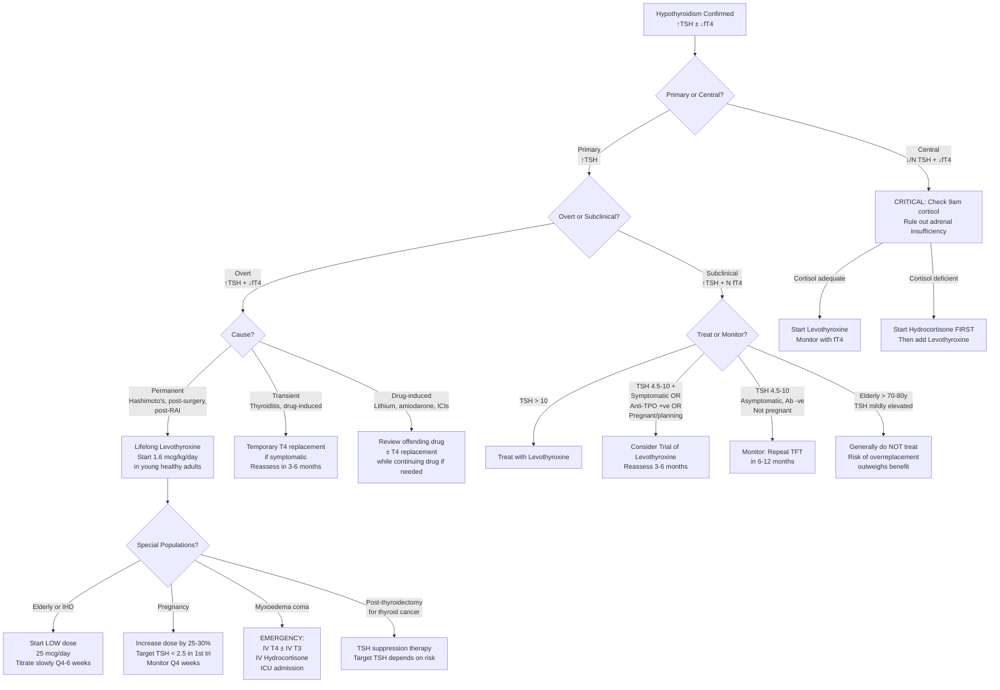

## Management of Hypothyroidism

### Overarching Principles

Before diving into specifics, let's establish the fundamental management philosophy. Hypothyroidism management is conceptually straightforward but nuanced in execution:

1. **Replace what's missing**: The thyroid gland isn't making enough T4/T3 → give exogenous thyroid hormone
2. **Identify and treat the cause** where possible (e.g., stop offending drug, replace iodine, treat pituitary lesion)
3. **Distinguish permanent from transient** causes → determines whether replacement is lifelong or temporary [1]
4. **Avoid harm**: Starting T4 in the wrong context (e.g., unrecognized adrenal insufficiency, acute coronary syndrome) can be dangerous
5. **Monitor and titrate**: The goal is to normalize TSH (in primary) or fT4 (in central) with resolution of symptoms

---

### Master Management Algorithm

---

### Treatment Modalities

#### 1. Levothyroxine (L-T4) — The Mainstay of Treatment

***Levothyroxine (T4) is the routine replacement therapy for hypothyroidism of any cause, due to its longer half-life (t½ ~7 days) — taken once daily only*** [17]

**Why T4 and not T3?**
- T4 has a half-life of ~7 days → stable blood levels with once-daily dosing
- T4 serves as a "pro-hormone" — it is converted peripherally to T3 (the more active form) by deiodinases in target tissues
- This allows the body to regulate T3 levels locally according to tissue needs, which is more physiological
- T3 (liothyronine) has a half-life of only ~1 day → fluctuating levels, requires multiple daily doses, and carries risk of supraphysiological peaks causing cardiac symptoms

**Pharmacology of Levothyroxine**:

| Property | Details |
|---|---|
| **Drug** | Levothyroxine sodium (synthetic L-thyroxine) |
| **Route** | Oral (standard); IV available for myxoedema coma |
| **Bioavailability** | ~70–80% on empty stomach; reduced by food, calcium, iron, PPIs |
| **Half-life** | ~7 days |
| **Dosing** | Once daily, in the morning, on an empty stomach, 30–60 min before breakfast |
| **Onset of action** | Clinical improvement within 2–3 weeks; full effect in 4–6 weeks |

**Starting Dose — Depends on Patient Profile**:

| Patient Profile | Starting Dose | Rationale |
|---|---|---|
| **Young, healthy adult** | ***1.6 mcg/kg/day*** (typical: 75–150 mcg/day) | Full replacement dose; can be started directly as the heart can handle the metabolic increase |
| ***Elderly patients ( > 60 years)*** | ***25 mcg/day*** | ***Start low, go slow*** — elderly patients may have underlying coronary artery disease; sudden increase in metabolic rate → ↑myocardial O₂ demand → angina, arrhythmia, MI |
| ***Patients with ischaemic heart disease*** | ***25 mcg/day, titrate slowly Q4–6 weeks*** | Same principle as elderly — the heart cannot tolerate rapid metabolic acceleration; ***deterioration of CVS disease by thyrotoxicosis — ↑workload of heart worsens ischemic symptoms — angina, arrhythmias, cardiac failure*** [17] |
| **Subclinical hypothyroidism** | 25–50 mcg/day | Often a lower dose is sufficient to normalize TSH |
| **Post-total thyroidectomy** (non-cancer) | ~1.6 mcg/kg/day | Full replacement needed as there is zero endogenous production |
| **Children** | Higher mcg/kg doses (neonates ~10–15 mcg/kg/day) | Developing brain has very high T4 requirements |

**Titration and Monitoring**:

| Aspect | Primary Hypothyroidism | Central Hypothyroidism |
|---|---|---|
| **Monitoring parameter** | ***TSH*** (most sensitive) | ***fT4*** (TSH unreliable) |
| **When to recheck** | ***6–8 weeks after initiation or dose change*** (TSH takes this long to re-equilibrate due to the log-linear relationship) | Same timing, but check fT4 |
| **Target** | ***TSH within reference range*** (typically 0.4–4.0 mIU/L); aim for lower half (0.5–2.5) in younger patients | ***fT4 in the upper half of the reference range*** |
| **Dose adjustment** | Increase or decrease by 12.5–25 mcg increments | Same |
| **Once stable** | Check TSH annually (or Q6 months in certain populations) | Check fT4 annually |

**Key Prescribing Rules**:

- **Timing**: Take on an empty stomach, 30–60 minutes before food/coffee/other medications
- **Separation from interfering drugs**: Take at least **4 hours apart** from calcium, iron, aluminium-containing antacids, cholestyramine, sucralfate (these bind T4 in the gut and reduce absorption)
- **Consistency**: Take at the same time each day; switching brands can alter bioavailability

**When the T4 Dose Needs Adjustment**:

| Situation | Effect on T4 Requirement | Mechanism |
|---|---|---|
| **Pregnancy** | ***↑ by 25–50%*** | ↑TBG (oestrogen effect) → ↑total T4 binding; ↑blood volume; placental deiodination |
| **Starting oestrogen** (OCP, HRT) | ↑ | ↑TBG production |
| **Weight gain** | ↑ | Larger volume of distribution |
| **Malabsorption** (coeliac, short bowel) | ↑ | ↓Absorption |
| **PPIs, H2 blockers** | ↑ | ↓Gastric acid → ↓dissolution and absorption of T4 tablets |
| **Medications that ↑ T4 clearance** | ↑ | Phenytoin, carbamazepine, rifampicin (CYP450 inducers) |
| **Ageing** | ↓ | ↓Lean body mass, ↓metabolic rate |
| **After achieving euthyroidism post-Hashimoto's** | Dose may need ↓ over years | Progressive disease but initial dose may overshoot once TSH normalized |

**Adverse Effects of Levothyroxine** [17]:

These are essentially the effects of **overreplacement (iatrogenic thyrotoxicosis)**, not true drug side effects:

| Adverse Effect | Mechanism |
|---|---|
| ***Angina / arrhythmias / cardiac failure*** | ***↑Workload of heart; ↑myocardial O₂ demand; particularly dangerous in patients with IHD*** [17] |
| **Atrial fibrillation** | Excess T4 shortens atrial refractory period → ↑AF risk (especially in elderly) |
| **Osteoporosis** | Chronic overreplacement → ↑bone turnover → ↓bone mineral density (especially postmenopausal women) |
| ***Acute adrenal crisis*** | ***↑Metabolic clearance of adrenocortical hormones → ↓cortisol and aldosterone → contraindicated in patients with adrenal insufficiency*** [17] |
| **Insomnia, anxiety, tremor** | Sympathomimetic effects of excess thyroid hormone |
| **Diarrhoea, weight loss** | ↑GI motility, ↑BMR |

<Callout title="The Two Most Dangerous Complications of Starting T4" type="error">

1. ***Acute adrenal crisis***: In patients with concurrent adrenal insufficiency (especially central hypothyroidism with ACTH deficiency), starting T4 increases metabolic rate → increases cortisol clearance → precipitates crisis. ***Always check cortisol and give hydrocortisone BEFORE levothyroxine in central hypothyroidism*** [17][21]

2. ***Cardiac decompensation***: In elderly or IHD patients, sudden increase in metabolic rate → ↑HR, ↑contractility, ↑O₂ demand → angina, arrhythmias, MI, heart failure. ***Start low (25 mcg), go slow (titrate Q4–6 weeks)*** [17]

</Callout>

---

#### 2. Liothyronine (L-T3) — For Special Situations Only

***Liothyronine (T3) is used in the acute severe hypothyroid state — myxoedema coma — due to its faster onset*** [17]

| Property | Details |
|---|---|
| **Drug** | Liothyronine sodium (synthetic L-triiodothyronine) |
| **Half-life** | ~1 day (cf. T4 ~7 days) |
| **Onset** | Rapid — effects within hours |
| **Route** | Oral or IV |

**Indications** [17]:
- ***Acute severe hypothyroid state / myxoedema coma*** — rapid onset needed [17]
- ***Pre-RAI ablation for thyroid cancer***: when T4 is withdrawn before RAI therapy, T3 can be used as a bridge because of its shorter half-life — ***stop T3 for ≥ 2 weeks before RAI*** (cf. T4 needs ≥ 4 weeks withdrawal) to allow TSH to rise and promote RAI uptake [17][26]
- **NOT used for routine replacement** — fluctuating levels, peaks can cause cardiac toxicity, requires multiple daily doses

**Why not use combination T4+T3 routinely?**
Multiple randomized trials have shown no consistent benefit of combination T4+T3 over T4 monotherapy in quality of life or symptoms. Current guidelines (ATA/ETA 2024) recommend **levothyroxine monotherapy** as standard treatment.

---

#### 3. Hydrocortisone — The Critical Co-Treatment

Not a thyroid hormone, but absolutely essential in specific contexts:

| Scenario | Action | Rationale |
|---|---|---|
| ***Central hypothyroidism with ACTH deficiency*** | ***Start hydrocortisone BEFORE levothyroxine*** [17][21] | T4 increases cortisol clearance; if adrenals can't compensate → adrenal crisis |
| ***Myxoedema coma*** | ***Give IV hydrocortisone (100 mg stat then Q8h)*** concomitantly with T4/T3 [17] | Myxoedema coma may coexist with relative adrenal insufficiency; the stress of severe illness demands cortisol; empirical hydrocortisone is given until adrenal function is confirmed |
| **Sick euthyroid with suspected adrenal insufficiency** | Check and replace cortisol before T4 | Same principle |

---

### Management by Clinical Scenario

#### Scenario 1: Overt Primary Hypothyroidism (Most Common)

**Permanent cause (Hashimoto's, post-surgery, post-RAI)**:
- ***Lifelong levothyroxine replacement*** [1]
- Starting dose: 1.6 mcg/kg/day in young healthy adults; 25 mcg/day in elderly/IHD
- ***T4 replacement treats hypothyroidism + shrinks goitre*** (in Hashimoto's, normalizing TSH removes the TSH-driven goitre stimulus) [1]
- Monitor TSH Q6–8 weeks until stable, then annually

**Transient cause (subacute thyroiditis, postpartum thyroiditis)**:
- ***Temporary T4 replacement for hypothyroid phase if pronounced or symptomatic*** [1]
- ***Self-limiting → do NOT commit to lifelong T4 without reassessment*** [1]
- Reassess TFT at 3–6 months; attempt dose reduction/withdrawal
- ~20–30% of postpartum thyroiditis progresses to permanent hypothyroidism → long-term follow-up

**Drug-induced (lithium, amiodarone, ICIs)**:
- Review the offending drug with the prescribing team
- If drug cannot be stopped (e.g., lithium for bipolar disorder — stopping lithium carries high relapse risk [27]), add levothyroxine while continuing the drug
- ***Lithium causes hypothyroidism in 6–52% of patients; management is T4 supplementation*** [27]
- ***TFT monitoring Q6 months on lithium*** [27]
- Amiodarone-induced hypothyroidism: often can continue amiodarone + add T4 (especially in iodine-sufficient areas where hypothyroidism is the more common amiodarone thyroid effect)

---

#### Scenario 2: Subclinical Hypothyroidism — Treat or Watch?

This is one of the most commonly tested decision points:

| Feature | Treat | Watch |
|---|---|---|
| **TSH > 10 mIU/L** | ✓ | — |
| **Symptomatic** | ✓ (trial of T4, reassess in 3–6 months) | — |
| **Anti-TPO positive** | ✓ (higher progression risk) | — |
| **Pregnant / planning pregnancy** | ✓ (target TSH < 2.5 in 1st trimester) | — |
| **Hyperlipidaemia** | ✓ (treat hypothyroidism first before starting statin) | — |
| **TSH 4.5–10, asymptomatic, Ab-negative** | — | Repeat TFT in 6–12 months |
| **Elderly > 70–80 years, TSH mildly elevated** | — | ***Generally do NOT treat*** — risk of overreplacement (AF, osteoporosis) may outweigh benefit |

---

#### Scenario 3: Hypothyroidism in Pregnancy

This deserves special attention because of the impact on fetal neurodevelopment:

| Aspect | Details |
|---|---|
| **Why it matters** | Fetal brain depends entirely on maternal T4 in the 1st trimester (fetal thyroid not functional until ~12 weeks). Untreated maternal hypothyroidism → ↓IQ, miscarriage, pre-eclampsia, preterm delivery |
| **TSH target** | ***< 2.5 mIU/L in 1st trimester*** (ATA 2017); trimester-specific ranges if available; upper limit ~3.0–3.5 in 2nd/3rd trimester |
| **Dose adjustment** | ***Increase dose by ~25–50%*** as soon as pregnancy confirmed; some advise taking 2 extra doses per week empirically while awaiting lab results |
| **Monitoring** | Check TSH ***every 4 weeks*** during 1st half of pregnancy; Q6–8 weeks in 2nd half |
| **Drug safety** | Levothyroxine is **safe in pregnancy** (it is replacing a physiological hormone) |
| **Postpartum** | Reduce dose back to pre-pregnancy level immediately postpartum; recheck TSH at 6 weeks |

---

#### Scenario 4: Myxoedema Coma — Medical Emergency

Myxoedema coma is the most extreme manifestation of hypothyroidism — **mortality 20–60%** even with treatment.

***General features***: severe hypothyroidism with hypothermia, respiratory failure with hypoxia, and coma [17]

**Precipitants**: infection (most common), cold exposure, surgery, sedatives/opioids, MI, stroke, medication non-compliance

***Management of myxoedema coma*** [17]:

| Component | Details | Rationale |
|---|---|---|
| **ICU admission** | Mandatory | Multi-organ support needed |
| ***Treatment of precipitating cause*** | Antibiotics for infection, etc. | Addressing the trigger is as important as replacing hormones |
| ***IV Levothyroxine (T4)*** | Loading dose: 200–500 mcg IV stat, then 50–100 mcg IV daily | Oral absorption unreliable in critically ill; IV bypasses this; large loading dose because T4 has long half-life and the body's stores are depleted |
| ***IV Liothyronine (T3)*** | 5–20 mcg IV stat, then 5–10 mcg Q8h (some protocols) | ***Faster onset*** [17]; used in addition to T4 for rapid effect; some centres use T3 alone initially |
| ***IV Hydrocortisone*** | ***100 mg IV stat, then 50 mg Q8h*** | ***Empirical — concurrent adrenal insufficiency cannot be excluded in the acute setting; also, severe hypothyroidism impairs cortisol response*** [17] |
| ***Maintenance of body temperature*** | Passive rewarming (warm blankets); avoid active external warming | Rapid rewarming → peripheral vasodilation → cardiovascular collapse |
| ***Correction of hypoglycaemia*** | ***D10 infusion*** | ↓Gluconeogenesis; ↓glycogenolysis in hypothyroidism [17] |
| ***Correction of fluid and electrolytes*** | ***Normal saline ± vasopressors*** | Hyponatraemia (↓free water clearance); hypotension (↓CO + ↓SVR responsiveness) [17] |
| **Ventilatory support** | Intubation and mechanical ventilation if needed | Hypoventilation → CO₂ retention → respiratory failure |
| **Avoid sedatives and opioids** | Strict | These drugs precipitated or worsened the coma; hypothyroid patients have ↑sensitivity due to ↓drug clearance |

<Callout title="Myxoedema Coma — Key Treatment Triad">
The three essential drugs are:
1. ***IV Levothyroxine (T4)*** ± ***IV Liothyronine (T3)***
2. ***IV Hydrocortisone***
3. Treatment of the precipitating cause

Never forget the hydrocortisone — even if adrenal function seems intact, empirical steroids are standard of care until confirmed [17].
</Callout>

---

#### Scenario 5: Post-Thyroidectomy for Thyroid Cancer — TSH Suppression Therapy

This is a specific and important scenario where levothyroxine serves a **dual role**: ***replacement (prevent hypothyroidism) ± suppression (high TSH stimulates tumour growth)*** [26][28]

***Thyroxine suppression therapy*** [26][28]:

The rationale is that differentiated thyroid cancer cells retain TSH receptors. TSH stimulates tumour growth. Therefore, keeping TSH low ("suppressed") reduces recurrence risk. However, overaggressive TSH suppression carries risks (AF, osteoporosis), so the target depends on risk stratification:

| Risk Category | Features [28] | TSH Target [28] |
|---|---|---|
| ***Low risk*** | ***None of the high-risk features*** | ***No TSH suppression needed (0.5–2.0 mIU/L)*** [28] |
| ***Intermediate risk*** | ***T3, N1; aggressive histology; vascular invasion*** | ***Low TSH suppression (0.1–0.5 mIU/L)*** [28] |
| ***High risk*** | ***T4, M1; incomplete resection*** | ***High TSH suppression ( < 0.1 mIU/L)*** [28] |

***Post-thyroidectomy T4 initiation*** [26]:
- ***Hemithyroidectomy***: ***Do NOT start T4 therapy immediately postoperatively***. Measure serum TSH at ***6 weeks*** after surgery and determine need for T4 based on TSH and evaluation of postoperative disease status [26]
- ***Total thyroidectomy*** — depends on need for RAI ablation [26]:
  - ***Patients who do NOT need RAI***: ***Start T4 therapy immediately postoperatively*** [26]
  - ***Patients who require RAI and CAN tolerate prolonged hypothyroidism***: ***Withhold T4 therapy; stop T4 ≥ 4 weeks prior to RAI ablation*** (allows TSH to rise, promoting RAI uptake) [26]
  - ***Patients who require RAI and CANNOT tolerate prolonged hypothyroidism***: ***Start T3 therapy*** (shorter half-life) ***and stop T3 for ≥ 2 weeks prior to RAI ablation*** [26]. Alternatively, ***recombinant human TSH (rhTSH, Thyrogen) injection*** can be used to raise TSH without inducing hypothyroidism [26]

***Precautions with TSH suppression therapy*** [26]:
- ***Osteoporosis → calcium supplements required*** [26]
- ***Atrial fibrillation and cardiac dysfunction → may need to withhold aggressive suppression*** [26]

---

#### Scenario 6: Central Hypothyroidism

| Step | Action | Rationale |
|---|---|---|
| 1 | ***Exclude and treat cortisol deficiency*** (9am cortisol, ± short synacthen/ITT) | ACTH deficiency typically occurs before TSH deficiency in progressive hypopituitarism; T4 precipitates adrenal crisis [1][21] |
| 2 | Start hydrocortisone if cortisol deficient | Must precede T4 |
| 3 | Start levothyroxine | Similar doses to primary hypothyroidism |
| 4 | ***Monitor with fT4 (NOT TSH)*** — aim upper half of reference range [21] | TSH is unreliable in central hypothyroidism |
| 5 | Address other pituitary hormone deficiencies (GH, gonadotrophins, ADH) | Comprehensive pituitary replacement |

---

#### Scenario 7: Congenital Hypothyroidism

| Aspect | Details |
|---|---|
| **Detection** | Newborn screening (heel prick TSH at day 3–5); universal in HK |
| **Urgency** | ***Treatment must begin within 2 weeks of birth*** to prevent irreversible neurological damage (cretinism) |
| **Drug** | Levothyroxine |
| **Starting dose** | 10–15 mcg/kg/day (higher than adults because the neonatal brain has very high T4 requirements) |
| **Monitoring** | TSH + fT4 at 2 weeks, then Q1–2 months in first year |
| **Duration** | Lifelong if thyroid dysgenesis/ectopic; if dyshormonogenesis, usually lifelong as well. Trial off at age 3 if uncertain etiology to reassess |

---

### Indications and Contraindications Summary

#### Levothyroxine (T4)

| | Details |
|---|---|
| **Indications** | ***Routine replacement therapy for hypothyroidism of any cause*** [17]; TSH suppression in thyroid cancer |
| **Contraindications** | ***Untreated adrenal insufficiency*** (must give hydrocortisone first) [17]; acute MI (relative — may worsen ischaemia; but severe hypothyroidism itself is also dangerous, so clinical judgement required); thyrotoxicosis |
| **Cautions** | IHD (start low dose); elderly (start low dose); pregnancy (increase dose promptly); DM (T4 may ↑insulin requirement); warfarin (T4 may potentiate anticoagulant effect) |

#### Liothyronine (T3)

| | Details |
|---|---|
| **Indications** | ***Acute severe hypothyroid state / myxoedema coma*** [17]; ***bridge therapy before RAI ablation in thyroid cancer*** [26] |
| **Contraindications** | Same as T4 — untreated adrenal insufficiency; acute MI (even more dangerous than T4 due to rapid onset) |
| **Cautions** | Cardiac patients — rapid onset can precipitate arrhythmias; not for routine replacement |

#### Hydrocortisone (in hypothyroidism context)

| | Details |
|---|---|
| **Indications** | Central hypothyroidism with concurrent adrenal insufficiency; myxoedema coma (empirical) [17] |
| **Standard dose** | Replacement: hydrocortisone 10–20 mg/day in divided doses; Stress dose: 100 mg IV stat + 50 mg Q8h |

---

### Non-Pharmacological Management

| Measure | Details |
|---|---|
| **Patient education** | Importance of adherence; take on empty stomach; do not stop medication without medical advice; symptoms of overreplacement (palpitations, tremor, anxiety) |
| **Medication interaction avoidance** | Separate T4 by ≥ 4 hours from calcium, iron, PPIs, antacids, cholestyramine |
| **Monitoring adherence** | Persistently elevated TSH despite adequate dosing → suspect non-compliance, malabsorption, or drug interaction |
| **Address cardiovascular risk** | Treat coexisting hyperlipidaemia (may normalize with T4 alone), manage HTN, smoking cessation |
| **Screen for associated conditions** | Other autoimmune diseases (T1DM, Addison's, pernicious anaemia, coeliac disease) |

---

### Monitoring Summary

| Parameter | Frequency | Target |
|---|---|---|
| **TSH** (primary hypothyroidism) | Q6–8 weeks until stable, then annually | Within reference range (0.4–4.0) |
| **fT4** (central hypothyroidism) | Q6–8 weeks until stable, then annually | Upper half of reference range |
| **Lipid profile** | At baseline and after achieving euthyroidism | May normalize without statins |
| **Symptoms** | Every visit | Resolution of fatigue, constipation, etc. |
| **Weight** | Every visit | Should stabilize (modest weight loss ~2–5 kg expected) |
| **Bone density** (if on suppressive T4) | DXA scan periodically (esp. postmenopausal women) | Monitor for osteoporosis from TSH suppression |
| **Cardiac** (elderly/IHD) | ECG, symptoms | Watch for angina, AF, palpitations |

<Callout title="When TSH Doesn't Normalize Despite Adequate Doses">

If TSH remains elevated despite seemingly adequate T4 doses, consider:
1. **Non-compliance** (most common cause!)
2. **Malabsorption** (coeliac disease, short bowel, IBD)
3. **Drug interactions** (calcium, iron, PPI, cholestyramine taken too close to T4)
4. **Incorrect timing** (taking T4 with food instead of on empty stomach)
5. **Dose genuinely insufficient** (increase by 12.5–25 mcg increments)
6. **Interfering biotin supplements** (artefactually suppress TSH on some assays)

</Callout>

---

### Special Topic: Radioactive Iodine (RAI) Therapy — Relevance to Hypothyroidism

RAI (¹³¹I) is primarily a treatment for hyperthyroidism and thyroid cancer, but it is a **major cause** of hypothyroidism:

- ***Permanent hypothyroidism occurs in 10–15% in first 2 years after RAI, then ~3%/year*** (due to late effects of radiation and lymphocytic infiltration and destruction of thyroid tissue) [17]
- ***All patients post-RAI require lifelong TFT monitoring***
- ***Contraindications to RAI*** [17]:
  - ***Pregnancy and lactation*** (damage to fetal thyroid; secreted in breastmilk)
  - ***Children and adolescents*** (avoid potential teratogenicity)
- ***No effect on fertility, congenital malformations, or increased cancer risk in offspring*** [17]

---

<Callout title="High Yield Summary — Management of Hypothyroidism">

**Treatment of choice**: ***Levothyroxine (T4)*** — lifelong for permanent causes, temporary for transient causes [17]

**Starting dose**: 1.6 mcg/kg/day in young healthy adults; ***25 mcg/day in elderly or IHD patients*** (start low, go slow) [17]

**Monitoring**: TSH Q6–8 weeks until stable, then annually. In central hypothyroidism, use fT4 instead.

**Two critical safety rules**:
1. ***In central hypothyroidism: hydrocortisone BEFORE T4*** [21]
2. ***In elderly/IHD: start at 25 mcg, titrate Q4–6 weeks*** [17]

**Subclinical hypothyroidism**: Treat if TSH > 10, symptomatic, anti-TPO +ve, pregnant/planning pregnancy. Otherwise monitor.

**Myxoedema coma** [17]: ICU + IV T4 ± IV T3 + IV hydrocortisone + treat precipitant + supportive care

**Post-thyroidectomy for cancer** [26][28]:
- Hemithyroidectomy: do NOT start T4 immediately; check TSH at 6 weeks
- Total thyroidectomy without RAI: start T4 immediately
- Total thyroidectomy with RAI: withhold T4 ≥ 4 weeks (or use T3 bridge, stop ≥ 2 weeks before)
- TSH suppression targets: Low risk 0.5–2.0; Intermediate 0.1–0.5; High < 0.1 mIU/L

**Pregnancy**: Increase T4 by 25–50%; target TSH < 2.5 in 1st trimester; monitor Q4 weeks

</Callout>

---

<ActiveRecallQuiz
  title="Active Recall - Management of Hypothyroidism"
  items={[
    {
      question: "A 72-year-old man with known ischaemic heart disease is diagnosed with overt primary hypothyroidism. What starting dose of levothyroxine would you prescribe, and why?",
      markscheme: "Start at 25 mcg/day and titrate slowly every 4-6 weeks. Rationale: in elderly patients with IHD, a sudden increase in metabolic rate from T4 increases myocardial oxygen demand, risking angina, arrhythmias, MI, or heart failure. Starting low and going slow allows gradual cardiac adaptation."
    },
    {
      question: "A patient with known pituitary macroadenoma has central hypothyroidism and suspected ACTH deficiency. Outline the correct sequence of hormone replacement and explain why.",
      markscheme: "Step 1: Check 9am cortisol or perform short synacthen test. Step 2: If cortisol deficient, start hydrocortisone first. Step 3: Only then start levothyroxine. Reason: T4 increases metabolic rate and cortisol clearance. If the patient has concurrent ACTH deficiency and cannot mount a cortisol response, starting T4 first may precipitate an acute adrenal crisis."
    },
    {
      question: "After total thyroidectomy for intermediate-risk papillary thyroid carcinoma requiring RAI ablation, describe the approach to T4 management in a patient with significant cardiovascular comorbidity who cannot tolerate prolonged hypothyroidism.",
      markscheme: "Start T3 therapy (shorter half-life of ~1 day) as a bridge. Stop T3 at least 2 weeks before RAI ablation to allow TSH to rise and promote RAI uptake. Alternatively, use recombinant human TSH injection (rhTSH/Thyrogen) to raise TSH without inducing hypothyroidism. After RAI, start levothyroxine with TSH suppression target of 0.1-0.5 mIU/L for intermediate risk."
    },
    {
      question: "List the three essential drug components in the emergency management of myxoedema coma and explain the rationale for each.",
      markscheme: "1. IV Levothyroxine (T4) with or without IV Liothyronine (T3): replace the missing thyroid hormone; IV route because oral absorption is unreliable in critical illness; T3 has faster onset. 2. IV Hydrocortisone: empirical because concurrent adrenal insufficiency cannot be excluded; severe hypothyroidism impairs cortisol response to stress. 3. Treatment of precipitating cause (e.g. antibiotics for infection): addressing the trigger is essential for survival."
    },
    {
      question: "A woman with Hashimoto's thyroiditis on levothyroxine 100 mcg daily discovers she is 6 weeks pregnant. What immediate dose adjustment is needed and what is the TSH target?",
      markscheme: "Immediately increase levothyroxine dose by 25-50% (e.g. take 2 extra tablets per week as empirical increase while awaiting labs). TSH target is less than 2.5 mIU/L in the first trimester. Monitor TSH every 4 weeks during the first half of pregnancy. Return to pre-pregnancy dose immediately postpartum and recheck TSH at 6 weeks."
    },
    {
      question: "Why is TSH suppression therapy used after thyroidectomy for differentiated thyroid cancer, and what are the main risks of overly aggressive suppression?",
      markscheme: "Rationale: differentiated thyroid cancer cells retain TSH receptors; TSH stimulates tumour cell growth. Suppressing TSH reduces recurrence risk. Risks of over-suppression: atrial fibrillation (excess T4 shortens atrial refractory period), osteoporosis (chronic excess T4 increases bone turnover especially in postmenopausal women), and cardiac dysfunction. Hence target TSH is tailored to recurrence risk category."
    }
  ]}
/>

## References

[1] Senior notes: Ryan Ho Endocrine.pdf (Sections 1.3.2, 1.4.2, 1.5)
[4] Senior notes: Ryan Ho Diagnostic Radiology.pdf (p59 — Thyroid scintigraphy)
[17] Senior notes: felixlai.md (Section VI.3 — Treatment of hypothyroidism; Section VI.4 — Management of myxoedema coma; Section IX.6 — Thyroid hormone replacement; Section IX.7 — RAI ablation)
[21] Senior notes: Ryan Ho Endocrine.pdf (p113 — Hypopituitarism workup, cortisol before T4)
[25] Senior notes: Ryan Ho Chemical Path.pdf (p33–35 — ITT, glucagon stimulation test; hypothyroidism impairs GH and cortisol response)
[26] Senior notes: felixlai.md (Section IX.6 — T4 replacement post-thyroidectomy; hemithyroidectomy vs total; RAI preparation); Senior notes: maxim.md (Post-operative adjuvant treatments, thyroxine roles)
[27] Senior notes: Ryan Ho Psychiatry.pdf (p52–53 — Lithium: hypothyroidism as adverse effect, monitoring, TFT Q6mo)
[28] Senior notes: maxim.md (Thyroxine — TSH suppression targets by risk); Lecture slides: Management of differentiated thyroid carcinoma.pdf (p16 — TSH suppression < 0.03 for high risk); Lecture slides: GC 177. A thyroid nodule benign thyroid nodules; thyroid cancer.pdf (p20 — Management considerations for well-differentiated thyroid carcinoma)
