## Complications of Phaeochromocytoma

Complications of phaeochromocytoma can be organised into three temporal categories: (1) complications of the **disease itself** (from chronic/acute catecholamine excess), (2) **peri-operative complications** (related to surgery), and (3) **long-term complications** (recurrence, metastasis). Understanding each complication from first principles — i.e. tracing it back to catecholamine receptor pharmacology — makes them logical and memorable rather than a list to memorise.

---

### 12.1 Complications of the Disease (Catecholamine Excess)

These are the consequences of **uncontrolled catecholamine overproduction**. They affect virtually every organ system because adrenergic receptors are ubiquitous.

#### A. Cardiovascular Complications

| Complication | Pathophysiology | Clinical Significance |
|---|---|---|
| ***Hypertensive crisis*** | Massive α₁-mediated vasoconstriction → extreme ↑SVR → BP may exceed 250/150 mmHg | Can precipitate any of the complications below; ***classified as a hypertensive emergency when accompanied by target organ damage*** [3][4] |
| ***Acute pulmonary oedema (APO)*** [2][3] | Two mechanisms: (1) **Afterload crisis** — acute ↑SVR from α₁ stimulation → ↑LV wall stress → LV fails to eject → pulmonary congestion. (2) **Direct catecholamine cardiotoxicity** → acute LV systolic dysfunction. Both lead to ↑pulmonary capillary pressure → fluid transudation into alveoli | Life-threatening; may be the presenting feature of phaeo; part of ***phaeochromocytoma crisis*** [2] |
| ***Myocardial infarction (MI)*** [3] | (1) ↑Myocardial oxygen demand: β₁ → ↑HR + ↑contractility. (2) ↓Myocardial oxygen supply: α₁ → coronary vasoconstriction/spasm. (3) Demand-supply mismatch → myocardial ischaemia/infarction. May also cause plaque rupture from haemodynamic stress | Can occur even in patients with angiographically normal coronary arteries (vasospasm-mediated) |
| ***Catecholamine cardiomyopathy*** [3][11] | Chronic exposure to high catecholamine levels → **direct myocardial toxicity**: contraction band necrosis → myocyte death → replacement fibrosis → progressive LV dilatation with ↓systolic function → ***dilated cardiomyopathy (DCMP)*** | Phaeochromocytoma is listed as an endocrine cause of DCMP [11]; ***importantly, this is potentially reversible*** after tumour removal — a rare "curable" cause of cardiomyopathy |
| **Takotsubo-like (stress) cardiomyopathy** | Acute catecholamine surge → myocardial stunning → transient apical/mid-ventricular ballooning with severe LV dysfunction | Reversible over days–weeks; can be the presenting feature; differentiated from ACS by characteristic echo/MRI pattern and coronary angiography |
| ***Cardiac arrhythmias*** [2] | β₁ stimulation → ↑automaticity of SA node, atrial and ventricular myocytes; ↑conduction velocity through AV node; shortened refractory period. Catecholamines also cause intracellular Ca²⁺ overload → triggered activity (delayed afterdepolarisations) | Sinus tachycardia (most common), SVT, AF, VT, VF; arrhythmia may cause sudden cardiac death |

<Callout title="Catecholamine Cardiomyopathy — A Reversible Cause of Heart Failure">
One of the most important points clinically: phaeochromocytoma can present as **unexplained dilated cardiomyopathy**, especially in younger patients. This is why ***idiopathic DCMP*** is listed as an indication for screening for phaeochromocytoma [3]. The good news is that after successful tumour removal, LV function can **recover substantially or completely** over weeks to months — making this a rare curable cause of heart failure [11].
</Callout>

#### B. Cerebrovascular Complications

| Complication | Pathophysiology |
|---|---|
| ***Stroke (ischaemic or haemorrhagic)*** [3] | **Hypertensive intracranial haemorrhage (ICH)**: severe ↑BP → rupture of small penetrating arteries (especially lenticulostriate arteries in the basal ganglia). **Ischaemic stroke**: either from artery-to-artery embolism from hypertension-accelerated atherosclerosis, or from catecholamine-induced cerebral vasospasm |
| ***Hypertensive encephalopathy*** [4] | Severe ↑BP exceeds the upper limit of cerebral autoregulation → breakthrough hyperperfusion → cerebral oedema → headache, confusion, visual disturbance, seizures, coma |
| ***Hypertensive retinopathy*** [3] | Chronic/acute severe HTN → arteriolar damage in the retina → haemorrhages, hard/soft exudates, papilloedema (grade 3–4 changes). Can cause acute visual loss |

#### C. Metabolic Complications

| Complication | Pathophysiology |
|---|---|
| **Glucose intolerance / diabetes mellitus** [3] | β₂ stimulation → hepatic glycogenolysis + gluconeogenesis; α₂ stimulation → suppression of insulin secretion from pancreatic β-cells. Chronic catecholamine excess → sustained hyperglycaemia → may present as new-onset DM. ***Typically resolves after tumour removal*** |
| **Lactic acidosis** | Severe vasoconstriction (α₁) → tissue hypoperfusion → anaerobic metabolism → lactic acid accumulation. Exacerbated during hypertensive crises |
| **Weight loss** [3] | Chronically ↑metabolic rate from catecholamine-driven thermogenesis (β₃ in brown adipose tissue, β₁/β₂ general metabolic stimulation) + lipolysis |

#### D. Phaeochromocytoma Crisis — The Most Feared Complication

***Phaeochromocytoma crisis: HTN or ↓BP with hyperthermia, altered mentation, multiorgan dysfunction*** [3]

This is the syndrome of **catastrophic, uncontrolled catecholamine release** leading to:

| Manifestation | Mechanism |
|---|---|
| ***APO*** [2] | Acute LV failure from afterload crisis + direct cardiotoxicity |
| ***ICH*** [2] | Rupture of cerebral arteries from extreme BP elevation |
| **Malignant arrhythmia / sudden cardiac death** | Catecholamine-induced VT/VF |
| **Hyperthermia** | Massively ↑metabolic rate + impaired heat dissipation from cutaneous vasoconstriction |
| **Multiorgan failure** | Severe vasoconstriction → global tissue ischaemia → hepatic, renal, and intestinal failure |
| **Hypotension / cardiovascular collapse** | Paradoxically, severe crisis can lead to circulatory collapse: catecholamine-induced cardiomyopathy → ↓CO; or desensitisation of adrenergic receptors ("catecholamine storm burnout") |

Triggers for crisis were discussed in the management section: tumour manipulation, anaesthesia, certain drugs (TCAs, β-blockers without α-blockade, metoclopramide, IV contrast), glucagon [9].

<Callout title="Phaeo Crisis Can Present with Hypotension, Not Just Hypertension" type="error">
Students often assume phaeo crisis = extreme hypertension only. In reality, the crisis can present with **profound hypotension and shock** — from catecholamine cardiomyopathy causing acute LV failure, or from catecholamine receptor desensitisation. This is a particularly dangerous presentation because the usual reflex is to give vasopressors, which may worsen the situation. Recognition requires a high index of suspicion.
</Callout>

#### E. Psychiatric Complications

| Complication | Mechanism |
|---|---|
| **Anxiety disorder / panic-like attacks** [7] | Catecholamine excess directly mimics the fight-or-flight response → sense of impending doom, tremor, palpitations, sweating. ***Phaeochromocytoma and hypoglycaemia tend to be associated with episodic anxiety and are more likely to mimic a phobic disorder or panic disorder*** [7] |
| **Misdiagnosis as psychiatric illness** | Patients with undiagnosed phaeo may be labelled as having panic disorder, generalised anxiety disorder, or somatoform disorder for years before the organic cause is identified |

---

### 12.2 Peri-Operative Complications (Related to Surgery)

These complications arise during and immediately after adrenalectomy for phaeochromocytoma.

#### A. Intra-Operative Complications [2]

| Complication | Mechanism | Prevention/Management |
|---|---|---|
| ***Haemodynamic instability (phaeochromocytoma)*** [2] | Tumour manipulation → massive catecholamine release → extreme ↑BP and HR | Adequate pre-op α/β-blockade for ≥ 7–14 days; ***dissect and control adrenal vein first*** [2]; gentle tumour handling; IV phentolamine/nitroprusside on standby |
| **Intra-operative hypertensive crisis** | As above — can occur even with optimal preparation; intubation is a high-risk moment | A-line monitoring; rapid titration of IV phentolamine or nitroprusside; communicate with anaesthetist before every critical surgical step [2] |
| **Intra-operative hypotension** | After adrenal vein ligation and tumour devascularisation → abrupt ↓catecholamine input → vasodilation + residual α-blockade + pre-existing volume depletion | Pre-op volume expansion (high-Na diet); IV fluid boluses; vasopressors (noradrenaline, vasopressin) on standby |
| **Arrhythmias** | Catecholamine surges during manipulation → VT, VF, SVT | Esmolol (ultra-short-acting β₁ blocker); lidocaine for VT; defibrillator on standby |
| ***Injury to surrounding structures*** [2] | Anatomical proximity during adrenalectomy | |
| ***Right adrenalectomy: IVC, right lobe of liver*** [2] | Right adrenal gland sits in close proximity to the IVC posteriorly and the right hepatic lobe anteriorly | Careful surgical technique; vascular surgeon on standby for IVC injury |
| ***Left adrenalectomy: pancreatic tail, spleen*** [2] | Left adrenal gland is related to the pancreatic tail and splenic hilum | Careful dissection; risk of pancreatitis or splenectomy |

#### B. Early Post-Operative Complications [2][3]

| Complication | Mechanism | Management |
|---|---|---|
| ***Hypotension*** [2][3] | ***Drug effect*** (residual α-blockade from phenoxybenzamine, which has a long half-life of ~24h) [2] + sudden loss of catecholamine drive after tumour removal + pre-existing intravascular volume depletion (despite pre-op expansion) | ***Monitor BP closely post-op*** [3]; aggressive IV fluid resuscitation; vasopressors (noradrenaline) if refractory; pre-op volume expansion is the best prevention |
| ***Hypoglycaemia*** [2][3] | ***Rebound hyperinsulinaemia*** [2]: during catecholamine excess, α₂ stimulation suppresses pancreatic β-cell insulin secretion; tumour removal abruptly releases this suppression → insulin surges. Simultaneously, β₂-driven hepatic glycogenolysis ceases → glucose production drops while insulin secretion rises | ***Monitor H'stix closely post-op*** [3]; IV dextrose (D10W or D50W) infusion; may require glucose monitoring Q1–2h for 24–48 hours |
| ***Cardiac arrhythmia*** [2] | Residual catecholamine effects (catecholamines already in the circulation have a finite clearance time); also electrolyte shifts from fluid resuscitation (hypokalaemia) | Continuous cardiac monitoring in ICU; correct electrolytes; antiarrhythmics as needed |
| ***Adrenal insufficiency*** [2] | Occurs specifically after **bilateral adrenalectomy** (e.g. bilateral phaeo in MEN2/VHL): loss of both adrenal cortices → no cortisol or aldosterone production. Can also occur (rarely) after unilateral adrenalectomy if the contralateral adrenal has been suppressed | ***IV hydrocortisone upon removal of adrenal gland*** [2]; lifelong glucocorticoid ± mineralocorticoid replacement if bilateral; educate patient about sick-day rules and MedicAlert bracelet |

#### C. Late Post-Operative Complications [2]

| Complication | Detail |
|---|---|
| ***Hypertension (renal artery injury)*** [2] | Surgical damage to the renal artery or its branches during adrenalectomy → renal artery stenosis → activation of RAAS → renovascular hypertension |
| **Persistent hypertension** | ~25% of patients remain hypertensive after successful phaeo resection — usually because of co-existing essential hypertension, or chronic renovascular damage from years of catecholamine-induced HTN |

---

### 12.3 Long-Term Complications and Prognosis

#### A. Recurrence [2]

- ***10% recurrence rate*** [2] — this is one of the original "10% rules"
- Recurrence can be **local** (at the surgical bed) or **distant** (metastatic)
- Can occur years to decades after initial surgery
- This is why ***lifelong yearly screening for recurrent, metastatic, or metachronous tumour*** is mandatory [2]
- Screening: ***urine catecholamines/metanephrines, chromogranin A, imaging*** [2]
- Higher recurrence risk in: large tumours, extra-adrenal location, SDHB mutation, cortical-sparing surgery (~10% local recurrence)

#### B. Metastatic Disease [2][3]

- ***8.3–13% malignant: defined not histologically but by local invasion or distal metastases*** [3]
- ***Histologically and biochemically indistinguishable from benign disease*** [2] — you cannot tell from looking at the tumour under a microscope whether it will metastasise. This is a unique feature of chromaffin tumours
- ***3× risk of malignant tumour in females*** [3]
- Metastatic sites: bone (most common), liver, lung, lymph nodes
- **Risk factors for malignancy**: SDHB mutation (highest risk, 30–40%), extra-adrenal location (paraganglioma), large tumour size ( > 5 cm), dopamine-secreting phenotype
- ***5-year survival: 95% for benign, 40% for malignant*** [3]

<Callout title="Why Can't Histology Distinguish Benign from Malignant Phaeo?">
Unlike most cancers where you can see histological features of malignancy (nuclear atypia, mitotic figures, invasion), phaeochromocytoma cells look the same whether they're benign or malignant. Various scoring systems (e.g. PASS — Phaeochromocytoma of the Adrenal Gland Scaled Score) attempt to predict metastatic potential based on features like capsular invasion, necrosis, and mitotic rate, but none are reliable enough to definitively classify a tumour as malignant. The **only definitive criterion for malignancy is the presence of metastases at non-chromaffin sites**. This is why all PPGLs are now considered to have metastatic potential and require lifelong follow-up.
</Callout>

#### C. Metachronous Tumours

- In patients with **hereditary syndromes** (MEN2, VHL, SDHx), new phaeochromocytomas or paragangliomas can develop in previously unaffected chromaffin tissue years after the initial surgery
- This is different from recurrence (which implies tumour at the original site)
- Reinforces the need for **lifelong surveillance** especially in familial cases

#### D. Complications Related to Associated Syndromes

Because phaeochromocytoma is part of several hereditary syndromes, patients may develop complications from the **other components** of these syndromes:

| Syndrome | Related Complications |
|---|---|
| **MEN2A/2B** | Medullary thyroid carcinoma (aggressive, may metastasise); hyperparathyroidism with hypercalcaemia (MEN2A); intestinal ganglioneuromatosis causing chronic constipation/megacolon (MEN2B) |
| **VHL** | Clear cell RCC (40% of VHL patients); cerebellar haemangioblastoma (ataxia, hydrocephalus); retinal angiomas (visual loss) |
| **NF1** | Malignant peripheral nerve sheath tumours (MPNST); optic glioma; skeletal abnormalities |
| **SDHx** | Head and neck paragangliomas (cranial nerve palsies); highest risk of metastatic PPGL (SDHB) |

---

### 12.4 Summary — Complications Organised by Timing

```mermaid
graph TD
    A["Complications of Phaeochromocytoma"] --> B["Disease Complications"]
    A --> C["Peri-operative Complications"]
    A --> D["Long-term Complications"]
    
    B --> B1["Cardiovascular"]
    B1 --> B1a["Hypertensive crisis → APO, ICH"]
    B1 --> B1b["MI, arrhythmias"]
    B1 --> B1c["Catecholamine cardiomyopathy"]
    
    B --> B2["Metabolic"]
    B2 --> B2a["Hyperglycaemia / DM"]
    B2 --> B2b["Lactic acidosis"]
    B2 --> B2c["Weight loss"]
    
    B --> B3["Phaeo Crisis"]
    B3 --> B3a["Multiorgan failure"]
    B3 --> B3b["Cardiovascular collapse"]
    
    C --> C1["Intra-operative"]
    C1 --> C1a["HTN crisis during manipulation"]
    C1 --> C1b["Hypotension after vein ligation"]
    C1 --> C1c["Arrhythmias"]
    C1 --> C1d["Injury to IVC / liver / spleen / pancreas"]
    
    C --> C2["Post-operative"]
    C2 --> C2a["Hypotension"]
    C2 --> C2b["Hypoglycaemia"]
    C2 --> C2c["Arrhythmia"]
    C2 --> C2d["Adrenal insufficiency"]
    
    D --> D1["Recurrence ~10%"]
    D --> D2["Metastatic disease 8-13%"]
    D --> D3["Metachronous tumours"]
    D --> D4["Syndrome-related complications"]
```

---

<Callout title="High Yield Summary">

**Disease complications** — all traced to catecholamine excess:
- **Cardiovascular** (most dangerous): ***APO, ICH*** [2], MI, catecholamine cardiomyopathy (reversible DCMP [11]), arrhythmias (VT/VF → sudden death), Takotsubo
- **Cerebrovascular**: Stroke (haemorrhagic > ischaemic), hypertensive encephalopathy, hypertensive retinopathy [3]
- **Metabolic**: Hyperglycaemia/DM (β₂ glycogenolysis + α₂ insulin suppression), weight loss, lactic acidosis
- ***Phaeo crisis***: HTN/↓BP + hyperthermia + altered mentation + multiorgan dysfunction [3]
- **Psychiatric**: Mimics panic disorder [7]

**Peri-operative complications:**
- ***Intra-op***: Haemodynamic instability, HTN crisis during manipulation/intubation, hypotension after vein ligation, arrhythmias, ***injury to IVC/liver (right) or pancreatic tail/spleen (left)*** [2]
- ***Post-op***: Hypotension (loss of catecholamine drive + residual α-blockade + volume depletion), ***hypoglycaemia (rebound hyperinsulinaemia)*** [2], arrhythmia, ***adrenal insufficiency if bilateral adrenalectomy*** [2]
- ***Late***: Hypertension from renal artery injury [2], persistent essential HTN

**Long-term:**
- ***10% recurrence*** → lifelong annual metanephrine screening [2]
- ***8–13% metastatic*** — defined by metastases, not histology; ***5-year survival 95% benign, 40% malignant*** [3]
- SDHB mutation = highest malignancy risk (30–40%)
- Metachronous tumours in hereditary syndromes → lifelong surveillance

</Callout>

---

<ActiveRecallQuiz
  title="Active Recall - Phaeochromocytoma Complications"
  items={[
    {
      question: "Explain the pathophysiology of post-operative hypoglycaemia after phaeochromocytoma resection.",
      markscheme: "During catecholamine excess, alpha-2 adrenergic stimulation suppresses insulin secretion from pancreatic beta-cells, and beta-2 stimulation drives hepatic glycogenolysis. After tumour removal, alpha-2 suppression is abruptly released causing rebound hyperinsulinaemia (insulin surge), while beta-2 driven glycogenolysis simultaneously ceases. The net effect is increased insulin with decreased glucose production, causing hypoglycaemia. Management: close post-op blood glucose monitoring (H'stix) and IV dextrose infusion as needed.",
    },
    {
      question: "Why is catecholamine cardiomyopathy considered clinically important, and what is its prognosis after tumour removal?",
      markscheme: "Catecholamine cardiomyopathy is important because it presents as unexplained dilated cardiomyopathy (which is why idiopathic DCMP is listed as an indication for phaeo screening). The mechanism is direct myocardial toxicity from chronic catecholamine exposure causing contraction band necrosis, myocyte death, and replacement fibrosis leading to LV dilatation and systolic dysfunction. Crucially, it is potentially reversible after successful tumour removal - LV function can recover substantially or completely over weeks to months, making this a rare curable cause of heart failure.",
    },
    {
      question: "Why can histology NOT distinguish between benign and malignant phaeochromocytoma? How is malignancy defined?",
      markscheme: "Phaeochromocytoma cells look histologically identical whether benign or malignant - they lack the classical histological features that distinguish malignancy in other tumour types. Scoring systems like PASS attempt to predict metastatic potential but are unreliable. Malignancy (now termed metastatic PPGL) is defined solely by the presence of chromaffin tissue at non-chromaffin sites (bone, liver, lung, lymph nodes). This is why all PPGLs are considered to have metastatic potential, and all patients require lifelong follow-up. Risk factors for metastasis include SDHB mutation (highest risk 30-40%), extra-adrenal location, size greater than 5 cm, and dopamine-secreting phenotype.",
    },
    {
      question: "A patient undergoes right adrenalectomy for phaeochromocytoma. What surrounding structures are at risk of intra-operative injury? What about left adrenalectomy?",
      markscheme: "Right adrenalectomy: risk of injury to IVC (posterior) and right lobe of liver (anterior), due to anatomical proximity. Left adrenalectomy: risk of injury to pancreatic tail and spleen (splenic hilum), which may cause post-operative pancreatitis or necessitate splenectomy. Both sides carry general risks of haemodynamic instability from catecholamine surges during tumour manipulation.",
    },
    {
      question: "Describe the manifestations and triggers of phaeochromocytoma crisis.",
      markscheme: "Manifestations: Hypertension or hypotension (paradoxical cardiovascular collapse), hyperthermia, altered mentation, multiorgan dysfunction. Specific organ damage includes APO (afterload crisis plus direct cardiotoxicity), ICH (rupture of cerebral arteries from extreme BP), malignant arrhythmias (VT/VF), and multiorgan failure from global tissue ischaemia. Triggers: tumour manipulation or palpation, anaesthesia induction, certain drugs (TCAs, beta-blockers without alpha-blockade, metoclopramide, IV ionic contrast, glucagon), tyramine-rich foods, micturition (bladder paraganglioma), and labour/delivery.",
    },
  ]}
/>

---

## References

[2] Senior notes: maxim.md (Phaeochromocytoma — Post-operative complications: arrhythmia, hypotension, hypoglycaemia; adrenalectomy complications: haemodynamic instability, injury to IVC/liver/pancreas/spleen, adrenal insufficiency; late: hypertension from renal artery injury; malignant phaeo: defined by metastasis, indistinguishable histologically; lifelong screening)
[3] Senior notes: Ryan Ho Endocrine.pdf (Section 3.4 — Clinical features: HTN complications including LV failure, MI, cardiomyopathy, stroke, hypertensive retinopathy; phaeo crisis definition; metabolic effects; post-op complications: HTN crisis, hypotension, rebound hypoglycaemia; malignancy rate 8.3–13%, 3x risk in females; prognosis 95% vs 40% 5-year survival)
[4] Senior notes: Ryan Ho Cardiology.pdf (p182 — Hypertensive emergency: compelling indications include phaeo crisis; target organ damage: ICH, APO, HTN encephalopathy)
[7] Senior notes: Ryan Ho Psychiatry.pdf (p175, p179 — Phaeochromocytoma mimicking panic disorder; episodic anxiety)
[9] Senior notes: Ryan Ho Chemical Path.pdf (p34 — Glucagon test: risk of hypertensive crisis in phaeochromocytoma)
[11] Senior notes: Ryan Ho Cardiology.pdf (p169 — DCMP aetiology: endocrine causes including phaeochromocytoma)
