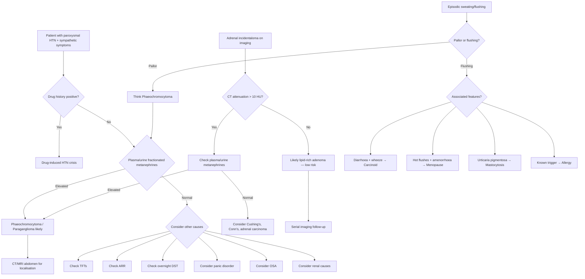

## Differential Diagnosis of Phaeochromocytoma

The differential diagnosis of phaeochromocytoma is essentially the differential diagnosis of its **presenting features** — namely, paroxysmal hypertension, episodic sympathetic-type symptoms (headache, sweating, palpitations, pallor), and/or an adrenal incidentaloma. Let's approach this systematically from first principles.

### Why is the DDx Important?

Phaeochromocytoma is rare (< 0.2% of all hypertension) [3], but it sits within a sea of much more common conditions that can mimic it. The key clinical challenge is: **when a patient presents with paroxysmal sweating, headache, palpitations, and hypertension — is this a phaeo, or something else?** Missing a phaeo is dangerous (crisis during surgery/anaesthesia), but over-investigating is wasteful. So you need a logical framework.

---

### 9.1 Approach to the Differential Diagnosis

The DDx depends on the **clinical presentation**. There are three main clinical scenarios:

1. **Paroxysmal hypertension with sympathetic symptoms** (the classic presentation)
2. **Episodic sweating and/or flushing** [3]
3. **Adrenal incidentaloma** [8]

We will address each systematically.

---

### 9.2 DDx of Paroxysmal Hypertension with Sympathetic Symptoms

This is the classic phaeo presentation. The question is: **what else causes paroxysmal blood pressure surges with headache, sweating, palpitations, and pallor?**

| Differential | Key Distinguishing Features | Why It Mimics Phaeo |
|---|---|---|
| **Essential (primary) hypertension** | Most common cause of HTN (> 90%); usually sustained, not paroxysmal; no orthostatic hypotension; normal metanephrines | Does not truly mimic phaeo, but is so common that most hypertensive patients being screened will have this |
| **Panic disorder / anxiety disorders** [7] | Episodic palpitations, sweating, tremor, chest tightness, sense of doom; BUT associated with **flushing** (not pallor), no true sustained HTN between episodes, normal metanephrines; symptoms often triggered by psychological stressors not physical ones | Catecholamine-like fight-or-flight response from central sympathetic activation; but the BP rise is modest and there is no true catecholamine excess |
| **Thyrotoxicosis** | Persistent (not episodic) symptoms: heat intolerance, weight loss, tremor, diarrhoea, lid lag/retraction, goitre; predominantly systolic HTN with wide pulse pressure | ↑β-adrenergic sensitivity from thyroid hormone excess causes tachycardia, sweating, tremor — but ***not usually episodic*** [3] |
| **Hypoglycaemia** | Sweating, palpitations, tremor, anxiety; but a/w **neuroglycopenic symptoms** (confusion, seizures); relieved by glucose; usually in context of diabetes treatment or insulinoma | Sympathoadrenal counter-regulatory response to low glucose mimics catecholamine excess; ***tends to be episodic*** and more likely to ***mimic phobic disorder or panic disorder*** [7] |
| **Renovascular hypertension / renal artery stenosis** | Resistant HTN, abdominal bruit, flash pulmonary oedema, worsening renal function on ACEi/ARB [4] | Can cause severe HTN via RAAS activation but lacks the episodic sympathetic symptoms |
| **Primary aldosteronism (Conn's syndrome)** | Resistant HTN + hypokalaemia + metabolic alkalosis; muscle cramps, weakness; differentiated by **plasma aldosterone-to-renin ratio (ARR)** [4] | Causes secondary HTN but without paroxysmal catecholamine-type symptoms |
| **Cushing's syndrome** | Central obesity, moon face, buffalo hump, striae, proximal myopathy, hyperglycaemia; screened by **overnight 1mg dexamethasone suppression test** [4][9] | Cortisol excess causes HTN via mineralocorticoid activity and ↑vascular sensitivity to catecholamines; can co-exist with phaeo in rare cases |
| **Drug-induced hypertensive crises** | History of substance use: cocaine, amphetamines, MAOIs + tyramine, sympathomimetics, decongestants, TCAs; abrupt clonidine/methyldopa withdrawal [4] | Exogenous sympathomimetic stimulation causes identical catecholamine-excess symptoms; **always take a thorough drug history** |
| **Obstructive sleep apnoea (OSA)** | Resistant HTN, obesity, snoring, daytime somnolence; nocturnal BP surges; screened by polysomnography [4] | Intermittent hypoxia → sympathetic activation → nocturnal HTN surges |
| **Coarctation of the aorta** | Young HTN (< 30y), upper limb > lower limb BP, **radiofemoral delay**, continuous murmur over chest/back [4] | Mechanical obstruction causes upper body HTN; but no episodic symptoms |
| **Autonomic dysreflexia** | Only in spinal cord injury above T6; paroxysmal HTN triggered by bladder distension, bowel impaction; flushing above level of lesion, pallor below | Uninhibited sympathetic discharge below the level of spinal cord lesion |
| **Carcinoid syndrome** | Episodic **flushing** (not pallor), diarrhoea, wheezing, right heart valve disease; screened by 24h urine 5-HIAA | Serotonin and other vasoactive substances cause episodic vasomotor symptoms — but carcinoid causes **flushing** whereas phaeo causes **pallor** [3] |
| **Baroreflex failure** | History of neck surgery/radiation (e.g. carotid endarterectomy, radical neck dissection); volatile BP with both severe HTN and hypotension | Damage to baroreceptors → loss of buffering capacity → wide BP swings with sympathetic surges |

<Callout title="Phaeo vs Panic: A Classic DDx Trap" type="error">
Both conditions cause episodic palpitations, sweating, and a sense of doom. The key differences: (1) **Pallor** in phaeo vs **flushing** in panic (α₁ vasoconstriction vs anxiety-mediated vasodilation). (2) **Severe hypertension** during attacks in phaeo (often > 200 systolic) vs modest or normal BP in panic. (3) **Postural hypotension between attacks** in phaeo (volume depletion + receptor downregulation) — not a feature of panic disorder. (4) Normal plasma/urine metanephrines exclude phaeo. ***Panic attacks can occur as a result of phaeochromocytoma*** [7] — so always consider biochemical screening in atypical or refractory panic presentations, especially with concurrent hypertension.
</Callout>

---

### 9.3 ***DDx of Episodic Sweating and/or Flushing*** [3]

This is explicitly highlighted in the senior notes and is a high-yield differential:

| Condition | Sweating? | Flushing? | Key Distinguishing Points |
|---|---|---|---|
| ***Oestrogen/testosterone deficiency (e.g. menopause, castration)*** | Yes | Yes (hot flushes) | Typical age/context; hormone levels confirm; responsive to HRT |
| ***Carcinoid syndrome*** | Possible | ***Yes (flushing, diarrhoea, wheeze)*** | Episodic flushing + diarrhoea + wheezing; 24h urine 5-HIAA elevated; right-sided valve disease |
| ***Phaeochromocytoma*** | ***Yes*** | ***No — sweats but does NOT flush*** | Pallor (not flushing) due to α₁-mediated vasoconstriction; elevated plasma/urine metanephrines |
| ***Thyrotoxicosis*** | Yes | Possible | ***Not usually episodic*** — symptoms are persistent; check TFTs |
| ***Systemic mastocytosis*** | Yes | Yes (histamine release) | Urticaria pigmentosa, anaphylaxis; elevated serum tryptase |
| ***Allergy*** | Possible | Yes | Identifiable trigger; associated urticaria/angioedema; IgE-mediated |

<Callout title="Key Distinction: Sweating WITHOUT Flushing = Think Phaeo">
Phaeochromocytoma causes **pallor** during attacks (α₁-mediated vasoconstriction), NOT flushing. If a patient has episodic sweating with **flushing**, think menopause, carcinoid, or mastocytosis instead. This is a classic distinguishing feature [3].
</Callout>

---

### 9.4 DDx of Adrenal Incidentaloma [8]

When a phaeochromocytoma is discovered incidentally on imaging (which accounts for **~60% of cases** [2]), the differential is that of any adrenal mass:

| Cause | Approximate Frequency | Key Features |
|---|---|---|
| **Non-functioning adenoma** | **85%** | Lipid-rich (< 10 HU on unenhanced CT), homogeneous, well-defined, < 4 cm |
| **Subclinical Cushing's (cortisol-secreting adenoma)** | 5–10% | Mild autonomous cortisol secretion; abnormal 1mg DST; may have subtle Cushingoid features |
| **Phaeochromocytoma** | ~5% | **Lipid-poor** ( > 10 HU), ↑vascularity, heterogeneous, may be large; **MUST exclude before biopsy** [8] |
| **Primary aldosteronism (Conn's adenoma)** | ~1% (if hypertensive) | HTN + hypokalaemia; ↑aldosterone, ↓renin |
| **Adrenocortical carcinoma** | ~2% (higher if > 4 cm) | Large ( > 4 cm), heterogeneous, irregular margins, delayed contrast washout, calcification; may secrete androgens/cortisol |
| **Metastasis** (from lung, breast, melanoma, renal, etc.) | ~2–5% | History of known primary malignancy; bilateral in 50%; biopsy may be indicated **only after excluding phaeo** |
| **Others** | Rare | Myelolipoma (fat-containing, pathognomonic on CT), ganglioneuroma, haemorrhage, cyst, granuloma (TB, sarcoid) |

<Callout title="Never Biopsy an Adrenal Mass Without Excluding Phaeo First" type="error">
***Biopsy is NOT for primary adrenal tumours — especially avoid if phaeochromocytoma is possible*** [8]. Biopsy of an undiagnosed phaeo can trigger a **fatal catecholamine crisis**. Additionally, histology cannot reliably distinguish benign from malignant primary adrenal tumours. Always check plasma/urine metanephrines before any adrenal biopsy.
</Callout>

---

### 9.5 DDx of Secondary Hypertension — The "DANCER" Framework [4]

Phaeochromocytoma is one cause within the broader differential of secondary hypertension. The mnemonic ***DANCER*** helps organise this:

| Letter | Cause | Screen When | Screen By |
|---|---|---|---|
| **D** | ***Drugs*** (OCP, NSAIDs, steroids, sympathomimetics, cocaine, amphetamines, TCA, cyclosporine) [4] | Always — take a thorough drug history | Drug history |
| **A** | ***Apnoea*** (obstructive sleep apnoea) | Resistant HTN + obesity + snoring + daytime sleepiness | Polysomnography |
| **N** | ***Neurological*** (↑ICP, stress, autonomic dysfunction) | Clinically indicated | Clinical evaluation |
| **C** | ***Coarctation of aorta*** | Young HTN < 30y, radiofemoral delay, UL > LL BP | Echocardiogram, CTA/MRA thorax |
| **E** | ***Endocrine*** | Clinically indicated | See below |
| **R** | ***Renal*** (parenchymal disease, renal artery stenosis) | Abnormal urinalysis, renal bruit, worsening renal function on ACEi | Renal USG, duplex USG, MRA |

**Endocrine causes** further broken down [4]:
- **Thyroid**: hyperthyroidism (systolic HTN), hypothyroidism (diastolic HTN)
- **Adrenal**: ***Cushing's syndrome, Conn's syndrome, phaeochromocytoma***
- **Parathyroid**: hyperparathyroidism (hypercalcaemia → HTN)
- **Others**: pre-eclampsia, acromegaly

| Cause | Prevalence Among HTN | Screen By [4] |
|---|---|---|
| Primary aldosteronism | 8–20% | ***Plasma ARR → salt loading test*** |
| Renal artery stenosis | 5–34% | ***Renal duplex USG → MRA → CT abdomen*** |
| Renal parenchymal disease | 1–2% | ***Renal USG → renal biopsy*** |
| OSA | 25–50% | ***Polysomnography*** |
| Coarctation of aorta | 0.1% | ***Echocardiogram → CTA/MRA*** |
| ***Phaeochromocytoma / paraganglioma*** | ***0.1–0.6%*** | ***24h urine fractionated metanephrines → plasma metanephrines*** [4] |
| Cushing's syndrome | < 0.1% | ***Overnight 1mg DST*** |

---

### 9.6 Indications for Screening for Phaeochromocytoma [3][4]

When should you actively pursue the diagnosis? The ***indications for screening*** [3]:

- ***Compatible symptoms***: paroxysmal HTN, hyperadrenergic spells, classic triad (headache + sweating + palpitations)
- ***Atypical hypertension***: young onset, resistant or paroxysmal HTN, HTN associated with new-onset DM
- ***↑Risk of phaeochromocytoma***: family history, genetic syndromes (***MEN2, VHL, NF1***)
- ***Adrenal incidentaloma***: ***usually only when CT attenuation > 10 HU (lipid-poor)*** [3]
- ***Others***: ***pressor response during anaesthesia/surgery/angiography, idiopathic DCMP, GIST + pulmonary chondroma (Carney's triad)*** [3]

---

### 9.7 Differential Diagnosis Algorithm

---

### 9.8 Summary Table: Key Differentiators

| Feature | Phaeochromocytoma | Panic Disorder | Thyrotoxicosis | Carcinoid | Menopause |
|---|---|---|---|---|---|
| **Episodic** | Yes | Yes | No (persistent) | Yes | Yes |
| **HTN** | Severe, paroxysmal | Mild/absent | Systolic (wide PP) | Usually absent | Usually absent |
| **Pallor vs Flush** | **Pallor** | Flushing | Flushing | **Flushing** | **Flushing** |
| **Sweating** | Profuse | Present | Present | Variable | Present |
| **Orthostatic hypotension** | **Yes** (characteristic) | No | No | No | No |
| **Screening test** | Metanephrines | Clinical/psychometric | TFTs | 24h urine 5-HIAA | FSH/oestradiol |

<Callout title="High Yield Summary">

**The DDx of phaeochromocytoma is the DDx of paroxysmal sympathetic symptoms + hypertension:**

1. **Most important mimics**: Panic disorder, thyrotoxicosis, drug-induced HTN crisis, hypoglycaemia
2. **Episodic sweating DDx** [3]: Menopause, carcinoid (flushing + diarrhoea + wheeze), phaeo (sweats but does NOT flush), thyrotoxicosis (not episodic), systemic mastocytosis, allergy
3. **Key distinguisher**: Phaeo = **pallor** (α₁ vasoconstriction); most other causes = **flushing**
4. **Adrenal incidentaloma DDx** [8]: Non-functioning adenoma (85%), subclinical Cushing's, phaeo, Conn's, adrenal carcinoma, metastasis — **always exclude phaeo before biopsy**
5. **Secondary HTN framework (DANCER)** [4]: Drugs, Apnoea, Neurological, Coarctation, Endocrine (thyroid, adrenal — Cushing's/Conn's/phaeo, parathyroid), Renal
6. ***Screening indications*** [3]: compatible symptoms, atypical HTN (young/resistant/paroxysmal), genetic syndrome risk (MEN2/VHL/NF1), adrenal incidentaloma with CT > 10 HU, pressor response during procedures, idiopathic DCMP
7. ***Screening test***: 24h urine fractionated metanephrines (Sens 98%, Spec 98%) or plasma fractionated metanephrines (Sens 96–100%, Spec 85–89%) [3]

</Callout>

---

<ActiveRecallQuiz
  title="Active Recall - Phaeochromocytoma Differential Diagnosis"
  items={[
    {
      question: "A patient presents with episodic sweating, palpitations, and hypertension. How do you distinguish phaeochromocytoma from panic disorder clinically?",
      markscheme: "Phaeo: pallor during attacks (alpha-1 vasoconstriction), severe hypertension (often > 200 systolic), orthostatic hypotension between attacks, elevated plasma/urine metanephrines. Panic: flushing (not pallor), modest or normal BP, no orthostatic hypotension, normal metanephrines. However, phaeo can itself cause panic-like symptoms, so biochemical screening should be done in atypical or refractory panic with HTN.",
    },
    {
      question: "List the differential diagnosis of episodic sweating and/or flushing as outlined in the endocrine notes. Which condition causes sweating WITHOUT flushing?",
      markscheme: "DDx: (1) Oestrogen/testosterone deficiency (menopause, castration) - flushing, (2) Carcinoid syndrome - flushing plus diarrhoea plus wheeze, (3) Phaeochromocytoma - sweats but does NOT flush (pallor instead), (4) Thyrotoxicosis - not usually episodic, (5) Systemic mastocytosis - histamine release, (6) Allergy. Phaeochromocytoma is the condition that causes sweating without flushing.",
    },
    {
      question: "What is the DANCER mnemonic for secondary hypertension? List each letter and give one example cause.",
      markscheme: "D = Drugs (OCP, NSAIDs, cocaine, sympathomimetics). A = Apnoea (obstructive sleep apnoea). N = Neurological (raised ICP, stress). C = Coarctation of aorta. E = Endocrine (thyroid, adrenal - Cushing's/Conn's/phaeo, parathyroid). R = Renal (renal artery stenosis, renal parenchymal disease).",
    },
    {
      question: "An adrenal incidentaloma is found on CT. What is the most important biochemical test to perform before any consideration of biopsy, and why?",
      markscheme: "Plasma or urine fractionated metanephrines to exclude phaeochromocytoma. Biopsy of an undiagnosed phaeo can precipitate a fatal catecholamine crisis. Also, histology cannot reliably distinguish benign from malignant primary adrenal tumours. Any adrenal incidentaloma with CT attenuation greater than 10 HU (lipid-poor) should be screened biochemically.",
    },
    {
      question: "State the indications for screening for phaeochromocytoma as outlined in the course notes.",
      markscheme: "Compatible symptoms (paroxysmal HTN, hyperadrenergic spells, classic triad), atypical hypertension (young onset, resistant, or paroxysmal HTN, HTN with new-onset DM), increased risk of phaeo (family history, genetic syndromes such as MEN2, VHL, NF1), adrenal incidentaloma with CT attenuation greater than 10 HU, pressor response during anaesthesia or surgery or angiography, idiopathic dilated cardiomyopathy, GIST plus pulmonary chondroma (Carney triad).",
    },
  ]}
/>

---

## References

[2] Senior notes: maxim.md (Phaeochromocytoma — Definitions, Clinical features, 5 Ps, 10% rule)
[3] Senior notes: Ryan Ho Endocrine.pdf (Section 3.4 Phaeochromocytoma — Clinical features, DDx of episodic sweating/flushing, indications for screening, diagnosis)
[4] Senior notes: Ryan Ho Cardiology.pdf (p177–178 — Secondary HTN workup, DANCER mnemonic, screening table for 2° HTN causes)
[7] Senior notes: Ryan Ho Psychiatry.pdf (p175, p179 — Phaeochromocytoma mimicking panic disorder/anxiety; panic DDx includes phaeo, hyperthyroidism, hyperPTH)
[8] Senior notes: Ryan Ho Fundamentals.pdf (p438 — Adrenal incidentaloma DDx and approach; contraindication to biopsy without excluding phaeo)
[9] Senior notes: Ryan Ho Chemical Path.pdf (p29 — Diagnosis of Cushing's syndrome, DST)
