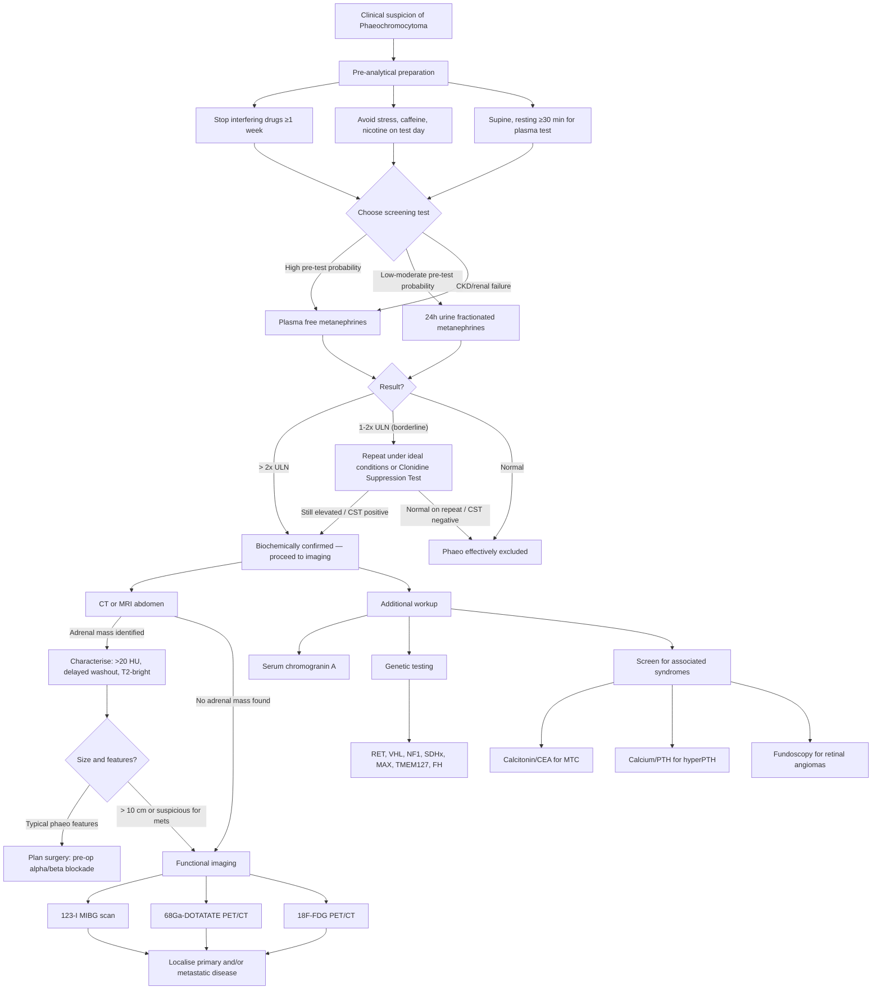

## Diagnostic Criteria, Algorithm and Investigations for Phaeochromocytoma

### 10.1 Why There Are No "Diagnostic Criteria" in the Traditional Sense

Unlike conditions such as rheumatoid arthritis or SLE, phaeochromocytoma does not have a set of formal classification criteria with point scores. Instead, the diagnosis is established through a **two-step approach** [3][10]:

1. **Biochemical confirmation** — demonstrating autonomous catecholamine excess (elevated metanephrines)
2. **Anatomical/functional localisation** — identifying the tumour on imaging

The logic is simple from first principles: the tumour's defining feature is **catecholamine overproduction**. So you first prove the biochemistry is abnormal, and only then do you look for where the tumour is. Never image first and biopsy — that can kill the patient [2][8].

---

### 10.2 Pre-Analytical Considerations — Before You Even Order the Test

This is a step many students overlook, but it is **critical** for accurate interpretation.

#### ***Drugs that Interfere with Catecholamine/Metanephrine Measurement*** [2][3]

***Stop drugs affecting catecholamine secretion*** before testing [3]:

| Drug Class | Mechanism of Interference | Action |
|---|---|---|
| ***Tricyclic antidepressants (TCAs)*** | Block noradrenaline reuptake → ↑plasma normetanephrine | ***Stop ≥1 week before testing*** [2] |
| ***α-agonists*** (e.g. clonidine, methyldopa) | Interfere with catecholamine metabolism | Stop before testing |
| ***Levodopa*** | Precursor of dopamine → converted to catecholamines | Stop before testing |
| ***Amphetamines, cocaine*** | Sympathomimetics → ↑catecholamine release | Stop before testing |
| ***MAO inhibitors*** | Block catecholamine degradation → ↑levels | Stop before testing |
| ***Paracetamol (acetaminophen)*** | Analytical interference with some HPLC-based metanephrine assays | Avoid for 48h before some lab assays |
| ***Caffeine, nicotine, alcohol*** | Sympathetic stimulation → modest ↑catecholamines | Avoid on testing day |

#### ***Conditions Causing False Positives*** [2]

| Condition | Mechanism |
|---|---|
| ***Stress*** (acute illness, surgery, pain) | Physiological sympathetic activation → ↑catecholamines |
| ***Obstructive sleep apnoea*** | Nocturnal hypoxia → sympathetic surges → ↑catecholamines [2] |
| ***Heart failure*** | Chronic sympathetic activation |
| ***Renal failure*** | ↓Clearance of metanephrines (for urine tests); also ↑sympathetic tone |

<Callout title="Exam Pearl — False Positives" type="error">
The most common reason for a false-positive metanephrine result is **failure to stop interfering medications** and **not controlling for physiological stress**. Always check the drug history and testing conditions before interpreting results.
</Callout>

---

### 10.3 Biochemical Diagnosis — The First Step

The principle: **prove the tumour is making excess catecholamines/metanephrines** before looking for it on imaging.

#### A. ***24-hour Urine Fractionated Metanephrines*** [2][3]

- **What it measures**: Metanephrine + normetanephrine (O-methylated metabolites of adrenaline and noradrenaline) collected over 24 hours in urine
- **Why fractionated?**: "Fractionated" means the individual components (metanephrine, normetanephrine, and sometimes 3-methoxytyramine) are measured **separately**, not as a combined total — this gives better specificity and can help indicate the biochemical phenotype
- **Performance**: ***Sensitivity 98%, Specificity 98%*** [3] — this is the best balance of sensitivity and specificity
- **Why it works**: Chromaffin cells continuously metabolise catecholamines to metanephrines via intracellular COMT. A 24-hour collection integrates this continuous production, smoothing out episodic secretion
- **Interpretation**: ***Abnormal if > 2× upper limit of normal*** [2] — at this threshold, specificity is very high and further confirmation is rarely needed
- **Advantage**: Non-invasive, widely available, excellent combined sensitivity and specificity
- **Disadvantage**: Requires complete 24-hour collection (inconvenient, potential for under-/over-collection); difficult to interpret in ***chronic renal failure*** (impaired urine collection and ↓renal clearance) [2]

#### B. ***Plasma Fractionated Metanephrines*** [3]

- **What it measures**: Free metanephrine + free normetanephrine in plasma (venous blood sample)
- **Performance**: ***Sensitivity 96–100%, Specificity 85–89%*** [3]
- **Why highest sensitivity?**: Chromaffin cells constitutively produce metanephrines via COMT regardless of episodic catecholamine release. Plasma free metanephrines directly reflect this continuous tumour metabolism — so even between paroxysms, levels are elevated
- **Sampling conditions**: Patient should be **supine for > 30 minutes** with an ***indwelling venous catheter*** (placed > 30 min prior to sampling) to minimise stress-related catecholamine surges [2]
- **Preferred in**: ***Chronic renal failure*** (because 24h urine is difficult to interpret) [2]; also in patients with high pre-test probability (e.g. known genetic syndromes)
- **Disadvantage**: Lower specificity than 24h urine → more false positives (especially if sampling conditions are not ideal); not universally available

#### C. ***24-hour Urine Catecholamines*** [2]

- Measures adrenaline, noradrenaline, and dopamine directly
- Less sensitive than metanephrines because catecholamine release is **episodic** — levels may be normal between paroxysms
- Still used as an **adjunct** in some centres
- Included in some screening panels alongside metanephrines

#### D. ***24-hour Urine VMA (Vanillylmandelic Acid)*** [3]

- The final end-product of catecholamine metabolism
- ***Now superseded as less accurate*** [3] — lower sensitivity (~64%) and specificity compared to fractionated metanephrines
- Historical test only; not recommended as a first-line screening test

#### E. ***Plasma Catecholamines***

- Direct measurement of circulating noradrenaline, adrenaline, and dopamine
- Very sensitive to sampling conditions (stress, posture, venepuncture itself → false elevation)
- Not recommended as first-line; may be useful as an adjunct

<Callout title="Which Test to Order First?">
The **Endocrine Society 2014 guidelines** (still current in 2025–2026) recommend:
- **First-line**: Either ***24h urine fractionated metanephrines*** OR ***plasma free metanephrines***
- For **high pre-test probability** (genetic syndromes, prior phaeo, adrenal incidentaloma > 10 HU): Plasma free metanephrines preferred (highest sensitivity — you don't want to miss it)
- For **low-to-moderate pre-test probability** (screening in HTN): 24h urine fractionated metanephrines may be preferred (higher specificity — fewer false positives)
- ***Biopsy is NOT required*** — ***high risk of hypertensive crisis and haematoma*** [2]
</Callout>

#### F. Interpretation of Biochemical Results

| Result | Interpretation | Next Step |
|---|---|---|
| **Metanephrines > 2× ULN** | ***Highly suggestive of phaeochromocytoma*** [2] | Proceed directly to **imaging for localisation** |
| **Metanephrines 1–2× ULN** | Borderline — could be phaeo or false positive | Repeat testing under ideal conditions (supine, no interfering drugs, no stress); consider **clonidine suppression test** |
| **Metanephrines normal** | Effectively excludes phaeo (negative predictive value > 99% for plasma free metanephrines) | No further workup unless clinical suspicion remains very high |

#### G. ***Clonidine Suppression Test*** (Dynamic Confirmatory Test)

- **Principle**: Clonidine is a central α₂-agonist that **suppresses sympathetic outflow** → ↓plasma noradrenaline in healthy individuals and patients with essential hypertension
- In phaeochromocytoma, catecholamine secretion is **autonomous** (from the tumour), NOT dependent on central sympathetic drive → clonidine **fails to suppress** plasma noradrenaline/normetanephrine
- **Protocol**: Measure baseline plasma catecholamines/normetanephrine → give oral clonidine 300 μg → remeasure at 3 hours
- **Positive result** (suggesting phaeo): Failure of plasma normetanephrine to suppress into the normal range, or < 40% reduction from baseline
- **Indication**: Borderline biochemistry (metanephrines 1–2× ULN) where diagnosis is uncertain
- Side effect: hypotension and sedation (monitor BP)

---

### 10.4 Other Biochemical Investigations

#### ***Serum Chromogranin A*** [3]

- Chromogranin A is a glycoprotein stored in chromaffin granules and co-released with catecholamines
- ***Useful tumour marker for metastatic disease*** [3] — elevated levels correlate with tumour burden
- Also elevated in other neuroendocrine tumours (carcinoid, neuroblastoma) → not specific
- Caution: elevated by PPIs (proton pump inhibitors), renal failure, chronic atrophic gastritis → stop PPIs before testing

#### ***Genetic Testing*** [3]

***Genetic testing is indicated if*** [3]:
- ***Other features of genetic syndrome*** (e.g. medullary thyroid carcinoma → MEN2)
- ***Family history of phaeochromocytoma***
- ***Presenting age < 50 years old***
- Bilateral or multifocal tumours
- Extra-adrenal location (paraganglioma)
- Malignant/metastatic PPGL

Current recommendation: Comprehensive panel testing for **RET, VHL, NF1, SDHA/B/C/D, SDHAF2, MAX, TMEM127, FH** genes.

---

### 10.5 Imaging for Localisation — The Second Step

**Golden rule**: Only image AFTER biochemical confirmation. The purpose of imaging is to **locate the tumour** for surgical planning, not to make the diagnosis.

#### A. ***CT/MRI Abdomen*** — First-Line Anatomical Imaging [3]

| Modality | Key Points |
|---|---|
| **CT abdomen** | ***Can usually identify adrenal + intra-abdominal extra-adrenal phaeochromocytomas*** [3] |
| | ***Detection rate: Sensitivity 98–100%, Specificity 70%*** in sporadic phaeochromocytoma [3] |
| | ***Findings: > 20 HU high attenuation, ↑vascularity, delayed contrast washout*** [3] |
| | Typically heterogeneous, well-vascularised, may contain areas of necrosis/haemorrhage |
| | ***IV iodinated contrast may induce a pressor crisis*** [3] → ***consider preparation with complete adrenoceptor blockade, e.g. phenoxybenzamine*** |
| | However: ***low-osmolar contrast is safe even without alpha/beta blockade*** [2] (modern non-ionic contrast agents have negligible risk) |
| **MRI abdomen** | Preferred in: children, pregnant women, patients with contrast allergy, SDHx carriers needing lifelong surveillance (to minimise cumulative radiation) |
| | ***T2-weighted hyperintense*** ("light bulb sign") [3] — phaeochromocytomas appear very bright on T2W MRI due to their high water content and vascularity |
| | No radiation exposure; similar sensitivity to CT |

<Callout title="Why are phaeochromocytomas bright on T2-weighted MRI?">
The tumour has a very high water content (large extracellular fluid component, areas of haemorrhage and necrosis, rich vascularity). Water has a long T2 relaxation time → appears hyperintense (bright) on T2-weighted sequences. This "light bulb" appearance, while not pathognomonic (cysts, some carcinomas can also be T2-bright), is highly suggestive in the right clinical context.
</Callout>

**CT findings distinguishing phaeo from benign adenoma** [3][8]:

| Feature | Benign Adenoma | Phaeochromocytoma |
|---|---|---|
| **Unenhanced CT attenuation** | **< 10 HU** (lipid-rich) | ***> 20 HU*** (lipid-poor) |
| **Contrast enhancement** | Rapid washout (> 60% at 15 min) | ***Delayed contrast washout*** |
| **Vascularity** | Low | ***↑Vascularity*** |
| **Homogeneity** | Homogeneous | Often heterogeneous (necrosis, haemorrhage) |
| **Size** | Usually < 3 cm | Variable; often > 3 cm |

#### B. ***MIBG Scan (Meta-iodobenzylguanidine Scintigraphy)*** — Functional Imaging [3][10]

- **Radiopharmaceutical**: ***¹²³I-MIBG*** (or ¹³¹I-MIBG)
- **Principle**: ***MIBG is an analogue of norepinephrine*** [2][10] → ***taken up by norepinephrine-secreting cells*** (chromaffin cells) via the noradrenaline transporter (uptake-1 mechanism) → ***scintigraphy reveals adrenomedullary images 24–48 hours after injection*** [3]
- **Physiological distribution** (organs supplied by sympathetic nervous system + excretion routes) [10]:
  - Liver and spleen
  - Myocardium
  - Salivary glands and thyroid
  - Normal adrenals
  - Other organs (nasal mucosa, bladder, colon)
- ***Thyroid blockade should be used*** as radioiodine in ¹³¹I-MIBG may localise to the thyroid and destroy glandular tissue (e.g. **Lugol's solution**) [10]

| Feature | Detail |
|---|---|
| **Sensitivity** | ~85–90% for adrenal phaeo; lower (~60%) for paraganglioma and metastatic disease |
| **Specificity** | ~95–100% — very high (MIBG is specifically taken up by chromaffin tissue) |
| ***Indications*** | ***Negative initial CT/MRI abdomen, > 10 cm adrenal tumour (↑risk of metastases), paraganglioma (↑risk of multifocal or metastatic tumour)*** [3] |
| **Clinical indications (from nuclear medicine)** [10] | ***Diagnosis of phaeochromocytoma, neuroblastoma or other APUD cell tumours; staging and follow-up; detection of metastasis and recurrent disease; plan for MIBG therapy*** |

<Callout title="When Do You Need MIBG Beyond CT/MRI?">
CT/MRI is excellent for finding the primary adrenal tumour (~98% sensitivity). You need functional imaging (MIBG or PET) when: (1) CT/MRI is **negative** but biochemistry is strongly positive (the tumour may be extra-adrenal or occult), (2) the tumour is **very large ( > 10 cm)** raising concern for metastatic disease, or (3) the tumour is a **paraganglioma** which has a higher risk of being multifocal or metastatic [3].
</Callout>

#### C. ***PET/CT*** — For Metastatic/Complex Disease [3]

| Tracer | Mechanism | Indication |
|---|---|---|
| ***⁶⁸Ga-DOTATATE PET/CT*** | Binds to somatostatin receptors (SSTR2) on neuroendocrine tumour cells | ***For malignant/metastatic disease*** [3]; superior to MIBG for detecting metastatic PPGL; now considered best functional imaging for SDHx-related tumours |
| **¹⁸F-FDG PET/CT** | Detects ↑glucose metabolism in metabolically active tumours | ***For malignant disease*** [3]; useful when MIBG-negative; high sensitivity for SDHx-mutated (aggressive) tumours |
| **¹⁸F-FDOPA PET/CT** | Analogue of DOPA — taken up by catecholamine-synthesising cells | High sensitivity for head/neck paragangliomas; not universally available |

#### D. ***Adrenal Venous Sampling*** [10]

- ***From femoral vein, for Conn's syndrome and phaeochromocytoma*** [10]
- Rarely needed for phaeo (imaging is usually sufficient); more commonly used in primary aldosteronism to lateralise the source
- May be considered in complex/bilateral cases

---

### 10.6 Full Diagnostic Algorithm

---

### 10.7 Summary of Investigations — Quick Reference Table

| Investigation | What It Measures | Sensitivity | Specificity | Key Points |
|---|---|---|---|---|
| ***24h urine fractionated metanephrines*** | Metanephrine + normetanephrine in urine | ***98%*** | ***98%*** | Best combined Sens/Spec; ***abnormal if > 2× ULN*** [2][3] |
| ***Plasma free metanephrines*** | Free metanephrine + normetanephrine in plasma | ***96–100%*** | ***85–89%*** | Highest sensitivity; ***preferred in CRF*** [2][3]; needs supine sampling with indwelling catheter |
| 24h urine catecholamines | Adrenaline, noradrenaline, dopamine | ~85% | ~90% | Adjunct; episodic secretion may cause false negatives |
| 24h urine VMA | Vanillylmandelic acid | ~64% | ~95% | ***Now superseded as less accurate*** [3] |
| Clonidine suppression test | Plasma normetanephrine/noradrenaline post-clonidine | ~97% | ~100% | For borderline cases; failure to suppress = autonomous secretion |
| ***Serum chromogranin A*** | Chromogranin A | Variable | Low | ***Useful tumour marker for metastatic disease*** [3]; elevated by PPIs |
| ***CT abdomen*** | Anatomical localisation | ***98–100%*** | ***70%*** | ***> 20 HU, ↑vascularity, delayed washout*** [3]; ***IV contrast may induce crisis*** [3] |
| ***MRI abdomen*** | Anatomical localisation | ~98% | ~70% | ***T2W hyperintense*** [3]; preferred in children/pregnancy |
| ***¹²³I-MIBG scan*** | Functional — NE analogue uptake by chromaffin tissue | ~85–90% | ~95–100% | ***Indications: negative CT/MRI, > 10 cm tumour, paraganglioma*** [3]; need thyroid blockade [10] |
| ***⁶⁸Ga-DOTATATE PET/CT*** | Somatostatin receptor binding | ~90–100% | ~90–95% | ***For metastatic disease*** [3]; best for SDHx-related PPGL |
| ***¹⁸F-FDG PET/CT*** | Glucose metabolism | ~85% | ~80% | ***For malignant disease*** [3]; high sensitivity for aggressive tumours |
| ***Genetic testing*** | Germline mutations | — | — | ***Indicated if: syndromic features, FHx, age < 50*** [3] |

---

### 10.8 Special Considerations

#### ***Adrenal Incidentaloma with Suspected Phaeo*** [8]

When an adrenal mass is found incidentally:
- Check **CT attenuation**: if ***> 10 HU (lipid-poor)***, phaeochromocytoma must be excluded biochemically [3][8]
- ***Biopsy is NOT indicated for primary adrenal tumours*** — especially ***avoid if phaeochromocytoma is suspected*** [8]
  - Histology is **not useful** in differentiating benign from malignant primary adrenal tumours
  - Biopsy may precipitate a **hypertensive crisis** and **tumour seeding**

#### ***Screening in Genetic Syndromes*** [3]

For known carriers of susceptibility genes (e.g. MEN2 kindreds):
- ***Annual screening by plasma/urine metanephrines from 11 years or 16 years of age depending on risk of specific mutation*** [3]
- This is lifelong surveillance because phaeos can develop at any time

#### ***CT Contrast Safety***

- Historically, **IV iodinated contrast** was considered high-risk for triggering pressor crises in phaeo patients [3]
- Modern **low-osmolar non-ionic contrast agents** are considered ***safe even without alpha/beta blockade*** [2]
- However, if using ionic or high-osmolar contrast (now rare), ***alpha-blockade should be established first*** [3]

---

<Callout title="High Yield Summary">

**Diagnosis of phaeochromocytoma is a two-step process: (1) Biochemical confirmation, then (2) Anatomical/functional localisation.**

**Step 1 — Biochemistry:**
- First-line: ***24h urine fractionated metanephrines (Sens 98%, Spec 98%)*** or ***plasma free metanephrines (Sens 96–100%, Spec 85–89%)*** [3]
- ***Abnormal if > 2× ULN*** [2] → proceed to imaging
- Borderline (1–2× ULN) → repeat under ideal conditions or perform **clonidine suppression test**
- ***Stop interfering drugs ≥1 week before*** (TCAs, α-agonists, levodopa, amphetamines) [2][3]
- ***Plasma metanephrines preferred in CRF*** [2]
- ***24h urine VMA is now superseded as less accurate*** [3]
- ***Biopsy is NOT required — high risk of hypertensive crisis and haematoma*** [2]

**Step 2 — Localisation:**
- ***CT/MRI abdomen*** first-line (Sens 98–100%, Spec 70%): ***> 20 HU, ↑vascularity, delayed washout, T2W hyperintense*** [3]
- ***MIBG scan***: NE analogue uptake; ***indications: negative CT/MRI, > 10 cm tumour, paraganglioma*** [3]
- ***⁶⁸Ga-DOTATATE or ¹⁸F-FDG PET/CT for metastatic disease*** [3]

**Additional:**
- ***Serum chromogranin A*** for metastatic disease [3]
- ***Genetic testing*** if: syndromic features, FHx, age < 50, bilateral/multifocal/extra-adrenal/metastatic [3]
- ***Annual metanephrine screening from age 11–16 in genetic syndrome carriers*** [3]

</Callout>

---

<ActiveRecallQuiz
  title="Active Recall - Phaeochromocytoma Diagnosis"
  items={[
    {
      question: "What are the two first-line biochemical screening tests for phaeochromocytoma? State their sensitivity and specificity.",
      markscheme: "24-hour urine fractionated metanephrines: Sensitivity 98%, Specificity 98%. Plasma free metanephrines: Sensitivity 96-100%, Specificity 85-89%. Urine test has better combined accuracy; plasma test has highest sensitivity and is preferred in high pre-test probability and CRF.",
    },
    {
      question: "A patient's urine metanephrines are 1.5 times the upper limit of normal. What do you do next?",
      markscheme: "This is a borderline result. Repeat testing under ideal conditions: stop interfering drugs for at least 1 week (TCAs, alpha-agonists, levodopa, amphetamines), avoid stress and caffeine, ensure proper 24h collection. If still borderline, perform a clonidine suppression test. If metanephrines fail to suppress after clonidine (autonomous secretion from tumour), the diagnosis is confirmed. If greater than 2 times ULN, proceed directly to imaging.",
    },
    {
      question: "Describe the principle of MIBG scintigraphy and list 3 indications for its use in phaeochromocytoma workup.",
      markscheme: "Principle: MIBG (metaiodobenzylguanidine) is a norepinephrine analogue taken up by chromaffin cells via the uptake-1 (noradrenaline transporter) mechanism. Radiolabelled with I-123 or I-131, scintigraphy reveals adrenomedullary images 24-48h after injection. Indications: (1) Negative initial CT/MRI abdomen, (2) Adrenal tumour greater than 10 cm (increased risk of metastases), (3) Paraganglioma (increased risk of multifocal or metastatic tumour). Must give thyroid blockade (Lugol's solution) to protect thyroid from radioiodine damage.",
    },
    {
      question: "Why should you never biopsy a suspected adrenal phaeochromocytoma?",
      markscheme: "Two reasons: (1) Biopsy may precipitate a fatal hypertensive crisis from massive catecholamine release triggered by tumour manipulation. (2) Histology is not useful in differentiating benign from malignant primary adrenal tumours (they have the same appearance). Also risk of tumour seeding. The diagnosis is made biochemically, not histologically.",
    },
    {
      question: "What CT and MRI imaging features are characteristic of phaeochromocytoma?",
      markscheme: "CT: Greater than 20 HU high attenuation (lipid-poor), increased vascularity, delayed contrast washout, heterogeneous with possible necrosis or haemorrhage. Compare with benign adenoma which is less than 10 HU and shows rapid washout. MRI: T2-weighted hyperintense (light bulb sign) due to high water content and vascularity. CT sensitivity 98-100%, specificity 70%.",
    },
    {
      question: "List 3 indications for genetic testing in a patient diagnosed with phaeochromocytoma.",
      markscheme: "Any 3 of: (1) Features of genetic syndrome (e.g. MTC suggesting MEN2, retinal angiomas suggesting VHL, cafe-au-lait spots suggesting NF1). (2) Family history of phaeochromocytoma or paraganglioma. (3) Age at presentation less than 50 years old. (4) Bilateral or multifocal tumours. (5) Extra-adrenal location (paraganglioma). (6) Metastatic disease. Current guidelines recommend genetic testing for all PPGL patients.",
    },
  ]}
/>

---

## References

[2] Senior notes: maxim.md (Phaeochromocytoma — Investigations, biopsy contraindication, false positives, MIBG, PET-CT)
[3] Senior notes: Ryan Ho Endocrine.pdf (Section 3.4 — Diagnosis: urine/plasma metanephrines performance, CT/MRI findings, MIBG indications, PET/CT for metastatic disease, chromogranin A, genetic testing indications, MEN2 screening)
[8] Senior notes: Ryan Ho Fundamentals.pdf (p438 — Adrenal incidentaloma approach, CT attenuation > 10 HU, biopsy contraindication)
[9] Senior notes: Ryan Ho Chemical Path.pdf (p29 — Diagnostic function tests, DST for Cushing's)
[10] Senior notes: Ryan Ho Diagnostic Radiology.pdf (p71 — MIBG scan principle, clinical indications, physiological distribution, thyroid blockade; p79 — Adrenal venous sampling)
