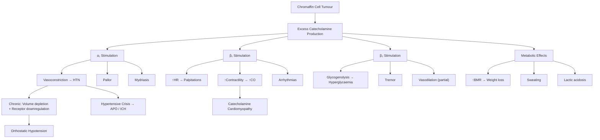

# Phaeochromocytoma

## 1. Definition

**Phaeochromocytoma** — let's break this name down from its Greek roots:
- **phaeo** (φαιός) = dusky/dark
- **chromo** (χρῶμα) = colour
- **cytoma** = tumour of cells

The name literally describes what happens when you stain the tumour with chromium salts — the chromaffin granules turn a dark brown colour (the **chromaffin reaction**). This is because catecholamines within the granules oxidise and polymerise on exposure to dichromate salts.

**Formal definition** [2]:
- **Phaeochromocytoma**: a catecholamine-secreting tumour derived from **chromaffin cells of the adrenal medulla**
- **Paraganglioma**: a tumour arising from chromaffin cells of the **sympathetic or parasympathetic nervous system** (i.e. extra-adrenal)
  - **Sympathetic paraganglioma**: usually **catecholamine-secreting** (essentially an "extra-adrenal phaeochromocytoma"), located along the sympathetic chain
  - **Parasympathetic paraganglioma**: usually **non-functional** (non-secretory), located in the **neck/skull base** (e.g. carotid body tumour, glomus jugulare)

The collective modern term is **PPGL** (phaeochromocytoma and paraganglioma). When clinicians say "phaeo" in casual speech, they typically mean the adrenal tumour.

<Callout title="Why does this matter?">
The clinical significance of phaeochromocytoma is its ability to produce life-threatening **paroxysms of catecholamine excess** — causing hypertensive crises, arrhythmias, stroke, and myocardial infarction. It is also one of the **curable causes of secondary hypertension**, making it a must-not-miss diagnosis.
</Callout>

---

## 2. Epidemiology

| Feature | Detail |
|---|---|
| **Incidence** | ~0.8 per 100,000/year [3] |
| **Proportion of HTN** | < 0.2% of all hypertensive patients [3] |
| **Age** | Any age, but peak in **4th–5th decades** (30–50 years) [3] |
| **Sex** | M:F = **1:1** [3] |
| **Presentation** | ~60% discovered **incidentally** on imaging (adrenal incidentaloma) [2] |
| **Familial** | Up to 30–40% have a germline mutation (historically quoted as 10%, but modern genetic testing has revised this upward) |

### The Classic "Rule of 10s" (Historical but Still Tested) [2]

| 10% Rule | Meaning |
|---|---|
| 10% familial | (actually closer to 30–40% with modern genetic testing) |
| 10% bilateral | (higher if familial, e.g. MEN2 up to 50% bilateral) |
| 10% extra-adrenal | (paraganglioma) |
| 10% malignant | (now reclassified — see below) |
| 10% secrete adrenaline/dopamine | (cf. 90% secrete noradrenaline predominantly) |
| 10% in children | |
| 10% not associated with HTN | |
| 10% recurrence after surgery | |

<Callout title="Exam Pearl" type="idea">
The "10% rule" is a classic exam favourite. However, be aware that the **10% familial figure is outdated** — current data show that **up to 30–40%** of PPGLs harbour germline mutations. The Endocrine Society now recommends **genetic testing for all patients with PPGL**.
</Callout>

### Hong Kong Context
- Phaeochromocytoma is rare in Hong Kong (as globally), but it is an important cause of **secondary hypertension** that must be excluded in the appropriate clinical context
- Hong Kong has a relatively high prevalence of hypertension (~27% of adults), making the identification of secondary causes clinically relevant
- MEN2 and VHL kindreds have been identified in Hong Kong Chinese families

---

## 3. Anatomy and Function of the Adrenal Medulla

### 3.1 Embryology
- The adrenal medulla is derived from **neuroectoderm** (specifically **neural crest cells**) [3]
- This is the same embryological origin as sympathetic ganglia — which is why extra-adrenal paragangliomas can arise anywhere along the sympathetic chain
- The adrenal cortex, by contrast, is derived from **mesoderm**

### 3.2 Gross Anatomy
- The adrenal medulla sits in the **centre** of the adrenal gland, surrounded by the cortex
- It comprises approximately **10%** of adrenal gland weight
- Composed almost exclusively of **chromaffin cells** (named for the chromaffin reaction described above) [3]

### 3.3 Blood Supply — Critical for Understanding Pathophysiology
The adrenal medulla has a **dual blood supply** [3]:

1. **Portal blood via corticomedullary sinuses**: blood drains from the adrenal cortex through the medulla before exiting
   - This is crucial because **cortisol from the cortex** bathes the medullary cells at very high local concentrations
   - Cortisol **induces phenylethanolamine-N-methyltransferase (PNMT)**, the enzyme that converts noradrenaline → adrenaline [3]
   - This explains why **adrenal tumours** can produce both noradrenaline AND adrenaline, while **extra-adrenal tumours** (which lack cortisol exposure) predominantly produce **noradrenaline only** [3]

2. **Medullary arteries**: direct arterial supply

<Callout title="Why do adrenal phaeos make adrenaline but paragangliomas don't?">
Because the enzyme PNMT (which converts noradrenaline → adrenaline) requires **high local cortisol concentrations** for induction. Only in the adrenal medulla do chromaffin cells receive cortisol-rich portal blood draining from the overlying cortex. Extra-adrenal chromaffin cells lack this cortisol exposure → they can only make noradrenaline.
</Callout>

### 3.4 Catecholamine Biosynthesis

The biosynthetic pathway in chromaffin cells is almost identical to that in sympathetic neurone terminals, with **one additional step** [3]:

```
Tyrosine
  ↓ (Tyrosine hydroxylase — rate-limiting step)
DOPA (dihydroxyphenylalanine)
  ↓ (DOPA decarboxylase)
Dopamine
  ↓ (Dopamine β-hydroxylase)
Noradrenaline
  ↓ (Phenylethanolamine-N-methyltransferase / PNMT — ONLY in adrenal medulla, cortisol-dependent)
Adrenaline
```

### 3.5 Catecholamine Secretion [3]

| Catecholamine | Receptor Profile | Source | Major Action |
|---|---|---|---|
| **Noradrenaline** | **α₁ + β₁** (no significant β₂) | Major circulating catecholamine at rest; 95% from peripheral sympathetic nerve endings, 5% from adrenal medulla | ↑BP (vasoconstriction via α₁), modest ↑HR (β₁) |
| **Adrenaline** | **β₁ + β₂** (little α₁) | Represents true adrenal medullary secretion | ↑CO (β₁), bronchodilation + vasodilation (β₂), little direct effect on BP at physiological doses |
| **Dopamine** | Varying (D₁, D₂, α, β at high concentrations) | Released during intense medullary activity; majority of circulating dopamine is of renal origin | Renal vasodilation (low dose), ↑CO (moderate dose), vasoconstriction (high dose) |

### 3.6 Catecholamine Metabolism [1][3]

This is **essential** for understanding the biochemical diagnosis:

Two major enzyme systems metabolise catecholamines:

1. **Catechol-O-methyltransferase (COMT)** — mainly found **extra-neuronally** in liver and kidneys [1][3]
   - Converts catecholamines to their **O-methylated derivatives** (metanephrines):
     - Adrenaline → **metanephrine**
     - Noradrenaline → **normetanephrine**
     - Dopamine → **3-methoxytyramine**

2. **Monoamine oxidase (MAO)** — deamination and oxidation
   - In sympathetic nerve terminals, MAO is the only metabolising enzyme → produces DHPG
   - Eventually, the combined action of COMT + MAO produces **vanillylmandelic acid (VMA)**, which is excreted in urine [1][3]

**Key point for diagnosis**: In the adrenal medullary chromaffin cells themselves, COMT is the dominant enzyme → the major metabolite produced **continuously** within the tumour is **free metanephrine** (from adrenaline) and **free normetanephrine** (from noradrenaline) [3]. This continuous production occurs **independent of catecholamine release** — which is why **plasma-free metanephrines** have the highest sensitivity for diagnosis.

<Callout title="Why are plasma free metanephrines the best screening test?">
Because chromaffin cells (normal or tumorous) continuously metabolise catecholamines to metanephrines via COMT within the cell. This process is **constitutive** (always happening), not dependent on episodic catecholamine secretion. So even between paroxysms, a phaeo is constantly leaking metanephrines into the blood. Catecholamines themselves are released episodically and may be normal between attacks.
</Callout>

### 3.7 Adrenoceptor Actions — Summary Table

| Receptor | Location | Effect |
|---|---|---|
| **α₁** | Vascular smooth muscle, pupil dilator | **Vasoconstriction** → ↑SVR → ↑BP; mydriasis |
| **α₂** | Presynaptic nerve terminals | Negative feedback → ↓noradrenaline release |
| **β₁** | Heart (SA node, AV node, myocardium) | ↑HR (chronotropy), ↑contractility (inotropy), ↑conduction (dromotropy) |
| **β₂** | Bronchial smooth muscle, vascular smooth muscle (skeletal muscle beds), liver, uterus | Bronchodilation, vasodilation, glycogenolysis, relaxation of uterus |
| **β₃** | Adipose tissue | Lipolysis, thermogenesis |

---

## 4. Aetiology

### 4.1 Sporadic (Most Common) [2]
- Accounts for the majority of cases (60–70%)
- No identifiable genetic cause
- Usually **unilateral** and **adrenal**

### 4.2 Familial / Hereditary Syndromes (~30–40%) [1][2][3]
All are **autosomal dominant** inheritance:

| Syndrome | Gene | Associated Features | Phaeo Characteristics |
|---|---|---|---|
| **MEN2A** | ***RET*** **proto-oncogene** (tyrosine kinase receptor) | ***Medullary thyroid carcinoma*** + ***Phaeochromocytoma*** + ***Parathyroid hyperplasia*** [1] | Bilateral in 50–80%; almost always adrenal; often adrenaline-predominant |
| **MEN2B** | ***RET*** **proto-oncogene** | ***Medullary thyroid carcinoma*** + ***Phaeochromocytoma*** + **Mucosal neuromas/intestinal ganglioneuromatosis** [1] | Similar to MEN2A; Marfanoid habitus |
| **Von Hippel-Lindau (VHL)** disease | **VHL gene** (3p25) | Clear cell **RCC** (40%), renal cysts (75%), cerebellar haemangioblastoma, retinal angiomas, epididymal/pancreatic cysts [5] | Often bilateral; extra-adrenal in ~30%; noradrenaline-predominant |
| **Neurofibromatosis type 1 (NF1)** | **NF1 gene** (17q11.2) | Café-au-lait macules, neurofibromas, axillary freckling, Lisch nodules, optic glioma [6] | Usually unilateral adrenal; ~2% of NF1 patients develop phaeo |
| **Familial paraganglioma syndromes** | **SDHx genes** (SDHA, SDHB, SDHC, SDHD) — succinate dehydrogenase subunits | Paragangliomas (head/neck + sympathetic chain) | SDHB mutations carry highest malignancy risk (up to 30–40%) |
| **Carney triad** | SDH gene mutation [2] | GIST + pulmonary chondroma + paragangliomas | Rare; usually in young women |

<Callout title="MEN Syndromes — Table" type="idea">

| Type | Gene | Components | Mnemonic |
|---|---|---|---|
| **MEN1** | MEN1 (menin) | **P**ancreatic endocrine tumour + **P**ituitary adenoma (prolactinoma) + **P**arathyroid hyperplasia | "3 P's" |
| **MEN2A** | RET | **M**edullary thyroid CA + **P**haeochromocytoma + **P**arathyroid hyperplasia | |
| **MEN2B** | RET | **M**edullary thyroid CA + **P**haeochromocytoma + **M**ucosal neuromas | |

</Callout>

<Callout title="Clinical Pearl — Screen for phaeo before thyroidectomy in MEN2" type="error">
In MEN2 patients presenting with medullary thyroid carcinoma, you **MUST** screen for and exclude phaeochromocytoma **before** performing thyroidectomy. Operating on an undiagnosed phaeo can trigger a fatal catecholamine crisis during anaesthesia induction.
</Callout>

### 4.3 Extra-adrenal Locations of Paragangliomas [2]

| Location | Percentage |
|---|---|
| **Para-aortic** (including Organ of Zuckerkandl*) | **75%** |
| **Urinary bladder** | **10%** |
| **Thorax** (posterior mediastinum) | **10%** |
| **Skull base / neck / pelvis** | **5%** |

*The **Organ of Zuckerkandl** is the largest collection of extra-adrenal chromaffin tissue, located at the **aortic bifurcation** near the origin of the inferior mesenteric artery. It is the most common site of extra-adrenal phaeochromocytoma (sympathetic paraganglioma).

---

## 5. Pathophysiology

### 5.1 Core Mechanism: Excess Catecholamine Production

The tumour consists of chromaffin cells that synthesise, store, and episodically release **massive amounts of catecholamines** (predominantly noradrenaline, but also adrenaline and dopamine depending on tumour location and enzyme expression).

The clinical manifestations are a direct consequence of **α- and β-adrenergic receptor stimulation**:

### 5.2 Haemodynamic Effects

**Hypertension** — the hallmark:
- **α₁ stimulation** → arterial vasoconstriction → ↑SVR → ↑BP
- **β₁ stimulation** → ↑HR + ↑cardiac contractility → ↑CO → ↑BP
- Pattern can be:
  - **Sustained hypertension** (~50%) — from chronic catecholamine excess
  - **Paroxysmal hypertension** (~30%) — from episodic catecholamine release
  - **Normotensive** (~10–20%) — especially dopamine-secreting tumours, or tumours with predominantly adrenaline production (which at low concentrations can cause β₂-mediated vasodilation)

**Postural (orthostatic) hypotension** — a paradoxical but classic finding [2]:
- Chronic catecholamine excess → **downregulation of α-adrenergic receptors** on blood vessels
- Chronic vasoconstriction → **reduced plasma volume** (pressure natriuresis + reduced venous capacitance)
- Combined effect: when the patient stands up, the normal baroreceptor-mediated vasoconstriction reflex is blunted → BP drops
- This is why you can see a patient with a BP of 220/120 who becomes orthostatic on standing — this combination should immediately make you think of phaeochromocytoma

### 5.3 Metabolic Effects

| Effect | Mechanism |
|---|---|
| **Hyperglycaemia** | β₂ stimulation → hepatic glycogenolysis + gluconeogenesis; α₂ stimulation → inhibition of insulin secretion from pancreatic β-cells |
| **Weight loss** | ↑basal metabolic rate from sustained catecholamine-driven thermogenesis; lipolysis via β₃ receptors |
| **Lactic acidosis** | Excessive vasoconstriction → tissue hypoperfusion → anaerobic metabolism |
| **Hypercalcaemia** | Rare; may be due to PTHrP secretion by the tumour, or co-existing hyperparathyroidism (MEN2A) |

### 5.4 Cardiac Effects

| Manifestation | Mechanism |
|---|---|
| **Catecholamine cardiomyopathy** | Direct myocardial toxicity from chronic catecholamine exposure → contraction band necrosis, myocardial fibrosis → dilated cardiomyopathy [4] |
| **Takotsubo-like cardiomyopathy** | Catecholamine-mediated stunning of the myocardium → transient apical ballooning |
| **Arrhythmias** | β₁ stimulation → ↑automaticity, ↑conduction velocity; can cause sinus tachycardia, SVT, VT, VF |
| **Acute pulmonary oedema (APO)** | From acute LV failure during catecholamine surge; or from flash pulmonary oedema due to acute ↑afterload [2] |

### 5.5 Pressor Response and Crisis

Catecholamine surges can be triggered by [2]:
- **Physical stimulation of the tumour**: palpation of the abdomen, exercise, straining, labour/delivery
- **Anaesthetic induction**: especially without α-blockade
- **Certain drugs**: tricyclic antidepressants (TCAs), metoclopramide, opioids, glucocorticoids, β-blockers (if given without prior α-blockade — unopposed α stimulation)
- **IV contrast** (ionic contrast agents)
- **Foods**: tyramine-rich foods (cheese, wine, fermented foods) — especially relevant if the patient is also on MAO inhibitors
- **Procedures**: endoscopy, biopsy of the tumour

**Phaeochromocytoma crisis** [2]: Acute, life-threatening catecholamine surge resulting in:
- **Acute pulmonary oedema (APO)**
- **Intracranial haemorrhage (ICH)**
- **Hypertensive encephalopathy**
- **Myocardial infarction / arrhythmia**
- **Multi-organ failure**

<Callout title="Why never give β-blockers first without α-blockade?" type="error">
If you give a β-blocker alone to a phaeo patient, you block the β₂-mediated vasodilation (which was partially counteracting the α₁-mediated vasoconstriction). The result is **unopposed α₁ stimulation** → severe vasoconstriction → **hypertensive crisis**. Always establish α-blockade first (typically with phenoxybenzamine or doxazosin), and only then add a β-blocker if needed for tachycardia.
</Callout>

---

## 6. Classification

### 6.1 By Location
| Classification | Description |
|---|---|
| **Phaeochromocytoma** | Adrenal medulla (80–85%) |
| **Paraganglioma** | Extra-adrenal chromaffin tissue (15–20%) |

### 6.2 By Functional Status
| Type | Description |
|---|---|
| **Functional (secretory)** | Produce catecholamines → clinical symptoms; most phaeochromocytomas and sympathetic paragangliomas |
| **Non-functional (non-secretory)** | Parasympathetic paragangliomas (head/neck) are typically non-functional |

### 6.3 By Biochemical Phenotype
| Phenotype | Predominant Secretion | Typical Associations |
|---|---|---|
| **Adrenergic** | Adrenaline (± noradrenaline) | MEN2, NF1 |
| **Noradrenergic** | Noradrenaline | VHL, SDHx, sporadic |
| **Dopaminergic** | Dopamine | SDHx (SDHB); may present with fewer classic symptoms; more likely malignant |

### 6.4 Malignant vs Benign

The WHO 2022 classification has eliminated the terminology of "benign" and "malignant" for PPGLs. Instead:
- **All phaeochromocytomas and paragangliomas are now considered to have metastatic potential**
- The term **"metastatic PPGL"** replaces "malignant phaeochromocytoma"
- Metastatic disease is defined by the presence of **chromaffin tissue at non-chromaffin sites** (e.g. bone, liver, lung, lymph nodes)
- **Risk stratification** is based on:
  - **SDHB mutation** → highest risk (up to 30–40% metastatic)
  - Tumour size > 5 cm
  - Extra-adrenal location
  - Dopamine-secreting tumours

### 6.5 By Genetic/Hereditary Status
- **Sporadic** (60–70%)
- **Hereditary** (30–40%): MEN2, VHL, NF1, SDHx, MAX, TMEM127, FH mutations

---

## 7. Clinical Features

### 7.1 Overview

The mnemonic **"5 Ps of Phaeochromocytoma"** [2]:

> - **Pressure** (hypertension)
> - **Pain** (headache, chest pain)
> - **Palpitation**
> - **Perspiration** (sweating)
> - **Pallor** (vasoconstriction)

### 7.2 Symptoms — with Pathophysiological Basis

| Symptom | Pathophysiological Basis |
|---|---|
| ***Paroxysmal headache*** (60–90%) | Acute ↑BP from catecholamine surges → cerebral vasoconstriction/vasodilation → throbbing headache. Part of the "classic triad" [2] |
| ***Sweating / diaphoresis*** (55–75%) | Generalised sympathetic activation → eccrine sweat gland stimulation via α₁ and muscarinic receptors. Part of the "classic triad" [2] |
| ***Palpitations*** (50–70%) | β₁ stimulation → ↑HR and ↑force of contraction → patient perceives the heart beating forcefully/rapidly. Part of the "classic triad" [2] |
| **Anxiety / panic** | Catecholamine excess mimics the fight-or-flight response → sense of impending doom, nervousness, tremor. Can mimic panic disorder [7] |
| **Tremor** | β₂ stimulation of skeletal muscle → fine resting tremor (same mechanism as salbutamol-induced tremor) |
| **Chest pain** | ↑myocardial oxygen demand (↑HR, ↑contractility) in setting of coronary vasoconstriction (α₁) → supply-demand mismatch. Can also be from catecholamine-induced coronary spasm |
| **Dyspnoea** | From acute LV failure / pulmonary oedema during catecholamine surges, or from chronic catecholamine cardiomyopathy |
| **Nausea / vomiting / abdominal pain** | Sympathetic activation → ↓GI motility + mesenteric vasoconstriction; also direct effect of catecholamines on the chemoreceptor trigger zone |
| **Constipation** | α and β adrenergic stimulation → ↓GI motility (sympathetic inhibition of peristalsis) |
| **Weight loss** | ↑basal metabolic rate from chronic catecholamine-driven thermogenesis + lipolysis |
| **Visual disturbance** | Hypertensive retinopathy during severe hypertensive episodes |
| **Flushing** (uncommon; pallor more typical) | Some adrenaline-predominant tumours → transient β₂-mediated vasodilation → flushing; but the majority cause **pallor** from α₁-mediated vasoconstriction |

<Callout title="The Classic Triad" type="idea">
**Paroxysmal headache + sweating + palpitations** — this triad has a **sensitivity of ~90%** and **specificity of ~94%** for phaeochromocytoma in hypertensive patients. If all three are present with paroxysmal hypertension, the positive predictive value is very high.
</Callout>

### 7.3 Signs — with Pathophysiological Basis

| Sign | Pathophysiological Basis |
|---|---|
| ***Hypertension*** — sustained (50%) or paroxysmal (30%) | α₁ → vasoconstriction → ↑SVR; β₁ → ↑CO. May be severe (> 200/120). Some patients have apparently **treatment-resistant hypertension** [2] |
| ***Postural (orthostatic) hypotension*** | Chronic catecholamine excess → ↓plasma volume (pressure natriuresis) + **α-receptor downregulation** → blunted baroreceptor reflex on standing [2] |
| **Tachycardia** | β₁ stimulation → ↑SA node firing rate |
| **Pallor** (not flushing!) | α₁-mediated cutaneous vasoconstriction [2] |
| **Diaphoresis** (visible sweating) | Generalised sympathetic-driven sweating |
| **Tremor** | β₂ stimulation of skeletal muscle |
| **Dilated pupils (mydriasis)** | α₁ stimulation of the pupil dilator muscle (sympathetic mydriasis) |
| **Hypertensive retinopathy** | Chronic/acute severe hypertension → arteriolar damage → haemorrhages, exudates, papilloedema |
| **Fever / low-grade temperature** | ↑metabolic rate + impaired heat dissipation from cutaneous vasoconstriction |
| **Hyperglycaemia** (may present as new-onset diabetes) | β₂ → glycogenolysis + gluconeogenesis; α₂ → ↓insulin secretion |
| **Signs of associated syndromes** (see below) | Must examine for café-au-lait spots (NF1), retinal angiomas (VHL), Marfanoid habitus / mucosal neuromas (MEN2B), thyroid nodules (MEN2 → MTC) |

### 7.4 Pressor Response During Procedures [2]

A hallmark feature: certain triggers can precipitate catecholamine surges:
- **Palpation of the abdomen** (tumour manipulation)
- **Induction of anaesthesia** (intubation, certain agents)
- **Certain drugs**: TCAs, metoclopramide, IV contrast (ionic), opioids, glucagon, tyramine
- **Micturition** (if paraganglioma in the **bladder wall** → paroxysms triggered by bladder distension or voiding)
- **Food**: tyramine-rich foods (cheese, wine) — especially relevant with MAO inhibitor co-administration

### 7.5 Pattern of Clinical Presentation

| Presentation | Frequency | Details |
|---|---|---|
| **Incidental discovery** | **~60%** [2] | Found on cross-sectional imaging (CT/MRI) for unrelated reasons → "adrenal incidentaloma" [8] |
| **Classic symptomatic** | ~30% | Triad of headache + sweating + palpitations ± paroxysmal HTN |
| **Phaeochromocytoma crisis** | Rare but life-threatening | APO, ICH, malignant arrhythmia [2] |

### 7.6 Key Clinical Clues That Should Trigger Workup

From the ACC/AHA and Endocrine Society guidelines, consider screening for phaeochromocytoma when you see [4]:
- **Young-onset hypertension** (< 30 years) with paroxysmal features
- **Treatment-resistant hypertension** (especially if previously well-controlled HTN suddenly worsens)
- **Paroxysmal hypertension** with the classic triad
- **Hypertension + orthostatic hypotension** (this combination is highly suspicious)
- **Adrenal incidentaloma** [8]
- **Family history** of PPGL, MEN2, VHL, NF1, SDHx
- **Pressor response** during procedures, anaesthesia, or specific medications
- **Hypertensive crisis** precipitated by anaesthesia, surgery, or drugs
- Unexplained **dilated cardiomyopathy** (catecholamine cardiomyopathy)
- **Recurrent panic-like episodes** with hypertension and pallor (not flushing) [7]

---

## 8. Associated Syndromes — Clinical Features to Look For

| Syndrome | Key Examination Findings |
|---|---|
| **MEN2A** | Thyroid nodule (MTC), hypercalcaemia (hyperparathyroidism), family history |
| **MEN2B** | Mucosal neuromas (lips, tongue), Marfanoid habitus, thyroid nodule (MTC), intestinal ganglioneuromatosis (constipation) |
| **VHL** | Retinal angiomas (fundoscopy), cerebellar haemangioblastoma (ataxia), renal masses (RCC), pancreatic cysts |
| **NF1** | ≥6 café-au-lait macules, axillary/inguinal freckling (Crowe sign), neurofibromas, Lisch nodules (iris), optic glioma |
| **SDHx (Carney-Stratakis / familial paraganglioma)** | Head/neck paragangliomas, GIST |

---

## 9. Summary of the Pathophysiology-to-Clinical Feature Map



---

<Callout title="High Yield Summary">

**Definition**: Phaeochromocytoma = catecholamine-secreting tumour from chromaffin cells of adrenal medulla; paraganglioma = extra-adrenal chromaffin tumour.

**Epidemiology**: Rare (0.8/100k/yr), < 0.2% of HTN, peak 4th–5th decade, M=F. The "10% rule" is classic but outdated — 30–40% are now known to be familial.

**Anatomy**: Adrenal medulla from neural crest. Dual blood supply — corticomedullary portal system exposes medullary cells to cortisol → induces PNMT → explains why adrenal tumours produce adrenaline but extra-adrenal do not.

**Aetiology**: Sporadic (60–70%), familial (30–40%) — MEN2 (RET), VHL, NF1, SDHx, Carney triad. SDHB carries highest malignancy risk. All PPGL patients should undergo genetic testing.

**Pathophysiology**: Excess catecholamines → α₁ (vasoconstriction → HTN, pallor) + β₁ (↑HR, ↑contractility → palpitations) + β₂ (glycogenolysis, tremor) + metabolic effects (hyperglycaemia, weight loss). Chronic catecholamine excess → volume depletion + receptor downregulation → orthostatic hypotension.

**Classic triad**: Paroxysmal headache + sweating + palpitations (sensitivity ~90%, specificity ~94% in HTN patients).

**5 Ps**: Pressure, Pain, Palpitation, Perspiration, Pallor.

**Crisis triggers**: Tumour palpation, anaesthesia, drugs (TCAs, metoclopramide, β-blockers without α-block), contrast, tyramine-rich foods.

**Red flags for screening**: Young-onset HTN, treatment-resistant HTN, paroxysmal HTN + orthostatic hypotension, adrenal incidentaloma, family history of MEN2/VHL/NF1/SDHx.

**Never give β-blockers without prior α-blockade** → unopposed α stimulation → hypertensive crisis.

**Metanephrines**: Plasma free metanephrines are the best screening test because COMT within chromaffin cells constitutively converts catecholamines to metanephrines regardless of episodic secretion.

</Callout>

---

<ActiveRecallQuiz
  title="Active Recall - Phaeochromocytoma (Definition, Epidemiology, Anatomy, Aetiology, Pathophysiology, Clinical Features)"
  items={[
    {
      question: "Explain why adrenal phaeochromocytomas can secrete both adrenaline and noradrenaline, whereas extra-adrenal paragangliomas typically only secrete noradrenaline.",
      markscheme: "The enzyme PNMT converts noradrenaline to adrenaline and requires high local cortisol concentrations for induction. In the adrenal medulla, cortisol-rich portal blood drains from the overlying cortex through corticomedullary sinuses, providing the necessary cortisol. Extra-adrenal chromaffin cells lack this cortisol-rich blood supply, so they cannot induce PNMT and therefore only produce noradrenaline.",
    },
    {
      question: "Why do phaeochromocytoma patients often have orthostatic hypotension despite having severe hypertension?",
      markscheme: "Two mechanisms: (1) Chronic catecholamine excess causes downregulation of alpha-adrenergic receptors on blood vessels, blunting the baroreceptor-mediated vasoconstriction reflex on standing. (2) Chronic vasoconstriction leads to pressure natriuresis and reduced plasma volume, further impairing the ability to maintain BP on standing.",
    },
    {
      question: "Why are plasma free metanephrines considered the best screening test for phaeochromocytoma rather than plasma catecholamines?",
      markscheme: "Chromaffin cells constitutively metabolise catecholamines to metanephrines via COMT within the cell, independent of episodic catecholamine release. This means metanephrines are produced continuously even between paroxysms. Catecholamines are secreted episodically and may be normal between attacks, leading to false negatives.",
    },
    {
      question: "Why must you NEVER give a beta-blocker to a suspected phaeochromocytoma patient without prior alpha-blockade?",
      markscheme: "Beta-blockers block beta-2 mediated vasodilation in skeletal muscle beds. Without alpha-blockade, this results in unopposed alpha-1 mediated vasoconstriction, leading to severe hypertensive crisis. Always establish alpha-blockade first (e.g. phenoxybenzamine), then add beta-blocker for tachycardia.",
    },
    {
      question: "List the components of MEN2A and MEN2B and state the gene involved.",
      markscheme: "Gene: RET proto-oncogene (tyrosine kinase receptor), autosomal dominant. MEN2A: Medullary thyroid carcinoma + phaeochromocytoma + parathyroid hyperplasia. MEN2B: Medullary thyroid carcinoma + phaeochromocytoma + mucosal neuromas/intestinal ganglioneuromatosis. In MEN2B, patients also have Marfanoid habitus.",
    },
    {
      question: "Name the 5 Ps of phaeochromocytoma and the classic triad. What is the sensitivity and specificity of the triad in hypertensive patients?",
      markscheme: "5 Ps: Pressure (HTN), Pain (headache, chest pain), Palpitation, Perspiration (sweating), Pallor. Classic triad: Paroxysmal headache + sweating + palpitations. Sensitivity approximately 90%, specificity approximately 94% in hypertensive patients.",
    },
  ]}
/>

---

## References

[1] Senior notes: felixlai.md (Phaeochromocytoma section — Etiology, Pathophysiology)
[2] Senior notes: maxim.md (Phaeochromocytoma section — Definitions, Aetiology, Clinical features, 10% rule, 5 Ps)
[3] Senior notes: Ryan Ho Endocrine.pdf (Section 3.4 Phaeochromocytoma — Anatomy, Physiology, Epidemiology, Metabolism)
[4] Senior notes: Ryan Ho Cardiology.pdf (p177 — Secondary HTN workup; p182 — Hypertensive emergency/phaeochromocytoma crisis; p169 — Catecholamine cardiomyopathy)
[5] Senior notes: Ryan Ho Urogenital.pdf (p145 — VHL disease and phaeochromocytoma association)
[6] Senior notes: Ryan Ho Rheumatology.pdf (p171 — NF1 clinical features)
[7] Senior notes: Ryan Ho Psychiatry.pdf (p175, p179 — Phaeochromocytoma mimicking anxiety/panic disorder)
[8] Senior notes: Ryan Ho Fundamentals.pdf (p438 — Adrenal incidentaloma workup including phaeochromocytoma screening)
