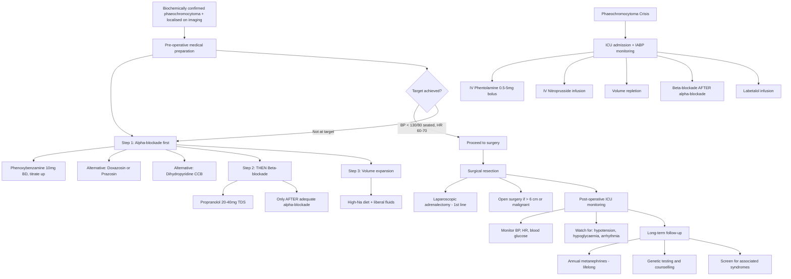

## Management of Phaeochromocytoma

### 11.1 Principles of Management — Thinking From First Principles

The management of phaeochromocytoma revolves around one central concept: **this tumour secretes catecholamines that can kill the patient at any moment**. Therefore, the entire management strategy is built around:

1. **Preventing catecholamine crisis** — before, during, and after any intervention
2. **Definitive surgical removal** — the only cure
3. **Lifelong surveillance** — because recurrence and metachronous tumours occur

The management sequence is always: **Medical preparation first → Surgery → Post-operative monitoring → Long-term follow-up**.

Let's understand *why* each step exists.

---

### 11.2 Overview Management Algorithm

---

### 11.3 Pre-Operative Medical Preparation

This is the **most critical phase** of management. The purpose is to **prevent intra-operative catecholamine crisis** — because during surgery, tumour manipulation causes massive catecholamine release into the circulation, which can cause fatal arrhythmia, hypertensive crisis, stroke, or APO.

#### A. ***Step 1: Alpha-Blockade*** — ALWAYS FIRST [2][3]

**Why α-blockade first?**

The dominant haemodynamic effect of catecholamine excess is **α₁-mediated vasoconstriction** → ↑SVR → severe hypertension. You must antagonise this before doing anything else.

| Drug | Mechanism | Dosing | Key Points |
|---|---|---|---|
| ***Phenoxybenzamine*** | ***Non-competitive (irreversible) α-blocker*** [3] | Start 10 mg BD, titrate up every 2–3 days to 20–40 mg BD (max ~1 mg/kg/day) | ***Preferred over competitive α-blockers*** (e.g. terazosin) [3] because irreversible binding means it cannot be displaced by the massive catecholamine surges during tumour manipulation; ***side effect: stuffy nose*** (nasal mucosal vasodilation), postural hypotension, reflex tachycardia [2] |
| **Doxazosin / Prazosin / Terazosin** | Competitive (reversible) selective α₁-blockers | Doxazosin: 2–8 mg daily | Alternative; shorter acting; can be displaced by catecholamine surges → less reliable peri-operatively, but fewer side effects (less reflex tachycardia, less nasal congestion) |
| ***Dihydropyridine CCBs*** (e.g. nifedipine, amlodipine) | Block L-type Ca²⁺ channels in vascular smooth muscle → vasodilation | As per standard dosing | ***Alternative to alpha-blockers*** [3]; useful as add-on therapy if BP not controlled with α-blocker alone; can be used as monotherapy if α-blockers not tolerated |

<Callout title="Why is Phenoxybenzamine Non-Competitive and Why Does That Matter?">
"Non-competitive" means phenoxybenzamine forms a **covalent bond** with the α-adrenergic receptor — it binds irreversibly and cannot be displaced, even by massive catecholamine surges. During tumour manipulation at surgery, the catecholamine levels can spike to hundreds of times normal. A competitive blocker (like doxazosin) can be overwhelmed by this flood of catecholamines because they compete for the same receptor binding site. Phenoxybenzamine cannot be overcome — this is why it's the traditional gold-standard for peri-operative α-blockade [3].
</Callout>

***Adequate α-blockade is indicated by a postural BP drop*** [3] — this tells you that the α₁ receptors are sufficiently blocked such that the normal vasoconstriction on standing is impaired.

**Target of pre-operative preparation** [2]:
- ***BP < 130/80 mmHg seated*** (some guidelines say < 140/90)
- ***HR 60–70 bpm seated***
- **Postural hypotension** present (but SBP standing > 80 mmHg)
- **No ST-segment changes** on ECG for > 1 week

#### B. ***Step 2: Beta-Blockade*** — ONLY AFTER Adequate Alpha-Blockade [2][3]

**Why β-blockade?**

Once α-blockade is established, the patient often develops **reflex tachycardia** (because α-blockade → vasodilation → baroreceptor-mediated ↑sympathetic drive → β₁ stimulation → ↑HR). Also, the catecholamine excess itself directly stimulates β₁ receptors. β-blockade controls this.

***ALWAYS initiate α-blockade before β-blockade*** [3]. ***β-blockade alone will cause unopposed α-adrenergic activity → exacerbate HTN*** [3].

| Drug | Mechanism | Dosing | Key Points |
|---|---|---|---|
| ***Propranolol*** | Non-selective β-blocker (β₁ + β₂) | ***20–40 mg TDS, start 2–3 days pre-operatively*** [2] | Classic choice; controls both HR and catecholamine-induced arrhythmias |
| **Atenolol / Metoprolol** | Selective β₁-blocker | Standard dosing | Alternative; less bronchospasm risk (relevant if asthma) |
| **Labetalol** | Combined α₁ + β-blocker (β:α ratio ~7:1) | See crisis section below | NOT ideal as sole pre-operative agent because the β:α ratio is heavily β-dominant → may not provide adequate α-blockade; some authorities avoid it for routine pre-op preparation |

<Callout title="Common Exam Mistake" type="error">
**Never give a β-blocker without prior α-blockade in phaeo.** If you block β₂-mediated vasodilation (in skeletal muscle beds) without blocking α₁-mediated vasoconstriction, you get **unopposed vasoconstriction → hypertensive crisis**. This is one of the most tested concepts in phaeo management. The mnemonic is: "***A before B***" — α before β.
</Callout>

#### C. ***Step 3: Volume Expansion*** [2][3]

**Why volume expansion?**

Chronic catecholamine excess causes:
1. **Pressure natriuresis** → chronic sodium and water loss → ↓plasma volume
2. **Chronic vasoconstriction** → reduced venous capacitance → masked hypovolaemia

Once you establish α-blockade and remove the vasoconstriction, the intravascular compartment "opens up" — if the patient is still volume-depleted, they will become profoundly **hypotensive** (especially post-operatively when the catecholamine source is removed).

***Preop: ↑Na ( > 5 g/day) diet and fluid intake to reverse catecholamine-induced intravascular volume contraction (to prevent post-op hypotension)*** [3]

- Start ***high-sodium diet on 2nd/3rd day of alpha-blockade*** [2] (not before, because sodium loading before α-blockade could worsen hypertension)
- Liberal oral fluid intake
- Some centres use IV normal saline in the 24–48 hours before surgery

#### D. ***Additional Pre-Operative Agent: Metyrosine*** [3]

- ***Metyrosine (α-methyltyrosine)*** — ***inhibits catecholamine synthesis*** [3]
  - Mechanism: inhibits **tyrosine hydroxylase** (the rate-limiting enzyme in catecholamine biosynthesis)
  - Reduces tumour catecholamine stores by 50–80%
  - Used as an **add-on** when α/β-blockade alone is insufficient for BP/HR control, or in complex cases
  - Side effects: sedation, extrapyramidal symptoms, crystalluria (maintain hydration)
  - Not routinely used; reserved for refractory cases

#### E. ***Duration of Pre-Operative Preparation***

***Required for at least 7–14 days before surgery*** [3]. Some sources recommend ***4 weeks of phenoxybenzamine*** [2] — the key is achieving haemodynamic targets, not a fixed duration.

---

### 11.4 Surgical Therapy — The Definitive Treatment

Surgery is the **only curative treatment** for phaeochromocytoma. The goal is complete tumour removal.

#### A. ***Indications for Adrenalectomy*** [2]

- ***Biochemically confirmed phaeochromocytoma*** (any size)
- ***Functional adrenal tumour*** regardless of size
- ***Adrenal incidentaloma meeting resection criteria***: functional, suspected malignancy ( > 4 cm, growing > 0.5 cm in 6 months), radiologically suspicious [2]

#### B. ***Surgical Approach*** [2][3]

| Approach | Indication | Details |
|---|---|---|
| ***Laparoscopic adrenalectomy*** | ***First-line*** [2]; for tumours < 6 cm | ***Laparoscopic, robotic with retroperitoneal or transabdominal approach*** [3]; lateral decubitus, ipsilateral side up; minimally invasive → faster recovery, less pain |
| ***Open adrenalectomy*** | ***If large tumour ( > 6 cm) or suspected malignancy*** [2] | Allows wider exposure for potential invasion into surrounding structures; en bloc resection possible |
| **Cortical-sparing (partial) adrenalectomy** | Bilateral phaeo (e.g. MEN2, VHL) | Aims to preserve some adrenal cortex to avoid lifelong glucocorticoid + mineralocorticoid replacement; higher recurrence risk (~10%) but avoids adrenal insufficiency |

#### C. ***Intra-Operative Considerations*** [2]

This is where your pre-operative preparation is tested. Even with optimal α/β-blockade, tumour manipulation releases catecholamines.

| Consideration | Rationale |
|---|---|
| ***Meticulous monitoring: A-line, CVP, Foley catheter*** | ***Risk of unstable haemodynamics*** [2]; need continuous beat-to-beat BP monitoring (arterial line), central venous pressure for volume status, and urinary output monitoring |
| ***Communicate with experienced anaesthetist*** | ***Inform about possible HTN crisis during intubation; inform before mobilisation/ligation of tumour; medications on standby*** [2] |
| **Medications on standby** [2] | ***Nitroprusside*** (for acute HTN), ***phentolamine*** (α-blocker for acute HTN), ***adrenaline/noradrenaline*** (for hypotension after tumour removal), ***esmolol*** (ultra-short-acting β-blocker for tachyarrhythmia) |
| ***Gentle manipulation of lesion*** [2] | Minimise catecholamine discharge from the tumour |
| ***Dissect and control adrenal vein first*** [2] | Ligating the venous drainage before further tumour manipulation prevents catecholamine washout into the systemic circulation — this is a key surgical principle |

**Potential intra-operative complications** [2]:
- **Hypertensive crisis**: during intubation, tumour manipulation → treat with IV phentolamine or nitroprusside
- **Hypotension**: after tumour ligation/removal (sudden loss of catecholamine drive + residual α-blockade + volume depletion) → treat with IV fluids + vasopressors (noradrenaline/adrenaline)
- **Arrhythmias**: catecholamine-induced → esmolol, lidocaine
- ***Injury to surrounding structures*** [2]:
  - ***Right adrenalectomy: IVC, right lobe of liver***
  - ***Left adrenalectomy: pancreatic tail, spleen***

---

### 11.5 Post-Operative Management [2][3]

***Post-operative ICU monitoring for specific complications*** [2]:

| Complication | Mechanism | Management |
|---|---|---|
| ***Cardiac arrhythmia*** | Residual catecholamine effects; electrolyte shifts | Continuous cardiac monitoring; antiarrhythmics as needed |
| ***Hypotension*** | ***Drug effect*** [2] — residual α-blockade (phenoxybenzamine has a half-life of ~24 hours) + sudden removal of catecholamine-driven vasoconstriction + pre-existing intravascular volume depletion | Aggressive IV fluid resuscitation; vasopressors (noradrenaline) if needed; this is why pre-op volume expansion is so important |
| ***Hypoglycaemia*** | ***Rebound hyperinsulinaemia*** [2] — during catecholamine excess, α₂ stimulation suppresses insulin secretion from pancreatic β-cells; once the tumour is removed, the α₂ suppression is released → insulin secretion rebounds → hypoglycaemia; simultaneously, β₂-driven glycogenolysis ceases | ***Monitor blood glucose (H'stix) closely post-operatively*** [3]; IV dextrose infusion if needed |
| ***Adrenal insufficiency*** | If **bilateral adrenalectomy** performed (e.g. in MEN2 with bilateral phaeo) → loss of cortisol and aldosterone production | ***IV hydrocortisone upon removal of adrenal gland*** [2]; lifelong glucocorticoid ± mineralocorticoid replacement |

<Callout title="Post-Op Monitoring Triad: BP + HR + Blood Sugar" type="idea">
After phaeo surgery, the three things that can go wrong immediately are: (1) **Hypotension** (loss of catecholamine drive), (2) **Arrhythmia** (residual catecholamine effect), (3) **Hypoglycaemia** (rebound insulin secretion). That's why post-op monitoring focuses on ***BP, HR, and H'stix*** [3]. Always monitor in ICU for at least 24–48 hours.
</Callout>

---

### 11.6 Management of Phaeochromocytoma Crisis [3][4]

***Phaeochromocytoma crisis is classified as a hypertensive emergency*** (when accompanied by target organ damage) or ***hypertensive urgency*** [3][4].

***Compelling indications for acute BP control include: aortic dissection, phaeochromocytoma crisis, eclampsia or severe pre-eclampsia*** [4].

#### Treatment Protocol [3][4]:

| Step | Action | Rationale |
|---|---|---|
| 1 | ***ICU admission with IABP monitoring*** [3] | Need continuous beat-to-beat BP monitoring for rapid titration of antihypertensives |
| 2 | ***IV Phentolamine: 0.5–5 mg IV bolus, then 2–20 μg/kg/h infusion*** [3] | Phentolamine is a **competitive α-blocker** with rapid onset (1–2 min IV); directly antagonises catecholamine-mediated vasoconstriction; short duration of action allows rapid titration |
| 3 | ***IV Nitroprusside: 0.3–8 μg/kg/min infusion*** [3] | Direct vasodilator (releases NO → vascular smooth muscle relaxation); ***especially good for acute LV failure*** [4]; **rapid onset of action** |
| 4 | ***Volume repletion to prevent hypotension after antihypertensives*** [3] | Once vasoconstriction is reversed, the underlying hypovolaemia is unmasked → risk of severe hypotension |
| 5 | ***β-blockade AFTER α-blockade*** [3]: ***Propranolol for tachycardia; Labetalol infusion at 1–2 mg/min (max 200 mg)*** | Controls reflex/catecholamine-driven tachycardia; labetalol provides combined α + β block (but ONLY after adequate α-blockade established) |

**BP targets in hypertensive emergency** [4]:
- ***Aim ≤ 25% ↓BP in the first hour***
- ***Then to 160/110 in the next 2–6 hours***
- ***Then cautiously to normal during the next 24–48 hours***
- In ***compelling indications*** (aortic dissection, phaeo crisis): ***aim SBP < 140 in the first hour***

**Additional agents for crisis** [4]:

| Drug | Route | Indication |
|---|---|---|
| ***Phentolamine: 5–10 mg IV bolus, repeat 10–20 min PRN*** [4] | IV bolus | ***For catecholamine crisis*** — rapid, short-acting α-blockade |
| Nicardipine | IV infusion 5–15 mg/h | Alternative vasodilator; does not cause reflex tachycardia as much as nitroprusside |
| Magnesium sulphate | IV | Adjunct; ↓catecholamine release from medulla + direct vasodilation + antiarrhythmic |

<Callout title="Nitroprusside Safety" type="error">
***Nitroprusside*** is metabolised to **cyanide** → ***do NOT give for > 48 hours*** (risk of thiocyanide/cyanide intoxication) [4]. ***Protect from light by wrapping the infusion bag/syringe***; discard after every 12 hours [4]. It is also ***contraindicated in pregnancy*** [4].
</Callout>

#### Glucagon Test Caution [9]

Worth noting: the **glucagon stimulation test** (used for assessment of GH/ACTH reserve) is **contraindicated in suspected phaeochromocytoma** because glucagon can trigger a ***hypertensive crisis*** [9]. The mechanism: glucagon stimulates catecholamine release from the adrenal medulla.

---

### 11.7 Management of Malignant (Metastatic) Phaeochromocytoma [2]

***Histologically and biochemically indistinguishable from benign disease, defined by metastasis*** [2].

| Modality | Detail |
|---|---|
| ***Surgical excision (tumour debulking)*** | ***To control catecholamine excess*** [2]; cytoreductive surgery even if not curative — reduces catecholamine burden → ↓symptoms and crisis risk |
| **¹³¹I-MIBG therapy** | Therapeutic doses of MIBG (typically ¹³¹I-labelled) delivered to chromaffin tissue; response rate ~30–40%; requires thyroid blockade |
| **Chemotherapy** | CVD regimen (cyclophosphamide + vincristine + dacarbazine); partial response in ~40%; reserved for progressive metastatic disease |
| **Tyrosine kinase inhibitors** | Sunitinib; some evidence of benefit in progressive metastatic PPGL |
| **Peptide receptor radionuclide therapy (PRRT)** | ¹⁷⁷Lu-DOTATATE for SSTR-positive metastatic PPGL; emerging evidence of efficacy |
| **Palliative α/β-blockade** | Lifelong medical management of catecholamine excess when surgical cure is not possible |
| ***Metyrosine*** | ***Inhibits catecholamine synthesis*** [3]; adjunct for symptom control in metastatic disease |

***Prognosis: 5-year survival 95% for benign, 40% for malignant*** [3].

---

### 11.8 Long-Term Follow-Up [2]

***Lifelong yearly screening for recurrent, metastatic, or metachronous tumour*** [2]:

| Modality | Detail |
|---|---|
| **Urine/plasma metanephrines** | Annual measurement — confirms biochemical cure and screens for recurrence |
| ***Chromogranin A*** | ***Not useful for primary diagnosis*** but useful for monitoring metastatic disease burden [2] |
| **Imaging** | CT/MRI as clinically indicated; periodic surveillance in genetic syndrome carriers |
| ***Genetic testing and counselling*** | ***If not done at diagnosis, should be performed; screen first-degree relatives*** [2] |

**Monitoring schedule** (Endocrine Society guidelines):
- Plasma or urine metanephrines at **2–6 weeks post-op** to confirm biochemical cure
- Then **annually for at least 10 years** (lifelong if hereditary or malignant)
- Some guidelines recommend **lifelong surveillance for all patients** given the 10% recurrence rate

---

### 11.9 Special Scenarios

#### ***Phaeochromocytoma in Pregnancy***
- Diagnosed phaeo in pregnancy is a **medical emergency** — untreated maternal mortality up to 40%
- **α-blockade with phenoxybenzamine** is the cornerstone (crosses placenta but generally safe)
- **β-blockade with propranolol** or labetalol added as needed
- **Surgical timing**: ideally in 2nd trimester (laparoscopic if feasible); if late pregnancy, manage medically and deliver by elective caesarean section with phaeo resection at same or later operation
- **Avoid**: vaginal delivery (Valsalva manoeuvre can trigger crisis), ergometrine (sympathomimetic)

#### ***Bilateral Phaeochromocytoma (MEN2, VHL)***
- **Cortical-sparing adrenalectomy** preferred to preserve adrenal cortical function
- If bilateral total adrenalectomy required → **lifelong glucocorticoid + mineralocorticoid replacement**
- ***Risk of Nelson's syndrome*** does not apply here (Nelson's is specific to bilateral adrenalectomy for Cushing's disease where the pituitary is the primary driver)
- ***Annual screening by plasma/urine metanephrines from 11 years or 16 years of age depending on risk of specific mutation*** [3]

#### ***Pre-Operative Preparation for CT with Contrast*** [3]

- ***IV iodinated contrast injection may induce a pressor crisis*** [3]
- ***Consider preparation with complete adrenoceptor blockade, e.g. phenoxybenzamine*** [3]
- However, ***modern low-osmolar non-ionic contrast is safe even without alpha/beta blockade*** [2]

---

### 11.10 Summary of Management — Treatment Modality Table

| Phase | Treatment | Indication | Contraindication/Caution |
|---|---|---|---|
| **Pre-op Step 1** | ***α-blockade (phenoxybenzamine)*** | All phaeo patients pre-surgery | Caution: postural hypotension, reflex tachycardia, nasal congestion |
| **Pre-op Step 2** | ***β-blockade (propranolol)*** | After adequate α-blockade for residual tachycardia | ***NEVER before α-blockade*** → unopposed α → hypertensive crisis |
| **Pre-op Step 3** | ***Volume expansion (high-Na diet + fluids)*** | All patients — reverse catecholamine-induced volume depletion | Start on 2nd–3rd day of α-blockade |
| **Pre-op (adjunct)** | ***Metyrosine*** | Refractory BP/HR despite α/β-blockade | Sedation, EPS, crystalluria |
| **Pre-op (adjunct)** | ***Dihydropyridine CCB*** | Alternative/add-on to α-blocker | Standard CCB cautions |
| **Surgery** | ***Laparoscopic adrenalectomy*** | First-line for < 6 cm tumours | Not for > 6 cm or suspected malignancy |
| **Surgery** | ***Open adrenalectomy*** | > 6 cm, suspected malignancy, local invasion | Greater morbidity |
| **Surgery** | **Cortical-sparing adrenalectomy** | Bilateral phaeo (MEN2/VHL) | Higher recurrence risk (~10%) |
| **Crisis** | ***IV phentolamine + nitroprusside*** | Hypertensive emergency from phaeo crisis | Nitroprusside: avoid > 48h, avoid in pregnancy |
| **Crisis** | ***Volume repletion*** | Prevent hypotension after vasoconstriction reversed | — |
| **Metastatic** | Debulking surgery, ¹³¹I-MIBG therapy, CVD chemo, PRRT, TKIs | Progressive metastatic PPGL | Palliative intent in most cases |
| **Post-op** | ***ICU monitoring: BP, HR, H'stix*** | All patients post-adrenalectomy for phaeo | Watch for hypotension, hypoglycaemia, arrhythmia |
| **Long-term** | ***Annual metanephrines, genetic testing*** | All patients — lifelong | — |

---

<Callout title="High Yield Summary">

**Management of phaeochromocytoma follows a strict sequence: Medical preparation → Surgery → Post-op monitoring → Lifelong follow-up.**

**Pre-operative preparation (7–14 days minimum, up to 4 weeks):**
- ***Step 1: α-blockade FIRST*** — phenoxybenzamine (non-competitive, irreversible); adequate blockade = postural BP drop [3]
- ***Step 2: β-blockade SECOND*** — propranolol; NEVER before α-blockade (unopposed α → crisis) [3]
- ***Step 3: Volume expansion*** — high-Na diet ( > 5 g/day) + fluids from day 2–3 of α-blockade [3]
- Target: ***BP < 130/80 seated, HR 60–70*** [2]
- Alternative agents: ***dihydropyridine CCB, metyrosine*** [3]

**Surgery:**
- ***Laparoscopic adrenalectomy*** — first-line for < 6 cm [2]
- ***Open if > 6 cm or malignant*** [2]
- ***Intra-op: A-line, CVP, Foley; dissect adrenal vein first; have phentolamine/nitroprusside/adrenaline on standby*** [2]

**Post-op:**
- ***ICU monitoring for: hypotension (loss of catecholamine drive), hypoglycaemia (rebound hyperinsulinaemia), arrhythmia*** [2][3]

**Crisis:**
- ***ICU + IABP monitoring; IV phentolamine + nitroprusside; volume repletion; β-blockade only after α-blockade*** [3]

**Long-term:**
- ***Lifelong annual metanephrines; chromogranin A for metastatic disease; genetic testing and counselling*** [2]

**Prognosis: *5-year survival 95% benign, 40% malignant*** [3]

</Callout>

---

<ActiveRecallQuiz
  title="Active Recall - Phaeochromocytoma Management"
  items={[
    {
      question: "Describe the three steps of pre-operative medical preparation for phaeochromocytoma surgery and explain the rationale for each.",
      markscheme: "Step 1: Alpha-blockade first (phenoxybenzamine) - blocks alpha-1 mediated vasoconstriction which is the dominant haemodynamic effect of catecholamine excess. Step 2: Beta-blockade second (propranolol) - controls reflex tachycardia and catecholamine-driven beta-1 stimulation; must NEVER be given before alpha-blockade as this causes unopposed alpha vasoconstriction and hypertensive crisis. Step 3: Volume expansion (high-Na diet greater than 5g/day and fluids, starting day 2-3 of alpha-blockade) - reverses catecholamine-induced intravascular volume depletion from pressure natriuresis and chronic vasoconstriction, preventing post-operative hypotension. Duration: at least 7-14 days. Target: BP less than 130/80 seated, HR 60-70.",
    },
    {
      question: "Why is phenoxybenzamine preferred over competitive alpha-blockers like doxazosin for pre-operative preparation in phaeochromocytoma?",
      markscheme: "Phenoxybenzamine is a non-competitive (irreversible) alpha-blocker that forms a covalent bond with the alpha-adrenergic receptor. During surgery, tumour manipulation causes massive catecholamine surges (hundreds of times normal). A competitive blocker like doxazosin can be displaced from the receptor by this flood of catecholamines, leading to breakthrough hypertension. Phenoxybenzamine cannot be overcome because its binding is irreversible, providing more reliable blockade during the critical intra-operative period.",
    },
    {
      question: "Name three specific post-operative complications after adrenalectomy for phaeochromocytoma and explain the mechanism of each.",
      markscheme: "(1) Hypotension: sudden loss of catecholamine drive after tumour removal plus residual alpha-blockade effect plus pre-existing intravascular volume depletion. (2) Hypoglycaemia: during catecholamine excess, alpha-2 stimulation suppresses insulin secretion; tumour removal releases this suppression causing rebound hyperinsulinaemia; simultaneously beta-2 driven glycogenolysis ceases. (3) Cardiac arrhythmia: residual catecholamine effects and electrolyte shifts. Management: ICU monitoring of BP, HR, and blood glucose (H'stix); IV fluids plus vasopressors for hypotension; IV dextrose for hypoglycaemia.",
    },
    {
      question: "How would you manage a phaeochromocytoma crisis in the emergency setting?",
      markscheme: "ICU admission with intra-arterial BP monitoring. IV phentolamine 0.5-5mg bolus then 2-20 mcg/kg/h infusion (rapid-onset alpha-blocker). IV nitroprusside 0.3-8 mcg/kg/min (direct vasodilator, especially for acute LV failure; avoid greater than 48h due to cyanide toxicity; protect from light). Volume repletion to prevent refractory hypotension once vasoconstriction reversed. Beta-blockade ONLY after alpha-blockade established - propranolol for tachycardia or labetalol infusion 1-2 mg/min (max 200mg). BP target: 25% reduction in first hour, then 160/110 over next 2-6 hours, then cautiously to normal over 24-48 hours.",
    },
    {
      question: "What key intra-operative principles should be communicated to the surgical and anaesthetic team during phaeochromocytoma resection?",
      markscheme: "Meticulous monitoring with arterial line, CVP, and Foley catheter for unstable haemodynamics. Experienced anaesthetist essential. Communicate before intubation (risk of HTN crisis), before tumour mobilisation or ligation. Medications on standby: nitroprusside and phentolamine for HTN, adrenaline/noradrenaline for hypotension, esmolol for tachyarrhythmia. Gentle manipulation of lesion to minimise catecholamine discharge. Dissect and control adrenal vein first to prevent catecholamine washout into systemic circulation during further manipulation.",
    },
    {
      question: "A patient with MEN2A has bilateral phaeochromocytomas. What surgical approach is preferred and what are the long-term implications?",
      markscheme: "Cortical-sparing (partial) adrenalectomy is preferred to preserve adrenal cortical function and avoid lifelong glucocorticoid plus mineralocorticoid replacement. Recurrence risk is approximately 10% but this is considered acceptable to avoid adrenal insufficiency. If bilateral total adrenalectomy is required, the patient needs lifelong hydrocortisone plus fludrocortisone replacement. Lifelong annual metanephrine screening is essential (screening from age 11-16 depending on mutation risk). Must also screen for MTC (calcitonin) and hyperparathyroidism (calcium, PTH). Genetic counselling for family members.",
    },
  ]}
/>

---

## References

[2] Senior notes: maxim.md (Phaeochromocytoma — Management: alpha/beta blockade sequence, pre-op targets, intra-op considerations, post-op complications, adrenalectomy approach and indications, malignant phaeo, follow-up)
[3] Senior notes: Ryan Ho Endocrine.pdf (Section 3.4 — Management: phenoxybenzamine as non-competitive alpha-blocker, alpha before beta rationale, CCB/metyrosine alternatives, 7–14 days pre-op, surgical route, post-op complications, prognosis, crisis management with phentolamine/nitroprusside/labetalol, volume repletion, MEN2 screening protocol)
[4] Senior notes: Ryan Ho Cardiology.pdf (p182–183 — Hypertensive emergency/urgency: BP targets, phentolamine for catecholamine crisis, nitroprusside precautions, labetalol dosing, compelling indications for acute BP control)
[9] Senior notes: Ryan Ho Chemical Path.pdf (p34 — Glucagon test contraindication in phaeochromocytoma: risk of hypertensive crisis)
