## Differential Diagnosis of Pituitary Adenoma

When a patient presents with a sellar/parasellar mass, the reflexive assumption is "pituitary adenoma" — and statistically you'd be right most of the time in an adult. But **assuming = missing**, and the sellar region is a crossroads of many pathologies. The differential diagnosis must be systematically considered across **three clinical axes**:

1. **What else can cause a sellar mass?** (Structural DDx)
2. **What else can cause the hormonal syndrome?** (Functional DDx — i.e., DDx of hyperprolactinaemia, acromegaly, Cushing's syndrome, etc.)
3. **What else can cause the presenting symptom?** (Symptom-based DDx — bitemporal hemianopia, headache, CN palsy, etc.)

Let's work through each systematically from first principles.

---

### 1. Structural Differential Diagnosis: "What Else Can Sit in or Around the Sella?"

This is the most critical DDx because the management is completely different for each entity. You cannot just biopsy a sellar mass — it could be an aneurysm, and sticking a needle in it would be lethal.

#### 1.1 Comprehensive DDx of Sellar/Parasellar Masses

```mermaid
graph TD
    A["Sellar / Parasellar Mass"] --> B["Neoplastic"]
    A --> C["Non-neoplastic"]
    
    B --> D["Benign Tumours"]
    B --> E["Malignant / Aggressive"]
    
    D --> D1["Pituitary adenoma"]
    D --> D2["Craniopharyngioma"]
    D --> D3["Meningioma"]
    D --> D4["Pituicytoma"]
    D --> D5["Schwannoma"]
    
    E --> E1["Pituitary carcinoma"]
    E --> E2["Germ cell tumours"]
    E --> E3["Chordoma"]
    E --> E4["CNS lymphoma"]
    E --> E5["Metastases"]
    
    C --> F["Cystic Lesions"]
    C --> G["Inflammatory / Infectious"]
    C --> H["Vascular"]
    C --> I["Hyperplasia"]
    
    F --> F1["Rathke's cleft cyst"]
    F --> F2["Arachnoid cyst"]
    F --> F3["Dermoid / Epidermoid cyst"]
    
    G --> G1["Lymphocytic hypophysitis"]
    G --> G2["Pituitary abscess"]
    G --> G3["Granulomatous disease"]
    
    H --> H1["ICA aneurysm"]
    H --> H2["Carotid-cavernous fistula"]
    
    I --> I1["Lactotroph hyperplasia"]
    I --> I2["Thyrotroph hyperplasia"]
    I --> I3["Gonadotroph hyperplasia"]
```

[5][2][3]

#### 1.2 Key Differentiating Features — Sellar Mass by Mass

| Differential | Key Distinguishing Features | Why It Matters |
|:---|:---|:---|
| **Pituitary adenoma** | Most common sellar mass in adults; enhances less than normal pituitary on gadolinium MRI; can be micro or macro; hormonal hypersecretion or hyposecretion | Commonest diagnosis — but don't stop here |
| ***Craniopharyngioma*** | ***50% calcified*** (seen on CT/XR); often **cystic** with a "motor oil" appearance of cyst fluid; arises from Rathke's pouch remnants; ***most common sellar mass in children***; bimodal age peak (childhood + 50–60y); commonly causes **cranial DI** (stalk involvement) and **growth retardation** (GH deficiency) [3] | Unlike adenoma: frequently calcified, cystic, suprasellar, and causes DI. ***CT is better for detecting calcification*** [2][3] |
| **Meningioma** | Arises from meninges (dura); classically shows ***homogeneous enhancement with a "dural tail" on MRI***; often calcified; displaces the pituitary rather than arising from it; suprasellar/parasellar location | May mimic non-functioning macroadenoma clinically; CT better for calcification [2] |
| **Rathke's cleft cyst** | Benign cystic remnant of Rathke's pouch; sits between anterior and posterior lobes; **non-enhancing** on MRI; variable signal depending on cyst contents (mucoid = T1 bright, serous = T1 dark) | Usually incidental; can compress stalk → mild hyperprolactinaemia + DI |
| **Pituicytoma** | Rare, solid, enhancing tumour of pituicytes (glial cells of the posterior pituitary/stalk); suprasellar | Very vascular — important to know pre-operatively |
| ***Metastases*** | Most commonly from ***CA lung (males)*** and ***CA breast (females)***; preferentially involves **posterior pituitary** (richer blood supply via inferior hypophyseal arteries); may present with **diabetes insipidus** (unlike adenoma, which rarely causes DI) [5] | DI as the first pituitary symptom in an older patient with weight loss → think metastasis, not adenoma |
| **Germ cell tumours** (germinoma, teratoma) | Young patients; suprasellar; may secrete β-hCG or AFP (tumour markers); often associated with DI and visual loss | Check serum and CSF β-hCG and AFP in young patients with suprasellar mass |
| **Chordoma** | Arises from notochord remnants at the clivus; destructive, bone-eroding mass on CT; midline; often extends to involve the sella | Clival destruction on CT is the giveaway |
| **CNS lymphoma** | Homogeneous enhancement; may be periventricular; consider in immunosuppressed patients (HIV, post-transplant) | Biopsy-proven; treat with chemo ± RT, not surgery |
| ***Pituitary carcinoma*** | Extremely rare; defined by the presence of **craniospinal or systemic metastases** (not by histological features alone) | Cannot be diagnosed on histology of the primary tumour — need to demonstrate metastasis |
| **Lymphocytic hypophysitis** | Autoimmune inflammation of the pituitary; classically in peripartum women; diffuse enlargement of gland and stalk (not a focal mass); often presents with DI + hypopituitarism ± headache | May mimic adenoma on MRI; history of recent pregnancy is the clue; responds to steroids |
| **Pituitary abscess** | Rare; may follow surgery or haematogenous seeding; **ring enhancement** on MRI with restricted diffusion centrally; fever, meningism | Neurosurgical emergency |
| ***ICA aneurysm*** | ***A cerebral aneurysm can mimic a sellar tumour*** [4]; signal void on MRI (flowing blood); pulsatile mass; may present with CN III palsy from posterior communicating artery aneurysm or with SAH | ***MUST exclude before transsphenoidal surgery*** — operating on an aneurysm = catastrophic haemorrhage [4] |
| **Carotid-cavernous fistula** | Pulsatile proptosis, chemosis (conjunctival oedema), orbital bruit, arterialized conjunctival vessels | Vascular, not neoplastic |
| **Pituitary hyperplasia** | Diffuse symmetric enlargement (no focal lesion); occurs in specific physiological/pathological contexts: pregnancy (lactotroph), longstanding primary hypothyroidism (thyrotroph), longstanding primary hypogonadism (gonadotroph), ectopic GHRH (somatotroph) [5] | Treat the underlying cause → gland shrinks back; no surgery needed |

[2][3][4][5]

<Callout title="The Three Masses That Must Not Be Biopsied/Operated Without Specific Workup" type="error">

1. ***ICA aneurysm*** — must be excluded by CTA/MRA before any surgery on a "sellar mass" [4][8]
2. **Germ cell tumour** — check β-hCG and AFP first; may be treated with chemo + RT without surgery
3. **CNS lymphoma** — steroids before biopsy can cause temporary regression and render biopsy non-diagnostic; discuss with team before giving dexamethasone

</Callout>

#### 1.3 How to Tell a Sellar Mass Apart on MRI — Practical Imaging DDx

| Feature on MRI | Think of... | Why |
|:---|:---|:---|
| ***Focal lesion within the sella, enhances less than surrounding normal pituitary*** [5] | Pituitary adenoma | Adenoma tissue has a different vascular pattern and takes up gadolinium more slowly than normal pituitary [5] |
| ***Calcification*** (better on CT) | ***Craniopharyngioma > Meningioma*** | Craniopharyngiomas are 50% calcified; meningiomas frequently calcify [2] |
| **Cystic/mixed solid-cystic suprasellar mass** | Craniopharyngioma, Rathke's cleft cyst | Craniopharyngiomas are often cystic; Rathke's cleft cysts are purely cystic |
| **Homogeneous enhancement + dural tail** | Meningioma | Classic meningioma sign |
| **Ring enhancement** with restricted diffusion | Pituitary abscess | Abscess cavity |
| **Diffuse gland + stalk enlargement** (no focal mass) | Lymphocytic hypophysitis, pituitary hyperplasia | Diffuse process, not focal |
| **Posterior pituitary bright spot absent** | DI (central); stalk lesion; metastasis | ADH granules lost |
| **T1 bright signal** in the sella | Haemorrhage (apoplexy), lipid-rich cyst (Rathke's), proteinaceous content | Methaemoglobin (blood) or fat/mucoid material |
| ***Signal void ("flow void") in the sella*** | ***ICA aneurysm*** | Flowing blood produces no signal on standard MRI | 
| **Separate from normal pituitary gland** on MRI | ***NOT a pituitary adenoma*** — consider other sellar pathology [5] | A true adenoma arises within the gland; a lesion clearly separate from the gland is something else (craniopharyngioma, meningioma, etc.) |

[2][3][4][5]

---

### 2. Functional Differential Diagnosis: "What Else Can Cause This Hormonal Syndrome?"

When a pituitary adenoma is functioning, it produces a clinical syndrome. But other conditions can mimic those syndromes. This is crucial because treatment differs dramatically.

#### 2.1 DDx of Hyperprolactinaemia

This is the most important functional DDx because **mild hyperprolactinaemia has a vast differential**, and mistaking a non-functioning macroadenoma with stalk effect for a prolactinoma (and treating with dopamine agonist alone) would be a critical error.

| Category | Causes | Mechanism | PRL Level |
|:---|:---|:---|:---|
| **Physiological** | Pregnancy, breastfeeding, nipple stimulation, stress, sleep, coitus | Normal regulatory increase in PRL | Mild–moderate |
| **Pharmacological** | ***Antipsychotics*** (D2 blockers — haloperidol, risperidone), metoclopramide, domperidone, methyldopa, oestrogens, SSRIs | Block dopamine D2 receptors on lactotrophs → remove inhibition → ↑PRL | Usually < 100 ng/mL |
| **Stalk effect ("disconnection")** | Any sellar/suprasellar mass (non-functioning adenoma, craniopharyngioma, meningioma), stalk transection, post-surgery, granulomatous disease | Interrupts dopamine delivery from hypothalamus to lactotrophs | ***Usually < 100–200 ng/mL*** |
| **True prolactinoma** | Lactotroph adenoma | Autonomous PRL secretion by tumour cells | ***Usually > 200 ng/mL (often > 10× ULN)*** [2][3] |
| **Hypothyroidism** | Primary hypothyroidism | ↑TRH (which also stimulates lactotrophs) | Mild |
| **Chronic kidney disease** | Renal failure | ↓PRL clearance by kidney | Mild–moderate |
| **Chest wall irritation** | Thoracotomy, herpes zoster, chest wall trauma | Afferent neural stimulation mimics suckling reflex → hypothalamic PRL release | Mild |

<Callout title="The Critical Distinction: Stalk Effect vs. Prolactinoma">
A 3 cm sellar mass with PRL of 80 ng/mL is almost certainly a **non-functioning macroadenoma causing stalk effect** — NOT a prolactinoma. A true prolactinoma of that size would produce PRL > 1,000–10,000 ng/mL. This distinction changes management entirely: the non-functioning adenoma needs **surgery**, while a prolactinoma needs **dopamine agonist**. The **"degree of PRL elevation should be proportional to tumour size"** — if it's not, suspect stalk effect or hook effect [2][5].
</Callout>

#### 2.2 DDx of Acromegaly / GH Excess

| Cause | Proportion | Mechanism |
|:---|:---|:---|
| ***GH-secreting pituitary adenoma*** | ***Vast majority (> 95%)*** [2][3] | Autonomous GH secretion |
| **GHRH-secreting hypothalamic tumours** | Rare | Ectopic GHRH → pituitary somatotroph hyperplasia → GH excess |
| **Ectopic GHRH secretion** | < 1% | Neuroendocrine tumours (carcinoid, pancreatic NET, SCLC) secrete GHRH → somatotroph hyperplasia |
| **Ectopic GH secretion** | Exceedingly rare | Lymphoma or pancreatic islet cell tumour secreting GH directly |
| **McCune-Albright syndrome** | Very rare | Activating GNAS1 mutation → constitutive GH secretion |

> The key differentiator: if the pituitary is diffusely enlarged (hyperplasia) rather than showing a focal adenoma, suspect **ectopic GHRH** secretion. Measure serum GHRH levels [2].

#### 2.3 DDx of Cushing's Syndrome (ACTH-Dependent vs. Independent)

This is a well-structured DDx covered in detail in Cushing's syndrome notes, but here is the pituitary-relevant summary:

| Category | Cause | % of Endogenous CS | Key Distinguishing Feature |
|:---|:---|:---|:---|
| **ACTH-dependent** | ***Cushing's disease (pituitary corticotroph adenoma)*** | ***65–70%*** | Elevated ACTH; pituitary MRI may show microadenoma (often small, < 5 mm); high-dose dexamethasone suppression test → usually suppressible [2][9] |
| **ACTH-dependent** | ***Ectopic ACTH syndrome*** | ***10–15%*** | SCLC, bronchial carcinoid, thymic carcinoid, pancreatic NET; often severe/rapid onset with very high ACTH; non-suppressible on HDDST; ***consider in older men > 50y*** [2] |
| **Non-ACTH-dependent** | Adrenal adenoma / carcinoma | 15–20% | Suppressed ACTH; adrenal mass on imaging |
| **Iatrogenic** | Exogenous glucocorticoids (***most common overall***) | N/A | ***Must r/o any herbal medicine, "OTC drugs for arthritis"*** (especially relevant in Hong Kong) [2] |

[2][9]

<Callout title="Pseudo-Cushing's" type="idea">
Several conditions can cause mild cortisol elevation that mimics Cushing's syndrome biochemically: **depression, alcoholism, obesity, pregnancy, severe illness**. These are termed "pseudo-Cushing's" states. The **insulin tolerance test (ITT)** can help differentiate: in true Cushing's, cortisol response to hypoglycaemia is **blunted**; in pseudo-Cushing's, cortisol responds normally [9].
</Callout>

#### 2.4 DDx of Secondary (Central) Hyperthyroidism

When you find elevated fT4 with **non-suppressed TSH** (i.e., TSH is normal or elevated when it should be suppressed):

| Diagnosis | Mechanism | How to Distinguish |
|:---|:---|:---|
| **TSH-secreting pituitary adenoma** | Autonomous TSH production → thyroid stimulation | MRI pituitary shows adenoma; elevated α-subunit; usually macroadenoma |
| **Thyroid hormone resistance** | Mutation in thyroid hormone receptor → tissues (including pituitary) are resistant to T3/T4 → pituitary continues TSH secretion despite high T4 | No pituitary mass; often familial (autosomal dominant); elevated T4 with normal/elevated TSH but **patient is clinically euthyroid** (tissues are resistant) |
| **Assay artefact** | Heterophilic antibodies (e.g., anti-mouse antibodies from biotin supplements or HAMA) interfere with TSH immunoassay | Run the sample with heterophilic antibody blocking agent; check with different assay platform |

> The critical distinction here is between a TSH-secreting adenoma and thyroid hormone resistance — both show ↑fT4 with non-suppressed TSH. **α-subunit : TSH molar ratio** > 1 favours TSHoma; a TRH stimulation test (blunted TSH response in TSHoma, normal in resistance) can help.

#### 2.5 DDx of Non-Functioning Sellar Mass with Hypopituitarism

If a patient has a large sellar mass with hypopituitarism but **no hormonal hypersecretion**, the DDx includes:

| Diagnosis | Key Differentiators |
|:---|:---|
| Non-functioning pituitary adenoma (most common) | Middle-aged adult, gradual visual loss + headache + gonadal dysfunction |
| Craniopharyngioma | Calcified, cystic; children or bimodal age; DI common |
| Meningioma | Dural tail, homogeneous enhancement, calcified |
| Metastasis | Known cancer; posterior pituitary involvement; DI |
| Lymphocytic hypophysitis | Peripartum female; diffuse enlargement; DI |
| Rathke's cleft cyst | Purely cystic; non-enhancing |
| ***"Non-functioning" gonadotroph adenoma*** | ***70–90% of non-functioning adenomas are gonadotroph in origin*** — can be confirmed by immunohistochemistry (SF-1 staining) or by detecting elevated FSH/α-subunit [5] |

---

### 3. Symptom-Based Differential Diagnosis

#### 3.1 DDx of Bitemporal Hemianopia

***Bitemporal hemianopia*** points to the optic chiasm, but not all chiasmal lesions are pituitary adenomas:

| Cause | Notes |
|:---|:---|
| ***Pituitary macroadenoma*** (most common) | Compresses chiasm from below |
| ***Craniopharyngioma*** | Suprasellar mass compresses chiasm from above or below |
| Suprasellar meningioma | Compresses chiasm from above |
| Glioma of the optic chiasm | Intrinsic chiasmal tumour (more common in children, often NF1-associated) |
| ***ICA aneurysm*** | Aneurysm at ICA-ophthalmic artery junction can compress chiasm |
| Arachnoiditis | Post-inflammatory adhesions around chiasm (rare) |
| Empty sella syndrome | Herniation of arachnoid into sella → chiasmal traction |

[3][4][8]

#### 3.2 DDx of Cranial Nerve III Palsy in the Sellar/Parasellar Region

When a patient presents with diplopia from CN III involvement near the sella:

| Cause | Distinguishing Features |
|:---|:---|
| **Pituitary apoplexy** | Sudden headache + diplopia + hypopituitarism [2][3] |
| ***Posterior communicating artery aneurysm*** | Isolated painful CN III palsy with **pupil involvement** — neurosurgical emergency [8] |
| **Cavernous sinus thrombosis** | Proptosis, chemosis, fever; multiple CN palsies (III, IV, V1, V2, VI) |
| **Cavernous sinus tumour** (meningioma, nasopharyngeal carcinoma, pituitary adenoma invading laterally) | Gradual onset; associated CN IV, VI, V1, V2 involvement [8] |
| **Microvascular ("medical") CN III palsy** | DM, HTN; pupil-sparing; self-limiting in 6–12 weeks [8] |
| **Uncal herniation** | Altered consciousness; fixed dilated pupil; medical emergency |

[2][3][4][8]

<Callout title="Pupil Involvement in CN III Palsy — The Key Distinction" type="idea">
Parasympathetic fibres run on the **surface** of CN III. An aneurysm or mass compresses the nerve from outside → **pupil is affected early** (mydriasis, absent light reflex). Microvascular ischaemia (DM, HTN) affects the **deep fibres** via small penetrating vessels → **pupil is spared** [8]. 

**Rule of thumb:** An isolated CN III palsy that is **pupil-involving** must be investigated urgently for aneurysm (CTA/MRA). A **pupil-sparing** CN III palsy in a diabetic/hypertensive patient can be observed (but still image if clinical doubt).
</Callout>

#### 3.3 DDx of Thunderclap Headache with Sellar Pathology

***Pituitary apoplexy*** presents with sudden headache ± meningism ± visual loss. The DDx of sudden severe headache includes [3][10]:

| Diagnosis | Key Distinguishing Feature |
|:---|:---|
| ***Pituitary apoplexy*** | Sellar mass with haemorrhage on CT/MRI; diplopia (CN III); hypopituitarism |
| **Subarachnoid haemorrhage** (aneurysmal) | CT head shows blood in basal cisterns; LP shows xanthochromia if CT negative; CTA for aneurysm |
| **Meningitis** | Fever, meningism; LP diagnostic |
| **CVST** | Headache, papilloedema, seizures; MRV diagnostic |
| **Carotid/vertebral dissection** | Unilateral neck/face pain; Horner syndrome; CTA/MRA diagnostic |

> Note: pituitary apoplexy can mimic SAH because blood from the haemorrhagic adenoma can leak into the subarachnoid space → meningism. Always check the sella on imaging in "SAH-negative" thunderclap headache presentations.

---

### 4. Summary DDx Framework — A Quick Decision Matrix

| Clinical Presentation | Most Likely DDx to Consider |
|:---|:---|
| **Adult with sellar mass + hormonal hypersecretion** | Pituitary adenoma (functioning) |
| **Adult with sellar mass + hypopituitarism + visual loss** | Non-functioning pituitary adenoma > craniopharyngioma > meningioma > metastasis |
| **Child with sellar/suprasellar mass** | ***Craniopharyngioma*** (most common) > germ cell tumour > optic glioma |
| **Sellar mass + DI** | Craniopharyngioma, metastasis, lymphocytic hypophysitis, germ cell tumour — ***pituitary adenoma rarely causes DI*** (think of other diagnoses first) |
| **Calcified sellar mass** | ***Craniopharyngioma*** (50% calcified) > meningioma |
| **Sellar mass + mild PRL elevation ( < 200 ng/mL)** | Stalk effect from non-functioning adenoma/craniopharyngioma/meningioma; drugs; hypothyroidism — ***not necessarily a prolactinoma*** |
| **Sellar mass + PRL > 200 ng/mL** | True prolactinoma (degree proportional to size) |
| **Sudden headache + diplopia + hypopituitarism** | ***Pituitary apoplexy*** — also exclude aneurysmal SAH |
| **Peripartum woman + diffuse pituitary enlargement + DI** | Lymphocytic hypophysitis |

[2][3][4][5][8]

<Callout title="Two Golden Rules for Sellar Mass DDx">

1. ***If the mass is separate from the normal pituitary gland on MRI → it is NOT a pituitary adenoma*** [5]. Think craniopharyngioma, meningioma, Rathke's cyst, or other extrinsic lesion.
2. ***If the first presenting feature is diabetes insipidus → it is probably NOT a pituitary adenoma***. Pituitary adenomas arise from the anterior pituitary and very rarely affect the posterior pituitary or stalk enough to cause DI until very late. Early DI points to stalk lesions: craniopharyngioma, metastasis, germinoma, or hypophysitis.

</Callout>

---

<Callout title="High Yield Summary — DDx of Pituitary Adenoma">

- **Structural DDx of sellar mass:** Pituitary adenoma (most common in adults) > craniopharyngioma (most common in children, calcified, cystic) > meningioma (dural tail) > metastasis (posterior pituitary, DI) > Rathke's cleft cyst > germ cell tumour > ICA aneurysm > lymphocytic hypophysitis > pituitary abscess
- ***Always exclude ICA aneurysm before surgery*** (CTA/MRA) [4]
- ***CT is better than MRI for detecting calcification*** (craniopharyngioma, meningioma) [2]
- **Stalk effect** (PRL < 100–200) vs **prolactinoma** (PRL > 200, proportional to size) — this distinction dictates whether you give a dopamine agonist or operate
- **Cushing's DDx:** Iatrogenic (commonest overall) > Cushing's disease (65–70% of endogenous) > ectopic ACTH > adrenal tumour
- **DI at presentation of a sellar mass → think non-adenoma pathology** (craniopharyngioma, metastasis, germinoma, hypophysitis)
- ***Non-functioning adenomas: 70–90% are gonadotroph in origin*** [5]

</Callout>

---

<ActiveRecallQuiz
  title="Active Recall - DDx of Pituitary Adenoma"
  items={[
    {
      question: "A 35-year-old woman has a 2.5 cm sellar mass and serum PRL of 75 ng/mL. Is this most likely a prolactinoma? Explain your reasoning.",
      markscheme: "No. A true prolactinoma of 2.5 cm (macroadenoma) would produce PRL well above 200 ng/mL (often thousands). PRL of 75 suggests stalk effect from a non-functioning adenoma compressing the pituitary stalk and blocking dopamine delivery. Management differs: non-functioning macroadenoma needs surgery, not dopamine agonist. Also consider hook effect in giant prolactinomas and request serial dilutions.",
    },
    {
      question: "Name four sellar pathologies other than pituitary adenoma that are MORE likely to present with diabetes insipidus as an early feature. Why does pituitary adenoma rarely cause DI?",
      markscheme: "Craniopharyngioma, metastasis (especially lung and breast), lymphocytic hypophysitis, germ cell tumour (germinoma). Pituitary adenomas arise from the anterior pituitary and typically compress the anterior lobe. The posterior pituitary and stalk (where ADH is transported) are spared until very late. Craniopharyngiomas, metastases (which preferentially seed in the posterior pituitary due to its direct systemic arterial supply), hypophysitis, and germinomas involve the stalk or posterior pituitary early.",
    },
    {
      question: "A CT scan of a 10-year-old child with visual loss and growth retardation shows a calcified suprasellar mass. What is the most likely diagnosis and why?",
      markscheme: "Craniopharyngioma. It is the most common sellar or suprasellar mass in children. 50% are calcified (visible on CT). Arises from Rathke's pouch remnants, often cystic. Presents with hypopituitarism (growth retardation from GH deficiency), visual field defects (chiasmal compression), and cranial DI (stalk compression). CT is better than MRI for detecting calcification.",
    },
    {
      question: "Why must you always exclude an ICA aneurysm before proceeding to transsphenoidal surgery for a sellar mass? How can you do this?",
      markscheme: "An ICA aneurysm can mimic a sellar tumour on non-vascular imaging. If the surgeon operates transsphenoidally on what they believe is a soft adenoma but is actually an aneurysm, catastrophic uncontrollable arterial haemorrhage results, likely fatal. Exclude by CTA or MRA (look for flow void on MRI, and confirm with dedicated vascular imaging). This is why pre-operative imaging evaluation is critical.",
    },
    {
      question: "A patient with elevated fT4 and non-suppressed TSH has a sellar mass on MRI. What two diagnoses must you distinguish, and how?",
      markscheme: "TSH-secreting pituitary adenoma (TSHoma) versus thyroid hormone resistance syndrome. Distinguish by: (1) MRI - TSHoma shows focal adenoma; resistance has no mass. (2) Alpha-subunit to TSH molar ratio greater than 1 favours TSHoma. (3) TRH stimulation test - blunted TSH response in TSHoma, normal or exaggerated in resistance. (4) Family history of resistance (autosomal dominant). (5) Clinical state - TSHoma causes clinical hyperthyroidism; resistance patients are often clinically euthyroid.",
    },
  ]}
/>

## References

[2] Senior notes: Ryan Ho Endocrine.pdf (Section 5: Pituitary Gland, pp. 104–111)
[3] Senior notes: Ryan Ho Fundamentals.pdf (Section 3.8.4: Presenting Problems in Pituitary Gland, pp. 441–444)
[4] Lecture slides: GC 108. A mass in the brain brain tumours.pdf (pp. 4, 12, 17–18, 41–42, 48)
[5] Senior notes: felixlai.md (Pituitary adenoma section — Overview, Etiology, Diagnosis)
[8] Senior notes: Ryan Ho Opthalmology.pdf (Section 4.2.2: Third Nerve Palsy, pp. 82–83)
[9] Senior notes: Ryan Ho Chemical Path.pdf (Section 4.1–4.3: Diagnostic Function Tests, pp. 29–33)
[10] Senior notes: Ryan Ho Neurology.pdf (Headache DDx, pp. 58–60; Intracranial Tumours, pp. 161–166)
