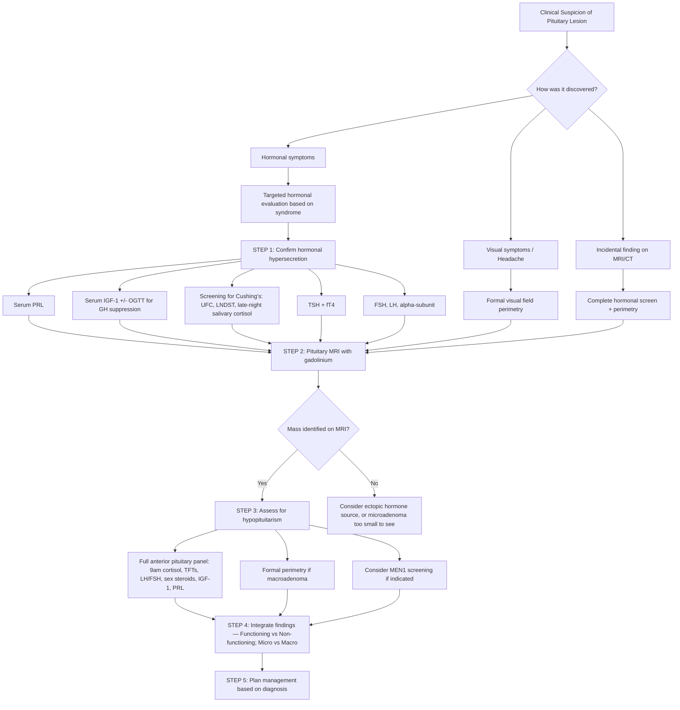

## Diagnostic Approach to Pituitary Adenoma

The diagnosis of a pituitary adenoma is never based on a single test. It is a **convergence** of three pillars — biochemistry, imaging, and visual assessment — each answering a distinct question:

1. **Biochemistry:** "Is this mass making too much hormone? Is it destroying the normal gland?"
2. **Imaging:** "What is this mass? Where exactly is it? What is it compressing?"
3. **Visual assessment:** "Is it damaging the optic pathways?"

Let me walk you through the complete diagnostic algorithm from first principles.

---

### 1. Overarching Diagnostic Algorithm

[2][3][5]

---

### 2. Step 1 — Biochemical Evaluation: Hormonal Hypersecretion

This is the first and most critical step. **Every patient with a sellar mass needs a full hormonal evaluation** — you need to determine both what the tumour is secreting and what the normal gland has stopped producing.

#### 2.1 The Principle: Mode of Secretion Determines the Test

***The approach to hormonal assessment depends on the mode of secretion*** [2]:

| Secretion Pattern | Hormones | Assessment Method | Why |
|:---|:---|:---|:---|
| ***Pulsatile secretion*** | ***GH, ACTH (cortisol)*** | ***Dynamic (stimulation/suppression) tests*** | A single random level is meaningless because levels fluctuate widely throughout the day; you need to challenge the axis and see if it responds appropriately |
| ***Constant (tonic) secretion*** | ***Prolactin, TSH, LH/FSH*** | ***Direct basal serum measurement*** | These hormones have relatively stable levels; a single measurement is interpretable |

[2]

#### 2.2 Hormone-Specific Diagnostic Criteria

##### A. Prolactinoma (Lactotroph Adenoma)

| Test | Method | Interpretation |
|:---|:---|:---|
| ***Serum prolactin*** | Single fasting morning sample | ***PRL > 200 ng/mL (usually > 10× ULN) = diagnostic of prolactinoma*** [2][3][5] |

**Interpretation nuances — the "degree-of-elevation" rule:**

| PRL Level | Most Likely Interpretation |
|:---|:---|
| **Normal** ( < 25 ng/mL) | Non-functioning adenoma or non-PRL-secreting tumour |
| **25–100 ng/mL** | Stalk effect, drugs, hypothyroidism, pregnancy, CKD — NOT prolactinoma |
| **100–200 ng/mL** | Grey zone — could be stalk effect from large mass or small prolactinoma; correlate with tumour size |
| ***> 200 ng/mL*** | ***Virtually diagnostic of prolactinoma*** — degree should be proportional to tumour size |
| **> 1,000–10,000 ng/mL** | Giant prolactinoma |
| **Large macroadenoma with PRL only 50–150 ng/mL** | ***Think stalk effect (non-functioning adenoma) or hook effect*** — request **serial dilutions** of the sample |

[2][3][5]

<Callout title="The Hook Effect — A Lab Pitfall That Can Kill" type="error">
In giant prolactinomas with extremely high PRL ( > 10,000 ng/mL), the standard two-site immunometric assay can be **overwhelmed** — excessive analyte saturates both capture and detection antibodies, preventing proper sandwich formation. The result is a **falsely normal or mildly elevated PRL** reading. This can lead to misdiagnosis as a non-functioning adenoma → inappropriate surgery instead of dopamine agonist therapy. **Always request serial dilutions (1:100)** when you have a large macroadenoma with only modestly elevated PRL.
</Callout>

##### B. Acromegaly (Somatotroph Adenoma)

GH is secreted in pulses, so a random GH level is useless for diagnosis. Instead, we use two complementary tests:

| Test | Method | Diagnostic Criteria | Rationale |
|:---|:---|:---|:---|
| ***Serum IGF-1*** | Single fasting sample; compare to age- and sex-matched reference range | ***Elevated IGF-1 (above age-adjusted ULN)*** [2][3] | IGF-1 is produced by the liver in response to GH. Because IGF-1 has a long half-life (~18h) and is bound to IGFBP-3, it reflects **integrated daily GH secretion** rather than pulsatile spikes. It acts as a smoothed-out biomarker for chronic GH excess |
| ***Oral glucose tolerance test (OGTT) for GH suppression*** | 75g oral glucose load → serial GH measurements at 0, 30, 60, 90, 120 min | ***Normal: GH suppresses to < 1 ng/mL (or < 0.4 ng/mL by ultrasensitive assay)*** after glucose load. ***Acromegaly: failure of GH suppression, or paradoxical GH increase (in ~30%)*** [2][3] | Glucose normally suppresses GH secretion via somatostatin release. In a somatotroph adenoma, the tumour cells are autonomous and do not respond to this negative feedback. Hence GH remains elevated or paradoxically rises |

**When to use OGTT vs. IGF-1?**
- IGF-1 is the **initial screening test** — if clearly elevated and clinical features are present, diagnosis is established
- OGTT is done in **equivocal cases** (borderline IGF-1, no typical manifestations) [2]

***Other investigations for acromegaly*** [2]:
- ***Pituitary MRI and pituitary hormone profile*** for tumour localisation, co-secretion (30% co-secrete PRL), and assessment of local effects
- ***Colonoscopy*** for colonic tumours (↑risk of colon polyps and carcinoma)

##### C. Cushing's Disease (Corticotroph Adenoma)

Diagnosing Cushing's disease is a **multi-step process** because cortisol, like GH, is pulsatile and stress-responsive. The approach involves: (1) confirm endogenous hypercortisolism, (2) determine ACTH-dependence, (3) localise the source.

**Step C1: Confirm Hypercortisolism (Screening — need ≥ 2 abnormal tests)** [9][3]:

***Iatrogenic Cushing's syndrome due to exogenous glucocorticoid must be ruled out first*** [9].

| Screening Test | Method | Positive Result | Caveats |
|:---|:---|:---|:---|
| ***24-hour urinary free cortisol (UFC) ×2*** | Collect all urine over 24h; measures total free cortisol excreted (eliminates pulsatility) | ***Elevated above ULN*** (> 3–4× ULN is virtually diagnostic) [9][3] | Problems: under-/over-collection, inconvenient, affected by renal disease; does not distinguish true CS from physiological hypercortisolism (depression, obesity) [9] |
| ***1 mg overnight dexamethasone suppression test (DST)*** | 1 mg dexamethasone PO at midnight → serum cortisol at 9 AM next morning | ***Cortisol > 50 nmol/L (1.8 μg/dL) = failure to suppress*** | Affected by oestrogen (↑CBG → falsely ↑total cortisol); enzyme inducers (↑dex metabolism → false positive) [3] |
| ***Late-night salivary cortisol ×2*** | Saliva sample at 11 PM–midnight | ***Elevated*** (loss of circadian nadir) | Only free cortisol present in saliva; not suitable for shift workers; requires sensitive LC-MS assay [9] |

***≥ 2 tests abnormal → diagnostic of endogenous Cushing's syndrome*** [3]

**Step C2: Determine ACTH-Dependence** [2][3]:

| Plasma ACTH | Interpretation |
|:---|:---|
| ***< 1.1 pmol/L ( < 5 pg/mL)*** | ***Non-ACTH-dependent*** → adrenal source (adrenal adenoma, carcinoma, bilateral hyperplasia) [3] |
| ***> 3.3 pmol/L ( > 15 pg/mL)*** | ***ACTH-dependent*** → pituitary (Cushing's disease) or ectopic ACTH source [3] |
| **1.1–3.3 pmol/L** | Indeterminate — repeat or proceed to CRH test |

**Step C3: Distinguish Pituitary from Ectopic ACTH** [2][3]:

| Test | Method | Cushing's Disease | Ectopic ACTH |
|:---|:---|:---|:---|
| ***High-dose DST (HDDST)*** | 2 mg dex Q6H × 2 days → measure serum cortisol | ***Cortisol suppressed ( > 50% suppression from baseline)*** — pituitary corticotrophs retain partial feedback sensitivity to high-dose glucocorticoids | ***No suppression*** — ectopic source is autonomous, not responsive to negative feedback [2][3] |
| ***CRH stimulation test*** | 1 μg/kg CRH IV → serial ACTH and cortisol over 2h | ***Exaggerated rise: cortisol > 20% baseline, ACTH > 50% baseline*** — pituitary corticotroph adenoma cells still express CRH receptors | ***No significant rise*** — ectopic tumour cells lack CRH receptors [2][3] |
| ***Pituitary MRI*** | Gadolinium-enhanced | May show microadenoma (but 40–50% of corticotroph adenomas are too small to see, and ~10% of normal population has pituitary incidentaloma) | Normal pituitary |
| ***Inferior petrosal sinus sampling (IPSS)*** | Catheterise both inferior petrosal sinuses; measure ACTH centrally vs. peripherally before and after CRH stimulation | ***Central-to-peripheral ACTH ratio ≥ 2 (basal) or ≥ 3 (post-CRH)*** = pituitary source [2][3] | Ratio < 2 (basal) or < 3 (post-CRH) = ectopic source |

***HDDST is usually done before pituitary MRI to avoid picking up a pituitary incidentaloma*** [2]

<Callout title="IPSS — The Gold Standard for Localisation">
When biochemistry says "ACTH-dependent" but MRI cannot show a clear pituitary adenoma (which happens in ~40% of Cushing's disease because corticotroph adenomas are often tiny), ***inferior petrosal sinus sampling (IPSS)*** is the definitive test. It directly compares ACTH concentration in the venous drainage of the pituitary (petrosal sinuses) vs. a peripheral vein. A gradient confirms pituitary origin. It can even lateralise the adenoma (left vs. right side of the gland) to guide the surgeon [2][3].
</Callout>

**Summary of Cushing's syndrome biochemical findings** [2][3]:

| | Cushing's Disease | Ectopic ACTH | Adrenal Tumour | Iatrogenic |
|:---|:---|:---|:---|:---|
| **Cortisol** | ↑ | ↑ | ↑ | ↓ (exogenous steroid suppresses endogenous) |
| **LDDST** | No suppression | No suppression | No suppression | / |
| **ACTH** | Normal–high | Usually high | ***Almost invariably undetectable*** | Low |
| **HDDST** | ***Usually suppressed*** | ***Usually no suppression*** | No suppression | / |
| **CRH test** | ***Exaggerated rise*** | ***No significant rise*** | / | / |
| **Imaging** | Pituitary adenoma on MRI | Tumour on PET/CT | Adrenal tumour on CT | +ve drug Hx |

[2][3]

##### D. TSH-Secreting Adenoma (Thyrotroph Adenoma)

| Test | Method | Diagnostic Criteria |
|:---|:---|:---|
| ***TSH + fT4 (+ fT3)*** [5] | Standard thyroid function tests | ***Elevated fT4 with non-suppressed (normal or elevated) TSH*** — this is the biochemical hallmark of "inappropriate TSH secretion" |
| ***α-subunit*** | Serum measurement | Elevated in TSHoma; α-subunit:TSH molar ratio > 1 favours TSHoma over thyroid hormone resistance |
| **TRH stimulation test** | IV TRH → measure TSH response | **Blunted TSH response** in TSHoma (tumour is autonomous); **normal/exaggerated response** in thyroid hormone resistance |

> **Why is this DDx important?** Because treating a TSHoma patient with antithyroid drugs or thyroidectomy (as you would for Graves' disease) would be completely wrong — it would remove the feedback brake and cause the TSHoma to grow aggressively. You need to treat the pituitary adenoma.

##### E. Gonadotroph Adenoma (Non-Functioning)

| Test | Method | Interpretation |
|:---|:---|:---|
| ***Serum LH, FSH, and α-subunit*** [5] | Basal levels | ***Gonadotroph adenomas seldom hypersecrete*** clinically [2][3]; may show mildly elevated FSH or α-subunit; most commonly diagnosed as "non-functioning" on biochemistry and confirmed as gonadotroph on immunohistochemistry (SF-1 positivity) post-operatively |

> ***α-subunit is not biologically active*** and does not cause clinical symptoms, but it is measured to determine if a sellar mass is pituitary in origin [5].

---

### 3. Step 2 — Imaging: Radiological Diagnosis

#### 3.1 MRI Pituitary with Gadolinium Contrast — The Modality of Choice

***MRI pituitary is the single best imaging procedure for most sellar masses*** [5][2][3].

**Protocol:** Dedicated pituitary MRI with thin coronal and sagittal cuts (3 mm or less) through the sella, pre- and post-gadolinium contrast.

**Key MRI findings in pituitary adenoma:**

| Feature | Finding | Explanation |
|:---|:---|:---|
| **Microadenoma** | Focal hypointense lesion relative to normal enhancing pituitary on early post-contrast images | ***Normal pituitary tissue takes up gadolinium to a greater degree than CNS tissue*** (high-intensity signal). ***Adenomas take up gadolinium to a lesser degree than normal pituitary but more than surrounding CNS*** [5]. On early dynamic images, the adenoma enhances more slowly → appears relatively dark against the brightly enhancing normal gland |
| **Macroadenoma** | Sellar mass > 1 cm; may be isointense to grey matter on T1; enhances heterogeneously; may show suprasellar extension, cavernous sinus invasion, sphenoid sinus erosion | Larger tumours often have heterogeneous signal due to cystic change, haemorrhage, or necrosis |
| **Stalk deviation** | Stalk pushed to one side by microadenoma | Indirect sign of a microadenoma on the opposite side |
| **Suprasellar extension** | Mass extends above the diaphragma sellae towards the optic chiasm | Explains visual field defects |
| **Cavernous sinus invasion** | Mass extends laterally beyond the intracavernous ICA (Knosp grade 3–4) | Predicts incomplete surgical resection |
| ***Posterior pituitary bright spot*** | Presence or absence on T1 | ***Normally bright due to ADH neurosecretory granules*** [2]; loss suggests DI or posterior pituitary involvement |
| **Haemorrhage (apoplexy)** | High signal on T1 (methaemoglobin); ***hyperdensity on CT*** | Acute blood products; ***pituitary apoplexy: acute blood in pituitary seen on CT/MRI*** [2] |

***If a sellar lesion can be seen as separate from the normal pituitary gland, this indicates the mass is NOT a pituitary adenoma*** [5] — consider craniopharyngioma, meningioma, Rathke's cleft cyst, etc.

<Callout title="Gadolinium Precaution" type="error">
***Avoid gadolinium in patients with moderate to advanced renal failure (eGFR < 30)*** as it is associated with ***nephrogenic systemic fibrosis (NSF)*** — a potentially severe, debilitating fibrotic condition of the skin and internal organs [5]. In such patients, use non-contrast MRI or CT instead.
</Callout>

<Callout title="Don't MRI Without Indication">
***MRI pituitary should NOT be performed in healthy individuals with no clinical indication*** — up to ***10% of normal middle-aged individuals have pituitary abnormalities on MRI*** [2]. Imaging incidentalomas cause unnecessary anxiety and further invasive workup.
</Callout>

#### 3.2 CT Scan — Complementary Role

***CT is better than MRI for detecting calcification*** [2][3][5]:

| Finding on CT | Diagnosis Suggested |
|:---|:---|
| ***Calcification in a suprasellar mass*** | ***Craniopharyngioma*** (50% calcified) or ***meningioma*** |
| **Bone erosion of clivus** | Chordoma |
| **Sellar floor erosion/remodelling** | Large pituitary macroadenoma |
| ***Hyperdensity in the pituitary*** (acute) | ***Pituitary apoplexy*** (acute haemorrhage) [2] |

#### 3.3 Skull X-Ray — Largely Historical

***Seldom done nowadays*** due to low sensitivity and specificity [10], but classic findings include:

- ***Double-floor sign*** of the sella turcica — asymmetrical enlargement of the sella by a pituitary adenoma causes the floor to appear duplicated on lateral skull XR [2][3]
- ***Erosion of posterior clinoid processes*** — sign of raised ICP [10]
- ***Calcification*** above the sella → craniopharyngioma [10]

#### 3.4 Additional Imaging Considerations

| Modality | Indication | What It Shows |
|:---|:---|:---|
| ***CTA or MRA*** | ***Must exclude ICA aneurysm*** before transsphenoidal surgery [4] | Flow void = aneurysm; confirms vascular anatomy |
| **CT/MRI of chest, abdomen, pelvis** | Suspected ectopic ACTH or GHRH secretion | Neuroendocrine tumours (carcinoid, SCLC, pancreatic NET) |
| **PET/CT** (⁶⁸Ga-DOTATATE or FDG) | Ectopic ACTH source localisation when conventional imaging negative | Somatostatin-receptor-expressing NETs |

---

### 4. Step 3 — Assessment for Hypopituitarism

**Every patient with a pituitary macroadenoma (and ideally every pituitary adenoma) needs a full anterior pituitary function assessment** — even if the presenting problem is hormonal excess. The tumour may be simultaneously overproducing one hormone while destroying cells that produce others.

#### 4.1 Baseline Pituitary Hormone Panel

| Axis | Tests to Order | Interpretation |
|:---|:---|:---|
| **Adrenal (ACTH-cortisol)** | 9 AM serum cortisol | > 500 nmol/L = likely intact; < 100 nmol/L = deficient; 100–500 = indeterminate → dynamic test needed |
| **Thyroid (TSH-T4)** | TSH + fT4 | Low fT4 with inappropriately normal/low TSH = central hypothyroidism |
| **Gonadal (LH/FSH)** | LH, FSH + testosterone (M) or oestradiol (F) | Low sex steroids with inappropriately normal/low LH/FSH = hypogonadotropic hypogonadism |
| **GH (GH-IGF-1)** | Serum IGF-1 | Low IGF-1 suggests GH deficiency (but can be normal in mild deficiency; dynamic testing may be needed) |
| **Prolactin** | Serum PRL | Elevated = functional prolactinoma or stalk effect; very low = extensive gland destruction |
| **Posterior pituitary (ADH)** | Serum and urine osmolality; urine specific gravity | Low urine osmolality with high serum osmolality → central DI |

***Classical order of hormone loss in hypopituitarism: GH → FSH/LH → ACTH → TSH*** [2][3]

#### 4.2 Dynamic Function Tests (When Baseline Is Equivocal)

| Test | What It Assesses | Principle | Key Thresholds |
|:---|:---|:---|:---|
| ***Insulin tolerance test (ITT)*** | ***GH reserve AND ACTH/cortisol reserve*** simultaneously [9] | IV insulin → hypoglycaemia (glucose < 2.2 mmol/L) → this is a powerful stress stimulus that should trigger both GH and cortisol release via the hypothalamic stress response | ***Normal: peak cortisol > 550 nmol/L; GH rise > 20 mU/L. Blunted response = deficiency*** [9]. Also differentiates true Cushing's (blunted cortisol response) from pseudo-Cushing's |
| **Short Synacthen test** | ACTH/cortisol reserve (adrenal axis) | 250 μg synthetic ACTH (Synacthen) IV/IM → measure cortisol at 0, 30 min | Peak cortisol > 550 nmol/L = intact adrenal reserve. NB: may be falsely normal in recent pituitary damage (adrenals haven't atrophied yet) |
| ***Glucagon stimulation test*** | GH and cortisol reserve (alternative to ITT) [9] | IM glucagon → counter-regulatory GH and cortisol release | Alternative when ITT is contraindicated (epilepsy, IHD, severe hypopituitarism) |
| ***GHRH-arginine stimulation test*** | GH reserve [9] | GHRH stimulates somatotrophs; arginine suppresses somatostatin → maximal GH release | GH-dependent cut-offs (BMI-adjusted) |
| **Water deprivation test** | Central vs nephrogenic DI | Fluid restriction for 8h → measure urine osmolality; then give desmopressin (DDAVP) | Central DI: urine concentrates after DDAVP. Nephrogenic DI: no response to DDAVP |

<Callout title="ITT — Preparation and Safety" type="idea">
The ITT is considered the **gold standard** for assessing GH and cortisol reserve but carries risk of severe hypoglycaemia. Mandatory safety precautions [9]:
- Prior overnight fast
- ECG to exclude IHD (contraindicated in IHD and epilepsy)
- 50% dextrose and glucagon at bedside
- IV line in situ, resuscitation trolley on standby
- POCT glucose monitoring throughout
- ≥ 2 blood samples must be drawn during confirmed hypoglycaemia ( < 2.2 mmol/L)
</Callout>

---

### 5. Step 4 — Visual Assessment

***Formal perimetry for visual defects due to compression on optic pathways*** [2] should be performed in all patients with macroadenoma or any visual complaint.

| Assessment | Method | What It Detects |
|:---|:---|:---|
| ***Formal perimetry*** (Humphrey automated or Goldmann kinetic) | Standardised visual field mapping | ***Bitemporal hemianopia*** (classic), upper temporal quadrantanopia (early), scotomas, generalised constriction |
| **Visual acuity** | Snellen chart / LogMAR | Decreased acuity if optic nerve compression |
| **Colour vision** | Ishihara plates | Reduced colour perception (red desaturation) indicates optic nerve dysfunction |
| **Fundoscopy** | Direct ophthalmoscopy | ***Optic atrophy*** (pale disc) from chronic compression; papilloedema if raised ICP |
| **Pupillary examination** | Swinging flashlight test | Relative afferent pupillary defect (RAPD) in asymmetric optic nerve involvement |
| **Ocular motility** | Extraocular movements in all directions | CN III, IV, VI palsies from cavernous sinus involvement |

---

### 6. Step 5 — Screening for Familial Syndromes

When indicated (young patient, family history, multifocal endocrine disease), screen for:

| Syndrome | Screen | Trigger to Screen |
|:---|:---|:---|
| ***MEN1*** | Serum calcium + PTH (parathyroid); fasting gastrin (gastrinoma); genetic testing for MEN1 gene | Young-onset pituitary adenoma, especially prolactinoma; concurrent hyperparathyroidism or pancreatic NET; family history [6] |
| **Carney complex** | Cardiac echo (myxoma); skin exam (lentigines); urinary cortisol (adrenal nodular hyperplasia); PRKAR1A gene | GH-secreting adenoma with cardiac myxoma or skin pigmentation |
| **FIPA/AIP** | AIP gene testing | Young-onset ( < 30y) GH-secreting or PRL-secreting adenoma, especially with family history of pituitary adenomas |

---

### 7. Summary — Complete Investigation Checklist for a Pituitary Adenoma

| Category | Investigations | Purpose |
|:---|:---|:---|
| **Hormonal hypersecretion** | PRL, IGF-1, OGTT for GH (if acromegaly suspected), UFC/LDDST/late-night salivary cortisol (if Cushing's suspected), ACTH, TSH + fT4, LH + FSH + α-subunit | Determine if functioning or non-functioning |
| **Hormonal hyposecretion** | 9 AM cortisol, TSH + fT4, LH/FSH + sex steroids, IGF-1, PRL; dynamic tests (ITT, Synacthen) if equivocal | Detect hypopituitarism |
| ***Imaging*** | ***MRI pituitary with gadolinium (modality of choice)***; ***CT if calcification suspected*** (craniopharyngioma, meningioma); ***CTA/MRA to exclude aneurysm*** pre-operatively | Anatomical diagnosis, surgical planning |
| **Visual assessment** | Formal perimetry, visual acuity, colour vision, fundoscopy, pupillary exam, ocular motility | Assess optic pathway compression |
| **Pre-operative** | Full pituitary panel (above), electrolytes, renal function, coagulation, ECG, CXR; CTA/MRA for vascular anatomy | Surgical fitness and safety |
| **Specific tumour workup** | Colonoscopy (acromegaly); ECHO/cardiac assessment (acromegaly, Cushing's); bone density (hypogonadism, Cushing's); glucose tolerance (acromegaly) | Complication screening |
| **Genetic/familial** | MEN1 screen (Ca, PTH, gastrin); AIP gene; Carney complex workup as indicated | Familial syndrome exclusion |
| ***Intra-operative*** | ***Biopsy for histopathology and immunohistochemistry*** (transcription factor staining: PIT-1, T-PIT, SF-1; hormone staining; Ki-67 proliferation index) | Definitive tissue diagnosis and prognostication |

[2][3][5][9][10]

---

<Callout title="High Yield Summary — Diagnosis of Pituitary Adenoma">

1. **Three diagnostic pillars:** Biochemistry (hormonal excess + deficiency) → Imaging (MRI with gadolinium) → Visual assessment (perimetry)
2. ***Mode of secretion determines the test:*** Pulsatile hormones (GH, ACTH) need dynamic tests; constant hormones (PRL, TSH, LH/FSH) need direct measurement [2]
3. ***Prolactinoma dx:*** Serum PRL > 200 ng/mL (> 10× ULN); always correlate PRL level with tumour size; request serial dilutions if large mass with low PRL (hook effect) [2][3]
4. ***Acromegaly dx:*** Elevated age-adjusted IGF-1 ± failure of GH suppression on OGTT (GH nadir > 1 ng/mL) [2][3]
5. ***Cushing's disease dx:*** ≥ 2 screening tests abnormal (UFC, overnight DST, late-night salivary cortisol) → ACTH-dependent → HDDST suppresses / CRH test exaggerated rise → pituitary MRI ± IPSS [2][3][9]
6. ***MRI pituitary with gadolinium = imaging modality of choice;*** CT better for calcification [2][3][5]
7. ***If lesion is separate from normal pituitary on MRI → NOT a pituitary adenoma*** [5]
8. ***Always exclude ICA aneurysm (CTA/MRA) before transsphenoidal surgery*** [4]
9. ***ITT = gold standard for GH + cortisol reserve;*** normal peak cortisol > 550 nmol/L, GH > 20 mU/L [9]
10. ***Hypopituitarism sequence: GH → FSH/LH → ACTH → TSH*** [2][3]

</Callout>

---

<ActiveRecallQuiz
  title="Active Recall - Diagnosis of Pituitary Adenoma"
  items={[
    {
      question: "A 42-year-old man has a 3.5 cm pituitary macroadenoma and serum PRL of 120 ng/mL. Is this a prolactinoma? What two phenomena must you consider, and what should you request from the lab?",
      markscheme: "This is NOT likely a prolactinoma. A 3.5 cm prolactinoma would produce PRL in the thousands to tens of thousands. Two phenomena: (1) Stalk effect from a non-functioning macroadenoma compressing the stalk and blocking dopamine, causing mild PRL elevation typically less than 100-200 ng/mL. (2) Hook effect from a giant prolactinoma where extremely high PRL saturates the assay, giving falsely low readings. Request serial dilutions (1:100) from the lab to unmask a true very high PRL level.",
    },
    {
      question: "Explain the principle behind the OGTT for GH suppression in diagnosing acromegaly. What happens in a normal person versus a patient with acromegaly?",
      markscheme: "Principle: Oral glucose (75g) causes hyperglycaemia, which physiologically stimulates somatostatin release from the hypothalamus. Somatostatin inhibits GH secretion from somatotrophs. Normal: GH suppresses to less than 1 ng/mL (or less than 0.4 ng/mL by ultrasensitive assay). Acromegaly: GH fails to suppress because the adenoma secretes GH autonomously, independent of somatostatin regulation. In approximately 30%, there is a paradoxical GH increase.",
    },
    {
      question: "In the workup of ACTH-dependent Cushing's syndrome, what is the HDDST and how does it distinguish Cushing's disease from ectopic ACTH syndrome? What test is the gold standard if HDDST is non-diagnostic?",
      markscheme: "HDDST: 2 mg dexamethasone every 6 hours for 2 days, then measure serum cortisol. Cushing's disease (pituitary): corticotroph adenoma retains partial negative feedback sensitivity to high-dose glucocorticoids, so cortisol suppresses (greater than 50% from baseline). Ectopic ACTH: autonomous ectopic source has no pituitary feedback mechanisms, so cortisol does NOT suppress. Gold standard if non-diagnostic: CRH stimulation test (exaggerated ACTH/cortisol rise in pituitary disease, no rise in ectopic). If still inconclusive: inferior petrosal sinus sampling (IPSS) with CRH, central-to-peripheral ACTH ratio 2 or more (basal) or 3 or more (post-CRH) confirms pituitary source.",
    },
    {
      question: "Why is the insulin tolerance test (ITT) considered the gold standard for assessing pituitary reserve? What two axes does it test simultaneously, and what are the normal response thresholds?",
      markscheme: "ITT induces hypoglycaemia (glucose less than 2.2 mmol/L), which is a potent physiological stress. Stress activates the hypothalamic-pituitary axis, triggering release of both ACTH/cortisol and GH. It simultaneously tests the adrenal axis (cortisol reserve) and the GH axis. Normal thresholds: peak cortisol greater than 550 nmol/L and GH rise greater than 20 mU/L. Blunted responses indicate hypopituitarism. Contraindicated in IHD and epilepsy. Must have IV access, 50% dextrose, and glucagon at bedside.",
    },
    {
      question: "On MRI, how does a pituitary microadenoma typically appear on gadolinium-enhanced images compared to normal pituitary tissue? Why does this pattern occur? Name one absolute contraindication to gadolinium.",
      markscheme: "Microadenoma appears as a focal hypointense (darker) lesion relative to the surrounding normal pituitary on early post-gadolinium images. This is because normal pituitary tissue has a rich portal venous blood supply and takes up gadolinium to a greater degree than adenoma tissue, which enhances more slowly due to a different vascular architecture. Absolute contraindication: moderate to advanced renal failure (eGFR less than 30) due to risk of nephrogenic systemic fibrosis (NSF).",
    },
    {
      question: "A patient has elevated fT4 with non-suppressed TSH and a pituitary mass. Name two differential diagnoses and state two investigations to distinguish between them.",
      markscheme: "Two DDx: (1) TSH-secreting pituitary adenoma (TSHoma) and (2) Thyroid hormone resistance syndrome. Investigations to distinguish: (1) Serum alpha-subunit and alpha-subunit-to-TSH molar ratio: greater than 1 in TSHoma, normal in resistance. (2) TRH stimulation test: blunted TSH rise in TSHoma (autonomous tumour does not respond to TRH), normal or exaggerated rise in resistance (pituitary thyrotrophs are simply set to a higher threshold but still respond to TRH).",
    },
  ]}
/>

## References

[2] Senior notes: Ryan Ho Endocrine.pdf (Section 5: Pituitary Gland, pp. 104–111; Section 3.3: Cushing's Syndrome, pp. 60–63)
[3] Senior notes: Ryan Ho Fundamentals.pdf (Section 3.8.4: Presenting Problems in Pituitary Gland, pp. 436–437, 441–444)
[4] Lecture slides: GC 108. A mass in the brain brain tumours.pdf (pp. 17–18, 41–42, 48)
[5] Senior notes: felixlai.md (Pituitary adenoma section — Diagnosis)
[6] Senior notes: Ryan Ho Endocrine.pdf (Section 6.3: MEN, p. 132)
[9] Senior notes: Ryan Ho Chemical Path.pdf (Section 4: Diagnostic Function Tests, pp. 29–33)
[10] Senior notes: Ryan Ho Neurology.pdf (Section 1.2.1: Neuroimaging — Skull X-ray, p. 32; Pituitary Adenoma, p. 166)
