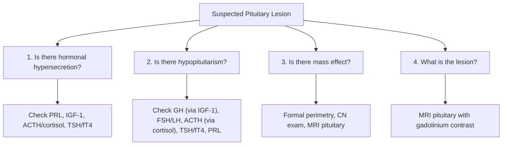

# Pituitary Adenoma

## 1. Definition

A **pituitary adenoma** is a benign neoplasm arising from the epithelial cells of the **anterior pituitary gland** (adenohypophysis). The name breaks down as: "pituitary" = relating to the pituitary gland (Latin *pituita* = phlegm/mucus, a historical misnomer), "adeno-" = gland (Greek *aden*), "-oma" = tumour/swelling (Greek). So literally, a "glandular tumour of the pituitary."

These tumours are overwhelmingly benign — they do not metastasise (if they do, they are reclassified as pituitary **carcinoma**, which is exceedingly rare). However, "benign" does not mean "harmless." Even a benign tumour in the sella turcica — a tiny bony fossa at the skull base — can wreak havoc through:

1. **Hormonal hypersecretion** — the tumour autonomously produces one or more anterior pituitary hormones
2. **Hormonal hyposecretion (hypopituitarism)** — the growing mass compresses and destroys surrounding normal pituitary tissue
3. **Mass effect** — compression of adjacent structures (optic chiasm, cavernous sinus, hypothalamus, third ventricle)
4. **Acute catastrophe (pituitary apoplexy)** — haemorrhagic infarction of the adenoma [1][2][3]

> **Key concept:** A pituitary adenoma can present with too much hormone, too little hormone, visual loss, headache, or be found completely by accident. Your job is to figure out which combination is at play.

---

## 2. Epidemiology

### 2.1 Prevalence and Incidence

- ***Pituitary adenomas account for 10–15% of all primary intracranial neoplasms*** [1][3][4]
- ***Found in 12–22% of autopsy series*** — meaning many are clinically silent "incidentalomas" [2][3]
- ***20–25% at autopsy*** per neurosurgical lecture data [4]
- Up to **10% of normal middle-aged individuals** have pituitary abnormalities on MRI — hence MRI pituitary should NOT be performed without clinical indication [2]
- **Most common cause of sellar mass** from the 3rd decade onwards [5]
- Clinically significant pituitary adenomas have an estimated prevalence of ~80–100 per 100,000 population

### 2.2 Age and Sex Distribution

| Adenoma Type | Peak Age | Sex Predominance |
|:---|:---|:---|
| Prolactinoma | 20–40 years | F > > M |
| GH-secreting (acromegaly) | 30–50 years | M ≈ F |
| ACTH-secreting (Cushing's disease) | 25–45 years | F > > M (1:3–8) |
| Non-functioning | 40–60 years | M ≈ F (slight M predominance) |
| TSH-secreting | Any age | M ≈ F |

- In **children**, pituitary adenomas are rare — **craniopharyngiomas** are the more common sellar mass [3]
- In **adults**, pituitary adenoma is the dominant sellar pathology [3][5]

### 2.3 Frequency of Different Types

***Descending order of frequency*** [2][5]:

1. **Prolactinoma** (most common overall, ~40–45% of all functioning adenomas)
2. **Non-functioning adenoma** (25–35%)
3. **Somatotroph (GH-secreting) adenoma** (~12%)
4. **Corticotroph (ACTH-secreting) adenoma** (~5–10%)
5. **Thyrotroph (TSH-secreting) adenoma** (~1%, very rare)
6. **Gonadotroph adenoma** — technically the most common non-functioning macroadenoma (70–90% of "non-functioning" adenomas are gonadotroph in origin), but classified as non-functioning because they don't produce a clinical hormonal syndrome [5]

<Callout title="High Yield">
***Prolactinoma is the most common functioning pituitary adenoma.*** Non-functioning adenomas are the most common pituitary macroadenoma (because gonadotroph adenomas, which are functionally silent, grow large before they are detected). [2][5]
</Callout>

---

## 3. Anatomy and Function of the Pituitary Gland

Understanding pituitary adenoma requires a solid grasp of the anatomy. Let's build this from first principles.

### 3.1 Location: The Sella Turcica

The pituitary gland sits in the **sella turcica** (Latin: "Turkish saddle" — because the bony depression in the sphenoid bone looks like a saddle). It is normally < 0.8 cm deep [2].

**Key anatomical relations** — these explain every symptom of pituitary adenomas:

| Direction | Structure | Clinical Consequence of Compression |
|:---|:---|:---|
| ***Superior*** | ***Diaphragma sellae*** (dural fold), then ***optic chiasm*** | ***Bitemporal hemianopia*** (classic), visual loss |
| ***Lateral*** | ***Cavernous sinus*** (containing CN III, IV, V1, V2, VI, and the internal carotid artery) | ***Diplopia, CN palsies*** (uncommon unless invasive) |
| ***Inferior*** | ***Sphenoid sinus*** (an air-filled paranasal sinus) | Surgical corridor for transsphenoidal approach; rarely CSF rhinorrhoea if tumour erodes floor |
| ***Anterosuperior*** | ***Optic chiasm*** specifically | Visual field defects |
| ***Posterosuperior*** | ***Third ventricle*** | ***Hydrocephalus*** (only with very large/giant adenomas) |

[2][3][5]

### 3.2 Structure of the Pituitary

The pituitary has **two functionally distinct lobes**:

#### Anterior Lobe (Adenohypophysis)
- Derived embryologically from **Rathke's pouch** (an ectodermal outpouching of the oral cavity/stomodeum)
- Connected to the hypothalamus via the **hypothalamic-hypophyseal portal system** — a specialised venous portal system carrying **releasing and inhibiting hormones** from the median eminence of the hypothalamus to the anterior pituitary
- Produces **six major hormones** from five cell types:

| Cell Type | Hormone(s) | Hypothalamic Regulator | Target |
|:---|:---|:---|:---|
| **Lactotroph** | **Prolactin (PRL)** | **Dopamine (inhibitory)** — this is KEY | Breast (milk production) |
| **Somatotroph** | **Growth Hormone (GH)** | GHRH (+), Somatostatin (−) | Liver (IGF-1), bones, soft tissue |
| **Corticotroph** | **ACTH** | CRH (+) | Adrenal cortex (cortisol) |
| **Thyrotroph** | **TSH** | TRH (+), T3/T4 (−) | Thyroid gland |
| **Gonadotroph** | **FSH, LH** | GnRH (+) | Gonads |

<Callout title="Why Prolactin is Special" type="idea">
Prolactin is the **only** anterior pituitary hormone under **tonic inhibition** by the hypothalamus (via dopamine). All other hormones are under tonic stimulation. This means:
- If you cut the pituitary stalk → all hormones ↓ EXCEPT prolactin, which ↑ (because you've removed the dopamine "brake")
- This is the basis of the **"stalk effect"** — any mass compressing the stalk can cause mild hyperprolactinaemia (usually < 100 ng/mL, and almost always < 200 ng/mL)
</Callout>

#### Posterior Lobe (Neurohypophysis)
- Derived from a downward extension of the **hypothalamus** (neural tissue)
- Stores and releases **oxytocin** and **ADH (vasopressin)**, which are actually synthesised in the hypothalamic supraoptic and paraventricular nuclei and transported down axons through the stalk
- ***Normally appears bright on T1 MRI due to ADH neurosecretory granules*** [2]
- Loss of this "bright spot" suggests posterior pituitary dysfunction (e.g., diabetes insipidus)

### 3.3 The Infundibular Stalk (Pituitary Stalk)

Connects the hypothalamus to the pituitary. Contains:
- **Portal vessels** carrying hypothalamic releasing/inhibiting hormones to the anterior lobe
- **Nerve fibres** from hypothalamus to the posterior lobe

Compression or transection of the stalk (by tumour, surgery, or trauma) leads to:
- **Hypopituitarism** (loss of stimulatory signals to anterior pituitary)
- **Hyperprolactinaemia** (loss of inhibitory dopamine → "stalk effect")
- **Diabetes insipidus** (loss of ADH transport to posterior pituitary)

### 3.4 The Cavernous Sinus

A paired venous sinus lateral to the sella. Contains:
- **Cranial nerve III** (oculomotor) — most medial, hence most vulnerable to lateral tumour extension
- **Cranial nerve IV** (trochlear)
- **Cranial nerve V1** (ophthalmic division of trigeminal)
- **Cranial nerve V2** (maxillary division of trigeminal)
- **Cranial nerve VI** (abducens) — runs within the sinus itself, close to the ICA
- **Internal carotid artery** (ICA)

Invasion of the cavernous sinus by an aggressive/invasive adenoma can produce **CN palsies** and is a critical consideration for surgical planning (cavernous sinus invasion = incomplete surgical resection likely) [2][5].

---

## 4. Etiology

### 4.1 Pathogenesis — Why Do Pituitary Adenomas Form?

The pathogenesis is **predominantly monoclonal** — most pituitary adenomas arise from a single mutated cell that gains a growth advantage.

#### Molecular Mechanisms

| Mechanism | Details |
|:---|:---|
| **Somatic mutations** | Most pituitary adenomas are sporadic, driven by acquired somatic mutations |
| **GNAS1 mutation** (Gsα activating mutation) | Found in ~40% of GH-secreting adenomas → constitutive activation of the Gs-cAMP-PKA pathway → unregulated GH secretion and cell proliferation |
| **USP8 mutation** | Found in ~40–60% of corticotroph adenomas (Cushing's disease), particularly in women → enhances EGFR signalling → ACTH hypersecretion |
| **Loss of tumour suppressors** | Loss of p27 (CDKN1B), Rb, p16; epigenetic silencing of GADD45γ, MEG3 |
| **Oncogene activation** | PTTG (pituitary tumour-transforming gene) overexpression — promotes chromosomal instability |

#### Familial/Genetic Syndromes

About 5% of pituitary adenomas occur in the context of inherited syndromes:

| Syndrome | Gene | Pituitary Tumour Type | Other Features |
|:---|:---|:---|:---|
| ***MEN1*** | ***MEN1 (encoding menin) at 11q13*** | ***Pituitary adenoma (15–42%), most commonly prolactinoma***; 85% are macroadenomas | ***Parathyroid hyperplasia (100%), pancreatic NETs (gastrinoma, insulinoma)*** |
| **MEN4** | CDKN1B (p27) | Pituitary adenomas (similar to MEN1) | Parathyroid adenomas, other NETs |
| **Carney complex** | PRKAR1A | GH-secreting or PRL-secreting adenomas | Cardiac myxomas, skin pigmentation, adrenal nodular hyperplasia |
| **McCune-Albright syndrome** | GNAS1 (postzygotic mosaic) | GH-secreting adenoma | Polyostotic fibrous dysplasia, café-au-lait spots, precocious puberty |
| ***Familial isolated pituitary adenoma (FIPA)*** | AIP (aryl hydrocarbon receptor-interacting protein) in ~20% | GH-secreting or prolactinoma, often in young patients | No other endocrine tumours |

[2][5][6]

<Callout title="MEN1 and Pituitary Adenomas">
***MEN1 = Parathyroid hyperplasia + Pancreatic NETs + Pituitary adenoma (classically Prolactinoma)*** [5][6]. Remember the **3 P's**: Parathyroid, Pancreas, Pituitary. In MEN1, pituitary adenomas are **larger and more aggressive** than sporadic ones (85% macroadenomas vs ~42% in sporadic cases) [2].
</Callout>

### 4.2 Risk Factors

- **No clearly established modifiable risk factors** for sporadic pituitary adenomas
- ***High-dose ionising radiation*** is the only proven environmental risk factor for brain tumours including meningiomas and gliomas; its role in pituitary adenomas is less clear but prior cranial irradiation may increase risk [7]
- **Familial syndromes** as above (MEN1, Carney complex, FIPA, McCune-Albright)
- **Longstanding end-organ failure** can cause pituitary hyperplasia (which may be mistaken for adenoma):
  - Longstanding **primary hypothyroidism** → thyrotroph hyperplasia (due to loss of T4 negative feedback → chronic TSH stimulation → hyperplasia)
  - Longstanding **primary hypogonadism** → gonadotroph hyperplasia
  - **Pregnancy** → lactotroph hyperplasia (physiological)
  - Ectopic **GHRH secretion** → somatotroph hyperplasia [5]

> These hyperplastic conditions are **not true adenomas** but can mimic them on imaging and must be distinguished clinically.

### 4.3 Aetiology in the Hong Kong Context

- The distribution of pituitary adenoma types in Hong Kong follows international patterns
- **Prolactinoma** remains the most common functioning adenoma
- **Non-functioning adenomas** are frequently encountered in neurosurgical and endocrine clinics
- MEN1 screening is performed in families with identified mutations; genetic counselling services are available at major centres (Queen Mary Hospital, Prince of Wales Hospital)
- Incidental pituitary lesions are increasingly detected due to widespread MRI use in Hong Kong's public and private healthcare systems
- Traditional Chinese medicine and herbal remedies should be considered as potential causes of **iatrogenic Cushing's syndrome** (steroids hidden in herbal preparations) — this is particularly relevant in the Hong Kong context when evaluating ACTH-dependent vs independent causes [2]

---

## 5. Differential Diagnosis of Sellar Masses

Before assuming a sellar mass is a pituitary adenoma, consider the full differential [5]:

### 5.1 Comprehensive DDx of Sellar/Parasellar Masses

| Category | Examples | Distinguishing Features |
|:---|:---|:---|
| **Pituitary adenoma** | Functioning or non-functioning | Most common sellar mass in adults |
| **Pituitary hyperplasia** | Lactotroph (pregnancy), thyrotroph (1° hypothyroidism), gonadotroph (1° hypogonadism), somatotroph (ectopic GHRH) | Diffuse enlargement, no focal lesion; correct the underlying cause and the gland shrinks |
| **Craniopharyngioma** | Benign, from Rathke's pouch remnants | ***50% calcified (visible on XR/CT)***, often cystic, ***most common sellar mass in children***, bimodal age (childhood + 50–60y) [3] |
| **Meningioma** | Suprasellar/parasellar | Dural tail on MRI, calcified, enhances homogeneously |
| **Rathke's cleft cyst** | Remnant of Rathke's pouch | Cystic, non-enhancing, between anterior and posterior lobes |
| **Arachnoid cyst** | CSF-filled | Follows CSF signal on MRI |
| **Dermoid/epidermoid cyst** | Developmental | Fat signal (dermoid) or restricted diffusion (epidermoid) |
| **Pituicytoma** | Rare, from pituicytes of posterior pituitary/stalk | Solid, enhancing |
| **Metastases** | ***CA lung (M), CA breast (F)*** most common | Usually in posterior pituitary (richer blood supply), may present with DI |
| **Germ cell tumours** | Germinoma, teratoma | Typically suprasellar in young patients; check β-hCG, AFP |
| **Chordoma** | From notochord remnants | Clival, destructive, bone erosion |
| **CNS lymphoma** | Primary or secondary | Homogeneous enhancement, consider in immunosuppressed |
| **Pituitary carcinoma** | Extremely rare | Defined by CSF or systemic metastasis |
| **Lymphocytic hypophysitis** | Autoimmune | Peripartum women, diffuse stalk/gland enlargement, DI common |
| **Pituitary abscess** | Infection | Fever, ring enhancement, may follow surgery |
| **Carotid-cavernous fistula** | Vascular | Pulsatile proptosis, chemosis, bruit |
| **Aneurysm** | ICA aneurysm can mimic sellar mass | ***"Cerebral aneurysm mimicking a sellar tumour"*** — must exclude before surgery! [4] |

[3][4][5]

<Callout title="Do NOT Miss This" type="error">
***A cerebral aneurysm can mimic a sellar tumour on imaging*** [4]. Always consider vascular pathology before proceeding to transsphenoidal surgery — operating on an aneurysm thinking it's a pituitary adenoma would be catastrophic. MRI with MR angiography or CT angiography can help distinguish.
</Callout>

---

## 6. Classification of Pituitary Adenomas

### 6.1 By Size

| Category | Size | Notes |
|:---|:---|:---|
| ***Microadenoma*** | ***< 1 cm*** | More likely to be discovered incidentally or via hormonal symptoms; less likely to cause mass effect |
| ***Macroadenoma*** | ***> 1 cm*** (most commonly 1–4 cm) | More likely to cause visual field defects, hypopituitarism, headache |
| ***Giant adenoma*** | ***> 4 cm*** | Significant mass effect, may obstruct third ventricle causing hydrocephalus [4] |

[4][5]

### 6.2 By Functionality

| Category | Proportion | Explanation |
|:---|:---|:---|
| ***Functioning adenomas*** | ***~70–80%*** of surgically resected adenomas (but includes prolactinomas managed medically) | Autonomously secrete one or more hormones → clinical syndrome |
| ***Non-functioning adenomas*** | ***~25–35%*** clinically; but ~50% of macroadenomas | Do not produce a clinically recognisable hormonal syndrome; 70–90% are gonadotroph adenomas that secrete inefficiently [5] |

[2][3][5]

### 6.3 By Cell of Origin (WHO 2022 Classification)

The 2017/2022 WHO classification shifted from purely functional to **transcription factor–based classification**, recognising that each pituitary cell lineage is driven by specific transcription factors:

| Lineage | Transcription Factor | Cell Type | Hormone(s) | Clinical Syndrome |
|:---|:---|:---|:---|:---|
| **PIT-1 lineage** | PIT-1 | Somatotroph | GH | Acromegaly/gigantism |
| | PIT-1 | Lactotroph | Prolactin | Hyperprolactinaemia (galactorrhoea, hypogonadism) |
| | PIT-1 | Thyrotroph | TSH | Secondary hyperthyroidism |
| | PIT-1 | Mixed somatotroph-lactotroph | GH + PRL | Acromegaly + hyperprolactinaemia |
| **T-PIT lineage** | T-PIT | Corticotroph | ACTH | Cushing's disease |
| **SF-1 lineage** | SF-1 | Gonadotroph | FSH, LH, α-subunit | Usually non-functioning |
| **Null cell** | None identified | Null cell adenoma | None | Non-functioning |
| **Plurihormonal** | Variable | Mixed | Multiple | Variable |

<Callout title="WHO 2022 Terminology Update" type="idea">
The WHO 2022 classification now uses the term **"pituitary neuroendocrine tumour (PitNET)"** instead of "pituitary adenoma" to better reflect the neoplastic nature of these lesions and bring nomenclature in line with other neuroendocrine tumours. However, "pituitary adenoma" remains widely used clinically and in exams. Know both terms.
</Callout>

### 6.4 By Invasiveness (Hardy/Knosp Classification)

- **Enclosed adenomas**: confined within the sella
- **Invasive adenomas**: extend into cavernous sinus (Knosp grade), sphenoid sinus, or suprasellar region
- **Knosp classification** (grades 0–4): based on relationship to the intracavernous ICA on coronal MRI
  - Grade 0–2: medial to ICA tangent lines → potentially resectable
  - Grade 3–4: lateral to or encasing ICA → cavernous sinus invasion → unlikely complete surgical resection

### 6.5 The 2022 "High-Risk" Pituitary Adenoma Concept

Certain subtypes are recognised as "aggressive" or "high-risk" and are more likely to recur or resist treatment:
- **Sparsely granulated somatotroph adenoma** (responds poorly to somatostatin analogues)
- **Silent corticotroph adenoma** (often invasive)
- **Crooke's cell adenoma** (aggressive corticotroph variant)
- **Male prolactinoma** (often larger and more invasive than in women)
- **Plurihormonal PIT-1 positive adenoma** (previously "silent subtype 3")

---

## 7. Pathophysiology

### 7.1 Hormonal Hypersecretion — How Each Adenoma Type Produces Disease

#### 7.1.1 Prolactinoma (Lactotroph Adenoma)

**Mechanism of hyperprolactinaemia:**
- Autonomous PRL secretion by tumour cells, independent of dopamine inhibition
- PRL acts on the breast → **galactorrhoea**
- PRL inhibits GnRH pulsatility at the hypothalamus → **hypogonadotropic hypogonadism** → amenorrhoea (F), erectile dysfunction/infertility (M), decreased libido, osteoporosis

**Why do women present earlier?**
- Menstrual irregularity is noticed quickly → diagnosed at the microadenoma stage
- Men often ignore decreased libido → present late with macroadenomas and visual field defects

**Stalk effect vs. true prolactinoma — a critical distinction:**

| Feature | Stalk Effect | True Prolactinoma |
|:---|:---|:---|
| Mechanism | Mass compresses stalk → blocks dopamine delivery → mild ↑PRL | Tumour autonomously produces PRL |
| PRL level | Usually **< 100–200 ng/mL** | Usually **> 200 ng/mL** (often > 10× ULN) |
| Response to dopamine agonist | PRL normalises but tumour doesn't shrink | PRL normalises AND tumour shrinks |

<Callout title="The Hook Effect" type="error">
In **giant prolactinomas** with extremely high PRL levels (> 10,000 ng/mL), the immunoassay can paradoxically report a **falsely normal or mildly elevated PRL** due to antibody saturation. This is the **"hook effect."** Always request **serial dilutions** of the PRL sample if you have a large macroadenoma with only mildly elevated PRL — it could be a giant prolactinoma masquerading as a non-functioning adenoma.
</Callout>

#### 7.1.2 Somatotroph Adenoma (GH-Secreting)

**Mechanism:**
- Autonomous GH secretion → GH acts on liver to produce **IGF-1** (insulin-like growth factor 1)
- IGF-1 mediates most of GH's anabolic effects: soft tissue growth, bone growth, metabolic effects
- In **adults** (closed epiphyses) → **acromegaly** ("acro-" = extremities, "-megaly" = enlargement)
- In **children** (open epiphyses) → **gigantism** (linear bone growth at growth plates)

**Why is acromegaly insidious?**
- Changes occur over years → patient and family don't notice gradual coarsening of features
- Average delay to diagnosis is 7–10 years

***~30% co-secrete prolactin*** because somatotrophs and lactotrophs share the PIT-1 transcription factor lineage [2]

#### 7.1.3 Corticotroph Adenoma (ACTH-Secreting) — Cushing's Disease

**Mechanism:**
- Autonomous ACTH secretion → stimulates adrenal cortex → excess cortisol
- **Cushing's disease** specifically refers to Cushing's syndrome caused by a pituitary ACTH-secreting adenoma
- These are usually **microadenomas** (often < 5 mm) → frequently difficult to see on MRI
- ***Cushing's disease typically affects women 25–45 years with M:F ratio 1:3–8*** [2]

#### 7.1.4 Thyrotroph Adenoma (TSH-Secreting)

**Mechanism:**
- Autonomous TSH secretion → stimulates thyroid → **secondary (central) hyperthyroidism**
- ***Very rare (~1% of pituitary adenomas)*** [2]
- Key distinguishing feature: **elevated fT4 with non-suppressed (elevated or normal) TSH** — the opposite of Graves' disease where TSH is suppressed
- May secrete only α- or β-subunits → clinically non-functioning [5]

#### 7.1.5 Gonadotroph Adenoma

**Mechanism:**
- Most common pituitary macroadenoma subtype (~70–90% of non-functioning adenomas) [5]
- Although technically secrete FSH, LH, or their subunits (most commonly **FSH > FSH-β > α-subunit > LH > LH-β**), they are:
  - **Poorly differentiated and inefficient secretors** → rarely produce supranormal hormone levels [5]
  - **α-subunit** is not biologically active → no clinical syndrome from its secretion
  - In rare cases: precocious puberty (children), ovarian hyperstimulation (women)
- Because they are functionally silent, they grow **large before detection** → present as macroadenomas with mass effect and hypopituitarism

#### 7.1.6 Mixed/Plurihormonal Adenomas

- ***Lactotroph/somatotroph adenoma (~10%)*** — well-recognised, produces clinical syndromes of both GH excess and hyperprolactinaemia [5]
- Plurihormonal PIT-1 positive adenomas can secrete GH, PRL, and TSH in various combinations

### 7.2 Hormonal Hyposecretion — Hypopituitarism from Mass Compression

When a growing adenoma compresses the surrounding normal pituitary tissue, hormone deficiencies develop in a **predictable sequential order**:

***Classical order of hormone loss*** [2][3]:

> **GH → FSH/LH → ACTH → TSH** (→ Prolactin last, if ever)

**Mnemonic: "Go Look For ACTH and TSH"** — or simply remember that GH is the most sensitive and TSH the most resistant.

**Why this order?**
- **GH-secreting cells** (somatotrophs) are the most numerous (~50% of anterior pituitary cells) and are located laterally — vulnerable to compression
- **Gonadotrophs** are scattered throughout — vulnerable to even moderate compression
- **Corticotrophs and thyrotrophs** are more centrally located and fewer in number, but their pathways are more robust
- **Prolactin** is under tonic inhibition, so compression of the stalk actually **increases** PRL (stalk effect) rather than decreasing it — PRL deficiency is exceedingly rare and essentially only occurs after complete destruction of the gland

### 7.3 Mass Effect — Compression of Adjacent Structures

#### 7.3.1 Optic Chiasm Compression (Suprasellar Extension)

***The classic visual field defect is bitemporal hemianopia*** [3][4]:

**Why bitemporal hemianopia?**
- The optic chiasm sits just above the pituitary
- In the chiasm, fibres from the **nasal retina** (which see the **temporal visual field**) cross to the opposite side
- A mass pushing up from below compresses the **crossing nasal fibres** → loss of **temporal visual fields bilaterally**
- This produces the classic pattern: the patient cannot see objects in their peripheral (temporal) fields on both sides

**But the visual field defect is not always bitemporal hemianopia:**
- ***Unilateral visual loss*** (optic nerve compression — if the chiasm is prefixed and the mass pushes on one optic nerve) [3]
- ***Homonymous hemianopia*** (optic tract compression — if the chiasm is postfixed) [3]
- ***Optic atrophy*** may be evident on fundoscopy (chronic compression → axonal degeneration) [3]

#### 7.3.2 Headache

***Due to stretching of the diaphragma sellae*** [3] — the dural fold that covers the sella. The dura is pain-sensitive (innervated by the trigeminal nerve). As the tumour expands within or beyond the sella, it stretches this structure → headache. Headache can also occur from dural invasion.

#### 7.3.3 Cavernous Sinus Invasion (Lateral Extension)

- ***Diplopia due to CN III, IV, or VI palsy*** [3][4]
- Facial numbness (CN V1, V2)
- Uncommon unless the adenoma is invasive

#### 7.3.4 Third Ventricle Obstruction (Superior Extension)

- ***Hydrocephalus*** — only with large/giant adenomas that extend superiorly enough to obstruct the foramen of Monro or compress the third ventricle [4]
- Leads to raised ICP → headache, nausea/vomiting, papilloedema

#### 7.3.5 Sphenoid Sinus Erosion (Inferior Extension)

- CSF rhinorrhoea (rare)
- This downward expansion is actually exploited surgically — the **transsphenoidal approach** accesses the pituitary through the sphenoid sinus via the nose

### 7.4 Pituitary Apoplexy — The Acute Catastrophe

***Pituitary apoplexy is a neurosurgical emergency*** [2][3][4]:

**Definition:** Sudden haemorrhagic infarction of a pituitary adenoma (or rarely, of the normal gland).

**Pathophysiology:**
- Pituitary adenomas can outgrow their blood supply → **ischaemic necrosis** ± secondary **haemorrhage**
- The sudden swelling within the confined bony sella turcica → rapid compression of adjacent structures

**Presentation** (***sudden or subacute over 1–2 days***) [3]:
- ***Excruciating headache*** (stretching/rupture of sella)
- ***Diplopia*** (pressure on CN III — the most medial nerve in the cavernous sinus)
- ***Hypopituitarism, especially adrenal crisis*** (acute cortisol deficiency = life-threatening)
- ***± Visual field defects*** (acute chiasmal compression)
- ***± Altered consciousness, vertigo*** [3]
- May mimic subarachnoid haemorrhage (blood can leak into CSF)

***Imaging: hyperdensity (acute blood) in pituitary on CT; MRI shows haemorrhage*** [3][4]

***Management: steroid cover (hydrocortisone) + urgent surgical decompression if*** [2][3]:
- ***Signs of raised ICP***
- ***Change in conscious state***
- ***Evidence of compression on neighbouring structures***

<Callout title="Pituitary Apoplexy — Don't Forget Steroids First!" type="error">
Before ANY surgical intervention for pituitary apoplexy, give **IV hydrocortisone** (100 mg stat then 50 mg Q6–8H). The patient is likely acutely cortisol-deficient, and surgical stress without cortisol replacement is fatal.
</Callout>

---

## 8. Clinical Features

### 8.1 Symptoms

Clinical features can be organised into four domains: **local/mass effect**, **hormonal hypersecretion**, **hormonal hyposecretion**, and **acute presentation (apoplexy)**.

#### 8.1.1 Local Symptoms (Mass Effect)

| Symptom | Pathophysiological Basis |
|:---|:---|
| ***Headache*** | Stretching of the dura (diaphragma sellae) by the expanding tumour; dura is innervated by trigeminal nerve branches |
| ***Visual field loss*** (typically bitemporal hemianopia, but variable) | Suprasellar extension compresses optic chiasm — crossing nasal retinal fibres subserve temporal visual fields |
| ***Decreased visual acuity*** | Direct optic nerve compression (especially with prefixed chiasm) |
| ***Diplopia*** | Lateral extension into cavernous sinus compresses CN III (most common), IV, or VI → ocular misalignment |
| ***Facial numbness/pain*** | Cavernous sinus invasion compressing CN V1/V2 |
| ***Nausea, vomiting, drowsiness*** | Very large tumour obstructs third ventricle → obstructive hydrocephalus → raised ICP |
| ***CSF rhinorrhoea*** | Inferior erosion through the sphenoid sinus floor (rare) |

#### 8.1.2 Symptoms of Hormonal Hypersecretion

**a) Prolactinoma symptoms:**

| Symptom | Mechanism |
|:---|:---|
| ***Galactorrhoea*** | PRL stimulates mammary gland ductal epithelium to produce milk |
| ***Amenorrhoea (F)*** | PRL inhibits GnRH → ↓FSH/LH → anovulation |
| ***Infertility (F)*** | Anovulation from hypogonadotropic hypogonadism |
| ***Erectile dysfunction, decreased libido (M)*** | Hypogonadotropic hypogonadism → ↓testosterone |
| ***Gynaecomastia (M, rare)*** | PRL effects on breast tissue in males |
| ***Osteoporosis*** | Chronic hypogonadism → ↓oestrogen/testosterone → ↓bone density |

**b) GH-secreting adenoma symptoms (Acromegaly):**

| Symptom | Mechanism |
|:---|:---|
| ***Enlarging hands/feet (increased ring/shoe size)*** | GH/IGF-1–driven acral soft tissue and periosteal bone overgrowth |
| ***Coarsening of facial features*** | Soft tissue and bony hypertrophy: prominent supraorbital ridges, enlarged nose, prognathism |
| ***Thickened lips, macroglossia, interdental separation*** | Soft tissue overgrowth in oral structures |
| ***Deepening of voice*** | Laryngeal cartilage and soft tissue hypertrophy |
| ***Carpal tunnel syndrome (~50%)*** | Median nerve compression from soft tissue swelling in the carpal tunnel |
| ***Obstructive sleep apnoea (~50%)*** | Macroglossia + pharyngeal soft tissue hypertrophy → upper airway narrowing |
| ***Excessive sweating (hyperhidrosis, > 80%)*** | GH stimulates sweat glands directly |
| ***Joint pain/arthropathy*** | Cartilage and synovial tissue hypertrophy → hypertrophic arthropathy, pseudogout |
| ***Snoring*** | Upper airway narrowing (same mechanism as OSA) |
| ***Headache*** | Both mass effect and direct GH/IGF-1 effects on intracranial structures |

[2][3]

**c) ACTH-secreting adenoma symptoms (Cushing's disease):** — see Cushing's syndrome notes for full detail
- Central obesity, moon face, buffalo hump (cortisol → visceral fat redistribution)
- Purple striae (cortisol → collagen breakdown → skin thinning → dermal vessels visible)
- Proximal myopathy (cortisol → protein catabolism in muscle)
- Easy bruising, poor wound healing (cortisol → collagen/connective tissue breakdown)
- Hirsutism, acne (adrenal androgen co-secretion)
- Emotional lability, depression, psychosis
- Hypertension (cortisol has mineralocorticoid activity at high levels)
- Hyperglycaemia/DM (cortisol → gluconeogenesis, insulin resistance)
- Osteoporosis (cortisol → ↓osteoblast activity)

**d) TSH-secreting adenoma symptoms:**
- Symptoms of **hyperthyroidism**: weight loss, tremor, heat intolerance, palpitations, tachycardia, diarrhoea
- Often also has features of mass effect (since these are typically macroadenomas)
- May present with **diffuse goitre** (TSH-driven thyroid stimulation)

#### 8.1.3 Symptoms of Hormonal Hyposecretion (Hypopituitarism)

When normal pituitary tissue is compressed by the expanding adenoma:

| Hormone Deficient | Symptoms | Mechanism |
|:---|:---|:---|
| **GH** (first to be lost) | Fatigue, decreased muscle mass, increased visceral fat, decreased quality of life; growth failure in children | Loss of GH anabolic effects |
| **FSH/LH** (second) | Amenorrhoea (F), erectile dysfunction/decreased libido (M), infertility, loss of secondary sexual characteristics, osteoporosis | Loss of gonadal stimulation → ↓oestrogen/testosterone |
| **ACTH** (third) | Fatigue, weakness, weight loss, postural hypotension, nausea; life-threatening in acute illness (adrenal crisis) | Loss of cortisol; NB: aldosterone is preserved (RAAS-dependent, not ACTH-dependent) → no hyperkalaemia (unlike primary adrenal insufficiency) |
| **TSH** (fourth) | Fatigue, cold intolerance, constipation, weight gain, dry skin, bradycardia | Central hypothyroidism (low fT4 with inappropriately normal/low TSH) |
| **Prolactin** (rarely lost) | Failure of lactation postpartum | Only with complete gland destruction (e.g., Sheehan's syndrome) |
| **ADH** (posterior pituitary — rarely affected by adenomas, more common with stalk lesions, craniopharyngiomas, or surgery) | Polyuria, polydipsia, nocturia | Central diabetes insipidus — loss of ADH → inability to concentrate urine |

<Callout title="Secondary vs Primary Adrenal Insufficiency">
In hypopituitarism, the adrenal insufficiency is **secondary** (ACTH-dependent). Unlike primary adrenal insufficiency (Addison's disease):
- **No hyperpigmentation** (ACTH is low, not high → no melanocyte stimulation)
- **No hyperkalaemia** (aldosterone is preserved — it's regulated by RAAS, not ACTH)
- **Hyponatraemia** can still occur (cortisol deficiency → impaired free water excretion + ↑ADH)
</Callout>

#### 8.1.4 Symptoms of Pituitary Apoplexy

- ***Sudden excruciating headache*** (thunderclap type)
- ***Acute visual loss*** (bilateral or unilateral)
- ***Diplopia*** (CN III palsy)
- ***Nausea, vomiting, meningism*** (blood in subarachnoid space)
- ***Collapse, altered consciousness*** (adrenal crisis + raised ICP)

### 8.2 Signs

#### 8.2.1 General Examination

| Sign | Condition | Mechanism |
|:---|:---|:---|
| **Acromegaloid facies**: prominent brow, large nose, prognathism, thick lips, macroglossia | Acromegaly | GH/IGF-1–driven bony and soft tissue overgrowth |
| **Large, spade-like hands with sweaty palms** | Acromegaly | Acral overgrowth + hyperhidrosis |
| ***Skin tags*** | Acromegaly | GH promotes epidermal growth |
| **Cushingoid habitus**: central obesity, moon face, buffalo hump, thin limbs, purple striae | Cushing's disease | Cortisol-driven fat redistribution + protein catabolism |
| **Galactorrhoea** (expressible on breast examination) | Prolactinoma | PRL → breast milk production |
| **Gynaecomastia** (M) | Prolactinoma | PRL effect + hypogonadism |
| **Signs of hypogonadism**: sparse body hair, testicular atrophy (M), breast atrophy (F) | Hypogonadotropic hypogonadism (any large adenoma or prolactinoma) | ↓FSH/LH → ↓sex hormones |
| **Pallor** | Hypopituitarism | ACTH deficiency → ↓cortisol, also ↓MSH (POMC product) → "alabaster pallor"; also normocytic anaemia |
| **Dry, coarse skin; loss of lateral eyebrows** | Central hypothyroidism | ↓TSH → ↓T4 → hypothyroid features |
| **Postural hypotension** | ACTH deficiency | ↓cortisol → impaired vascular tone + impaired free water excretion |

#### 8.2.2 Neurological Examination (Critical)

| Sign | Test | Mechanism |
|:---|:---|:---|
| ***Bitemporal hemianopia*** | Confrontation visual field testing; formal perimetry (Humphrey/Goldmann) | Optic chiasm compression — crossing nasal retinal fibres |
| ***Upper temporal quadrantanopia*** (early) | Perimetry | Chiasm compressed from below → inferior crossing fibres (from superior nasal retina = inferior temporal field) affected first |
| **Optic atrophy** (pale disc on fundoscopy) | Direct ophthalmoscopy | Chronic compression → axonal degeneration in optic nerve/chiasm |
| **Decreased visual acuity** | Snellen chart | Optic nerve or chiasmal fibre damage |
| ***CN III palsy*** (ptosis, "down and out" eye, fixed dilated pupil) | Ocular motility testing | Cavernous sinus invasion (adenoma) or acute swelling (apoplexy) compressing CN III |
| **CN IV, VI palsy** | Ocular motility | Less common; lateral cavernous sinus involvement |
| **Papilloedema** | Fundoscopy | Raised ICP from hydrocephalus (giant adenoma obstructing 3rd ventricle) |
| **Relative afferent pupillary defect (RAPD)** | Swinging flashlight test | Asymmetric optic nerve involvement |

#### 8.2.3 Endocrine Examination Findings

A full pituitary examination should systematically assess for both excess and deficiency:

**Acromegaly-specific signs:**
- ***Thick heel pads (> 22 mm)*** — can be measured on lateral foot X-ray
- ***Prognathism*** with malocclusion
- ***Increased interdental separation***
- ***Coarse, oily skin with skin tags***
- ***Bitemporal field defect*** (if macroadenoma)
- ***Goitre*** (GH/IGF-1 → thyroid enlargement; usually non-toxic but can be toxic) [2]
- ***Carpal tunnel signs*** (Tinel's, Phalen's)
- ***Hypertension***
- ***Signs of heart failure*** (cardiomyopathy)

**Cushing's disease-specific signs:**
- ***Central obesity with thin extremities***
- ***Moon face with plethora***
- ***Dorsocervical fat pad (buffalo hump)***
- ***Supraclavicular fat pads***
- ***Purple striae > 1 cm wide*** (especially on abdomen, thighs, axillae)
- ***Proximal myopathy*** (cannot rise from chair without using hands)
- ***Easy bruising***
- ***Hirsutism, acne***
- ***Hypertension***

> **Clinical Pearl:** If you see a patient with both acromegaloid features AND galactorrhoea, think of a **mixed somatotroph-lactotroph adenoma** (PIT-1 lineage) or consider stalk effect from a large GH-secreting macroadenoma.

---

## 9. Approach to a Pituitary Lesion — Clinical Thinking Framework

When you encounter a suspected pituitary lesion, the clinical approach follows a systematic algorithm:

**The approach to pituitary hormonal assessment** depends on the **mode of secretion** [2]:

| Secretion Pattern | Hormones | Assessment Method |
|:---|:---|:---|
| ***Pulsatile secretion*** | ***GH, ACTH*** | ***Requires dynamic (stimulation/suppression) tests*** — a single random level is often uninterpretable |
| ***Constant secretion*** | ***Prolactin, TSH, LH/FSH*** | ***Direct measurement of basal serum level*** is sufficient |

[2]

---

<Callout title="High Yield Summary">

**Pituitary Adenoma — Key Points for Exams:**

1. ***Most common sellar mass in adults; 10–15% of intracranial neoplasms; found in 20–25% at autopsy*** [4]
2. **Classification:** Microadenoma ( < 1 cm) vs Macroadenoma ( > 1 cm) vs Giant ( > 4 cm); Functioning vs Non-functioning
3. ***Prolactinoma is the most common functioning adenoma; non-functioning adenomas are the most common macroadenoma (usually gonadotroph origin)***
4. ***Bitemporal hemianopia*** is the classic visual field defect (optic chiasm compression from below)
5. ***Stalk effect:*** any mass compressing the pituitary stalk → mild hyperprolactinaemia ( < 100–200 ng/mL) by blocking dopamine delivery; PRL > 200 ng/mL almost always = true prolactinoma
6. ***Order of hormone loss in hypopituitarism: GH → FSH/LH → ACTH → TSH***
7. ***Pituitary apoplexy = neurosurgical emergency:*** sudden headache + diplopia (CN III) + hypopituitarism (adrenal crisis); manage with IV hydrocortisone + urgent surgery if compressive signs
8. ***Treatment paradigm:*** Prolactinoma → dopamine agonist first; GH/ACTH/TSH-secreting → surgery first; Non-functioning microadenoma → observe [4]
9. ***MEN1 = Parathyroid + Pancreatic NETs + Pituitary adenoma (prolactinoma most common)***
10. ***Always exclude aneurysm before operating on a "sellar mass"*** [4]
11. ***MRI pituitary (with gadolinium contrast) is the imaging modality of choice; CT is better for calcification (craniopharyngioma, meningioma)*** [2]

</Callout>

---

<ActiveRecallQuiz
  title="Active Recall - Pituitary Adenoma (Definition, Epidemiology, Anatomy, Etiology, Classification, Clinical Features)"
  items={[
    {
      question: "A 45-year-old woman has a 2.5 cm pituitary macroadenoma. Her serum prolactin is 65 ng/mL. The most likely explanation for the mildly elevated prolactin is what? How would you distinguish this from a true prolactinoma?",
      markscheme: "Stalk effect: the macroadenoma compresses the pituitary stalk, blocking dopamine delivery to normal lactotrophs, causing mild PRL elevation (usually less than 100-200 ng/mL). A true prolactinoma of this size would produce PRL greater than 200 ng/mL (often greater than 10 times upper limit of normal). Request serial dilutions to exclude hook effect if giant adenoma.",
    },
    {
      question: "What is the classical order of hormone loss in hypopituitarism due to a pituitary macroadenoma, and why does GH tend to be lost first?",
      markscheme: "GH then FSH/LH then ACTH then TSH. GH is lost first because somatotrophs are the most numerous anterior pituitary cells (approximately 50%) and are located laterally, making them most vulnerable to compression. Prolactin is rarely lost because stalk compression paradoxically increases PRL (loss of dopamine inhibition).",
    },
    {
      question: "Why does a pituitary adenoma classically cause bitemporal hemianopia and not another pattern of visual field loss?",
      markscheme: "The pituitary sits below the optic chiasm. Suprasellar extension compresses the chiasm from below. The crossing nasal retinal fibres (which subserve the temporal visual fields) are compressed first, producing bilateral temporal visual field loss (bitemporal hemianopia). The inferior crossing fibres are affected first, so upper temporal quadrantanopia may be the earliest defect.",
    },
    {
      question: "Name the three components of MEN1 and state which pituitary adenoma type is most commonly associated.",
      markscheme: "MEN1 comprises: (1) primary hyperparathyroidism (parathyroid hyperplasia/adenoma, near 100% penetrance), (2) pancreatic neuroendocrine tumours (gastrinoma most common, also insulinoma), (3) pituitary adenoma (most commonly prolactinoma). Gene: MEN1 encoding menin at 11q13. Autosomal dominant. Pituitary adenomas in MEN1 are more frequently macroadenomas (85%) compared to sporadic.",
    },
    {
      question: "A patient with a known pituitary macroadenoma presents with sudden thunderclap headache, diplopia, and collapse. What is the diagnosis, what is the immediate management, and what are the indications for surgery?",
      markscheme: "Diagnosis: Pituitary apoplexy (haemorrhagic infarction of the adenoma). Immediate management: IV hydrocortisone (100 mg stat, then 50 mg Q6-8H) for presumed acute adrenal crisis. Surgical decompression indicated if: signs of raised ICP, change in conscious state, or evidence of compression on neighbouring structures (visual deterioration, progressive CN palsy).",
    },
    {
      question: "What is the treatment paradigm for pituitary adenomas? State the first-line treatment for prolactinoma versus GH-secreting, ACTH-secreting, and non-functioning adenomas.",
      markscheme: "Prolactinoma: dopamine agonist (cabergoline or bromocriptine) is first-line (medical therapy). GH-secreting (acromegaly), ACTH-secreting (Cushing disease), and TSH-secreting adenomas: transsphenoidal surgery is first-line. Non-functioning microadenoma: observation with serial MRI. Non-functioning macroadenoma with mass effect: surgery. Radiotherapy or radiosurgery used as adjunct for residual or recurrent disease.",
    },
  ]}
/>

---

## References

[1] Senior notes: Ryan Ho Neurology.pdf (Section: Pituitary Adenoma, p. 166)
[2] Senior notes: Ryan Ho Endocrine.pdf (Section 5: Pituitary Gland, pp. 104–132)
[3] Senior notes: Ryan Ho Fundamentals.pdf (Section 3.8.4: Presenting Problems in Pituitary Gland, pp. 441–444)
[4] Lecture slides: GC 108. A mass in the brain brain tumours.pdf (pp. 3–4, 11–12, 17–18, 41–42, 47–48)
[5] Senior notes: felixlai.md (Pituitary adenoma section)
[6] Senior notes: Ryan Ho Endocrine.pdf (Section 6.3: Multiple Endocrine Neoplasia, p. 132)
[7] Senior notes: maxim.md (Brain tumours section, p. 771)
