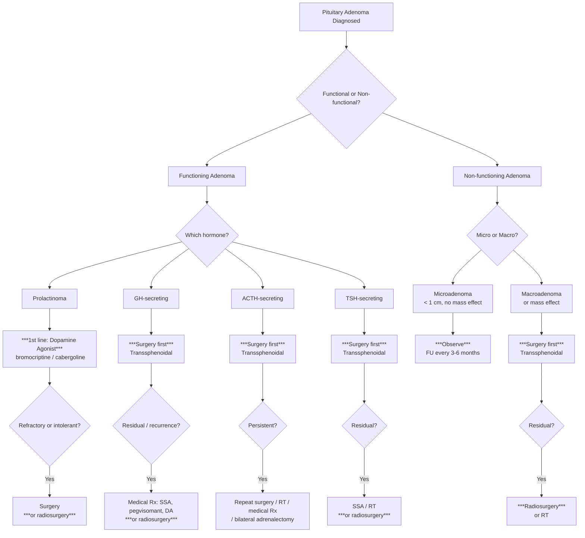
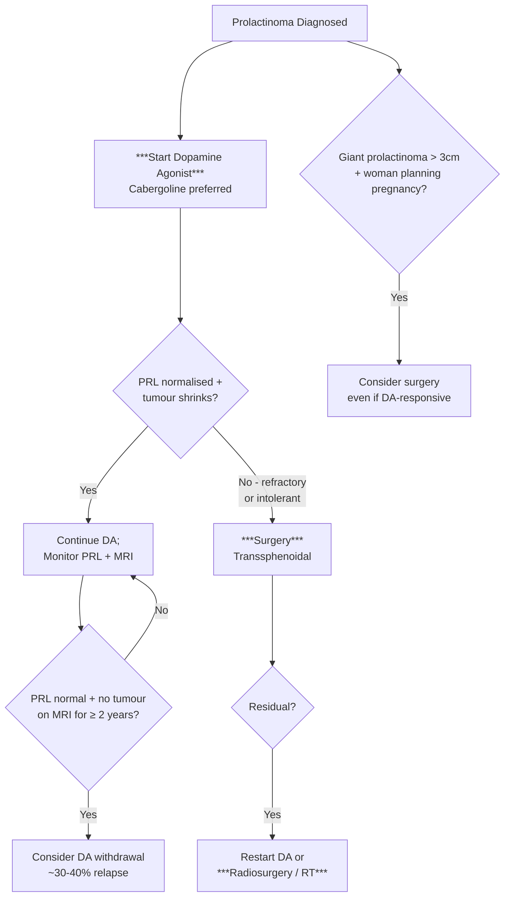
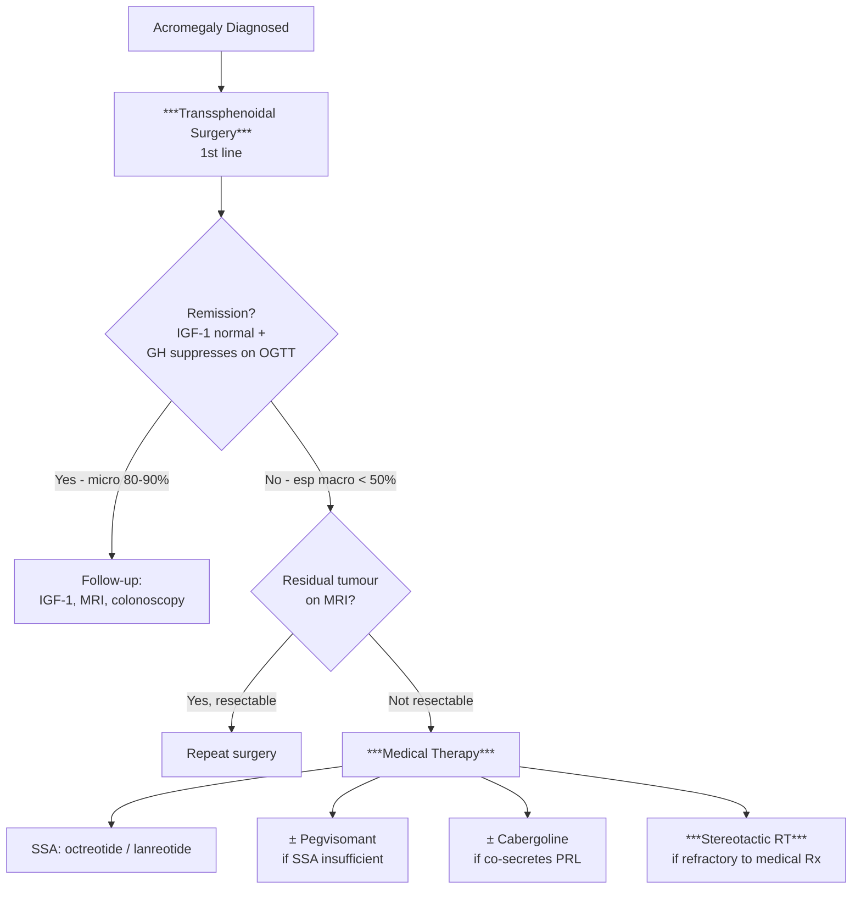
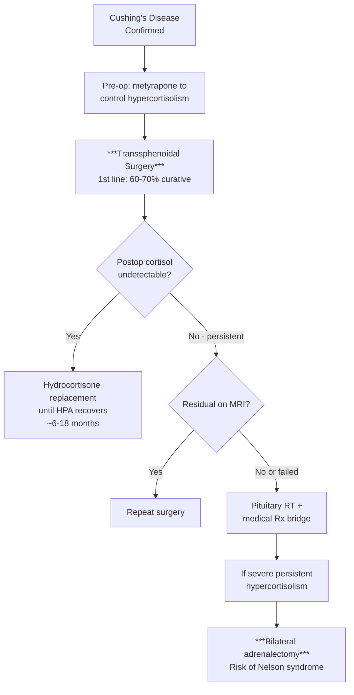

## Management of Pituitary Adenoma

The management of pituitary adenoma is one of the few areas in medicine where the treatment algorithm is **completely dictated by the hormonal subtype**. A prolactinoma and a GH-secreting adenoma of identical size sitting in the same sella are treated by entirely different first-line modalities. Understanding _why_ each subtype is treated differently comes down to understanding the unique pharmacology and biology of each cell lineage.

---

### 1. Overarching Treatment Paradigm

The management decision tree rests on two questions:

1. **Is the tumour functional or non-functional?**
2. **Is there mass effect or is it a small incidental finding?**

**_Treatment Paradigm_** [4]:

[2][3][4][5][10]

<Callout title="The Key Treatment Paradigm from Lecture Slides">

**_Prolactinoma → Dopamine agonist (bromocriptine / cabergoline) = 1st line medical therapy_** [4]

**_GH, ACTH, TSH-secreting adenomas → Surgery first_** [4]

**_Non-functioning microadenoma → Observe_** [2][3]

**_Residual or recurrent disease → Radiosurgery or conventional RT_** [4]

This is the single most important management framework for exam purposes.

</Callout>

---

### 2. Conservative Management (Observation)

#### 2.1 Indications

**_Observation is indicated for non-functional pituitary adenomas < 1 cm without mass effect or hormonal abnormality_** [5][2][3]

**Why can we observe?**

- Many microadenomas are discovered incidentally and remain stable for years or even decades
- The natural history of non-functioning microadenomas is generally benign — only ~10% enlarge over 5 years
- Unnecessary surgery carries risks (hypopituitarism, DI, CSF leak) that outweigh the benefit for a stable, asymptomatic lesion

#### 2.2 Follow-Up Protocol

**_Follow-up every 3–6 months_** [5] initially, then less frequently if stable:

| Timepoint                    | Assessment                                                                                   |
| :--------------------------- | :------------------------------------------------------------------------------------------- |
| **6 months**                 | Repeat MRI pituitary; repeat hormonal panel                                                  |
| **1 year**                   | Repeat MRI; repeat hormonal panel; visual field testing if close to chiasm                   |
| **Annually for 3–5 years**   | If stable, extend interval to every 2–3 years                                                |
| **Indications to intervene** | Tumour growth on serial MRI; new visual field defect; new hormonal deficit; symptoms develop |

---

### 3. Medical Treatment

#### 3.1 Dopamine Agonists — First-Line for Prolactinoma

**Why does medical therapy work for prolactinoma but not for other adenomas?**

This is elegant pharmacology rooted in physiology. Recall that prolactin is the **only** anterior pituitary hormone under **tonic inhibition** by dopamine from the hypothalamus. Lactotroph cells express abundant **dopamine D2 receptors**. When you give a dopamine agonist, it:

1. **Binds D2 receptors on tumour cells** → directly inhibits prolactin synthesis and secretion → PRL falls within days
2. **Induces tumour cell shrinkage** → cytoplasmic involution + perivascular fibrosis → tumour volume decreases over weeks to months (often dramatically — a 3 cm prolactinoma can shrink to nothing)

No other pituitary adenoma subtype has such a clean pharmacological target, which is why dopamine agonists are only first-line for prolactinoma.

| Drug                | Dose                                                      | Efficacy                                                   | Side Effects                                                                                                                                                                                                                                                          | Notes                                                                               |
| :------------------ | :-------------------------------------------------------- | :--------------------------------------------------------- | :-------------------------------------------------------------------------------------------------------------------------------------------------------------------------------------------------------------------------------------------------------------------- | :---------------------------------------------------------------------------------- |
| **_Cabergoline_**   | Start 0.25–0.5 mg once or twice weekly; titrate monthly   | **_70–100% normalise PRL; > 90% tumour shrinkage_** [2][5] | **_Nausea_** (less than bromocriptine), postural hypotension, mental fogginess, **_impulse control disorders_** (hypersexuality, compulsive gambling/shopping — important to warn patients), cardiac valvulopathy at high doses (rare at standard prolactinoma doses) | **_Preferred over bromocriptine_** due to superior efficacy and tolerability [2][5] |
| **_Bromocriptine_** | Start 1.25 mg daily with food; titrate to 2.5–10 mg daily | ~80% normalise PRL                                         | **_Nausea_** (more than cabergoline), **_orthostatic hypotension_**, **_nasal congestion_**, headache, dizziness                                                                                                                                                      | Older agent; still used especially in pregnancy (longer safety record)              |

[2][4][5]

**_Dopamine agonists are 1st line treatment for patients with hyperprolactinaemia of any cause, including lactotroph adenoma of any size_** [5]

**Management milestones for prolactinoma on DA therapy** [2]:

| Phase                  | Action                                                                                                                                                                                                                                                                   |
| :--------------------- | :----------------------------------------------------------------------------------------------------------------------------------------------------------------------------------------------------------------------------------------------------------------------- |
| **Start**              | Begin low-dose cabergoline (0.25–0.5 mg/week); titrate monthly based on PRL level                                                                                                                                                                                        |
| **Monitoring**         | PRL level every 1–3 months; MRI at 3–6 months (assess tumour shrinkage)                                                                                                                                                                                                  |
| **Target**             | Normalise PRL + resolve symptoms + tumour shrinkage                                                                                                                                                                                                                      |
| **Attempt withdrawal** | **_Consider tapering off DA if PRL normalised + no residual adenoma on MRI for ≥ 2 years_** [2]. Approximately 30–40% relapse after withdrawal → restart DA                                                                                                              |
| **Pregnancy**          | **_Stop DA when pregnant_** — no need to suppress PRL during pregnancy (hypogonadism is not an issue); PRL naturally rises in pregnancy. **_Resume if symptoms of tumour growth (headache, visual loss)_**. Bromocriptine has the longest safety record in pregnancy [2] |
| **Refractory**         | If maximum dose DA fails → surgery ± adjuvant RT [2][5][10]                                                                                                                                                                                                              |

<Callout title="Special Scenario: Giant Prolactinoma and Pregnancy" type="error">
***Women with giant lactotroph adenoma > 3 cm who wish to become pregnant should be considered for surgery even if responding to DA*** [5]. Why? Because DA will be discontinued during pregnancy, and a 3+ cm tumour may grow rapidly without the dopamine "brake," potentially causing acute chiasmal compression before delivery.
</Callout>

#### 3.2 Medical Therapy for Acromegaly (Second-Line, After Surgery)

Medical therapy for acromegaly is used when surgery is **not curative** (residual tumour), when surgery is **contraindicated**, or while **awaiting the effect of radiotherapy** [2]:

| Drug Class                          | Example                                                                                          | Mechanism                                                                                                                                                    | Efficacy                                                                   | Side Effects                                                                                                                                      |
| :---------------------------------- | :----------------------------------------------------------------------------------------------- | :----------------------------------------------------------------------------------------------------------------------------------------------------------- | :------------------------------------------------------------------------- | :------------------------------------------------------------------------------------------------------------------------------------------------ |
| **_Somatostatin analogues (SSAs)_** | **_Octreotide LAR_** (long-acting repeatable, IM monthly); **_Lanreotide_** Autogel (SC monthly) | Bind somatostatin receptors (SST2 > SST5) on somatotroph adenoma cells → inhibit GH secretion + mild anti-proliferative effect → tumour shrinkage in ~30–50% | Normalise IGF-1 in ~55–65%; GH < 2.5 ng/mL in ~50–60%                      | Gallstones (SSA inhibit gallbladder contraction), GI upset (diarrhoea, steatorrhoea), hyperglycaemia (suppress insulin), injection site reactions |
| **_GH receptor antagonist_**        | **_Pegvisomant_** (daily SC injection)                                                           | Modified GH molecule that binds GH receptors but blocks signal transduction → blocks GH action at the peripheral level; does NOT reduce tumour size          | Normalises IGF-1 in ~90–95% (most effective agent for biochemical control) | LFT abnormalities (hepatotoxicity — monitor LFTs); does not shrink tumour; very expensive; injection site lipohypertrophy                         |
| **_Dopamine agonist_**              | **_Cabergoline_**                                                                                | Works in adenomas that co-secrete PRL (~30% of GH-secreting adenomas share PIT-1 lineage); binds D2 receptors                                                | Normalises IGF-1 in ~30–40% (mild GH elevation only)                       | As above for DA                                                                                                                                   |

[2][3]

> **Why is surgery first-line for acromegaly, not SSAs?** Because SSAs only normalise IGF-1 in ~60% and rarely cure the disease. **_Transsphenoidal surgery has an 80–90% cure rate for microadenomas and can debulk large macroadenomas to improve subsequent medical efficacy_** [3]. The surgical "first strike" maximises the chance of biochemical remission.

#### 3.3 Medical Therapy for Cushing's Disease (Peri-Operative or Refractory)

Medical therapy here is **not curative** — it is used to:

- **_Control hypercortisolism pre-operatively_** (to reduce surgical risk) [2]
- Manage patients **contraindicated for surgery** or with **persistent disease after surgery**
- **Bridge** until radiotherapy takes effect (6–12 months delay)

| Drug Class                               | Example                                                      | Mechanism                                                                                                                                            | Notes                                                                                                                                        |
| :--------------------------------------- | :----------------------------------------------------------- | :--------------------------------------------------------------------------------------------------------------------------------------------------- | :------------------------------------------------------------------------------------------------------------------------------------------- |
| **_Adrenal steroidogenesis inhibitors_** | **_Metyrapone_** (first-line)                                | Inhibits CYP11B1 (11β-hydroxylase) → blocks the final step of cortisol synthesis; short-acting, effective within 2 hours; requires BD/TDS dosing [2] | Side effects: hirsutism (shunts precursors to androgens), hypertension (↑11-deoxycorticosterone has mineralocorticoid activity), GI upset    |
|                                          | **Ketoconazole**                                             | Azole antifungal that also inhibits multiple adrenal steroidogenic enzymes (CYP11A1, CYP17) → ↓cortisol + ↓androgen                                  | **_Hepatotoxicity_** (requires LFT monitoring; withdrawn in some countries as antifungal); gynaecomastia, ↓libido (anti-androgen effect) [2] |
|                                          | **Osilodrostat** (newer)                                     | CYP11B1 + CYP11B2 inhibitor; potent, oral, once daily                                                                                                | QTc prolongation; adrenal insufficiency if overdosed                                                                                         |
| **Adrenolytic agent**                    | **Mitotane**                                                 | Cytotoxic to adrenal cortex ("medical adrenalectomy"); used mainly for adrenal carcinoma, occasionally severe Cushing's                              | Slow onset; GI side effects; teratogenic                                                                                                     |
| **_Pituitary-acting agents_**            | **_Pasireotide_** (somatostatin analogue with SST5 affinity) | Corticotroph adenoma cells express SST5; pasireotide binds SST5 → ↓ACTH secretion                                                                    | Hyperglycaemia (significant — may need insulin); GI side effects                                                                             |
|                                          | **_Cabergoline_** (dopamine agonist)                         | Some corticotroph adenomas express D2 receptors                                                                                                      | Normalises UFC in ~25–40% of mild cases; less effective than steroidogenesis inhibitors [2]                                                  |
| **Glucocorticoid receptor antagonist**   | **Mifepristone**                                             | Blocks cortisol at the receptor level → useful for metabolic complications (hyperglycaemia)                                                          | Does not lower cortisol levels (cannot monitor UFC); risk of adrenal insufficiency; anti-progestational (abortifacient)                      |

**_Two strategies_** for medical cortisol control [2]:

- **_Block-and-replace:_** Total suppression of cortisol with inhibitors + add back physiological hydrocortisone replacement. Used when cortisol production is highly variable
- **_Normalisation:_** Titrate inhibitor dose to normalise UFC without replacement. Used when cortisol production is relatively stable

#### 3.4 Medical Therapy for TSH-Secreting Adenoma (Second-Line)

- **_Somatostatin analogues_** (octreotide, lanreotide): used as adjunctive therapy post-surgery or pre-operatively; can normalise TSH and fT4 in ~80% and shrink tumour in ~40%

---

### 4. Surgical Treatment

**_Surgery is first-line for all functioning pituitary adenomas except prolactinoma, and for all macroadenomas with mass effect_** [2][3][4][10]

#### 4.1 Surgical Indications

| Adenoma Type                       | Indication for Surgery                                                                                                                                                 |
| :--------------------------------- | :--------------------------------------------------------------------------------------------------------------------------------------------------------------------- |
| **_GH-secreting adenoma_**         | **_First-line treatment_** — surgery offers the best chance of biochemical cure [2][3][4]                                                                              |
| **_ACTH-secreting adenoma_**       | **_First-line treatment_** — transsphenoidal surgery curative in 60–70% [2][4]                                                                                         |
| **_TSH-secreting adenoma_**        | **_First-line treatment_** [4]                                                                                                                                         |
| **_Prolactinoma_**                 | **_Second-line_** — only if refractory or intolerant to dopamine agonist; or giant prolactinoma in woman planning pregnancy [2][5][10]                                 |
| **_Non-functioning macroadenoma_** | **_Symptomatic/large non-functioning adenoma_** with visual field defects, progressive growth, or hypopituitarism [2][3][10]                                           |
| **_Pituitary apoplexy_**           | **_Urgent surgical decompression_** under steroid cover if: signs of raised ICP, change in conscious state, evidence of compression on neighbouring structures [2][10] |

[2][3][4][5][10]

#### 4.2 Surgical Approaches

| Approach                                | Route                                                                                              | Indication                                                                                                               | Rationale                                                                                                                                                                                           |
| :-------------------------------------- | :------------------------------------------------------------------------------------------------- | :----------------------------------------------------------------------------------------------------------------------- | :-------------------------------------------------------------------------------------------------------------------------------------------------------------------------------------------------- |
| **_Transsphenoidal (route of choice)_** | Through the nose (transnasal) or upper lip (sublabial) → sphenoid sinus → sellar floor → pituitary | **_Most pituitary adenomas_** — both micro- and macroadenomas                                                            | The sphenoid sinus sits directly below the sella. This approach avoids brain retraction entirely; recovery is faster; complications are lower. Two techniques: **_microscopic or endoscopic_** [10] |
| **_Transfrontal (transcranial)_**       | Craniotomy → frontal lobe retraction → access from above                                           | **_Very large suprasellar extension_** or **_severe chiasmal compression_** that cannot be safely reached from below [2] | Needed when the tumour is too large or too lateral (encasing ICA) for a transsphenoidal approach                                                                                                    |

[2][5][10]

**Why is endoscopic transsphenoidal surgery now preferred over microscopic?**

- The endoscope provides a **wide-angle, panoramic view** of the surgical field
- Allows better visualisation of the **lateral recesses** (cavernous sinus margins), **suprasellar extension**, and **diaphragma sellae** descent
- Enables more complete tumour removal with lower rates of residual disease in experienced hands
- Both approaches have similar complication rates; the choice often depends on surgeon preference and expertise

#### 4.3 Surgical Outcomes

| Adenoma Type         | Cure Rate (Micro-)                                       | Cure Rate (Macro-)                              | Notes                                                                                                                                                          |
| :------------------- | :------------------------------------------------------- | :---------------------------------------------- | :------------------------------------------------------------------------------------------------------------------------------------------------------------- |
| **_GH-secreting_**   | **_80–90%_**                                             | **_< 50%_** [3]                                 | Can repeat surgery if MRI detects residual tumour                                                                                                              |
| **_ACTH-secreting_** | **_60–70%_** curative (postop cortisol undetectable) [2] | Lower (macroadenomas rare in Cushing's disease) | Microadenomectomy if feasible; otherwise subtotal anterior hypophysectomy if no fertility wish [2]                                                             |
| **Prolactinoma**     | ~80% (when surgery is chosen)                            | ~30–40%                                         | Rarely first-line; high recurrence rates compared to continued DA                                                                                              |
| **Non-functioning**  | Debulking → decompression                                | Complete resection rates 50–70%                 | **_NOT all adenoma tissue can be excised, particularly macroadenomas_** [5]; surgery tends to be conservative to minimise damage to surrounding structures [5] |

**_Advantages of surgery_** [2]:

- **_Rapid reduction in hormone secretion and tumour size_** → biochemical remission achievable in days to weeks
- **_Remission > 85% for microadenomas_**; 40–50% for macroadenomas

**_Disadvantages of surgery_** [2]:

- **_Residual disease or recurrence_**, especially with macroadenomas (2–8% recurrence rate)
- **_Hypopituitarism_** — risk of new hormone deficiencies
- **_Diabetes insipidus_** — from surgical injury to the stalk or posterior pituitary (may be transient or permanent)

#### 4.4 Complications of Transsphenoidal Surgery

**_This is explicitly listed as essential knowledge in the lecture slides_** [4]:

| Complication                    | Mechanism                                                                                                                  | Frequency                            | Management                                                                                                                                                           |
| :------------------------------ | :------------------------------------------------------------------------------------------------------------------------- | :----------------------------------- | :------------------------------------------------------------------------------------------------------------------------------------------------------------------- |
| **_Diabetes insipidus_**        | Injury to posterior pituitary or infundibular stalk → loss of ADH → inability to concentrate urine → polyuria + polydipsia | 10–20% transient; 1–5% permanent     | Desmopressin (DDAVP); monitor urine output and serum Na closely post-op                                                                                              |
| **_Hypopituitarism_**           | Removal or compression of normal pituitary tissue during surgery                                                           | Variable; higher with larger tumours | Lifelong hormonal replacement as needed (hydrocortisone, levothyroxine, sex steroids, GH)                                                                            |
| **_CSF leakage (rhinorrhoea)_** | Defect in the sellar floor or diaphragma sellae → CSF drains through nose                                                  | **_0.5–4%_** [5]                     | Lumbar subarachnoid CSF drainage first; if unsuccessful → re-operation to repack the adenoma bed; **_failure to stop CSF leakage increases risk of meningitis_** [5] |
| **_Meningitis_**                | Secondary to CSF leak; direct contamination from nasal flora                                                               | ~1–2%                                | Prophylactic antibiotics peri-operatively; urgent treatment with IV antibiotics if develops                                                                          |
| **_Vision loss_**               | Intra-operative damage to optic nerves or chiasm                                                                           | Rare (< 1%)                          | Intra-operative visual monitoring; careful surgical technique                                                                                                        |
| **_Vascular injury and CVA_**   | Injury to internal carotid artery (runs in the cavernous sinus just lateral to the sella)                                  | Very rare but catastrophic           | Pre-operative CTA/MRA to map vascular anatomy; meticulous lateral dissection                                                                                         |
| **_Intracranial haemorrhage_**  | Bleeding from tumour bed or vascular injury                                                                                | Rare                                 | Immediate surgical evacuation if significant                                                                                                                         |
| **_ENT symptoms_**              | Nasal crusting, septal perforation, sinusitis, anosmia                                                                     | Common but usually minor             | Nasal care; saline irrigation                                                                                                                                        |
| **_Mortality_**                 | All causes combined                                                                                                        | **_Very rare ( < 0.5%)_** [10]       |                                                                                                                                                                      |

[5][10]

<Callout title="Post-Operative DI — The Triphasic Response" type="idea">
After transsphenoidal surgery, DI can follow a classic **triphasic pattern**:
1. **Phase 1 (Days 1–3):** DI due to axonal shock → polyuria, dilute urine, rising serum Na
2. **Phase 2 (Days 4–8):** Release of stored ADH from damaged axon terminals → transient SIADH → hyponatraemia
3. **Phase 3 (Day 9+):** Permanent DI if axons are destroyed; or recovery if axonal function resumes

Not all patients go through all three phases. Monitor urine output, urine specific gravity, serum Na, and serum/urine osmolality closely in the first 7–14 days post-op.

</Callout>

#### 4.5 Post-Operative Follow-Up [2]

| Timepoint                        | Assessment                                                                                             |
| :------------------------------- | :----------------------------------------------------------------------------------------------------- |
| **Immediate post-op** (Days 1–7) | Urine output + fluid balance (DI screening); serum Na Q6–12h; serum cortisol (if adrenal axis at risk) |
| **4–6 weeks**                    | **_Full pituitary hormone panel_** → assess for new hypopituitarism [2]; visual fields if macroadenoma |
| **3 months**                     | Hormonal reassessment; repeat MRI (baseline post-op scan)                                              |
| **6–12 months**                  | MRI pituitary; hormonal panel                                                                          |
| **_1y, 2y, 5y, 10y_**            | **_Post-op MRI for any recurrence_** [2]                                                               |

#### 4.6 Peri-Operative Management — Specific Considerations

##### Cushing's Disease Peri-Op [2][11]:

- **_Pre-operative:_** Control and correct HTN, DM, hypokalaemia; metyrapone to lower cortisol
- **_Peri-operative:_** **_Steroid cover_** (the contralateral normal corticotrophs are suppressed by chronic hypercortisolism → acute adrenal insufficiency after tumour removal); **_prophylactic antibiotics_** (Cushing's patients are immunosuppressed); **_DVT prophylaxis_** (hypercoagulable state)
- **_Post-operative:_** Glucocorticoid replacement (15–25 mg/d hydrocortisone); taper gradually; HPA axis may take **6–18 months to recover** (some patients need lifelong replacement) [2][11]

##### Acromegaly Peri-Op:

- Pre-operative SSA may be given to improve anaesthetic safety (reduce soft tissue swelling, improve cardiac function)
- Post-op: assess GH/IGF-1 at 3 months for remission

---

### 5. Radiotherapy

**_Radiotherapy is usually used as adjunct to surgery_** [2][3], not as primary treatment (with the exception of certain macroprolactinomas and patients who are not surgical candidates).

#### 5.1 Modalities

| Modality                              | Technique                                                                                             | Advantages                                                                                                     | Disadvantages                                                                                                                                                                                                         |
| :------------------------------------ | :---------------------------------------------------------------------------------------------------- | :------------------------------------------------------------------------------------------------------------- | :-------------------------------------------------------------------------------------------------------------------------------------------------------------------------------------------------------------------- |
| **Conventional fractionated EBRT**    | 45–50.4 Gy in 25–28 fractions over 5–6 weeks                                                          | Effective; proven long-term tumour control                                                                     | **_Delayed effect on hormone secretion_** (months to years) [2]; **_higher incidence of hypopituitarism_** (50–100% at 10–20 years) [2]; risk of damage to optic apparatus; rare second malignancy; cognitive effects |
| **_Stereotactic radiosurgery (SRS)_** | **_Gamma Knife or CyberKnife / LINAC-based_**; single high-dose fraction precisely targeted at tumour | More precise; shorter treatment; less collateral damage to surrounding brain                                   | **_NOT used if tumour is < 5 mm from the optic chiasm_** [2] — the single high dose would damage the chiasm; not suitable for very large tumours with suprasellar extension                                           |
| **Fractionated stereotactic RT**      | Multiple fractions delivered with stereotactic precision                                              | Can treat tumours close to the optic chiasm (fractionation allows optic apparatus to repair between fractions) | Intermediate between EBRT and SRS                                                                                                                                                                                     |

**_or radiosurgery_** [4] — the lecture slides specifically mention radiosurgery as an alternative for residual/recurrent disease.

#### 5.2 Indications [2]

- **_Adjunct to surgery for residual tumour_** (most common use)
- **_Primary therapy_** for patients who are **not surgical candidates** (elderly, comorbid)
- **Macroprolactinoma** refractory to dopamine agonist and surgery
- **Recurrent** adenoma after prior surgery
- **Cushing's disease:** pituitary irradiation + medical therapy if residual non-resectable disease [2]

#### 5.3 Key Contraindication

**_Stereotactic radiosurgery is NOT used if the tumour is < 5 mm from the optic chiasm_** [2] — the optic apparatus has limited radiation tolerance (~8–10 Gy single dose), and a single high-dose radiosurgery fraction would risk optic neuropathy and blindness.

#### 5.4 Disadvantages of Radiotherapy [2]

- **_Delayed effect on secretion_** — not useful for acute symptom control; maximum effect 6–12 months for hormone normalisation
- **_Higher incidence of hypopituitarism_** — progressive loss of pituitary function over years (GH first, then other axes); patients need lifelong endocrine follow-up
- **_Risk of damage to surrounding structures_** — optic nerve, temporal lobes (cognitive decline), cranial nerves
- **Secondary malignancy** — very rare but reported (meningioma, glioma in the irradiated field, years later)
- **Cerebrovascular disease** — increased stroke risk years after cranial RT

---

### 6. Management by Specific Adenoma Type — Detailed Algorithm

#### 6.1 Prolactinoma

[2][4][5]

#### 6.2 Acromegaly

**_Transsphenoidal surgery is 1st line: 80–90% curative for micro-, < 50% for macroadenoma. Can repeat surgery if MRI detects residual tumour_** [3]

#### 6.3 Cushing's Disease

**_Risk of Nelson syndrome_** (8–25% in adults, > 50% in children) **_following bilateral adrenalectomy_** [2]: the removal of cortisol negative feedback causes the residual corticotroph adenoma to grow aggressively and secrete very high ACTH → skin hyperpigmentation + expanding sellar mass. This is why bilateral adrenalectomy is a last resort and patients need long-term MRI surveillance.

[2][11]

#### 6.4 Non-Functioning Adenoma

| Scenario                                                                                      | Management                                                                         |
| :-------------------------------------------------------------------------------------------- | :--------------------------------------------------------------------------------- |
| **_Microadenoma, asymptomatic, incidental_**                                                  | **_Observe with serial MRI and hormonal panel_** [2][3][5]                         |
| **Macroadenoma with mass effect** (visual field defects, progressive growth, hypopituitarism) | **_Transsphenoidal surgery_** → maximal safe debulking → post-op MRI at 3–6 months |
| **Residual tumour post-surgery**                                                              | **_Radiosurgery or fractionated RT_** if growing on serial imaging [4]             |
| **Growing on surveillance** (previously observed)                                             | Surgery                                                                            |

---

### 7. Hormone Replacement for Hypopituitarism

Whether caused by the tumour itself or by its treatment (surgery, RT), hypopituitarism requires systematic replacement:

| Deficient Axis            | Replacement                                    | Dose                                                         | Key Points                                                                                                                                                                                                                                                           |
| :------------------------ | :--------------------------------------------- | :----------------------------------------------------------- | :------------------------------------------------------------------------------------------------------------------------------------------------------------------------------------------------------------------------------------------------------------------- |
| **ACTH-cortisol**         | **_Hydrocortisone_**                           | 15–25 mg/d in divided doses (10 mg AM + 5 mg PM)             | **_Most critical_** — must be replaced FIRST before thyroxine (giving T4 without cortisol can precipitate adrenal crisis by increasing cortisol metabolism). Patient needs a **_steroid emergency card_**; must double/triple dose during illness ("sick day rules") |
| **TSH-T4**                | **_Levothyroxine_**                            | 1.0–1.6 μg/kg/d                                              | Monitor with **fT4** (NOT TSH — in central hypothyroidism, TSH is unreliable). Start only AFTER cortisol replacement                                                                                                                                                 |
| **FSH/LH → Sex steroids** | Testosterone (M); Oestrogen ± progesterone (F) | Testosterone: IM, transdermal, or PO; HRT: standard regimens | Restores libido, bone density, muscle mass, secondary sexual characteristics. If fertility desired: gonadotropin injections (FSH + LH/hCG) instead of sex steroids                                                                                                   |
| **GH**                    | **_Recombinant human GH_**                     | Titrated to normalise IGF-1                                  | Improves body composition, QoL, bone density. Contraindicated if active malignancy. Expensive. Not always available                                                                                                                                                  |
| **ADH** (if DI)           | **_Desmopressin (DDAVP)_**                     | Intranasal, oral, or SC; titrated to urine output            | Monitor serum Na to avoid hyponatraemia from over-replacement                                                                                                                                                                                                        |

<Callout title="The Order of Replacement Matters!" type="error">
  Always replace ***cortisol BEFORE thyroxine***. Thyroxine increases cortisol
  metabolism by inducing hepatic enzymes. If you start thyroxine in a
  cortisol-deficient patient, you accelerate cortisol clearance → precipitate an
  acute adrenal crisis. This is a classic exam pitfall.
</Callout>

---

### 8. Special Situation: Pituitary Apoplexy Management

**_Pituitary apoplexy is a neurosurgical emergency_** [2][4][10]:

| Step                | Action                                                                                                                                                                                 | Rationale                                                                        |
| :------------------ | :------------------------------------------------------------------------------------------------------------------------------------------------------------------------------------- | :------------------------------------------------------------------------------- |
| **1. Immediate**    | **_IV hydrocortisone 100 mg stat, then 50 mg Q6–8H_**                                                                                                                                  | Presumed acute ACTH/cortisol deficiency — life-threatening if untreated          |
| **2. Assess**       | Neurological exam: GCS, visual fields, visual acuity, pupillary responses, CN exam                                                                                                     | Determine severity of compression                                                |
| **3. Image**        | CT head (acute blood = hyperdense) → MRI pituitary if stable                                                                                                                           | Confirm diagnosis                                                                |
| **4. Decide**       | **_Urgent surgical decompression if:_** **_signs of raised ICP; change in conscious state; evidence of compression on neighbouring structures_** [2][10]                               | Surgery decompresses the chiasm and cavernous sinus; removes haemorrhagic debris |
| **5. Conservative** | If haemodynamically stable, no visual deterioration, mild symptoms → **conservative management** with steroids + close monitoring (some centres manage stable apoplexy conservatively) | Not all apoplexy requires surgery; ~50% improve with steroids alone              |
| **6. Post-acute**   | Full pituitary function testing at 4–6 weeks; visual field assessment; plan for definitive management of residual adenoma                                                              | Many patients develop permanent hypopituitarism; some recover function           |

---

### 9. Long-Term Follow-Up Principles

All patients with treated pituitary adenomas require **lifelong follow-up** because:

- Recurrence can occur years later (especially with macroadenomas)
- Hypopituitarism can develop late (especially after RT)
- Hormone replacement needs monitoring and adjustment

| Component                  | Frequency                                                                                      | Purpose                                               |
| :------------------------- | :--------------------------------------------------------------------------------------------- | :---------------------------------------------------- |
| **MRI pituitary**          | **_1y, 2y, 5y, 10y post-surgery_** [2]; then every 3–5y if stable                              | Detect recurrence                                     |
| **Hormonal panel**         | 6-monthly for first 2 years; then annually                                                     | Detect new deficiencies; monitor replacement adequacy |
| **Visual fields**          | Pre-op, post-op (3 months), then annually if macroadenoma                                      | Monitor chiasmal function                             |
| **Complication screening** | Acromegaly: colonoscopy, cardiac assessment, glucose; Cushing's: metabolic panel, bone density | Systemic complications of hormone excess              |

---

<Callout title="High Yield Summary — Management of Pituitary Adenoma">

1. **_Prolactinoma = dopamine agonist FIRST (cabergoline preferred over bromocriptine)_** — normalises PRL and shrinks tumour in > 90%; surgery only if DA-refractory or intolerant [4][5]
2. **_GH, ACTH, TSH-secreting adenomas = surgery FIRST (transsphenoidal)_** [4]
3. **_Non-functioning microadenoma = observe (FU every 3–6 months)_** [5]
4. **_Non-functioning macroadenoma with mass effect = surgery_** [2]
5. **_Radiotherapy / radiosurgery = adjunct for residual or recurrent disease_** [4]; NOT used if tumour < 5 mm from optic chiasm [2]
6. **Acromegaly surgery:** 80–90% cure for micro, < 50% for macro → SSA, pegvisomant, or DA if incomplete [3]
7. **Cushing's disease surgery:** 60–70% curative → repeat surgery, RT, medical Rx, or bilateral adrenalectomy if persistent (risk of Nelson syndrome) [2]
8. **_Complications of transsphenoidal surgery:_** DI, hypopituitarism, CSF leak + meningitis, vision loss, vascular injury, intracranial haemorrhage, ENT symptoms [4][10]
9. **_Replace cortisol BEFORE thyroxine_** in hypopituitarism
10. **_Pituitary apoplexy = IV hydrocortisone FIRST → urgent surgery if compressive signs_** [2][10]

</Callout>

---

<ActiveRecallQuiz
  title="Active Recall - Management of Pituitary Adenoma"
  items={[
    {
      question:
        "Why is dopamine agonist first-line for prolactinoma but not for GH-secreting or ACTH-secreting adenomas? Explain the pharmacological basis.",
      markscheme:
        "Prolactin is the only anterior pituitary hormone under tonic inhibition by dopamine. Lactotroph cells (both normal and adenomatous) express abundant D2 dopamine receptors. Dopamine agonists directly bind these D2 receptors, suppressing PRL synthesis and secretion and causing tumour cell shrinkage (cytoplasmic involution and perivascular fibrosis). GH-secreting (somatotroph) and ACTH-secreting (corticotroph) adenomas do not express sufficient D2 receptors to make dopamine agonists effective as first-line. Somatotroph adenomas are targeted by somatostatin analogues and surgery; corticotroph adenomas are best treated by surgery.",
    },
    {
      question:
        "List the complications of transsphenoidal surgery for pituitary adenoma. Which complication carries a risk of meningitis if not managed?",
      markscheme:
        "Complications: (1) Diabetes insipidus (transient or permanent), (2) Hypopituitarism (new hormone deficiencies), (3) CSF leakage/rhinorrhoea (0.5-4%), (4) Meningitis, (5) Vision loss, (6) Vascular injury and CVA (ICA injury), (7) Intracranial haemorrhage, (8) ENT symptoms (nasal crusting, septal perforation), (9) Mortality (very rare). CSF leakage carries the risk of meningitis if the leak is not sealed — managed first with lumbar subarachnoid drainage; if unsuccessful, re-operation to repack the adenoma bed.",
    },
    {
      question:
        "A patient with Cushing's disease undergoes transsphenoidal surgery but has persistent elevated cortisol post-operatively. Outline the stepwise management. What is Nelson syndrome and when does it occur?",
      markscheme:
        "Stepwise management of persistent Cushing's disease: (1) If residual tumour on MRI, consider repeat surgery. (2) If non-resectable residual, pituitary irradiation plus medical therapy (metyrapone or ketoconazole) as bridge until RT takes effect (6-12 months). (3) If mild hypercortisolism, pituitary-acting agents (pasireotide, cabergoline) may suffice. (4) If severe persistent hypercortisolism or desire for pregnancy, bilateral adrenalectomy. Nelson syndrome: an enlarging corticotroph adenoma that occurs after bilateral adrenalectomy (8-25% adults, more than 50% children). Removal of cortisol negative feedback allows the residual corticotroph tumour to grow aggressively, producing very high ACTH causing intense skin hyperpigmentation and an expanding sellar mass.",
    },
    {
      question:
        "Why must you replace hydrocortisone BEFORE starting levothyroxine in a patient with panhypopituitarism?",
      markscheme:
        "Levothyroxine increases cortisol metabolism by inducing hepatic enzymes (particularly CYP3A4 and other enzymes involved in cortisol clearance). In a cortisol-deficient patient, starting thyroxine accelerates cortisol clearance from an already depleted reserve, precipitating an acute adrenal crisis which can be fatal. Always ensure adequate cortisol replacement (hydrocortisone 15-25 mg/day) before initiating levothyroxine.",
    },
    {
      question:
        "A 28-year-old woman with a 3.5 cm prolactinoma on cabergoline wishes to become pregnant. What special management consideration applies, and why?",
      markscheme:
        "Women with giant prolactinoma greater than 3 cm who wish to become pregnant should be considered for debulking surgery before conception, even if responding to dopamine agonist. Rationale: DA is discontinued during pregnancy (no need to control PRL since hypogonadism is not an issue in pregnancy). Without the DA brake, a large prolactinoma may grow significantly during pregnancy (stimulated by oestrogen and loss of dopamine suppression), causing visual compromise before delivery. Pre-pregnancy surgical debulking reduces this risk. Bromocriptine has the longest pregnancy safety record if DA needs to continue.",
    },
    {
      question:
        "State the indications and one key contraindication for stereotactic radiosurgery in pituitary adenoma management.",
      markscheme:
        "Indications: (1) Adjunct to surgery for residual tumour after transsphenoidal resection, (2) Primary therapy if patient is not a surgical candidate, (3) Recurrent adenoma after prior surgery, (4) Refractory prolactinoma after failed DA and surgery. Key contraindication: tumour less than 5 mm from the optic chiasm. The optic apparatus has limited radiation tolerance (approximately 8-10 Gy single dose), and the single high-dose fraction of radiosurgery risks radiation-induced optic neuropathy and blindness. Use fractionated stereotactic RT instead in such cases.",
    },
  ]}
/>

## References

[2] Senior notes: Ryan Ho Endocrine.pdf (Section 5: Pituitary Gland, pp. 104–111; Cushing's management pp. 63–64; Prolactinoma management p. 110)
[3] Senior notes: Ryan Ho Fundamentals.pdf (Section 3.8.4: Pituitary Tumour, pp. 441–444)
[4] Lecture slides: GC 108. A mass in the brain brain tumours.pdf (pp. 41–42, 48)
[5] Senior notes: felixlai.md (Pituitary adenoma — Treatment section)
[9] Senior notes: Ryan Ho Chemical Path.pdf (Section 4: Diagnostic Function Tests, pp. 33–34)
[10] Senior notes: Ryan Ho Neurology.pdf (Pituitary Adenoma management, p. 166; Brain tumour surgery, p. 163)
[11] Senior notes: maxim.md (Cushing syndrome management, pp. 434–435)
