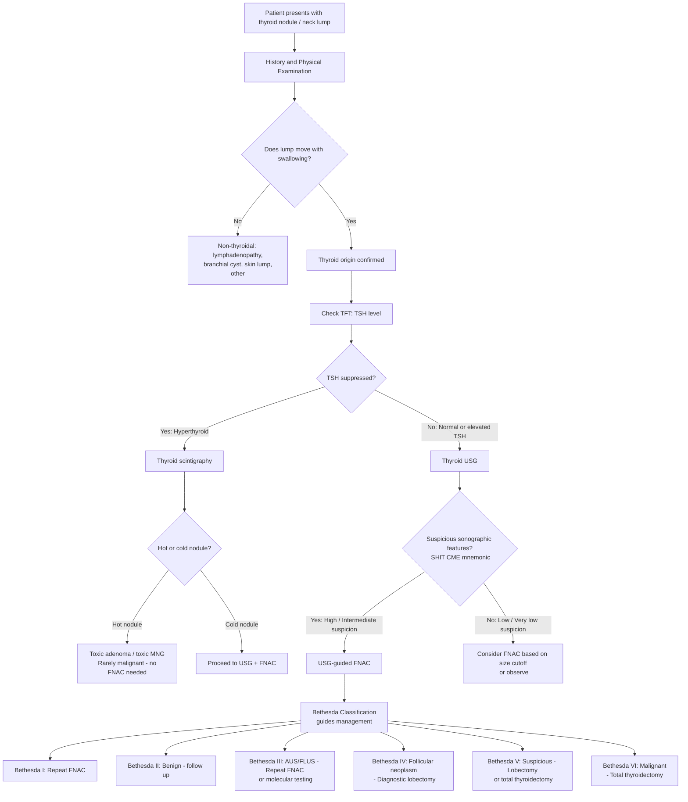

## Differential Diagnosis of Thyroid Cancer

### Framing the Problem

When you encounter a patient with a thyroid nodule, the fundamental clinical question is: **is this malignant or benign?** Only ~10–15% of thyroid nodules are malignant [3][5]. The differential diagnosis therefore spans a wide spectrum — from benign nodular disease (the vast majority) to primary thyroid malignancies and even metastatic disease from distant sites. Your job is to systematically narrow the field using clinical features, biochemistry, ultrasound characteristics, and cytology.

Let's organise this logically. A thyroid nodule presents in one of three functional states — **hyperthyroid, euthyroid, or hypothyroid** — and this immediately helps stratify the differential [3].

---

### 10.1 Differential Diagnosis of a Thyroid Nodule — Organised by Functional Status

| Functional Status | Differential Diagnoses | Key Distinguishing Features |
|---|---|---|
| **Hyperthyroid** (↓TSH) | ***Toxic adenoma*** (hot nodule on scintigraphy), ***Toxic multinodular goitre (MNG)***, Graves' disease with coincidental nodule | Hot nodules are ***rarely malignant*** → scintigraphy is the key investigation when TSH is suppressed. A hot nodule does NOT require FNAC [2][5] |
| **Euthyroid** (normal TSH) — **most common** | **Benign**: colloid nodule/cyst, follicular adenoma, dominant nodule in MNG, Hashimoto's pseudonodule | Most thyroid nodules are euthyroid and benign. USG + FNAC needed to risk-stratify |
| | **Malignant**: papillary CA, follicular CA, medullary CA, anaplastic CA, lymphoma, metastatic disease | Red flag features (see Section 8.3 in prior notes) should raise suspicion |
| **Hypothyroid** (↑TSH) | Hashimoto's thyroiditis (pseudonodule or true nodule within a Hashimoto's gland), iodine deficiency goitre | Hashimoto's is associated with 60× risk of thyroid lymphoma [1] |

[1][2][3][5]

---

### 10.2 Comprehensive Differential Diagnosis — By Category

#### A. Benign Thyroid Nodular Disease

| Condition | Key Features | Why It Mimics Cancer |
|---|---|---|
| ***Colloid nodule / cyst*** | Most common cause of a thyroid nodule. Arises from accumulation of colloid within a hyperplastic follicle. May undergo cystic degeneration or haemorrhage (→ sudden painful enlargement mimicking malignancy) | Sudden size increase can mimic aggressive cancer; but on USG typically spongiform or purely cystic — very low malignancy risk ( < 3%) [2][5] |
| ***Follicular adenoma*** | Benign encapsulated follicular neoplasm. Solitary, well-encapsulated. FNAC shows follicular cells — ***indistinguishable from follicular carcinoma on cytology*** | The critical DDx. FNAC reports "follicular neoplasm" (Bethesda IV) — only surgical excision with histological assessment for capsular/vascular invasion can distinguish adenoma from carcinoma [2][3][5] |
| ***Dominant nodule in MNG*** | One nodule stands out in a background of multiple nodules. MNG results from cycles of hyperplasia and involution driven by TSH fluctuations | A dominant or growing nodule in MNG still requires the same evaluation as a solitary nodule — cancer can coexist within an MNG [3][5] |
| ***Hashimoto's thyroiditis (pseudonodule)*** | Focal lymphocytic infiltration can create a palpable "nodule" within a diffusely inflamed gland. ↑TPO antibodies, hypothyroid. Also predisposes to ***thyroid lymphoma*** (60× risk) [1] | Firm, irregular texture can mimic malignancy. USG shows diffusely heterogeneous parenchyma |
| ***Simple thyroid cyst*** | True simple cysts (rare, < 2% of nodules) are lined by epithelium and contain clear fluid. ***Purely cystic nodules have < 1% malignancy risk and do NOT require FNAC*** [2][5] | Occasional diagnostic dilemma when cysts have a solid component — mixed cystic-solid nodules need further evaluation |

<Callout title="Important Distinction" type="error">
***Follicular adenoma is NOT a risk factor for follicular carcinoma*** [3]. They are biologically distinct. Do NOT assume that a follicular adenoma "transforms" into carcinoma. However, on FNAC they cannot be distinguished — the Bethesda system reports both as "follicular neoplasm" (Category IV), and surgical excision is required for definitive diagnosis.
</Callout>

#### B. Primary Thyroid Malignancies

| Cancer | Key Differentiating Points |
|---|---|
| ***Papillary thyroid carcinoma*** | Most common (80–90%). Young adults 30–50y. Lymphatic spread to Level VI nodes. USG: ***microcalcifications (psammoma bodies)***, hypoechoic, irregular margins. FNAC diagnostic: Orphan Annie nuclei, nuclear pseudoinclusions [1][2] |
| ***Follicular thyroid carcinoma*** | 10–20%. Middle-aged 40–60y. Haematogenous spread (bone, lung). ***FNAC cannot distinguish from follicular adenoma*** — requires histological capsular/vascular invasion [1][2][3] |
| ***Medullary thyroid carcinoma*** | 5–7%. C-cell origin. ***Tumour markers: calcitonin (95%), CEA (80%)*** [1]. 25% familial (MEN2). Check RET mutation in all MTC patients. Amyloid deposits on histology |
| ***Anaplastic carcinoma*** | 3–5%. Elderly 60–70y. ***Rapidly enlarging hard goitre over 2–3 months. Often locally advanced with distant metastasis at presentation. Median survival < 6 months*** [1]. May arise from de-differentiation of previous DTC (30%) |
| ***Thyroid lymphoma*** | ~1–5%. > 50y, F > M. ***Strong association with Hashimoto's thyroiditis (60× risk)*** [1]. Usually diffuse large B-cell lymphoma (DLBCL). Rapidly enlarging goitre with compressive symptoms. ***Requires core biopsy (NOT FNAC) for diagnosis — FNAC is useless for lymphoma*** [6] |
| ***Poorly differentiated (insular) carcinoma*** | ~5%. Intermediate behaviour between DTC and anaplastic. Meets Turin criteria (solid/trabecular/insular growth pattern, necrosis, high mitotic rate) |
| ***Squamous cell carcinoma (SCC) of thyroid*** | Very rare. Usually represents direct extension from adjacent structures (larynx, oesophagus) or metastasis. Must exclude primary elsewhere |

> **Why can't FNAC diagnose lymphoma?** FNAC provides only individual cells (cytology) — it cannot demonstrate the tissue architecture needed for lymphoma classification. Lymphoma diagnosis requires assessment of tissue architecture, immunohistochemistry, and flow cytometry — all of which need a **core biopsy or excisional biopsy** [6].

#### C. Metastatic Disease to the Thyroid

The thyroid can be a site of metastatic disease, though this is relatively uncommon clinically:

| Primary Site | Notes |
|---|---|
| ***Renal cell carcinoma (RCC)*** | ***Most common source of metastasis to the thyroid*** [3]. The thyroid's rich blood supply makes it a target. Can present years after nephrectomy — always ask about RCC history |
| Colorectal carcinoma | Haematogenous spread |
| Lung carcinoma | |
| Breast carcinoma | |
| Melanoma | |

> **Why is RCC the most common metastasis to the thyroid?** RCC is known for its propensity for vascular invasion and haematogenous spread to unusual sites ("clear cell metastases"). The thyroid receives ~2% of cardiac output per unit mass — one of the highest blood flows per gram of any organ — making it a favourable "seed" site per the Paget "seed and soil" hypothesis.

#### D. Non-Thyroidal Anterior Neck Lumps (DDx of a "Thyroid Lump")

Sometimes a neck lump is mistaken for a thyroid nodule. The differential of an **anterior neck lump** includes [1][5]:

| Category | Condition | Key Distinguishing Feature |
|---|---|---|
| **Thyroid** | Goitre, nodule, carcinoma | Moves with swallowing (attached to pretracheal fascia) |
| **Lymphadenopathy** | Reactive, metastatic (NPC, H&N SCC), lymphoma | Does NOT move with swallowing; may be hard/fixed/matted |
| ***Thyroglossal duct cyst*** | Congenital remnant of thyroglossal duct (from foramen cecum to thyroid) | ***Midline, moves upward on tongue protrusion*** (pathognomonic). Usually paediatric. |
| ***Branchial cyst*** | Remnant of branchial apparatus | ***Lateral, anterior to SCM***. Usually paediatric/young adult. Does not move with swallowing |
| **Skin** | Sebaceous/epidermoid cyst, lipoma, dermoid | Superficial, moves with skin, not attached to deeper structures |
| **Other** | Laryngocele, carotid body tumour (chemodectoma), pharyngeal pouch | Specific examination findings (e.g. Fontaine's sign for carotid body tumour — mobile side-to-side but not up-and-down; pulsatile) |

---

### 10.3 Clinical Approach to Differential Diagnosis — Algorithmic Thinking

The clinical approach starts with the **presenting complaint** (usually a thyroid nodule or neck lump) and moves through a logical decision tree. Here is the framework:

---

### 10.4 Key Investigations That Help Distinguish Differentials

This is conceptually part of diagnosis (covered fully in the next section), but understanding *which* investigation helps discriminate *which* differential is essential here:

| Investigation | What It Tells You | Key Differentiating Power |
|---|---|---|
| ***TFT (TSH)*** | ***TSH is the MOST sensitive indicator of thyroid function*** [2]. A suppressed TSH suggests a functioning (hot) nodule — which is almost never cancer | Separates hot nodules (benign) from cold/neutral nodules (need further workup) |
| ***Thyroid USG*** | Characterises nodule architecture, echogenicity, calcifications, margins, vascularity; assesses cervical lymph nodes | ***Sonographic features suspicious of malignancy ("SHIT CME")***: **S**olid, **H**ypoechoic, **I**rregular margins, **T**aller than wide, **C**haotic central vascularity, **M**icrocalcifications, **E**xtrathyroidal extension [3][5] |
| ***FNAC (USG-guided)*** | Cytological assessment — the gold standard for pre-operative diagnosis of thyroid nodules. Reported using ***Bethesda classification*** (6 categories) [2][3][5] | Diagnostic for papillary CA (Orphan Annie nuclei, psammoma bodies), medullary CA (amyloid deposits, calcitonin immunostain); ***CANNOT distinguish follicular adenoma from follicular carcinoma*** [2][3] |
| ***Thyroid scintigraphy*** | Determines functional status: hot (↑uptake) vs cold (↓uptake) vs warm (= surrounding) | ***Hot nodules are rarely cancer and do NOT need FNAC*** [2][5]. ***Cold nodules have 10–20% risk of malignancy*** and require FNAC [2] |
| ***Serum calcitonin*** | Produced by C cells; elevated in MTC | ***Raised calcitonin ( > 100 pg/mL) = high suspicion for MTC***. Important to check in patients with FHx of MTC or MEN2 [1][2] |
| ***Serum thyroglobulin*** | Produced by follicular cells; used as tumour marker for DTC post-operatively | NOT useful pre-operatively for differential diagnosis (elevated in many benign thyroid conditions). Useful only ***after total thyroidectomy*** as a marker of recurrence [2] |
| ***Core biopsy / excisional biopsy*** | Tissue architecture — essential for lymphoma diagnosis | ***Required when lymphoma is suspected*** — FNAC alone is insufficient [6] |

---

### 10.5 Pattern Recognition: "What Causes a Suddenly Enlarging Thyroid Mass?"

This is a common exam scenario. The differential for ***sudden increase in size of a thyroid lump*** [1][5]:

| Cause | Mechanism | Key Clue |
|---|---|---|
| ***Haemorrhage into a cyst or necrotic nodule*** | Intra-nodular bleeding → sudden capsular distension → acute pain and swelling | Sudden onset, pain, tender, pre-existing nodule. USG shows internal haemorrhagic content. Resolves with aspiration |
| ***Anaplastic carcinoma*** | Explosive undifferentiated cell proliferation | Elderly patient, rock-hard, fixed, rapidly enlarging over weeks. Compressive symptoms. Very poor prognosis |
| ***Primary thyroid lymphoma*** | Rapid lymphoid cell proliferation in a background of Hashimoto's thyroiditis | History of Hashimoto's, rapidly enlarging firm mass, compressive symptoms. Needs core biopsy |
| ***Subacute (de Quervain's) thyroiditis*** | Post-viral inflammatory destruction of follicles | Painful, tender, febrile, ↑ESR, preceding URTI. Self-limiting. Fluctuating thyroid status |

---

### 10.6 Differential Diagnosis Summary Table — Malignant vs Benign Thyroid Nodules

| Feature | Favours **Benign** | Favours **Malignant** |
|---|---|---|
| ***Demographics*** | Female, 30–60y | ***Male, age < 14 or > 70*** [1][5] |
| Number | Multiple nodules (MNG) | ***Solitary or dominant*** [1][5] |
| Consistency | Soft, rubbery, compressible | ***Hard, firm, gritty*** |
| Mobility | Freely mobile with swallowing | ***Fixed to surrounding structures*** [1][5] |
| Growth rate | Stable or very slow | ***Progressive growth over wks–months*** [1][5] |
| Pain | Painful (haemorrhagic cyst, thyroiditis) | Usually painless (except anaplastic, lymphoma) |
| Cervical LN | Absent | ***Present, especially Level VI*** [1][5] |
| Voice | Normal | ***Hoarseness (RLN invasion)*** [1][5] |
| TSH | Suppressed (hot nodule) | Normal or elevated |
| USG | Spongiform, purely cystic, comet-tail artefact, hyperechoic | ***Hypoechoic, microcalcifications, taller-than-wide, irregular margins, central vascularity, extrathyroidal extension*** [3][5] |
| Scintigraphy | ***Hot nodule*** | ***Cold nodule*** |
| FNAC | Bethesda II (benign) | Bethesda V–VI |
| History | No radiation, no FHx | ***Radiation exposure, FHx thyroid CA, MEN2*** [1][5] |

---

### 10.7 Specific Notes on the "Indeterminate" FNAC (Bethesda III and IV)

This is a common clinical dilemma and a high-yield exam topic:

- ***Bethesda III (AUS/FLUS — Atypia of Undetermined Significance / Follicular Lesion of Undetermined Significance)***: Cancer risk ~10–30%. Management: ***repeat FNAC***, or increasingly **molecular testing** (e.g. ThyroSeq v3 genomic classifier, Afirma gene expression classifier) to help "rule in" or "rule out" malignancy and avoid unnecessary surgery [2][5].
- ***Bethesda IV (Follicular Neoplasm / Suspicious for Follicular Neoplasm)***: Cancer risk ~25–40%. ***FNAC cannot distinguish follicular adenoma from follicular carcinoma*** because the distinction rests on capsular/vascular invasion (architectural, not cytological). Management: ***diagnostic hemithyroidectomy (lobectomy)*** [2][3][5].

> **Why does Bethesda IV exist as a separate category?** Because the cytological features of follicular adenoma and follicular carcinoma are identical — both show microfollicular architecture with scant colloid. Only by examining the intact capsule histologically can you determine if the tumour has invaded through it. This is a fundamental limitation of needle aspiration cytology.

<Callout title="Molecular Testing — The Modern Approach" type="idea">
In the 2020s, molecular testing (e.g. ThyroSeq v3, Afirma GSC) is increasingly used for Bethesda III–IV nodules to reduce the rate of diagnostic surgery. A benign molecular result has a high negative predictive value ( > 95%), allowing observation instead of lobectomy. This is not yet standard practice in all Hong Kong centres but is increasingly adopted in tertiary settings.
</Callout>

---

<Callout title="High Yield Summary">

**DDx framework**: Organise by functional status (hyperthyroid → think hot nodule/toxic adenoma; euthyroid → most common, benign vs malignant; hypothyroid → Hashimoto's ± lymphoma risk).

**Most thyroid nodules are benign** (~85–90%): colloid cyst, follicular adenoma, MNG, Hashimoto's pseudonodule.

**Primary thyroid malignancies**: Papillary (most common, lymphatic spread, psammoma bodies), Follicular (haematogenous, FNAC cannot diagnose), Medullary (C-cells, calcitonin, MEN2), Anaplastic (rapidly lethal, de-differentiated), Lymphoma (Hashimoto's background, needs core biopsy).

**Metastatic to thyroid**: RCC is the most common primary.

**Red flags for malignancy**: Male, age extremes, solitary hard fixed nodule, hoarseness, Level VI LN, radiation history, FHx, cold on scintigraphy, SHIT CME on USG.

**Critical DDx pitfall**: Follicular adenoma vs carcinoma — indistinguishable on FNAC; requires surgical excision for histological capsular/vascular invasion.

**Rapidly enlarging thyroid**: DDx = haemorrhagic cyst, anaplastic CA, thyroid lymphoma, subacute thyroiditis.

**Hot nodule on scintigraphy**: Rarely malignant → does NOT need FNAC.

</Callout>

---

<ActiveRecallQuiz
  title="Active Recall - Differential Diagnosis of Thyroid Cancer"
  items={[
    {
      question: "A patient with a thyroid nodule has a suppressed TSH. What is the next investigation and why? If the nodule is 'hot' on scintigraphy, does it need FNAC?",
      markscheme: "Next investigation is thyroid scintigraphy to determine if the nodule is hot (functioning) or cold (non-functioning). A hot nodule is rarely malignant and does NOT require FNAC. A cold nodule has 10-20% malignancy risk and requires FNAC if sonographic criteria are met.",
    },
    {
      question: "Name the most common cancer that metastasises to the thyroid gland. Explain why the thyroid is a target.",
      markscheme: "Renal cell carcinoma (RCC) is the most common metastasis to the thyroid. The thyroid has one of the highest blood flows per gram of tissue in the body, making it a favourable target for haematogenous metastasis, and RCC is known for its propensity for vascular invasion.",
    },
    {
      question: "A 65-year-old woman with known Hashimoto's thyroiditis presents with a rapidly enlarging hard thyroid mass over 6 weeks. Name the two most important diagnoses to consider and state what biopsy method is needed for one of them.",
      markscheme: "Two most important diagnoses: (1) Primary thyroid lymphoma (DLBCL) - associated with Hashimoto's (60x risk); requires CORE biopsy or excisional biopsy, NOT FNAC (FNAC cannot diagnose lymphoma as it cannot demonstrate tissue architecture). (2) Anaplastic carcinoma - can arise de novo or from de-differentiation of pre-existing DTC.",
    },
    {
      question: "What is the sonographic mnemonic for suspicious thyroid nodule features? List all components.",
      markscheme: "SHIT CME: Solid nodule, Hypoechoic, Irregular margins, Taller than wide, Chaotic central vascularity, Microcalcifications, Extrathyroidal extension.",
    },
    {
      question: "Explain why Bethesda IV (follicular neoplasm) on FNAC mandates diagnostic surgery rather than clinical follow-up.",
      markscheme: "FNAC provides only cytological information without tissue architecture. Follicular adenoma and follicular carcinoma have identical cytological features. The distinction between them requires histological demonstration of capsular and/or vascular invasion on the intact excised specimen, which cannot be assessed by needle aspiration.",
    },
  ]}
/>

## References

[1] Senior notes: Ryan Ho Endocrine.pdf (Sections 1.6, 1.6.1, 1.6.2, pp. 33–38)
[2] Senior notes: felixlai.md (Thyroid cancer sections I–IX, pp. 991–1007)
[3] Senior notes: maxim.md (Thyroid cancer overview, Approach to thyroid nodules)
[4] Lecture slides: Management of differentiated thyroid carcinoma.pdf
[5] Senior notes: Ryan Ho Fundamentals.pdf (pp. 426–427); Ryan Ho Endocrine.pdf (pp. 18–19)
[6] Senior notes: Ryan Ho Haemtology.pdf (p. 87 — approach to lymphadenopathy and biopsy methods)
