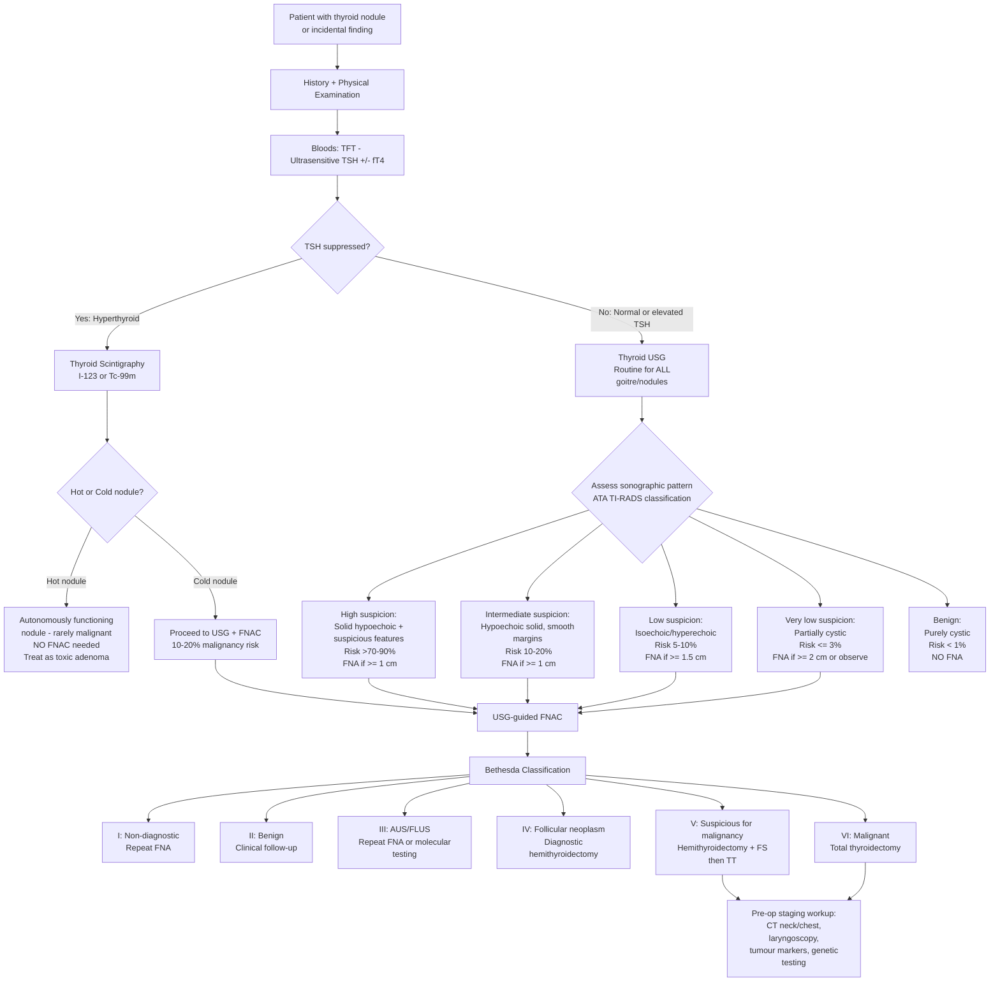

## Diagnostic Criteria, Diagnostic Algorithm, and Investigation Modalities

### 11.1 Conceptual Framework — How Do We Diagnose Thyroid Cancer?

Unlike many cancers, thyroid cancer **does not have a single "diagnostic criterion"** in the way that, say, rheumatoid arthritis has classification criteria. Instead, the diagnosis is built through a **stepwise investigative algorithm** that progresses from clinical suspicion → biochemistry → imaging → cytology → histology. The definitive diagnosis is almost always **histopathological** — either on FNAC (for papillary and medullary CA) or on surgical specimen (for follicular CA, where architectural invasion must be demonstrated).

Let's think about this from first principles: **you cannot biopsy every thyroid nodule** (they are incredibly common — ~50% of adults have thyroid nodules on ultrasound), so the investigative pathway is designed as a **risk-stratification funnel** that filters out the majority of benign nodules and triages the suspicious ones for tissue diagnosis [1][3][5][7].

---

### 11.2 Diagnostic Algorithm — Master Flowchart

[1][2][3][5][7]

---

### 11.3 Investigation Modalities — Detailed Breakdown

#### A. Blood Tests (Biochemistry)

##### i. ***Thyroid Function Test (TFT) — TSH ± fT4***

- ***TSH level is the MOST sensitive indicator of thyroid function*** due to its short half-life and the log-linear relationship with fT4 (small changes in fT4 cause large changes in TSH) [2].
- **Purpose**: The FIRST blood test ordered. It determines the **functional status** of the thyroid and guides the next step.
  - ***Suppressed TSH*** → possible autonomous function (hot nodule) → proceed to **scintigraphy** before FNAC [1][2][5][7]
  - ***Normal or elevated TSH*** → the nodule is NOT hyperfunctioning → proceed directly to **USG ± FNAC** [1][5][7]
- **Important**: Most thyroid cancers are ***euthyroid*** — they do NOT produce excess thyroid hormone. Therefore a normal TSH does **not** exclude malignancy.
- ***Elevated TSH is associated with increased thyroid cancer risk in patients with thyroid nodules*** [2] — higher TSH provides more trophic stimulation to follicular cells.

<Callout title="Exam Pitfall" type="error">
A common mistake is to order thyroid scintigraphy for every thyroid nodule. ***Scintigraphy is ONLY indicated when TSH is suppressed (hyperthyroid)***, to determine if the nodule is hot or cold. It is ***NOT recommended for routine diagnostic use*** in euthyroid patients because the nodule will never be hyperfunctioning in that setting, and you would need USG ± FNAC regardless [2][5][7].
</Callout>

##### ii. ***Serum Calcium (Ca²⁺) and Phosphate (PO₄³⁻)***

- **Why?** Two reasons [2][3]:
  1. **Hypercalcaemia of malignancy** — some aggressive thyroid cancers or concurrent MEN-related parathyroid hyperplasia can cause raised calcium.
  2. **Baseline pre-operative value** — after thyroidectomy, hypoparathyroidism is a major complication (inadvertent removal/devascularisation of parathyroid glands → hypocalcaemia). You need a pre-op baseline.

##### iii. ***Thyroid Autoantibodies***

- ***Anti-thyroglobulin (TG) antibodies should be measured to assess whether thyroglobulin can be used as a tumour marker for recurrence after total thyroidectomy*** [2].
  - **Why?** Anti-TG antibodies interfere with the thyroglobulin assay, causing falsely low readings. If anti-TG antibodies are positive, serum thyroglobulin becomes **unreliable** as a surveillance marker. In such cases, anti-TG antibody levels themselves are followed as a surrogate marker (rising titres suggest recurrence).
- **Anti-TPO antibodies**: if Hashimoto's thyroiditis is suspected (background for thyroid lymphoma).

##### iv. ***Serum Thyroglobulin (Tg)***

- ***Baseline tumour marker for differentiated thyroid carcinoma (DTC)*** [2].
- Thyroglobulin is a glycoprotein produced exclusively by thyroid follicular cells. After total thyroidectomy + RAI ablation, Tg should become **undetectable** — any subsequent rise indicates **recurrence or residual disease**.
- **NOT useful pre-operatively** for distinguishing benign from malignant (Tg is elevated in many benign thyroid conditions including goitre, thyroiditis).
- **NOT appropriate** for patients who have had only hemithyroidectomy (remaining lobe produces Tg) or those with detectable anti-TG antibodies [2].

##### v. ***Serum Calcitonin***

- ***Baseline tumour marker for medullary thyroid carcinoma (MTC) — 95% of MTC produces calcitonin*** [1][2][7].
- **When to order**: ***If there is history or clinical suspicion of familial medullary carcinoma or MEN2*** [1][5].
- **Interpretation**: Basal calcitonin > 100 pg/mL is highly suggestive of MTC. ***If calcitonin > 500 pg/mL, consider metastatic disease → proceed to staging with CT thorax/abdomen/pelvis and bone scan*** [3].
- Calcitonin can also be used as a **stimulated test** (pentagastrin or calcium stimulation) for borderline cases.

##### vi. ***Serum CEA***

- ***80% of medullary thyroid carcinoma produces CEA*** [1][2].
- Used alongside calcitonin for MTC monitoring. A **rising CEA with rising calcitonin** post-operatively strongly suggests recurrence/metastatic disease.
- A very high CEA:calcitonin ratio may indicate de-differentiation of MTC (worse prognosis).

##### vii. ***Genetic Testing***

- ***All patients with MTC should be tested for RET mutation*** [1][2][7].
  - **Why?** ~25% of MTC is familial (MEN2A, MEN2B, isolated familial MTC) — all caused by germline RET proto-oncogene mutations. Identifying the mutation has profound implications:
    - ***Screen asymptomatic relatives → prophylactic thyroidectomy (best done < 5–10 years old)*** [1][7]
    - Must ***rule out phaeochromocytoma*** (24h urine metanephrines) before any surgery
    - Must screen for parathyroid hyperplasia (Ca²⁺, PTH) in MEN2A
- **Molecular testing on FNAC specimens** (e.g. ***ThyroSeq v3, Veracyte Afirma gene expression classifier***): increasingly used for Bethesda III–IV indeterminate nodules to improve risk stratification and reduce unnecessary diagnostic surgery [1][5]. ***Currently expensive, no universal standards, and not readily available in all centres*** [1][5].

##### viii. ***CBC with Differentials***

- Baseline haematological assessment. Also relevant if thyroid lymphoma is in the differential [2].

<Callout title="Pre-operative Workup for MTC — Checklist" type="idea">
***Rule out familial disease (25% of MTC)***: family history, RET mutation analysis.
***Rule out phaeochromocytoma***: 24h urine metanephrines (MUST do BEFORE surgery — risk of catecholamine crisis).
***Tumour markers***: calcitonin, CEA.
***Ca²⁺ and PTH***: to detect parathyroid hyperplasia in MEN2A.
***Staging if calcitonin > 500***: CT chest/abdomen/pelvis + bone scan [3].
</Callout>

---

#### B. Imaging

##### i. ***Thyroid Ultrasound (USG) — The Cornerstone Investigation***

***USG is routine for ALL patients with goitre or palpable nodules*** [1][3][5][7].

| Aspect | Detail |
|---|---|
| **Technique** | ***7.5 or 10 MHz probes, B-mode*** [1][5]. High-frequency linear probe provides excellent resolution for superficial structures |
| **Pros** | ***Readily available, non-invasive, high sensitivity*** [1][5] |
| **Cons** | ***Low specificity*** — many benign nodules have "suspicious" features; ***NOT a screening test for healthy subjects*** [1][5] |
| **Role** | Extension of physical examination to guide (not confirm) diagnosis; risk-stratify nodules for selective FNAC [1][5] |

**What to assess on USG** [1][2][5]:

**The nodule itself:**

| Feature | High Risk (Suspicious) | Low Risk (Reassuring) | Pathophysiological Basis |
|---|---|---|---|
| ***Echogenicity*** | ***Hypoechoic*** | Hyperechoic or isoechoic | Malignant cells are densely packed with high nuclear:cytoplasmic ratio → less acoustic reflection → hypoechoic |
| ***Calcifications*** | ***Microcalcifications ( < 0.2 mm)*** | Large coarse calcifications | ***Microcalcifications represent psammoma bodies in papillary CA*** — concentric laminated calcific deposits from dystrophic calcification of papillary tips [1][2][5] |
| ***Shape*** | ***Taller than wide (AP > TS)*** | Wider than tall | Growth perpendicular to tissue planes suggests aggressive infiltration across normal tissue boundaries |
| ***Margins*** | ***Irregular (infiltrative, microlobulated)*** | Smooth, well-defined | Irregular margins indicate invasive growth through the capsule |
| ***Internal structure*** | Solid, or cystic with irregular septa | Spongiform (sponge-like microcystic), purely cystic | Solid components raise malignancy risk; spongiform pattern is ~99% benign |
| ***Halo (perilesional rim)*** | ***Absent or incomplete halo*** | Complete halo | The halo represents compressed thyroid parenchyma around a benign encapsulated nodule. Absence suggests lack of capsule (invasive) |
| ***Vascularity*** | ***Central/intranodular*** | Peripheral | Intranodular vascularity indicates tumour neoangiogenesis; peripheral vascularity reflects compression of normal peri-capsular vessels |
| ***Extrathyroidal extension*** | Present | Absent | Direct invasion beyond the thyroid capsule into strap muscles, trachea, etc. |

> **Mnemonic for suspicious USG features: "SHIT CME"** [3]: **S**olid, **H**ypoechoic, **I**rregular margins, **T**aller than wide, **C**haotic central vascularity, **M**icrocalcifications, **E**xtrathyroidal extension. ***The most important features are solid and hypoechoic*** [3].

**Surrounding structures:**

| Feature | What to Look For |
|---|---|
| **Other nodules** | Multiple nodules suggest MNG (somewhat reassuring, but a dominant nodule still needs evaluation) |
| **Parenchymal abnormalities** | Diffuse heterogeneity, reduced echogenicity → suggests thyroiditis (Hashimoto's) |
| ***Cervical lymph nodes*** | ***Sonographic features of malignant LN: Large > 2 cm, Roundish (taller than wide), Heterogeneous hypoechoic, Loss of central fatty hilum, Microcalcification, Intranodal cystic or coagulative necrosis*** [2][5] |
| **Retrosternal extension** | Lower border of the thyroid not visible below the clavicle → need CT for further assessment |

**Sonographic Criteria for FNAC (ATA 2015 / ACR TI-RADS):**

| ***Sonographic Pattern*** | ***Ultrasound Findings*** | ***Risk of Malignancy*** | ***Size Cutoff for FNA*** |
|---|---|---|---|
| ***High suspicion*** | ***Solid hypoechoic nodule (OR) solid hypoechoic component of partially cystic nodule + ≥ 1 of: microcalcifications, rim calcification with extrusive soft tissue, taller-than-wide, irregular margins, extrathyroidal extension*** | ***> 70–90%*** | ***≥ 1 cm*** |
| ***Intermediate suspicion*** | ***Hypoechoic solid nodule WITHOUT microcalcifications, taller-than-wide, or extrathyroidal extension*** | ***10–20%*** | ***≥ 1 cm*** |
| ***Low suspicion*** | ***Isoechoic or hyperechoic nodule, partially cystic with eccentric solid area WITHOUT suspicious features*** | ***5–10%*** | ***≥ 1.5 cm*** |
| ***Very low suspicion*** | ***Spongiform nodules, partially cystic WITHOUT high/intermediate/low features*** | ***< 3%*** | ***≥ 2 cm (or observe)*** |
| ***Benign*** | ***Purely cystic nodules with no solid component*** | ***< 1%*** | ***NO FNA*** |

[2][3][5][7]

<Callout title="Key Principle">
The entire USG → FNAC pathway is a **risk-stratification tool**, not a diagnostic test. USG cannot definitively diagnose or exclude thyroid cancer — it identifies nodules that warrant tissue sampling. The definitive pre-operative diagnosis comes from FNAC cytology (Bethesda classification).
</Callout>

---

##### ii. ***Fine Needle Aspiration Cytology (FNAC) — The Single Most Important Investigation***

***FNAC is the single most important investigation for a thyroid nodule when TSH is not suppressed*** [1][5].

| Aspect | Detail |
|---|---|
| **Technique** | ***Trans-isthmic approach ± USG guidance***. USG guidance confirms presence of nodule and targets biopsy to the most suspicious region [1][5] |
| **Accuracy** | ***90–95%*** → can avoid unnecessary diagnostic thyroidectomy [1][5] |
| **Pros** | Minimally invasive, safe, high diagnostic yield, outpatient procedure |
| **Cons** | ***Cannot demonstrate capsular or vascular invasion*** → ***cannot distinguish follicular adenoma from follicular carcinoma*** [1][2][3][5]. Also cannot diagnose lymphoma (needs core biopsy for architecture) |
| **Complications** | Pain, bleeding, false negative (especially in cystic nodules where the solid component is missed) |

> ***Core needle biopsy is NOT routinely performed on the thyroid*** because the thyroid is a ***very vascularised structure*** and core biopsy would lead to massive bleeding. ***FNAC is very accurate in identifying the type of thyroid cancer*** [2].

**Indications for FNAC** [2][5][7]:
- Meets ***sonographic criteria for FNA*** (see table above)
- ***Hypofunctioning (cold) nodules*** on thyroid scintigraphy (10–20% malignancy risk)
- ***Dominant or atypical nodule in multinodular goitre***
- ***Nodules associated with abnormal lymph nodes***
- ***Complex or recurrent cystic nodules***
- ***Symptomatic or large cysts*** (also therapeutic — aspiration decompresses)
- ***Can proceed directly to total thyroidectomy if > 4 cm, gross invasion, or LN positive*** (FNAC may not change management) [1]

---

##### iii. ***Bethesda System for Reporting Thyroid Cytopathology (TBSRTC)***

This is the **universal standardised reporting system** for thyroid FNAC [2][7]:

| ***Bethesda Category*** | ***Diagnostic Category*** | ***Risk of Malignancy (%)*** | ***Usual Management*** |
|---|---|---|---|
| ***I*** | ***Non-diagnostic / Unsatisfactory*** | ***1–4%*** | ***Repeat FNA*** (or surgery if radiologically suspicious) |
| ***II*** | ***Benign*** | ***0–3%*** | ***Clinical follow-up*** (repeat USG in 12–24 months) |
| ***III*** | ***Atypia of undetermined significance (AUS) OR Follicular lesion of undetermined significance (FLUS)*** | ***5–15%*** | ***Repeat FNA, molecular testing, or hemithyroidectomy if AUS × 2*** |
| ***IV*** | ***Follicular neoplasm / Suspicious for follicular neoplasm*** | ***15–30%*** | ***Diagnostic hemithyroidectomy*** (± molecular testing) |
| ***V*** | ***Suspicious for malignancy*** | ***60–75%*** | ***Hemithyroidectomy + frozen section → total thyroidectomy*** |
| ***VI*** | ***Malignant*** | ***97–99%*** | ***Total thyroidectomy*** |

[1][2][3][5][7]

**Cytological findings by cancer type:**

| Cancer Type | Cytological Features on FNAC |
|---|---|
| ***Papillary CA*** | ***Orphan Annie eye nuclei*** (empty, ground-glass appearance with nuclear clearing), ***nuclear pseudoinclusions*** (cytoplasmic invaginations into the nucleus), ***papillary architecture***, ***psammoma bodies*** (laminated calcified structures), nuclear grooves [1][2] |
| ***Follicular CA*** | ***Follicular structures similar to normal thyroid*** — microfollicular pattern with scant colloid. ***Cannot differentiate follicular adenoma from carcinoma on FNAC*** because ***diagnosis of carcinoma relies on capsular or vascular invasion which is not appreciated on FNAC due to limited architectural information*** [2][3] |
| ***Medullary CA*** | ***Distinctive deposits of acellular amyloid material*** (from altered calcitonin aggregation), plasmacytoid cells, positive calcitonin immunostaining. ***Multicentric C-cell hyperplasia in familial cases*** [2] |
| ***Anaplastic CA*** | ***Small blue round cells that are highly anaplastic***, marked pleomorphism, bizarre giant cells, necrosis, high mitotic figures [2] |
| ***Lymphoma*** | Lymphoid cells on FNAC — ***FNAC cannot diagnose lymphoma*** → need ***core biopsy*** for tissue architecture, immunohistochemistry, and flow cytometry |

> **Why are "Orphan Annie" nuclei called that?** They are named after the cartoon character Little Orphan Annie, whose eyes appeared blank and empty. In papillary thyroid carcinoma, the nuclear clearing on haematoxylin and eosin (H&E) staining creates this characteristic "empty" appearance due to dispersal of chromatin to the nuclear periphery during tissue fixation.

<Callout title="Frozen Section — Is It Useful?" type="idea">
***Frozen section (FS) is NOT helpful in hemithyroidectomy for follicular neoplasm (Bethesda IV)***. It only gives diagnostic information in ~13% of cases and modifies the surgical procedure in only 3.3%, with misguided intervention in 5% [1][5]. ***One should wait for the final histology report after lobectomy***. If it shows encapsulated minimally invasive FTC ( < 5 vessel invasion, no wide invasion), lobectomy is curative. Otherwise, completion thyroidectomy + RAI ablation is needed [1][5].

However, FS **is** useful for ***Bethesda V (suspicious for malignancy)*** — if FS confirms malignancy intra-operatively, the surgeon can proceed directly to total thyroidectomy in the same operation, avoiding a second surgery.
</Callout>

---

##### iv. ***Thyroid Scintigraphy (Radionuclide Scan)***

| Aspect | Detail |
|---|---|
| **Radiopharmaceuticals** | ***⁹⁹ᵐTc pertechnetate*** (iodine trapping only — has similar ionic size to iodide, taken up by NIS), ***¹²³I or ¹³¹I*** (trapping + organification) [8] |
| **Principle** | ***Radioactive iodine is handled in the same manner as normal iodine. Level of uptake reflects metabolic activity*** [8] |
| **Images** | Anterior, left anterior oblique (LAO), and right anterior oblique (RAO) views [8] |

**Indications** [2][5][7]:
- ***ONLY in patients with a thyroid nodule AND suppressed TSH (↓TSH)*** → to determine if the nodule is hot or cold
- ***NOT recommended for routine diagnostic use in euthyroid patients*** [2][7]
- Also indicated in ***multinodular goitre (MNG)*** to determine functional status of different nodules

**Interpretation:**

| Scintigraphic Finding | Definition | Clinical Significance |
|---|---|---|
| ***Hot nodule (hyperfunctioning)*** | Uptake greater than surrounding thyroid tissue | ***Almost never malignant → does NOT require FNAC***. Treat as toxic adenoma [2][5][7] |
| ***Cold nodule (hypofunctioning)*** | Uptake less than surrounding thyroid tissue | ***10–20% risk of malignancy → requires FNAC*** provided sonographic criteria are met [2][5][7] |
| Warm nodule (indeterminate) | Uptake similar to surrounding tissue | Intermediate risk; proceed based on USG features |

> ***Why is scintigraphy NOT done when TSH is normal or elevated?*** Because a euthyroid or hypothyroid patient's nodule will never be "hot" — by definition, a hot nodule suppresses TSH via autonomous hormone production. If TSH is normal, the nodule is not autonomously functioning, and scintigraphy provides no additional discriminatory information beyond what USG + FNAC can give [2].

**Clinical indications for thyroid scintigraphy** [8]:
- Assessment of thyroid nodules, goitre, organification defect, thyroid cancer
- Evaluation of ectopic thyroid
- Diagnosis of causes of thyrotoxicosis or hypothyroidism
- ***Post-surgery or radiotherapy assessment of residual thyroid gland***

---

##### v. ***CT Scan / MRI***

| Aspect | Detail |
|---|---|
| **Indications** | ***NOT routine*** — only when: (1) ***retrosternal goitre*** (cannot be visualised by USG, needed for surgical planning), (2) ***locally advanced thyroid cancer*** (delineation of important structures within cervical fascia), (3) staging for distant mets [1][2][3][5] |
| **CT thorax** | Determine extent of retrosternal goitre or thyroid tumour; identify tumour invasion of great vessels and upper aerodigestive tract [2] |
| **MRI** | Better soft tissue contrast than CT; useful for assessing extent of local invasion (trachea, oesophagus, carotid sheath) |

<Callout title="Contrast CT Warning" type="error">
***The use of iodinated contrast in CT may affect post-operative radioactive iodine (RAI) whole-body scan and therapy*** [1][5]. Iodine contrast "loads" the body with stable iodine, which competes with ¹³¹I for uptake by residual thyroid/tumour tissue, reducing the efficacy of both diagnostic scanning and therapeutic RAI. A delay of 4–8 weeks after iodinated contrast is recommended before RAI. Plan imaging accordingly!
</Callout>

##### vi. ***CXR***

- ***Tracheal deviation*** (mass effect of large goitre/tumour)
- ***Mediastinal shadow*** for retrosternal extension
- ***Lung metastases*** (cannonball or miliary pattern — especially in follicular CA with haematogenous spread) [2]

##### vii. ***PET-CT (¹⁸F-FDG)***

- ***No role in routine primary diagnosis*** of thyroid cancer [3]
- Used for:
  - **Staging of aggressive thyroid cancers** (anaplastic, poorly differentiated)
  - **Radioiodine-refractory DTC** — FDG-avid tumour that does NOT take up ¹³¹I (the "flip-flop" phenomenon: as tumours de-differentiate, they lose NIS expression → ↓RAI uptake, but gain GLUT-1 expression → ↑FDG uptake)
  - **Detection of recurrence** when thyroglobulin is rising but RAI whole-body scan is negative

##### viii. ***Endoscopy***

| Modality | Indication | Finding |
|---|---|---|
| ***Direct laryngoscopy*** | ***Pre-operative assessment of vocal cord function (RLN status)*** — ***mandatory before thyroid surgery*** [1][5] | Documents pre-existing vocal cord paralysis (from tumour invasion of RLN vs pre-existing pathology) |
| ***Bronchoscopy*** | ***Invasion into trachea*** — if airway involvement suspected (stridor, haemoptysis) [2] | Mucosal involvement, intraluminal tumour |
| ***OGD (oesophagogastroduodenoscopy)*** | ***Invasion into oesophagus*** — if dysphagia suggests oesophageal involvement [1][2][5] | Extrinsic compression or mucosal invasion |

##### ix. ***Other Imaging for Metastasis Workup***

| Modality | Purpose |
|---|---|
| ***Skeletal X-ray*** | Detect bone metastasis (lytic lesions — especially in follicular CA) [2] |
| ***CT/MRI brain, neck, chest, abdomen, pelvis*** | Identify distant metastasis in advanced disease [2] |
| ***Bone scintigraphy*** | If bone metastases suspected clinically (bone pain, raised ALP) |

---

### 11.4 Staging Systems

Once thyroid cancer is diagnosed, staging determines prognosis and guides post-operative management.

#### i. ***AJCC/UICC 8th Edition TNM Staging (2017)***

**T Staging (Tumour):**

| Stage | Criteria |
|---|---|
| ***T1*** | ***Tumour ≤ 2 cm, limited to thyroid*** |
| ***T1a*** | ***Tumour ≤ 1 cm*** |
| ***T1b*** | ***Tumour > 1 cm and ≤ 2 cm*** |
| ***T2*** | ***Tumour > 2 cm but ≤ 4 cm, limited to thyroid*** |
| ***T3*** | ***Tumour > 4 cm limited to thyroid, OR gross extrathyroidal extension invading only strap muscles*** |
| ***T3a*** | ***Tumour > 4 cm limited to thyroid*** |
| ***T3b*** | ***Gross extrathyroidal extension invading only strap muscles*** |
| ***T4*** | ***Gross extrathyroidal extension beyond strap muscles*** |
| ***T4a*** | ***Invading subcutaneous soft tissues, larynx, trachea, oesophagus, or RLN*** |
| ***T4b*** | ***Invading prevertebral fascia or encasing carotid artery or mediastinal vessels*** |

**Specifier**: (s) = solitary tumour; (m) = multifocal tumour [1]

**N Staging (Nodes):**

| Stage | Criteria |
|---|---|
| ***N1a*** | ***Level VI and/or Level VII nodes (central compartment)*** |
| ***N1b*** | ***Level I–V nodes (lateral compartment)*** |

[3]

**Overall Stage Grouping — Differentiated Thyroid Cancer (PTC, FTC):**

| | ***Age < 55 years*** | ***Age ≥ 55 years*** |
|---|---|---|
| ***Stage I*** | ***Any T, Any N, M0*** | ***T1–T2, N0, M0*** |
| ***Stage II*** | ***Any T, Any N, M1*** | ***T1–T2, N1, M0 / T3, Any N, M0*** |
| ***Stage III*** | — | ***T4a, Any N, M0*** |
| ***Stage IVA*** | — | ***T4b, Any N, M0*** |
| ***Stage IVB*** | — | ***Any T, Any N, M1*** |

[1][3]

> ***Key point: Age < 55 years → maximum Stage II even with distant metastases.*** This reflects the remarkably good prognosis of differentiated thyroid cancer in young patients (5-year survival > 98% even with M1 disease). ***Anaplastic carcinoma is automatically Stage IV regardless of extent*** [1][3].

#### ii. ***MACIS System (Predicts Disease-Specific Mortality for PTC)***

- ***M*** — **M**etastasis
- ***A*** — **A**ge
- ***C*** — **C**ompleteness of resection
- ***I*** — **I**nvasion (extrathyroidal extension)
- ***S*** — **S**ize

[2]

#### iii. ***ATA Risk Stratification (Predicts Disease Recurrence Risk)***

Covered in detail in Section 6.3 of prior notes. This is used **post-operatively** to guide the intensity of adjuvant therapy (RAI ablation) and surveillance.

---

### 11.5 Putting It All Together — A Systematic Approach

Here is how a clinician should approach a thyroid nodule, step by step:

| Step | Action | Rationale |
|---|---|---|
| **1** | History + Physical Examination | Identify red flags for malignancy (Section 8.3) |
| **2** | ***TFT (TSH ± fT4)*** — **FIRST blood test** | Determine functional status; suppressed TSH → scintigraphy [1][5][7] |
| **3** | ***Thyroid USG*** — **ROUTINE for ALL** | Risk-stratify the nodule; assess cervical LNs; guide FNAC [1][3][5][7] |
| **4** | ***Thyroid scintigraphy*** — **ONLY if TSH suppressed** | Hot nodule = benign (no FNAC needed); cold nodule → FNAC [2][5][7] |
| **5** | ***USG-guided FNAC*** — for suspicious nodules meeting size criteria | Bethesda classification guides management [1][2][5][7] |
| **6** | Bethesda I–II → Follow-up; III → Repeat or molecular test; IV–VI → Surgery | See Bethesda table above |
| **7** | If malignancy confirmed/suspected → **Pre-operative workup** | CT neck/chest (if locally advanced), ***direct laryngoscopy*** (vocal cord function), tumour markers (Tg, calcitonin, CEA), Ca/PO₄, genetic testing if MTC |
| **8** | Post-operative → Histopathology → **TNM staging + ATA risk stratification** | Determines need for completion thyroidectomy, RAI, TSH suppression |

***Routine for ALL patients: History, PE, TFT, thyroid USG ± FNAC*** [3].

***Selective investigations (not routine):*** [3]
- Thyroid scintigraphy: only if TSH suppressed + nodule
- CT scan: only if retrosternal goitre or locally advanced cancer
- PET scan: ***no diagnostic role*** — only for staging aggressive/RAI-refractory disease

---

<Callout title="High Yield Summary">

**Investigation hierarchy**: TFT (TSH) → USG → FNAC (± scintigraphy if TSH suppressed).

**TSH is the first test**: Suppressed → scintigraphy; Normal/elevated → USG ± FNAC directly.

**USG suspicious features (SHIT CME)**: Solid, Hypoechoic, Irregular margins, Taller-than-wide, Chaotic central vascularity, Microcalcifications, Extrathyroidal extension.

**FNAC is the single most important investigation**: Bethesda classification guides management. Cannot diagnose follicular CA (need histological capsular/vascular invasion). Cannot diagnose lymphoma (need core biopsy).

**Hot nodule on scintigraphy = almost never malignant → NO FNAC needed. Cold nodule = 10–20% malignancy risk → needs FNAC.**

**Bethesda IV (follicular neoplasm)**: Diagnostic hemithyroidectomy — final diagnosis requires histological capsular/vascular invasion.

**Pre-op for MTC**: RET mutation, calcitonin, CEA, 24h urine metanephrines, Ca/PTH.

**Iodinated contrast CT can interfere with subsequent RAI scan/therapy** — plan accordingly.

**TNM staging**: Age < 55 with DTC → max Stage II. Anaplastic → auto Stage IV.

</Callout>

---

<ActiveRecallQuiz
  title="Active Recall - Diagnosis of Thyroid Cancer"
  items={[
    {
      question: "A patient presents with a thyroid nodule. TFT shows a suppressed TSH. What is the next investigation and what are the possible results and their implications?",
      markscheme: "Thyroid scintigraphy (I-123 or Tc-99m). Hot nodule = autonomously functioning, rarely malignant, no FNAC needed, treat as toxic adenoma. Cold nodule = 10-20% malignancy risk, requires USG-guided FNAC if sonographic criteria met.",
    },
    {
      question: "State the Bethesda classification categories I through VI, the associated risk of malignancy for each, and the recommended management.",
      markscheme: "I: Non-diagnostic (1-4%) - repeat FNA. II: Benign (0-3%) - clinical follow-up. III: AUS/FLUS (5-15%) - repeat FNA or molecular testing. IV: Follicular neoplasm (15-30%) - diagnostic hemithyroidectomy. V: Suspicious for malignancy (60-75%) - hemithyroidectomy with frozen section then total thyroidectomy. VI: Malignant (97-99%) - total thyroidectomy.",
    },
    {
      question: "List the sonographic features suspicious for thyroid malignancy using the mnemonic SHIT CME. Which two features are the MOST important?",
      markscheme: "Solid, Hypoechoic, Irregular margins, Taller-than-wide, Chaotic central vascularity, Microcalcifications, Extrathyroidal extension. The most important features are Solid and Hypoechoic.",
    },
    {
      question: "Why must anti-thyroglobulin antibodies be measured before using thyroglobulin as a tumour marker? What happens if they are positive?",
      markscheme: "Anti-TG antibodies interfere with the thyroglobulin immunoassay, causing falsely low readings. If positive, thyroglobulin levels are unreliable as a surveillance marker. Instead, anti-TG antibody levels themselves are followed as a surrogate marker - rising titres suggest recurrence.",
    },
    {
      question: "Explain why iodinated contrast CT should be avoided or timed carefully before radioactive iodine therapy.",
      markscheme: "Iodinated contrast loads the body with stable iodine, which competes with I-131 for uptake via the sodium-iodide symporter on residual thyroid/tumour tissue, reducing both diagnostic scanning sensitivity and therapeutic RAI efficacy. A delay of 4-8 weeks after contrast is recommended before RAI.",
    },
    {
      question: "In AJCC 8th edition staging for differentiated thyroid cancer, what is the maximum stage for a patient aged less than 55 years? Why?",
      markscheme: "Maximum Stage II, even with distant metastases. This reflects the excellent prognosis of DTC in young patients (5-year survival over 98% even with M1 disease). The biology is more differentiated, more radioiodine-avid, and less likely to harbour aggressive mutations like TERT promoter mutations.",
    },
  ]}
/>

## References

[1] Senior notes: Ryan Ho Endocrine.pdf (Sections 1.6, 1.6.1, 1.6.2, pp. 19–20, 33–38)
[2] Senior notes: felixlai.md (Thyroid cancer sections VIII–X, pp. 983–1014)
[3] Senior notes: maxim.md (Thyroid cancer investigations, staging, approach to thyroid nodules)
[5] Senior notes: Ryan Ho Fundamentals.pdf (pp. 426–428)
[7] Lecture slides: GC 177. A thyroid nodule benign thyroid nodules; thyroid cancer.pdf (pp. 5, 7, 10, 13, 27)
[8] Senior notes: Ryan Ho Diagnostic Radiology.pdf (p. 59 — thyroid scintigraphy)
