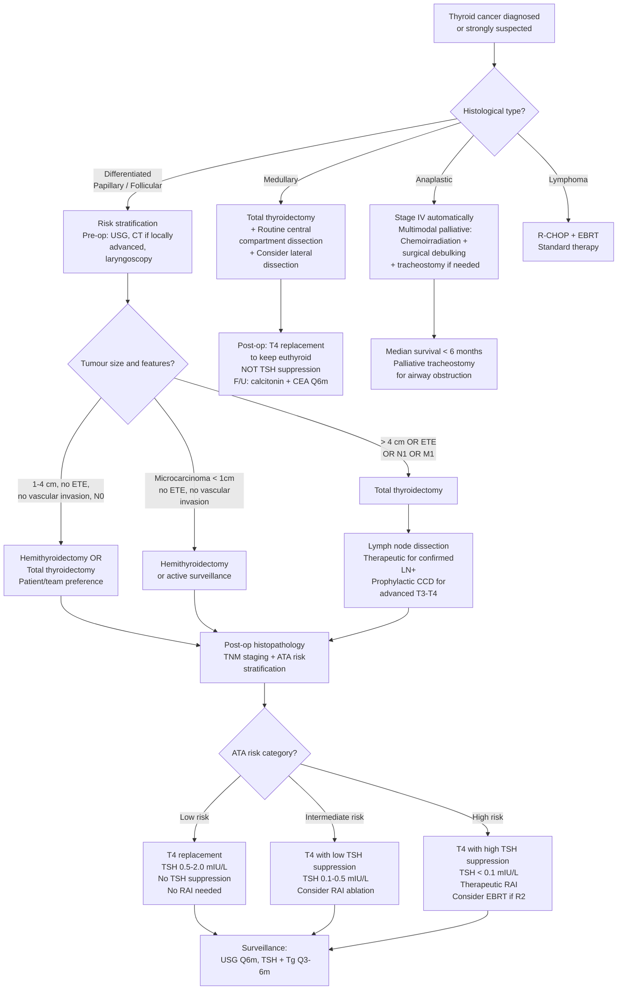

## Management of Thyroid Cancer

### 12.1 Overview — Management Principles

The management of thyroid cancer is **type-dependent** and follows a logical sequence: (1) initial surgical treatment, (2) post-operative risk stratification, (3) adjuvant therapies, and (4) long-term surveillance. The beauty of thyroid cancer management lies in how the biology of the tumour dictates each treatment decision — well-differentiated cancers that retain iodine-avidity are exploited with radioiodine, while de-differentiated cancers that lose this property require alternative strategies.

***Management considerations for well-differentiated thyroid carcinoma (WDTC)*** [4][7]:
- ***Extent of thyroidectomy: hemithyroidectomy vs total (bilateral) thyroidectomy***
- ***Nature/aim and extent of lymph node/neck dissection: prophylactic or therapeutic; central and/or lateral compartments***
- ***Postoperative adjuvant therapies: radioiodine (¹³¹I) ablation, external beam irradiation, thyroxine (T4) suppressive therapy***

---

### 12.2 Master Management Algorithm

[1][2][3][4][7][9]

---

### 12.3 Pre-operative Preparation

Before any thyroid surgery, there is a systematic pre-operative checklist:

| Pre-op Step | Rationale | Detail |
|---|---|---|
| ***Ensure biochemically euthyroid*** | ***Prevention of thyroid storm*** during surgery — a hyperthyroid patient undergoing neck manipulation risks intra-operative thyroid storm (massive release of T3/T4 from gland manipulation) [2][3] | Anti-thyroid drugs (carbimazole/propylthiouracil) until euthyroid; β-blockers for 2 weeks for symptom control |
| ***Vocal cord function by laryngoscopy*** | ***Mandatory pre-operative documentation of vocal cord function*** — medico-legal requirement. If a patient already has RLN palsy pre-operatively (from tumour invasion), this changes the surgical approach (must preserve the contralateral nerve at all costs to avoid bilateral palsy → airway obstruction) [1][3] | Direct or fibreoptic laryngoscopy |
| ***Calcium and vitamin D levels*** | ***Prevention of postoperative hypocalcaemia*** and ***hungry bone syndrome*** [2][3] | Monitor Ca²⁺ and vitamin D; supplement if low pre-operatively |
| ***Lugol's iodine solution*** (for Graves'/toxic) | ***Blocks iodine uptake and secretion of thyroid hormone; decreases vascularity of thyroid gland to reduce intraoperative bleeding*** [2] | Given 10 days prior to surgery. Wolff-Chaikoff effect: excess iodine paradoxically inhibits thyroid hormone synthesis |
| ***Imaging*** | Risk stratification and surgical planning | USG thyroid + neck LNs; ± CT/MRI if locally advanced; ± PET-CT for advanced disease [1] |
| ***Pre-op workup for MTC*** | Rule out phaeochromocytoma (catecholamine crisis risk under GA), assess familial disease | 24h urine metanephrines, Ca²⁺/PTH, calcitonin, CEA, RET mutation analysis [1][3] |

<Callout title="Critical Safety Point" type="error">
***NEVER take a patient with suspected MEN2-associated MTC to theatre without first ruling out phaeochromocytoma.*** If a phaeochromocytoma is present and undiagnosed, induction of anaesthesia or surgical manipulation can trigger a life-threatening catecholamine crisis with malignant hypertension, arrhythmias, and cardiovascular collapse. Always check 24h urine metanephrines/plasma metanephrines first.
</Callout>

---

### 12.4 Surgical Management

#### A. Types of Thyroid Surgery — Terminology

| Term | Definition |
|---|---|
| ***Total thyroidectomy*** | ***Resection of both lobes + isthmus + pyramidal lobe*** [3] |
| ***Subtotal thyroidectomy*** | ***Resection of > 1/2 of both lobes + isthmus*** [3] (rarely done for cancer) |
| ***Hemithyroidectomy*** | ***Resection of one lobe + isthmus*** [3] |
| ***Lobectomy*** | ***Resection of one lobe (isthmus preserved)*** [3] |
| ***Near-total thyroidectomy*** | Removal of virtually all thyroid tissue except a small remnant ( < 1 g) near the RLN on one side |
| ***Completion thyroidectomy*** | Removal of the remaining lobe after initial hemithyroidectomy, when final histopathology reveals cancer requiring total thyroidectomy |

***Alternative surgical approaches (for cosmesis)*** [3]:
- Bilateral axillo-breast approach (BABA)
- Transoral vestibular approach
- Retro-auricular trans-hairline approach (RATH)

***General indications for thyroidectomy (the "4 C's")*** [3]:
- **C**A thyroid
- Uncontrolled thyrotoxicosis (**C**annot be treated medically)
- **C**ompression symptoms
- **C**osmetic concern

---

#### B. Surgical Approach by Cancer Type

##### i. ***Differentiated Thyroid Carcinoma (Papillary and Follicular)***

This is the most nuanced decision-making area — the choice between hemithyroidectomy and total thyroidectomy depends on tumour size, risk features, and patient/team preference.

**Hemithyroidectomy (Lobectomy + Isthmusectomy):**

| Indication | Rationale |
|---|---|
| ***Microcarcinoma (tumour < 1 cm) WITHOUT extrathyroidal extension or vascular invasion*** [2][7] | Excellent prognosis; completion thyroidectomy can be done later if higher-risk features found on final histology |
| ***Tumour 1–4 cm WITHOUT extrathyroidal extension or vascular invasion, N0*** [2][4][7][9] | ATA 2015: "Thyroid lobectomy alone may be sufficient initial treatment for low-risk papillary and follicular carcinomas" |
| Bethesda IV (follicular neoplasm) — diagnostic | To obtain histological diagnosis; completion TT if cancer confirmed on final pathology |

***Arguments for hemithyroidectomy*** [7]:
- ***Lower morbidity*** (avoids bilateral RLN risk, lower hypoparathyroidism risk)
- ***Avoid lifelong T4 replacement*** (remaining lobe maintains thyroid function in ~80% of patients)

**Total Thyroidectomy (or Near-Total Thyroidectomy):**

| Indication | Rationale |
|---|---|
| ***Tumour > 4 cm*** [2][4][9] | Large tumours carry higher recurrence risk; need RAI ablation post-op |
| ***Tumour with extrathyroidal extension (ETE)*** [2][4][9] | Aggressive feature indicating higher stage disease |
| ***Tumour with lymph node metastasis (N1) or distant metastasis (M1)*** [2][4][9] | Need RAI for adjuvant treatment; need Tg monitoring |
| ***Aggressive histology*** (tall cell, columnar cell, diffuse sclerosing, poorly differentiated PTC, Hürthle cell) [3] | Higher recurrence risk |
| ***Bilateral or multifocal disease*** [7] | Papillary CA is commonly multifocal (70%) and bilateral |
| Patient/team preference when RAI ablation or Tg monitoring desired [7][9] | Total thyroidectomy enables RAI and makes Tg a reliable tumour marker |

***Arguments for total thyroidectomy*** [7]:
- ***Commonly multifocal and bilateral*** → addresses occult contralateral disease
- ***Excellent survival and low recurrence***
- ***Allows RAI ablation and thyroglobulin (Tg) monitoring***
- ***Low morbidity rate by experienced surgeons***

<Callout title="The Controversy for Low-Risk PTC" type="idea">
***For early-stage PTC ( < 4 cm, no invasion, no LN metastasis), there is genuine management controversy*** [7]. ***Survival is nearly 100%*** regardless of whether hemithyroidectomy or total thyroidectomy is performed. The debate centres on ***overtreatment/surgical risk vs avoiding recurrence/facilitating follow-up***. ***Patients' vs physicians' preference*** matters, and this is moving towards ***personalised treatment*** [7]. ***Active surveillance (watchful waiting) is now an accepted option for papillary microcarcinomas ( < 1 cm)*** in selected patients — pioneered by Japanese centres (Kuma Hospital, Miyauchi protocol).
</Callout>

***ATA 2015 Guideline Statement*** [9]:
> ***"For patients with thyroid cancer > 1 cm and < 4 cm without extrathyroidal extension, and without clinical evidence of any lymph node metastases (cN0), the initial surgical procedure can be either a bilateral procedure (near-total or total thyroidectomy) or a unilateral procedure (lobectomy). Thyroid lobectomy alone may be sufficient initial treatment for low-risk papillary and follicular carcinomas; however, the treatment team may choose total thyroidectomy to enable RAI therapy or to enhance follow-up based upon disease features and/or patient preferences." — Strong recommendation, moderate-quality evidence***

##### ii. ***Follicular Thyroid Carcinoma — Special Considerations***

- FTC is usually diagnosed ***post-operatively*** (because FNAC cannot distinguish follicular adenoma from carcinoma — Bethesda IV).
- Initial surgery is typically **diagnostic hemithyroidectomy**. The decision to perform **completion thyroidectomy** is based on the final histopathology:
  - ***Encapsulated, minimally invasive FTC ( < 5 foci of vascular invasion, no wide invasion) → lobectomy is curative*** [1][5]
  - ***Widely invasive FTC or extensive vascular invasion ( > 4 foci) → completion total thyroidectomy + RAI ablation*** due to ↑risk of distant metastases [1][5]
- ***Hemithyroidectomy post-op: thyroxine replacement is NOT required immediately — measure TSH 6 weeks later*** [2]

##### iii. ***Medullary Thyroid Carcinoma (MTC)***

| Management Step | Detail | Rationale |
|---|---|---|
| ***Total thyroidectomy*** | ***ALL medullary carcinoma should undergo total thyroidectomy*** [1][2][7] | ***Aggressive nature; majority already locally advanced or metastatic at diagnosis; risk of multifocality and bilaterality; association with MEN*** [2] |
| ***Central compartment dissection (Level VI)*** | ***Prophylactic dissection indicated in ALL cases*** whether or not there is evidence of LN involvement [2][7] | MTC has early nodal metastasis; Level VI is the first echelon |
| ***Lateral neck dissection*** | ***Prophylactic if central compartment is involved***; therapeutic if lateral nodes confirmed [2][3] | Depends on calcitonin level and imaging: ipsilateral LCD if calcitonin < 200; bilateral LCD if calcitonin > 200 [3] |
| ***Genetic analysis: RET proto-oncogene*** | ***Test all MTC patients*** [1][7] | 25% are familial (MEN2A/2B/FMTC) |
| ***Prophylactic thyroidectomy in RET carriers*** | ***Best done at age 5–10 years*** [1][7] | Virtually 100% penetrance for MTC in MEN2 |
| ***Aim: biochemical cure*** | ***Normalised calcitonin*** post-operatively [1] | Rising calcitonin post-op → screen for residual/metastatic disease |
| ***Post-op T4 replacement*** | ***Keep euthyroid — NOT TSH suppression*** (unlike DTC) [1] | MTC arises from C cells which do NOT express TSH receptors → TSH suppression has no anti-tumour effect |
| ***No good adjuvant treatment*** | ***No role for RAI*** (C cells don't take up iodine) [1] | C cells lack NIS expression |
| ***Follow-up*** | Serum ***calcitonin and CEA 6 months post-op*** [1]; ***↑calcitonin → screen for residual/metastatic disease → surgical Tx ± chemo/RT*** [1] | |

> **Why doesn't MTC respond to RAI?** MTC arises from parafollicular C cells, not follicular epithelial cells. C cells do not express the sodium-iodide symporter (NIS) and do not organify iodine — they have a completely different embryological origin (neural crest) and function (calcitonin secretion). Therefore, radioiodine cannot be concentrated in medullary carcinoma cells.

##### iv. ***Anaplastic Thyroid Carcinoma***

| Management | Detail |
|---|---|
| ***Automatically Stage IV*** | All anaplastic CA is Stage IV at diagnosis regardless of extent [1][3] |
| ***Total thyroidectomy with post-operative chemoradiotherapy*** | ***Indicated in patients with intrathyroidal anaplastic carcinoma or locally advanced disease. Post-operative combined chemotherapy and radiotherapy prolong survival*** [2] |
| ***Chemoirradiation ± surgical debulking*** | For surgically inoperable disease [1][2][7] |
| ***Palliative tracheostomy*** | ***Death is usually attributable to upper airway obstruction and suffocation; tracheostomy is indicated to secure the airway*** [2] |
| ***Targeted therapy*** | ***Chemoirradiation + resection + targeted Rx*** [7]. Dabrafenib + trametinib for BRAF V600E-mutant anaplastic CA (FDA approved 2018, landmark ROAR basket trial); lenvatinib; immunotherapy (pembrolizumab if PD-L1+/MSI-H) |
| ***Prognosis*** | ***Median survival < 6 months. Lack of effective treatment. Invariably palliative and fatal*** [1][7] |

##### v. ***Thyroid Lymphoma***

| Management | Detail |
|---|---|
| ***R-CHOP + EBRT*** | ***Standard therapy*** [1] |
| ***Prognosis*** | ***Better than anaplastic CA; median survival 9 years*** [1] |

---

#### C. Lymph Node Dissection — Detailed Approach

Understanding lymph node dissection terminology and indications is critical:

**Terminology:**

| Type | Extent |
|---|---|
| ***Central compartment dissection (CCD)*** | ***Level VI (± Level VII)*** — pretracheal, paratracheal, prelaryngeal nodes |
| ***Lateral neck dissection (LCD)*** | ***Level II–V*** nodes |
| ***Radical neck dissection (RND)*** | Removal of all ipsilateral lymphatic structures + IJV + SCM + CN XI (rarely done now) [1] |
| ***Modified radical neck dissection (MRND)*** | 1–3 of IJV, SCM, CN XI preserved [1] |
| ***Functional neck dissection*** | All 3 of IJV, SCM, CN XI preserved [1] |
| ***Selective neck dissection*** | Only selected levels dissected |

**Indications by Cancer Type:**

| Cancer | Central Compartment (Level VI) | Lateral Compartment (Levels II–V) |
|---|---|---|
| ***Papillary CA*** | ***Therapeutic CCD if confirmed involved***; ***Prophylactic CCD controversial — only for advanced disease (T3–T4) or lateral LN involvement*** [1][2][3] | ***Therapeutic LCD if confirmed involved***; ***NO prophylactic lateral dissection*** [2][3] |
| ***Follicular CA*** | ***Usually not required*** (haematogenous spread; LN metastasis uncommon at 8–13%) [3] | Rare |
| ***Medullary CA*** | ***Prophylactic CCD for ALL patients*** [2][3][7] | ***Prophylactic LCD if central compartment involved; therapeutic if lateral nodes confirmed*** [2][3] |
| ***Anaplastic CA*** | If resectable — but usually palliative | If resectable |

> ***Central LN metastasis is present in 50% of papillary thyroid carcinoma cases*** [1]. However, ***prophylactic central dissection is NOT routinely recommended unless there is advanced disease*** (T3–T4) or lateral LN involvement, because: (1) most micro-metastases may not be clinically significant, (2) increased risk of hypoparathyroidism and RLN injury with bilateral central dissection [1].

---

### 12.5 Post-operative Management

#### A. Post-operative Evaluation

| Step | Detail |
|---|---|
| ***Histopathology*** | Determines final T, N staging; identifies aggressive features (ETE, vascular invasion, histological subtype) |
| ***Thyroglobulin*** | Post-op baseline: ***< 5 ng/mL after total thyroidectomy; < 30 ng/mL after hemithyroidectomy*** [1][3] |
| ***TNM staging*** | Predicts disease-specific mortality |
| ***ATA risk stratification*** | Predicts risk of recurrence → guides intensity of adjuvant therapy [1][9] |

#### B. ***Thyroxine (T4) Therapy***

T4 therapy post-thyroidectomy serves a ***dual role*** [2][3]:
1. **Replacement** — prevent hypothyroidism (mandatory after total thyroidectomy)
2. **Suppression** — suppress TSH to reduce stimulation of any residual DTC cells (because ***differentiated thyroid carcinoma expresses TSH receptors*** → TSH is a growth factor)

***Target TSH depends on risk*** — ***note that the low-risk group does NOT require TSH suppression*** [3]:

| ***ATA Risk*** | ***Features*** | ***Target TSH*** |
|---|---|---|
| ***Low risk*** | ***None of the high/intermediate features*** | ***No TSH suppression: 0.5–2.0 mIU/L*** [3] |
| ***Intermediate risk*** | ***T3, N1, aggressive histology, vascular invasion*** | ***Low TSH suppression: 0.1–0.5 mIU/L*** [3] |
| ***High risk*** | ***T4, M1, incomplete resection*** | ***High TSH suppression: < 0.1 mIU/L*** [1][3][9] |

**After hemithyroidectomy** [2]:
- ***Do NOT start T4 therapy immediately post-operatively***
- ***Measure serum TSH 6 weeks after surgery*** and determine need for T4 based on TSH and evaluation of post-operative disease status

**After total thyroidectomy** [2]:
- If ***NO RAI ablation needed*** → start T4 immediately post-operatively
- If ***RAI ablation required AND patient CAN tolerate prolonged hypothyroidism*** → ***withhold T4 for ≥ 4 weeks*** (or T3 for ≥ 2 weeks) before RAI to allow TSH to rise
- If ***RAI ablation required AND patient CANNOT tolerate prolonged hypothyroidism*** (e.g. cardiovascular disease) → ***start T3 therapy*** (shorter half-life, ~1 day vs T4 ~7 days) and stop 2 weeks prior to RAI, OR use ***recombinant human TSH (rhTSH, Thyrogen®) injection*** [2]

***Precautions of long-term TSH suppression*** [2]:
- ***Osteoporosis*** → calcium supplements required (chronic subclinical hyperthyroidism accelerates bone resorption)
- ***Atrial fibrillation and cardiac dysfunction*** → may need to relax TSH target in elderly or those with cardiac disease

**For MTC**: ***T4 replacement to keep euthyroid only — NOT TSH suppression*** (C cells lack TSH receptors) [1]

---

#### C. ***Radioactive Iodine (RAI, ¹³¹I) Ablation***

This is one of the most important adjuvant therapies and a frequently examined topic.

**Rationale** [2]:
- ***Ablate remaining normal thyroid tissue (remnant ablation)*** — eliminates the source of background Tg, making Tg a more sensitive recurrence marker
- ***Treatment of clinically apparent residual thyroid cancer (residual tumour ablation)***
- ***Treatment of subclinical micrometastasis***
- ***Treatment of metastatic thyroid cancer***

> ***Why does residual thyroid tissue interfere with Tg monitoring?*** Normal thyroid remnant produces thyroglobulin, creating a "background noise" that obscures detection of tumour-derived Tg. By ablating all residual normal thyroid with RAI, any subsequently detectable Tg must come from residual or recurrent cancer [3].

**Mechanism**: ¹³¹I is taken up by thyroid cells via the sodium-iodide symporter (NIS), just like normal iodine. Once intracellular, ¹³¹I emits **β particles** (primary therapeutic effect — short range, ~0.5 mm tissue penetration → destroys neighbouring cells) and **γ rays** (used for imaging/scanning). The β radiation causes DNA damage → cell death in follicular cells that have concentrated the isotope [1].

**Indications for RAI Ablation After Total Thyroidectomy** [2][3][9]:

| ***Risk*** | ***RAI Recommended?*** | ***Description*** |
|---|---|---|
| ***Low*** | ***Not recommended*** | ***Unifocal cancer < 1 cm without high-risk features; Multifocal cancer when all foci < 1 cm without high-risk features*** [2] |
| ***Intermediate*** | ***Selectively considered*** | ***Intrathyroidal cancer 1–4 cm without high-risk features; Vascular invasion; Microscopic invasion into perithyroidal soft tissues; Clinically significant LN metastasis outside thyroid bed; Aggressive histological subtypes (tall cell variant PTC, Hürthle cell variant FTC)*** [2] |
| ***High*** | ***Recommended*** | ***Macroscopic tumour invasion; Incomplete tumour resection with gross residual disease; Distant metastasis*** [2] |

***Indications similar to those for total thyroidectomy*** [3]:
- ***T3/T4 disease***
- ***N1/M1 disease***
- ***Aggressive histology: tall cell, columnar cell, diffuse sclerosing, poorly differentiated PTC***

**Preparation Before RAI** [2][3]:
1. ***Low iodine diet for ≥ 1–2 weeks*** — depletes intrathyroidal iodine stores, maximising subsequent ¹³¹I uptake
2. ***Withdrawal of T4 for ≥ 4 weeks (or T3 for ≥ 2 weeks)*** — allows TSH to rise ( > 30 mIU/L target), which stimulates NIS expression and promotes RAI uptake by residual tumour [2]
3. ***Recombinant human TSH (rhTSH/Thyrogen®) injection*** — alternative for patients who ***cannot tolerate prolonged hypothyroidism*** (e.g. CVS disease). Achieves TSH stimulation without thyroid hormone withdrawal [2]

**After RAI Ablation** [2]:
- ***Avoid pregnancy for 1 year*** until disease becomes stable (radiation effect on gametes)
- ***Post-therapy RAI whole-body scan*** — 1 week after ablation → screen for RAI uptake of residual tumour and screen for distant metastasis
- ***Start TSH suppression therapy*** — supra-physiological dose of T4 to suppress TSH to target level based on risk
- ***2nd post-RAI whole-body scan at 6–12 months*** → screen for tumour recurrence and distant metastasis [2]

**Contraindications to RAI:**
- **Pregnancy and breastfeeding** (¹³¹I crosses the placenta and is concentrated in fetal thyroid after 12 weeks; secreted in breast milk)
- **Medullary thyroid carcinoma** (C cells lack NIS — no iodine uptake)
- **Anaplastic carcinoma** (de-differentiated, lost NIS expression)
- **Recent iodinated contrast administration** (4–8 week washout needed)

---

#### D. ***External Beam Radiation Therapy (EBRT)***

| Indication | Rationale |
|---|---|
| ***Positive surgical margins / incomplete resection (R2 — macroscopic residual disease)*** [1][3][9] | RAI may not be sufficient for gross residual disease; EBRT provides local control |
| ***Inoperable residual disease*** | Cannot be surgically excised |
| ***Anaplastic carcinoma*** (as part of chemoirradiation) | Palliative; may prolong survival modestly |
| ***MTC with residual disease*** | No RAI option; EBRT considered for local control |

***Management of high-risk patients includes*** [9]:
- ***Total or near-total thyroidectomy***
- ***Central compartment neck dissection***
- ***(± Compartmental neck dissection)***
- ***Radioiodine ablation***
- ***External beam irradiation for incomplete resection (R2)***
- ***Thyroxine suppression therapy (TSH < 0.03)***

---

#### E. Systemic Therapy — Targeted Therapy and Chemotherapy

For **radioiodine-refractory differentiated thyroid cancer** (i.e. tumours that have lost NIS expression and no longer take up iodine), or advanced/metastatic MTC:

| Agent | Type | Indication | Notes |
|---|---|---|---|
| ***Lenvatinib*** | Multi-kinase inhibitor (VEGFR, FGFR, RET, KIT, PDGFRα) | RAI-refractory DTC | SELECT trial — improved PFS. First-line for progressive, RAI-refractory DTC |
| ***Sorafenib*** | Multi-kinase inhibitor (VEGFR, RAF, RET) | RAI-refractory DTC | DECISION trial — improved PFS |
| ***Vandetanib*** | Multi-kinase inhibitor (VEGFR, EGFR, RET) | Advanced MTC | ZETA trial |
| ***Cabozantinib*** | Multi-kinase inhibitor (MET, VEGFR2, RET) | Advanced MTC | EXAM trial |
| ***Selpercatinib / Pralsetinib*** | Highly selective RET inhibitors | RET-mutant MTC; RET fusion-positive DTC | LIBRETTO-001 / ARROW trials; excellent response rates with fewer off-target effects |
| ***Dabrafenib + Trametinib*** | BRAF + MEK inhibitors | BRAF V600E-mutant anaplastic thyroid carcinoma | ***FDA approved 2018 based on ROAR trial*** — first approved combination for anaplastic CA; this is a game-changer for a previously uniformly fatal disease |
| ***Pembrolizumab*** | Anti-PD-1 immune checkpoint inhibitor | PD-L1+ or MSI-H thyroid cancers | Emerging role in anaplastic CA |

> **Why are multi-kinase inhibitors effective in thyroid cancer?** Thyroid cancers are driven by the RET-RAS-BRAF-MAPK pathway. Multi-kinase inhibitors block these oncogenic drivers AND the VEGF pathway (anti-angiogenesis). The result is both direct anti-tumour activity and starvation of the tumour blood supply.

---

### 12.6 Long-Term Surveillance and Disease Monitoring

| Modality | Timing | Target/Interpretation |
|---|---|---|
| ***Neck USG*** | ***Every 6 months*** [3] | Assess thyroid bed (or remaining lobe) and cervical lymph nodes for recurrence |
| ***TSH level*** | ***Every 3–6 months*** [3] | Ensure TSH is at target suppression level |
| ***Serum thyroglobulin (Tg)*** | ***Every 3–6 months*** (on thyroxine suppression) [3] | ***Total thyroidectomy: Tg < 0.2 ng/mL; Hemithyroidectomy: Tg < 30 ng/mL*** [3]. Rising Tg = recurrence |
| ***Anti-TG antibodies*** | With each Tg measurement | If positive, Tg is unreliable → follow anti-TG antibody trend as surrogate |
| ***RAI whole-body scan*** | 6–12 months post-RAI ablation (then as needed) | Screen for recurrence, distant metastasis [2] |
| ***Calcitonin + CEA*** (for MTC) | ***6 months post-op, then periodically*** [1] | ***Rising calcitonin → screen for residual/metastatic disease*** [1] |
| ***Stimulated Tg test*** | 9–12 months post-treatment | Tg measured after TSH stimulation (rhTSH or T4 withdrawal) — higher sensitivity for detecting residual disease |
| ***FDG PET-CT*** | When Tg rising but RAI scan negative | "Flip-flop" phenomenon: de-differentiated tumours lose iodine avidity but gain FDG avidity |

---

### 12.7 Summary Comparison Table — Management by Cancer Type

| Feature | ***Papillary CA*** | ***Follicular CA*** | ***Medullary CA*** | ***Anaplastic CA*** | ***Lymphoma*** |
|---|---|---|---|---|---|
| **Surgery** | HemiT or TT (based on risk) | Diagnostic HemiT → completion TT if widely invasive | ***TT for ALL*** | TT + debulking if possible | Not primary surgery |
| **LN dissection** | Therapeutic CCD/LCD; prophylactic CCD for T3–4 | Usually not required | ***Prophylactic CCD for ALL; LCD based on calcitonin*** | If resectable | Not applicable |
| **RAI** | Based on risk (low = No, intermediate = consider, high = Yes) | Based on risk | ***NO (C cells lack NIS)*** | ***NO (lost NIS)*** | No |
| **EBRT** | For R2 residual | For R2 residual | For residual disease | Part of chemoirradiation | Part of standard Rx |
| **T4 therapy** | Replacement ± suppression (risk-based TSH target) | Same | ***Replacement only (euthyroid target)*** | If post-TT | N/A |
| **Chemo/targeted** | Lenvatinib/sorafenib if RAI-refractory | Same | Vandetanib/cabozantinib/selpercatinib | ***Dabrafenib+trametinib if BRAF+; chemo*** | ***R-CHOP*** |
| **Tumour marker** | Tg | Tg | ***Calcitonin, CEA*** | None reliable | None specific |
| **Prognosis** | Excellent | Good | Moderate (5y 60–70%) | ***Dismal ( < 6 months)*** | ***Median 9 years*** |

[1][2][3][4][7][9]

---

<Callout title="High Yield Summary">

**Surgical decision**: HemiT for low-risk DTC ( < 4 cm, no ETE, N0); TT for high-risk DTC ( > 4 cm, ETE, N1, M1, aggressive histology); TT for ALL MTC; palliative for anaplastic.

**LN dissection**: Papillary — therapeutic CCD/LCD, prophylactic CCD only for advanced disease. MTC — prophylactic CCD for ALL. Follicular — usually not required.

**Pre-op essentials**: Euthyroid status, laryngoscopy (vocal cords), Ca/VitD, rule out phaeo in MTC.

**T4 post-op**: Dual role (replacement + TSH suppression). Low risk: TSH 0.5–2.0; Intermediate: 0.1–0.5; High: < 0.1. MTC: euthyroid only, no suppression.

**RAI**: Exploits NIS expression in DTC. Not for MTC or anaplastic. Preparation: low-iodine diet, T4 withdrawal (or rhTSH), avoid pregnancy 1 year post-RAI. Low-risk DTC does NOT need RAI.

**EBRT**: For R2 (macroscopic residual), incomplete resection, anaplastic CA.

**Targeted therapy**: Lenvatinib/sorafenib for RAI-refractory DTC; selpercatinib/vandetanib/cabozantinib for MTC; dabrafenib+trametinib for BRAF V600E anaplastic CA.

**Surveillance**: USG Q6m, Tg Q3–6m, calcitonin/CEA for MTC, RAI WBS at 6–12m post-RAI.

</Callout>

---

<ActiveRecallQuiz
  title="Active Recall - Management of Thyroid Cancer"
  items={[
    {
      question: "State the ATA 2015 guideline recommendation for surgical extent in a patient with a 2.5 cm papillary thyroid carcinoma without extrathyroidal extension and no clinical lymph node metastasis.",
      markscheme: "Either hemithyroidectomy (lobectomy) OR total thyroidectomy is acceptable. Lobectomy may be sufficient for low-risk PTC; total thyroidectomy may be chosen to enable RAI therapy or enhance follow-up with Tg monitoring. Decision based on disease features and patient preference. Strong recommendation, moderate-quality evidence.",
    },
    {
      question: "Why does medullary thyroid carcinoma NOT respond to radioactive iodine therapy? What adjuvant treatment is used instead?",
      markscheme: "MTC arises from parafollicular C cells which do not express the sodium-iodide symporter (NIS) and do not organify iodine, so RAI cannot be concentrated in the tumour. No good adjuvant treatment exists. For advanced MTC, targeted therapies (vandetanib, cabozantinib, selpercatinib) are used. T4 is given for replacement only (euthyroid target, not TSH suppression, because C cells lack TSH receptors).",
    },
    {
      question: "A patient undergoes total thyroidectomy for high-risk papillary thyroid cancer. Describe the preparation steps before RAI ablation and the rationale for each.",
      markscheme: "1. Low-iodine diet for 1-2 weeks: deplete intrathyroidal iodine stores to maximise I-131 uptake. 2. Withhold T4 for 4 or more weeks (or T3 for 2 or more weeks): allow TSH to rise above 30 to stimulate NIS expression and promote RAI uptake by residual tumour. Alternative: rhTSH (Thyrogen) injection if patient cannot tolerate prolonged hypothyroidism. 3. Avoid iodinated contrast for 4-8 weeks prior.",
    },
    {
      question: "What are the target TSH levels for low, intermediate, and high risk differentiated thyroid cancer patients on thyroxine therapy? Why does the low-risk group NOT require TSH suppression?",
      markscheme: "Low risk: 0.5-2.0 mIU/L (no suppression). Intermediate: 0.1-0.5 mIU/L. High: less than 0.1 mIU/L. Low risk does not require suppression because the recurrence risk is very low (1-3%) and the long-term side effects of chronic TSH suppression (osteoporosis, atrial fibrillation) outweigh the marginal benefit.",
    },
    {
      question: "Name the targeted therapy combination approved for BRAF V600E-mutant anaplastic thyroid carcinoma. Why is this significant?",
      markscheme: "Dabrafenib (BRAF inhibitor) plus trametinib (MEK inhibitor). FDA approved 2018 based on the ROAR basket trial. This is significant because anaplastic thyroid carcinoma was previously uniformly fatal with median survival less than 6 months and no effective systemic therapy. This combination provides the first targeted option with meaningful clinical responses.",
    },
    {
      question: "Compare the approach to lymph node dissection in papillary thyroid carcinoma versus medullary thyroid carcinoma.",
      markscheme: "Papillary CA: therapeutic CCD/LCD if respective compartment is confirmed positive; prophylactic CCD is controversial and only recommended for advanced T3-T4 or lateral LN involvement; no prophylactic lateral dissection. Medullary CA: prophylactic CCD for ALL patients regardless of LN status; lateral dissection based on calcitonin level and imaging - ipsilateral LCD if central nodes positive; bilateral LCD if calcitonin above 200.",
    },
  ]}
/>

## References

[1] Senior notes: Ryan Ho Endocrine.pdf (Sections 1.6, 1.6.1, 1.6.2, pp. 21, 25, 33–38, 132)
[2] Senior notes: felixlai.md (Thyroid cancer sections IX–X, pp. 1007–1014)
[3] Senior notes: maxim.md (Thyroid cancer management, thyroidectomy, post-op adjuvant, thyroxine, surveillance)
[4] Lecture slides: Management of differentiated thyroid carcinoma.pdf (pp. 8, 9, 11, 16)
[5] Senior notes: Ryan Ho Fundamentals.pdf (pp. 427–428)
[7] Lecture slides: GC 177. A thyroid nodule benign thyroid nodules; thyroid cancer.pdf (pp. 20, 22, 27, 28)
[9] Lecture slides: Management of differentiated thyroid carcinoma.pdf (p. 9 — ATA 2015 guideline statement; p. 11 — ATA risk stratification; p. 16 — high-risk management)
