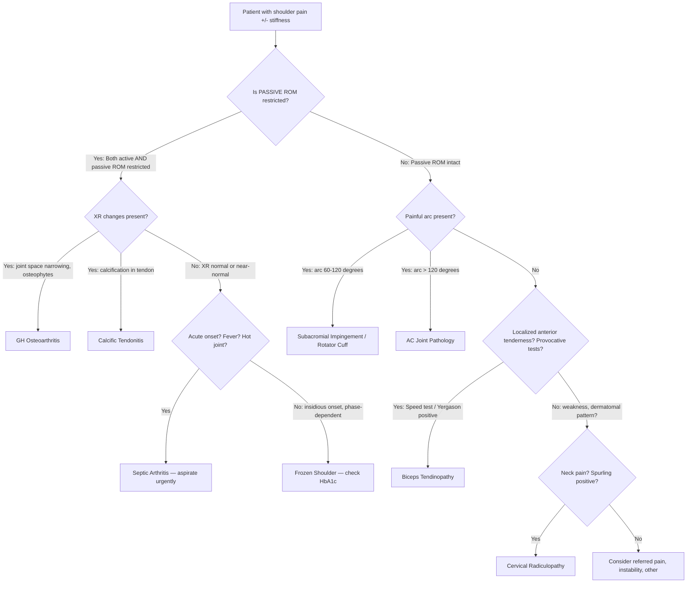

## Differential Diagnosis of Frozen Shoulder

When a patient walks in with a stiff, painful shoulder, you need a systematic framework. The key question is always: **Why is this shoulder restricted?** The answer lies in understanding which structure is at fault — capsule, tendon, bursa, bone, joint surface, or a source outside the shoulder entirely (referred pain).

### The Core Differentiating Principle

Think of it in layers, from the inside out:

1. **Capsular problem** (frozen shoulder, GH arthritis) → both active AND passive ROM restricted
2. **Tendon/motor problem** (rotator cuff tear) → active ROM lost, passive ROM intact
3. **Subacromial problem** (impingement, bursitis) → painful arc, passive ROM usually maintained
4. **Periarticular problem** (AC joint, biceps) → localized tenderness, specific provocative tests
5. **Referred pain** (cervical radiculopathy, cardiac) → shoulder exam may be relatively normal; clues elsewhere

---

### Differential Diagnosis Table

The following conditions should be considered when a patient presents with shoulder pain and/or stiffness. The differentiating features are explained from first principles — i.e., **why** each condition behaves the way it does.

| Diagnosis | Key Differentiating Features | Why? (Pathophysiological Basis) |
|---|---|---|
| **Frozen shoulder (adhesive capsulitis)** | ***Limited active + passive ROM*** [2]; ***DM as risk factor (check Hstix)***; ***symptoms change over time (pain → pain + stiffness → stiffness → resolution)***; ***night pain / rest pain (inflamed capsule)*** [2] | The capsule itself is contracted and fibrosed — it doesn't matter who moves the arm; it won't go past the contracted capsule. Phase-dependent symptoms reflect the inflammatory → fibrotic → remodeling natural history. |
| ***Rotator cuff syndrome (MC)*** [2] | ***Pain during activity only***; ***passive ROM > active ROM***; ***external rotation spared (infraspinatus + teres minor)*** [2]; painful arc 60–120°; impingement signs positive (Neer, Hawkins) | The tendons (motor) are damaged/inflamed, but the capsule (container) is intact. So when the examiner passively moves the arm (bypassing the tendon motor), ROM is full. ER is spared because infraspinatus and teres minor are less commonly affected than supraspinatus. |
| **Rotator cuff tear** | ***Loss of active ROM but intact passive ROM***; ***drop arm sign***; ***muscle atrophy (supraspinatus, infraspinatus)*** [2] | The tendon is torn — the motor is disconnected from the bone. The patient cannot actively lift/rotate the arm, but the capsule is normal, so when you passively move it, it goes through full range. Drop arm sign = complete supraspinatus tear → can't hold arm in abduction against gravity. |
| ***AC joint arthritis*** [2] | ***More localised tenderness*** [2] — specifically over the AC joint (top of shoulder); pain with cross-body adduction (scarf test); high painful arc ( > 120°, not 60–120°) | The AC joint is a separate joint from the GH joint. It sits superficially at the top of the shoulder. Cross-body adduction compresses the AC joint surfaces → pain. The high arc ( > 120°) is because the AC joint only starts moving significantly at higher degrees of abduction. |
| ***Biceps tendinopathy / tendonitis*** [2] | ***More localised tenderness*** [2] — over the bicipital groove (anterior shoulder); pain worsened with contracting biceps (Speed's test, Yergason test); relieved with rest | The long head of biceps tendon runs through the bicipital groove. Inflammation here produces anterior, localized tenderness. Provocative tests specifically load the biceps tendon (Speed's = resisted forward flexion with extended elbow; Yergason = resisted supination with flexed elbow). |
| ***Cervical radiculopathy*** [2] | ***Neck pain, radiating pain, weakness*** [2]; dermatomal sensory loss; may have positive Spurling's test; ***symptoms may overlap and patients can have myeloradiculopathy*** [3] | The pain is referred from the cervical spine (C5/C6 dermatomes overlap the shoulder). The nerve root is compressed (disc herniation, foraminal stenosis), producing radicular symptoms. Shoulder examination itself may be relatively normal (full passive and active ROM), but arm weakness/numbness follows a dermatomal pattern. |
| **Glenohumeral osteoarthritis** | Both active and passive ROM restricted (like frozen shoulder); crepitus on movement; gradual onset in elderly; XR: joint space narrowing, osteophytes, subchondral sclerosis | Articular cartilage degeneration + osteophyte formation physically blocks joint movement (mechanical block, not capsular contracture). Both active and passive ROM are lost because the joint surface is the problem. Differentiating from frozen shoulder: GH OA shows classic XR changes; frozen shoulder XR is typically normal. Note: primary GH OA is uncommon (shoulder is non-weightbearing) — secondary OA (post-traumatic, post-instability, rotator cuff arthropathy) is more common. |
| **Calcific tendonitis** | Acute onset severe pain (can mimic septic arthritis); XR shows calcium deposits in rotator cuff tendons (usually supraspinatus); may co-exist with impingement | Calcium hydroxyapatite crystals deposit within degenerating rotator cuff tendons. When these crystals are released into the subacromial bursa (resorptive phase), they trigger an intense inflammatory reaction — hence the acute, severe pain. XR is diagnostic. |
| **Septic arthritis of the GH joint** | Acute onset; hot, swollen, erythematous joint; fever; markedly restricted ROM (both active and passive due to effusion and pain); raised inflammatory markers | Bacterial infection within the joint triggers massive synovial inflammation and effusion. The effusion creates a tense, painful joint that resists all movement. Unlike frozen shoulder, onset is acute (hours–days, not weeks–months), and systemic signs (fever, ↑WCC, ↑CRP) are present. |
| **Shoulder instability (recurrent dislocation)** | History of dislocation; apprehension test positive; may develop secondary stiffness / ***adhesive capsulitis*** [2] | Repetitive subluxation/dislocation damages the capsulolabral complex (Bankart lesion). Patients guard the shoulder → disuse → secondary capsular contracture. The apprehension test (abduction + ER) reproduces the feeling of impending dislocation — this is NOT seen in primary frozen shoulder. |
| **Referred cardiac pain** | Left shoulder/arm pain; exertional; associated with chest tightness, dyspnoea, diaphoresis; shoulder exam normal | The heart is innervated by visceral afferents entering the spinal cord at T1–T4, which share interneurons with somatic afferents from the shoulder/arm (convergence-projection theory). The brain misinterprets cardiac pain as coming from the shoulder. Always consider in acute left shoulder pain, especially with cardiac risk factors. |

<Callout title="Most Common Cause of Shoulder Pain" type="idea">
***Rotator cuff syndrome is the most common (MC) cause*** of shoulder pain [2]. However, frozen shoulder is the most common cause of a **globally stiff** shoulder. The distinction is: rotator cuff syndrome = pain with activity, passive ROM preserved; frozen shoulder = pain AND stiffness, passive ROM restricted.
</Callout>

---

### Clinical Approach to Differentiating Shoulder Pain — Mermaid Flowchart

The following algorithm organizes the differential based on the **pattern of ROM restriction** — this is the single most powerful discriminator at the bedside.

<Callout title="The ROM Test is King" type="error">
The single most important bedside manoeuvre to narrow the differential is: **test passive ROM.** If passive ROM is restricted, the problem is the joint itself (capsule, joint surface, or effusion). If passive ROM is intact, the problem is the motor (tendon) or an extrinsic source. This one test immediately splits your differential into two halves.
</Callout>

---

### Key Differentiating Special Tests — Quick Reference

| Test | What it tests | Positive in | Why |
|---|---|---|---|
| **Passive ROM in all planes** | Capsular integrity | Frozen shoulder, GH OA, septic arthritis | If the capsule is contracted/effused, passive movement is physically blocked |
| **Neer's sign** | Subacromial impingement | SAIS, rotator cuff tendinopathy | Passive forward flexion with scapula stabilized → compresses supraspinatus under the acromion |
| **Hawkins sign** | Subacromial impingement | SAIS, rotator cuff tendinopathy | 90° flexion + passive IR → rolls greater tuberosity under coracoacromial ligament → impinges cuff |
| **Painful arc (60–120°)** | Subacromial pathology | SAIS, rotator cuff | This is the zone where supraspinatus passes under the acromion; above and below are pain-free |
| **Drop arm sign** | Full-thickness supraspinatus tear | Rotator cuff tear | Cannot eccentrically control arm lowering from 90° abduction — the supraspinatus motor is disconnected |
| **Speed's test** | Biceps tendon | Biceps tendinopathy | Resisted forward flexion with elbow extended and forearm supinated loads the long head of biceps |
| **Yergason test** | Biceps tendon | Biceps tendinopathy | Resisted supination with elbow flexed at 90° loads the biceps at the bicipital groove |
| **Cross-body adduction (Scarf test)** | AC joint | AC joint arthritis | Adduction across body compresses the AC joint surfaces → reproduces localized pain |
| **Apprehension test** | Anterior instability | Recurrent anterior dislocation | Abduction + ER mimics the position of anterior dislocation → patient feels apprehensive |
| **Spurling's test** | Cervical radiculopathy | Cervical disc herniation, foraminal stenosis | Extension + rotation + axial load narrows the neural foramen → reproduces radicular symptoms |

---

### Diagnostic Clues That Point TOWARD Frozen Shoulder (vs Other Diagnoses)

When a patient has a stiff, painful shoulder, the following constellation strongly supports frozen shoulder over the alternatives:

1. **Both active AND passive ROM restricted in a capsular pattern** (ER > ABD > IR)
2. **Insidious onset** (weeks–months, not hours–days)
3. **Phase-dependent symptom progression** (pain → stiffness → improvement)
4. **Night pain** (especially during the freezing phase)
5. **Risk factors present** (DM, thyroid disease, age 40–60, female)
6. **Normal XR** (excludes OA, calcific tendonitis, fracture)
7. **Negative impingement signs** (Neer, Hawkins negative — unless secondary to SAIS)
8. **No systemic signs** (afebrile, normal WCC/CRP — excludes septic arthritis)

---

### Red Flags — When It's NOT Frozen Shoulder

| Red Flag | Think Instead |
|---|---|
| Acute onset ( < 48 hours) with fever, hot swollen joint | **Septic arthritis** — aspirate urgently |
| History of significant trauma | **Fracture or acute rotator cuff tear** — XR first |
| Weight loss, night sweats, bony tenderness | **Malignancy (bone mets, lung apex tumour / Pancoast)** |
| Acute severe pain with calcification on XR | **Acute calcific tendonitis** |
| Weakness in a dermatomal pattern with neck pain | **Cervical radiculopathy** |
| Passive ROM fully intact | **Not a capsular problem** — look for rotator cuff pathology |

<Callout title="Don't Forget Pancoast Tumour">
In Hong Kong, where lung cancer is one of the top cancers, a Pancoast tumour (superior sulcus tumour of the lung apex) can present with shoulder pain + Horner syndrome (ptosis, miosis, anhidrosis) + T1 radiculopathy (hand weakness, medial arm numbness). Always consider this in a smoker with "frozen shoulder" that doesn't fit the classic pattern.
</Callout>

---

<Callout title="High Yield Summary — Differential Diagnosis of Frozen Shoulder">

1. **The key discriminator is passive ROM**: restricted in frozen shoulder (capsular), preserved in rotator cuff pathology (tendon).

2. **Rotator cuff syndrome is the MC cause of shoulder pain** overall — but frozen shoulder is the MC cause of a globally stiff shoulder.

3. **Frozen shoulder vs Rotator cuff**: Frozen = active AND passive ROM loss, no impingement signs, capsular pattern. Rotator cuff = active ROM loss only, passive intact, impingement signs positive, drop arm sign.

4. **AC joint pathritis**: localized tenderness at AC joint, high arc ( > 120°), positive cross-body adduction (Scarf test).

5. **Biceps tendinopathy**: localized anterior tenderness at bicipital groove, positive Speed's/Yergason tests.

6. **Cervical radiculopathy**: neck pain, radiating dermatomal pain/weakness, positive Spurling's test, shoulder ROM may be normal.

7. **Septic arthritis**: acute onset, fever, hot joint — a surgical emergency. Must exclude in any acutely painful, restricted shoulder.

8. **GH OA**: both active and passive ROM restricted (like frozen shoulder), BUT XR shows joint space narrowing/osteophytes.

9. **Always check HbA1c** in confirmed frozen shoulder to screen for DM.

</Callout>

---

<ActiveRecallQuiz
  title="Active Recall - Differential Diagnosis of Frozen Shoulder"
  items={[
    {
      question: "A 55-year-old woman has shoulder pain and stiffness. Active abduction is 80 degrees and passive abduction is also 80 degrees. ER is 20 degrees actively and passively. Neer and Hawkins signs are negative. XR is normal. What is the most likely diagnosis and why?",
      markscheme: "Frozen shoulder (adhesive capsulitis). Both active AND passive ROM are restricted equally in a capsular pattern (ER most limited). Negative impingement signs exclude subacromial pathology. Normal XR excludes GH OA or calcific tendonitis. The capsule itself is contracted."
    },
    {
      question: "How do you differentiate rotator cuff syndrome from frozen shoulder at the bedside using one key test? Explain the underlying reason.",
      markscheme: "Test passive ROM. In rotator cuff syndrome, passive ROM is intact (the capsule/container is normal; only the tendon/motor is damaged). In frozen shoulder, passive ROM is restricted (the capsule itself is contracted/fibrosed). This is because in rotator cuff pathology the examiner bypasses the damaged motor when moving the arm passively."
    },
    {
      question: "Name three conditions that can cause BOTH active AND passive ROM restriction of the shoulder and state how to differentiate them.",
      markscheme: "1. Frozen shoulder - insidious onset, normal XR, capsular thickening on MRI; 2. GH osteoarthritis - XR shows joint space narrowing, osteophytes, subchondral sclerosis/cysts; 3. Septic arthritis - acute onset, fever, hot swollen joint, raised inflammatory markers. Differentiate by onset (acute vs insidious), systemic signs, and XR/MRI findings."
    },
    {
      question: "A patient has shoulder pain with a painful arc between 60 and 120 degrees. Passive ROM is full. What is the likely diagnosis and what is the anatomical explanation for the painful arc?",
      markscheme: "Subacromial impingement syndrome (SAIS). The supraspinatus tendon passes through the subacromial space. Between 60-120 degrees of abduction, the greater tuberosity and supraspinatus tendon are maximally compressed under the acromion. Below 60 and above 120 degrees, the tendon is not impinged, so movement is pain-free."
    },
    {
      question: "List three red flag features that should make you reconsider a diagnosis of frozen shoulder.",
      markscheme: "Any three of: 1. Acute onset with fever/hot joint (septic arthritis); 2. Significant trauma history (fracture/acute rotator cuff tear); 3. Weight loss/night sweats/bony tenderness (malignancy/Pancoast tumour); 4. Passive ROM fully intact (not a capsular problem - think rotator cuff); 5. Dermatomal weakness and neck pain (cervical radiculopathy)."
    }
  ]}
/>

## References

[1] Lecture slides: GC 236. Common Shoulder Problems [Updated in 2025].pdf (p110–p112, p114, p116, p119)
[2] Senior notes: maxim.md (sections 3.3, 3.5, 3.6)
[3] Lecture slides: GC 227. Cervical Spine Pathology.pdf (p44)
