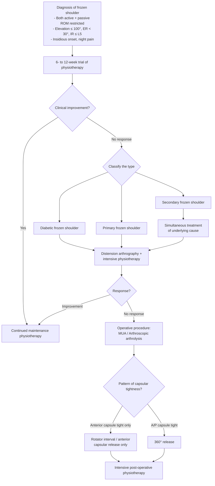
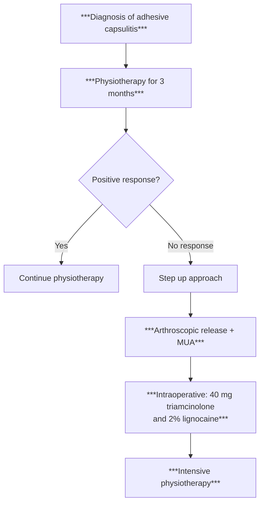

## Diagnostic Criteria for Frozen Shoulder

### Why Frozen Shoulder is Primarily a Clinical Diagnosis

There is no single blood test, imaging finding, or pathological criterion that "confirms" frozen shoulder the way, say, the Jones criteria confirm rheumatic fever. Frozen shoulder is diagnosed **clinically** — by recognizing a characteristic pattern of symptoms, signs, and temporal evolution, then **excluding** other pathologies that mimic it. Investigations serve to support the diagnosis, exclude mimics, and identify underlying causes (especially DM).

Think of it this way: the capsule is contracted — you can *feel* this on examination (restricted passive ROM). No investigation tells you this better than your hands.

---

### Diagnostic Criteria

The diagnosis rests on satisfying ALL of the following:

***Definition of frozen shoulder*** [1]:
1. ***Loss of both active and passive ROM***
2. ***Symptom of true shoulder pain and night pain of insidious onset***
3. ***Painful restriction of active and passive movement, with passive movement limited to 100° elevation, external rotation < 30°, and internal rotation limited to L5 or less*** [1]

These thresholds are critical — let's understand why each matters:

| Criterion | Threshold | Why This Specific Value? |
|---|---|---|
| **Elevation (flexion/abduction)** | ***≤ 100°*** | Normal elevation is ~170–180°. The inferior capsule (axillary recess) and anteroinferior capsule contract → physically blocks elevation beyond ~100°. Losing nearly half of elevation indicates significant capsular contracture. |
| **External rotation** | ***< 30°*** | Normal ER is ~60–90°. The ***anterosuperior capsule (RI, SGHL, CHL)*** contracts earliest and most severely → ER is the first and most restricted movement. < 30° represents > 50% loss. [1] |
| **Internal rotation** | ***Limited to L5 or less*** | Normal IR allows the hand to reach T5–T7 (mid-thoracic spine). ***Posterior capsule*** contracts → limits IR. L5 means the patient can barely reach the low back — severe restriction. [1] |

<Callout title="Exam Tip — Know the Thresholds">
The specific numbers (elevation ≤ 100°, ER < 30°, IR ≤ L5) are directly from the lecture slides and are commonly tested. They also appear in the Robinson et al. (JBJS 2012) diagnostic algorithm used in the lecture. If a clinical vignette gives you ROM values, compare them against these thresholds.
</Callout>

### Additional Diagnostic Requirements

Beyond the ROM thresholds, you must confirm:

- **Insidious onset** — not acute (excludes fracture, acute rotator cuff tear, septic arthritis)
- **Night pain** — characteristic of the freezing phase (inflamed capsule)
- **Exclusion of other pathology** — normal XR (excludes OA, calcific tendonitis, fracture); negative impingement signs (excludes SAIS); no systemic signs (excludes infection)

---

### Physical Examination Findings — Localizing the Capsular Contracture

***Physical findings depend on which structures are involved*** [1]:

| Structure Involved | Movement Restricted | How to Test |
|---|---|---|
| ***Rotator interval*** | ***Limited ER in adducted arm*** | Arm at side (adducted), elbow at 90° → passively externally rotate. Compare with contralateral side. |
| ***Anteroinferior capsule*** | ***Limited ER in abducted arm*** | Arm abducted to 90° → passively externally rotate. If restricted here but not in adduction, the anteroinferior capsule (IGHL anterior band) is primarily involved. |
| ***Posterior capsule*** | ***Limited adduction and IR*** | Test passive IR (hand behind back) and cross-body adduction. |
| ***Extra-articular structures*** | ***Global stiffness*** | All movements restricted equally — suggests involvement beyond just the capsule (e.g., subacromial adhesions, deltoid fibrosis). |

**Why does this matter?** It matters for **surgical planning** — if only the anterior capsule is tight, you only need to release the anterior capsule/rotator interval. If everything is tight, you need a ***360° release*** [1]. More on this in the management section.

***Special tests to rule out other pathologies*** [1] — this is a crucial part of the diagnostic process:

| Test | Purpose | If Positive, Consider Instead |
|---|---|---|
| Neer's impingement sign | Subacromial impingement | SAIS — secondary frozen shoulder may co-exist |
| Hawkins sign | Subacromial impingement | SAIS |
| Drop arm test | Full-thickness rotator cuff tear | Rotator cuff tear (passive ROM should be intact) |
| Speed's test / Yergason test | Biceps tendinopathy | Biceps pathology |
| Cross-body adduction (Scarf test) | AC joint pathology | AC joint arthritis |
| Spurling's test | Cervical radiculopathy | Cervical spine pathology |
| Apprehension / relocation test | GH instability | Instability → secondary stiffness |

<Callout title="Important Clinical Principle" type="error">
A positive special test does NOT exclude frozen shoulder — it may indicate the **cause** of a secondary frozen shoulder. For example, a patient with SAIS (positive Neer/Hawkins) who guards their shoulder for months may develop secondary adhesive capsulitis. The frozen shoulder is then a complication of the impingement. You must treat BOTH the underlying cause AND the capsular contracture.
</Callout>

---

### Lecture Slide Clinical Vignette — Worked Example

The lecture slides present a case [1]:

***"Complained of right shoulder stiffness at 4 months, although physiotherapy all along"*** [1]

***ROM findings*** [1]:
- ***Limited in both active and passive direction***
- ***Forward flexion: 90°***
- ***Abduction: 90°***
- ***External rotation: 10°***
- ***Internal rotation: L3***

Let's apply the diagnostic criteria:
- Elevation (FF 90°, ABD 90°) → **≤ 100°** ✓
- ER 10° → **< 30°** ✓
- IR L3 → **≤ L5** ✓ (L3 is actually slightly better than L5 in terms of reaching higher, but note L3 is still well below normal T5–T7)
- Both active and passive restricted ✓
- Occurred post-operatively despite physiotherapy → ***Secondary adhesive capsulitis*** [1]

**Diagnosis: Secondary adhesive capsulitis** ✓

---

## Diagnostic Algorithm

The following algorithm is adapted from the ***Robinson CM et al., JBJS 2012*** algorithm presented in the lecture slides [1], combined with the updated 2025 stepwise approach [1].

### Robinson Algorithm (Lecture Slide)

### Updated 2025 Stepwise Approach (Lecture Slide)

The lecture slides also present a simplified updated pathway [1]:

<Callout title="Key Algorithm Points from Lecture Slides">

1. ***Physiotherapy is first-line for all types*** — trial for ***3 months*** (updated 2025) or ***6–12 weeks*** (Robinson 2012) [1]

2. ***If no response → step up to arthroscopic release + MUA*** [1]

3. ***Intraoperative injection: 40 mg triamcinolone and 2% lignocaine*** — triamcinolone (a potent long-acting corticosteroid) reduces post-operative inflammation; lignocaine provides immediate post-operative analgesia to facilitate early mobilization [1]

4. ***Intensive post-operative physiotherapy*** is essential — if the patient doesn't move early, the capsule will scar down again [1]

5. ***For secondary frozen shoulder: simultaneously treat the underlying cause*** (e.g., rotator cuff repair, treat DM) [1]

6. ***Surgical decision depends on pattern of tightness***: anterior capsule tight only → rotator interval/anterior release; A/P capsule tight → ***360° release*** [1]

</Callout>

---

## Investigation Modalities

Investigations in frozen shoulder serve three purposes:
1. **Confirm the diagnosis** (support clinical findings)
2. **Exclude mimics** (OA, rotator cuff tear, calcific tendonitis, fracture, infection, tumour)
3. **Screen for associated conditions** (DM, thyroid disease)

### Blood Investigations

| Investigation | Purpose | Key Findings / Interpretation |
|---|---|---|
| **HbA1c / Fasting glucose** [2] | Screen for DM — the strongest associated condition | HbA1c ≥ 6.5% or FG ≥ 7.0 mmol/L = diabetes. HbA1c 5.7–6.4% = prediabetes. Finding DM changes management (diabetic frozen shoulder is more refractory, may need earlier surgical intervention). |
| **Thyroid function tests (TFTs)** | Screen for thyroid disease | TSH ↑ with low fT4 = hypothyroidism; TSH ↓ with high fT3/fT4 = hyperthyroidism. Both associated with frozen shoulder (altered connective tissue metabolism). |
| **FBC, CRP, ESR** | Exclude infection / inflammatory arthritis | Should be normal in frozen shoulder. If elevated → consider septic arthritis, inflammatory arthropathy (RA, crystal arthropathy). |
| **Urate, RF, Anti-CCP** | If inflammatory arthritis suspected | Gout, RA as secondary causes of shoulder stiffness |
| **Fasting lipid profile** | Screen for hyperlipidaemia | Associated risk factor; also part of cardiovascular risk assessment in a patient likely to have DM |

<Callout title="Always Check HbA1c" type="error">
This cannot be overstated. In Hong Kong, with ~10% diabetes prevalence in adults, frozen shoulder may be the **presenting complaint** of undiagnosed type 2 DM. Missing this is both a clinical and exam mistake. The management algorithm from the lecture specifically separates ***diabetic frozen shoulder*** as a distinct category [1] — you cannot categorize the patient correctly without knowing their glycaemic status.
</Callout>

### Imaging Investigations

#### 1. Plain Radiograph (XR Shoulder)

**Views**: AP (in internal and external rotation) + axillary lateral (or Y-view)

**Purpose**: ***Rule out AC pathology*** [2] and other bony/articular causes of stiffness

| Finding | Interpretation |
|---|---|
| **Normal** | Supports diagnosis of frozen shoulder (expected finding) |
| Joint space narrowing + osteophytes + subchondral sclerosis | GH osteoarthritis — NOT frozen shoulder |
| Calcification in supraspinatus tendon | Calcific tendonitis — may co-exist or be a cause of secondary stiffness |
| ↓ Acromiohumeral distance ( < 7 mm) | Proximal migration of humeral head → rotator cuff arthropathy (massive cuff tear) |
| Fracture | Post-traumatic stiffness, not primary frozen shoulder |
| Osteolysis of distal clavicle | AC joint pathology |
| Osteopenia of humeral head | Disuse osteopenia — supports prolonged immobility (seen in chronic frozen shoulder) |
| Bony lesion (lytic/sclerotic) | Tumour, metastasis — red flag |

**Why do we get XR if it's usually normal?** Because the consequences of missing OA, fracture, tumour, or calcific tendonitis are significant. XR is cheap, quick, and widely available. It is a **screening/exclusion** tool, not a confirmation tool.

#### 2. MRI Shoulder

**The key confirmatory imaging modality** — also the gold standard for evaluating capsular pathology and excluding secondary causes.

***MRI Findings in frozen shoulder*** [1]:

| Finding | Threshold | Significance |
|---|---|---|
| ***CHL thickness*** | ***> 4 mm*** *(normal ~2.7 mm; frozen shoulder ~4.1 mm)* | The CHL is the "check-rein" on ER. Thickening here is the most consistent MRI sign. It correlates with severity of ER restriction. |
| ***Capsule thickness*** | ***> 7 mm*** *(normal ~4.5 mm; frozen shoulder ~7.1 mm)* | Diffuse capsular thickening — reflects the fibrotic process throughout the joint capsule |
| ***Smaller axillary recess*** | Reduced volume / obliterated | The axillary recess is the inferior redundant fold of capsule that normally allows abduction. When it's obliterated by fibrosis, abduction is physically blocked. |
| Capsular enhancement (gadolinium) | Increased enhancement in freezing phase | Active inflammation with hypervascularity — corresponds to the freezing (pain) phase. Less enhancement in the frozen/thawing phases. |
| Rotator interval thickening/fibrosis | Obliteration of the fat triangle in the RI | The RI fat normally appears as a bright triangle on T1-weighted images. In frozen shoulder, this is replaced by thickened, fibrotic tissue. |
| ***Other pathologies causing frozen shoulder*** [1] | Rotator cuff tear, labral tear, SAIS, etc. | MRI simultaneously evaluates for secondary causes — this is why it's the preferred advanced imaging modality |

*(Mengiardi et al., Radiology, 2004)* [1]

**Why is MRI not always necessary?**
- If the clinical picture is classic (typical history, capsular pattern of restriction, risk factors present, normal XR), MRI may not change management
- MRI is most useful when:
  - The diagnosis is uncertain
  - Secondary frozen shoulder is suspected (need to identify the underlying cause)
  - Pre-operative planning (before arthroscopic release — need to know what else is going on in the joint)
  - Medicolegal context (post-traumatic/post-surgical cases)

#### 3. Ultrasound (USG Shoulder)

| Finding | Interpretation |
|---|---|
| CHL thickening ( > 4 mm) | Supports diagnosis — but less sensitive/specific than MRI |
| Increased vascularity on Doppler | Active inflammation (freezing phase) |
| Normal rotator cuff tendons | Helps exclude rotator cuff tear as a cause |
| Dynamic assessment | Can assess real-time movement restriction; detects impingement dynamically |

**Advantages**: No radiation, cheaper than MRI, widely available, allows dynamic assessment.
**Disadvantages**: Operator-dependent, cannot assess deep structures (labrum, posterior capsule) as well as MRI, limited soft tissue contrast.

#### 4. Arthrography (Historical / Therapeutic)

| Finding | Interpretation |
|---|---|
| Reduced joint capacity ( < 10 mL vs normal 15–20 mL) | Contracted capsule — classic finding. Historically used for diagnosis. |
| Obliterated axillary recess | Inferior capsule contracted |
| Irregular capsular filling | Adhesions |

**Now primarily therapeutic** — distension arthrography (hydrodilatation) involves injecting a volume of saline + steroid + local anaesthetic under fluoroscopic or ultrasound guidance to physically distend and rupture the contracted capsule. It is used in the Robinson algorithm as a treatment step for cases not responding to physiotherapy [1].

#### 5. Arthroscopy (Diagnostic + Therapeutic)

Not used purely for diagnosis, but intraoperative findings confirm:
- Thickened, inflamed synovium (especially at rotator interval)
- Contracted capsule with reduced joint volume
- Adhesions in the axillary recess
- Rule out or treat concomitant pathology (labral tear, loose bodies, rotator cuff tear)

---

### Investigation Summary Table

| Investigation | When to Order | Key Finding in Frozen Shoulder | Primary Purpose |
|---|---|---|---|
| **HbA1c** | **Always** | May reveal undiagnosed DM | Screen for DM |
| **TFTs** | Always | May reveal thyroid disease | Screen for thyroid |
| **FBC, CRP, ESR** | If infection/inflammation suspected | Normal in frozen shoulder | Exclude septic arthritis / inflammatory arthritis |
| **XR shoulder** [2] | **Always (first-line imaging)** | Usually **normal** | Exclude OA, fracture, calcification, tumour |
| ***MRI shoulder*** [1][2] | If diagnosis uncertain, secondary cause suspected, or pre-operative | ***CHL > 4 mm, capsule > 7 mm, smaller axillary recess*** | Confirm capsular pathology, identify secondary causes |
| **USG shoulder** | Alternative to MRI; if rotator cuff tear suspected | CHL thickening, normal cuff | Dynamic assessment, exclude cuff tear |
| **Arthrography** | Therapeutic (hydrodilatation) | Reduced joint capacity < 10 mL | Therapeutic distension |

<Callout title="Investigation Approach — First Principles">
Think of it in order:
1. **Blood tests first** — HbA1c (always), TFTs, inflammatory markers if needed
2. **XR shoulder** — quick, cheap, excludes bony pathology (the "screening" step)
3. **MRI shoulder** — if diagnosis uncertain, secondary cause suspected, or pre-operative planning (the "definitive" step)

The diagnosis is CLINICAL. Investigations support, exclude, and screen — they don't make the diagnosis.
</Callout>

---

### Distinguishing Primary vs Secondary Frozen Shoulder — Investigation Approach

| | Primary (Idiopathic) | Secondary |
|---|---|---|
| **History** | No precipitant; risk factors (DM, thyroid, female, 40–60) | Identifiable precipitant (trauma, surgery, rotator cuff disease) |
| **XR** | Normal | May show calcification, cuff arthropathy, post-surgical changes |
| **MRI** | Capsular thickening only | Capsular thickening + underlying pathology (cuff tear, labral tear, etc.) |
| **Blood tests** | HbA1c may be elevated (undiagnosed DM) | Depends on cause |
| **Management implication** | Treat the frozen shoulder | ***Simultaneous treatment of underlying cause*** [1] |

---

<Callout title="High Yield Summary — Diagnosis of Frozen Shoulder">

1. **Frozen shoulder is a clinical diagnosis** based on: insidious onset of shoulder pain + night pain + restriction of BOTH active AND passive ROM with elevation ≤ 100°, ER < 30°, IR ≤ L5.

2. **Physical findings depend on which capsular structures are involved**: RI → limited ER in adduction; anteroinferior → limited ER in abduction; posterior → limited IR and adduction; extra-articular → global stiffness.

3. **Special tests are used to EXCLUDE other pathologies** (Neer/Hawkins for impingement, Drop arm for cuff tear, Speed/Yergason for biceps, Scarf test for ACJ, Spurling for cervical radiculopathy).

4. **Always order**: HbA1c (screen DM), XR shoulder (exclude bony pathology). Order MRI if diagnosis uncertain or secondary cause suspected.

5. **MRI criteria**: CHL > 4 mm, capsule > 7 mm, smaller axillary recess (Mengiardi et al., 2004).

6. **Diagnostic algorithm (Robinson 2012 / Updated 2025)**: Physiotherapy trial (3 months) → if no response → classify (diabetic / primary / secondary) → distension arthrography or step up → if no response → operative (MUA / arthroscopic release based on pattern of tightness: anterior only vs 360°).

7. **For secondary frozen shoulder**: must identify AND simultaneously treat the underlying cause.

8. **XR is usually normal** in frozen shoulder — that's the expected finding. Its role is exclusion, not confirmation.

</Callout>

---

<ActiveRecallQuiz
  title="Active Recall - Diagnostic Criteria, Algorithm and Investigations for Frozen Shoulder"
  items={[
    {
      question: "State the three ROM thresholds in the diagnostic definition of frozen shoulder from the lecture slides.",
      markscheme: "Passive elevation limited to 100 degrees or less; external rotation less than 30 degrees; internal rotation limited to L5 or less. All must be restricted in both active AND passive directions."
    },
    {
      question: "A patient with frozen shoulder has limited ER in adduction but preserved ER in abduction. Which capsular structure is primarily involved and why?",
      markscheme: "The rotator interval (RI) / anterosuperior capsule (SGHL, CHL) is primarily involved. This structure limits ER specifically in the adducted position. The anteroinferior capsule (IGHL anterior band) limits ER in abduction, which is preserved in this case."
    },
    {
      question: "In the Robinson JBJS 2012 algorithm, what is the first-line treatment and what determines the type of surgical release if conservative treatment fails?",
      markscheme: "First-line: 6-12 week trial of physiotherapy. If conservative treatment fails, the pattern of capsular tightness determines surgery: anterior capsule tight only leads to rotator interval or anterior capsular release only; anteroposterior capsule tight leads to 360 degree release."
    },
    {
      question: "List three key MRI findings in frozen shoulder with their diagnostic thresholds and explain why CHL thickening correlates with loss of external rotation.",
      markscheme: "CHL greater than 4 mm, capsule thickness greater than 7 mm, smaller or obliterated axillary recess. The CHL is the roof of the rotator interval and acts as a check-rein on external rotation. When it thickens and fibroses, it physically prevents the humeral head from rotating externally."
    },
    {
      question: "Why is XR shoulder ordered in suspected frozen shoulder even though the expected finding is normal?",
      markscheme: "XR is an exclusion tool, not a confirmation tool. It is ordered to rule out other causes of shoulder stiffness: GH osteoarthritis (joint space narrowing, osteophytes), calcific tendonitis (calcium deposits), fracture, rotator cuff arthropathy (decreased acromiohumeral distance), and tumour (lytic or sclerotic lesions). A normal XR supports but does not confirm the diagnosis."
    },
    {
      question: "In the updated 2025 stepwise approach from the lecture, what intraoperative adjuncts are given during arthroscopic release and MUA, and what is the rationale for each?",
      markscheme: "40 mg triamcinolone (potent long-acting corticosteroid to reduce post-operative inflammation and prevent re-adhesion) and 2 percent lignocaine (local anaesthetic providing immediate post-operative analgesia to facilitate early mobilization, which is critical to prevent recurrence of stiffness)."
    }
  ]}
/>

## References

[1] Lecture slides: GC 236. Common Shoulder Problems [Updated in 2025].pdf (p90, p108, p110–p112, p114–p116, p119, p121, p131)
[2] Senior notes: maxim.md (sections 3.3, 3.6)
