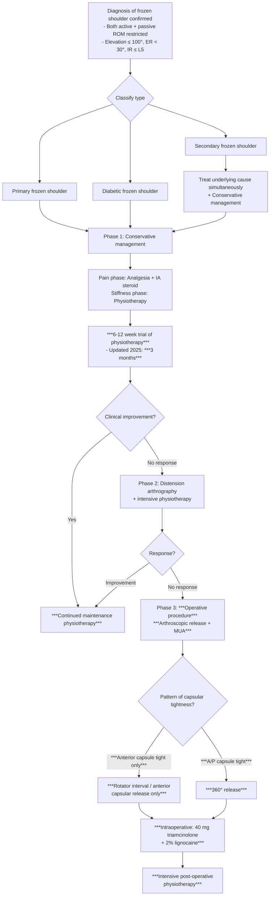

## Management of Frozen Shoulder

### Guiding Principles — Understanding the "Why" Before the "What"

Before diving into specific treatments, let's establish the principles that drive management decisions. Every treatment choice in frozen shoulder is dictated by **which phase the patient is in** and **what type of frozen shoulder** they have.

**Principle 1: Phase determines treatment**
- **Freezing phase (pain-dominant)** → the capsule is actively inflamed. Goal: **reduce inflammation and pain**. Aggressive stretching during this phase is counterproductive — it inflames an already inflamed capsule, worsening pain and potentially accelerating fibrosis.
- **Frozen/Thawing phase (stiffness-dominant)** → inflammation has subsided, fibrosis dominates. Goal: **restore ROM through stretching and mobilization**. Steroids have limited benefit now because there's little active inflammation left — the problem is mechanical (fibrotic scar tissue).

**Principle 2: Type determines the pathway**
- ***Diabetic frozen shoulder***: more refractory, may need earlier escalation [1]
- ***Primary frozen shoulder***: standard stepwise approach [1]
- ***Secondary frozen shoulder***: ***simultaneous treatment of underlying cause*** is mandatory [1] — if you only treat the stiffness but not the rotator cuff tear/SAIS that caused it, the shoulder will stiffen again

**Principle 3: Conservative first, operative if failed**
- ***No consensus in management of adhesive capsulitis*** [1] — this is explicitly stated in the lecture. There is no single "correct" protocol. However, the general approach is universally stepwise.

***"PREVENTION: Best treatment for post-traumatic shoulder stiffness"*** [1]:
- ***Early mobilization*** [1]
- ***Adequate pain relief*** [1]

<Callout title="Prevention is Better Than Cure">
The lecture explicitly emphasizes that the best treatment for post-traumatic/post-operative shoulder stiffness is **prevention** — through early mobilization and adequate pain relief. This applies after any shoulder surgery, humeral fracture, breast surgery, or prolonged immobilization. If a patient is in a sling post-fracture, start gentle pendulum exercises as soon as pain allows.
</Callout>

---

### Master Management Algorithm

This integrates the ***Robinson CM et al., JBJS 2012*** algorithm and the ***updated 2025 stepwise approach*** from the lecture slides [1][2]:

---

## Treatment Modalities

### A. Conservative Management (First Line)

#### A1. Analgesia

| Modality | Details | When to Use | Mechanism / Rationale |
|---|---|---|---|
| **Oral NSAIDs** | e.g., ibuprofen, naproxen, celecoxib | Freezing phase (pain-dominant) | Inhibit COX enzymes → ↓ prostaglandin synthesis → ↓ inflammation and pain in the capsule. Useful as first-line for mild–moderate pain. |
| **Paracetamol** | 1 g QDS (max 4 g/day) | Adjunct for pain | Central analgesic mechanism; minimal anti-inflammatory effect but safe and well-tolerated |
| **Oral corticosteroids** | Short course (e.g., prednisolone taper over 2–3 weeks) | Severe freezing phase with significant night pain | Systemic anti-inflammatory effect. Can provide rapid pain relief but limited duration of benefit. Caution in diabetics — will worsen glycaemic control. |

**Why do we focus on pain control in the freezing phase?** Because pain causes guarding → guarding causes immobility → immobility accelerates capsular fibrosis. Breaking the pain cycle with adequate analgesia allows the patient to tolerate gentle movement and prevents the "disease-disuse" spiral.

#### A2. Intra-articular Corticosteroid Injection

***Intra-articular steroid (at rotator interval): only during the pain phase*** [2]

| Aspect | Details |
|---|---|
| **Drug** | Typically triamcinolone acetonide 40 mg or methylprednisolone 40 mg + local anaesthetic (e.g., 1% lidocaine) |
| **Injection site** | ***Rotator interval*** — the triangular space between supraspinatus and subscapularis, directly accessing the GH joint capsule [2]. This is the most commonly affected area and provides direct access to the intra-articular space. |
| **Guidance** | Landmark-guided (posterior approach) or ultrasound-guided (increases accuracy to > 90%) |
| **Timing** | ***Only during the pain (freezing) phase*** [2] — when active inflammation is present. During the frozen/thawing phase, there is minimal inflammation, so steroid has little target to act on. |
| **Effect** | Reduces synovial inflammation → ↓ pain → allows earlier physiotherapy. Studies show benefit at 6 weeks but effect wanes by 12 weeks. |
| **Limitations** | Temporary benefit; does not address fibrosis; repeated injections ( > 3) may cause tendon weakening, cartilage damage, infection risk |

<Callout title="Why Inject at the Rotator Interval?" type="idea">
The rotator interval (RI) is the space between supraspinatus and subscapularis tendons. It contains the CHL and SGHL — the structures most consistently involved in frozen shoulder pathology. Injecting here delivers the steroid directly to the epicentre of capsular inflammation. Additionally, the RI is a "free space" without overlying rotator cuff tendons, providing safe needle access to the glenohumeral joint [2].
</Callout>

**Contraindications to intra-articular steroid injection:**
- Active joint infection (septic arthritis) — **absolute** contraindication. Steroid suppresses immunity → catastrophic joint destruction
- Overlying skin infection / cellulitis
- Uncontrolled diabetes (relative) — steroid will spike blood glucose for 24–48 hours; warn patient and monitor
- Known hypersensitivity to the corticosteroid preparation
- Coagulopathy / anticoagulation (relative) — risk of haemarthrosis
- Previous lack of response to injection — unlikely to benefit from repeated attempts

#### A3. Physiotherapy (PT)

***PT: after inflammation / pain subsides*** [2]

| Phase | PT Approach | Rationale |
|---|---|---|
| **Freezing (pain phase)** | Gentle pendulum exercises ("Codman exercises"), isometric exercises within pain-free range. NO aggressive stretching. | The capsule is actively inflamed. Aggressive stretching inflames it further → more pain → more guarding → worse outcome. Gentle pendulum exercises use gravity to passively move the joint without stressing the capsule. |
| **Frozen (stiffness phase)** | Progressive passive stretching, joint mobilization (Maitland grades III–IV), active-assisted ROM exercises, pulley exercises | Inflammation has subsided. The capsule is fibrosed but no longer actively inflamed. Stretching is tolerated and beneficial — it physically elongates the contracted collagen. |
| **Thawing phase** | Active ROM exercises, strengthening (rotator cuff, scapular stabilizers, deltoid), functional rehabilitation | The capsule is remodeling. Strengthening the muscles around the shoulder restores dynamic stability and prevents recurrence. Muscle wasting from months of disuse must be addressed. |

**Key PT techniques explained:**
- **Pendulum (Codman) exercises**: Patient bends forward at the waist, lets the affected arm hang, and gently swings it in circles. Gravity provides the mobilizing force — no muscular effort required. Safe even in the freezing phase.
- **Passive stretching**: The physiotherapist (or the patient using the contralateral hand, pulleys, or a wand) moves the shoulder to end-range and holds. This creates sustained tensile stress on the capsular collagen → gradual plastic deformation → increased ROM.
- **Joint mobilization (Maitland)**: Graded oscillatory movements applied to the GH joint. Grade III (large amplitude into resistance) and Grade IV (small amplitude at end-range) are used to stretch the capsule.
- **Strengthening**: Rotator cuff strengthening (especially external rotators — infraspinatus, teres minor) and scapular stabilizers (serratus anterior, lower trapezius) restore the force couples around the shoulder.

#### A4. Other Conservative Modalities

| Modality | Details | Evidence |
|---|---|---|
| **Heat therapy** | Before PT sessions — increases tissue extensibility, reduces pain | Improves effectiveness of stretching by making collagen more pliable |
| **TENS (Transcutaneous Electrical Nerve Stimulation)** | Electrode patches applied to shoulder; electrical pulses stimulate sensory nerves | Gate control theory — non-painful afferent input "closes the gate" on pain transmission. Adjunct for pain management. |
| **Acupuncture** | Traditional Chinese medicine approach, popular in Hong Kong | Limited evidence; some RCTs show modest short-term pain benefit |
| **Sodium hyaluronate injection** | Intra-articular viscosupplementation | Limited evidence in frozen shoulder (better studied in OA). May provide some lubrication. |

---

### B. Intermediate / Escalation Therapy

#### B1. Distension Arthrography (Hydrodilatation)

***Distension arthrography + intensive physiotherapy*** [1]

| Aspect | Details |
|---|---|
| **Technique** | Under fluoroscopic or ultrasound guidance, a large volume of saline (30–50 mL) mixed with corticosteroid (e.g., 40 mg triamcinolone) and local anaesthetic (e.g., 10 mL 1% lidocaine) is injected into the GH joint until capsular rupture is felt/seen |
| **Mechanism** | The injected volume physically distends and ruptures the contracted capsule (especially the axillary recess and rotator interval), breaking adhesions. The steroid reduces post-procedure inflammation, and the anaesthetic provides immediate pain relief for PT. |
| **Indication** | ***No response to 6–12 weeks of physiotherapy*** [1]; preferred in the Robinson algorithm as the step between conservative PT and surgery |
| **Must follow with** | ***Intensive physiotherapy*** — immediately after, while the capsule is disrupted and before it scars down again |
| **Contraindications** | Active infection, contrast allergy (if contrast used), coagulopathy, severe osteoporosis (fracture risk during distension) |

**Why does hydrodilatation work?** Think of the contracted capsule as a deflated, stiff balloon. By injecting a large volume of fluid, you inflate the balloon past its elastic limit → the walls crack and tear → the balloon becomes larger and more compliant. The key is to then move the shoulder immediately (intensive PT) to prevent the tears from healing in a contracted position again.

#### B2. Suprascapular Nerve Block

| Aspect | Details |
|---|---|
| **Technique** | USG-guided injection of local anaesthetic ± steroid around the suprascapular nerve at the suprascapular notch |
| **Mechanism** | The suprascapular nerve (C5, C6) provides ~70% of the sensory innervation to the posterior GH joint capsule. Blocking it provides significant pain relief, enabling more effective PT. |
| **Indication** | Adjunct in the freezing phase when pain is severe and limiting PT participation |
| **Contraindications** | Infection at injection site, coagulopathy, known hypersensitivity |

---

### C. Operative Management

***Arthroscopic capsular release is one of the options*** [1]

**General Indications for Surgery** [1][2]:
- ***Stiffness fails to improve after conservative management for 6 months*** [2] (Robinson 2012 algorithm)
- ***Updated 2025: Consider when conservative treatments fail at 3 months*** [1]
- Significant functional impairment despite adequate conservative trial
- Diabetic frozen shoulder refractory to distension arthrography

<Callout title="When to Operate — Timing Has Evolved" type="error">
The traditional teaching was to wait 6 months of failed conservative treatment before operating [2]. The updated 2025 lecture slides suggest considering operative intervention earlier — ***at 3 months*** if there is no response to physiotherapy [1]. This shift reflects evidence that prolonged stiffness leads to worse outcomes and that earlier intervention in selected patients can improve results. However, ***no consensus exists*** [1] — clinical judgment remains key.
</Callout>

#### C1. Manipulation Under Anaesthesia (MUA)

| Aspect | Details |
|---|---|
| **Technique** | Under general anaesthesia (± interscalene nerve block for post-operative analgesia), the surgeon manually forces the shoulder through progressively increasing ROM — flexion, abduction, ER, IR — to break adhesions and rupture the contracted capsule. |
| **Mechanism** | Brute-force disruption of the fibrosed capsule. The capsule literally tears at its weakest points (usually the axillary recess and anteroinferior capsule). |
| **Advantages** | Quick, simple, no incision, minimal equipment needed |
| **Disadvantages / ***Complications*** [2]** | **Uncontrolled** capsular disruption — you can't see what you're tearing. Risks: ***fracture (especially during ER)*** [2] — the osteoporotic humerus (from disuse) can fracture during forceful rotation; rotator cuff tear; labral tear; brachial plexus stretch injury; haemarthrosis; dislocation |

**Why is fracture risk highest during ER?** During forced ER, the anterosuperior capsule (the tightest structure) acts as a fulcrum on the humeral head. If the capsule resists tearing, the torque transfers to the bone — the proximal humerus (especially if osteoporotic from months of disuse) fractures, typically at the surgical neck. This is the most feared complication of MUA.

**Contraindications to MUA:**
- Significant osteoporosis (high fracture risk)
- Recent fracture (< 3 months)
- GH instability (risk of dislocation)
- Known rotator cuff tear (MUA may extend the tear)
- Post-surgical hardware in the shoulder

#### C2. Arthroscopic Capsular Release

***Arthroscopic arthrolysis*** [1] / ***Arthroscopic capsular release*** [1]

| Aspect | Details |
|---|---|
| **Technique** | Arthroscopic (keyhole) entry into the GH joint. Under direct vision, the contracted capsule is divided using electrocautery or radiofrequency ablation. The release is systematic and tailored to the pattern of tightness. |
| **Advantages** | **Controlled** release under direct vision — you see exactly what you're cutting. Can address concomitant pathology (labral tears, loose bodies, rotator cuff). Lower fracture risk than MUA. |

***Surgical decision depends on pattern of tightness*** [1]:

| Pattern | Structures Released | Rationale |
|---|---|---|
| ***Anterior capsule tight only*** | ***Rotator interval / anterior capsular release only*** [1] — divide the CHL, SGHL, and rotator interval tissue | If only ER in adduction is restricted, the tightness is localized to the anterosuperior capsule. A targeted release minimizes surgical trauma and preserves intact posterior capsule. |
| ***Anterior and posterior (A/P) capsule tight*** | ***360° release*** [1] — systematic division of anterior capsule, inferior capsule (axillary recess), and posterior capsule | If both ER and IR are severely restricted with global stiffness, the entire capsule is contracted. A 360° release addresses all contracted segments. |

**The 360° release sequence** (typical approach):
1. Rotator interval release (CHL, SGHL) — restores ER in adduction
2. Anterior capsule release (subscapularis side) — restores ER in abduction
3. Inferior capsule release (axillary recess) — restores abduction; **DANGER ZONE** — the axillary nerve runs along the inferior capsule, 1–2.5 cm below the glenoid rim
4. Posterior capsule release — restores IR

***Intraoperative adjuncts*** [1]:
- ***40 mg triamcinolone*** — injected intra-articularly to reduce post-operative inflammation and prevent re-adhesion [1]
- ***2% lignocaine*** — provides immediate post-operative analgesia, enabling early mobilization [1]

***Complications of arthroscopic capsular release*** [2]:
- ***Residual stiffness (early mobilisation crucial)*** [2] — if the patient doesn't move the shoulder immediately after surgery, the release sites will scar down and stiffness recurs. This is the **most common complication** and is preventable.
- ***Axillary nerve injury*** [2] — the axillary nerve (C5, C6) is at risk during inferior capsular release, running just 1–2.5 cm below the glenoid rim. Injury causes deltoid weakness and loss of sensation over the "regimental badge" area.

<Callout title="Avoid Releasing Too Much" type="error">
***"AVOID release too much"*** [1] — the lecture explicitly warns against overzealous capsular release. Why? If you divide too much capsule, you destabilize the joint → risk of GH instability / dislocation. The capsule is a stabilizer — you want to release just enough to restore ROM without compromising stability. This is why arthroscopic (controlled, visual) release is preferred over blind MUA.
</Callout>

**Contraindications to arthroscopic capsular release:**
- Active joint infection
- Severe medical comorbidities precluding general anaesthesia
- Inability to comply with post-operative physiotherapy (the most important part — without it, surgery is futile)
- GH joint destruction (severe OA, avascular necrosis) — capsular release won't help if the joint surfaces are destroyed

#### C3. Combined MUA + Arthroscopic Release

In practice, many surgeons perform **both** — MUA first (to break gross adhesions) followed by arthroscopic release (to address remaining contracted capsule under vision). This combines the efficiency of MUA with the precision of arthroscopy.

***"Arthroscopic release + MUA"*** is the operative modality described in the updated 2025 approach [1].

---

### D. Post-Operative Rehabilitation — The Critical Step

***Intensive post-operative physiotherapy*** [1]

This is **not optional** — it is the single most important factor determining surgical outcome.

| Timing | Protocol |
|---|---|
| **Day 0 (same day as surgery)** | Continuous passive motion (CPM) machine or physiotherapist-assisted passive ROM. The interscalene block or intra-articular lignocaine provides analgesia. Move the shoulder through the full range achieved intra-operatively. |
| **Days 1–3** | Active-assisted ROM exercises, pendulum exercises, pulley exercises. Patient education on home exercise programme. Adequate oral analgesia (NSAIDs, paracetamol ± weak opioid). |
| **Weeks 1–6** | Progressive stretching, joint mobilization (Maitland III–IV), active ROM exercises. Target: maintain or exceed the ROM achieved at surgery. |
| **Weeks 6–12** | Strengthening (rotator cuff, scapular stabilizers, deltoid). Functional rehabilitation. |
| **3–6 months** | Return to normal activities. Continued maintenance exercises. |

**Why is early mobilization so critical?** The capsular release sites are essentially open wounds in the joint capsule. Wound healing follows the standard phases: inflammation → proliferation → remodeling. If the shoulder is immobilized, the proliferative phase lays down dense scar tissue across the release sites → re-adhesion → recurrent stiffness. By moving the shoulder immediately, you prevent the collagen fibres from cross-linking in a contracted position — you force them to align along the axis of movement, creating a more compliant, extensible capsule.

---

### E. Special Considerations

#### E1. Diabetic Frozen Shoulder

- ***More common in patients with diabetes: 10–20%*** [1]
- More severe, more bilateral, more refractory to conservative treatment
- AGEs cross-link capsular collagen → more resistant to stretching and treatment
- In the Robinson algorithm, ***diabetic frozen shoulder*** is classified separately [1] and may proceed to ***distension arthrography*** earlier
- Optimize glycaemic control (***HbA1c < 8*** is the threshold used for ERAS protocols [2]) — better glycaemic control improves tissue healing and response to treatment
- **Caution with steroid injections** — intra-articular or oral steroids will transiently worsen blood glucose. Warn the patient and their endocrinologist; consider reducing insulin/metformin dose for a few days after injection.

#### E2. Secondary Frozen Shoulder

- ***Simultaneous treatment of underlying cause*** [1]:
  - Rotator cuff tear → repair (if indicated) + capsular management
  - SAIS → subacromial decompression + capsular release
  - Post-mastectomy/axillary LN dissection → early mobilization, PT, adequate analgesia
  - Cervical radiculopathy → treat the spine
- If the underlying cause is not addressed, the frozen shoulder will recur

#### E3. Prevention of Post-Traumatic / Post-Operative Shoulder Stiffness

***PREVENTION: Best treatment for post-traumatic shoulder stiffness*** [1]:
- ***Early mobilization*** — begin gentle pendulum exercises within days of injury/surgery (once stable)
- ***Adequate pain relief*** — pain causes guarding → immobility → stiffness
- Avoid prolonged sling immobilization beyond what is necessary for fracture stability
- Particularly important after: proximal humeral fracture, clavicle fracture, shoulder surgery, breast surgery with axillary dissection

---

### Management Summary Table

| Phase / Step | Modality | Key Points |
|---|---|---|
| **Prevention** | Early mobilization + adequate analgesia | Best treatment for post-traumatic stiffness |
| **Step 1: Pain phase** | Analgesia (NSAIDs, paracetamol) + IA steroid at RI | Steroid only in pain/freezing phase; IA injection at rotator interval |
| **Step 1: Stiffness phase** | Physiotherapy (stretching, mobilization) | Only after inflammation subsides; gentle in freezing, progressive in frozen |
| **Step 1 duration** | ***3 months (updated 2025)*** / 6–12 weeks (Robinson) | Reassess response |
| **Step 2: If no response** | ***Distension arthrography + intensive PT*** | Hydraulic capsular rupture → immediate PT |
| **Step 3: If no response** | ***Arthroscopic release + MUA*** | Anterior only vs 360° release based on tightness pattern |
| **Intraoperative** | ***40 mg triamcinolone + 2% lignocaine*** | Anti-inflammatory + immediate analgesia for early PT |
| **Post-operative** | ***Intensive physiotherapy*** | Immediate day 0; CPM → active-assisted → strengthening |
| **Secondary FS** | ***Treat underlying cause simultaneously*** | Otherwise recurrence is inevitable |

---

<Callout title="High Yield Summary — Management of Frozen Shoulder">

1. **Phase determines treatment**: Pain phase → steroid + analgesia (at rotator interval, only during freezing phase). Stiffness phase → physiotherapy. Don't aggressively stretch an inflamed capsule.

2. **No consensus in management** — but the stepwise approach is: physiotherapy (3 months) → distension arthrography → arthroscopic release + MUA.

3. **Conservative is first-line for all types.** Operative indications: failed conservative for 3–6 months.

4. **Arthroscopic release**: anterior capsule tight only → RI/anterior release; A/P tight → 360° release. AVOID releasing too much (risk of instability). Intraoperative 40 mg triamcinolone + 2% lignocaine.

5. **MUA complications**: fracture (especially during ER in osteoporotic bone). Arthroscopic release complications: residual stiffness (prevented by early mobilization), axillary nerve injury (inferior capsule release).

6. **Post-operative intensive physiotherapy is mandatory** — without it, the release sites scar down and stiffness recurs. Start day 0.

7. **Prevention is the best treatment** for post-traumatic/post-operative stiffness: early mobilization + adequate pain relief.

8. **Diabetic frozen shoulder**: more severe, more refractory — optimize HbA1c, may need earlier surgical intervention, caution with steroid injections (hyperglycaemia).

9. **Secondary frozen shoulder**: must simultaneously treat the underlying cause (rotator cuff tear, SAIS, etc.).

</Callout>

---

<ActiveRecallQuiz
  title="Active Recall - Management of Frozen Shoulder"
  items={[
    {
      question: "Why should intra-articular corticosteroid injection only be given during the freezing (pain) phase and not during the frozen (stiffness) phase?",
      markscheme: "During the freezing phase, the capsule is actively inflamed with synovial hypervascularity and inflammatory cytokine release — steroid targets this active inflammation. During the frozen phase, inflammation has subsided and the problem is fibrosis/mechanical contracture — steroid has no target to act on and will not improve the fibrosis."
    },
    {
      question: "In the updated 2025 lecture approach, what is the stepwise management pathway for frozen shoulder that does not respond to physiotherapy?",
      markscheme: "Step 1: Physiotherapy for 3 months. If no response: Step 2: Arthroscopic release plus MUA, with intraoperative 40 mg triamcinolone and 2 percent lignocaine. Step 3: Intensive post-operative physiotherapy. For secondary frozen shoulder, simultaneously treat the underlying cause."
    },
    {
      question: "What determines whether a surgeon performs a rotator interval/anterior capsular release only versus a 360-degree release?",
      markscheme: "The pattern of capsular tightness. If only the anterior capsule is tight (limited ER in adduction, but IR and other movements relatively preserved), a rotator interval or anterior capsular release only is performed. If both anterior and posterior capsule are tight (global restriction including ER and IR), a 360-degree release is needed."
    },
    {
      question: "Why is fracture the most feared complication of MUA, and why is it most likely to occur during forced external rotation?",
      markscheme: "During forced ER, the contracted anterosuperior capsule (CHL/SGHL/RI) acts as a fulcrum on the humeral head. If the capsule resists tearing, the torque is transmitted to the bone. The proximal humerus is often osteoporotic from months of disuse, making it vulnerable to fracture, typically at the surgical neck."
    },
    {
      question: "Why is intensive post-operative physiotherapy the most critical factor for surgical outcome after arthroscopic capsular release?",
      markscheme: "The capsular release sites are open wounds that undergo standard wound healing (inflammation, proliferation, remodeling). Without immediate and sustained mobilization, the proliferative phase lays down dense scar tissue across the release sites, leading to re-adhesion and recurrent stiffness. Early movement prevents collagen cross-linking in a contracted position and promotes alignment along the axis of movement."
    },
    {
      question: "State the lecture slide's key message about prevention of post-traumatic shoulder stiffness and explain why each component matters.",
      markscheme: "Prevention is the best treatment. Two components: 1. Early mobilization — prevents capsular adhesion formation by maintaining tissue movement before fibrosis sets in. 2. Adequate pain relief — pain causes protective guarding and immobility, which accelerates the disease-disuse cycle leading to capsular contracture."
    }
  ]}
/>

## References

[1] Lecture slides: GC 236. Common Shoulder Problems [Updated in 2025].pdf (p119, p121, p131)
[2] Senior notes: maxim.md (sections 1.3, 3.6)
