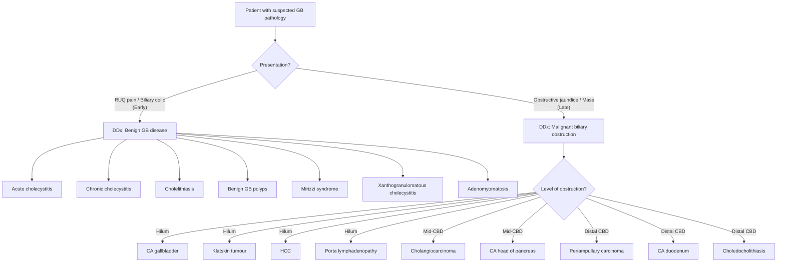

## Differential Diagnosis of Gallbladder Cancer

### Why is Differential Diagnosis Challenging in GBC?

Before diving into the list, let's understand **why** the differential is broad and clinically important. GBC presents in two fundamentally different clinical scenarios, and the differential changes depending on the presentation:

1. **Early presentation** — biliary colic, RUQ pain → **indistinguishable from benign gallstone disease** (GBC is found in 95% of patients with concurrent gallstones) [1][2]
2. **Late presentation** — obstructive jaundice, palpable mass, constitutional symptoms → overlaps with **all causes of malignant biliary obstruction (MBO)** [8][9]

The differential must therefore be structured around these two clinical presentations, and additionally around the **level of biliary obstruction** seen on imaging.

---

### Structured Differential Diagnosis

#### A. Differential Diagnosis When Presenting as RUQ Pain / Biliary Colic (Early/Incidental)

These are conditions that mimic the gallstone-like presentation of early GBC:

| Differential | Key Distinguishing Features | Why It Mimics GBC |
|---|---|---|
| **Acute cholecystitis** | Prolonged RUQ pain > 6 hrs, fever, positive Murphy's sign, leukocytosis; USG shows wall thickening + pericholecystic fluid + stones [3] | Both present with RUQ pain + gallstones; GBC may coexist with acute cholecystitis |
| **Chronic cholecystitis** | Recurrent biliary colic attacks; USG shows contracted, thick-walled gallbladder with stones [6] | GBC arises on a background of chronic cholecystitis; histologically may only be distinguishable on final pathology |
| **Gallbladder polyps** (benign) | Asymptomatic or biliary colic; USG shows fixed echogenic lesion without acoustic shadow, no gravity dependence [2] | Cannot reliably distinguish benign polyp from early polypoid GBC on imaging alone — this is why polyps ≥ 1 cm need cholecystectomy |
| **Cholelithiasis** (symptomatic gallstones without cancer) | Intermittent biliary colic < 6 hrs; USG shows mobile, gravity-dependent stones with acoustic shadow [3] | 95% of GBC patients have gallstones — the symptoms are from stones, not the cancer itself |
| **Mirizzi syndrome** | CHD obstruction from stone impacted in Hartmann's pouch/cystic duct; jaundice + RUQ pain; MRCP/ERCP shows extrinsic compression of CHD [5] | Can present identically to GBC at the neck/cystic duct; chronic inflammation from Mirizzi itself predisposes to GBC |
| **Xanthogranulomatous cholecystitis** | A destructive inflammatory condition of GB wall mimicking GBC on imaging; thick, irregular wall with intramural nodules; diagnosis often made only on histopathology | Radiologically very difficult to differentiate from GBC — both show irregular wall thickening, loss of fat planes with liver, and local lymphadenopathy |
| **Gallbladder empyema** | Fever, sepsis, tender RUQ mass; USG shows distended GB with echogenic debris | A palpable, tender GB mass may initially raise concern for GBC |
| **Adenomyomatosis** | Benign, characterised by Rokitansky-Aschoff sinuses; "comet tail" artefact on USG [2] | Focal adenomyomatosis of the fundus can mimic a mass lesion on USG |

<Callout title="Xanthogranulomatous Cholecystitis — The Great Mimicker" type="error">
This is a particularly important differential because it is a **benign inflammatory condition** that can be virtually indistinguishable from GBC on CT and even at surgery. The GB wall is massively thickened, irregular, and may invade the liver bed — exactly like GBC. Even frozen section can be misleading. The definitive diagnosis often requires full histopathological examination showing foamy macrophages (xanthoma cells) and giant cells rather than adenocarcinoma. Keep this in mind when a "GBC" doesn't behave as expected.
</Callout>

---

#### B. Differential Diagnosis When Presenting as Obstructive Jaundice / Mass (Late)

This is the more common exam scenario: a patient presents with ***painless progressive obstructive jaundice*** — and the question is: what is causing the biliary obstruction?

The differential here overlaps with **all causes of malignant biliary obstruction**. The lecture slides from Prof R Poon provide a clear framework [8][9]:

***Pathology causing malignant biliary obstruction*** [8]:
- ***Carcinoma of gallbladder*** — via cystic duct LN compression, direct infiltration of CBD, or tumour fragments in the duct
- ***Cholangiocarcinoma*** (including ***Klatskin tumour*** at hilum)
- ***Carcinoma of head of pancreas***
- ***Periampullary carcinoma*** (carcinoma of the ampulla of Vater)
- ***Carcinoma of duodenum***
- ***Lymphoma***
- ***HCC*** — direct infiltration, compression, or ***tumour fragments in CBD*** [8][9]
- ***Porta lymphadenopathy*** (metastatic nodes at the porta hepatis compressing the bile duct) [9]

---

#### C. Differential Diagnosis Based on Level of Biliary Obstruction

This is a critical concept for imaging interpretation. When you see biliary dilatation on USG or CT, the **level** at which the ducts transition from dilated to non-dilated tells you where the obstruction is — and narrows the differential dramatically [10]:

| Level of Obstruction | Differentials | Why |
|---|---|---|
| **Hilum** (intrahepatic ducts dilated, CHD/CBD not dilated below the hilum) | ***CA gallbladder*** [10], ***Klatskin tumour (perihilar cholangiocarcinoma)*** [10], ***HCC*** [10], ***Mirizzi syndrome*** [10], ***Porta lymphadenopathy*** [9][10], ***PSC*** [10], ***RPC*** [10] | GBC at the neck can compress the CHD/hilum; Klatskin tumour sits at the confluence; HCC invades or compresses intrahepatic ducts |
| **Mid-CBD** | ***CA CBD (cholangiocarcinoma)*** [10], ***CA head of pancreas*** [10], ***Lymphadenopathy*** [10] | Tumours at this level compress the mid-CBD externally or grow within its wall |
| **Distal CBD** | ***Periampullary carcinoma*** [10], ***CA head of pancreas*** [10], ***Bile duct strictures*** [10], ***Choledochal cysts*** [10], ***Chronic pancreatitis*** [10], ***Pancreatic cysts*** [10] | Distal CBD obstruction causes dilatation of the entire biliary tree above + a distended gallbladder (Courvoisier's sign) |

<Callout title="How Does GBC Cause Obstructive Jaundice?" type="idea">
GBC causes biliary obstruction by **three distinct mechanisms** [8]:
1. **Cystic duct lymph node enlargement** — metastatic nodes compress the CHD/CBD from outside
2. **Direct infiltration of the CBD** — tumour growing from the gallbladder wall directly into the adjacent bile duct
3. **Tumour fragments** — detached tumour fragments falling into the biliary lumen (rare)

This is different from, say, pancreatic head cancer, which compresses the distal CBD from outside. Understanding the mechanism helps you predict the imaging pattern.
</Callout>

---

#### D. Benign Causes of Obstructive Jaundice to Exclude

While GBC enters the differential for malignant causes, always remember benign causes of obstructive jaundice that can mimic the presentation [7]:

| Benign Cause | Key Distinguishing Features |
|---|---|
| **Choledocholithiasis** | Colicky pain, fluctuating jaundice (stone moves), USG shows CBD stone + acoustic shadow; ***painless progressive jaundice suggests malignancy, NOT stones*** [7] |
| **Acute cholangitis** | Charcot's triad (fever + jaundice + RUQ pain); Reynolds' pentad adds hypotension + confusion [3] |
| **PSC** | Young patient + ulcerative colitis; MRCP shows "beading" of intrahepatic/extrahepatic ducts |
| **IgG4-related sclerosing cholangitis** | Responds to steroids; elevated serum IgG4 |
| **Chronic pancreatitis** | Calcifications on CT; history of alcohol/recurrent pancreatitis; distal CBD narrowing |
| **Choledochal cyst** | Usually diagnosed in childhood; MRCP shows cystic dilatation of the bile duct [2] |

> **High Yield Exam Point**: ***"Painless progressive obstructive jaundice in an elderly patient is malignant biliary obstruction until proven otherwise"*** [7]. The key word is "progressive" — gallstone jaundice tends to be intermittent and fluctuating (the stone moves), while malignant jaundice is relentlessly progressive (the tumour only grows).

---

### Differential Diagnosis — Visual Framework

---

### Key Differentiating Features Among Major Malignant Causes

Let's compare the **"big five" malignant causes of biliary obstruction** side by side — this is extremely high yield for exams [8][9]:

| Feature | **GBC** | **Pancreatic head CA** | **Cholangiocarcinoma** | **Periampullary CA** | **HCC** |
|---|---|---|---|---|---|
| **Age/Sex** | 60–70s, F > M | 60–70s, M > F | > 50, slight M > F | 60–70s | 50–60s, M >> F |
| **Background disease** | Gallstones (95%) | DM, chronic pancreatitis | PSC, RPC, choledochal cyst | None specific | HBV, HCV, cirrhosis |
| **Jaundice pattern** | Late; often painful (stones) | ***Painless, progressive*** | Painless, progressive (extrahepatic); absent (intrahepatic) | Painless, progressive ± intermittent (tumour necrosis) | Uncommon unless bile duct invasion |
| **Courvoisier's sign** | Usually absent (fibrosed GB) | ***Positive*** (classic) | Positive if distal | Positive | Absent |
| **Key tumour marker** | CA 19-9, CEA (non-specific) | ***CA 19-9*** | CA 19-9 | None specific | ***AFP*** |
| **Imaging hallmark** | GB wall mass/thickening | Hypoattenuating pancreatic mass; ***double duct sign*** | Duct stricture with upstream dilatation | Ampullary mass on CT/endoscopy | Arterially enhancing liver mass |
| **Liver involvement** | Direct invasion Seg IVb/V | Liver metastases (late) | Intrahepatic mass or hilar stricture | Uncommon | Primary liver mass |
| **5-year survival** | < 5% (overall) | ~10% | 5–15% | ~40% (best prognosis among these) | Variable (20–70% if resectable) |

<Callout title="Double Duct Sign" type="idea">
The "double duct sign" refers to simultaneous dilatation of BOTH the pancreatic duct AND the CBD on CT/MRCP. This is classically seen in **CA head of pancreas** because the tumour sits at the head where both ducts converge. GBC does NOT typically produce a double duct sign because it obstructs the biliary tree at the hilum or mid-CBD level, proximal to the pancreatic duct. Cholangiocarcinoma also typically does not produce a double duct sign unless it is distal.
</Callout>

---

### Distinguishing Gallstone Disease (Benign) from GBC (Malignant) on History

This is one of the most commonly tested clinical reasoning exercises [7]:

| Feature | Suggests **Gallstones** (Benign) | Suggests **GBC** (Malignant) |
|---|---|---|
| Jaundice onset | **Acute**, fluctuating, may resolve spontaneously (stone passes) | **Progressive**, unrelenting, worsening over weeks |
| Pain character | Colicky, intermittent (< 6 hrs per episode) | Constant, dull; may have a colicky component from coexisting stones |
| Fever | Common (cholangitis) | Uncommon unless secondary cholangitis from obstruction |
| Weight loss | Absent | Present (cancer cachexia) |
| Stool colour | May fluctuate (stone moves, some bile gets through intermittently) | Persistently pale (complete obstruction) |
| Urine colour | Dark when jaundiced, normalises when stone passes | Persistently dark |
| Palpable GB | Absent (chronic cholecystitis → fibrosed GB) | Usually absent too (same fibrosed GB), but may have a hard, irregular RUQ mass |
| Courvoisier's sign | Usually absent | Usually absent (unlike pancreatic head CA) |
| Age/demographics | Any age, F > M | Elderly, F > M |
| Prior biliary surgery | May have had prior cholecystectomy | Gallstones found in 95% — typically NO prior cholecystectomy |

---

### Differentials for Gallbladder Mass on Imaging

When imaging reveals a **gallbladder wall mass or thickening**, the differential includes:

| Diagnosis | Key Features |
|---|---|
| **GBC** | Irregular wall thickening, loss of GB-liver interface, local LN, enhancing mass |
| **Xanthogranulomatous cholecystitis** | Can be indistinguishable from GBC; foamy macrophages on histology |
| **Gallbladder adenomyomatosis** (focal) | Fundal thickening with "comet tail" artefact; Rokitansky-Aschoff sinuses |
| **Gallbladder metastasis** | Rare; from melanoma, breast, renal cell carcinoma; usually in context of known primary |
| **Gallbladder lymphoma** | Extremely rare |
| **Acute/chronic cholecystitis** | Diffuse (not focal) wall thickening; clinical context of pain/fever; resolves with treatment |

---

<Callout title="High Yield Summary — Differential Diagnosis">

**Two presentation-based frameworks:**
1. **Early (RUQ pain/biliary colic)**: DDx is benign gallbladder disease — acute/chronic cholecystitis, cholelithiasis, benign polyps, Mirizzi syndrome, xanthogranulomatous cholecystitis, adenomyomatosis
2. **Late (obstructive jaundice/mass)**: DDx is malignant biliary obstruction — ***CA gallbladder, cholangiocarcinoma (including Klatskin tumour), CA head of pancreas, periampullary CA, CA duodenum, HCC, lymphoma, porta lymphadenopathy*** [8][9]

**Level-based approach** [10]: Hilum (GBC, Klatskin, HCC, Mirizzi, porta nodes) → Mid-CBD (cholangioCA, pancreas CA) → Distal CBD (periampullary, pancreatic, choledocholithiasis)

**Key distinguishing features**: GBC → fibrosed GB (Courvoisier usually negative), coexisting gallstones (95%), GB wall mass/thickening on imaging. Pancreatic CA → painless progressive jaundice + Courvoisier positive + double duct sign. Cholangiocarcinoma → duct stricture + upstream dilatation.

***"Painless progressive obstructive jaundice in elderly = malignant until proven otherwise"*** [7]

</Callout>

---

<ActiveRecallQuiz
  title="Active Recall - Differential Diagnosis of Gallbladder Cancer"
  items={[
    {
      question: "List the major malignant causes of biliary obstruction as mentioned in the lecture slides. For each, state the mechanism by which it causes obstruction.",
      markscheme: "CA gallbladder (cystic duct LN, direct CBD infiltration, tumour fragments), Cholangiocarcinoma/Klatskin tumour (mural stricture), CA head of pancreas (extrinsic compression of distal CBD), Periampullary carcinoma (ampullary mass), CA duodenum (mass at duodenal wall), Lymphoma (porta lymphadenopathy), HCC (direct infiltration, compression, tumour fragments in CBD), Porta lymphadenopathy (extrinsic compression).",
    },
    {
      question: "A 65-year-old woman presents with progressive painless jaundice. USG shows intrahepatic duct dilatation with normal calibre CBD below the hilum. What is the level of obstruction and what are the top 3 malignant differentials?",
      markscheme: "Level = hilar obstruction. Top 3: (1) Klatskin tumour (perihilar cholangiocarcinoma), (2) CA gallbladder (neck tumour compressing CHD, or cystic duct LN), (3) HCC (direct invasion or compression at hilum). Also consider porta lymphadenopathy from metastatic disease.",
    },
    {
      question: "Why does gallstone-related jaundice tend to be fluctuating while GBC-related jaundice is progressive? Explain from first principles.",
      markscheme: "Gallstone jaundice: stone moves within the CBD, intermittently obstructing and then partially or fully releasing the obstruction, so bilirubin levels fluctuate. GBC jaundice: caused by tumour growth (either direct infiltration of CBD or progressive lymph node enlargement compressing the duct), which only increases over time, causing relentless progressive jaundice.",
    },
    {
      question: "What is xanthogranulomatous cholecystitis and why is it an important differential for gallbladder cancer?",
      markscheme: "Xanthogranulomatous cholecystitis is a benign destructive inflammatory condition characterised by foamy (xanthoma) macrophages and giant cells in the GB wall. It mimics GBC on imaging (irregular wall thickening, loss of fat planes with liver, local lymphadenopathy) and even at surgery. Important because: (1) may lead to unnecessary radical surgery if misdiagnosed as GBC, (2) frozen section can be misleading, (3) definitive diagnosis often requires full histopathology.",
    },
    {
      question: "Explain how GBC causes biliary obstruction by three distinct mechanisms, as described in the lecture slides.",
      markscheme: "Three mechanisms: (1) Cystic duct lymph node enlargement compressing the CHD/CBD from outside, (2) Direct infiltration of the CBD by tumour growing from the gallbladder wall, (3) Tumour fragments detaching and falling into the biliary lumen (rare, similar to HCC tumour thrombus).",
    },
  ]}
/>

## References

[1] Senior notes: felixlai.md (Gallbladder cancer section, pages 563–571)
[2] Senior notes: maxim.md (Section 5.7 — Cancers of gallbladder and biliary tree; Gallbladder polyps)
[3] Senior notes: felixlai.md (Biliary colic differential diagnosis section, page 511)
[5] Senior notes: felixlai.md (Mirizzi syndrome section, pages 572–574)
[6] Senior notes: maxim.md (Chronic cholecystitis section)
[7] Senior notes: maxim.md (Obstructive jaundice section, page 125)
[8] Lecture slides: WCS 056 - Painless jaundice and epigastric mass - by Prof R Poon.ppt (1).pdf (p23–24)
[9] Lecture slides: Malignant biliary obstruction.pdf (p5)
[10] Senior notes: felixlai.md (Malignant biliary obstruction — causes by level of obstruction, page 500)
