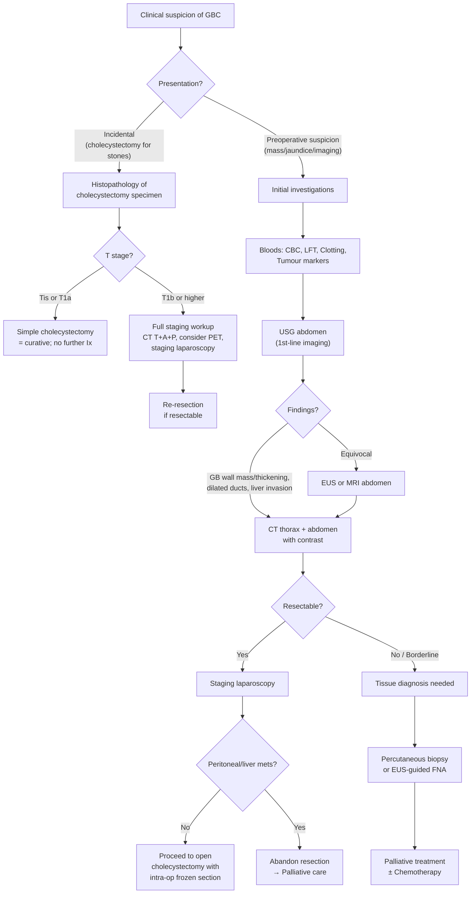
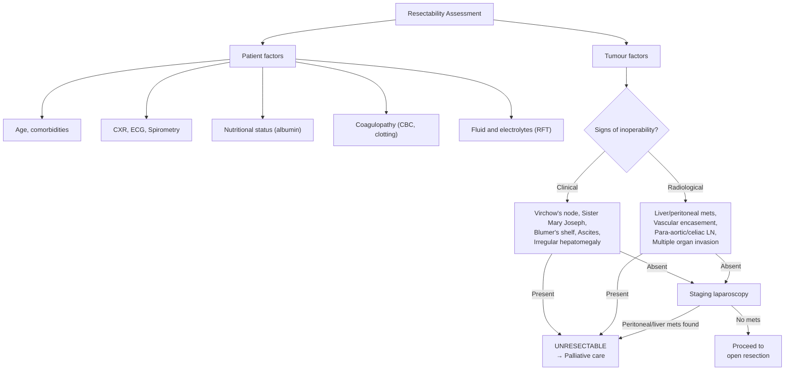

## Diagnostic Criteria and Approach

### Does GBC Have Formal "Diagnostic Criteria"?

Unlike some medical conditions (e.g., rheumatoid arthritis with ACR/EULAR criteria, or diabetes with specific glucose thresholds), GBC does **not** have a standardised set of clinical diagnostic criteria. The diagnosis is ultimately **histopathological** — you need tissue to confirm adenocarcinoma of the gallbladder.

In practice, GBC is diagnosed in one of three clinical scenarios:

1. **Incidental discovery** — found on histopathology of a cholecystectomy specimen performed for presumed benign disease (most common scenario, ~50–70% of cases) [1][2]
2. **Preoperative suspicion** — clinical features + imaging findings raise suspicion → tissue confirmation sought before definitive surgery
3. **Advanced/unresectable disease** — diagnosed on imaging ± percutaneous/EUS-guided biopsy when the tumour is clearly inoperable

The diagnostic approach therefore centres on: ***clinical assessment → laboratory investigations → imaging → tissue diagnosis → staging*** [1][11]

---

### Diagnostic Algorithm

The approach to diagnosing GBC can be divided into two pathways depending on the clinical scenario:

<Callout title="Two Critical Principles in the Diagnostic Algorithm">
1. ***Tissue diagnosis (biopsy) is NOT mandatory before surgery if the tumour appears resectable*** — because percutaneous biopsy risks tumour seeding along the needle tract and peritoneal dissemination. Biopsy is reserved for **unresectable cases** where histological confirmation is needed before starting palliative chemotherapy. [1][2][11]

2. ***Staging laparoscopy should be performed before committing to laparotomy*** — because GBC frequently has peritoneal or liver metastases that are NOT detectable on preoperative imaging (CT/MRI). Laparoscopy avoids an unnecessary, morbid laparotomy. [1]
</Callout>

---

## Investigation Modalities

### A. Physical Examination

Physical examination is the **first step** and provides crucial information about disease extent and operability.

#### General Examination [1][10][11]

| Finding | Significance | Pathophysiological Basis |
|---|---|---|
| ***Jaundice*** | Biliary obstruction by tumour | Conjugated bilirubin refluxes into blood → deposits in sclera/skin (visible when bilirubin > ~35 µmol/L) |
| **Cachexia/wasting** | Advanced disease | Tumour-derived cytokines (TNF-α, IL-6) → increased catabolism |
| **Pallor** | Anaemia of chronic disease | Chronic inflammation suppresses erythropoiesis; also malabsorption of iron/B12 |
| ***Lymphadenopathy*** | Metastatic spread | Check left supraclavicular fossa (***Troisier's sign / Virchow's node***) — distant metastasis via thoracic duct [10] |

#### Abdominal Examination [1][10][11]

| Finding | Significance | How to Elicit |
|---|---|---|
| ***Hepatomegaly (irregular surface, hard, non-tender)*** | Direct liver invasion (Seg IVb/V) or intrahepatic metastases | Palpate from RIF upward; assess size, surface, edge, tenderness, consistency; listen for bruit [11] |
| ***Palpable gallbladder*** | Assess Courvoisier's law (see below) | Palpate below the right costal margin at the tip of the 9th costal cartilage |
| ***Scratch marks (pruritus)*** | Cholestasis → bile salt deposition in skin | Inspect arms, trunk, legs [10] |
| **Stigmata of chronic liver disease** | Background cirrhosis may indicate HCC rather than GBC | Spider naevi, palmar erythema, gynaecomastia, caput medusae |
| ***Ascites*** | Peritoneal metastasis (malignant ascites) or portal vein invasion | Shifting dullness, fluid thrill [10] |
| ***Sister Mary Joseph nodule*** | Periumbilical subcutaneous metastasis via peritoneal ligaments | Palpate umbilicus [10] |
| ***Blumer's shelf*** | Peritoneal metastasis in rectovesical/rectouterine pouch | DRE — palpable "shelf" anteriorly [10] |

#### Courvoisier's Law — Applied to Diagnosis [1][10]

> ***"ALWAYS look for a palpable gallbladder in malignant biliary obstruction"*** [10]

- **Definition**: ***"In painless jaundice if the gallbladder is palpable, it is unlikely to be due to gallstones"*** — points towards malignant biliary obstruction [1][10]
- **Why?** Gallstones → chronic cholecystitis → GB wall fibrosed and contracted → cannot distend. Malignant obstruction develops over a shorter time → GB wall is still compliant → distends from back-pressure [1]
- In GBC specifically: Courvoisier's sign is usually **ABSENT** because the cancer arises in the GB wall itself (rigid) + coexisting gallstones cause chronic fibrosis
- **Exceptions** [1][10]:
  - Double impaction (stone in cystic duct + CBD)
  - Recurrent pyogenic cholangitis (RPC) — pathology in bile duct, not GB → no chronic cholecystitis → GB not fibrosed, can distend
  - Mirizzi syndrome

#### Signs of Inoperability [10][11]

These findings at physical examination indicate **unresectable/incurable disease** — crucial to assess before planning surgery:

| Sign | What It Indicates |
|---|---|
| ***Irregular surface hepatomegaly*** | Liver metastases or direct invasion |
| ***Troisier's sign (Virchow's node)*** | Distant LN metastasis (left supraclavicular) |
| ***Blumer's shelf*** | Peritoneal metastasis (drop metastasis to pouch of Douglas) |
| ***Sister Mary Joseph nodule*** | Peritoneal metastasis |
| ***Ascites*** | Peritoneal carcinomatosis or portal vein invasion |

---

### B. Laboratory Investigations (Biochemical Tests)

#### Complete Blood Count with Differentials [1][10]

| Finding | Significance | Why |
|---|---|---|
| **Leukocytosis** | Associated biliary sepsis (cholangitis) | Bacterial infection of stagnant bile proximal to obstruction → systemic inflammatory response |
| **Thrombocytopenia** | Check before planning invasive procedures (ERCP, biopsy) | Impaired thrombopoietin production in liver disease; also consumptive coagulopathy |
| **Anaemia** | Chronic disease; possible GI blood loss | Normocytic normochromic anaemia of chronic inflammation; iron deficiency if occult GI bleeding |
| **Pancytopenia** | If underlying cirrhosis with portal hypertension | Hypersplenism → sequestration of blood cells [10] |

#### Clotting Profile [1][10]

| Finding | Significance | Why |
|---|---|---|
| **↑ PT/INR** | ***Coagulopathy due to Vitamin K deficiency*** | Obstructive jaundice → no bile salts in the gut → impaired absorption of fat-soluble vitamins (A, D, E, ***K***) → Vitamin K is essential for hepatic synthesis of clotting factors II, VII, IX, X → prolonged PT [1][10] |

<Callout title="Why Check Clotting Before ERCP?" type="idea">
ERCP involves sphincterotomy (cutting the sphincter of Oddi), which can cause significant bleeding. Additionally, percutaneous biopsy and biliary drainage procedures carry haemorrhagic risk. In obstructive jaundice, patients are often coagulopathic from Vitamin K malabsorption. Always correct coagulopathy with parenteral Vitamin K (IV/IM — NOT oral, because oral Vitamin K also requires bile salts for absorption!) before invasive procedures.
</Callout>

#### Liver Function Tests [1][10][11]

| Parameter | Expected Finding | Interpretation |
|---|---|---|
| ***↑ Bilirubin (conjugated)*** | Elevated, progressive | Obstruction → conjugated bilirubin cannot drain into duodenum → refluxes back into blood |
| ***↑ ALP*** | Markedly elevated | ALP is concentrated on the canalicular membrane of hepatocytes. When bile flow is obstructed, bile acids accumulate → solubilise ALP from the membrane → ALP enters the blood. Also, cholestasis induces ALP gene transcription |
| ***↑ GGT*** | Markedly elevated | ***Elevation of GGT confirms that excess ALP is of hepatobiliary origin*** (as opposed to bone — important because ALP alone could be from bone metastases) [11] |
| ↑ AST/ALT | May be mildly elevated or normal initially | Transaminases rise when chronic biliary obstruction leads to hepatocyte damage (secondary hepatocellular injury from bile stasis). Initially normal in pure obstructive jaundice [11] |
| ↓ Albumin | In advanced/chronic disease | Impaired hepatic synthetic function; also indicator of nutritional status |

> The overall pattern is a ***cholestatic picture***: ↑↑ ALP, ↑↑ GGT, ↑ conjugated bilirubin, with relatively preserved transaminases initially [2][10]

#### Tumour Markers [1][10][12]

***Tumour markers are NOT very useful for MBO as a screening tool and are not included in the initial testing*** [10]

| Marker | Upper Normal | Key Points |
|---|---|---|
| ***CA 19-9*** | ***37 U/mL*** | Often elevated in GBC but ***lacks sensitivity and specificity*** [1]. Also elevated in pancreatic cancer (72–79%), biliary cancer (67–73%), gastric cancer, CRC, and in **benign** biliary/pancreatic diseases (cholangitis, cholelithiasis, pancreatitis) [12]. ***Serial assay after resection may aid in diagnosis of persistent or recurrent disease*** [1]. Requires Lewis blood group antigen to be expressed — ~5–10% of the population are Lewis-negative and will never produce CA 19-9 regardless of disease |
| ***CEA*** | ***5 ng/mL*** | May be elevated but neither sensitive nor specific. Primarily a CRC marker. Also elevated in smoking, liver disease, bowel diseases [12] |
| ***AFP*** | ***10 ng/mL*** | Useful to differentiate from HCC (AFP elevated in HCC 70–90%; typically normal in GBC). Also elevated in hepatitis, cirrhosis [12][11] |

<Callout title="Tumour Markers — The Exam Trap" type="error">
***Common tumour markers such as AFP, CA19-9 and CEA are neither sensitive nor specific for periampullary tumours*** [10]. ***Absence of an elevated tumour marker does NOT exclude underlying malignancy*** [10]. Students frequently over-rely on tumour markers — they are **supportive**, not diagnostic. Their main utility is in **serial monitoring** after treatment to detect recurrence. [1]
</Callout>

#### Other Blood Tests

| Test | Rationale |
|---|---|
| **RFT (Renal function)** | Baseline before contrast imaging (CT); assess hydration; hepatorenal syndrome |
| **HBV and HCV serology** | Differentiate from HCC (which is associated with viral hepatitis) [10] |
| **Blood group and crossmatch** | Preoperative if surgery planned |
| **Glucose** | Assess for DM (risk factor; also new-onset DM in elderly → consider pancreatic cancer) |

---

### C. Radiological Investigations

#### 1. Ultrasound (USG) Abdomen — ***First-line Imaging*** [1][10][11][12]

USG is the **initial imaging modality** for any patient presenting with RUQ pain, jaundice, or suspected biliary pathology. It is cheap, non-invasive, widely available, and provides critical information.

**Why USG first?** Because it can quickly answer three key questions [12]:
1. ***What is the size of the bile duct — is there any dilatation?*** (Normal intrahepatic ducts are < 2–3 mm and typically not visible on USG; CBD > 0.8 cm is pathological) [10]
2. ***What is the level of obstruction?***
3. ***What is the cause of obstruction — stone or mass?***

**USG findings suggestive of GBC** [1]:

| Finding | Interpretation |
|---|---|
| ***Thickened, irregular gallbladder wall > 3 mm*** | Focal or diffuse wall thickening — the most common USG finding in GBC; however, also seen in cholecystitis |
| ***Mass protruding into the gallbladder lumen or a fixed mass*** | Polypoid intraluminal mass or a mass replacing the GB — distinguishing feature: does NOT move with gravity (unlike a stone) and has NO acoustic shadow [2] |
| ***Loss of interface between gallbladder and liver*** | Direct tumour invasion into the liver bed (segments IVb/V) — the normal bright echogenic line between GB and liver is lost |
| ***Dilated biliary tree*** | Tumour obstructing CHD/CBD → upstream dilatation |
| ***Direct tumour infiltration into the liver*** | Hypoechoic mass extending from GB into liver parenchyma |
| ***Lymphadenopathy*** | Enlarged nodes at porta hepatis |
| **Gallstones** | Present in ~95% of GBC patients; may obscure the underlying mass |

<Callout title="USG Limitations" type="error">
USG may be compromised by: excessive body fat, intraluminal bowel gas (especially obscuring the distal CBD), and **the presence of gallstones** which can shadow and obscure a small underlying mass. If USG is equivocal or shows concerning features, proceed to CT.
</Callout>

#### 2. Endoscopic Ultrasound (EUS) [1][10]

- ***More accurate for imaging the gallbladder than transabdominal USG*** [1] because the transducer is placed in the duodenum, directly adjacent to the gallbladder and bile ducts — eliminates the problem of bowel gas and body habitus
- **Roles in GBC**:
  - Detailed assessment of GB wall layers → accurate T-staging
  - Evaluation of regional lymph nodes (porta hepatis, peripancreatic)
  - **EUS-guided FNA/biopsy** — for tissue diagnosis when percutaneous biopsy is risky or when the lesion is not accessible percutaneously [10]
- Limitations: Operator-dependent; limited availability; cannot assess distant metastases

#### 3. CT Thorax and Abdomen with Contrast — ***The Key Staging Investigation*** [1][11][12]

CT with IV contrast is the **workhorse** for staging GBC. It answers the critical question: **is this tumour resectable?**

***Key imaging protocol***: Contrast-enhanced CT with ***arterial phase images*** to determine the ***anatomic course of the hepatic artery relative to the tumour***, which is necessary to determine resectability [1]

**CT findings consistent with GBC** [1]:

| Finding | Significance |
|---|---|
| ***Focal or diffuse thickening of gallbladder wall*** | Most common pattern; may be indistinguishable from cholecystitis on a single scan |
| ***Polypoid mass protruding into the lumen or completely filling it*** | Intraluminal tumour growth; enhances with contrast |
| ***Direct liver infiltration*** | Tumour extending into liver segments IVb/V — determines need for liver resection |
| ***Nodal involvement*** | Enlarged nodes at porta hepatis, pericholedochal, peripancreatic, celiac, para-aortic — para-aortic nodes = distant disease → incurable |
| ***Presence of distant metastasis*** | Lung (CT thorax), peritoneal implants, liver metastases |
| **Vascular involvement** | Encasement or occlusion of hepatic artery or portal vein → T4 → generally unresectable |
| **Invasion of adjacent organs** | Stomach, duodenum, colon, pancreas involvement |

***CT thorax is essential*** to detect distant metastases to the ***lung and pleura*** [1]

#### 4. MRI Abdomen + MRCP [1][2]

| Role | Details |
|---|---|
| ***Differentiate benign from malignant GB lesions in equivocal cases*** | MRI has superior soft tissue contrast compared to CT; T2-weighted MRCP images can differentiate between a neoplastic and inflammatory mass (e.g., xanthogranulomatous cholecystitis vs GBC) which may not be possible on USG or CT [1][13] |
| ***Visualisation of hepatoduodenal ligament invasion*** | Better assessment of the relationship between tumour and the portal vein, hepatic artery |
| ***Portal vein encasement and LN involvement*** | MRI with gadolinium enhancement can delineate vascular involvement |
| ***MRCP — biliary tree delineation*** | Non-invasive mapping of biliary anatomy; shows level and extent of biliary involvement; ***non-contrast, T2-weighted*** [14] |

<Callout title="MRCP vs ERCP" type="idea">
***MRCP is non-invasive and has largely replaced ERCP as a diagnostic tool*** [10][14]. MRCP provides excellent biliary tree visualisation without the risks of ERCP (pancreatitis, bleeding, perforation). However, **MRCP is NOT therapeutic** — if you need to place a stent or take a biopsy, you need ERCP. So: MRCP for diagnosis, ERCP for intervention.
</Callout>

#### 5. ERCP (Endoscopic Retrograde Cholangiopancreatography) [1][10]

| Role | Details |
|---|---|
| ***Delineate the extent of biliary tree involvement*** | Cholangiogram shows strictures, filling defects, or complete obstruction |
| ***Helpful in coexisting jaundice*** | Indicates tumour growth into intrahepatic biliary ducts or CBD |
| ***Therapeutic*** | Place endoprosthesis (biliary stent) for palliative jaundice relief; sphincterotomy for stone removal |
| ***Brush cytology*** | Can obtain cytology from biliary stricture during ERCP (low sensitivity ~30–60%) |

**ERCP indications in GBC**:
- Preoperative biliary drainage when jaundice is severe and surgery needs to be delayed
- Palliative stenting for inoperable disease
- Differentiation from benign stricture (with brush cytology)

#### 6. PTC (Percutaneous Transhepatic Cholangiography) [10][14]

- ***Preferred over ERCP for obstruction at or above the level of confluence of hepatic ducts*** (i.e., hilar obstruction — because ERCP cannot reliably opacify ducts above a complete hilar obstruction) [14]
- Provides cholangiogram from above the obstruction
- Can place percutaneous transhepatic biliary drainage (PTBD) catheter for decompression
- **Complications**: bacteraemia (requires antibiotic prophylaxis), haemobilia [14]

#### 7. PET/CT Scan [1][2]

| Aspect | Details |
|---|---|
| **Utility** | ***Clinical utility of PET scan in GBC is unclear and data are insufficient to make conclusive recommendations*** [1] |
| ***Main utility*** | ***Identifying otherwise radiographically occult advanced disease to avoid unnecessary surgery*** [1] — e.g., small peritoneal implants or distant LN metastases missed on CT |
| **Limitations** | High false-positive rate in inflammatory conditions (chronic cholecystitis causes FDG uptake); limited spatial resolution for small lesions |

Listed in staging investigations: ***PET/CT, laparoscopy*** [2]

#### 8. Staging Laparoscopy — ***Critical Pre-operative Step*** [1]

This is one of the most important and commonly overlooked investigations in GBC workup.

**Why is it needed?**
- ***GBC frequently involves regional LNs or extends directly to adjacent structures which may preclude curative resection but may NOT be detectable by preoperative imaging such as CT or MRI scan*** [1]
- ***Mainly to confirm the absence of liver or peritoneal metastatic disease*** [1]
- ***Diagnostic staging laparoscopy identifies metastatic disease or other findings that contraindicate tumour resection*** [1]

**What the surgeon looks for during staging laparoscopy**:
1. Peritoneal nodules (send for frozen section if suspicious)
2. Liver surface metastases (not seen on CT if small/superficial)
3. Omental disease
4. Suspicious lymph nodes

**When to perform**: Before committing to a formal laparotomy for radical resection, particularly for T2 or higher disease

> ***No promise of resection until laparotomy findings document absence of spread*** [10]

#### 9. Tissue Diagnosis (Biopsy) [1][2][11]

| Method | When to Use | Caveats |
|---|---|---|
| ***Intraoperative frozen section of cystic duct margin*** | During cholecystectomy — critical for determining the extent of additional resection needed [1][2] | Positive margin → bile duct resection + Roux-en-Y; Negative → LN dissection only |
| **Percutaneous biopsy** | ***Only for unresectable cases*** where histological confirmation is needed before chemotherapy [2][11] | Risk of tumour seeding along needle tract; risk of peritoneal dissemination |
| **EUS-guided FNA** | Alternative to percutaneous biopsy for lesions accessible via endoscopic approach | Lower theoretical risk of peritoneal seeding than percutaneous route |
| ***Histopathology of cholecystectomy specimen*** | The definitive diagnosis — most GBC is diagnosed on final pathology after cholecystectomy for presumed benign disease | Must examine the **entire specimen** thoroughly; identify T-stage to determine need for re-resection |

<Callout title="FNAC/Biopsy — ONLY for Unresectable Cases" type="error">
***FNAC or Trucut biopsy should ONLY be performed for unresectable cases*** [11]. For a potentially resectable tumour, biopsy is NOT performed preoperatively because:
1. **Tumour seeding** — needle tract implantation of tumour cells
2. **Bile/tumour spillage** → peritoneal dissemination
3. The diagnosis can be confirmed on the surgical specimen itself

This principle applies broadly to hepatobiliary malignancies (HCC, cholangiocarcinoma, GBC). [11]
</Callout>

---

### Summary of Investigation Modalities — Quick Reference Table

| Investigation | Primary Role | Key Findings in GBC | When to Use |
|---|---|---|---|
| **Physical exam** | Assess operability | Jaundice, hepatomegaly, ascites, Virchow's node, Sister Mary Joseph nodule | Always — first step |
| **CBC** | Baseline; sepsis screen | Leukocytosis, anaemia, thrombocytopenia | Always |
| **Clotting** | Pre-procedural | ↑ PT/INR (Vitamin K deficiency) | Always; correct before invasive Ix |
| ***LFT*** | Confirm cholestasis | ***↑ ALP, ↑ GGT, ↑ conjugated bilirubin*** (cholestatic pattern) | Always |
| ***Tumour markers*** | Supportive; serial monitoring | ***CA 19-9, CEA elevated but NOT diagnostic*** | Always; interpret with caution |
| ***USG abdomen*** | ***1st-line imaging*** | Wall thickening, mass, loss of GB-liver interface, dilated ducts, LN | Always — initial imaging |
| **EUS** | Detailed local assessment; biopsy | Wall layer invasion, LN, EUS-guided FNA | Equivocal USG; tissue diagnosis needed |
| ***CT T+A with contrast*** | ***Staging; resectability*** | Mass, liver invasion, LN, vascular involvement, distant mets | Always for suspected GBC |
| ***MRI/MRCP*** | Equivocal CT; biliary mapping | Differentiate benign vs malignant; biliary tree anatomy | Equivocal cases; preoperative planning |
| ***ERCP*** | Therapeutic; diagnostic | Biliary stricture, stenting, brush cytology | Jaundice requiring drainage |
| **PTC** | Proximal/hilar obstruction | Cholangiogram above obstruction; PTBD | Hilar obstruction not accessible by ERCP |
| ***PET/CT*** | Occult advanced disease | FDG-avid metastases missed on CT | Before planned radical surgery |
| ***Staging laparoscopy*** | Confirm resectability | Peritoneal/liver surface mets NOT seen on CT | Before laparotomy for T2+ disease |
| ***Intra-op frozen section*** | Cystic duct margin status | Positive → bile duct resection; Negative → LN dissection only | During surgery |
| **Percutaneous biopsy** | Tissue diagnosis | Adenocarcinoma on histology | ***ONLY for unresectable cases*** |

---

### Assessment of Resectability — Putting It All Together

The ultimate goal of the diagnostic workup is to determine: **can this tumour be resected with curative intent?**

***Absolute contraindications for radical resection*** [1]:

| Contraindication | Why It Makes Resection Futile |
|---|---|
| ***Liver metastasis*** | Distant haematogenous spread — systemic disease |
| ***Peritoneal metastasis*** | Transcelomic spread — systemic disease |
| ***Malignant ascites*** | Indicates peritoneal carcinomatosis |
| ***Encasement or occlusion of major vessels (hepatic artery / portal vein)*** | T4 disease; incomplete resection inevitable |
| ***Involvement of para-aortic, pericaval, SMA or celiac artery lymph nodes*** | ***Such involvement is considered distant rather than locoregional metastatic disease and therefore incurable*** [1] |
| ***Extensive involvement of the hepatoduodenal ligament*** | Direct tumour or nodal involvement makes R0 resection impossible |

This framework — ***assessment of patient status (good/bad) + assessment of tumour status (confined/spread)*** — is directly from the lecture slides [10]:
- ***Patient status good + Tumour confined → Laparotomy (radical resection)***
- ***Patient status bad OR Tumour spread → PTBD or endoprosthesis (palliation)***

---

<Callout title="High Yield Summary — Diagnosis of GBC">

**No formal diagnostic criteria** — diagnosis is histopathological. Most GBC is diagnosed **incidentally** on cholecystectomy specimens.

**Physical exam**: Look for jaundice, hepatomegaly, Courvoisier's sign (usually absent in GBC), signs of inoperability (Virchow's node, ascites, Sister Mary Joseph nodule, Blumer's shelf).

**Bloods**: Cholestatic LFT pattern (↑↑ ALP, ↑ GGT, ↑ conjugated bilirubin). ***Tumour markers (CA 19-9, CEA) are NOT sensitive or specific — use for serial monitoring, not diagnosis.*** Clotting — check and correct Vitamin K deficiency before invasive procedures.

**Imaging sequence**: USG (1st line) → CT T+A with contrast (staging) → MRI/MRCP (equivocal) → PET/CT (occult advanced disease) → **Staging laparoscopy** (before committing to laparotomy).

**Biopsy**: ***ONLY for unresectable cases.*** For resectable tumours, intra-op frozen section of the cystic duct margin guides the extent of surgery.

**Resectability**: Unresectable if liver mets, peritoneal mets, malignant ascites, major vessel encasement, para-aortic/celiac/SMA LN involvement, or extensive hepatoduodenal ligament involvement.

</Callout>

---

<ActiveRecallQuiz
  title="Active Recall - Diagnosis of Gallbladder Cancer"
  items={[
    {
      question: "What is the most common way gallbladder cancer is diagnosed? Why?",
      markscheme: "Most commonly diagnosed incidentally on histopathology of a cholecystectomy specimen performed for presumed benign gallstone disease (50-70% of cases). This is because early GBC is asymptomatic or presents with gallstone symptoms, and there are no reliable screening tools. The diagnosis is histopathological — you need tissue.",
    },
    {
      question: "A patient with suspected GBC has a potentially resectable tumour on CT. Should you perform a percutaneous biopsy before surgery? Explain your reasoning.",
      markscheme: "No. Percutaneous biopsy is NOT performed for potentially resectable tumours because of: (1) risk of tumour seeding along the needle tract, (2) risk of bile/tumour spillage causing peritoneal dissemination. The diagnosis will be confirmed on the surgical specimen. Biopsy is reserved ONLY for unresectable cases where histological confirmation is needed before palliative chemotherapy.",
    },
    {
      question: "Explain why staging laparoscopy is critical before laparotomy in GBC. What specifically are you looking for?",
      markscheme: "GBC frequently has peritoneal or liver surface metastases that are NOT detectable on preoperative CT or MRI (too small, flat peritoneal implants). Staging laparoscopy avoids an unnecessary, morbid laparotomy. Looking for: (1) peritoneal nodules (send for frozen section), (2) liver surface metastases, (3) omental disease, (4) suspicious lymph nodes. If found, abandon resection and proceed to palliative care.",
    },
    {
      question: "What is the expected LFT pattern in GBC causing obstructive jaundice? Explain the pathophysiology of each finding.",
      markscheme: "Cholestatic pattern: (1) Markedly elevated ALP — cholestasis solubilises ALP from canalicular membrane + induces ALP gene transcription. (2) Elevated GGT — confirms hepatobiliary origin of ALP. (3) Elevated conjugated bilirubin — conjugated bilirubin cannot drain into duodenum, refluxes into blood. (4) Initially normal or mildly elevated AST/ALT — rises later when chronic obstruction causes secondary hepatocyte damage. (5) Prolonged PT/INR — Vitamin K malabsorption from lack of bile salts in gut.",
    },
    {
      question: "List 5 absolute contraindications for radical resection of gallbladder cancer.",
      markscheme: "Any 5 of: (1) Liver metastasis, (2) Peritoneal metastasis, (3) Malignant ascites, (4) Encasement/occlusion of hepatic artery or portal vein, (5) Para-aortic/pericaval/SMA/celiac artery lymph node involvement (considered distant, not locoregional), (6) Extensive involvement of the hepatoduodenal ligament by tumour or nodes.",
    },
    {
      question: "Why is CA 19-9 not a reliable diagnostic marker for GBC? When is it useful?",
      markscheme: "CA 19-9 lacks both sensitivity and specificity. It is elevated in many other cancers (pancreatic 72-79%, biliary 67-73%, gastric, CRC) and also in benign conditions (cholangitis, cholelithiasis, pancreatitis). Also requires Lewis blood group antigen expression — ~5-10% of population are Lewis-negative and will never produce CA 19-9. Its main utility is serial monitoring after resection to detect persistent or recurrent disease.",
    },
  ]}
/>

## References

[1] Senior notes: felixlai.md (Gallbladder cancer — Diagnosis and Treatment sections, pages 568–571)
[2] Senior notes: maxim.md (Section 5.7 — Gallbladder carcinoma investigation and treatment)
[10] Senior notes: felixlai.md (Malignant biliary obstruction — Diagnosis section, pages 501–503)
[11] Lecture slides: WCS 064 - A large liver - by Prof R Poon [20191108].doc.pdf (p2)
[12] Lecture slides: Malignant biliary obstruction.pdf (p7–8, p10)
[13] Senior notes: felixlai.md (Mirizzi syndrome — Diagnosis section, page 574)
[14] Senior notes: maxim.md (HBP investigations — MRCP and PTC sections)
