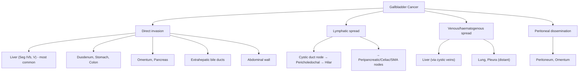
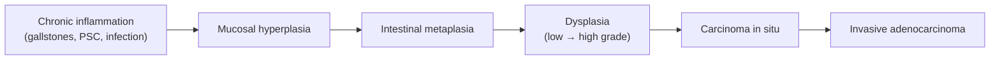

## Definition

Gallbladder cancer (GBC) is a **primary malignancy arising from the gallbladder wall**, most commonly adenocarcinoma (~90%). The name itself tells you everything: "gall" = bile, "bladder" = a hollow sac — so it's cancer of the bile-storage sac.

It is an **uncommon but highly lethal malignancy** because it tends to present late, often discovered incidentally during cholecystectomy for presumed benign gallstone disease. By the time symptoms appear, the cancer has usually already spread. [1][2]

<Callout title="Why is GBC so deadly?">
The gallbladder wall **lacks a submucosa** (unlike the intestine), meaning there is less tissue barrier between the mucosa and the muscularis. Once the tumour breaches the thin muscular layer, it quickly reaches the subserosal lymphatics and the liver bed (segments IVb and V), which are literally millimetres away. Additionally, the venous drainage goes directly into the liver, providing a highway for haematogenous spread. This anatomical "shortcut" explains why **~75% of patients have regional or distant disease at diagnosis**. [1]
</Callout>

Key statistics at presentation [1]:
- **25%** localized to gallbladder wall
- **35%** have regional nodal involvement or extension into adjacent liver
- **40%** have distant metastasis

---

## Epidemiology

### Global Perspective
- GBC is the **most common biliary tract malignancy** and the **5th most common GI malignancy** worldwide
- Incidence varies dramatically by geography and ethnicity:
  - **High incidence regions**: Chile, Bolivia, northern India, Pakistan, Japan, Korea, Eastern Europe (particularly among indigenous populations)
  - **Low incidence regions**: Western Europe, North America, Australia
- ***Very rare in Hong Kong*** [2]
- **Female predominance** with M:F ratio of approximately **1:2–3** [1][2]
  - Why? Women have a higher prevalence of gallstones (estrogen increases cholesterol secretion into bile → cholesterol supersaturation → stone formation). Since gallstones are the strongest risk factor, the female predominance follows logically.
- Peak incidence in the **6th–7th decade** of life
- **5-year overall survival < 5%** with a **median survival of ~6 months** for all comers [1][2]

### Hong Kong Context
- GBC is **uncommon** in Hong Kong relative to HCC and colorectal cancer
- However, given the relatively high prevalence of gallstones in the ageing population and the endemic presence of *Clonorchis sinensis* (liver fluke) in southern China, awareness is important
- ***Most cases are discovered late and are unresectable at diagnosis*** [2]

<Callout title="High Yield – Epidemiology" type="idea">
Remember: Female, Fat, Fertile, Forty, Family history (the "5 Fs" of gallstones) → gallstones are the #1 risk factor for GBC → hence GBC has a female predominance. This is a common exam question trap: students forget that GBC risk factors overlap heavily with gallstone risk factors.
</Callout>

---

## Anatomy and Function

Understanding GBC requires a thorough understanding of gallbladder anatomy because the **pattern of tumour spread is dictated entirely by the anatomy**.

### Gross Anatomy [1]

The gallbladder is a **pear-shaped, hollow viscus** located on the inferior surface of the liver, sitting in the **gallbladder fossa** between hepatic **segments IVb and V**.

It is divided into:

| Segment | Description | Clinical Relevance |
|---|---|---|
| **Fundus** | The rounded, blind-ended tip projecting beyond the liver margin | Associated with the anterior abdominal wall (palpable when distended) and hepatic flexure of colon |
| **Body** | The main portion | **Superiorly**: attached to the liver (segments IVb, V) by loose connective tissue. **Inferiorly**: abuts the duodenum and transverse colon — explaining direct tumour invasion into these structures |
| **Infundibulum (Hartmann's pouch)** | A small out-pouching at the junction of the body and neck | Common site for gallstone impaction |
| **Neck** | The narrow tapered portion connecting to the cystic duct | Contains spiral valves of Heister; leads into the cystic duct |

### Histology — The Key to Understanding GBC Behaviour

The gallbladder wall is composed of (from lumen outward):
1. **Mucosa** (columnar epithelium + lamina propria)
2. **Muscularis propria** (smooth muscle — single, thin layer)
3. **Perimuscular connective tissue** (also called subserosa/adventitia)
4. **Serosa** (visceral peritoneum) — only on the **peritoneal side** (the side facing away from the liver)

<Callout title="Critical Anatomical Point" type="error">
The gallbladder wall **LACKS a true submucosa and has only a single thin muscular layer** (unlike the intestine which has submucosa, inner circular and outer longitudinal muscle layers, plus a submucosal plexus). This means:
- **Lymphatics are present only in the subserosal layer** — so cancer confined within the muscularis (T1a, T1b) has minimal risk of nodal disease
- Once it penetrates through the muscularis into the subserosa, lymphatic and haematogenous spread becomes very likely
- The **hepatic side of the gallbladder has NO serosa** — just connective tissue directly abutting the liver parenchyma, making direct hepatic invasion extremely easy [1]
</Callout>

### Lymphovascular Drainage [1]

**Arterial supply:**
- **Cystic artery** — branch of the right hepatic artery (found in Calot's triangle)

**Venous drainage:**
- Cystic veins → drain directly into the **gallbladder fossa (liver segments IVb and V)** via small veins that traverse the gallbladder bed into the right hepatic vein
- This is why **direct venous tumour invasion into the liver (segments IVb and V) is so common** — the venous blood literally flows from gallbladder straight into these segments

**Lymphatic drainage** (follows a predictable, stepwise pattern):
1. **Cystic duct node** (node of Calot/Lund) — first echelon
2. **Pericholedochal and hilar nodes** — second echelon
3. **Peripancreatic, periduodenal, periportal nodes** — third echelon
4. **Celiac and superior mesenteric artery (SMA) nodes** — considered **distant** (not locoregional), hence incurable by surgery [1]

**Nerve supply:**
- Sympathetic innervation from the **T9 segment** and the **celiac plexus**
- This explains referred pain to the epigastrium and right shoulder (phrenic nerve via diaphragmatic irritation)

### Function of the Gallbladder [1]

- **Storage and concentration of bile** produced by the liver
- Bile is released into the duodenum via the cystic duct → common bile duct → ampulla of Vater
- **Cholecystokinin (CCK)** — released from duodenal I-cells in response to fat and amino acids in the duodenum — is the major hormone that stimulates gallbladder contraction and pancreatic enzyme secretion
- Bile contains bile salts, cholesterol, phospholipids, and bilirubin; it emulsifies dietary fat for absorption

### Routes of Tumour Spread

Understanding the anatomy makes the spread patterns intuitive:

**Sites of distant metastasis**: ***lung, pleura, and peritoneum*** [1]

---

## Etiology and Risk Factors

The etiology of GBC revolves around **chronic inflammation → dysplasia → carcinoma sequence**, analogous to the adenoma-carcinoma sequence in colorectal cancer but driven predominantly by chronic biliary irritation.

### Mnemonic: **"4P" risk factors** [2]
- **P**olyps
- **P**orcelain gallbladder (and other gallstone diseases)
- **P**rimary sclerosing cholangitis
- **P**ancreatobiliary duct anomalous junction

Below is an expanded and comprehensive discussion of each risk factor:

---

### 1. Gallstones (Cholelithiasis) — ***The Strongest Risk Factor*** [1][2]

- ***95% of patients with GBC have gallstones*** [1]
- **Larger stones** (> 3 cm) and **symptomatic gallstones** carry higher risk
  - Stones > 3 cm have a **~10× increased risk** compared to stones < 1 cm
- **Pathophysiology**: Chronic mechanical irritation of the gallbladder mucosa by gallstones → chronic inflammation → mucosal hyperplasia → metaplasia → dysplasia → carcinoma
- However, the **absolute risk** of GBC in patients with gallstones remains low (~0.3–0.5% over a lifetime), so prophylactic cholecystectomy for all patients with gallstones is NOT indicated [3]

> **High Yield**: The association between gallstones and GBC is strong but the absolute risk is low. This is why we do NOT recommend prophylactic cholecystectomy for asymptomatic gallstones UNLESS other risk factors are present (e.g., porcelain gallbladder, large stones > 3 cm, polyps > 1 cm).

### 2. Gallbladder Polyps [1][2]

Gallbladder polyps are classified as:

**A. Benign Non-neoplastic** (no malignant potential):
- ***Cholesterol polyps (cholesterolosis)*** — **~60%** of all polyps [1]
  - Deposits of cholesterol esters in the submucosal macrophages
  - Usually small (< 10 mm), pedunculated, multiple
- ***Adenomyomatosis (adenomyoma)*** — **~25%** [1]
  - Characterized by intramural diverticula called **Rokitansky-Aschoff sinuses** [2]
  - Hypertrophy of the muscularis with invagination of mucosa
- ***Inflammatory polyps*** — **~10%** [1]
  - Granulation tissue from chronic cholecystitis

**B. Benign Neoplastic** (premalignant potential):
- ***Adenoma*** — **~4%** [1]
  - True neoplasm with malignant potential (like colonic adenomas)
  - Risk of malignant transformation increases with size
- Leiomyoma, Fibroma, Lipoma — rare

**C. Malignant:**
- ***Adenocarcinoma*** — **~80%** of malignant polyps [1]
- Squamous cell carcinoma, mucinous cystadenoma, adenoacanthoma — rare

**Risk stratification by size** [1]:
| Polyp Size | Risk of Malignancy | Management |
|---|---|---|
| < 1 cm | < 5% | ***Regular USG surveillance (Q6mo if 6–9 mm, Q12mo if ≤ 5 mm)*** [2] |
| 1–1.5 cm | ~46% | ***Cholecystectomy indicated*** |
| ≥ 1.5 cm | ~70% | ***Cholecystectomy indicated; may need extended cholecystectomy with LN dissection*** [2] |

**Key features suggesting malignancy in polyps** [1][2]:
- **Sessile** (broad-based) morphology — malignant polyps tend to be sessile
- **Echogenic** on USG
- **Solitary**
- **Rapidly growing** on serial imaging
- **No gravity dependence and no acoustic shadow** (differentiating from gallstones on USG) [2]

<Callout title="Polyp vs Stone on USG" type="idea">
A gallstone will be gravity-dependent (moves with patient repositioning), has a posterior acoustic shadow, and is usually echogenic. A polyp is fixed to the wall (does NOT move with repositioning), has no acoustic shadow, and may be echogenic. This distinction is commonly tested. [2]
</Callout>

**Indications for cholecystectomy for gallbladder polyps** [2]:
- Symptomatic polyps (e.g., RUQ pain)
- ***Adenomatous polyps ≥ 1 cm (or ≥ 8 mm if underlying PSC)*** [2]
- Rapidly growing polyps on serial imaging
- ***Polyps > 2 cm may need extended cholecystectomy with LN dissection and partial hepatic resection*** [2]

### 3. Porcelain Gallbladder [1][2]

- An uncommon manifestation of **chronic cholecystitis** characterized by **intramural calcification of the gallbladder wall**
- "Porcelain" → because the calcified wall appears bluish-white and brittle, resembling porcelain
- ***Associated with gallstones and chronic gallbladder inflammation*** [1]
- Historically thought to carry a very high malignancy risk (up to 25%), but more recent data suggests the risk is **lower (~2–3%)**, particularly with **selective mucosal calcification** (which carries higher risk than complete intramural calcification) [2]
- Subtypes [2]:
  - **Complete intramural calcification** — lower malignancy risk
  - **Selective mucosal calcification** — higher malignancy risk (because incomplete calcification suggests ongoing active inflammation)
- ***ALL porcelain gallbladders should be removed even if patients are asymptomatic*** — this is an **absolute indication for cholecystectomy** [1][3]

### 4. Primary Sclerosing Cholangitis (PSC) [1][2]

- An **autoimmune inflammatory disorder** of the biliary tree leading to **fibrosis and stricturing** of intrahepatic and extrahepatic bile ducts
- ***Strongly associated with ulcerative colitis*** [4]
- Chronic inflammation and biliary stasis → increased risk of both cholangiocarcinoma and GBC
- Patients with PSC should have a **lower threshold for cholecystectomy** when polyps are found (≥ 8 mm rather than the usual 1 cm cutoff) [2]

### 5. Abnormal Pancreaticobiliary Duct Junction (APBDJ) [1][2]

- A **rare congenital anatomical variation** in which the pancreatic duct joins the common bile duct **outside the duodenal wall**, creating an abnormally **long common channel** (> 15 mm)
- ***Associated with choledochal cysts*** [2]
- **Pathophysiology**: The sphincter of Oddi cannot regulate the long common channel → **reflux of pancreatic juice into the biliary tree** → chronic chemical inflammation from activated pancreatic enzymes → mucosal injury → metaplasia → dysplasia → carcinoma
- ***Represents failure of the embryological ducts to migrate fully into the duodenum*** [1]
- GBC is the **most common malignancy** associated with APBDJ
- ***Prophylactic cholecystectomy is recommended*** [1]

### 6. Choledochal Cysts [1][4]

- **Congenital cystic dilatation of the bile ducts**
- Most diagnosed before 10 years of age (60%) [2]
- Classified by the **Todani classification** (most commonly Type I) [2]
- Risk of **cholangiocarcinoma and GBC** via:
  - Biliary stasis
  - Chronic inflammation from reflux of pancreatic juice
  - Abnormalities in bile salt transporter proteins
- Management: ***Radical excision of cyst + biliary tract reconstruction using a Roux-en-Y loop of jejunum*** (hepaticojejunostomy) — to prevent development of cholangiocarcinoma [2]

### 7. Mirizzi Syndrome [1][5]

- **Common hepatic duct obstruction** caused by **extrinsic compression from an impacted stone in the cystic duct or Hartmann's pouch** [1][5]
- Chronic inflammation and biliary stasis → predisposes to GBC [5]
- ***One of the exceptions to Courvoisier's Law*** (jaundice with palpable gallbladder due to a benign cause) [5]

### 8. Chronic Cholecystitis [3][6]

- Result of **recurrent acute cholecystitis or persistent mechanical irritation** by gallstones → fibrosis and thickening of GB wall
- The **dysplasia-carcinoma sequence** in GBC is thought to parallel the chronic inflammation → metaplasia → dysplasia → carcinoma pathway seen in Barrett's oesophagus and other chronic inflammatory conditions
- ***Chronic cholecystitis is associated with CA gallbladder and porcelain gallbladder*** [6]

### 9. Other Risk Factors

| Risk Factor | Mechanism |
|---|---|
| **Obesity** | Increased cholesterol in bile → more gallstones → chronic inflammation |
| **Diabetes mellitus** | Gallbladder dysmotility + gallstone risk |
| **Female sex / Multiparity** | Estrogen → increased biliary cholesterol secretion → stones |
| **Clonorchis sinensis / Opisthorchis** infection | Liver flukes inhabit biliary tree → chronic inflammation → malignant transformation (relevant in Hong Kong/South China) [7] |
| **Smoking** | Carcinogens excreted in bile |
| **Family history** | Genetic predisposition (rare familial clustering reported) |
| **Typhoid carrier state** | Chronic *Salmonella typhi* colonization of gallbladder → chronic inflammation [6] |

---

## Pathophysiology

### The Inflammation → Dysplasia → Carcinoma Sequence

The dominant paradigm for GBC carcinogenesis is:

This sequence takes **15–20 years** on average, explaining why GBC typically presents in the 6th–7th decade.

### An Alternative Pathway — Adenoma-Carcinoma Sequence

A smaller proportion of GBCs (~5–10%) arise from pre-existing adenomatous polyps through the traditional adenoma → carcinoma pathway (similar to colorectal cancer). This is less common but explains why adenomatous polyps > 1 cm should be removed.

### Molecular Pathogenesis

- **p53 mutations** — common in GBC; tumour suppressor gene on chromosome 17p
- **KRAS mutations** — oncogene activation; more common in the setting of APBDJ
- **CDKN2A/p16 inactivation** — cell cycle checkpoint loss
- **Microsatellite instability (MSI)** — found in a subset, relevant for immunotherapy
- **ERBB2 (HER2) amplification** — potential therapeutic target
- **PI3K/AKT/mTOR pathway** activation
- **EGFR overexpression**

---

## Classification

### Histological Classification [1][2]

| Type | Frequency | Notes |
|---|---|---|
| ***Adenocarcinoma*** | **~90%** | Most common; subtypes: papillary, nodular, tubular |
| Squamous cell carcinoma | Rare | |
| Mucinous cystadenoma | Rare | |
| Adenoacanthoma | Rare | Mixed glandular + squamous |
| Adenosquamous | Rare | |
| Small cell / neuroendocrine | Very rare | |

**Adenocarcinoma subtypes** [1]:
- **Papillary** — bulky, intraluminal growth; ***associated with the most favourable outcome*** because it tends to grow into the lumen rather than invading the wall early
- **Nodular** — constricting, annular pattern
- **Tubular** — glandular pattern; most common subtype

### TNM Staging (AJCC 8th Edition, 2017) [1]

**Primary Tumour (T):**

| Stage | Description |
|---|---|
| Tis | Carcinoma in situ |
| T1a | Tumour invades the **lamina propria** |
| T1b | Tumour invades the **muscular layer** |
| T2a | Tumour invades perimuscular connective tissue on the **peritoneal side** (without serosal involvement) |
| T2b | Tumour invades perimuscular connective tissue on the **hepatic side** (without liver extension) |
| T3 | Tumour perforates serosa AND/OR directly invades liver and/or one other adjacent organ (stomach, duodenum, colon, pancreas, omentum, extrahepatic bile ducts) |
| T4 | Tumour invades main **portal vein or hepatic artery** OR invades **≥ 2 extrahepatic organs** |

<Callout title="T2a vs T2b — Why does it matter?">
This distinction is unique to gallbladder cancer and reflects the asymmetric anatomy:
- **T2a (peritoneal side)**: The peritoneal surface has a serosa — tumour must penetrate the serosa to spread into the peritoneal cavity. These tumours have a slightly better prognosis.
- **T2b (hepatic side)**: There is NO serosa on the hepatic side — only loose connective tissue separating the gallbladder from the liver. Tumour on this side has a more direct route to invade the liver. T2b generally has a worse prognosis than T2a.
</Callout>

**Regional Lymph Nodes (N):**

| Stage | Description |
|---|---|
| N0 | No regional lymph node metastasis |
| N1 | Metastasis to **1–3** regional lymph nodes |
| N2 | Metastasis to **≥ 4** regional lymph nodes |

**Distant Metastasis (M):**

| Stage | Description |
|---|---|
| M0 | No distant metastasis |
| M1 | Distant metastasis |

**Overall Stage Grouping:**

| Stage | T | N | M |
|---|---|---|---|
| 0 | Tis | N0 | M0 |
| I | T1 | N0 | M0 |
| IIA | T2a | N0 | M0 |
| IIB | T2b | N0 | M0 |
| IIIA | T3 | N0 | M0 |
| IIIB | T1–3 | N1 | M0 |
| IVA | T4 | N0–1 | M0 |
| IVB | Any T | N2 | M0 |
| IVB | Any T | Any N | M1 |

> **High Yield**: T1a (lamina propria only) → simple cholecystectomy is curative. T1b and beyond → extended cholecystectomy with lymph node dissection is needed. This staging-to-surgery mapping is commonly tested.

---

## Clinical Features

GBC is notoriously difficult to diagnose early because ***its symptoms mimic benign gallbladder disease*** [2]. Most patients present with symptoms attributable to coexisting gallstones rather than the cancer itself.

### Symptoms

| Symptom | Pathophysiological Basis | Stage |
|---|---|---|
| ***RUQ pain / biliary colic*** | Due to **coexisting gallstones** (present in 95% of GBC patients) rather than the cancer itself. Gallstone impaction → cystic duct obstruction → visceral pain via T9 sympathetic afferents [1][2] | Early |
| ***Epigastric discomfort*** | Visceral pain from gallbladder distension; may mimic dyspepsia or peptic ulcer disease | Early |
| **Nausea and vomiting** | Vagal stimulation from gallbladder inflammation; or duodenal involvement causing gastric outlet obstruction | Early/Late |
| ***Obstructive jaundice (painless or painful)*** | Late feature indicating **tumour invasion or compression of the extrahepatic bile ducts** (CBD/CHD) or metastatic lymph nodes at the porta hepatis compressing the bile duct. Conjugated bilirubin cannot reach the duodenum → refluxes back into blood [2][8] | Late |
| ***Dark urine (tea/cola-coloured)*** | Conjugated (water-soluble) bilirubin spills into blood → excreted by kidneys → dark urine (choluria) | Late |
| ***Pale/clay-coloured stools (acholic)*** | No bilirubin reaching the duodenum → no stercobilinogen production → pale stools | Late |
| ***Pruritus*** | Bile salt deposition in the skin due to cholestasis. Bile salts are normally excreted in bile; when obstructed, they accumulate in blood and deposit in skin, stimulating nerve endings | Late |
| ***Weight loss and anorexia (constitutional symptoms)*** | Cancer cachexia: tumour-derived cytokines (TNF-α, IL-6) → systemic inflammation → increased metabolic rate + decreased appetite. Also, fat malabsorption from bile duct obstruction contributes | Late |
| **Malaise and fatigue** | Anaemia of chronic disease; cancer cachexia; malabsorption | Late |

<Callout title="Early Symptoms are Indistinguishable from Gallstone Disease" type="error">
***Early stage GBC presents with biliary colic and RUQ pain — symptoms attributable to gallstones rather than the cancer itself*** [2]. This is why most GBC is diagnosed **incidentally** at cholecystectomy or **at an advanced stage** when obstructive jaundice or a mass develops. The cancer doesn't produce unique early warning symptoms — it hides behind its most common co-morbidity (gallstones).
</Callout>

### Signs

| Sign | Pathophysiological Basis | Notes |
|---|---|---|
| ***Palpable RUQ mass / Hepatomegaly*** | Direct tumour extension into the liver (segments IVb, V) or a distended gallbladder (if the cystic duct is not chronically fibrosed) [2] | Late finding; hard, irregular, non-tender |
| ***Jaundice (scleral icterus)*** | Bilirubin > 35 µmol/L → visible yellow discoloration of sclera (sclera has high elastin content with affinity for bilirubin) [8] | Indicates biliary obstruction |
| ***Palpable gallbladder (Courvoisier's sign)*** | If the gallbladder wall is NOT fibrosed (i.e., no chronic cholecystitis), the gallbladder can distend proximal to a distal biliary obstruction. In GBC with CBD involvement, if the obstruction is distal to the cystic duct insertion AND the gallbladder wall is still compliant → palpable, non-tender gallbladder [8] | ***However, most GBC patients have concurrent gallstones → chronic cholecystitis → fibrosed, non-distensible gallbladder → Courvoisier's sign is often ABSENT*** |
| **Murphy's sign** | Inspiratory arrest during deep RUQ palpation — indicates acute cholecystitis (parietal peritoneal inflammation) from concurrent gallstone disease | Non-specific |
| ***Ascites*** | Peritoneal carcinomatosis (tumour seedlings on peritoneal surfaces) → exudative ascites; or portal vein invasion → portal hypertension → transudative ascites | Late; poor prognostic sign |
| **Sister Mary Joseph nodule** | Periumbilical subcutaneous metastatic nodule — tumour spread via peritoneal ligaments (falciform ligament) or lymphatics to the umbilicus | Rare but classic sign of intra-abdominal malignancy |
| ***Virchow's node (left supraclavicular lymphadenopathy)*** | Metastatic spread via thoracic duct to the left supraclavicular fossa | Indicates disseminated disease |
| **Hepatomegaly (irregular, hard)** | Direct liver invasion or intrahepatic metastases | May be nodular on palpation |
| **Cachexia** | Advanced disease with cytokine-mediated muscle wasting | |

### Courvoisier's Law — Applied to GBC [5][8]

> ***"In the presence of painless obstructive jaundice, a palpable gallbladder is unlikely to be due to gallstones"*** — Courvoisier

**Why?** A gallbladder that has been chronically inflamed by gallstones becomes **fibrosed and shrunken** — it cannot distend. Therefore, if you find painless jaundice + a distended, palpable gallbladder, think of a **malignant cause** of distal biliary obstruction (e.g., ***pancreatic head cancer, ampullary cancer, distal cholangiocarcinoma***) [8].

**In GBC specifically**: Despite being a malignancy, GBC often **does NOT** produce a palpable gallbladder because:
- The cancer arises FROM the gallbladder wall → the wall is rigid and infiltrated → cannot distend
- Coexisting gallstones → chronic cholecystitis → fibrosed wall

**Exceptions to Courvoisier's Law** (jaundice with palpable gallbladder from benign causes) [5]:
- Double impaction (gallstone in cystic duct + CBD simultaneously)
- ***Mirizzi syndrome*** [5]
- Recurrent pyogenic cholangitis (RPC)

<Callout title="Painless Jaundice + Epigastric Mass" type="idea">
***This is a classic exam presentation*** [8]. The differential includes:
1. **Pancreatic head cancer** (most common cause of painless obstructive jaundice + palpable gallbladder)
2. **Ampullary / periampullary tumour**
3. **Distal cholangiocarcinoma**
4. **Gallbladder cancer** (less commonly causes a palpable gallbladder due to concurrent fibrosis)

The lecture **WCS 056** focuses on this presentation — always think malignancy first. [8]
</Callout>

### Incidental Discovery

- ***A significant proportion of GBC is found incidentally*** during or after cholecystectomy for presumed benign disease
- The surgeon may notice:
  - An abnormal gallbladder wall (thickened, mass-like)
  - Suspicious findings on frozen section of the cystic duct margin
  - Unexpected pathology report showing carcinoma in the cholecystectomy specimen
- ***Intraoperative frozen section of the cystic duct is critical*** — a positive margin mandates further surgery [1]

### Presentation by Tumour Location

| Fundus/Body | Neck/Cystic duct |
|---|---|
| Tends to present **later** (grows away from bile ducts) | Presents **earlier** with obstructive jaundice (closer to biliary confluence) |
| More likely to invade liver directly | More likely to obstruct CBD |
| Often presents as incidental finding or mass | May mimic Mirizzi syndrome |

---

## Paraneoplastic Phenomena

GBC does not commonly produce paraneoplastic syndromes (unlike HCC), but when present:
- **Trousseau syndrome** (migratory thrombophlebitis) — mucin-producing adenocarcinomas can activate the coagulation cascade
- **Leser-Trélat sign** — explosive onset of seborrhoeic keratoses (rare, non-specific)

---

## Key Pathological Features Linking Anatomy to Clinical Behaviour

| Anatomical Feature | Clinical Consequence |
|---|---|
| Lack of submucosa | Rapid transmural invasion |
| Thin single muscular layer | Minimal barrier to spread |
| No serosa on hepatic side | Direct liver invasion (Seg IVb, V) |
| Venous drainage into liver | Haematogenous liver metastasis |
| Lymphatics only in subserosa | T1a/b = minimal nodal risk; T2+ = significant nodal risk |
| Close proximity to duodenum, colon, stomach | Direct invasion into GI structures |
| Lymphatic chain → celiac/SMA nodes | Distant nodal disease = incurable |

---

<Callout title="High Yield Summary">

**Definition**: Primary malignancy of the gallbladder, ~90% adenocarcinoma, uncommon but highly fatal.

**Epidemiology**: Female predominance (M:F 1:2–3), peak 6th–7th decade, ***very rare in HK***, ***5-year OS < 5%***, 75% have regional/distant disease at diagnosis.

**Anatomy**: GB sits on segments IVb/V; lacks submucosa; thin muscularis; NO serosa on hepatic side → explains rapid liver invasion. Venous drainage directly into liver. Lymphatics: cystic node → pericholedochal → hilar → peripancreatic → celiac/SMA.

**Risk Factors (4P + Stones)**: ***Gallstones (95% of GBC patients)***, ***Polyps (> 1cm)***, ***Porcelain gallbladder***, ***PSC***, ***Pancreatobiliary duct anomaly***; also chronic cholecystitis, Mirizzi syndrome, choledochal cysts, obesity, DM, Clonorchis sinensis.

**Pathophysiology**: Chronic inflammation → hyperplasia → metaplasia → dysplasia → carcinoma (15–20 year sequence).

**Clinical Features**:
- **Early**: Biliary colic, RUQ pain (mimics gallstones — GBC hides behind gallstone symptoms)
- **Late**: ***Obstructive jaundice, palpable mass, constitutional symptoms (LOW/LOA), dark urine, pale stools, pruritus, ascites***
- Most GBC diagnosed **incidentally** at cholecystectomy or at **advanced stage**

**TNM Key Points**: T1a = lamina propria; T1b = muscularis; T2a = peritoneal side; T2b = hepatic side (worse); T3 = serosa/liver/adjacent organs; T4 = major vessels/≥2 organs. N1 = 1–3 nodes; N2 = ≥4 nodes.

</Callout>

---

<ActiveRecallQuiz
  title="Active Recall - Gallbladder Cancer (Definition to Clinical Features)"
  items={[
    {
      question: "Why does gallbladder cancer spread to the liver so readily? Explain the anatomical basis.",
      markscheme: "Three reasons: (1) No serosa on the hepatic side of the gallbladder — only loose connective tissue separates GB from liver segments IVb and V, allowing direct invasion. (2) Venous drainage via cystic veins goes directly into the liver (gallbladder fossa). (3) Lack of submucosa means tumour traverses the wall rapidly to reach the subserosa and liver bed.",
    },
    {
      question: "What is the '4P' mnemonic for GBC risk factors? List them and briefly explain each.",
      markscheme: "Polyps (adenomatous polyps > 1cm have malignant potential), Porcelain gallbladder (intramural calcification from chronic cholecystitis), Primary sclerosing cholangitis (chronic biliary inflammation), Pancreatobiliary duct anomalous junction (reflux of pancreatic juice into biliary tree via long common channel). Additionally, gallstones are the strongest overall risk factor (95% of GBC patients have gallstones).",
    },
    {
      question: "Why is early gallbladder cancer so difficult to diagnose clinically?",
      markscheme: "Early GBC presents with biliary colic and RUQ pain — symptoms identical to gallstone disease (which coexists in 95% of cases). There are no pathognomonic early symptoms. Most GBC is discovered incidentally during cholecystectomy for presumed benign disease or at late stage when obstructive jaundice or a mass develops.",
    },
    {
      question: "Explain why the T2 stage in gallbladder cancer is subdivided into T2a and T2b. What is the prognostic significance?",
      markscheme: "T2a = perimuscular connective tissue invasion on the peritoneal side (has serosa as a barrier). T2b = perimuscular connective tissue invasion on the hepatic side (NO serosa, only loose connective tissue abutting liver). T2b has worse prognosis because the tumour has a more direct route to invade the liver.",
    },
    {
      question: "A patient with painless jaundice is found to have a palpable, non-tender gallbladder. Apply Courvoisier's Law. Is gallbladder cancer a likely cause? Why or why not?",
      markscheme: "Courvoisier's Law states that painless jaundice with palpable gallbladder is unlikely due to gallstones (fibrosed wall cannot distend) and suggests malignant distal biliary obstruction (e.g., pancreatic head CA, ampullary tumour, distal cholangiocarcinoma). GBC is actually LESS likely to produce a palpable gallbladder because: (1) the cancer arises from the GB wall itself making it rigid, and (2) coexisting gallstones cause chronic cholecystitis and fibrosis. Exceptions to Courvoisier's Law include Mirizzi syndrome, double impaction, and RPC.",
    },
    {
      question: "What is the pathophysiology of abnormal pancreaticobiliary duct junction (APBDJ) leading to gallbladder cancer?",
      markscheme: "APBDJ is a congenital anomaly where the pancreatic duct joins the CBD outside the duodenal wall, creating a long common channel (> 15mm). The sphincter of Oddi cannot regulate this long channel, leading to reflux of pancreatic juice (containing activated enzymes) into the biliary tree. This causes chronic chemical inflammation of the gallbladder mucosa, leading to metaplasia, dysplasia, and eventually carcinoma. It represents failure of embryological duct migration into the duodenum.",
    },
  ]}
/>

---

## References

[1] Senior notes: felixlai.md (Gallbladder cancer section, pages 563–571)
[2] Senior notes: maxim.md (Section 5.7 — Cancers of gallbladder and biliary tree)
[3] Senior notes: maxim.md (Cholecystectomy indications section)
[4] Senior notes: felixlai.md (Cholangiocarcinoma etiology section, page 548)
[5] Senior notes: maxim.md (Mirizzi syndrome section, pages 131–132) and felixlai.md (Mirizzi syndrome section, pages 572–573)
[6] Senior notes: maxim.md (Chronic cholecystitis section, page 130)
[7] Senior notes: maxim.md (Clonorchis sinensis section, page 138)
[8] Lecture slides: WCS 056 - Painless jaundice and epigastric mass - by Prof R Poon.ppt (1).pdf
