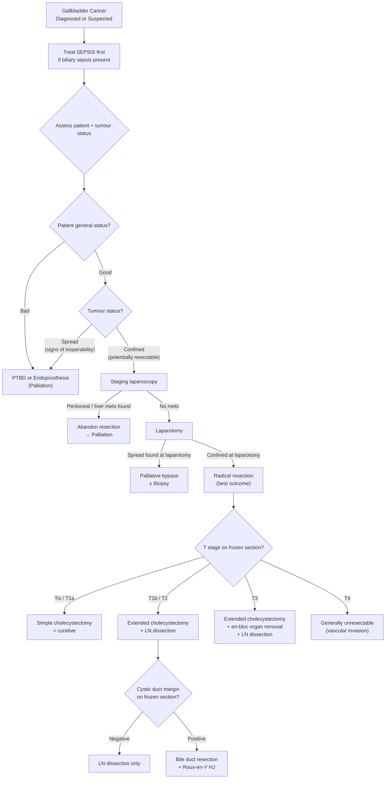

## Management of Gallbladder Cancer

### Guiding Principles

The management of GBC is dictated by two fundamental assessments that must be made before any treatment decision [10][15][16]:

1. ***Assessment of patient status (good / bad)*** [15]
2. ***Assessment of tumour status (confined / spread)*** [15]

This framework — directly from the lecture slides — is the backbone of all hepatobiliary surgical oncology decision-making:

***Why surgery?*** [16]
- ***Removal of tumour*** (oncological clearance)
- ***Relief of obstruction***
- ***Pain control***

***The role of surgery*** in MBO has three goals [17]:
- ***R0 resection*** (absence of microscopic residual tumour — the gold standard)
- ***Relieve obstruction*** (jaundice, duodenal obstruction)
- ***Pain control*** (celiac plexus block)

---

### Master Management Algorithm

<Callout title="The Lecture Slide Flowchart — Memorise This" type="idea">
From ***Prof R Poon's lecture*** [15]:
- ***General status BAD → PTBD or endoprosthesis***
- ***General status GOOD + Tumour SPREAD → PTBD or endoprosthesis***
- ***General status GOOD + Tumour CONFINED → Laparotomy***
  - At laparotomy: ***bypass if spread; radical resection if confined***

This simple 2×2 framework applies to ALL malignant biliary obstruction, not just GBC. [15]
</Callout>

---

### Preoperative Assessment

Before any surgical intervention, a systematic assessment is required [10][15]:

#### A. Assessment of Patient Status [10]

| Domain | Investigation | Rationale |
|---|---|---|
| **Age / Comorbidities** | Clinical history | Elderly or frail patients may not tolerate major hepatobiliary surgery |
| **Hidden medical illness** | ***CXR, ECG, Spirometry*** | Detect occult cardiopulmonary disease that increases perioperative mortality |
| **Nutrition** | ***LFT (albumin)*** | Malnutrition → poor wound healing, anastomotic leak, immunosuppression; cancer cachexia common |
| **Fluid and electrolytes** | ***RFT*** | Dehydration, renal impairment from obstructive uropathy or hepatorenal syndrome |
| **Coagulopathy** | ***CBC, Clotting profile*** | Vitamin K deficiency from obstructive jaundice → correct with IV Vitamin K (not oral — bile salts needed for oral absorption) + FFP if urgent surgery |

#### B. Assessment of Tumour Status [10]

**Clinical assessment — Signs of inoperability** [10]:
- ***Irregular surface hepatomegaly*** (liver metastases)
- ***Troisier's sign (Virchow's node)*** — left supraclavicular LN
- ***Blumer's shelf*** — peritoneal metastasis palpable on DRE
- ***Sister Mary Joseph nodules*** — periumbilical metastasis
- ***Ascites*** — peritoneal carcinomatosis

**Radiological assessment — Signs of inoperability** [10]:
- LN metastasis (para-aortic, celiac, SMA nodes)
- Distant metastasis (liver, lung, peritoneum)
- Arterial involvement (SMA / celiac axis)
- Venous involvement (SMV / PV)

> ***Criteria of resectability*** [18]:
> - ***No distant metastases***
> - ***SMA and celiac axis not involved***
> - ***Patent superior mesenteric-portal venous confluence***
> - ***PV involvement is NOT an absolute contraindication*** — ***venous resection is appropriate to improve resectability and achieve R0 resection*** [10][18]
> - However: ***significant morbidity and mortality; reasonable survival: median = 13 months, 5-year = 7%*** [18]

---

### Preoperative Optimisation

Before proceeding to surgery, several conditions must be addressed [10][19]:

#### 1. Treat Biliary Sepsis [16]

***The first step in managing any MBO is to TREAT SEPSIS*** [16]

- Antibiotics: ***Augmentin*** OR ***Cefuroxime (Zinacef) + Metronidazole (Flagyl)*** [10]
- Biliary drainage to decompress the infected, obstructed biliary tree

#### 2. Preoperative Biliary Drainage [19]

| Aspect | Details |
|---|---|
| **Goal** | ***Target serum bilirubin < 50 µmol/L*** before surgery [19] |
| **Methods** | ERCP with endoprosthesis (stenting) or PTBD |
| ***Theoretically*** | ***Do NOT need to drain if no sepsis + early surgery can be offered within 1–2 weeks*** — preoperative biliary drainage increases risk of serious complications even in expert hands [19] |
| ***Practically (QMH)*** | ***Drain ALL patients since QMH cannot offer early surgery*** — Whipple/radical operations require 6–8 weeks waiting, and the chance of biliary sepsis is very high without drainage during this period [19] |
| **Advantages** | Minimise cholangitis risk; relieve jaundice/pruritus; prevent cholestasis complications; allow time for neoadjuvant therapy |
| **Disadvantages** | More interventions/costs; risk of procedure-related complications (cholangitis, pancreatitis, bleeding, perforation, stent blockage) |

#### 3. Nutritional and Haemostatic Optimisation [19]

- ***Cancer cachexia → Malnutrition → Nutritional support*** (enteral preferred)
- ***Liver derangement → Bleeding tendency → IV Vitamin K and FFP during surgery*** [19]
- ***Superimposed biliary infection → Antibiotic cover*** [19]

---

### Surgical Treatment — Curative Intent

***Surgical treatment is the ONLY potentially curative treatment for GBC.***

The specific operation depends entirely on the **T-stage**, which is determined either:
- Preoperatively on imaging, OR
- Intraoperatively on frozen section (for incidentally discovered GBC)

#### Overview of Surgery by Stage [1][2][7]

| T Stage | Surgical Approach | Rationale |
|---|---|---|
| ***Tis*** | ***Simple cholecystectomy*** | Carcinoma in situ — no invasion beyond epithelium; zero risk of nodal/distant spread |
| ***T1a*** | ***Simple cholecystectomy*** | Invasion limited to lamina propria only; lymphatics are in the subserosa, so T1a has **minimal risk of nodal disease** (< 2.5%) [1] |
| ***T1b*** | ***Extended cholecystectomy + LN dissection*** | Invasion into muscular layer; nodal metastasis risk rises to ~10–15% — enough to justify lymphadenectomy |
| ***T2*** | ***Extended cholecystectomy + LN dissection*** | Invasion through muscularis into perimuscular connective tissue; nodal metastasis risk ~20–30%; T2b (hepatic side) may have direct liver invasion [1][2] |
| ***T3*** | ***Extended cholecystectomy + en-bloc removal of involved adjacent organ + LN dissection*** | Tumour perforates serosa or invades liver/one adjacent organ; more aggressive resection needed to clear margins |
| ***T4*** | ***Generally locally unresectable*** | ***Invasion of main portal vein or hepatic artery or ≥ 2 extrahepatic organs*** → cannot achieve R0 [1] |

> ***"In general... Radical cholecystectomy for CA gallbladder"*** [17]

---

#### Open vs Laparoscopic Approach [1][3]

| Feature | Open | Laparoscopic |
|---|---|---|
| ***Recommendation*** | ***Open approach is generally recommended for GBC*** [1] | Not recommended for known/suspected GBC |
| **Why open?** | ***Port site recurrences and late peritoneal metastasis associated with bile spillage are reported*** with laparoscopic approach [1] | Laparoscopic manipulation risks tumour rupture and peritoneal contamination |
| **Incision** | ***Right subcostal incision (Kocher incision)*** [1] | N/A |
| **Extended exposure** | ***Extension to upper midline or left subcostal region as a chevron incision*** [1] | N/A |

**Indications for open cholecystectomy** (rather than laparoscopic) [3]:
- ***CA gallbladder*** (extensive adhesions, risk of rupture and tumour seeding)
- Cannot tolerate pneumoperitoneum (cardiopulmonary comorbidities)
- Refractory coagulopathy
- Multiple abdominal surgeries

<Callout title="Why NOT Laparoscopic for GBC?" type="error">
The laparoscopic approach is contraindicated for known or suspected GBC because:
1. **Port-site metastasis** — tumour cells seed along trocar tracks (reported in up to 10–20% of cases)
2. **Bile spillage** — pneumoperitoneum + gallbladder manipulation → GB perforation → bile containing tumour cells spills into peritoneal cavity → peritoneal carcinomatosis
3. **Inadequate resection** — difficult to perform en-bloc liver resection + formal lymphadenectomy laparoscopically

If GBC is found incidentally DURING a laparoscopic cholecystectomy, **convert to open** if feasible, or **stop and plan re-resection** as a staged open procedure. [1][3]
</Callout>

---

#### Simple Cholecystectomy [1][2]

**Indication**: ***Tis and T1a tumours***

- ***Very early stage tumours including Tis and T1a can be cured with simple cholecystectomy alone*** [1]
- Why is this sufficient?
  - T1a invades only the lamina propria. Lymphatics reside in the **subserosal layer** — the tumour has not yet reached the lymphatic highway. Therefore, the risk of nodal metastasis is < 2.5%
  - Cystic duct margin is checked — if positive, further resection is needed
- ***Stage I disease (confined to mucosa, T1N0): no further treatment required*** [2]
- 5-year survival for T1a: ~85–100%

---

#### Extended (Radical) Cholecystectomy [1][2]

**Indication**: ***T1b and higher (when resectable)***

The concept: ***"Open cholecystectomy with intra-op frozen section"*** [2] → if T1b or higher on histology, extend the operation.

***Extended cholecystectomy involves*** [1][2]:

1. **En-bloc removal of gallbladder + rim of liver**
   - ***Rim of liver at ≥ 2 cm adjacent to the gallbladder bed*** OR ***a formal central liver resection (Segment IVb and V)*** [1]
   - Why? The gallbladder body is directly adherent to liver segments IVb and V via loose connective tissue with no serosa — tumour invades directly into these segments. You must resect the liver beneath the gallbladder bed to ensure clear margins
   - ***Patients with tumours of the fundus or body: tumour is generally far enough from the inflow structures to allow a negative-margin resection with ≥ 2 cm non-anatomical wedge resection or anatomic resection of segment IVb and V*** [1]
   - ***More aggressive surgery may be necessary*** including resection of additional liver segments if there is evidence of tumour infiltration beyond segments IVb/V [1]

2. ***Regional lymphadenectomy*** [1][2]
   - ***Porta hepatis LN*** [2]
   - ***Proper LN dissection involves removing ALL LNs in the porta hepatis and along the hepatoduodenal ligament*** (cystic duct, CBD, hepatic artery, portal vein), paraduodenal, peripancreatic, and celiac LNs [1]
   - ***At least 6 lymph nodes should be removed for proper staging*** [1]
   - Why 6? This is the minimum needed to accurately stage N disease. Inadequate lymph node harvest leads to understaging and potentially undertreating

3. **± Extrahepatic bile duct resection** [1][2]
   - ***Only performed when gross tumour extends into CBD or when a negative cystic duct margin cannot be obtained by intraoperative frozen section*** [1]
   - If cystic duct margin **positive** → ***Regional LN dissection + Extrahepatic bile duct resection with reconstruction by Roux-en-Y hepaticojejunostomy*** [1]
   - If cystic duct margin **negative** → ***Regional LN dissection only*** [1]

<Callout title="Routine Bile Duct Resection — NOT Recommended">
***Routine bile duct resection with an attempt to achieve a more complete lymphadenectomy is NOT associated with survival benefit and has potential serious complications such as bile leak and anastomotic stricture with hepaticojejunostomy reconstruction*** [1]. Only resect the bile duct when there is a clear indication (positive cystic duct margin or gross tumour in the CBD).
</Callout>

---

#### Intraoperative Frozen Section — The Pivotal Decision Point [1][2]

***Intraoperative frozen section of the cystic duct*** is performed during every cholecystectomy for GBC (or when GBC is suspected):

| Cystic Duct Margin | Action |
|---|---|
| ***Negative*** | ***Regional LN dissection only*** [1] |
| ***Positive*** | ***Regional LN dissection + Extrahepatic bile duct resection + Roux-en-Y hepaticojejunostomy*** [1] |

Why? A positive cystic duct margin means tumour extends into the CBD — leaving this behind guarantees local recurrence and makes the surgery non-curative.

**Roux-en-Y hepaticojejunostomy** ("Roux" = named after surgeon César Roux; "en-Y" = the shape of the bowel loop; "hepatico-" = hepatic duct; "jejunostomy" = anastomosis to jejunum):
- A loop of jejunum is divided
- The distal limb is brought up and anastomosed to the residual hepatic duct(s) — this restores bile drainage from the liver into the gut
- The proximal limb is anastomosed to the side of the Roux limb downstream — creating the "Y" shape
- This is the standard reconstruction after bile duct resection

---

#### Management of Incidental GBC Found After Laparoscopic Cholecystectomy

This is one of the most commonly tested scenarios in exams.

**Scenario**: Patient undergoes elective laparoscopic cholecystectomy for gallstones. Final histopathology unexpectedly shows adenocarcinoma.

| T Stage on Final Path | Management |
|---|---|
| **Tis / T1a** | No further surgery needed — cholecystectomy alone is curative |
| **T1b or higher** | ***Re-resection required***: Open radical (extended) cholecystectomy with completion liver resection (segment IVb/V wedge or formal resection) + LN dissection ± bile duct resection. Also: excise all port sites (risk of tumour seeding) |

Why excise port sites? During laparoscopic cholecystectomy, the gallbladder is extracted through a port (usually umbilical). If there was bile spillage or direct contact of the tumour with the port site, tumour cells may have implanted there. Excision of all port sites is standard practice for incidental GBC.

---

#### Absolute Contraindications for Radical Resection [1]

| Contraindication | Rationale |
|---|---|
| ***Liver metastasis*** | Haematogenous distant spread — systemic disease |
| ***Peritoneal metastasis*** | Transcelomic distant spread |
| ***Malignant ascites*** | Indicates peritoneal carcinomatosis |
| ***Encasement or occlusion of major vessels (hepatic artery / portal vein)*** | T4 disease — cannot achieve R0 |
| ***Involvement of para-aortic, pericaval, SMA or celiac artery lymph nodes*** | ***Such involvement is considered distant rather than locoregional metastatic disease and therefore incurable*** [1] |
| ***Extensive involvement of the hepatoduodenal ligament*** | Direct tumour or nodal involvement makes R0 impossible |

---

### Non-Surgical / Palliative Treatment

***The majority of patients with GBC have unresectable disease at the time of diagnosis*** [1]. For these patients, the goals shift from cure to **symptom palliation and quality of life**.

***Three main indications for palliation*** [10][20]:
1. **Biliary obstruction** → relieve jaundice
2. **Duodenal obstruction** → relieve gastric outlet obstruction
3. **Pain** → control cancer-related pain

---

#### 1. Relief of Obstructive Jaundice

##### a) ERCP with Endoprosthesis (Endoscopic Stenting) — ***ALWAYS 1st line*** [10]

***ERCP with endoprosthesis is ALWAYS 1st line regardless of the level of obstruction*** [10], except:
- Contraindications for ERCP (structural upper GI abnormalities, post-Billroth II or Roux-en-Y anatomy)
- Multiple stenting required or difficulty reaching intrahepatic bile ducts (e.g., hilar obstruction → may need PTC)

| Aspect | Details |
|---|---|
| **Mechanism** | Stent placed across the malignant stricture holds the bile duct open → bile drains from liver into duodenum → jaundice resolves |
| ***Types of stents*** | ***Metallic stent is preferred if confirmed inoperable*** — more durable than plastic stent (patency: metal ~6–12 months vs plastic ~3 months) [10] |
| **Self-expanding metallic stents (SEMS)** | ***For established malignancy (longer patency, but cannot be removed)*** [21] |
| ***Uncovered stents preferred*** | ***Lower risk of occluding branches of the biliary system*** [21] |
| ***Complications*** | ***Stent occlusion (sludge / tumour ingrowth / tumour overgrowth)*** [10][21], ***stent migration*** [21], cholangitis, cholecystitis |
| **Management of occlusion** | ***Sweeping or placing a new stent*** [21] |

##### b) Percutaneous Transhepatic Biliary Drainage (PTBD) [10]

***ERCP is preferred over PTBD*** because [10]:
- ***PTBD is technically more difficult***
- ***Bleeding is common due to puncture of hepatic artery or portal vein before reaching the bile duct (portal triad)*** [10]

| Type | Indication | Notes |
|---|---|---|
| ***Simple external PTBD*** | ***Short-term drainage to bridge to surgery*** | Catheter drains bile externally; ***prone to electrolyte and fluid loss*** due to bile output [10] |
| ***External-internal PTBD*** | ***Long-term palliation*** | Catheter is pushed past the obstruction into the duodenum → bile drains internally; if tube is clamped, drainage is completely internal [10] |

**Approaches to biliary drainage** [21]:
- ***Internal drainage: ERCP + stenting***
- ***External drainage: PTBD***
- ***Internal-external drainage: PTBD pushed past obstruction → internalised***

**If PTBD catheter causes bleeding** [10]:
1. Stabilise and resuscitate
2. ***Clamp the PTBD catheter***
3. ***Perform cholangiogram by injecting contrast into PTBD*** to determine whether catheter is in hepatic artery or portal vein
4. ***Remove catheter slowly*** to control bleeding — do ***NOT*** attempt to remove immediately as it will convert into free haemoperitoneum

##### c) Palliative Surgical Bypass [1][2]

- Reserved for patients who undergo laparotomy but are found to have unresectable disease
- ***Bypass if spread*** [15]
- **Biliary bypass**: Hepaticojejunostomy or choledochojejunostomy (***NOT*** choledochoduodenostomy — duodenum is too close to tumour) [20]
- Advantage: long-term relief without risk of stent occlusion; but requires laparotomy

---

#### 2. Relief of Duodenal Obstruction [1][2][20]

GBC can directly invade the duodenum (body of GB abuts D1/D2) causing gastric outlet obstruction.

| Option | Details |
|---|---|
| ***Endoscopic duodenal stenting*** | Self-expanding metallic stent placed across the duodenal stricture — less invasive than surgery |
| ***Gastrojejunostomy*** | Surgical bypass connecting stomach to jejunum, bypassing the obstructed duodenum (a "double bypass" if combined with biliary bypass) |
| ***Surgical bypass for duodenal obstruction*** [2] | Indicated when endoscopic stenting fails or is not feasible |

**Double bypass** (biliary + gastric bypass) — performed when inoperable disease is found at laparotomy [20]:
- **Biliary bypass**: choledochojejunostomy (relieves jaundice)
- **Gastric bypass**: gastrojejunostomy (relieves GOO)
- Also: ***obtain transduodenal trucut biopsy ± celiac plexus block*** [20]

---

#### 3. Pain Control [10][17][20]

| Modality | Details |
|---|---|
| ***Analgesics (WHO pain ladder)*** | Paracetamol → weak opioids (tramadol, codeine) → strong opioids (morphine, fentanyl) |
| ***Celiac plexus block (neurolysis)*** | ***Endoscopic USG / CT-guided celiac plexus neurolysis*** [10][20] — injection of alcohol or phenol around the celiac plexus (T12/L1 level) destroys the sympathetic afferent fibres carrying visceral pain from the gallbladder and upper abdomen. Provides durable pain relief in ~70–80% of patients |
| ***Short-course radiotherapy*** | Can provide local pain relief for bulky, symptomatic tumour |

---

### Adjuvant and Systemic Therapy

#### Adjuvant Chemotherapy

- **Indication**: All patients with **T2 or higher** GBC who undergo R0/R1 resection (especially node-positive disease)
- The BILCAP trial (2019) established ***capecitabine*** as the standard adjuvant chemotherapy for resected biliary tract cancers (including GBC), showing improved overall survival [1]
- Other options:
  - ***Gemcitabine + cisplatin*** (extrapolated from ABC-02 trial for advanced biliary cancers)
  - ***Gemcitabine + capecitabine***
- Adjuvant chemotherapy should be started within **8–12 weeks** of surgery

#### Palliative Chemotherapy

- For **unresectable, locally advanced, or metastatic** GBC
- First-line: ***Gemcitabine + cisplatin*** (ABC-02 trial) — the standard of care for advanced biliary tract cancers
- Alternatives: ***FOLFOX, capecitabine, 5-FU/leucovorin***
- Newer options (biomarker-driven):
  - ***Pembrolizumab/Durvalumab*** (immune checkpoint inhibitors) — for MSI-high or PD-L1 positive tumours (TOPAZ-1 trial: durvalumab + gemcitabine/cisplatin improved OS)
  - ***HER2-targeted therapy*** (trastuzumab deruxtecan) — for ERBB2-amplified tumours
  - ***IDH1 inhibitors*** (ivosidenib) — for IDH1-mutated tumours (more relevant to cholangiocarcinoma)
  - ***FGFR inhibitors*** (pemigatinib, futibatinib) — for FGFR2 fusion/rearrangement (more relevant to intrahepatic cholangiocarcinoma)

#### Adjuvant Radiotherapy

- Role is **controversial** and not established as standard
- May be considered for positive margins (R1 resection) or locally advanced disease
- Often combined with chemotherapy as chemoradiation

---

### Prognosis [1]

> ***Majority of patients with gallbladder cancer have unresectable disease at the time of diagnosis*** [1]
> ***5-year survival for all patients with gallbladder cancer is < 5% with a median survival of 6 months*** [1]

| Stage | 5-Year Survival | Key Factor |
|---|---|---|
| Tis / T1a | 85–100% | Simple cholecystectomy curative |
| T1b | 50–70% | Extended cholecystectomy + LND |
| T2 | 20–40% | Extended cholecystectomy + LND |
| T3 | 5–15% | Aggressive multimodal therapy |
| T4 / M1 | < 5% | Palliative only |

---

<Callout title="High Yield Summary — Management of GBC">

**Framework**: Assess patient status (good/bad) + tumour status (confined/spread) [15]
- ***Good + Confined → Laparotomy → Radical resection if confirmed confined***
- ***Bad OR Spread → PTBD or endoprosthesis (Palliation)***

**Treat SEPSIS first** [16]. Preoperative biliary drainage to bilirubin < 50 µmol/L [19].

**Surgery by T-stage**:
- **Tis / T1a** → Simple cholecystectomy (curative)
- **T1b / T2** → ***Extended cholecystectomy*** (GB + liver wedge ≥ 2cm or Seg IVb/V + LN dissection)
- **T3** → Extended cholecystectomy + en-bloc adjacent organ resection
- **T4** → Generally unresectable

***Open approach recommended*** (port-site recurrence risk with laparoscopic) [1][3]

**Intra-op frozen section of cystic duct**: Positive → bile duct resection + Roux-en-Y; Negative → LN dissection only [1]

***Routine bile duct resection NOT recommended*** (no survival benefit, serious complications) [1]

**At least 6 LNs** must be harvested for proper staging [1]

**Palliation**: ERCP stenting (1st line) > PTBD > surgical bypass. ***Metallic stent preferred if confirmed inoperable*** [10]. Celiac plexus block for pain. Gastrojejunostomy for duodenal obstruction.

**Adjuvant chemo**: Capecitabine (BILCAP) for resected T2+. Palliative chemo: Gemcitabine + cisplatin ± durvalumab.

**Prognosis**: ***5-year OS < 5% overall; median survival 6 months*** [1]

</Callout>

---

<ActiveRecallQuiz
  title="Active Recall - Management of Gallbladder Cancer"
  items={[
    {
      question: "A patient with GBC has a T1a tumour on final histopathology after cholecystectomy. What further treatment is required and why?",
      markscheme: "No further treatment required. T1a invades only the lamina propria. Lymphatics are in the subserosal layer, so T1a has minimal risk of nodal disease (less than 2.5%). Simple cholecystectomy alone is curative for Tis and T1a. 5-year survival 85-100%.",
    },
    {
      question: "Describe the components of an extended (radical) cholecystectomy for GBC. Why is each component necessary?",
      markscheme: "Three components: (1) En-bloc removal of gallbladder + rim of liver at least 2cm from GB bed or formal segment IVb/V resection — because GB is directly adherent to liver with no serosa on hepatic side, tumour invades directly. (2) Regional lymphadenectomy of porta hepatis, hepatoduodenal ligament, paraduodenal, peripancreatic LNs (minimum 6 nodes) — for accurate staging and oncological clearance. (3) Extrahepatic bile duct resection ONLY if cystic duct margin positive on frozen section — to achieve R0 margin; reconstructed with Roux-en-Y hepaticojejunostomy.",
    },
    {
      question: "Why is the open approach recommended over laparoscopic for known or suspected gallbladder cancer?",
      markscheme: "Three reasons: (1) Port-site metastasis — tumour cells seed along trocar tracks (up to 10-20%). (2) Bile spillage — pneumoperitoneum and gallbladder manipulation risk perforation, spilling tumour-containing bile into peritoneal cavity causing carcinomatosis. (3) Inadequate resection — difficult to perform en-bloc liver resection and formal lymphadenectomy laparoscopically.",
    },
    {
      question: "A patient with GBC is found to have unresectable disease at staging. What are the three main palliative goals and the treatment options for each?",
      markscheme: "Three goals: (1) Relieve obstructive jaundice — ERCP with endoprosthesis (1st line, metallic stent preferred if confirmed inoperable), PTBD if ERCP fails, or surgical biliary bypass. (2) Relieve duodenal obstruction — endoscopic duodenal stenting or gastrojejunostomy. (3) Pain control — analgesics (WHO ladder), celiac plexus neurolysis (EUS or CT-guided). Palliative chemotherapy: gemcitabine + cisplatin +/- durvalumab.",
    },
    {
      question: "During cholecystectomy for GBC, intraoperative frozen section of the cystic duct shows a positive margin. What is the next step and why?",
      markscheme: "Positive cystic duct margin means tumour extends into the CBD. Next step: extrahepatic bile duct resection + regional LN dissection + reconstruction with Roux-en-Y hepaticojejunostomy. This is to achieve R0 resection (clear margins). A positive margin left behind guarantees local recurrence. Routine bile duct resection is NOT recommended if margin is negative (no survival benefit, risk of bile leak and anastomotic stricture).",
    },
    {
      question: "State the absolute contraindications for radical resection in GBC.",
      markscheme: "Six contraindications: (1) Liver metastasis, (2) Peritoneal metastasis, (3) Malignant ascites, (4) Encasement or occlusion of hepatic artery or portal vein, (5) Involvement of para-aortic, pericaval, SMA or celiac artery LNs (considered distant, not locoregional), (6) Extensive involvement of the hepatoduodenal ligament by tumour or LN. Note: portal vein involvement alone is NOT an absolute contraindication in some centres — venous resection may be considered.",
    },
  ]}
/>

## References

[1] Senior notes: felixlai.md (Gallbladder cancer — Treatment and Prognosis sections, pages 569–571)
[2] Senior notes: maxim.md (Section 5.7 — Gallbladder carcinoma treatment)
[3] Senior notes: maxim.md (Cholecystectomy — Indications and approach)
[7] Senior notes: felixlai.md (Gallbladder cancer — Treatment by stage, page 569)
[10] Senior notes: felixlai.md (Malignant biliary obstruction — Treatment section, pages 503–505)
[15] Lecture slides: WCS 056 - Painless jaundice and epigastric mass - by Prof R Poon.ppt (1).pdf (p48, p54)
[16] Lecture slides: Malignant biliary obstruction.pdf (p18)
[17] Lecture slides: Malignant biliary obstruction.pdf (p19, p21)
[18] Lecture slides: Malignant biliary obstruction.pdf (p23)
[19] Senior notes: felixlai.md (Malignant biliary obstruction — Preoperative biliary drainage and surgical treatment, pages 505–507)
[20] Senior notes: felixlai.md (Pancreatic cancer — Palliative treatment, page 598)
[21] Senior notes: maxim.md (Cholangiocarcinoma — Palliative care, stenting)
