## Complications of Gallstones

Gallstones are one of those conditions where the complications are arguably more important than the disease itself. An asymptomatic stone sitting in the gallbladder is harmless — it is what happens when it *moves*, *obstructs*, *inflames*, or *erodes* that causes the full spectrum of surgical pathology. The complications are best understood by thinking about *where the stone is* and *what it is doing to the surrounding structures*.

---

### 1. Framework: Complications Organised by Anatomical Site

The lecture slides provide a clean list of gallstone complications [3]:

> ***Complications of gallstone disease*** [3]:
> - ***Mucocele of gallbladder***
> - ***Empyema of gallbladder***
> - ***Rupture of gallbladder***
> - ***Acute cholangitis***
> - ***Acute pancreatitis***
> - ***Cholecystoduodenal fistula***
> - ***Liver abscess***

Building on this, we can organise all complications into three anatomical categories [1][2]:

```mermaid
graph TD
    GS["Gallstone Complications"] --> GB["In the Gallbladder"]
    GS --> BD["In the Bile Duct"]
    GS --> OTHER["Perforation / Erosion<br/>to Other Sites"]

    GB --> GB1["Acute cholecystitis"]
    GB --> GB2["Chronic cholecystitis"]
    GB --> GB3["Mucocele / Hydrops"]
    GB --> GB4["Empyema"]
    GB --> GB5["Gangrenous cholecystitis"]
    GB --> GB6["Emphysematous cholecystitis"]
    GB --> GB7["Gallbladder perforation"]
    GB --> GB8["Porcelain gallbladder"]
    GB --> GB9["CA Gallbladder"]

    BD --> BD1["Choledocholithiasis"]
    BD --> BD2["Obstructive jaundice"]
    BD --> BD3["Acute cholangitis"]
    BD --> BD4["Gallstone pancreatitis"]
    BD --> BD5["Mirizzi syndrome"]

    OTHER --> OT1["Cholecystoenteric fistula"]
    OTHER --> OT2["Gallstone ileus"]
    OTHER --> OT3["Bouveret syndrome"]
    OTHER --> OT4["Liver abscess"]
```

Additionally, there are **complications of cholecystectomy itself** — which are just as examinable [2].

---

### 2. Complications in the Gallbladder

#### 2.1 Acute Cholecystitis

***Pathology: Acute inflammation of gallbladder → Obstruction of cystic duct → Complication of gallstone disease → Chemical inflammation → bacterial infection*** [3].

This is the **most common complication of symptomatic gallstones**. The pathophysiology was covered in detail in the Clinical Features section: prolonged cystic duct obstruction → bile concentration → chemical inflammation (first 48h) → secondary bacterial infection (E. coli, Klebsiella, Strep. faecalis) [2]. The key concept is that acute cholecystitis is the gateway to a cascade of progressively more dangerous complications if left untreated.

---

#### 2.2 ***Mucocele of Gallbladder (Hydrops)*** [1][3]

> **Mechanism**: Prolonged impaction of a stone in the cystic duct ***without*** active cholecystitis → bile within the gallbladder gets absorbed (since no fresh bile can enter) → but the gallbladder epithelium continues to secrete mucus → the gallbladder becomes distended with ***colourless, mucoid fluid*** (not bile) = ***"white bile"*** [1].

| Feature | Detail | Pathophysiological Basis |
|---|---|---|
| **Palpable gallbladder** | May be palpable on examination | GB distended with mucus |
| **Usually non-tender** | No active inflammation (unlike cholecystitis) | Cystic duct obstruction without bacterial infection or chemical irritation |
| **Complications** | Can progress to ***oedema of GB wall, secondary infection, inflammation, and perforation*** [1] | Chronic distension compromises mural blood flow → ischaemia → predisposes to bacterial superinfection |
| **Management** | ***Early cholecystectomy*** is generally indicated to avoid complications [1] | Even though it may persist with few consequences, the risk of progression justifies removal |

> The distinction from acute cholecystitis is important: mucocele = distended but non-inflamed, non-tender GB; cholecystitis = distended, inflamed, tender GB with systemic signs.

---

#### 2.3 ***Empyema of Gallbladder*** [2][3]

> **Mechanism**: Acute cholecystitis with persistent cystic duct obstruction → secondary bacterial infection becomes fulminant → ***pus fills the gallbladder*** (empyema = "pus within a cavity"). This is essentially an intracystic abscess.

| Feature | Detail | Pathophysiological Basis |
|---|---|---|
| **Clinical presentation** | ***Tender RUQ mass + septic-looking patient*** [2]; high swinging fever, rigors, marked leucocytosis | Walled-off collection of pus under pressure → systemic sepsis |
| **Distinction from simple cholecystitis** | Much more toxic-appearing; GB is palpable as a tense, exquisitely tender mass | Pus under pressure within a closed space; GB wall is stretched and inflamed beyond simple cholecystitis |
| **Risk** | Can progress to gangrene, perforation, or biliary sepsis | Ongoing bacterial proliferation with compromised mural blood supply |
| **Management** | Urgent intervention: emergency LC or percutaneous cholecystostomy if unfit for surgery [1] | Must decompress the infected collection |

---

#### 2.4 ***Gangrenous Cholecystitis*** [1]

> **Mechanism**: Continued distension of the gallbladder → increased intraluminal pressure exceeds mural perfusion pressure → ***ischaemic necrosis of the gallbladder wall*** (gangrene). This is the ***MOST common complication of cholecystitis*** [1], occurring in approximately ***20% of cases*** [2].

| Feature | Detail | Pathophysiological Basis |
|---|---|---|
| **Clinical clue** | ***Presence of a sepsis-like picture suggests the diagnosis*** [1]; paradoxically, patient may report *decreased* RUQ pain | Nerve endings in the GB wall are destroyed by necrosis → pain may transiently decrease even as the patient becomes more systemically unwell |
| **Lab findings** | Markedly elevated WCC ( > 18,000), CRP; blood cultures may be positive | Full-thickness necrosis → bacterial invasion of wall → bacteraemia |
| **Imaging** | CT: irregular/absent GB wall enhancement; intraluminal membranes; pericholecystic abscess | Non-enhancing areas of wall = necrotic tissue (no blood supply to take up contrast) |
| **Management** | ***Emergency cholecystectomy*** — gangrenous GB will not resolve with antibiotics alone [2] | Necrotic tissue cannot be sterilised; only removal prevents perforation |

<Callout title="Beware the 'Improving' Patient" type="error">
A patient with acute cholecystitis whose pain suddenly decreases but whose systemic status worsens (↑ tachycardia, ↑ fever, ↑ WCC) may have developed ***gangrenous cholecystitis*** — the pain improves because the nerves in the GB wall are dead. This is a surgical emergency, not an improvement.
</Callout>

---

#### 2.5 ***Emphysematous Cholecystitis*** [1][2]

> **Mechanism**: Secondary infection of the gallbladder wall with ***gas-forming organisms*** — most commonly ***Clostridium perfringens (welchii)*** — producing gas within the GB wall and lumen [1][2].

| Feature | Detail | Pathophysiological Basis |
|---|---|---|
| **Clinical presentation** | ***Insidious onset; abdominal crepitus*** adjacent to the gallbladder [1][2] | Gas produced by Clostridia dissects through tissue planes |
| **Labs** | ***Unconjugated hyperbilirubinaemia*** may be present [1] | Clostridial infection produces toxins that cause ***haemolysis*** → ↑ unconjugated bilirubin from RBC destruction [1] |
| **Imaging** | CT/AXR: ***gas within GB wall and/or lumen*** — pathognomonic | Gas produced by bacterial fermentation |
| **Risk factors** | Elderly males, diabetics (impaired immunity + microvascular disease → GB ischaemia) | DM → microangiopathy → ischaemic GB wall → anaerobic bacteria thrive in necrotic tissue |
| **Management** | ***Emergency cholecystectomy*** — high mortality if untreated [2] | Gas gangrene progresses rapidly; antibiotics alone cannot penetrate gas-filled necrotic tissue |

---

#### 2.6 ***Gallbladder Perforation*** (***Rupture of Gallbladder***) [1][2][3]

> **Mechanism**: Occurs after development of gangrene → ***perforation in ischaemic areas*** of the GB wall [1]. The outcome depends on whether the perforation is *contained* or *free*.

| Type | Detail | Pathophysiological Basis |
|---|---|---|
| **Contained (most common)** | Perforation is ***walled off by the omentum and adjacent organs*** → localised ***pericholecystic abscess*** or ***intrahepatic abscess*** [1] | The greater omentum ("policeman of the abdomen") migrates to seal off the perforation site |
| **Free perforation** | Rare (omentum usually prevents this) → ***generalised biliary peritonitis*** | Bile is a chemical irritant and contains bacteria → diffuse peritoneal inflammation → septic shock |
| **Perforation into adjacent organ** | GB wall erodes into duodenum, colon, or stomach → ***cholecystoenteric fistula*** [1] | Long-standing pressure necrosis from an impacted stone rather than acute inflammation [1] |
| **Management** | Emergency surgery: contained → drainage + cholecystectomy; free → laparotomy, washout, cholecystectomy; fistula → see gallstone ileus section | Uncontained bile peritonitis is rapidly fatal without surgery |

---

#### 2.7 Chronic Cholecystitis and Its Complications

Chronic cholecystitis itself is a complication of recurrent gallstone disease (repeated episodes of acute cholecystitis or persistent mechanical irritation → fibrosis and thickening of GB wall) [2]. It then predisposes to further complications:

| Complication | Mechanism |
|---|---|
| ***Porcelain gallbladder*** | Chronic inflammation → extensive scarring → ***dystrophic calcification of GB wall*** [2]; ***2–3% risk of malignancy*** → ***absolute indication for cholecystectomy even if asymptomatic*** [1][2] |
| ***CA Gallbladder*** | Chronic inflammation → dysplasia → carcinoma sequence; ***95% of patients with GB carcinoma have gallstones*** [1]; chronic cholecystitis is the single strongest risk factor |
| ***Typhoid carrier state*** | *Salmonella typhi* colonises the chronically inflamed gallbladder → ***chronic biliary carriage*** [2]; cholecystectomy may be needed to eradicate carriage |

---

### 3. Complications in the Bile Duct

#### 3.1 Choledocholithiasis

Stone migrates from GB through cystic duct into CBD → obstructive jaundice, cholestatic LFT. This is a complication in itself but also the gateway to the three major duct complications below [1].

---

#### 3.2 ***Acute Cholangitis*** [3]

***The most common complication of CBD stones*** (along with gallstone pancreatitis) [1]. Biliary obstruction + stasis → bacterial infection of the biliary tract. Covered in detail in previous sections.

| Severity | Clinical Correlate |
|---|---|
| Mild-moderate | Charcot's triad (fever, jaundice, RUQ pain) — responds to antibiotics |
| ***Severe / Suppurative*** | ***Reynolds' pentad*** (Charcot's triad + hypotension + altered mental status) → biliary sepsis → septic shock → multi-organ failure if not drained urgently [1][2] |

Key concept: ***15% of patients will NOT respond to antibiotics alone and require emergency biliary decompression*** [1] — because the obstruction prevents antibiotics from being secreted into bile.

---

#### 3.3 ***Acute Pancreatitis*** [3]

***Gallstones are the most common cause of acute pancreatitis (55%)*** [4]. Mechanism: stone impacts at the ampulla of Vater → reflux of bile into the pancreatic duct → premature activation of trypsinogen → autodigestion of pancreas → release of inflammatory mediators (SIRS) [2].

The complications of **pancreatitis itself** are extensive and deserve detailed coverage:

##### Local Complications (Revised Atlanta Classification)

| Complication | Time | Mechanism | Management |
|---|---|---|---|
| **Acute peripancreatic fluid collection** | < 4 weeks | Inflammatory exudate around the pancreas, no defined wall | Usually self-resolves; no intervention unless infected |
| **Pancreatic pseudocyst** | ≥ 4 weeks | Encapsulated collection of pancreatic juice/debris with a ***well-defined fibrous wall but NO epithelial lining*** (hence "pseudo-") | Observe if small and asymptomatic; drain if symptomatic ( > 6 cm), infected, or compressing adjacent structures — endoscopic (EUS-guided cystogastrostomy), percutaneous, or surgical drainage |
| **Acute necrotic collection** | < 4 weeks | Areas of non-viable pancreatic or peripancreatic tissue ± fluid, no mature wall | Usually managed conservatively; intervene if infected |
| **Walled-off necrosis** | ≥ 4 weeks | Maturation of necrotic collection into an encapsulated mixed solid-liquid mass | If infected → ***step-up approach***: percutaneous/endoscopic drainage → if fails, minimally invasive necrosectomy → open necrosectomy as last resort |
| **Infected necrosis** | Usually > 2 weeks | Bacterial translocation from the gut into necrotic tissue | Suspect if clinical deterioration after initial improvement, ***gas bubbles within necrosis on CT*** → antibiotics (carbapenems) + drainage/necrosectomy |

##### Systemic Complications

| Complication | Mechanism |
|---|---|
| **SIRS / Sepsis** | Massive cytokine release (TNF-α, IL-1, IL-6) from pancreatic and peripancreatic necrosis → systemic inflammatory response |
| **Organ failure** | Respiratory (ARDS — inflammatory mediators → ↑ alveolar-capillary permeability + pleural effusions from diaphragmatic inflammation); Renal (pre-renal AKI from hypovolaemia + direct cytokine-mediated tubular injury); Cardiovascular (distributive shock from SIRS) |
| ***Hypocalcaemia / Tetany*** | ***Fat saponification***: lipase → fat necrosis → release of fatty acids → ***precipitate with calcium*** → ↓ serum calcium → Chvostek's/Trousseau's sign [2] |
| **Hyperglycaemia** | Destruction of islets of Langerhans (β-cells) → insulin deficiency |
| ***Cullen's sign / Grey Turner's sign*** | ***Retroperitoneal haemorrhage*** tracking along tissue planes: periumbilical (Cullen's) and flanks (Grey Turner's) [2] |
| **Splenic vein thrombosis** | Inflammation of pancreatic tail adjacent to splenic vein → thrombosis → left-sided portal hypertension → gastric varices |
| **Pseudoaneurysm** | Pancreatic enzymes erode into adjacent arteries (splenic, gastroduodenal, pancreaticoduodenal) → ***severe and fatal haemorrhage*** [1] |

<Callout title="Pseudoaneurysm — A Hidden Killer">
Suspect pseudoaneurysm if a patient with pancreatitis develops sudden haemorrhagic shock or haematemesis. ***Severe and fatal haemorrhage can occur following endoscopic drainage in patients with an unsuspected pseudoaneurysm*** [1]. Always perform CT angiography before draining pancreatic collections to rule this out. Treatment is angiographic embolisation or surgery.
</Callout>

---

#### 3.4 ***Mirizzi Syndrome*** [1][2]

Stone impacted in Hartmann's pouch/cystic duct → extrinsic compression of the common hepatic duct → obstructive jaundice. Chronic inflammation → erosion of bile duct wall → ***cholecystobiliary fistula*** (Csendes Types II–V) [1][2]. Long-term: association with ***CA gallbladder*** due to recurrent inflammation and biliary stasis [2].

---

### 4. Complications from Perforation / Erosion to Other Sites

#### 4.1 ***Cholecystoenteric Fistula and Gallstone Ileus*** [1][2][3]

> **Mechanism**: Chronic cholecystitis → GB wall erodes through into adjacent bowel (usually duodenum) via a ***cholecystoenteric fistula*** → large stone ( > 2.5 cm) passes into the bowel → impacts at the ***narrowest point of the small bowel*** (terminal ileum, ~2 feet proximal to the ileocaecal valve) → ***mechanical small bowel obstruction*** [2].

***"Cholecystoduodenal fistula"*** [3] is the term used on the lecture slides.

| Fistula Type | Consequence |
|---|---|
| ***Cholecystoduodenal*** (most common) | Symptomatic gallstone ileus — distal SBO [2] |
| Cholecystocolic | Usually asymptomatic (large bowel has a wider lumen) [2] |
| Cholecystogastric | Rare; gastric outlet obstruction |

**Bouveret's syndrome**: Stone impacts in the ***duodenum or stomach***, causing ***gastric outlet obstruction (GOO)*** rather than SBO [2].

**Diagnostic triad on AXR/CT — *Rigler's triad*** [2]:
1. ***Pneumobilia*** (air in biliary tree — through the fistula)
2. ***Small bowel obstruction***
3. ***Ectopic gallstone*** (usually in RIF at ileocaecal valve)

---

#### 4.2 ***Liver Abscess*** [1][3]

> **Mechanism**: Two routes:
> 1. **Direct extension**: GB perforation (contained) → pericholecystic abscess extends into liver parenchyma → intrahepatic abscess [1].
> 2. **Ascending cholangitis**: CBD obstruction → biliary sepsis → ascending infection into intrahepatic ducts → pyogenic liver abscess.

| Feature | Detail |
|---|---|
| **Presentation** | Swinging fever, RUQ pain, tender hepatomegaly; may mimic cholangitis |
| **Imaging** | USG/CT: hypoechoic/hypodense intrahepatic collection |
| **Management** | Percutaneous drainage + IV antibiotics; treat underlying cause (cholecystectomy, CBD clearance) |

---

### 5. Complications of Cholecystectomy

These are complications of the ***treatment*** of gallstones and are highly examinable [2]:

#### 5.1 Immediate Complications

| Complication | Detail | Pathophysiological Basis |
|---|---|---|
| ***Conversion to open surgery*** | 5% in elective cases, 25% in emergency cases — ***NOT a failure*** [2] | Dense adhesions, unclear anatomy, uncontrolled bleeding, or inability to achieve CVS |
| **GA risks** | Aspiration, cardiovascular events, anaphylaxis | General anaesthesia-related |
| **Bleeding** | From liver bed (middle hepatic vein close to GB fossa), cystic artery, trocar sites [2] | Venous bleeding from liver bed is the most common |
| ***Damage to neighbouring structures*** | ***Bile leakage (biliary tree), bleeding (cystic artery), pneumoperitoneum-related injury (duodenum, transverse colon, hepatic flexure)*** [2] | Thermal/mechanical injury during dissection, trocar insertion injuries |

#### 5.2 Early Complications (Days to Weeks)

| Complication | Detail | Pathophysiological Basis |
|---|---|---|
| ***Biliary leakage*** | ***From cystic duct stump or duct of Luschka***; incidence ~0.5% [2] | Cystic duct clip slippage or necrosis of duct stump; duct of Luschka = small accessory bile ductule in the GB fossa draining directly into the liver bed, often injured during GB dissection |
| | If noted intra-op: repair + T-tube placement [2] | |
| | ***Delayed presentation (post-op D2–10)***: fever, RUQ pain, deranged LFT; Ix: USG/CT → HIDA scan/MRCP; Mx: ERCP stent (minor leak) or laparotomy + lavage + Roux-en-Y hepaticojejunostomy (major leak) [2] | Bile is a chemical and bacterial irritant → bile peritonitis if not contained |
| ***Post-op jaundice*** | Dropped or missed CBD stones [2] | Stones dislodged during manipulation → fall into CBD → obstruction |
| **Post-op cholangitis** | Infected residual stone | Obstruction + bacteria |
| **Post-op diarrhoea** | Initial uncoordinated excessive bile salt excretion + fat malabsorption [2] | Loss of GB reservoir → continuous bile flow into duodenum → excess bile salts reach colon → stimulate colonic secretion (bile salt diarrhoea); resolves in weeks as the body adapts |
| **Bleeding** | Liver bed, cystic artery, trocar sites [2] | May present as haemodynamic instability or drain output |

#### 5.3 Late Complications

| Complication | Detail | Pathophysiological Basis |
|---|---|---|
| ***Bile duct stricture*** | Most feared long-term complication; Mx: reconstruction ± hepaticojejunostomy [2] | Thermal injury, clip placement on CBD (misidentified as cystic duct), ischaemic injury → fibrosis → stricture — this is why CVS is so critical |
| **Subphrenic abscess** | Collection in the subphrenic/subhepatic space; Mx: drainage + antibiotics [2] | Residual bile/blood in the operative field becomes infected |
| ***Post-cholecystectomy syndrome*** | ***Persistent symptoms (e.g., biliary colic, diarrhoea) after operation*** [2] | Causes: residual CBD stone, bile duct stricture, sphincter of Oddi dysfunction, bile salt diarrhoea, or non-biliary cause (PUD, IBS) that was the true cause of symptoms all along |
| ***Post-cholecystectomy choledocholithiasis*** | CBD stones forming after cholecystectomy [2] | ***Bile stasis due to increased CBD calibre*** — loss of GB storage function → CBD dilates to compensate → stasis predisposes to stone formation [2] |

<Callout title="Post-Cholecystectomy Syndrome" type="error">
If a patient returns with RUQ pain after cholecystectomy, don't just dismiss it. Investigate systematically:
1. ***Retained/new CBD stone*** — check LFT, USG for dilated CBD, MRCP
2. ***Bile duct stricture*** — MRCP/ERCP
3. ***Bile leak*** — HIDA scan, USG for collection
4. ***Sphincter of Oddi dysfunction*** — manometry
5. ***Non-biliary cause*** — was the original diagnosis correct? Consider PUD (OGD), IBS, chronic pancreatitis

The most common cause of post-cholecystectomy syndrome is actually a ***non-biliary condition*** that was present before surgery and not addressed [2].
</Callout>

---

### 6. Complications Specific to RPC

Because RPC (Recurrent Pyogenic Cholangitis) is particularly relevant to Hong Kong, its complications deserve separate mention [2]:

| Complication | Mechanism |
|---|---|
| **Recurrent biliary sepsis** | Ongoing cycle of stasis → infection → stones → more stasis [2] |
| **Liver abscess** | Direct extension of intrahepatic infection |
| **Pancreatitis** | Stones migrating to ampulla |
| ***Cirrhosis*** | ***Chronic biliary obstruction*** → secondary biliary cirrhosis [2] |
| ***Cholangiocarcinoma*** | ***Chronic inflammation → malignant transformation of biliary epithelium*** — mandates long-term surveillance [2] |

---

### 7. Master Complications Summary Table

| Site | Complication | Key Feature / Mechanism |
|---|---|---|
| **Gallbladder** | ***Mucocele*** | Mucus-filled distended GB, "white bile", non-tender |
| | ***Empyema*** | Pus-filled GB, septic patient, tender mass |
| | ***Gangrenous cholecystitis*** (***most common Cx*** of cholecystitis) | Ischaemic necrosis of wall, paradoxical ↓ pain |
| | ***Emphysematous cholecystitis*** | Gas-forming organisms (*C. perfringens*), gas in wall, crepitus, haemolysis |
| | ***Perforation*** | Contained (abscess) or free (biliary peritonitis) |
| | ***Porcelain GB*** | Calcified wall, 2–3% cancer risk, absolute indication for LC |
| | ***CA Gallbladder*** | 95% have gallstones, chronic inflammation → dysplasia → carcinoma |
| **Bile Duct** | Choledocholithiasis | Obstructive jaundice, cholestatic LFT |
| | ***Acute cholangitis*** | Obstruction + infection; Charcot's triad / Reynolds' pentad |
| | ***Gallstone pancreatitis*** | Stone at ampulla → reflux → autodigestion; most common cause of pancreatitis |
| | ***Mirizzi syndrome*** | CHD compression by Hartmann's pouch stone; cholecystobiliary fistula |
| **Other Sites** | ***Cholecystoduodenal fistula*** → gallstone ileus | SBO; Rigler's triad (pneumobilia, SBO, ectopic stone) |
| | ***Liver abscess*** | Direct extension or ascending cholangitis |
| **Post-LC** | ***Bile duct injury / stricture*** | Most feared; prevented by CVS |
| | ***Biliary leakage*** | Cystic duct stump or duct of Luschka |
| | ***Post-cholecystectomy syndrome*** | Persistent symptoms; investigate for retained stone, stricture, SOD, non-biliary cause |

---

<Callout title="High Yield Summary — Complications of Gallstones">

1. ***Gangrenous cholecystitis*** is the ***MOST common complication*** of acute cholecystitis (~20%); suspect when sepsis picture worsens but pain paradoxically decreases (nerve necrosis).
2. ***Emphysematous cholecystitis***: gas-forming organisms (*C. perfringens*); gas in GB wall on CT; may cause ***unconjugated hyperbilirubinaemia from haemolysis***; emergency LC.
3. ***Mucocele***: prolonged cystic duct obstruction without inflammation → "white bile"; GB is palpable but non-tender.
4. ***Empyema***: pus-filled GB; tender RUQ mass + septic patient.
5. ***Perforation***: usually contained by omentum → pericholecystic abscess; free perforation → biliary peritonitis (surgical emergency).
6. ***Cholecystoenteric fistula → gallstone ileus***: Rigler's triad = pneumobilia + SBO + ectopic stone; stone impacts at terminal ileum; Bouveret's = GOO.
7. ***Porcelain GB***: calcified GB wall → 2–3% malignancy risk → absolute indication for cholecystectomy.
8. ***CA gallbladder***: 95% have gallstones; chronic inflammation → dysplasia → carcinoma; very poor prognosis (5-year OS < 5%).
9. ***Cholangitis complications***: biliary sepsis → Reynolds' pentad → multi-organ failure if not drained.
10. ***Pancreatitis complications***: pseudocyst, infected necrosis, pseudoaneurysm, hypocalcaemia (fat saponification), ARDS, splenic vein thrombosis.
11. ***Complications of LC***: biliary leakage (cystic duct stump / duct of Luschka), bile duct injury/stricture (most feared — prevented by CVS), post-cholecystectomy syndrome.
12. ***RPC complications***: biliary sepsis, liver abscess, cirrhosis (chronic obstruction), cholangiocarcinoma (chronic inflammation).
</Callout>

---

<ActiveRecallQuiz
  title="Active Recall - Complications of Gallstones"
  items={[
    {
      question: "What is the most common complication of acute cholecystitis, and what is the paradoxical clinical clue that suggests it?",
      markscheme: "Gangrenous cholecystitis (occurs in ~20% of cases). Paradoxical clue: pain may DECREASE because nerve endings in the GB wall are destroyed by ischaemic necrosis, but systemic signs WORSEN (rising tachycardia, fever, WCC). A sepsis-like picture suggests the diagnosis.",
    },
    {
      question: "Explain the pathophysiology of mucocele of the gallbladder, including why it contains 'white bile'.",
      markscheme: "Prolonged stone impaction in cystic duct WITHOUT cholecystitis. No fresh bile can enter the GB, so existing bile is absorbed by the GB mucosa. However, the GB epithelium continues to secrete mucus. The GB becomes distended with colourless mucoid fluid (white bile). It is palpable but non-tender because there is no active inflammation.",
    },
    {
      question: "Why does emphysematous cholecystitis cause unconjugated hyperbilirubinaemia? Name the causative organism.",
      markscheme: "Emphysematous cholecystitis is caused by Clostridium perfringens (welchii). Clostridial toxins cause haemolysis (destruction of red blood cells), releasing haemoglobin which is broken down to unconjugated bilirubin. This exceeds the liver's conjugation capacity, causing unconjugated hyperbilirubinaemia.",
    },
    {
      question: "Name three late complications of laparoscopic cholecystectomy and explain the mechanism of each.",
      markscheme: "1. Bile duct stricture: thermal/clip injury to CBD during surgery causes ischaemia and fibrosis leading to stricture formation. 2. Post-cholecystectomy syndrome: persistent symptoms due to retained CBD stone, stricture, SOD dysfunction, or non-biliary cause misdiagnosed as gallstone disease. 3. Post-cholecystectomy choledocholithiasis: loss of GB storage function causes CBD dilatation and bile stasis, predisposing to new stone formation in the CBD.",
    },
    {
      question: "A patient with chronic pancreatitis from gallstones develops sudden massive GI haemorrhage. What is the likely complication and how would you investigate and manage it?",
      markscheme: "Pseudoaneurysm: pancreatic enzymes erode into adjacent arteries (splenic, gastroduodenal, pancreaticoduodenal). Investigate with CT angiography. Manage with angiographic embolisation (1st line) or surgery. Important: always rule out pseudoaneurysm with CT angiography BEFORE attempting endoscopic drainage of pancreatic collections.",
    },
    {
      question: "List the complications of RPC that are relevant to the Hong Kong context.",
      markscheme: "1. Recurrent biliary sepsis (stasis-infection-stone cycle). 2. Liver abscess (intrahepatic extension). 3. Pancreatitis (stone migration to ampulla). 4. Secondary biliary cirrhosis (chronic biliary obstruction). 5. Cholangiocarcinoma (chronic inflammation of biliary epithelium leading to malignant transformation). Mandates long-term surveillance.",
    },
  ]}
/>

## References

[1] Senior notes: felixlai.md (Complications of gallstones, Complications of cholecystitis — gangrenous/emphysematous/perforation/cholecystoenteric fistula, Mucocele, Mirizzi syndrome, RPC, Acute pancreatitis complications — pseudoaneurysm, Gallbladder cancer)
[2] Senior notes: maxim.md (Acute cholecystitis complications — empyema/gangrene/perforation/emphysematous/gallstone ileus, Chronic cholecystitis — porcelain GB/CA GB, Mirizzi syndrome, Gallstone ileus — Rigler's triad, RPC complications, Cholecystectomy specific complications — immediate/early/late, Acute pancreatitis — Cullen's/Grey Turner's/hypocalcaemia, Post-cholecystectomy syndrome)
[3] Lecture slides: GC 200. RUQ pain, jaundice and fever Cholecytitis and cholangitis Imaging of GI system.pdf (Complications of gallstone disease slide; Acute cholecystitis pathology slide)
[4] Lecture slides: Acute pancreatitis.pdf
