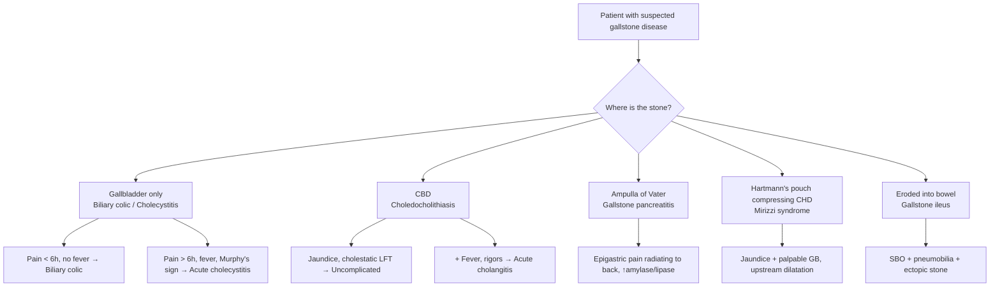
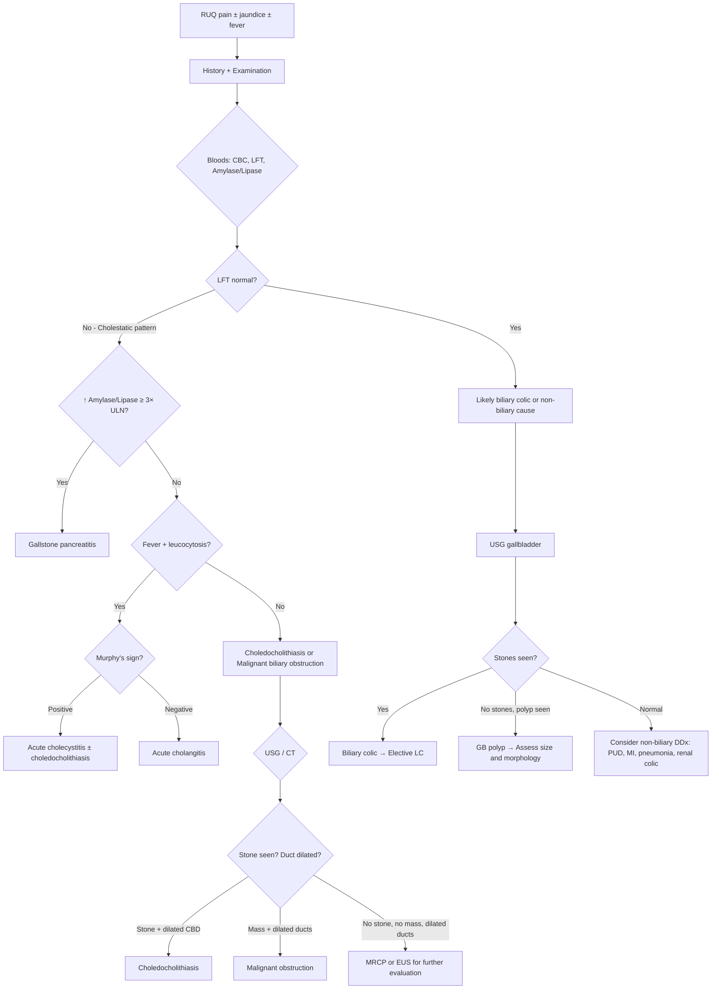

## Differential Diagnosis of Gallstones

The differential diagnosis of gallstones must be approached systematically because gallstones themselves present in many different ways — and at each presentation (RUQ pain, jaundice, cholangitis, pancreatitis), there is a different differential list. The key clinical skill is to determine (1) **is this gallstone-related or not?** and (2) **if gallstone-related, which specific gallstone complication is it?**

Think of the differential as concentric circles: first, distinguish among the various gallstone presentations themselves (biliary colic vs. cholecystitis vs. choledocholithiasis vs. cholangitis vs. pancreatitis), and second, distinguish gallstone disease from non-gallstone conditions that mimic it.

---

### 1. The Clinical Problem: Where Does the Stone Sit?

Before considering non-gallstone diagnoses, you must first differentiate *within* the gallstone spectrum, because the management is radically different:

The key differentiating features among gallstone presentations themselves were covered in detail in the Clinical Features section. The summary table below is useful for rapid ward-round differentiation [1][2]:

| Feature | Biliary Colic | Acute Cholecystitis | Choledocholithiasis | Acute Cholangitis | Gallstone Pancreatitis |
|---|---|---|---|---|---|
| **Pain duration** | < 6h | ***> 6h*** | > 6h | Variable | Hours–days |
| **Fever** | No | Yes | ± | ***Yes (with rigors)*** | Yes (chemical) |
| **Jaundice** | No | Usually No | ***Yes*** | ***Yes*** | ± |
| **Murphy's sign** | No | ***Yes*** | No | No | No |
| **Labs** | Normal | ↑WBC, CRP | ***Cholestatic LFT*** | ↑WBC + ***cholestatic LFT*** | ***↑ Amylase/lipase*** ≥ 3× ULN |
| **Key imaging** | USG: stone + shadow | ***USG: 5 cardinal signs*** | ***USG: dilated CBD*** | USG: dilated CBD | CT (if severe) |

---

### 2. Differential Diagnosis by Presenting Complaint

The DDx changes depending on how the patient walks in. Let's go through each major presentation.

#### 2.1 DDx of RUQ Pain (Biliary Colic / Acute Cholecystitis Presentation)

This is the most common exam scenario: a patient with RUQ pain after a fatty meal. The differential is broad because many structures occupy or refer pain to the RUQ.

| Category | Condition | How to Differentiate from Gallstones |
|---|---|---|
| **Biliary** | ***Gallbladder polyps*** (adenoma, cholesterolosis, adenomyomatosis) | USG: polyps are ***not gravity-dependent and have no posterior acoustic shadow*** (unlike stones which are gravity-dependent with shadowing) [1][2][5] |
| | ***Sphincter of Oddi dysfunction*** | Pain < 6h, intermittent; ***normal laboratory and radiological tests***; diagnosed by manometry [1] |
| | ***Functional gallbladder disorder*** | Pain < 6h, intermittent; ***normal laboratory and radiological tests***; diagnosed by HIDA with CCK-stimulated ejection fraction < 35% [1] |
| **Hepatic** | ***Acute hepatitis*** (viral, alcoholic, drug-induced) | Markedly ↑ AST/ALT (hepatocellular pattern, NOT cholestatic); history of viral exposure, alcohol, drugs; USG: no stones, may show hepatomegaly |
| | ***Liver abscess*** (pyogenic or amoebic) | Swinging fever, tender hepatomegaly; USG/CT: hypoechoic/hypodense lesion in liver parenchyma; travel history (amoebic) [1] |
| | ***Hepatocellular carcinoma*** | Chronic liver disease background; AFP elevated; CT: arterial enhancement with portal venous washout |
| **Gastroduodenal** | ***Peptic ulcer disease*** (gastric/duodenal ulcer) | Epigastric burning, meal-related (DU relieved by food, GU worsened); OGD diagnostic; perforation → pneumoperitoneum on erect CXR [1] |
| **Pancreatic** | ***Acute pancreatitis*** | Epigastric pain ***radiating to the back***, improves leaning forward; ***↑ amylase/lipase ≥ 3× ULN***; gallstones may be the cause (gallstone pancreatitis is both a complication of gallstones AND a differential for RUQ pain) [1] |
| **Intestinal** | ***Acute appendicitis*** (retrocaecal/high appendix) | Pain typically starts periumbilical then migrates to RIF; McBurney's point tenderness; CT: inflamed appendix with periappendiceal fat stranding [1] |
| **Pulmonary/Cardiac** | ***Right lower lobe pneumonia*** | Cough, sputum, pleuritic chest pain referred to RUQ; CXR: consolidation in RLL [1] |
| | ***Pleurisy*** | Pleuritic pain, friction rub; CXR may show effusion |
| | ***Myocardial infarction*** (inferior MI) | Epigastric pain, diaphoresis, nausea; ECG: ST changes in II, III, aVF; troponin elevated [1] |
| **Renal** | ***Right renal colic*** | Loin-to-groin pain, haematuria; CT KUB: ureteric stone; differentiated from gallstone on ***lateral AXR view*** (renal stone is posterior, gallstone is anterior) [2] |
| **Musculoskeletal** | ***Costochondritis / intercostal pathology*** | Reproducible with palpation of chest wall; no peritoneal signs |

<Callout title="The Dangerous Mimics" type="error">
Two conditions that mimic biliary colic but carry life-threatening consequences if missed:
1. ***Inferior myocardial infarction*** — can present as pure epigastric/RUQ pain with nausea and vomiting, especially in elderly/diabetic patients. Always do an ***ECG*** in anyone with upper abdominal pain.
2. ***Right lower lobe pneumonia*** — diaphragmatic irritation refers pain to the RUQ. Always get an ***erect CXR*** in any patient with RUQ pain and fever [1].
</Callout>

#### 2.2 DDx of Obstructive Jaundice (Choledocholithiasis Presentation)

When a patient presents with jaundice + cholestatic LFT, you must differentiate stone from tumour because the management diverges completely. The lecture slides emphasise: ***"Painless progressive obstructive jaundice in the elderly is malignant biliary obstruction until proven otherwise"*** [3][5].

The differential of obstructive jaundice is classically organised by the **anatomical relationship to the bile duct wall** [3]:

| Location | Cause | Key Distinguishing Features |
|---|---|---|
| ***Intraluminal*** | ***Choledocholithiasis*** | Intermittent/fluctuating jaundice, colicky pain, history of gallstones; USG: stone in CBD |
| | ***RPC (Recurrent Pyogenic Cholangitis)*** | SE Asian patient, recurrent cholangitis episodes, intrahepatic ductal dilatation with stones, ***left lobe predominance*** [1][2] |
| ***Mural (wall of duct)*** | ***Cholangiocarcinoma*** | ***Painless progressive jaundice***; perihilar (Klatskin) → early jaundice; CA19-9 ↑; MRCP: stricture without stone [3][5] |
| | ***Primary sclerosing cholangitis (PSC)*** | Young male with IBD (especially UC); multifocal strictures + dilatation ("beading" on MRCP); ↑ ALP; p-ANCA +ve [1] |
| ***Extramural (extrinsic compression)*** | ***CA head of pancreas*** | ***Painless progressive obstructive jaundice***; ***palpable gallbladder (Courvoisier's sign)***; ***double duct sign*** on CT (dilated CBD + pancreatic duct); weight loss; new-onset DM [5][6] |
| | ***Periampullary carcinoma*** | Jaundice + melaena (ulceration into duodenum); ampullary tumour visible on duodenoscopy at ERCP |
| | ***Lymphadenopathy*** (porta hepatis nodes) | History of lymphoma, metastatic disease; CT: enlarged nodes compressing CBD |
| | ***Mirizzi syndrome*** | Gallstone at Hartmann's pouch compressing CHD extrinsically; ***jaundice with palpable GB*** (exception to Courvoisier's Law); biliary dilatation above level of GB neck with normal CBD below [1][2] |

**Differentiating stone vs tumour at the bedside** — the critical clinical question [3]:

| Feature | ***Gallstone (Benign)*** | ***Malignant Biliary Obstruction*** |
|---|---|---|
| **Pain** | ***Present*** (colicky/RUQ) | ***Painless*** (or dull, progressive) |
| **Jaundice pattern** | ***Fluctuating / intermittent*** | ***Progressive, unrelenting*** |
| **Fever** | Common (cholangitis) | Uncommon (unless stent-related) |
| **Weight loss** | Uncommon | ***Marked*** |
| **Palpable GB** | ***Not palpable*** (fibrosed from chronic cholecystitis) | ***Palpable*** (Courvoisier's Law) |
| **Age** | Any age | ***Elderly*** |
| **History** | Previous biliary colic / stones | May have new-onset DM, back pain |

> ***Imaging approach*** [5]: ***Ultrasound / CT*** is first-line for obstructive jaundice to determine: (i) ***size of bile duct*** (dilated = obstructive), (ii) ***level of obstruction*** (intrahepatic vs hilar vs distal), (iii) ***cause of obstruction*** (stone vs mass), and (iv) ***other associated features*** (staging for malignant disease; complications for benign disease e.g., gallstones) [5].

#### 2.3 DDx of Fever + Jaundice + RUQ Pain (Cholangitis Presentation)

When the patient presents with ***Charcot's triad*** or ***Reynolds' pentad***, the differential includes [1]:

| Condition | How to Differentiate |
|---|---|
| ***Acute cholangitis*** (from choledocholithiasis) | Most common cause; dilated CBD with stone on USG; cholestatic LFT + leucocytosis |
| ***RPC*** | SE Asian patient; intrahepatic pigment stones; strictures on MRCP; recurrent episodes [1][2] |
| ***Acute cholecystitis with choledocholithiasis*** | Murphy's sign positive; GB wall thickening on USG; CBD may also be dilated |
| ***Liver abscess*** (pyogenic / amoebic) | Swinging fever; USG/CT: focal intrahepatic collection; blood cultures may grow gut organisms; no biliary dilatation unless secondary [1] |
| ***Infected choledochal cyst*** | Young patient (usually < 10y); RUQ mass + pain + jaundice + fever; USG: cystic dilatation of bile duct; MRCP for anatomy [5] |
| ***Biliary leaks*** (post-surgical) | History of recent biliary surgery; biloma on imaging |
| ***Acute pancreatitis*** | May coexist; epigastric pain radiating to back; ↑ amylase/lipase [1] |
| ***Acute hepatitis*** | Hepatocellular LFT pattern (AST/ALT > > ALP); viral serology positive |
| ***Malignant biliary obstruction with secondary infection*** | Progressive jaundice → superimposed infection (especially post-stent); mass on CT; CA19-9 elevated [3][5] |

#### 2.4 DDx of Acute Pancreatitis

When gallstone pancreatitis is suspected, you must exclude other causes of acute pancreatitis. The mnemonic ***GAME ID*** is useful [2]:

| Letter | Cause | Clue |
|---|---|---|
| **G** | ***Gallstones (MC — 55%)*** [4] | History of biliary colic; ***↑ ALP***; stones on USG |
| **A** | ***Alcohol (35%)*** [4] | History of binge drinking; ***↑ AST***; MCV elevated |
| **M** | ***Metabolic*** (hypertriglyceridaemia, hypercalcaemia) | Lipid panel; calcium level |
| **E** | ***ERCP*** (post-procedural) | Within 24h of ERCP |
| **I** | ***Idiopathic (10%)*** | Diagnosis of exclusion |
| **D** | ***Drugs*** (NSAIDs, steroids, azathioprine, valproate) | Drug history |
| | ***Others***: trauma, infections (mumps), autoimmune (SLE), tumours, pancreatic divisum | Context-dependent |

---

### 3. DDx of Gallbladder Polyps vs Gallstones on USG

This is a specific but commonly tested differentiation [2][5]:

| Feature | Gallstone | Gallbladder Polyp |
|---|---|---|
| **Gravity dependence** | ***Yes*** — moves with position change (rolling stone sign) | ***No*** — fixed to wall |
| **Posterior acoustic shadow** | ***Yes*** | ***No*** |
| **Shape** | Variable | Sessile or pedunculated |
| **Vascularity on Doppler** | None | May show flow |

<Callout title="Why does this matter?">
Polyps ≥ 1 cm carry significant malignant potential (up to 46% if 1.5 cm) and are an indication for cholecystectomy even if asymptomatic. Gallstones alone without symptoms can be observed. The USG characteristics above are how you tell them apart [2][5].
</Callout>

---

### 4. Important Principles to Distinguish Pre-hepatic, Hepatic, and Obstructive Jaundice

This is foundational to the differential diagnosis of any jaundice and highly relevant when a patient with "gallstones" presents with yellow skin [3]:

| Feature | Pre-hepatic (Haemolysis) | Hepatic (Hepatocellular) | Post-hepatic (Obstructive) |
|---|---|---|---|
| **Bilirubin type** | Unconjugated | Mixed | ***Conjugated*** |
| **Urine colour** | Normal | Dark | ***Tea-coloured*** (conjugated bilirubin is water-soluble → filtered by kidneys) |
| **Stool colour** | Normal/dark | Variable | ***Pale / clay-coloured*** (no bilirubin reaching gut) |
| **Pruritus** | No | ± | ***Yes*** (bile salt deposition in skin) |
| **LFT pattern** | ↑ unconj. bilirubin | ↑ AST/ALT > > ALP | ***↑ ALP, ↑ GGT > > AST/ALT*** |
| **Examples** | Thalassaemia, G6PD, sickle cell | Hepatitis, cirrhosis, drugs | ***Gallstones, tumours, PSC*** |

> History-taking tip from the senior notes [3]: Ask about ***urine colour*** (tea-coloured = obstructive) and ***stool colour*** (pale, floating, foul-smelling steatorrhoea = obstructive). Also exclude non-biliary causes of dark urine: rifampicin, Pyridium, beetroot [3].

---

### 5. Diagnostic Approach Algorithm

Once you suspect gallstone disease, the following algorithmic thinking helps you navigate the DDx:

---

### 6. Less Common but Important Differentials (Hong Kong Context)

| Condition | Relevance | Key Features |
|---|---|---|
| ***Recurrent pyogenic cholangitis (RPC)*** | "Hong Kong disease" — must consider in any local patient with recurrent cholangitis + intrahepatic stones | Brown pigment stones in intrahepatic ducts (especially left lobe); ***stasis + stricturing + recurrent infection*** cycle; parasites (*Clonorchis sinensis*); complications include cholangiocarcinoma [1][2] |
| ***Choledochal cyst*** | Congenital dilatation of biliary system; most diagnosed before age 10 | RUQ mass + pain + jaundice + fever; pancreatitis; risk of cholangiocarcinoma; ***Todani classification*** (Type I most common); excision + Roux-en-Y hepaticojejunostomy [2][5] |
| ***Cholangiocarcinoma*** | Can mimic choledocholithiasis with obstructive jaundice | Painless progressive jaundice; ***Klatskin tumour*** (perihilar) most common; ***CA 19-9*** elevated; differentiate from stone on MRCP (stricture without stone vs. filling defect) [1] |
| ***Pancreatic carcinoma*** | CA head of pancreas is the classic cause of painless obstructive jaundice | ***Double duct sign*** on CT; ***Courvoisier's sign*** positive (palpable non-tender GB); new-onset DM; weight loss [5][6] |
| ***IgG4-related cholangitis*** | Immune-mediated; can mimic cholangiocarcinoma | Mostly elderly males; ↑ serum IgG4; steroid-responsive; associated with autoimmune pancreatitis [3] |

<Callout title="High Yield DDx Summary for Exams">

When asked "DDx of gallstones", think systematically:

1. **Differentiate within gallstone complications first**: biliary colic vs cholecystitis vs choledocholithiasis vs cholangitis vs pancreatitis vs Mirizzi vs gallstone ileus — use pain duration, fever, jaundice, Murphy's sign, and labs.

2. **Then differentiate from non-gallstone mimics** based on the presenting complaint:
   - RUQ pain: PUD, hepatitis, liver abscess, appendicitis, RLL pneumonia, ***inferior MI***, renal colic
   - Obstructive jaundice: ***CA head of pancreas*** (Courvoisier +), cholangiocarcinoma, PSC, Mirizzi, choledochal cyst
   - Cholangitis: RPC, liver abscess, infected choledochal cyst, biliary leak
   - Pancreatitis: GAME ID (Gallstones, Alcohol, Metabolic, ERCP, Idiopathic, Drugs)

3. **Imaging first-line**: ***USG/CT*** to determine duct size, level of obstruction, cause, and associated features [5].

4. **Courvoisier's Law** helps distinguish stone from tumour: palpable GB + painless jaundice = tumour until proven otherwise.

5. **Polyp vs stone on USG**: polyp = fixed, no shadow; stone = gravity-dependent, posterior acoustic shadow.
</Callout>

---

<ActiveRecallQuiz
  title="Active Recall - DDx of Gallstones"
  items={[
    {
      question: "A 65-year-old woman presents with painless progressive jaundice and a palpable non-tender gallbladder. What is the most likely diagnosis and why?",
      markscheme: "Malignant biliary obstruction (most likely CA head of pancreas or distal cholangiocarcinoma). Courvoisier's Law: palpable GB in painless jaundice means the GB wall is NOT fibrosed from chronic cholecystitis, so the cause is unlikely gallstones. The progressive nature and painlessness point to malignancy.",
    },
    {
      question: "How do you differentiate a gallbladder polyp from a gallstone on ultrasound?",
      markscheme: "Gallstone: gravity-dependent (moves with position change / rolling stone sign) + posterior acoustic shadow. Polyp: fixed to wall (not gravity-dependent) + no posterior acoustic shadow. Polyps may show vascularity on Doppler.",
    },
    {
      question: "Name the two dangerous mimics of biliary colic that must not be missed, and what initial investigation should be done for each.",
      markscheme: "1. Inferior myocardial infarction - do an ECG. 2. Right lower lobe pneumonia - do an erect CXR. Both can present with RUQ/epigastric pain and nausea.",
    },
    {
      question: "A patient in Hong Kong presents with recurrent episodes of Charcot's triad. USG shows intrahepatic ductal dilatation with stones, predominantly in the left lobe. What is the diagnosis and what type of stones would you expect?",
      markscheme: "Recurrent pyogenic cholangitis (RPC / Hong Kong disease). Expect brown pigment stones (calcium bilirubinate + bacterial cell bodies) formed de novo in intrahepatic ducts, driven by parasitic/bacterial infection and beta-glucuronidase activity.",
    },
    {
      question: "What is the GAME ID mnemonic for causes of acute pancreatitis? Which is the most common cause?",
      markscheme: "G = Gallstones (most common, 55%), A = Alcohol (35%), M = Metabolic (hyperTG, hyperCa), E = ERCP, I = Idiopathic (10%), D = Drugs (NSAIDs, steroids, azathioprine, valproate). Others include trauma, infections, autoimmune, tumours.",
    },
  ]}
/>

## References

[1] Senior notes: felixlai.md (Cholelithiasis, Cholecystitis, Acute Cholangitis, Mirizzi Syndrome, Acute Pancreatitis, Cholangiocarcinoma, Gallbladder Cancer, RPC sections)
[2] Senior notes: maxim.md (Gallstone Diseases, Biliary Colic, Acute Cholecystitis, Choledocholithiasis, Mirizzi Syndrome, Gallstone Ileus, RPC, Acute Cholangitis, Acute Pancreatitis, GB Polyps, GB Carcinoma, Pancreatic Carcinoma, Choledochal Cyst sections)
[3] Lecture slides: GC 200. RUQ pain, jaundice and fever Cholecytitis and cholangitis Imaging of GI system.pdf
[4] Lecture slides: Acute pancreatitis.pdf
[5] Lecture slides: Malignant biliary obstruction.pdf
[6] Senior notes: maxim.md (Pancreatic carcinoma section)
