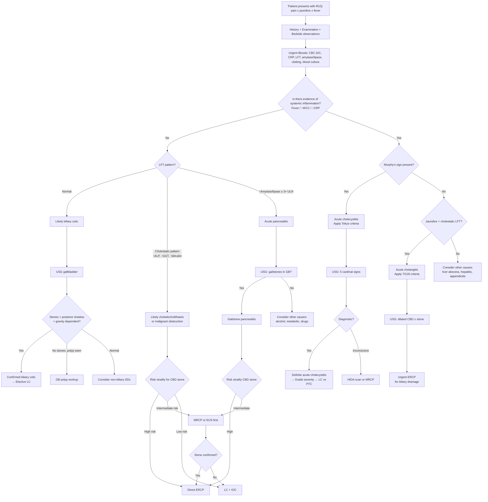

## Diagnostic Criteria, Diagnostic Algorithm & Investigation Modalities

### 1. Diagnostic Criteria by Clinical Presentation

Gallstones don't have a single set of diagnostic criteria — the criteria change depending on *which clinical syndrome* the patient is presenting with. Think of it as asking: "What is the stone doing right now?" Each scenario has its own formal criteria or clinical definition.

---

#### 1.1 Biliary Colic — Clinical Diagnosis

There are no formal "criteria" for biliary colic per se. It is a **clinical diagnosis** confirmed by imaging. You diagnose it by putting together the story and the ultrasound:

| Component | Required |
|---|---|
| **Characteristic pain** | Steady (not colicky) RUQ/epigastric pain, < 6 hours, post-prandial (fatty meal), radiating to right shoulder/scapula |
| **No systemic inflammation** | Afebrile, normal WCC, normal CRP |
| **Normal or near-normal LFT** | If cholestatic LFT → think choledocholithiasis; if ↑ amylase → think pancreatitis |
| **USG: gallstones present** | ***Hyperechoic stone with posterior acoustic shadowing, gravity-dependent*** [2][3] |
| **No GB wall abnormality** | No wall thickening, no pericholecystic fluid, no sonographic Murphy's sign |

> The key principle: biliary colic = stone + characteristic pain + **no** inflammation + **no** obstruction. The moment you add fever, leucocytosis, positive Murphy's sign, or cholestatic LFT, you've moved beyond simple biliary colic into a complication.

---

#### 1.2 Acute Cholecystitis — Tokyo Guidelines (TG18/TG13) Diagnostic Criteria

***The Tokyo Guidelines provide the standard diagnostic criteria for acute cholecystitis*** [1][2][3]. The diagnosis is made by combining **local signs**, **systemic signs**, and **imaging findings**.

| Category | Criteria |
|---|---|
| ***A: Local signs of inflammation*** | ***Murphy's sign***; ***RUQ mass / pain / tenderness*** |
| ***B: Systemic signs of inflammation*** | ***Fever***; ***Leukocytosis***; ***Elevated CRP*** |
| ***C: Imaging findings*** | ***Imaging findings characteristic of acute cholecystitis*** (see USG 5 cardinal signs below) |

**Interpretation** [1]:

| Diagnosis Level | Requirement |
|---|---|
| ***Suspected diagnosis*** | ***One item in A + One item in B*** |
| ***Definite diagnosis*** | ***One item in A + One item in B + C (confirmatory imaging)*** |

<Callout title="Tokyo Guidelines — Must Know!">
The Tokyo criteria are straightforward: local signs + systemic signs = suspected; add imaging confirmation = definite. In the exam, if you are asked "how do you diagnose acute cholecystitis?", state the Tokyo criteria explicitly. The ***5 cardinal USG signs*** are the imaging component [2]:
1. Presence of gallstones
2. Distended GB ( > 4 × 10 cm)
3. GB wall thickening > 3 mm
4. Pericholecystic fluid / stranding
5. Sonographic Murphy sign
</Callout>

The Tokyo Guidelines also grade **severity** (important for management decisions):

| Grade | Severity | Definition |
|---|---|---|
| **Grade I (Mild)** | No organ dysfunction; mild inflammatory disease in an otherwise healthy patient | Does not meet Grade II or III criteria |
| **Grade II (Moderate)** | Associated with any of: WCC > 18,000; palpable RUQ mass; duration > 72h; marked local inflammation (gangrenous, emphysematous, pericholecystic abscess, hepatic abscess, biliary peritonitis) | Significant local inflammation but no organ dysfunction |
| **Grade III (Severe)** | Associated with organ dysfunction in any one system | Cardiovascular (hypotension requiring pressors), neurological (↓ consciousness), respiratory (PaO2/FiO2 < 300), renal (oliguria, Cr > 2.0), hepatic (INR > 1.5), haematological (platelets < 100,000) |

Why does severity grading matter? Because Grade I → elective/early LC; Grade II → early LC with more careful perioperative support; Grade III → initial organ support + ***percutaneous cholecystostomy (PTC)*** if unfit for surgery, with delayed LC once stabilised [2].

---

#### 1.3 Acute Cholangitis — Tokyo Guidelines (TG18) Diagnostic Criteria

***The TG18 criteria for acute cholangitis*** follow a similar logic — systemic inflammation + biliary obstruction [1]:

| Component | Criteria |
|---|---|
| ***A: Systemic inflammation*** | ***Fever ( > 38°C) / shaking chills*** **OR** ***Laboratory evidence of inflammatory response*** (abnormal WCC / ↑ CRP / other changes) |
| ***B: Cholestasis*** | ***Jaundice*** **OR** ***Abnormal liver chemistries*** (↑ AST/ALT/ALP/GGT) |
| ***C: Imaging*** | ***Biliary dilatation on imaging*** **AND** ***Evidence of aetiology*** (stone, stricture, or stent on imaging) |

**Interpretation** [1]:

| Diagnosis Level | Requirement |
|---|---|
| ***Suspected diagnosis*** | ***One item in A + One item in B*** |
| ***Definite diagnosis*** | ***Suspected diagnosis + BOTH items in C*** (biliary dilatation + identified aetiology on imaging) |

**Severity grading of acute cholangitis** (TG18):

| Grade | Severity | Definition |
|---|---|---|
| **Grade I (Mild)** | Responds to initial medical treatment (antibiotics + supportive care) | No organ dysfunction, responds within 24–48h |
| **Grade II (Moderate)** | Does not respond to initial treatment; requires biliary drainage | Two or more of: WCC > 12,000 or < 4,000; fever ≥ 39°C; age ≥ 75; bilirubin ≥ 5 mg/dL; albumin < 0.7× lower normal limit |
| **Grade III (Severe)** | Organ dysfunction in any one system | Same organ dysfunction criteria as cholecystitis Grade III — this is essentially ***Reynolds' pentad*** territory: septic shock + altered mental status [1][2] |

<Callout title="Cholangitis Grading Drives Urgency of Drainage" type="error">
Grade III (severe) cholangitis = ***urgent biliary drainage within 24 hours*** (ERCP first-line). Do NOT wait. Grade II = ***early biliary drainage within 24–48 hours***. Grade I = may respond to antibiotics alone, but if no improvement → biliary drainage. The key teaching point: ***the sicker the patient, the more urgent the drainage*** [2][3].
</Callout>

---

#### 1.4 Choledocholithiasis — Risk Stratification (Not Formal "Criteria")

Choledocholithiasis does not have formal diagnostic criteria like cholecystitis/cholangitis. Instead, you **risk-stratify** to decide which investigation to use — this is the critical decision-making step [1][2]:

| Risk Level | Predictors | Next Investigation |
|---|---|---|
| ***High risk*** | ***CBD stone visible on USG***; or ***clinical acute cholangitis***; or ***bilirubin > 4 mg/dL + dilated CBD*** | ***Proceed directly to ERCP*** (diagnostic + therapeutic) [1][2] |
| ***Intermediate risk*** | Abnormal LFT (cholestatic pattern) but no stone seen on USG; dilated CBD ( > 8 mm) without visible stone; age > 55; clinical gallstone pancreatitis | ***MRCP or EUS*** first (non-invasive confirmation before committing to ERCP) [1][2] |
| ***Low risk*** | Normal LFT, normal CBD calibre, no clinical features of obstruction | ***No further biliary imaging needed*** — proceed to elective cholecystectomy ± intraoperative cholangiogram (IOC) [1] |

> **Why not just do ERCP on everyone?** Because ERCP is invasive with significant complications (***post-ERCP pancreatitis*** in 3–10%, perforation, haemorrhage, cholangitis). It should be reserved for cases where you are confident there IS a CBD stone to treat, or when the patient needs urgent therapeutic drainage [1][2].

---

#### 1.5 Gallstone Pancreatitis — Diagnostic Criteria

Acute pancreatitis (of any cause) requires ***2 out of 3*** of the following [1]:

| Criterion | Detail |
|---|---|
| **1. Characteristic abdominal pain** | Epigastric pain radiating to the back, severe, persistent |
| **2. Serum amylase or lipase ≥ 3× upper limit of normal** | Lipase preferred (more sensitive, stays elevated longer) |
| **3. Imaging findings** | CT/MRI showing pancreatic inflammation (oedema, necrosis, peripancreatic fluid) |

You attribute it to **gallstones** (rather than alcohol/other causes) when:
- Gallstones are present on USG
- ***↑ ALP*** (suggests biliary origin rather than alcoholic — suspect gallstones if ALP elevated) [2]
- ***↑ ALT > 3× ULN*** within 48h has high positive predictive value for gallstone aetiology
- No history of significant alcohol intake
- ***↑ AST*** more suggestive of alcohol [2]

---

### 2. Master Diagnostic Algorithm

The following algorithm synthesises the approach from first presentation to definitive investigation. This is how you should think on a ward round:

---

### 3. Investigation Modalities — Detailed Breakdown

#### 3.1 Bedside & Laboratory Investigations

| Investigation | What to Order | Key Findings & Interpretation | Pathophysiological Basis |
|---|---|---|---|
| ***CBC with differential count*** | FBC, WCC, neutrophils, band forms | **Normal** in biliary colic; ***↑ WCC with left shift*** in cholecystitis/cholangitis; very high WCC ( > 18,000) → gangrenous cholecystitis/perforation [1] | Bacterial infection → bone marrow releases immature neutrophils (bands) |
| ***CRP*** | Inflammatory marker | Elevated in cholecystitis, cholangitis; serial monitoring useful for treatment response | Acute-phase reactant synthesised by liver in response to IL-6 |
| ***LFT*** | Bilirubin, ALP, GGT, AST, ALT, albumin | **Normal** in biliary colic; ***Liver chemistry usually NORMAL in acute cholecystitis*** but mild elevation may occur [1]; ***cholestatic pattern*** (↑ ALP, ↑ GGT > > ↑ AST/ALT) in choledocholithiasis/cholangitis; ***↑ AST/ALT early***, then ***↑ ALP/GGT later*** in the course of biliary obstruction [1] | ALP/GGT are located on the canalicular membrane of hepatocytes → biliary obstruction → bile backs up → ↑ synthesis and release of these enzymes; AST/ALT leak from damaged hepatocytes due to bile toxicity |
| | Conjugated bilirubin predominates | In obstructive jaundice, bilirubin is conjugated but cannot be excreted → refluxes into blood | Conjugated bilirubin is water-soluble → filtered by kidneys → ***dark/tea-coloured urine***; no bilirubin reaches gut → ***pale stools*** |
| ***Serum amylase / lipase*** | Lipase preferred | ***≥ 3× ULN*** → diagnose acute pancreatitis; lipase rises within 4–8 hours, peaks at 24 hours, persists up to 2 weeks [1]; amylase rises earlier but returns to normal faster (3–5 days) | Pancreatic acinar cell injury → enzyme leak into blood. Lipase is more specific (amylase also elevated in salivary gland disease, macroamylasaemia, bowel obstruction) |
| ***Clotting profile*** | PT/INR | May be ***prolonged in obstructive jaundice*** | No bile salts in gut → no fat absorption → ***no vitamin K absorption*** (fat-soluble vitamin) → ↓ synthesis of factors II, VII, IX, X → prolonged PT [1] |
| ***Blood cultures*** | Aerobic + anaerobic bottles | ***Must send in suspected cholangitis BEFORE starting antibiotics*** [2] | Bacteraemia in cholangitis from translocation of gut organisms (E. coli, Klebsiella) through inflamed biliary mucosa into portal/systemic circulation |
| ***RFT*** | Urea, creatinine, electrolytes | Assess for dehydration, sepsis-related AKI, baseline before contrast imaging | Sepsis → pre-renal AKI; obstructive jaundice → hepatorenal syndrome (rare) |
| ***Urinalysis*** | Bilirubin, urobilinogen | ***Conjugated bilirubin positive*** in obstructive jaundice; ***urobilinogen absent*** (because no bilirubin reaches the gut to be converted) [1] | Confirms obstructive mechanism |
| ***Tumour markers*** | CA 19-9, CEA | ***NOT diagnostically useful*** (lack sensitivity and specificity); useful for ***monitoring after resection*** for recurrence [1] | CA 19-9 elevated in cholangiocarcinoma, pancreatic cancer, but also in benign cholangitis, pancreatitis — low specificity |
| ***Cardiac markers + ECG*** | Troponin, 12-lead ECG | ***Exclude myocardial infarction*** as a mimic of epigastric/RUQ pain [1] | Inferior MI (RCA territory) → diaphragmatic irritation → referred epigastric/RUQ pain |
| ***Erect CXR*** | PA chest film | Rule out ***right lower lobe pneumonia*** (RUQ pain mimic); ***air under diaphragm*** (perforated viscus); ***pleural effusion*** (pancreatitis complication) | Diaphragmatic irritation from RLL consolidation → referred RUQ pain |
| ***AXR*** | Supine abdomen | Only ~15% gallstones visible (pigment stones are radiopaque); ***Mercedes-Benz sign*** (gas in stone fissures); ***pneumobilia*** (gallstone ileus, post-ERCP); ***Rigler's triad*** (pneumobilia + SBO + ectopic stone = gallstone ileus) [2]; sentinel loop / colon cut-off sign (pancreatitis) | Limited sensitivity — USG is far superior for gallstones |

<Callout title="LFT Interpretation in Biliary Disease — A Key Concept" type="idea">
The **temporal evolution** of LFT in biliary obstruction is important [1]:
- **Early** (first 24–48h): ***↑ AST and ALT*** — because back-pressure of bile causes hepatocyte damage → transaminase leak. ALT may transiently spike to > 1000 IU/L, mimicking hepatitis.
- **Later** (days to weeks): ***↑ ALP and GGT predominate*** — the classic "cholestatic pattern" — as the biliary epithelium upregulates ALP synthesis in response to obstruction.
- If you catch the patient early, the LFT may look "hepatocellular" and fool you into thinking it's hepatitis. Always repeat LFT in 24–48h — the pattern will shift to cholestatic if it's truly obstructive.
</Callout>

---

#### 3.2 Imaging Modalities

##### 3.2.1 Transabdominal Ultrasound (USG)

***USG is the initial standard imaging study of choice for suspected gallstone disease*** [1][2][3].

**Why USG first?** It is readily available, quick, non-invasive, no radiation, no contrast, inexpensive, and has excellent sensitivity for gallbladder stones (~95%). It simultaneously assesses the liver, bile ducts, and pancreas.

| Finding | Significance | Pathophysiological Basis |
|---|---|---|
| ***Hyperechoic focus with posterior acoustic shadowing*** | Gallstone in GB | Stone reflects all ultrasound waves (hyperechoic) and blocks transmission behind it (shadow) [2] |
| ***Gravity-dependent / rolling stone sign*** | Confirms stone (not polyp) | Stone is mobile, moves when patient changes position; polyp is fixed to wall [1][2] |
| ***Distended GB ( > 4 × 10 cm)*** | Cystic duct obstruction (cholecystitis, mucocele) | Bile cannot exit → accumulation → distension |
| ***GB wall thickening > 3 mm*** | Inflammation (cholecystitis) | Oedema and inflammatory infiltrate in GB wall |
| ***Double-wall sign*** | Wall oedema in cholecystitis | Intramural oedema separates mucosal and serosal layers |
| ***Pericholecystic fluid*** | Cholecystitis with serosal inflammation | Exudate from inflamed GB serosa |
| ***Sonographic Murphy sign*** | Acute cholecystitis | Pressing USG probe over GB reproduces maximum tenderness (localises inflammation to GB specifically) |
| ***Contracted, thick-walled GB*** | Chronic cholecystitis | Fibrosis from repeated inflammation [2] |
| ***Dilated CBD ( > 8 mm)*** | Biliary obstruction (choledocholithiasis, tumour) | Back-pressure from distal obstruction dilates the duct proximally [1][2] |
| ***Stone in CBD*** | Choledocholithiasis | ***Only visible in ~1/3 of cases*** — distal CBD often ***obscured by duodenal gas*** [1][2] |
| ***Dilated intrahepatic ducts*** | Proximal/hilar obstruction | Obstruction at or above the hilum (Klatskin tumour, RPC) |
| ***Wall calcification*** | Porcelain gallbladder | Chronic inflammation → dystrophic calcification of GB wall |

**Limitations of USG** [1][2]:
- ***Operator-dependent*** — quality varies with sonographer experience
- ***Limited by body habitus*** (obesity) and ***bowel gas*** (obscures distal CBD and pancreas)
- ***Poor sensitivity for distal CBD stones*** (~50%) — the duodenum overlies the distal CBD
- Cannot assess pancreatic necrosis or stage malignancy

> ***CBD diameter rule of thumb*** [2]: Normal ≤ 6 mm. Add ~1 mm per decade over 60. Post-cholecystectomy, up to 10 mm may be acceptable (the CBD dilates to compensate for loss of the gallbladder reservoir). If ≥ 8 mm with gallstones and biliary pain → suspicious for choledocholithiasis [1].

---

##### 3.2.2 HIDA Scan (Cholescintigraphy)

"HIDA" = **H**epatic **I**mino**D**iacetic **A**cid — a technetium-99m labelled radiotracer (99mTc-HIDA) that is taken up by hepatocytes and excreted into bile, mimicking bilirubin metabolism [1][2].

| Aspect | Detail |
|---|---|
| **Principle** | Radiotracer injected IV → taken up by liver → excreted into bile → normally fills GB within 30 min and enters duodenum within 60 min |
| **Positive for acute cholecystitis** | ***Non-visualisation of the gallbladder*** after 4 hours (because the cystic duct is obstructed → tracer cannot enter GB) [1] |
| **Chronic cholecystitis** | ***Delayed or reduced GB filling*** [2] |
| **Normal HIDA** | ***Excludes acute cholecystitis*** — high negative predictive value [1] |
| **Sensitivity/Specificity** | ~95% / ~90% — highly accurate but expensive and time-consuming |
| **Limitation** | ***Not useful in jaundiced patients*** — the liver cannot excrete the tracer if bilirubin is very high (competitive inhibition at the hepatocyte canalicular membrane) [1] |
| **Morphine augmentation** | Morphine IV → ↑ sphincter of Oddi pressure → forces bile into the GB if the cystic duct is patent → if GB still not seen, confirms obstruction. Used when HIDA is equivocal [2] |
| **When to use** | ***When USG is inconclusive*** and clinical suspicion for acute cholecystitis remains high [1][2] |

---

##### 3.2.3 MRCP (Magnetic Resonance Cholangiopancreatography)

"MRCP" is a ***non-contrast, T2-weighted*** MRI sequence that exploits the fact that stationary fluid (bile, pancreatic juice) appears bright white on T2, giving a "cholangiogram-like" image without any contrast or endoscopy [2].

| Aspect | Detail |
|---|---|
| **Principle** | T2 weighting → static fluid (bile) = bright signal; surrounding soft tissue = dark. Creates a "roadmap" of the biliary tree and pancreatic duct |
| **Sensitivity for CBD stones** | ~90–95% (far superior to USG for CBD/cystic duct stones) |
| **Advantages** | ***Non-invasive, no contrast, no radiation, no sedation***; superior to USG for cystic duct and distal CBD stones; can differentiate inflammatory from neoplastic masses on T2 images [1] |
| **Limitations** | ***NOT therapeutic*** — can only diagnose, cannot treat (unlike ERCP); lower spatial resolution for very small stones ( < 3 mm); claustrophobia; not widely available in emergency settings; contraindicated with some metallic implants |
| **When to use** | ***Intermediate risk of choledocholithiasis*** — when you want to confirm/exclude CBD stones before committing to ERCP [1][2]; to delineate biliary anatomy before surgery; Mirizzi syndrome workup [1] |

> MRCP has ***largely replaced diagnostic ERCP*** for choledocholithiasis. The principle is: use MRCP to diagnose, then proceed to ERCP only if a stone is confirmed and needs extraction [1].

---

##### 3.2.4 EUS (Endoscopic Ultrasound)

| Aspect | Detail |
|---|---|
| **Principle** | High-frequency ultrasound transducer mounted on an endoscope → positioned in the duodenum or stomach → gives close-range, high-resolution images of the CBD, pancreas, and ampulla without bowel gas interference |
| **Sensitivity for CBD stones** | ~95% — equivalent to or better than MRCP, especially for small stones ( < 5 mm) |
| **Advantages** | Overcomes the bowel gas limitation of transabdominal USG; excellent for distal CBD; can assess pancreatic masses and perform FNA/biopsy simultaneously |
| **Limitations** | Invasive (requires sedation, endoscopy); operator-dependent; not universally available |
| **When to use** | ***Intermediate risk of choledocholithiasis when MRCP is contraindicated*** (e.g., metallic implants); when MRCP is negative but clinical suspicion remains high [1]; staging of periampullary/pancreatic tumours [2] |

---

##### 3.2.5 ERCP (Endoscopic Retrograde Cholangiopancreatography)

***ERCP is both diagnostic and therapeutic — but should be reserved for patients with HIGH risk of CBD stones or who need urgent biliary drainage*** [1][2][3].

| Aspect | Detail |
|---|---|
| **Principle** | Side-viewing duodenoscope → cannulation of the ampulla of Vater → contrast injection into CBD/pancreatic duct → fluoroscopic imaging; allows simultaneous intervention |
| **Diagnostic findings** | Filling defects (stones), strictures, dilatation, cholecystobiliary fistula (Mirizzi), tumour |
| **Therapeutic capabilities** | ***Sphincterotomy*** (cutting the sphincter of Oddi to widen the ampullary opening); ***stone extraction*** (balloon or basket); ***mechanical lithotripsy*** (crushing large stones); ***biliary stent placement*** (for obstruction from stricture/tumour); ***biliary drainage*** (for cholangitis) [1][2] |
| **Complications** | ***Post-ERCP pancreatitis (3–10%)*** — most common; perforation; haemorrhage (post-sphincterotomy); cholangitis; basket impaction. Reduced by prophylactic rectal NSAIDs or temporary pancreatic stent [2] |
| **When to use** | ***High risk of CBD stone*** (stone seen on imaging, acute cholangitis, bilirubin > 4 + dilated CBD) [1]; ***urgent biliary drainage in acute cholangitis*** (first-line, Grade II–III) [2][3]; confirmed CBD stone on MRCP/EUS needing extraction |
| **When NOT to use** | Low/intermediate probability of CBD stone without prior non-invasive confirmation; sole diagnostic purpose when MRCP/EUS can answer the question |

---

##### 3.2.6 CT Abdomen (with Contrast)

| Aspect | Detail |
|---|---|
| **Principle** | Cross-sectional imaging with IV contrast; arterial, portal venous, and delayed phases |
| **Sensitivity for gallstones** | ***Only ~75%*** — many cholesterol stones are isodense with bile on CT [2]. USG is superior for gallbladder stones |
| **When CT excels** | ***Complications of cholecystitis*** (empyema, emphysematous cholecystitis — gas in GB wall, perforation, abscess) [2]; ***staging malignancy*** (cholangiocarcinoma, pancreatic cancer, GB cancer — assessing vascular invasion, LN involvement, distant metastases) [1][5]; ***acute pancreatitis*** — ***gold standard*** (Sn 90%, Sp 100%) for detecting necrosis, peripancreatic collections; CT changes may ***NOT appear within first 24 hours*** [1]; ***gallstone ileus*** (Rigler's triad much more sensitive on CT than AXR) [2] |
| **Specific CT findings** | ***Emphysematous cholecystitis***: gas within GB wall/lumen; ***Porcelain GB***: curvilinear calcification of GB wall; ***Double duct sign***: dilated CBD + dilated pancreatic duct → pancreatic head mass [2]; ***Pancreatic necrosis***: lack of enhancement with IV contrast [1] |

---

##### 3.2.7 PTC (Percutaneous Transhepatic Cholangiography)

| Aspect | Detail |
|---|---|
| **Principle** | Percutaneous needle inserted through the liver into an intrahepatic bile duct under fluoroscopic guidance → contrast injection → imaging of biliary tree |
| **Diagnostic** | Visualisation of biliary tree anatomy above an obstruction |
| **Therapeutic** | ***PTBD (percutaneous transhepatic biliary drainage)*** — external drain or internal stent to decompress obstructed bile ducts |
| **Preferred over ERCP when** | ***Obstruction at or above the confluence of hepatic ducts*** (e.g., Klatskin tumour, PSC, RPC) — ERCP cannot access above a complete hilar obstruction [2]; failed ERCP; surgically altered anatomy (e.g., Roux-en-Y) making endoscopic access impossible |
| **Complications** | ***Bacteraemia*** (antibiotic prophylaxis required), haemobilia, bile leak, pneumothorax [2] |

---

##### 3.2.8 Intraoperative Cholangiogram (IOC)

| Aspect | Detail |
|---|---|
| **Principle** | During laparoscopic cholecystectomy, contrast is injected via the cystic duct under fluoroscopy → images the CBD in real-time |
| **Purpose** | Detects ***residual/unsuspected CBD stones*** (present in ~5–10% of patients undergoing LC for gallstones); confirms biliary anatomy to avoid CBD injury |
| **When to use** | Low risk of CBD stones → LC with IOC (instead of pre-op MRCP); any case where anatomy is uncertain during surgery [1] |

---

### 4. Investigation Strategy by Clinical Scenario — Summary Table

| Clinical Scenario | First-Line Imaging | Second-Line / Confirmatory | Therapeutic |
|---|---|---|---|
| ***Biliary colic*** | ***USG*** (stones, no GB inflammation) | — | — (→ Elective LC) |
| ***Acute cholecystitis*** | ***USG*** (5 cardinal signs) | ***HIDA scan*** (if USG inconclusive); ***CT*** (if complications suspected) [1][2] | — (→ LC or PTC) |
| ***Choledocholithiasis (low risk)*** | ***USG*** | ***IOC*** during LC | LC + IOC |
| ***Choledocholithiasis (intermediate risk)*** | ***USG*** | ***MRCP*** or ***EUS*** [1][2] | ERCP if stone confirmed |
| ***Choledocholithiasis (high risk)*** | ***USG*** | — | ***ERCP directly*** (diagnostic + therapeutic) [1][2] |
| ***Acute cholangitis*** | ***USG*** (dilated CBD, stone, r/o liver abscess) | ***MRCP*** if ERCP delayed/unavailable | ***ERCP (1st line)*** [2][3] |
| ***Gallstone pancreatitis*** | ***USG*** (gallstones, CBD) | ***CT abdomen*** (if severe / after 72h); ***MRCP*** for CBD stone if intermediate risk | ***ERCP*** (if concurrent cholangitis or confirmed CBD stone) [1] |
| ***Mirizzi syndrome*** | ***USG*** (dilated ducts above GB neck, stone at neck, contracted GB) [1] | ***MRCP*** (high sensitivity); ***CT*** (r/o malignancy) [1] | ***ERCP*** (diagnostic + stenting) [1] |
| ***Gallstone ileus*** | ***AXR*** (Rigler's triad) | ***CT abdomen*** (much more sensitive) [2] | Surgical (enterolithotomy) |
| ***Malignant biliary obstruction*** | ***USG*** + ***CT*** [5] | ***MRCP***; ***EUS*** (staging + FNA) | ***ERCP*** (stenting for palliation) or ***PTC*** (if hilar obstruction) |

> ***Imaging for obstructive jaundice*** [5]: The lecture slides emphasise that ***USG / CT*** should assess: (i) ***Size of bile duct***, (ii) ***Level of obstruction***, (iii) ***Cause of obstruction***, (iv) ***Other associated features*** — ***staging for malignant disease; complications for benign disease (gallstones)*** [5].

---

### 5. Specific USG Findings Summary — Visual Checklist

| Condition | USG Findings |
|---|---|
| **Gallstone** | ***Hyperechoic + posterior acoustic shadow + gravity-dependent*** [2] |
| **GB polyp** | Hyperechoic + ***NO*** posterior shadow + ***NOT*** gravity-dependent + may have vascularity on Doppler [2] |
| **Acute cholecystitis** | ***5 cardinal signs*** (stones, distended GB, wall > 3mm, pericholecystic fluid, sono-Murphy) [2] |
| **Chronic cholecystitis** | ***Contracted GB + wall thickening + stones*** [2] |
| **Choledocholithiasis** | ***Dilated CBD > 8 mm ± visible stone*** (only 1/3 seen due to bowel gas) [1][2] |
| **Porcelain GB** | ***Curvilinear echogenic focus with posterior shadowing*** in GB wall (calcification) |
| **Mirizzi syndrome** | ***Dilated ducts ABOVE GB neck + stone at GB neck + normal CBD BELOW stone*** + contracted GB [1] |
| **Cholangitis** | ***Dilated CBD ± stone***; may show liver abscess [2] |
| **GB cancer** | Thickened irregular wall > 3 mm; mass protruding into lumen; loss of GB-liver interface; LN [1] |

---

<Callout title="High Yield Summary — Diagnosis of Gallstones">

1. **Biliary colic** = clinical diagnosis; USG confirms stones + normal GB wall + no systemic inflammation.
2. **Acute cholecystitis** = ***Tokyo criteria***: 1 local sign + 1 systemic sign = suspected; + imaging = definite. ***5 cardinal USG signs*** are the imaging gold standard.
3. ***HIDA scan*** = second-line when USG is inconclusive; non-visualisation of GB = cystic duct obstruction = cholecystitis.
4. **Acute cholangitis** = ***TG18 criteria***: systemic inflammation + cholestasis = suspected; + biliary dilatation with identified cause on imaging = definite. Severity grading dictates urgency of biliary drainage.
5. **Choledocholithiasis** = ***risk-stratify***: High → ERCP directly; Intermediate → MRCP/EUS first; Low → LC + IOC.
6. ***USG is first-line for all gallstone presentations***. It is limited for distal CBD stones (bowel gas).
7. ***MRCP has replaced diagnostic ERCP*** — use MRCP to confirm, ERCP to treat.
8. ***ERCP is reserved for high-risk CBD stones and urgent biliary drainage*** — it is invasive with significant complication risk (pancreatitis 3–10%).
9. ***CT is best for complications*** (emphysematous cholecystitis, perforation, pancreatitis necrosis, staging malignancy) and is ***NOT*** the first choice for detecting gallstones (only 75% sensitivity).
10. ***LFT evolution***: Early obstruction → ↑ AST/ALT; Later → ↑ ALP/GGT (cholestatic pattern). Always repeat LFT in 24–48h.
11. ***Always send blood cultures in suspected cholangitis BEFORE antibiotics***.
12. ***Always do ECG + erect CXR*** to exclude MI and RLL pneumonia as RUQ pain mimics.
</Callout>

---

<ActiveRecallQuiz
  title="Active Recall - Diagnosis of Gallstones"
  items={[
    {
      question: "State the Tokyo Guidelines diagnostic criteria for acute cholecystitis, including what constitutes 'suspected' vs 'definite' diagnosis.",
      markscheme: "A = Local signs (Murphy's sign, RUQ mass/pain/tenderness). B = Systemic signs (fever, leucocytosis, elevated CRP). C = Imaging findings (characteristic of acute cholecystitis). Suspected = 1 item in A + 1 item in B. Definite = 1A + 1B + C.",
    },
    {
      question: "A patient has RUQ pain, mildly elevated ALP and bilirubin, but USG shows no CBD stone although the CBD is dilated to 9mm. What risk category is this for choledocholithiasis and what investigation do you order next?",
      markscheme: "Intermediate risk (cholestatic LFT + dilated CBD but no stone seen on USG). Order MRCP or EUS to confirm/exclude CBD stone before committing to ERCP.",
    },
    {
      question: "Why is HIDA scan not useful in a jaundiced patient with suspected acute cholecystitis?",
      markscheme: "HIDA depends on hepatic excretion of the radiotracer into bile. In jaundiced patients, high serum bilirubin competitively inhibits hepatocyte uptake/excretion of the tracer, so the biliary system (including GB) cannot be visualised regardless of cystic duct patency.",
    },
    {
      question: "List the 5 cardinal USG signs of acute cholecystitis.",
      markscheme: "1. Presence of gallstones. 2. Distended GB (>4x10cm). 3. GB wall thickening >3mm. 4. Pericholecystic fluid/stranding. 5. Sonographic Murphy sign.",
    },
    {
      question: "Explain why the LFT pattern in early biliary obstruction may mimic hepatitis, and what happens to the pattern over time.",
      markscheme: "Early (first 24-48h): back-pressure of bile causes hepatocyte damage, so AST/ALT spike markedly (hepatocellular pattern), mimicking hepatitis. Over days: biliary epithelium upregulates ALP synthesis in response to obstruction, so ALP and GGT rise and predominate (cholestatic pattern). Always repeat LFT in 24-48h to see the shift.",
    },
    {
      question: "When should you proceed directly to ERCP rather than MRCP/EUS for suspected choledocholithiasis?",
      markscheme: "High risk of CBD stones: CBD stone visible on USG, clinical acute cholangitis, or bilirubin >4 with dilated CBD. ERCP is both diagnostic and therapeutic in these scenarios. Also indicated for urgent biliary drainage in Grade II-III cholangitis.",
    },
  ]}
/>

## References

[1] Senior notes: felixlai.md (Cholelithiasis, Cholecystitis — Tokyo criteria, Acute Cholangitis — TG18 criteria, Mirizzi Syndrome, Acute Pancreatitis, Gallbladder Cancer diagnostic sections)
[2] Senior notes: maxim.md (Gallstone Diseases, Biliary Colic investigations, Acute Cholecystitis — 5 cardinal signs and Tokyo table, Choledocholithiasis — risk stratification, Acute Cholangitis — urgent investigations, HBP investigations — USG/EUS/CT/HIDA/MRCP/PTC/ERCP, Gallstone Ileus, GB Polyps)
[3] Lecture slides: GC 200. RUQ pain, jaundice and fever Cholecytitis and cholangitis Imaging of GI system.pdf
[5] Lecture slides: Malignant biliary obstruction.pdf
