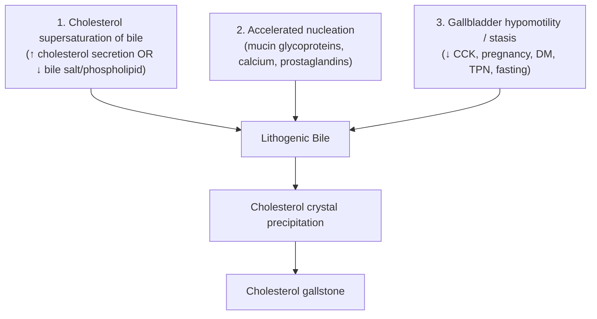
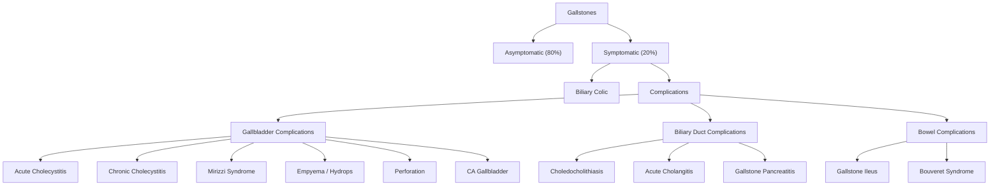

# Gallstones (Cholelithiasis) & Choledocholithiasis

## 1. Definition

**Cholelithiasis** literally means "chole" (bile) + "lith" (stone) + "iasis" (condition) — the formation of stones within the gallbladder.

**Choledocholithiasis** adds "choledocho-" (common bile duct) — stones within the common bile duct (CBD). The vast majority of CBD stones are *secondary*, meaning they form in the gallbladder and then migrate through the cystic duct into the CBD. *Primary* CBD stones (forming de novo within the duct) are uncommon in Western populations but notably more common in Asia, particularly in the context of Recurrent Pyogenic Cholangitis (RPC) [1][2].

The clinical importance of gallstones lies in their spectrum of presentation:

- **~80% are asymptomatic** — discovered incidentally on imaging [2].
- **~3% of asymptomatic patients become symptomatic per year** [1].
- **~2/3 of asymptomatic patients remain symptom-free over 20 years** [1].
- Once symptomatic, patients tend to have **recurrent bouts of biliary colic**.
- **< 5% of symptomatic patients develop complications per year** [1].

The complications of gallstones — acute cholecystitis, choledocholithiasis, acute cholangitis, gallstone pancreatitis, Mirizzi syndrome, gallstone ileus, and gallbladder carcinoma — form a huge chunk of hepatobiliary surgery and are extremely high-yield for exams.

<Callout title="Courvoisier's Law" type="idea">
***In painless obstructive jaundice with a palpable (enlarged) gallbladder, the cause is unlikely to be gallstones.*** Why? A gallbladder that has harboured stones undergoes repeated episodes of cholecystitis → fibrosis → contracted, non-distensible wall. So when a CBD obstruction occurs (e.g., from a stone), the gallbladder *cannot* distend. A palpable gallbladder in this setting therefore suggests a *non-stone* cause (e.g., periampullary tumour — pancreatic head cancer, cholangiocarcinoma, ampullary carcinoma) [2].

Exceptions to Courvoisier's Law: (i) Double impaction — stone simultaneously in cystic duct and distal CBD; (ii) Mirizzi syndrome; (iii) RPC [2].
</Callout>

> **Saint's Triad** = Gallstones + Hiatal hernia + Colonic diverticulosis (three common conditions co-existing in obese, Western-diet patients — not causally linked but frequently seen together) [2].

---

## 2. Epidemiology

| Factor | Detail |
|---|---|
| **Prevalence** | 10–15% of adults in developed countries; lower in Africa/Asia but rising with westernization of diet |
| **Sex** | Female:Male ≈ 3:1 (oestrogen effect) |
| **Age** | Increases with age; peak incidence in 40s–60s |
| **Geography (HK-relevant)** | Cholesterol stones predominate overall, but **brown pigment stones** are relatively more common in Hong Kong/SE Asia due to higher prevalence of biliary parasites and RPC [1][2] |
| **Asymptomatic** | ~80% remain asymptomatic [2] |
| **Complications** | < 5% of symptomatic patients/year develop complications [1] |

---

## 3. Risk Factors

The classic mnemonic is the **"5 Fs"**: ***Fat, Female, Forty, Fertile, Family*** [1][2].

### 3.1 Cholesterol Stones (85% of all gallstones)

| Category | Risk Factor | Mechanism |
|---|---|---|
| ***Demographics*** | **Female sex** | Oestrogen ↑ hepatic HMG-CoA reductase → ↑ cholesterol secretion into bile; also ↓ bile salt secretion |
| | **Age > 40** ("Forty") | Cumulative cholesterol supersaturation over time |
| | **Pregnancy** ("Fertile") | Progesterone ↓ gallbladder motility → stasis; oestrogen ↑ cholesterol secretion |
| | **Obesity** ("Fat") | ↑ Cholesterol synthesis and biliary secretion |
| | **Family history** | 1st degree relative → 2× risk; genetic polymorphisms in cholesterol transporters (ABCG5/G8) |
| ***Medical*** | **Rapid weight loss / bariatric surgery** | Mobilisation of body cholesterol + gallbladder stasis from low caloric intake |
| | **Diabetes mellitus** | Autonomic neuropathy → impaired GB emptying; ↑ cholesterol saturation of bile |
| | **Liver cirrhosis** | Impaired bile salt synthesis → ↑ cholesterol-to-bile-salt ratio |
| | **Crohn's disease / ileal resection** | Loss of terminal ileum → ↓ bile salt reabsorption → ↓ bile salt pool → supersaturation |
| | **TPN / prolonged fasting** | No CCK stimulus → gallbladder stasis ("***JCCK***" — no food, no CCK) [2] |
| ***Drugs*** | **OCP / HRT (oestrogen)** | Same mechanism as pregnancy |
| | **Fibrates** | ↑ Biliary cholesterol secretion |
| | **Octreotide** | ↓ GB motility |

### 3.2 Pigment Stones (15% of all gallstones)

| Type | Risk Factor | Mechanism |
|---|---|---|
| **Black pigment** | **Chronic haemolysis** (thalassaemia, hereditary spherocytosis, sickle cell disease, G6PD deficiency) | ↑ Unconjugated bilirubin production → supersaturation of calcium bilirubinate in bile |
| | **Chronic liver disease / cirrhosis** | Impaired conjugation of bilirubin |
| **Brown pigment** | **Biliary infection / parasites** (E. coli, Klebsiella, *Clonorchis sinensis*, *Ascaris lumbricoides*) | Bacterial **β-glucuronidase** deconjugates bilirubin glucuronide → unconjugated bilirubin precipitates with calcium → calcium bilirubinate stones [1][2] |
| | **Biliary stasis / strictures / RPC** | Stasis predisposes to bacterial colonisation and stone formation |
| | **Low-protein diet** (historically in SE Asia) | Relative enzyme deficiency → ↑ deconjugation of bilirubin [2] |

<Callout title="Hong Kong Context" type="idea">
Brown pigment stones and RPC ("Hong Kong disease") are disproportionately important in the local exam setting. These stones form *de novo* within the intrahepatic ducts (not the gallbladder), driven by parasitic/bacterial infection → β-glucuronidase → unconjugated bilirubin → calcium bilirubinate precipitation. The left intrahepatic ducts are preferentially affected [2].
</Callout>

---

## 4. Anatomy & Function of the Biliary System

Understanding biliary anatomy is essential to understanding where stones get stuck and what symptoms they cause.

### 4.1 Gallbladder Anatomy

The gallbladder is a pear-shaped, muscular sac sitting on the undersurface of the liver (segments IVB and V).

| Part | Description | Clinical Significance |
|---|---|---|
| **Fundus** | Blind-ended tip, projects beyond the liver edge at the tip of the 9th costal cartilage (intersection with lateral border of rectus abdominis) | Palpable when distended; site of Murphy's sign localisation |
| **Body** | Main storage area | Concentrates bile 5–10× by active absorption of water and electrolytes |
| **Infundibulum (Hartmann's pouch)** | Outpouching at the junction of body and neck | ***Most common site of gallstone impaction*** → biliary colic, Mirizzi syndrome [1][2] |
| **Neck** | Narrow, S-shaped, continuous with cystic duct | Transition zone to cystic duct |

### 4.2 Cystic Duct

- Contains the **spiral valves of Heister** — mucosal folds that resist distension and regulate bile flow (not true valves).
- Joins the **common hepatic duct (CHD)** to form the **common bile duct (CBD)**.
- Normal CBD diameter: ≤ 6 mm (add 1 mm per decade over 60; post-cholecystectomy up to 10 mm is acceptable) [3].

### 4.3 Calot's Triangle (Hepatobiliary Triangle)

| Border | Structure |
|---|---|
| Medial | Common hepatic duct |
| Inferior | Cystic duct |
| Superior | Inferior surface of the liver (segment V) |

**Contents**: Cystic artery (branch of right hepatic artery), cystic lymph node (node of Lund/Calot), connective tissue, sometimes an accessory hepatic duct.

<Callout title="Critical View of Safety (CVS)" type="error">
During laparoscopic cholecystectomy, the surgeon must achieve the ***Critical View of Safety*** before clipping any structure: (1) Calot's triangle is cleared of fat and fibrous tissue; (2) The lower third of the gallbladder is separated from the liver bed; (3) Only two structures should be seen entering the gallbladder (cystic duct and cystic artery). This prevents misidentification and inadvertent CBD injury — the most feared complication of cholecystectomy.
</Callout>

### 4.4 Sphincter of Oddi

- Muscular sphincter at the ampulla of Vater controlling flow of bile and pancreatic juice into the duodenum.
- ***Acts as a mechanical barrier to ascending duodenal infection*** — disruption (e.g., post-sphincterotomy, stent placement) predisposes to cholangitis [1].

### 4.5 Biliary Physiology

1. Hepatocytes secrete ~600 mL of bile/day.
2. Between meals, the sphincter of Oddi is closed → bile diverted into the gallbladder via the cystic duct.
3. Gallbladder **concentrates** bile by absorbing water and electrolytes (up to 10-fold).
4. After a meal (especially fatty), duodenal I-cells release **cholecystokinin (CCK)** → gallbladder contracts + sphincter of Oddi relaxes → bile flows into the duodenum.
5. Bile salts emulsify fats for absorption; they are reabsorbed in the terminal ileum and recycled to the liver via the portal vein (**enterohepatic circulation**).

> **Why does a fatty meal trigger biliary colic?** Fat in the duodenum → CCK release → gallbladder contraction against an obstructed cystic duct (stone in Hartmann's pouch/cystic duct) → ↑ intraluminal pressure → visceral pain.

---

## 5. Pathophysiology of Gallstone Formation

### 5.1 Cholesterol Stone Formation

The formation of cholesterol stones requires **three key defects** (the "lithogenic triad"):

1. **Supersaturation**: Cholesterol is insoluble in water. It is kept in solution by bile salts and phospholipids forming mixed micelles. When cholesterol secretion exceeds the solubilising capacity → supersaturated ("lithogenic") bile → cholesterol crystals precipitate.
2. **Nucleation**: Pronucleating factors (mucin glycoproteins secreted by gallbladder epithelium, calcium salts, prostaglandins) accelerate crystal aggregation. Antinucleating factors (apolipoprotein A-I, A-II) inhibit it. The balance determines whether crystals form.
3. **Gallbladder stasis**: Impaired gallbladder emptying allows crystals to remain and grow rather than being flushed into the duodenum.

### 5.2 Pigment Stone Formation

#### Black Pigment Stones
- Formed within the **gallbladder**.
- Composed of **calcium bilirubinate + calcium carbonate + calcium phosphate** polymerized into a hard, jet-black stone.
- Pathophysiology: ↑ unconjugated bilirubin in bile (from chronic haemolysis or impaired hepatic conjugation) → supersaturation → precipitation with calcium.
- **Radiopaque** (due to calcium content) — unlike cholesterol stones.

#### Brown Pigment Stones
- Formed within the **bile ducts** (intrahepatic or CBD) — this is the key distinction.
- Composed of **calcium bilirubinate + bacterial cell bodies + fatty acid soaps**.
- Pathophysiology: bacterial infection (E. coli, Klebsiella) → bacterial **β-glucuronidase** hydrolyses conjugated bilirubin glucuronide → unconjugated bilirubin + glucuronic acid → unconjugated bilirubin precipitates with calcium [1][2].
- Parasitic infection (*Clonorchis sinensis*, *Ascaris lumbricoides*) causes epithelial damage → bacterial translocation → same cascade [2].
- **Radiopaque** but softer and more friable than black stones.

---

## 6. Classification of Gallstones

### 6.1 By Composition

| Feature | Cholesterol Stones | Black Pigment Stones | Brown Pigment Stones |
|---|---|---|---|
| **Frequency** | ~85% (Western) | ~10% | ~5% (but higher in Asia) |
| **Composition** | > 70% cholesterol by weight | Calcium bilirubinate polymers | Calcium bilirubinate + bacterial debris |
| **Location of formation** | Gallbladder | Gallbladder | Bile ducts (intra/extrahepatic) |
| **Radiolucency** | ***Radiolucent*** (< 10% radiopaque) | ***Radiopaque*** | ***Radiopaque*** (soft) |
| **Colour** | Yellow-green, greasy | Jet black, hard | Earthy brown, soft, friable |
| **Associated conditions** | Obesity, oestrogen, Western diet | Chronic haemolysis, cirrhosis | Biliary infection/parasites, RPC |
| **Sterile vs infected** | Sterile | Sterile | Infected |
| **Multiplicity** | Often multiple, faceted | Multiple, small | Few, large, soft |

### 6.2 By Location (Clinical Classification)

| Location | Term | Key Clinical Consequence |
|---|---|---|
| Gallbladder | Cholelithiasis | Biliary colic, acute/chronic cholecystitis |
| Cystic duct | Cholelithiasis | Biliary colic, acute cholecystitis, Mirizzi syndrome |
| CBD | Choledocholithiasis | Obstructive jaundice, cholangitis, gallstone pancreatitis |
| Intrahepatic ducts | Hepatolithiasis | RPC, cholangiocarcinoma |
| Ampulla of Vater | Choledocholithiasis | Gallstone pancreatitis, cholangitis |

---

## 7. Possible Clinical Presentations of Gallstones — Overview

This is the roadmap. Gallstones can present in many ways depending on where the stone lodges and what it obstructs [2]:

---

## 8. Clinical Features

### 8.1 Asymptomatic Gallstones

- The majority (80%) — found incidentally on USG, CT, or at laparotomy [2].
- Risk of future complications: **1–4% per year** [2].
- Generally managed conservatively (watchful waiting) unless specific indications for prophylactic cholecystectomy exist (see Management section later).

### 8.2 Biliary Colic (Uncomplicated Symptomatic Gallstones)

> **Mechanism**: Gallbladder contracts (usually post-prandially, triggered by CCK) against a stone **transiently** impacted in ***Hartmann's pouch or the cystic duct*** → ↑ intraluminal pressure → visceral pain via splanchnic afferents [1][2].

| Feature | Detail | Pathophysiological Basis |
|---|---|---|
| **Site** | ***RUQ / epigastric / substernal*** | Visceral afferents from the gallbladder travel with splanchnic nerves to T7–T9 → referred to the epigastrium/RUQ |
| **Onset** | Abrupt | Sudden impaction of stone |
| **Character** | ***Steady, intense, dull, constant*** — **NOT truly colicky** (the name is misleading!) | The gallbladder and cystic duct lack peristalsis, so there are no rhythmic waves of pain — it is a sustained contraction against a fixed obstruction [2] |
| **Radiation** | ***Right shoulder / right scapula / interscapular*** | Referred pain via the phrenic nerve (C3–C5) from diaphragmatic peritoneal irritation, or via splanchnic afferents to T7–T9 dermatomes |
| **Duration** | ***≥ 30 min, plateaus within 1 hour, subsides < 6 hours*** | If > 6 hours → suspect acute cholecystitis [1][2] |
| **Timing** | ***After a fatty meal***; can wake patient from sleep | Fatty meal → CCK → gallbladder contraction |
| **Associated** | Sweating, nausea, vomiting | Vagal stimulation from visceral pain |
| **NOT exacerbated by** | Movement | It is visceral pain, not parietal peritoneal — no somatic component |
| **NOT relieved by** | Squatting, bowel movements, passage of flatus | Distinguishes from colonic/rectal pathology |
| **Between attacks** | ***Patient feels completely well*** | Transient obstruction self-resolves → stone falls back into GB |

> **Key distinction**: Biliary colic is **episodic** — discrete attacks with completely well intervals. If pain becomes **continuous > 6 hours** with fever and localised tenderness → think **acute cholecystitis** [1][2].

<Callout title="Exam Trap: 'Biliary Colic' is NOT Colicky" type="error">
Despite its name, biliary colic is a ***steady, constant*** pain — not the waxing-and-waning "colicky" pain seen in ureteric or intestinal colic. This is because the gallbladder and cystic duct have no peristalsis — so the pain is from sustained distension against a fixed obstruction, not from rhythmic muscular contractions [2].
</Callout>

**Investigations for Biliary Colic**:
- ***USG gallbladder***: **Gold standard** — ***hyperechoic stone with posterior acoustic shadowing, gravity-dependent (rolling stone sign when patient turns lateral)*** [2][3].
- ***AXR***: Only ~15% of gallstones are radiopaque (pigment stones). May see ***Mercedes-Benz sign*** (gas in fissures of stone) — low sensitivity.
- **Bloods**: CBC, LFT (should be **normal** in uncomplicated biliary colic — if cholestatic pattern, think choledocholithiasis), amylase/lipase (rule out pancreatitis) [2].

### 8.3 Acute Cholecystitis

***Definition: Acute inflammation of the gallbladder*** [3].

***Pathology: Obstruction of cystic duct → complication of gallstone disease → chemical inflammation → bacterial infection*** [3].

#### 8.3.1 Acute Calculous Cholecystitis (90–95%)

> **Mechanism**: ***Prolonged gallstone impaction at Hartmann's pouch / cystic duct*** → stagnant bile → gallbladder distension (mucocele/hydrops) → ***concentrated bile salts cause chemical inflammation (first 48 hours)*** → ***secondary bacterial infection*** (E. coli, Klebsiella, Strep faecalis) [2][3].

**Symptoms**:

| Symptom | Detail | Pathophysiological Basis |
|---|---|---|
| **Pain** | Starts as biliary colic but ***more constant, longer > 6 hours*** | Persistent obstruction → ongoing distension + inflammation → transition from visceral to parietal peritoneal pain |
| **Fever + chills** | Low-grade initially, may spike with secondary infection | Chemical then bacterial inflammation → systemic inflammatory response |
| **Nausea / vomiting** | Common | Vagal stimulation, ileus from peritoneal inflammation |

**Signs**:

| Sign | Detail | Pathophysiological Basis |
|---|---|---|
| ***Murphy's sign*** | ***Inspiratory arrest during deep palpation of RUQ*** — the inflamed gallbladder descends with inspiration and contacts the examiner's hand, causing pain and reflex inspiratory arrest | Parietal peritoneal inflammation overlying the inflamed gallbladder fundus |
| **RUQ tenderness with guarding** | Localised peritonism | Inflammation extending to parietal peritoneum |
| **Low-grade fever** | 37.5–38.5°C typically | Inflammatory cytokines |
| **Tachycardia** | In proportion to fever / pain | Sympathetic response |

***USG findings — 5 cardinal signs of acute cholecystitis*** [2]:
1. ***Presence of gallstones***
2. ***Distended GB ( > 4 × 10 cm)***
3. ***GB wall thickening > 3 mm***
4. ***Pericholecystic fluid / stranding*** (from wall oedema)
5. ***Sonographic Murphy sign*** (maximal tenderness when USG probe pressed directly over the GB)

If USG is inconclusive:
- ***HIDA scan (hepatobiliary iminodiacetic acid)***: Non-visualisation of the gallbladder (because radiotracer cannot enter through the obstructed cystic duct) = positive for acute cholecystitis. Sensitivity ~95%.
- ***MRCP with morphine augmentation***: Morphine ↑ sphincter of Oddi pressure → forces bile into the gallbladder; non-filling confirms cystic duct obstruction [2].

#### 8.3.2 Acute Acalculous Cholecystitis (5–10%)

> **Mechanism**: ***Microvascular occlusion within the gallbladder wall*** → ischaemia → inflammation and infection, ***NOT associated with gallstones*** [1][2].

- ***Classically occurs in critically ill / hospitalised patients***: ICU patients, those on ***TPN***, extensive burns, sepsis, major operations, multiple trauma, prolonged illness with multi-organ dysfunction [1][2].
- **Risk factors**: Dehydration, ***shock (systemic hypoperfusion)***, ***TPN (no CCK stimulation → stasis)*** [2].
- Clinical presentation is **similar** to calculous cholecystitis (fever, RUQ pain, leucocytosis) but with **higher mortality** [2].
- Management: ***Laparoscopic cholecystectomy or gallbladder drainage (percutaneous cholecystostomy) if unfit for surgery*** [1][2].

#### 8.3.3 Complications of Acute Cholecystitis

| Complication | Mechanism | Clinical Features |
|---|---|---|
| ***Gallbladder empyema*** | Persistent cystic duct obstruction + purulent bacterial infection → pus fills the gallbladder | ***Tender RUQ mass + septic-looking*** patient, high swinging fever [2] |
| ***Gangrenous cholecystitis (20%)*** | Continued distension → ↓ mural blood flow → ischaemic necrosis of gallbladder wall | Worsening sepsis, may paradoxically have *decreased* pain (nerve necrosis) |
| ***Perforation → biliary peritonitis*** | Necrotic GB wall ruptures (less common as usually wrapped by omentum) | Generalized peritonitis, haemodynamic instability |
| ***Emphysematous cholecystitis*** | Secondary infection with ***gas-forming organisms*** (e.g., *Clostridium welchii/perfringens*) | ***Insidious onset, abdominal crepitus***; gas in GB wall on imaging [2] |
| ***Cholecystoenteric fistula + gallstone ileus*** | Chronic inflammation → GB wall erodes into adjacent bowel (usually duodenum) → stone passes into bowel → mechanical SBO | See gallstone ileus section below |

### 8.4 Chronic Cholecystitis

> **Mechanism**: ***Recurrent acute cholecystitis or persistent mechanical irritation by gallstones*** → chronic inflammatory infiltrate → ***fibrosis and thickening of GB wall*** [1][2].

**Symptoms**:
- ***Repeated attacks of biliary colic*** with well intervals.
- Vague dyspepsia, fat intolerance, bloating (less specific).

**Signs**:
- Often minimal between attacks.
- ***Contracted, thick-walled gallbladder*** on USG.

**Complications**:
- ***CA gallbladder*** — chronic inflammation → dysplasia → carcinoma sequence [2].
- ***Porcelain gallbladder***: ***Calcification of GB wall due to extensive scarring***. Carries ***2–3% risk of malignancy*** → ***absolute indication for cholecystectomy*** even if asymptomatic [1][2].
- ***Typhoid carrier state***: Gallbladder infected by *Salmonella typhi* → chronic carriage in bile [2].

**USG findings**: ***Contracted gallbladder with wall thickening and gallstones*** [2].

### 8.5 Choledocholithiasis (CBD Stones)

> **Mechanism**: Gallstones migrate from the gallbladder through the cystic duct into the CBD → obstruction of bile flow → upstream biliary dilatation.

**Symptoms** [1]:

| Symptom | Detail | Pathophysiological Basis |
|---|---|---|
| ***Jaundice*** | ***Most common manifestation*** — yellowish discolouration of skin/sclera | Obstructed bile flow → conjugated bilirubin refluxes into blood → deposited in tissues |
| | ***Transient jaundice*** if stone temporarily impacts ampulla then moves | "Ball-valve" effect at the ampulla |
| | ***Progressive jaundice*** if stone completely impacts | Complete CBD obstruction |
| **RUQ / epigastric pain** | ***More prolonged > 6 hours*** than typical biliary colic | Stone in CBD causes sustained obstruction; resolves when stone passes or is removed |
| **Dark urine ("coca-cola urine")** | | Conjugated bilirubin (water-soluble) filtered by kidneys |
| **Pale/clay-coloured stools** | | No bilirubin reaching the gut → no stercobilinogen |
| **Pruritus** | | Bile salt deposition in skin |
| **Nausea / vomiting** | | Vagal stimulation |

**Signs**:
- Jaundice (scleral icterus first — albumin in sclera has high affinity for bilirubin).
- RUQ tenderness (variable).
- **Cholestatic LFT pattern**: ↑ ALP, ↑ GGT, ↑ conjugated bilirubin; AST/ALT may be mildly elevated.
- **Dilated CBD on USG** ( > 6 mm, or > 10 mm post-cholecystectomy).

### 8.6 Acute Cholangitis

> **Mechanism**: ***Biliary obstruction + stasis → bacterial infection of the biliary tract*** [1][2]. Obstruction alone causes obstructive jaundice; bacteria alone without obstruction are usually cleared. It is the **combination** that produces cholangitis [1].

**Normal biliary defences** (all of which must be overwhelmed) [1]:
1. Continuous flushing action of bile flow
2. Bacteriostatic activity of bile salts
3. Biliary mucous + secretory IgA (anti-adherence factors)
4. ***Sphincter of Oddi*** — mechanical barrier to ascending duodenal bacteria

**Bacteriology** [1][2]:
- ***Gram-negative rods***: *E. coli* (most common), *Klebsiella pneumoniae*, *Enterobacter sp.*, *Pseudomonas* (especially if stent in situ)
- ***Gram-positive***: *Enterococcus sp.*
- ***Anaerobes***: *Bacteroides fragilis*

**Clinical Features**:

| Feature | Pathophysiological Basis |
|---|---|
| ***Charcot's triad (present in 50–70%)*** [2]: **Fever** + **RUQ pain** + **Jaundice** | Infection → fever; obstruction → jaundice and upstream pressure → pain |
| ***Reynolds' pentad ( < 10%)*** [2]: Charcot's triad + **Hypotension** + **Altered mental status** | Biliary sepsis → septic shock → end-organ hypoperfusion including cerebral |

<Callout title="Charcot's Triad vs Reynolds' Pentad">
***Charcot's triad*** = the classic triad of acute cholangitis (Fever + Jaundice + RUQ pain). Present in only ~50–70% of cases.

***Reynolds' pentad*** = Charcot's triad + hypotension + altered mental status → indicates ***suppurative cholangitis with septic shock*** — a life-threatening emergency requiring urgent biliary decompression. Present in < 10% of cases [1][2].
</Callout>

### 8.7 Gallstone Pancreatitis

> **Mechanism**: Gallstone migrates to the ampulla of Vater → transient or persistent obstruction → ***reflux of bile into the pancreatic duct*** → premature activation of pancreatic enzymes (trypsinogen → trypsin) → ***autodigestion of pancreatic parenchyma*** [1][4].

***Gallstones are the most common cause of acute pancreatitis (55%)*** [4].

**Clinical Features** [1][2]:

| Feature | Detail | Pathophysiological Basis |
|---|---|---|
| **Epigastric pain** | Severe, constant, ***radiating to the back***, improves with ***leaning forward*** | Pancreas is retroperitoneal → pain referred to the back; leaning forward reduces stretch on retroperitoneal structures |
| **Nausea / vomiting** | Prominent | Inflammation + ileus |
| **Fever** | Due to ***chemical inflammation (not necessarily infection)*** | SIRS response from cytokine release |
| ***Cullen's sign*** | ***Periumbilical bruising*** | Retroperitoneal haemorrhage tracking along the falciform ligament to the umbilicus [2] |
| ***Grey Turner's sign*** | ***Flank bruising*** | Retroperitoneal haemorrhage tracking to the flanks [2] |
| **Fox's sign** | Inguinal ligament bruising | Retroperitoneal haemorrhage tracking inferiorly |
| ***Tetany*** | ***Transient hypocalcaemia*** | ***Fat saponification***: lipase → fat necrosis → release of fatty acids → precipitate with calcium → ↓ serum calcium [2] |

### 8.8 Mirizzi Syndrome

> **Mechanism**: ***Common hepatic duct (CHD) obstruction caused by extrinsic compression from a stone impacted in Hartmann's pouch or the cystic duct*** [1][2].

| Feature | Detail |
|---|---|
| **Presentation** | Fever, ***jaundice***, RUQ pain — may mimic cholangitis or cholecystitis |
| **Key sign** | ***Jaundice with palpable gallbladder*** — an exception to Courvoisier's Law [2] |
| **Chronic inflammation** | May erode into the bile duct wall → ***cholecystobiliary fistula*** (cholecystohepatic or cholecystocholedochal) [1][2] |
| **Association** | ***CA gallbladder*** — recurrent inflammation + biliary stasis [1][2] |

**Csendes Classification** [1][2]:

| Type | Description |
|---|---|
| I | External compression of CHD, ***no fistula*** |
| II | Fistula involving < 1/3 of CBD circumference |
| III | Fistula involving 1/3–2/3 of CBD circumference |
| IV | Fistula involving > 2/3 of CBD circumference (complete destruction) |
| V | Any type + ***cholecystoenteric fistula*** (5A: no gallstone ileus; 5B: with gallstone ileus) [2] |

### 8.9 Gallstone Ileus

> **Mechanism**: Chronic cholecystitis → gallstone erodes through the GB wall into adjacent bowel through a ***cholecystoenteric fistula*** (most commonly ***cholecystoduodenal***) → large stone ( > 2.5 cm) passes through the bowel → impacts at the ***narrowest point of the small bowel*** (terminal ileum, ~2 feet proximal to the ileocaecal valve) → ***mechanical small bowel obstruction*** [2].

**Bouveret's Syndrome**: A variant where the stone impacts in the ***duodenum or stomach***, causing ***gastric outlet obstruction (GOO)*** [2].

**Clinical Features**: Features of **distal small bowel obstruction** — colicky abdominal pain, vomiting (may be faeculent), abdominal distension, absolute constipation.

**Investigations**:
- ***AXR***: ***Rigler's triad*** [2]:
  1. ***Pneumobilia*** (air in biliary tree — through the cholecystoenteric fistula)
  2. ***Small bowel obstruction***
  3. ***Ectopic gallstone*** (usually in RIF, at ileocaecal valve)
- ***CT abdomen***: Gallbladder wall thickening + Rigler's triad — much more sensitive than AXR.

> **Other causes of pneumobilia** (DDx on AXR): ***Emphysematous cholecystitis, post-ERCP, post-cholecystectomy, blunt abdominal trauma, sphincter of Oddi incompetence*** [2].

### 8.10 Gallbladder Cancer

Covered briefly here as a complication of chronic gallstone disease:

- ***95% of patients with gallbladder carcinoma have gallstones*** — one of the ***strongest risk factors*** [1].
- **Risk factors** ("***4P***") [2]: ***Polyps*** ( > 1 cm), ***Porcelain gallbladder***, ***Primary sclerosing cholangitis***, ***Pancreatobiliary duct anomalous junction*** (a/w choledochal cyst).
- **Female predominance** (M:F = 1:2–3) [1].
- ***Very poor prognosis***: most discovered late and unresectable at diagnosis — ***5-year OS < 5%*** [2].
- Spreads via direct invasion (liver segments IV and V), lymphatics (cystic duct node → pericholedochal → hilar → coeliac/SMA nodes), and haematogenous (lung, peritoneum) [1].

### 8.11 Recurrent Pyogenic Cholangitis (RPC)

Also called ***"Hong Kong disease"*** / Oriental cholangiohepatitis [1][2].

> **Mechanism**: ***Parasitic infestation*** (e.g., *Clonorchis sinensis* from raw freshwater fish) → biliary epithelial damage → bacterial translocation → ***stricture formation → biliary stasis*** → bacterial β-glucuronidase → deconjugation of bilirubin → ***brown pigment stone formation de novo within intrahepatic ducts*** → cycle of obstruction, infection, and further stone formation [1][2].

| Feature | Detail |
|---|---|
| **Age/Sex** | Middle-aged, equal M:F |
| **Location** | ***Usually starts in left intrahepatic ducts*** [2] |
| **Stone type** | Brown pigment (calcium bilirubinate) — NOT cholesterol |
| **Clinical** | ***Recurrent episodes of acute cholangitis*** (Charcot's triad) — 1–2 episodes/year [2] |
| **Complications** | Biliary sepsis, liver abscess, pancreatitis, cirrhosis (chronic biliary obstruction), ***cholangiocarcinoma*** [2] |

---

## 9. Summary Table: Symptomatic Gallstones at a Glance

| | **Biliary Colic** | **Acute Cholecystitis** | **Choledocholithiasis** | **Acute Cholangitis** |
|---|---|---|---|---|
| **Mechanism** | Stone transiently stuck at Hartmann's pouch / cystic duct | ***Inflammation of GB due to gallstone / biliary sludge*** | Migration of gallstones into CBD | ***Bacterial infection secondary to CBD obstruction*** |
| **Pain** | RUQ, < 6h | RUQ, ***> 6h*** | RUQ, > 6h | RUQ |
| **Fever** | **No** | **Yes** | ± | **Yes** (with rigors) |
| **Jaundice** | **No** | Usually **No** | **Yes** | **Yes** |
| **Murphy's sign** | No | ***Yes*** | No | No |
| **Labs** | Normal | ↑ WBC, CRP | ***Cholestatic LFT*** (↑ALP, ↑GGT, ↑bilirubin) | ↑ WBC, CRP + ***cholestatic LFT*** |
| **Imaging** | USG: stone + shadow | ***USG: 5 cardinal signs*** | USG: dilated CBD + stone | USG: dilated CBD + stone |
| **Management** | Elective LC | Resuscitation, ***IV antibiotics***, LC | Supportive, ***biliary decompression***, LC | ***Resuscitation, IV antibiotics, biliary decompression***, LC |

---

<Callout title="High Yield Summary">

1. **Gallstones are classified by composition**: Cholesterol (85%, radiolucent), Black pigment (haemolysis, radiopaque), Brown pigment (infection/parasites, radiopaque, form in ducts).
2. **5Fs**: Fat, Female, Forty, Fertile, Family — risk factors for cholesterol stones.
3. **80% of gallstones are asymptomatic**; 3%/year become symptomatic.
4. **Biliary colic** = steady (NOT colicky) RUQ pain < 6h after fatty meal, no fever, no jaundice, self-resolving.
5. **Acute cholecystitis** = pain > 6h + fever + Murphy's sign; ***5 USG cardinal signs*** (gallstones, distended GB, wall thickening > 3mm, pericholecystic fluid, sonographic Murphy's sign).
6. **Choledocholithiasis** = obstructive jaundice + cholestatic LFT + dilated CBD on USG.
7. **Charcot's triad** (Fever + Jaundice + RUQ pain) = acute cholangitis; **Reynolds' pentad** adds hypotension + AMS = suppurative cholangitis / septic shock.
8. **Gallstone pancreatitis** = most common cause of acute pancreatitis (55%); epigastric pain radiating to back.
9. **Courvoisier's Law**: Painless jaundice + palpable GB = unlikely gallstones (think periampullary tumour).
10. **Mirizzi syndrome**: CHD obstruction by stone in Hartmann's pouch; Csendes classification (Types I–V).
11. **Gallstone ileus**: Rigler's triad = pneumobilia + SBO + ectopic gallstone.
12. **RPC ("Hong Kong disease")**: Brown pigment stones forming de novo in intrahepatic ducts (usually left); parasites → β-glucuronidase → unconjugated bilirubin → calcium bilirubinate stones.
13. **Porcelain gallbladder** = absolute indication for cholecystectomy (risk of GB carcinoma).

</Callout>

---

<ActiveRecallQuiz
  title="Active Recall - Gallstones"
  items={[
    {
      question: "Name the three types of gallstones, their composition, radiolucency, and where they form.",
      markscheme: "Cholesterol (>70% cholesterol, radiolucent, form in GB); Black pigment (calcium bilirubinate polymers, radiopaque, form in GB, assoc. with haemolysis); Brown pigment (calcium bilirubinate + bacterial cell bodies, radiopaque, form in bile ducts, assoc. with infection/parasites/RPC).",
    },
    {
      question: "A patient presents with RUQ pain lasting 2 hours after a fatty meal, no fever, and normal bloods. What is the diagnosis, and why is the name misleading?",
      markscheme: "Biliary colic. Name is misleading because pain is STEADY/CONSTANT, not colicky — the gallbladder and cystic duct lack peristalsis so there are no rhythmic contractions.",
    },
    {
      question: "List the 5 cardinal USG signs of acute cholecystitis.",
      markscheme: "1. Gallstones present; 2. Distended GB (>4x10cm); 3. GB wall thickening >3mm; 4. Pericholecystic fluid/stranding; 5. Sonographic Murphy sign.",
    },
    {
      question: "What is Courvoisier's Law? Name three exceptions.",
      markscheme: "In painless obstructive jaundice with a palpable gallbladder, the cause is unlikely gallstones (fibrosed GB cannot distend). Exceptions: double impaction, Mirizzi syndrome, RPC.",
    },
    {
      question: "Explain the pathophysiology of brown pigment stone formation in RPC.",
      markscheme: "Parasitic/bacterial infection of bile ducts causes epithelial damage and bacterial translocation. Bacteria (E. coli, Klebsiella) produce beta-glucuronidase which deconjugates bilirubin glucuronide to unconjugated bilirubin. Unconjugated bilirubin precipitates with calcium to form calcium bilirubinate (brown pigment) stones. Stasis and strictures perpetuate the cycle.",
    },
    {
      question: "What is Rigler's triad and in what condition is it seen?",
      markscheme: "Rigler's triad: pneumobilia + small bowel obstruction + ectopic gallstone — seen in gallstone ileus (stone erodes through cholecystoenteric fistula, impacts at terminal ileum).",
    },
  ]}
/>

---

## References

[1] Senior notes: felixlai.md (Gastrointestinal Diseases — Cholelithiasis, Choledocholithiasis, Acute Cholangitis, Mirizzi Syndrome, Gallbladder Cancer, Acute Pancreatitis, RPC sections)
[2] Senior notes: maxim.md (Gallstone Diseases, Biliary Colic, Acute Cholecystitis, Mirizzi Syndrome, Gallstone Ileus, RPC, Acute Cholangitis, Acute Pancreatitis, GB Carcinoma sections)
[3] Lecture slides: GC 200. RUQ pain, jaundice and fever Cholecytitis and cholangitis Imaging of GI system.pdf
[4] Lecture slides: Acute pancreatitis.pdf
