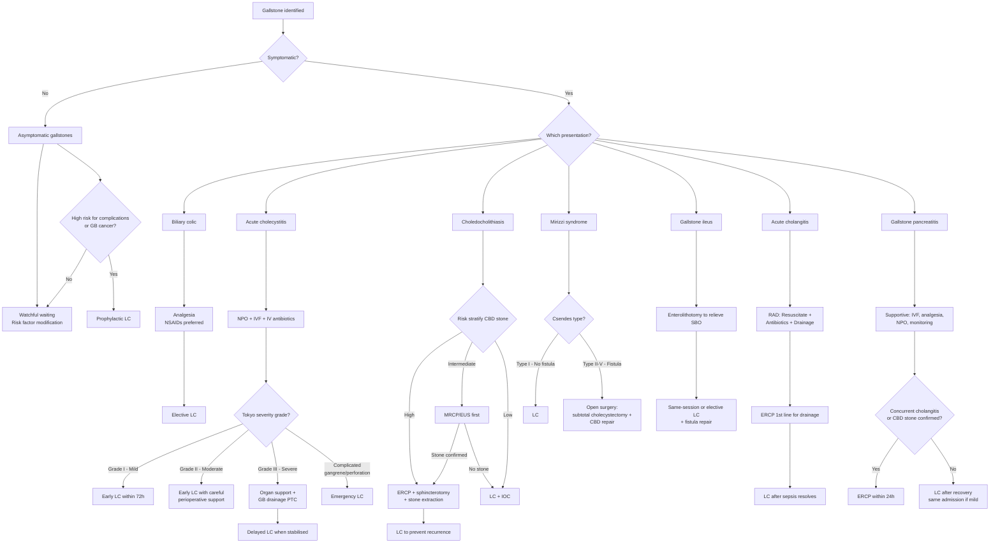

## Management of Gallstones — Treatment Algorithm & Modalities

The management of gallstones is dictated by a single question: **"What is the stone doing right now?"** The treatment is entirely different for an asymptomatic stone sitting quietly in the gallbladder versus one causing septic shock from cholangitis. Let's work through each scenario systematically.

---

### 1. Overarching Principles

Before diving into specifics, three management principles apply across all gallstone presentations:

1. **Resuscitate first, investigate second, intervene third** — especially in cholangitis and pancreatitis. You cannot ERCP a dead patient.
2. **Remove the gallbladder to prevent recurrence** — almost every gallstone complication eventually leads back to ***laparoscopic cholecystectomy (LC)*** as the definitive treatment to eliminate the stone factory [1][2].
3. **Biliary decompression is life-saving in obstruction with sepsis** — when bacteria are trapped behind an obstruction, antibiotics alone cannot penetrate adequately because bile is not flowing. You must physically drain the system [1][2][3].

---

### 2. Master Management Algorithm

---

### 3. Management by Clinical Scenario

#### 3.1 Asymptomatic Gallstones

Most gallstones (80%) are asymptomatic. The question is: when do you leave them alone versus operate prophylactically?

**Default approach: Watchful waiting** [2]
- Risk of future complications: only **1–4% per year** [2]
- Risk factor modification: weight management, dietary changes, control of diabetes
- ***Ursodeoxycholic acid (UDCA)***: An oral bile acid that works by reducing cholesterol secretion into bile and promoting cholesterol desaturation → gradual dissolution of cholesterol stones over months to years. ***Only effective for cholesterol stones*** (not pigment), ***small stones ( < 1 cm)***, and ***functioning gallbladder*** (patent cystic duct). Rarely used in practice because of low efficacy and high recurrence (50% within 5 years after stopping) [2].

**Indications for prophylactic cholecystectomy in asymptomatic patients** [1][2]:

| Indication | Rationale |
|---|---|
| ***Porcelain gallbladder*** | ***Calcification of GB wall → 2–3% risk of malignancy → absolute indication for cholecystectomy*** [1][2] |
| ***GB polyps ≥ 1 cm*** | Risk of malignancy 46% at 1.5 cm; ***adenomatous polyps ≥ 1 cm*** (or ≥ 8 mm if underlying PSC) [2] |
| ***Large gallstones > 3 cm*** | Increased risk of GB carcinoma [2] |
| ***Concomitant haemolytic disorders*** | Ongoing production of pigment stones; stones will inevitably become symptomatic |
| ***Patients on long-term TPN*** | No CCK stimulus → perpetual GB stasis → high risk of cholecystitis [1] |
| ***Gastric bypass / bariatric surgery*** | Altered anatomy makes future ERCP extremely difficult; rapid weight loss → stone formation |
| ***Concomitant liver surgery*** | Opportunistic removal during another hepatobiliary procedure |

---

#### 3.2 Biliary Colic

**Acute management** [2]:
- ***NPO*** (nil by mouth) — rest the gut, reduce CCK stimulation
- ***Analgesia — NSAIDs are preferred first-line*** (e.g., diclofenac, ketorolac) [2]
  - Why NSAIDs? They inhibit prostaglandin synthesis → reduce gallbladder mucosal inflammation and smooth muscle spasm. They also avoid opioid-related sphincter of Oddi spasm (morphine → ↑ sphincter of Oddi pressure → worsens biliary obstruction).
  - If NSAIDs contraindicated (renal impairment, PUD, allergy) → pethidine (meperidine) or paracetamol + codeine. ***Morphine should be AVOIDED*** due to sphincter of Oddi spasm [1].
- IV fluids if dehydrated/vomiting
- Anti-emetics (ondansetron, metoclopramide)

**Definitive management**: ***Elective laparoscopic cholecystectomy*** [2]
- Rationale: once symptomatic, patients tend to have recurrent bouts; elective LC reduces risk of future complications from 25% to 8% [2].
- Timing: can be arranged as an outpatient/elective procedure during the same admission or within weeks.

---

#### 3.3 Acute Cholecystitis

The management follows a structured approach: **initial stabilisation → definitive surgery**.

##### Initial Medical Stabilisation

| Intervention | Detail | Rationale |
|---|---|---|
| ***NPO*** | Nil by mouth | Bowel rest; reduce CCK-driven GB contraction against obstruction |
| ***IV fluids*** | Crystalloid resuscitation | Replace losses from vomiting, fever, third-spacing |
| ***IV antibiotics*** [3] | ***Cefuroxime + Metronidazole*** (mild-moderate); ***Piperacillin-tazobactam (Tazocin)*** (severe) [2][3]; Alternatives: Ampicillin-sulbactam; Metronidazole + 3rd-gen cephalosporin; Metronidazole + fluoroquinolone [1] | Acute cholecystitis is initially chemical inflammation but ***secondary bacterial infection*** occurs (E. coli, Klebsiella, Strep. faecalis) → must cover gram-negatives + anaerobes |
| ***Analgesia*** | NSAIDs first-line; avoid morphine | Pain control; morphine → sphincter of Oddi spasm |
| ***Monitor*** | Vitals, I/O, serial bloods | Detect deterioration: ↑ temperature/pulse, ↓ BP/consciousness/urine output, ↑ abdominal tenderness [1] |

##### Definitive Treatment: ***Cholecystectomy*** [3]

***"Surgical treatment = Cholecystectomy (removal of gallbladder) — open or laparoscopic, delayed or early"*** [3].

The critical decision is **timing** — early vs. delayed (interval):

| ***Early LC: within 48–72 hours of symptom onset*** [3] | ***Delayed (Interval) LC: after 6–12 weeks*** [3] |
|---|---|
| ***Advantages: avoid urgent operation, avoid recurrent symptoms, avoid readmission, shorter hospital stay*** [3] | ***Advantages: avoid misdiagnosis, easier dissection, less septic complications, less serious complications*** [3] |
| Initial inflammation creates pericholecystic fluid → easier tissue-plane dissection [2] | After 72h: dense adhesions form at Calot's triangle → difficult dissection [2] |
| Higher risk of bleeding and post-op infections; higher conversion-to-open rate [2] | Separate admission; fibrosis makes GB mobilisation difficult; chance of recurrence while waiting [2] |

> ***"Early cholecystectomy is safe without increasing the risk of complications"*** [3] — current evidence and guidelines favour **early LC (within 72h)** as the standard of care for most patients with acute cholecystitis, as it avoids the morbidity of a second admission and the risk of recurrent complications during the waiting period.

**Management by Tokyo Severity Grade** [1][2]:

| Grade | Management |
|---|---|
| **Grade I (Mild)** | ***Early LC*** (within 72h) — 1st line for most patients [2][3] |
| **Grade II (Moderate)** | ***Early LC*** with experienced surgeon + careful perioperative support. If local resources/expertise insufficient → antibiotics + delayed LC [1] |
| **Grade III (Severe)** | Initial organ support + ***GB drainage*** → delayed LC when stabilised [1][2] |
| **Complicated** (gangrene, perforation, emphysematous) | ***Emergency LC*** regardless of grade — disease progression despite best supportive care [2] |

<Callout title="Emergency vs Early vs Interval LC" type="idea">

- ***Emergency LC*** = performed urgently (same day) for life-threatening complications — gangrene, perforation, emphysematous cholecystitis, or clinical deterioration despite antibiotics [2].
- ***Early LC*** = within 48–72 hours of symptom onset — the current standard of care for Grade I–II [3].
- ***Interval LC*** = delayed 6–12 weeks after initial conservative management — reserved for late presentations ( > 72h where dense adhesions have already formed), or when early surgery is not feasible [2].
</Callout>

##### ***Cholecystostomy (GB Drainage)*** [3]

***"Drainage of the gallbladder — open or percutaneous. Indications: high surgical risk, haemodynamically unstable, difficult cholecystectomy"*** [3].

| Modality | Detail |
|---|---|
| ***Percutaneous transhepatic cholecystostomy (PTC)*** [2][3] | Catheter inserted percutaneously through the liver into the GB under USG/CT guidance. Trans-hepatic route minimises risk of bile leak (liver tissue tamponades the tract). Decompresses and drains the inflamed/purulent GB. Specific complications: catheter migration, bile leakage, bowel injury [2] |
| **Endoscopic drainage** | If PTC not feasible: ***transpapillary drainage via ERCP*** (catheter placed through cystic duct → either nasobiliary drain externally or internal pigtail stent into duodenum); or ***transmural EUS-guided drainage*** (EUS-guided needle puncture of GB → dilation → stent/LAMS placement) [1][2] |

> GB drainage is a **bridge** — it stabilises the patient until they are fit for definitive cholecystectomy.

---

##### Laparoscopic Cholecystectomy — Operative Details

| Aspect | Detail |
|---|---|
| **Approach** | Laparoscopic (95% of cases) vs. open (Kocher's subcostal incision) [1][2] |
| **Advantages of lap** | ***Less pain, shorter hospital stay, faster recovery, better cosmesis, early return of GI function*** [1] |
| **Disadvantages of lap** | ***Higher risk of major bile duct injury; conversion to open may be needed*** [1] |
| **Positioning** | ***Reversed Trendelenburg*** (head up) — allows gravity to retract bowel inferiorly, exposing the GB; slightly rotated to left [2] |
| **Port placement** | 4 ports: 10 mm umbilical (camera), 10 mm epigastric (operating), 5 mm right subcostal (dynamic retraction), 5 mm right flank (static retraction of fundus) [2] |
| **Pneumoperitoneum** | CO₂ insufflation to ~15 mmHg via Hasson open technique at umbilicus [2] |
| **Key landmarks** | Retract GB fundus cephalad + Hartmann's pouch laterally → identify ***Rouviere's sulcus*** (right posterior portal pedicle) as safety landmark [2] |

***Critical View of Safety (CVS)*** — the most important concept in cholecystectomy [1][2]:

| CVS Criteria | Why |
|---|---|
| ***1. Hepatocystic triangle (Calot's triangle) cleared of all fat and fibrous tissue*** | Ensures no hidden structures (accessory ducts, aberrant arteries) |
| ***2. Lower third of GB separated from the cystic plate (liver bed)*** | Confirms the plane between GB and liver |
| ***3. Only two structures seen entering the gallbladder: cystic duct and cystic artery*** | ***Misidentification of the cystic duct is the commonest cause of biliary injury*** [1] — CVS prevents this by ensuring ONLY 2 structures are connected to the GB before clipping/dividing |

<Callout title="Critical View of Safety" type="error">
***Never clip or divide ANY structure during cholecystectomy until the CVS is achieved.*** If the CVS cannot be obtained due to severe inflammation or unclear anatomy → perform ***intraoperative cholangiogram (IOC)*** to delineate the anatomy, or ***convert to open surgery***. Conversion to open is NOT a failure — it is a safety decision [1][2].

***Partial (subtotal) cholecystectomy*** is advocated when ductal and vascular structures in Calot's triangle cannot be safely identified in severe acute inflammation — you leave the posterior wall of the GB attached to the liver bed (Fenestrating technique) or amputate at Hartmann's pouch (Reconstituting technique) [1].
</Callout>

**Indications for open cholecystectomy** [2]:

| Indication | Rationale |
|---|---|
| Cannot tolerate pneumoperitoneum | Cardiopulmonary comorbidities → CO₂ absorption + increased intra-abdominal pressure → ↓ venous return, ↑ PaCO₂ |
| Refractory coagulopathy | High bleeding risk with laparoscopic approach |
| Multiple previous abdominal surgeries | Dense adhesions make port placement and dissection hazardous |
| Suspected GB carcinoma | Risk of port-site seeding; need for wider resection with LN dissection [2] |

**Indications for cholecystectomy (comprehensive)** [1][2]:

| Category | Specific Indication |
|---|---|
| **Symptomatic gallstones** | With or without complications (biliary colic, cholecystitis, choledocholithiasis, pancreatitis) [1][2] |
| **Asymptomatic — high risk of GB cancer** | ***Porcelain gallbladder*** (absolute); ***GB polyps ≥ 1 cm***; ***large stones > 3 cm*** [1][2] |
| **Asymptomatic — high risk of complications** | Long-term TPN; haemolytic disorders; post-bariatric surgery [1] |
| **Acalculous cholecystitis** | GB inflammation without stones — definitive treatment is cholecystectomy [1] |
| **Concomitant surgery** | During other hepatobiliary procedures |

---

#### 3.4 Choledocholithiasis (CBD Stones)

The management has two components: **(1) Remove the CBD stone** and **(2) Remove the gallbladder** to prevent recurrence.

##### CBD Stone Removal — Risk-Stratified Approach [1][2]

| Risk Level | Approach |
|---|---|
| ***High suspicion*** (CBD stone on USG, clinical cholangitis, bilirubin > 4 + dilated CBD) | ***ERCP first → sphincterotomy + stone extraction → interval LC with IOC*** [1] |
| ***Intermediate suspicion*** (cholestatic LFT, dilated CBD without visible stone) | ***MRCP or EUS first → if stone confirmed → ERCP → LC*** [1][2] |
| ***Low suspicion*** (normal LFT, normal CBD) | ***LC with IOC → if stone found intraoperatively → laparoscopic ECBD or post-op ERCP*** [1] |

##### ERCP — Stone Extraction Techniques [1][2]

***"First-line approach: Endoscopic retrograde cholangiopancreatography ± biliary stenting"*** [3].

| Step | Detail | Why |
|---|---|---|
| ***Endoscopic sphincterotomy*** | Electrocautery incision through the biliary sphincter of Oddi | Eliminates the principal anatomic barrier to stone passage; widens the ampullary opening for instrument access [1] |
| ***Stone extraction*** | ***Wire baskets*** (Dormia basket — snares the stone); ***Stone extraction balloon*** (Fogarty-type — inflated above stone, pulled down to sweep stone out); ***Mechanical lithotripsy*** (crushes large stones that cannot be extracted whole) [1][2] | Different tools for different stone sizes/shapes |
| ***Papillary balloon dilation*** (balloon sphincteroplasty) | Alternative to sphincterotomy — dilates ampulla with a balloon to preserve the sphincter | Concerns about ***long-term sphincter incompetence*** and ***ascending cholangitis*** with sphincterotomy; however, balloon dilation carries higher risk of post-ERCP pancreatitis [1] |

***Complications of ERCP*** [1][3]:

| Timing | Complication | Detail |
|---|---|---|
| ***Short-term*** | ***Pancreatitis*** (most common, 3–10%) | Reduced by prophylactic rectal NSAIDs or temporary pancreatic stent |
| | ***Perforation*** | Two types: ***Intraperitoneal*** (duodenal perforation → free gas under diaphragm on CXR → requires operative treatment) vs. ***Retroperitoneal*** (bile duct perforation at ampulla → retroperitoneal gas, NO free gas under diaphragm → usually conservative management as it seals spontaneously) [1] |
| | ***Bleeding*** | Post-sphincterotomy haemorrhage |
| | ***Infection / cholangitis*** | Incomplete drainage → residual obstruction + instrumentation |
| ***Long-term*** | ***Stone recurrence*** | Especially if gallbladder not removed |
| | ***Papillary stenosis*** | Scarring of sphincterotomy site |

***Relative contraindications for ERCP*** [3]:
- ***Altered GI anatomy e.g., Billroth II gastrectomy, Roux-en-Y*** [3] — the afferent limb anatomy makes duodenoscope access to the ampulla technically very difficult or impossible
- Gastric/bowel obstruction
- Severe coagulopathy (INR > 1.5, platelets < 50,000) — risk of post-sphincterotomy bleeding

##### Surgical Exploration of CBD (ECBD) [1][2]

When ERCP fails or is contraindicated, CBD stones must be managed surgically.

| Approach | Detail |
|---|---|
| ***Transcystic exploration (1st line)*** | Catheter inserted via the cystic duct → cholangiogram → stone extraction with balloon/basket → advantage: avoids opening the CBD itself [2] |
| ***Choledochotomy (2nd line)*** | Direct incision into the CBD → stone removed through the defect → ***choledochoscopy*** to confirm complete clearance → T-tube or primary closure [2] |
| ***Percutaneous choledochoscopy*** | Via mature T-tube tract (6–8 weeks post-insertion) — stones retrieved with baskets/balloons under direct vision [1] |
| **Advantage** | Can be performed as ***one-stage surgery together with LC*** [2] |

**T-tube placement** after choledochotomy [1]:

| Function | Detail |
|---|---|
| ***Post-operative biliary decompression*** | Keeps CBD pressure low while the choledochotomy suture line heals |
| ***Prevents bile leakage*** from suture line | Safety valve — bile drains externally if pressure rises |
| ***Access for post-operative cholangiogram*** | Check tube cholangiogram at 7–10 days to exclude residual stones |
| ***Access for choledochoscopy*** | After 6–8 weeks (fibrous tract formation), scope can be passed through the tract to extract residual stones [1] |
| **Complications** | Bile leak, infection, tube dislodgement, bile duct obstruction [1][2] |

> Modern practice often favours **primary closure of the choledochotomy** (without T-tube) if a biliary stent is in situ, as T-tubes have been shown to increase complications [2].

---

#### 3.5 Acute Cholangitis

The management is encapsulated by the mnemonic ***"RAD" — Resuscitation, Antibiotics, Drainage*** [2].

***"Keep the patient fast. Intravenous fluid. Intravenous antibiotics: Cefuroxime, Metronidazole, Piperacillin + tazobactam"*** [3].

| Step | Detail | Rationale |
|---|---|---|
| ***R — Resuscitation*** | ***NPO, IV fluids, monitor vitals and I/O Q1h*** [2] | Correct dehydration, prevent shock; close monitoring to detect clinical deterioration early |
| ***A — Antibiotics*** (broad-spectrum, IV) [2][3] | ***Mild: IV Augmentin (amoxicillin-clavulanate)*** or ***cefuroxime + metronidazole***; ***Severe: IV Tazocin (piperacillin-tazobactam)*** × 7 days [2][3] | Must cover enteric gram-negatives (E. coli, Klebsiella) + anaerobes (Bacteroides); antibiotics alone fail in 15% because bile flow is obstructed → drug cannot reach the infected bile [1] |
| ***D — Drainage*** | Urgent if ***Reynolds' pentad***, or ***not responding to antibiotics within 24h*** [2] | Obstruction impairs antibiotic secretion into bile → you MUST physically decompress the biliary tree |

##### Biliary Drainage Modalities — Hierarchy [1][2][3]

***QMH practice: ERCP → PTBD → ECBD*** [1].

| Modality | Detail | When to Use |
|---|---|---|
| ***ERCP (1st line)*** [2][3] | ***Biliary drainage and decompression*** — aspirate bile and pus → inject contrast → place ***plastic stent*** (temporary, requires scheduled change) with or without sphincterotomy; stone removal now or interval ERCP after sepsis resolves [2] | ***First-line for acute cholangitis*** [3]; mortality < 5% with endoscopic drainage |
| ***PTBD (Percutaneous transhepatic biliary drainage)*** | Transhepatic catheter inserted into ***intrahepatic bile duct*** (not CBD) under fluoroscopic guidance; external drainage (easy output monitoring) but risk of fluid/electrolyte losses; can be internalised later [2] | ***When ERCP unsuccessful or contraindicated*** (e.g., altered anatomy — Billroth II, Roux-en-Y; poor respiratory function) [2][3]; ***preferred for proximal/hilar obstruction*** (Klatskin tumour, RPC) where ERCP cannot access intrahepatic ducts |
| ***Surgical ECBD*** [3] | ***Decompression by exploration of common bile duct*** — open approach for emergency cases; laparoscopic approach in selected elective cases [3] | ***Indications: failure of endoscopic drainage; deterioration despite endoscopic drainage*** [3]; mortality ~30% (much higher than endoscopic/percutaneous drainage) — last resort [2] |

<Callout title="RAD for Cholangitis — Must Know!" type="error">
***Resuscitation → Antibiotics → Drainage.*** The key teaching point: ***antibiotics ALONE will fail if the obstruction is not relieved*** — biliary obstruction impairs antibiotic secretion into bile. If the patient has Reynolds' pentad (septic shock) or fails to improve within 24h of antibiotics → ***urgent biliary drainage*** [2][3].

In unstable patients during ERCP: ***aspirate bile and pus to decompress the biliary tree FIRST before injecting contrast*** — contrast injection into an obstructed, infected system can worsen bacteraemia [2].
</Callout>

##### Long-Term Management After Cholangitis [2]

| Cause | Long-Term Plan |
|---|---|
| **Gallstone** | ERCP stone removal (if not done acutely) + ***LC (early preferred over interval)*** [2] |
| **Benign/malignant stricture** | Endoscopic stent placement or definitive surgical resection [2] |
| **RPC** | Regular ductal clearance (USG surveillance, ERCP to remove stones/dilate strictures); resection of affected hepatobiliary segment + biliary-enteric anastomosis (e.g., hepaticojejunostomy) if atrophic liver segment, failed non-operative treatment, or suspected cholangiocarcinoma [2] |

> Note: ascending cholangitis can recur even after LC because of ***ERCP-induced CBD dilatation*** or ***age-related CBD dilatation*** allowing stasis and ascending infection [2].

---

#### 3.6 Gallstone Pancreatitis

Management has two phases: **(1) Treat the acute pancreatitis** and **(2) Prevent recurrence by removing the gallbladder + addressing any CBD stone**.

##### Acute Phase — Supportive Care [1]

| Intervention | Detail | Rationale |
|---|---|---|
| ***NPO → early enteral nutrition*** | Start oral/NG feeding within 24–72h if tolerated; ***nasojejunal (NJ) feeding*** if oral not possible; ***TPN only if enteral route fails*** | Early enteral nutrition maintains gut mucosal barrier → reduces bacterial translocation → ↓ infected necrosis; TPN associated with gut atrophy and infection |
| **IV fluids** | Aggressive crystalloid resuscitation (goal-directed: urine output > 0.5 mL/kg/h) | Pancreatitis causes massive third-space fluid losses → hypovolaemia → pancreatic ischaemia → necrosis |
| **Analgesia** | NSAIDs for mild pain; opioids for severe pain; ***morphine should be AVOIDED*** (sphincter of Oddi spasm) [1] | Pethidine/fentanyl preferred if opioids needed |
| **Antibiotics** | ***Prophylactic antibiotics generally NOT recommended***; may be considered if ***pancreatic necrosis > 30%*** on CT → ***imipenem/meropenem*** [1] | Target enteric organisms; antibiotics that penetrate necrosis: carbapenems, fluoroquinolones, metronidazole [1] |
| **Monitoring** | Vitals, I/O, serial bloods (WCC, CRP, calcium, LFT, amylase), severity scoring (Ranson, APACHE II, BISAP, CTSI) | Detect organ failure early; guide escalation to ICU |

##### Addressing the Biliary Component [1]

| Scenario | Action |
|---|---|
| ***Concurrent cholangitis or confirmed persistent CBD stone*** | ***ERCP within 24 hours of admission*** — sphincterotomy + stone extraction [1] |
| ***CBD obstruction suspected but no cholangitis*** | ERCP within 24–72h if visible stone on imaging, dilated CBD, or worsening LFT [1] |
| ***No evidence of CBD obstruction*** | ***ERCP is NOT indicated*** [1]; perform LFT, MRCP, or EUS to confirm before proceeding |

##### Cholecystectomy After Recovery [1]

| Severity | Timing |
|---|---|
| ***Mild pancreatitis*** | ***Cholecystectomy within the same index hospitalisation*** (can be performed safely within a week of recovery) [1] |
| ***Severe necrotizing pancreatitis*** | ***Delay cholecystectomy (interval LC)*** until active inflammation subsides and fluid collections resolve or stabilise [1] |

> The rationale for same-admission cholecystectomy in mild disease: if you discharge the patient and bring them back later, **~30% will have a recurrent biliary event** (colic, cholecystitis, recurrent pancreatitis, cholangitis) in the interval — this is an avoidable risk [1].

---

#### 3.7 Mirizzi Syndrome [1][2]

| Csendes Type | Management |
|---|---|
| ***Type I (no fistula)*** | ***Laparoscopic or open cholecystectomy*** [2] |
| ***Type II–V (with fistula)*** | ***Open surgery*** — ***subtotal cholecystectomy*** (severe inflammation impedes safe dissection of Calot's triangle) + CBD repair: ***closure of fistula / choledochoplasty / bilioenteric anastomosis (choledochojejunostomy)*** depending on size of defect [2] |
| **Pre-operative** | ERCP for biliary stenting (temporary decompression) [1] |

Why subtotal cholecystectomy? The dense inflammatory adhesions around Hartmann's pouch make full dissection of Calot's triangle extremely hazardous — attempting a complete cholecystectomy risks catastrophic CBD injury. Leaving the posterior GB wall attached to the liver bed (and removing the rest) is safer [2].

---

#### 3.8 Gallstone Ileus [2]

| Step | Detail | Rationale |
|---|---|---|
| ***Enterolithotomy*** | Exploratory laparotomy → identify impacted stone → make ***proximal enterotomy*** (NOT over the stone — the bowel wall overlying the stone is ulcerated and friable → high leak risk if incised there) → ***milk the stone proximally*** for extraction [2] | Relieve the mechanical SBO — this is the life-saving step |
| **Cholecystectomy + fistula repair** | Same-session or elective depending on patient fitness [2] | Remove the source and close the fistula to prevent recurrence |

---

#### 3.9 RPC (Recurrent Pyogenic Cholangitis) [2]

| Phase | Management |
|---|---|
| **Acute** | Resuscitation + IV antibiotics + biliary drainage (ERCP is difficult for intrahepatic stones → ***PTBD preferred***; or T-tube drainage; or ***hepaticocutaneojejunostomy (HCJ)*** = a surgical access conduit for repeated biliary interventions) [2] |
| **Long-term prevention** | ***Regular ductal clearance***: USG surveillance + ERCP to remove stones and dilate strictures |
| **Surgical** | ***Resection of affected hepatobiliary segment + biliary-enteric anastomosis (e.g., hepaticojejunostomy)*** — indications: atrophic liver segment, failed non-operative treatment, suspected cholangiocarcinoma [2] |

---

### 4. Summary Table — Management at a Glance

| Presentation | Initial Mx | Definitive Mx |
|---|---|---|
| **Asymptomatic** | Watchful waiting; UDCA if cholesterol stone | Prophylactic LC only if high risk (porcelain GB, polyp ≥ 1 cm, large stones, TPN) |
| **Biliary colic** | NSAIDs, NPO, antiemetics | ***Elective LC*** |
| **Acute cholecystitis** | ***NPO, IVF, IV antibiotics*** | ***Early LC (within 72h)***; PTC if unfit; Emergency LC if complicated |
| **Choledocholithiasis** | Risk-stratify | ***ERCP + sphincterotomy + stone extraction → LC*** |
| **Acute cholangitis** | ***RAD: Resuscitate + Antibiotics + Drainage*** | ***ERCP (1st line drainage) → LC*** |
| **Gallstone pancreatitis** | Supportive (IVF, analgesia, NPO → early enteral feeding) | ***ERCP if cholangitis/CBD stone → LC same admission (mild) or interval (severe)*** |
| **Mirizzi** | ERCP stenting | ***LC (Type I) or open subtotal cholecystectomy + CBD repair (Type II–V)*** |
| **Gallstone ileus** | Resuscitation | ***Enterolithotomy → LC + fistula repair*** |

---

<Callout title="High Yield Summary — Management of Gallstones">

1. ***Elective LC*** is the definitive treatment for almost all symptomatic gallstone disease — it removes the stone factory.
2. ***Early LC (within 72h)*** is the standard of care for acute cholecystitis — safe, single-admission, avoids recurrence while waiting.
3. ***Critical View of Safety***: clear Calot's triangle, expose cystic plate, see ONLY 2 structures (cystic duct + artery) → prevents bile duct injury. If CVS not achieved → IOC or convert to open.
4. ***Tokyo severity grading*** guides cholecystitis management: Grade I–II → early LC; Grade III → organ support + GB drainage (PTC) → delayed LC.
5. ***Cholecystostomy*** indications: high surgical risk, haemodynamically unstable, difficult cholecystectomy.
6. Choledocholithiasis: ***risk-stratify*** → High = ERCP directly; Intermediate = MRCP/EUS first; Low = LC + IOC.
7. ***RAD for cholangitis***: Resuscitation → Antibiotics (cefuroxime + metronidazole or Tazocin) → Drainage (ERCP 1st line).
8. ***QMH drainage hierarchy***: ERCP → PTBD → surgical ECBD.
9. ***ERCP complications***: pancreatitis (most common), perforation (intra- vs retroperitoneal), bleeding, cholangitis.
10. ***ERCP contraindications***: altered GI anatomy (Billroth II, Roux-en-Y), bowel obstruction, severe coagulopathy.
11. Gallstone pancreatitis: ***ERCP within 24h if concurrent cholangitis***; ERCP NOT indicated if no CBD obstruction; ***LC same admission if mild, interval if severe***.
12. ***Morphine should be AVOIDED*** in biliary/pancreatic pain → sphincter of Oddi spasm. NSAIDs preferred.
13. ***Prophylactic antibiotics NOT recommended*** in pancreatitis unless necrosis > 30% → carbapenems.
</Callout>

---

<ActiveRecallQuiz
  title="Active Recall - Management of Gallstones"
  items={[
    {
      question: "What is the RAD approach for acute cholangitis and when is urgent biliary drainage indicated?",
      markscheme: "R = Resuscitation (NPO, IVF, monitor vitals/IO). A = Antibiotics (IV Augmentin or cefuroxime + metronidazole for mild; Tazocin for severe). D = Drainage (ERCP 1st line). Urgent drainage indicated if: Reynolds' pentad (shock + AMS), or failure to improve within 24h of antibiotics. Rationale: biliary obstruction impairs antibiotic secretion into bile.",
    },
    {
      question: "State the three criteria for the Critical View of Safety during laparoscopic cholecystectomy and explain why it is essential.",
      markscheme: "1. Hepatocystic triangle cleared of all fat/fibrous tissue. 2. Lower third of GB separated from cystic plate (liver bed). 3. Only two structures seen entering GB (cystic duct and cystic artery). Essential because misidentification of the cystic duct is the commonest cause of bile duct injury. If CVS not achieved, perform IOC or convert to open.",
    },
    {
      question: "A patient has mild gallstone pancreatitis with no evidence of cholangitis or CBD obstruction. Outline the management plan including timing of cholecystectomy.",
      markscheme: "Acute: Supportive care (NPO then early enteral nutrition, IV fluids, analgesia with NSAIDs - avoid morphine, monitoring). ERCP is NOT indicated in absence of CBD obstruction. Cholecystectomy: perform within the same index hospitalisation (within 1 week of recovery) for mild pancreatitis to prevent recurrent biliary events (30% risk if discharged without LC).",
    },
    {
      question: "Compare early vs interval cholecystectomy for acute cholecystitis: timing, advantages, and disadvantages of each.",
      markscheme: "Early LC: within 48-72h of symptom onset. Advantages: avoid recurrent symptoms, readmission, shorter hospital stay, single admission, easier dissection (pericholecystic fluid creates tissue planes). Disadvantages: higher bleeding risk, higher conversion-to-open rate. Interval LC: after 6-12 weeks. Advantages: avoid misdiagnosis, easier dissection (resolved inflammation), less septic complications. Disadvantages: separate admission, fibrosis makes mobilisation difficult, chance of recurrence while waiting. Current evidence favours early LC.",
    },
    {
      question: "List the indications for cholecystostomy in acute cholecystitis and name three drainage modalities.",
      markscheme: "Indications: high surgical risk, haemodynamically unstable, difficult cholecystectomy, Grade III severity, late presentation >72h, failure of antibiotic therapy. Modalities: 1. Percutaneous transhepatic cholecystostomy (PTC) - 1st line. 2. Endoscopic transpapillary drainage via ERCP. 3. EUS-guided transmural drainage (needle + LAMS).",
    },
    {
      question: "What is the QMH biliary drainage hierarchy for acute cholangitis, and what are the indications for surgical ECBD?",
      markscheme: "Hierarchy: ERCP (1st line) then PTBD (if ERCP fails/contraindicated) then surgical ECBD (last resort). Indications for surgical ECBD: failure of endoscopic drainage, clinical deterioration despite endoscopic drainage. Open approach for emergency; laparoscopic in selected elective cases. Mortality of surgical ECBD is ~30%.",
    },
  ]}
/>

## References

[1] Senior notes: felixlai.md (Treatment of Cholelithiasis, Treatment of Choledocholithiasis, Cholecystitis treatment — Tokyo grading, GB drainage overview, ERCP complications, Acute Cholangitis treatment, Acute Pancreatitis — prevention/cholecystectomy timing, Mirizzi syndrome treatment sections)
[2] Senior notes: maxim.md (Asymptomatic gallstones, Biliary colic management, Acute cholecystitis — early vs interval LC and PTC, Cholecystectomy — indications/CVS/operative details, Choledocholithiasis management, Acute cholangitis — RAD, Gallstone ileus management, Mirizzi syndrome management, RPC management sections)
[3] Lecture slides: GC 200. RUQ pain, jaundice and fever Cholecytitis and cholangitis Imaging of GI system.pdf (slides on cholecystectomy — open/lap/early/delayed, cholecystostomy indications, cholangitis management — antibiotics and ERCP/ECBD)
