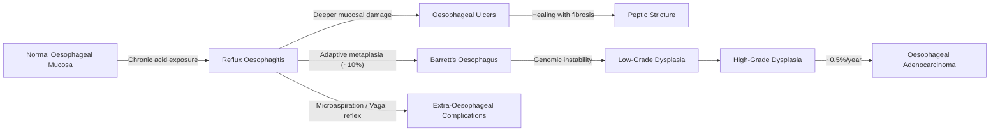

## Complications of GERD

### Overview — The Complication Cascade

GERD is not just about heartburn. If left inadequately treated (or in patients with severe, refractory disease), the chronic exposure of oesophageal squamous epithelium to acid, pepsin, and bile leads to a predictable cascade of tissue injury. Understanding this cascade from first principles is the key to understanding every complication:

**Chronic acid/pepsin exposure → mucosal inflammation (oesophagitis) → ulceration → fibrosis (stricture) → metaplasia (Barrett's) → dysplasia → adenocarcinoma**

***The listed complications of GERD are*** [2][13]:
1. ***Reflux oesophagitis (erosive oesophagitis)***
2. ***Oesophageal ulcers***
3. ***Oesophageal stricture***
4. ***Barrett's oesophagus***
5. ***Oesophageal adenocarcinoma***

Additionally, there are **extra-oesophageal complications** (respiratory, laryngeal, dental) and **complications related to associated hiatus hernia**.

***Oesophagitis can develop into ulcer → stricture → Barrett's oesophagus (10%) → metaplasia → adenocarcinoma (7% of Barrett's)*** [3].

---

### 1. Reflux Oesophagitis (Erosive Oesophagitis)

| Feature | Detail |
|:---|:---|
| **Definition** | Visible mucosal breaks (erosions) in the distal oesophagus caused by chronic gastro-oesophageal reflux, detectable on OGD [2] |
| **Prevalence** | ***~20–40% of symptomatic GERD patients have erosive oesophagitis*** [6]; the majority (60–80%) have NERD |
| **Pathophysiology** | The oesophageal squamous epithelium has no mucus-bicarbonate barrier (unlike gastric mucosa). When the anti-reflux mechanism fails → acid (HCl) + activated pepsin contact the squamous cells → hydrogen ions penetrate the intercellular spaces → disrupt tight junctions → cell necrosis → visible mucosal breaks. Bile acids (if duodenogastric reflux is present) worsen damage by disrupting cell membranes and promoting inflammatory cytokine release. |
| **Grading** | LA classification A–D (covered in previous section). LA C/D = severe; more likely to develop complications. |
| **Clinical features** | Heartburn, odynophagia (if severe), sometimes occult GI bleeding → iron-deficiency anaemia |
| **Management** | PPI therapy (standard dose for LA A/B; high-dose for LA C/D) × 8 weeks → repeat OGD for LA C/D to confirm healing and exclude Barrett's [6] |
| **Key point** | Healing with PPIs is excellent (~80–90% at 8 weeks), but **relapse rate is ~80% if PPI stopped** in severe oesophagitis (LA C/D) — hence the need for maintenance therapy |

> **Why does the oesophagus get damaged but the stomach doesn't?** The gastric mucosa has a robust triple-layered defence: (1) surface mucus layer, (2) bicarbonate secretion into the mucus, (3) tight intercellular junctions and rapid epithelial turnover. The oesophageal squamous epithelium lacks all of these. It relies on the anti-reflux barrier to prevent acid contact altogether — when this barrier fails, the epithelium is essentially defenceless.

---

### 2. Oesophageal Ulcers

| Feature | Detail |
|:---|:---|
| **Definition** | Deeper mucosal defects extending beyond the epithelium into the submucosa or muscularis, occurring in the setting of severe reflux oesophagitis [2][13] |
| **Pathophysiology** | Erosive oesophagitis (mucosal breaks) → if acid exposure continues → the inflammatory injury penetrates deeper → submucosal vessels are exposed → ulcer formation. Pepsin (activated at pH < 4) is particularly destructive — it digests tissue proteins once the epithelial barrier is breached. |
| **Clinical features** | **Odynophagia** (hallmark — acid directly contacts the raw ulcer base, stimulating exposed nociceptors), **haematemesis/melaena** (erosion into submucosal vessels), retrosternal pain |
| **Complications of the ulcer itself** | Bleeding (can be significant — chronic occult → IDA, or acute → haematemesis/melaena); perforation (rare); fistula formation (very rare) |
| **Management** | High-dose PPI to promote healing; endoscopic haemostasis if active bleeding; biopsy ulcer margins to exclude malignancy (Barrett's-associated adenocarcinoma can present as an ulcer) |

---

### 3. Oesophageal (Peptic) Stricture

| Feature | Detail |
|:---|:---|
| **Definition** | Fibrous narrowing of the oesophageal lumen resulting from chronic transmural inflammation and scarring [2][13] |
| **Pathophysiology** | Chronic oesophagitis → repeated cycles of ulceration and healing → **fibroblast activation → collagen deposition in the submucosa and muscularis** → concentric luminal narrowing. Think of it like a scar contracture — every cycle of damage and repair lays down more scar tissue, progressively narrowing the lumen. The stricture is typically **smooth, concentric, and in the distal oesophagus** (where acid exposure is maximal). |
| **Clinical features** | ***Progressive solid-food dysphagia*** in a patient with longstanding GERD history. Dysphagia to solids only (not liquids) because the lumen is narrowed but not occluded — liquids can still pass. The patient often learns to chew meticulously and avoid fibrous foods. If very tight (< 13 mm lumen), even semi-solids cause obstruction. |
| **Distinguishing from malignant stricture** | Peptic stricture = smooth, symmetrical, gradual onset, long GERD history. Malignant stricture = irregular, asymmetrical, short history of progressive dysphagia + weight loss + anaemia. **Always biopsy to exclude malignancy.** |
| **Management** | (1) ***Endoscopic dilatation*** — bougie (e.g., Savary-Gilliard) or balloon dilatation via OGD. May need multiple sessions (progressive dilatation over weeks). (2) ***Long-term PPI*** — essential to reduce ongoing acid injury and prevent recurrence. (3) ***Biopsy*** — exclude malignancy and assess for Barrett's. Recurrence rate is significant if PPI is not maintained. |

<Callout title="Stricture vs Cancer — An Exam Favourite" type="error">
Any patient with GERD and new-onset dysphagia must have an OGD. A benign peptic stricture is diagnosed clinically (long GERD history, smooth stricture) and histologically (biopsies showing fibrosis without dysplasia). **Never assume a stricture is benign without biopsy** — adenocarcinoma arising from Barrett's can present as a stricture-like lesion.
</Callout>

---

### 4. Barrett's Oesophagus

This is the single most important complication of GERD from a cancer-prevention standpoint.

| Feature | Detail |
|:---|:---|
| **Definition** | ***Intestinal metaplasia of oesophageal stratified squamous epithelium to columnar epithelium with mucus-secreting goblet cells***, as an adaptation to long-term acid reflux [4] |
| **Prevalence** | ***Develops in ~10% of patients with chronic GERD*** [3] |
| **Pathophysiology** | Why does metaplasia occur? The squamous epithelium is repeatedly damaged by acid → stem cells in the basal layer receive chronic inflammatory signals (IL-1β, IL-6, NF-κB pathway) → instead of regenerating squamous cells, they differentiate into **columnar (intestinal-type) epithelium** that is more acid-resistant (has mucus-secreting goblet cells). This is an **adaptive but maladaptive** response — the tissue tolerates acid better, but the new columnar epithelium is genetically unstable and prone to accumulating mutations (p53 loss, p16 inactivation, chromosomal instability) → **dysplasia → carcinoma**. |
| **Cancer risk** | ***Risk of developing adenocarcinoma is 30–100× compared to the normal population*** [16]. Annual risk: ***~0.5%/year*** [4]. ***~7% of Barrett's patients develop adenocarcinoma*** [3]. |
| **Risk factors for Barrett's** | Chronic GERD (> 5–10 years), male sex (M:F = 2:1), age > 50, Caucasian > Asian, obesity, smoking, hiatus hernia, family history |
| **Protective factor** | ***H. pylori infection is protective*** — H. pylori causes chronic gastritis → parietal cell atrophy → ↓ acid production → less acid reflux → less oesophageal damage [4]. This is the "African enigma" — high H. pylori prevalence in developing countries correlates with LOW Barrett's/adenocarcinoma rates. |

**Complications of Barrett's oesophagus itself** [16]:
- ***Oesophageal stricture*** (Barrett's-related)
- ***Oesophageal ulceration*** (Barrett's ulcers — deeper, more refractory than simple reflux ulcers)
- ***Oesophageal haemorrhage*** (from Barrett's ulcers)
- ***Adenocarcinoma of the oesophagus***

**The dysplasia-carcinoma sequence:**

| Stage | Histology | Management | Rationale |
|:---|:---|:---|:---|
| **Non-dysplastic Barrett's** | Intestinal metaplasia, no cellular atypia | ***High-dose PPI for life + surveillance OGD Q3–5y*** [4] | Low annual cancer risk; surveillance detects progression early |
| **Low-grade dysplasia (LGD)** | Mild cellular atypia (nuclear enlargement, stratification, hyperchromasia) confined to crypts | ***OGD Q6mo × 2, then Q1y if negative; OR endoscopic treatment*** [4] | ~0.5–1.3%/year progression to cancer; endoscopic treatment increasingly favoured |
| **High-grade dysplasia (HGD)** | Severe atypia, architectural distortion, but no invasion through basement membrane | ***Intense surveillance Q3mo; OR endoscopic treatment (EMR/ESD/RFA) — advised*** [4] | ~6–19%/year progression to cancer; endoscopic ablation is now preferred over surveillance alone |
| **Intramucosal carcinoma (T1a)** | Invasion through basement membrane into lamina propria/muscularis mucosae but NOT submucosa | Endoscopic mucosal resection (EMR) or endoscopic submucosal dissection (ESD) | Low risk of lymph node metastasis (< 2%) → oesophageal preservation possible |
| **Submucosal invasion (T1b)** | Invasion into submucosa | ***Oesophagectomy with lymph node dissection*** | High risk of lymph node metastasis (~20–25%) — endoscopic resection alone is insufficient [1] |

**Surveillance methods** [16]:
- ***Chromoendoscopy*** (Lugol's iodine, narrow-band imaging/NBI)
- ***High-resolution white light endoscopy***
- ***Seattle protocol***: 4-quadrant biopsies every 1–2 cm along the Barrett's segment [4]

<Callout title="Barrett's — Key Numbers for Exams">
- **10%** of GERD patients develop Barrett's
- **0.5%/year** risk of adenocarcinoma in Barrett's
- **30–100×** increased cancer risk vs general population
- **Surveillance**: No dysplasia Q3–5y, LGD Q6mo then Q1y, HGD Q3mo or treat
- **Prague C&M** classification for endoscopic grading
- **Seattle protocol**: 4-quadrant biopsy every 1–2 cm
</Callout>

---

### 5. Oesophageal Adenocarcinoma

| Feature | Detail |
|:---|:---|
| **Definition** | Malignant neoplasm arising from the columnar epithelium of Barrett's oesophagus in the distal oesophagus/GOJ |
| **Epidemiology** | Rising incidence in Western countries (parallels obesity and GERD trends). ***In HK, SCC is still most common (90%)*** [1][16], but adenocarcinoma is increasing |
| **Pathophysiology** | ***Oesophageal adenocarcinoma mostly arises from a region of Barrett's metaplasia which is due to GERD*** [1]. The sequence: chronic GERD → Barrett's metaplasia → accumulation of genetic mutations (p53, p16, APC, Rb, DNA aneuploidy) → low-grade dysplasia → high-grade dysplasia → invasive adenocarcinoma |
| **Risk factors** | ***GERD, Barrett's oesophagus***, obesity, smoking [1][16] |
| **Clinical features** | ***Painless progressive dysphagia*** (solids → liquids, typically when ***≥ 75% luminal stenosis***), weight loss, anaemia, odynophagia, GI bleeding [1] |
| **Prognosis** | ***Poor: > 50% have metastasis at presentation; 5-year survival is just 5–10%*** [16] |
| **Management** | Depends on staging — endoscopic resection (T1a), oesophagectomy with lymph node dissection (T1b+), neoadjuvant chemoRT for locally advanced disease, palliative stenting/RT for metastatic disease [1] |

> **Why is the prognosis so poor?** The oesophagus lacks a serosal layer — this means that tumour invasion into the adventitia encounters no fascial barrier, allowing early spread to mediastinal structures (trachea → ***tracheo-oesophageal fistula***, aorta, pericardium). Additionally, the rich submucosal lymphatic plexus facilitates early lymph node metastasis. By the time dysphagia develops (requiring ≥ 75% luminal stenosis), the tumour is usually advanced.

---

### 6. Extra-Oesophageal Complications

These result from two mechanisms: **(a) microaspiration** of refluxate into the airway, and **(b) vagal reflex** from oesophageal acid stimulation causing bronchospasm/cough without aspiration.

| Complication | Pathophysiology | Clinical Features |
|:---|:---|:---|
| **Aspiration pneumonia** | Refluxate reaches the larynx/trachea → enters the lungs → chemical pneumonitis + secondary bacterial infection | Recurrent pneumonia (especially right lower lobe — gravitational preference), particularly nocturnal; chronic cough with sputum; fever |
| **Posterior laryngitis / Laryngopharyngeal reflux (LPR)** | Acid + pepsin contacts the laryngeal mucosa (posterior commissure, arytenoids, vocal processes) → inflammation. Laryngeal epithelium is far more sensitive to acid than oesophageal (damaged at pH < 5 vs pH < 2) | Hoarseness, voice fatigue, chronic throat clearing, globus sensation, sore throat. Laryngoscopy: posterior erythema, oedema, vocal cord granulomas, contact ulcers |
| **Reflux-triggered asthma** | Oesophago-bronchial vagal reflex: acid in distal oesophagus → vagal afferents → reflex bronchospasm. Also, microaspiration → direct airway inflammation and hyperreactivity | Wheezing, nocturnal cough, dyspnoea — worsened by meals, lying flat. GERD found in ~50–80% of asthmatics. Note: asthma drugs (theophylline, β-agonists) also ↓ LES tone → vicious cycle |
| **Chronic cough** | Same dual mechanism as asthma (vagal reflex + microaspiration) | Chronic non-productive cough, often worse at night/post-prandially. GERD is one of the "big three" causes of chronic cough (along with upper airway cough syndrome and asthma) |
| **Dental erosions** | Chronic acid in the oral cavity dissolves tooth enamel (demineralisation of hydroxyapatite: Ca₁₀(PO₄)₆(OH)₂ + H⁺ → Ca²⁺ + H₂PO₄⁻) | Erosion of lingual surfaces of upper incisors; sensitivity, discolouration. Often noticed by dentists before GI referral. |
| **Otitis media / Sinusitis (paediatric)** | Nasopharyngeal reflux → eustachian tube inflammation | Recurrent ear infections, nasal congestion (especially children) |
| **Sleep disturbance** | Nocturnal reflux → micro-arousals; bidirectional relationship with OSA (negative intrathoracic pressure promotes reflux) | Poor sleep quality, daytime somnolence, morning hoarseness |

---

### 7. Complications Related to Associated Hiatus Hernia

While not a direct complication of GERD per se, hiatus hernia and GERD are intimately related [3], and hernia-specific complications are important:

| Complication | Type of Hernia | Pathophysiology | Clinical Presentation |
|:---|:---|:---|:---|
| **Cameron lesions** | Sliding (Type I) | ***Erosions or ulcers occurring in the sac of a hiatal hernia*** [10] — mechanical trauma from diaphragmatic impingement on the herniated stomach | Chronic occult GI bleeding → iron-deficiency anaemia. Often missed on OGD unless specifically looked for at the diaphragmatic impression. |
| ***Gastric volvulus*** | ***Rolling type (Type II/III)*** [3] | The freely mobile fundus rotates > 180° around the GOJ or along its long axis → **closed-loop obstruction** ± ischaemia | ***Borchardt's triad***: (1) severe epigastric pain, (2) retching without vomiting, (3) inability to pass NG tube. Surgical emergency. |
| ***Strangulation / Incarceration*** | ***Rolling type (Type II/III/IV)*** [3] | Herniated stomach (or other organs in Type IV) becomes trapped in the hiatus → venous obstruction → oedema → arterial compromise → ischaemia → gangrene | Acute chest/epigastric pain, signs of obstruction, haemodynamic instability. Emergency surgery required. |
| ***Gastric perforation*** | Rolling type [3] | End result of strangulation/gangrene or volvulus | Peritonitis, septic shock. High mortality. |
| **Oesophageal bleeding from oesophageal ulceration** | All types [3] | Acid exposure from GERD + mechanical trauma at the hernia neck | Haematemesis/melaena; chronic → IDA |

***Emergency management of hiatus hernia complications: NG tube decompression + emergency surgery (laparotomy/laparoscopy)*** [3].

---

### 8. Complications of GERD Treatment

While not "complications of GERD" per se, these are frequently tested and clinically relevant:

#### A. Long-Term PPI Complications
(Covered in detail in Management section — brief recap)

| Complication | Mechanism |
|:---|:---|
| Osteoporosis / fractures | ↓ Calcium absorption |
| Hypomagnesaemia | Impaired intestinal Mg transport |
| *C. difficile* colitis | Loss of gastric acid barrier |
| Community-acquired pneumonia | ↑ Bacterial burden in refluxate |
| Iron/B12 deficiency | Acid-dependent absorption impaired |
| Fundic gland polyps | Hypergastrinaemia → parietal cell hyperplasia |
| Rebound acid hypersecretion | Compensatory hypergastrinaemia on cessation |

#### B. Fundoplication Complications [3]

| Complication | Details |
|:---|:---|
| ***Gas bloat syndrome (90%)*** | ***Inability to burp or vomit, flatus; self-limiting in 4 weeks*** [3] |
| ***Dysphagia (50% early, 10% long-term)*** | ***Wrap too tight. Ix: Water-soluble contrast swallow. Tx: balloon dilatation or revise*** [3] |
| ***Recurrence of reflux*** | ***Wrap too loose*** [3] |
| ***Slipped Nissen*** | ***Wrap slides down, GOJ retracts into chest*** [3] |
| ***Perforation → mediastinitis*** | Iatrogenic during dissection [3] |
| ***Surgical emphysema*** | ***Gas absorbed in mediastinum*** [3] |

---

### Summary — Complication Progression Map

| Stage | Complication | Key Feature | Management Principle |
|:---|:---|:---|:---|
| **Stage 1** | Reflux oesophagitis | Mucosal breaks (LA A–D) | PPI therapy |
| **Stage 2** | Oesophageal ulcers | Deeper erosion, odynophagia, bleeding | High-dose PPI; endoscopic haemostasis if bleeding |
| **Stage 3** | Peptic stricture | Progressive solid-food dysphagia | Endoscopic dilatation + long-term PPI |
| **Stage 4** | Barrett's oesophagus | Intestinal metaplasia with goblet cells | High-dose PPI for life + surveillance |
| **Stage 5** | Dysplasia (LGD → HGD) | Cellular atypia | Endoscopic ablation/resection |
| **Stage 6** | Adenocarcinoma | Invasive cancer | Staging → resection/chemoRT/palliation |
| **Extra-oesophageal** | Respiratory/laryngeal/dental | Aspiration, vagal reflex, acid erosion | Treat GERD + specific symptom management |

---

<Callout title="High Yield Summary">

**Oesophageal complications of GERD (in order of progression):**
1. **Reflux oesophagitis** — mucosal breaks; LA classification; heals with PPI
2. **Oesophageal ulcers** — deeper injury; odynophagia and bleeding
3. **Peptic stricture** — fibrosis from repeated ulceration/healing; progressive solid-food dysphagia; Rx: dilatation + PPI
4. **Barrett's oesophagus** — intestinal metaplasia; develops in ~10% of GERD; cancer risk 0.5%/year (30–100× general population); requires lifelong PPI + surveillance
5. **Oesophageal adenocarcinoma** — arises from Barrett's; poor prognosis (5-year survival 5–10%); > 50% metastatic at presentation

**Extra-oesophageal complications:** Aspiration pneumonia, posterior laryngitis/LPR, reflux-triggered asthma, chronic cough, dental erosions, sleep disturbance.

**Hiatus hernia complications:** Cameron lesions (occult bleeding), gastric volvulus (Borchardt's triad — emergency), strangulation, perforation.

**Key cascade to remember:** Oesophagitis → Ulcer → Stricture → Barrett's (10%) → Dysplasia → Adenocarcinoma (0.5%/year)

**Barrett's surveillance numbers:** No dysplasia Q3–5y; LGD Q6mo × 2 then Q1y; HGD Q3mo or treat. Always high-dose PPI for life.

</Callout>

---

<ActiveRecallQuiz
  title="Active Recall - Complications of GERD"
  items={[
    {
      question: "List the five major oesophageal complications of GERD in order of progression and explain the pathophysiological link between each stage.",
      markscheme: "1. Reflux oesophagitis (acid damages unprotected squamous epithelium, causing mucosal breaks). 2. Oesophageal ulcers (deeper penetration through mucosa into submucosa, exposing vessels). 3. Peptic stricture (repeated ulceration and healing causes fibroblast activation and collagen deposition, leading to concentric luminal narrowing). 4. Barrett's oesophagus (chronic injury triggers stem cell differentiation into intestinal-type columnar epithelium with goblet cells - adaptive metaplasia). 5. Adenocarcinoma (metaplastic epithelium accumulates genetic mutations through p53 loss, p16 inactivation leading to dysplasia then invasive cancer).",
    },
    {
      question: "Why is the oesophageal squamous epithelium so vulnerable to acid damage while the gastric mucosa is not?",
      markscheme: "Gastric mucosa has triple defence: (1) surface mucus layer, (2) bicarbonate secretion into mucus creating pH gradient, (3) tight intercellular junctions and rapid epithelial turnover. Oesophageal squamous epithelium lacks all three - no mucus-bicarbonate barrier, relatively loose intercellular junctions. It relies entirely on the anti-reflux barrier preventing acid contact.",
    },
    {
      question: "A patient with a large paraesophageal (rolling) hiatus hernia presents with severe epigastric pain, retching without vomiting, and the NG tube cannot be passed. What is the diagnosis and what is the emergency management?",
      markscheme: "Gastric volvulus - Borchardt's triad (severe epigastric pain, retching without vomiting, inability to pass NG tube). This is a surgical emergency. Management: NG tube decompression (attempt), IV resuscitation, emergency surgery (laparotomy or laparoscopy for reduction, assessment of gastric viability, gastropexy, and repair of hiatal hernia with fundoplication).",
    },
    {
      question: "What is the annual risk of adenocarcinoma in Barrett's oesophagus, and what percentage of GERD patients develop Barrett's? Why is H. pylori infection protective?",
      markscheme: "Annual cancer risk in Barrett's is approximately 0.5% per year. Approximately 10% of chronic GERD patients develop Barrett's. H. pylori is protective because it causes chronic gastritis with parietal cell atrophy, leading to reduced acid production, which results in less acid reflux and less oesophageal damage. This explains the inverse relationship between H. pylori prevalence and Barrett's/adenocarcinoma rates.",
    },
    {
      question: "Explain the two mechanisms by which GERD causes extra-oesophageal complications such as asthma and chronic cough.",
      markscheme: "(1) Microaspiration: refluxate reaches the larynx and tracheobronchial tree, causing direct chemical irritation and vagal-mediated cough reflex or inflammatory airway changes. (2) Oesophago-bronchial vagal reflex: acid in the distal oesophagus stimulates vagal afferents which trigger reflex bronchospasm and cough WITHOUT aspiration occurring. Both mechanisms can coexist.",
    },
    {
      question: "What are Cameron lesions, where do they occur, and how do they present?",
      markscheme: "Cameron lesions are erosions or ulcers occurring within the sac of a hiatal hernia, caused by mechanical trauma from diaphragmatic impingement on the herniated gastric mucosa. They present with chronic occult GI bleeding leading to iron-deficiency anaemia. They are often missed on OGD unless specifically looked for at the diaphragmatic impression. Associated with sliding (Type I) hiatus hernia.",
    },
  ]}
/>

## References

[1] Lecture slides: GC 189. I can't swallow oesophageal cancer.pdf
[2] Senior notes: felixlai.md (GERD section, pp. 349–351)
[3] Senior notes: maxim.md (GERD surgical treatment, Hiatal hernia sections)
[4] Senior notes: maxim.md (Barrett's oesophagus section, p. 57)
[6] Senior notes: felixlai.md (GERD diagnosis and case study, pp. 352–358)
[10] Senior notes: felixlai.md (Upper GI bleeding differential, pp. 334–335)
[13] Senior notes: felixlai.md (GERD complications section, p. 357)
[16] Senior notes: felixlai.md (Barrett's oesophagus complications, pp. 368–369); maxim.md (CA oesophagus section, p. 60)
