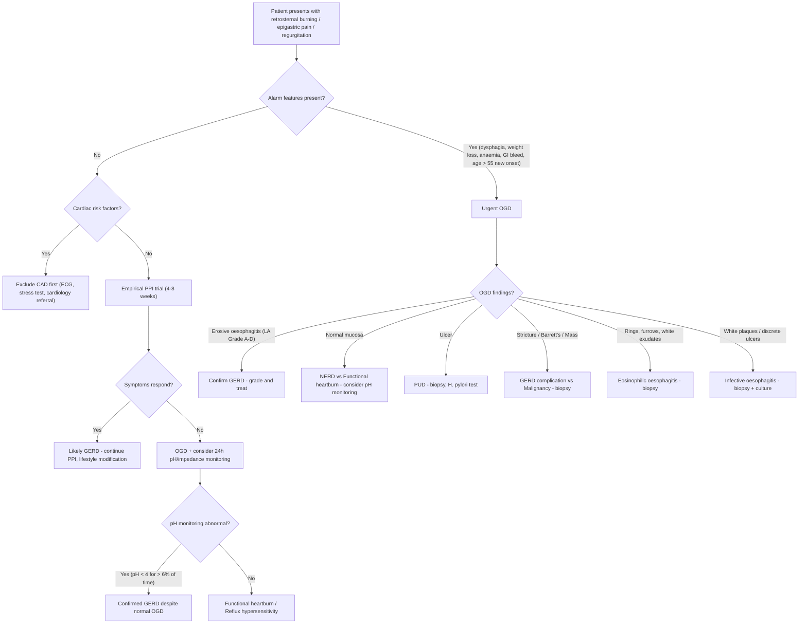

## Differential Diagnosis of GERD

When a patient presents with the classic GERD triad — retrosternal burning, acid regurgitation, and symptoms worsened by meals/supine position — the diagnosis may seem straightforward. But the reality is that **many conditions mimic GERD**, and conversely, **GERD can mimic many other conditions** (especially cardiac disease). A systematic approach to differential diagnosis is essential.

The key principle: **GERD is a clinical diagnosis, but you must actively exclude dangerous mimics before settling on it**, particularly coronary artery disease, oesophageal malignancy, and peptic ulcer disease.

---

### Organising the Differential by Presenting Symptom

GERD presents along several symptom axes, each with its own differential:

1. **Heartburn / retrosternal burning** — DDx of epigastric/retrosternal pain
2. **Dysphagia** — DDx of difficulty swallowing
3. **Chronic cough / hoarseness / asthma** — DDx of extra-oesophageal symptoms
4. **Upper GI bleeding** — DDx of haematemesis/melaena (when GERD causes erosive oesophagitis)

---

### A. Differential Diagnosis of Heartburn / Retrosternal Pain

These are the conditions that present with **epigastric or retrosternal pain/burning** and may be confused with GERD:

| Differential | Key Distinguishing Features | Why It Can Mimic GERD |
|:---|:---|:---|
| ***Coronary artery disease (CAD)*** | Exertional chest pain, relieved by rest/GTN, associated with diaphoresis, dyspnoea. Risk factors: HTN, DM, smoking, hyperlipidaemia, FHx. ECG changes. | Cardiac and oesophageal pain share the same spinal afferent segments (T1–T6) → referred pain is nearly identical. ***A case study highlights a 50-year-old heavy smoker with retrosternal chest discomfort radiating to the throat, waking him at night — GERD was the diagnosis, but CAD must be actively excluded*** [6]. The key distinguishing feature: GERD pain has **no relation to exertion** and is **relieved by antacids/water**, not GTN [6]. |
| ***Peptic ulcer disease (PUD)*** | Epigastric pain — gastric ulcer: precipitated by food; duodenal ulcer: 2–5 hours after meals, relieved by food/antacids, night-time awakening. ***4 major risk factors: H. pylori, NSAIDs, stress, excess gastric acid*** [7]. | Overlap in location (epigastric), timing (post-prandial), and partial relief by antacids. Differentiate by OGD. PUD pain is more "gnawing" and localized; GERD pain is more "burning" and retrosternal with upward radiation [7]. |
| ***Functional (non-ulcer) dyspepsia*** | Rome IV criteria: postprandial fullness, early satiety, epigastric pain/burning for ≥ 3 months with onset ≥ 6 months prior. **No structural disease** on investigation. Accounts for ***~60% of all dyspepsia*** [7]. | Significant symptom overlap — epigastric burning can be identical. Heartburn is technically not a dyspeptic symptom but frequently coexists [7]. Functional dyspepsia is a diagnosis of exclusion after OGD is normal. |
| ***Infective oesophagitis*** | Odynophagia is prominent (more so than heartburn). Immunocompromised patients (HIV, transplant, chemotherapy). Caused by ***Candida*** (most common — white plaques), ***HSV*** (shallow ulcers), ***CMV*** (deep ulcers) [6]. | Can cause retrosternal burning, but **odynophagia dominates** and there is usually an immunocompromised background. OGD with biopsy/culture differentiates. |
| ***Pill oesophagitis*** | Temporal relationship with oral medication (patient takes pill with insufficient water, or lies down immediately after). Common culprits: ***bisphosphonates (alendronate), tetracyclines (doxycycline), NSAIDs, KCl, iron supplements*** [6]. | Causes localised oesophageal injury — burning, odynophagia. History of the offending pill + temporal relationship is diagnostic. OGD shows discrete ulcers, often mid-oesophagus (where the aortic arch or left atrium compresses the oesophagus, slowing tablet transit). |
| ***Eosinophilic oesophagitis (EoE)*** | Young males with atopic history (asthma, eczema, food allergy). Intermittent dysphagia, food bolus impaction. Characteristic OGD: ***rings ("trachealization"), furrows, white exudates***. Biopsy: ≥ 15 eosinophils/HPF [6]. | Can cause heartburn and dysphagia. Often misdiagnosed as GERD — the clue is **failure to respond to PPIs** (though ~50% of EoE patients show partial PPI response, now called PPI-responsive oesophageal eosinophilia). |
| ***Oesophageal motility disorders*** | ***Achalasia***: progressive dysphagia for solids AND liquids, regurgitation of undigested food, chest pain. ***Diffuse oesophageal spasm (DES)***: intermittent chest pain + dysphagia; "corkscrew oesophagus" on barium. ***Jackhammer (nutcracker) oesophagus***: intense chest pain [6][8]. | Achalasia can cause heartburn (from food stasis → fermentation → lactic acid irritation, NOT acid reflux). ***Both GERD and achalasia present with heartburn and regurgitation — oesophageal manometry is diagnostic of achalasia*** [8]. |
| ***Oesophageal / gastric malignancy*** | ***Painless progressive dysphagia*** (solids → liquids) over weeks. Weight loss, anorexia, anaemia. Risk factors: smoking, alcohol, Barrett's, achalasia [1][9]. | Advanced oesophageal cancer can cause retrosternal pain. The key alarm features (progressive dysphagia, weight loss, anaemia) mandate urgent OGD [1]. |
| **Biliary colic / cholecystitis** | RUQ/epigastric pain, worse after fatty meals, Murphy's sign positive. | Epigastric pain after fatty meals overlaps. Biliary colic is more colicky and localised to RUQ; GERD is burning and retrosternal. USS abdomen differentiates. |
| **Acute pancreatitis** | Severe epigastric pain radiating to back, relieved by leaning forward. ↑ Amylase/lipase. | Epigastric pain can mimic. Radiation to back, severity, and biochemistry differentiate. |
| **Gastritis / Duodenitis** | Epigastric pain, nausea. May be drug-induced (NSAIDs, alcohol), stress-induced, or H. pylori-related. Diagnosis by OGD [7][10]. | Mucosal inflammation without discrete ulceration. Symptom overlap is extensive; OGD differentiates. |

<Callout title="The Most Dangerous Mimic" type="error">
***Coronary artery disease*** is the most dangerous condition that mimics GERD. The case study in the notes describes a 50-year-old male heavy smoker with a father who had CAD at 55 — presenting with retrosternal discomfort radiating to the throat, sometimes waking him at night. Despite the classic GERD features (relief by water, no exertional component), cardiac disease MUST be excluded first given the risk factor profile [6]. Remember: **always exclude the deadly differential before diagnosing the common one**.
</Callout>

---

### B. Differential Diagnosis of Dysphagia (When GERD Presents with Dysphagia)

GERD-associated dysphagia may be due to peptic stricture, oedema, or Barrett's-related changes. But dysphagia has a broad differential that must be considered systematically [9]:

| Category | Conditions | Distinguishing Features |
|:---|:---|:---|
| **Structural — Intramural** | ***CA oesophagus*** | Painless progressive dysphagia (solids → liquids), weight loss. ≥ 75% luminal stenosis before dysphagia occurs [1][9]. |
| | ***Peptic stricture (GERD complication)*** | Long history of GERD/heartburn → progressive solid-food dysphagia. Smooth, concentric narrowing on OGD/barium [2]. |
| | ***Oesophageal rings/webs*** | Intermittent, non-progressive solid-food dysphagia. Schatzki ring (lower oesophagus at squamocolumnar junction); Plummer-Vinson web (upper oesophagus, associated with IDA) [9]. |
| | ***Corrosive/caustic stricture*** | History of caustic ingestion. Progressive dysphagia developing weeks–months later [9]. |
| | ***Eosinophilic oesophagitis*** | Young atopic male, food impaction, rings on OGD [6]. |
| **Structural — Extramural** | ***Lung cancer, lymphoma, retrosternal goitre, thoracic aortic aneurysm*** | Extrinsic compression. The mnemonic ***"4T's of extramural compression": Tumour/LN, Thyroid, Thymus, Thoracic aortic aneurysm*** [9]. |
| **Functional (Motility)** | ***Achalasia*** | Dysphagia for solids AND liquids simultaneously from onset. Regurgitation of undigested food. Bird's beak sign on barium. Manometry diagnostic [8][9]. |
| | ***Diffuse oesophageal spasm*** | Intermittent dysphagia + chest pain. "Corkscrew" oesophagus. Normal LES relaxation on manometry (unlike achalasia) [8]. |
| | ***Scleroderma (systemic sclerosis)*** | CREST syndrome. Fibrosis of oesophageal smooth muscle → absent peristalsis in distal 2/3 + incompetent LES → severe GERD + dysphagia [9]. |
| | ***Neurological*** | Stroke, MND, Parkinson's, MS, MG, myopathies — cause **oropharyngeal (transfer) dysphagia** with coughing/choking on initiation of swallowing [9]. |

> ***Key clinical distinction***: **Painless progressive dysphagia (over weeks) is malignancy until proven otherwise** [9].

---

### C. Differential Diagnosis of Extra-Oesophageal Symptoms

When GERD presents primarily with extra-oesophageal symptoms, the differential broadens considerably:

| Symptom | GERD Mechanism | Other Differentials to Exclude |
|:---|:---|:---|
| ***Chronic cough*** | Microaspiration or oesophago-bronchial vagal reflex [2] | Asthma, post-nasal drip (upper airway cough syndrome), ACE inhibitor cough, bronchiectasis, TB, lung cancer |
| ***Asthma / Wheezing*** | Vagal reflex bronchospasm [2] | True asthma (atopic), COPD, cardiac asthma (HF) |
| ***Hoarseness / Posterior laryngitis*** | Acid/pepsin damage to laryngeal mucosa [2] | Vocal cord nodules/polyps, laryngeal cancer, RLN palsy (lung apex tumour, thyroid surgery), functional dysphonia |
| ***Non-cardiac chest pain*** | Oesophageal nociceptors share spinal segments with cardiac afferents [2] | CAD (must exclude first), musculoskeletal (costochondritis), PE, pericarditis, anxiety/panic disorder |
| ***Globus sensation*** | UES hypertonia from distal oesophageal acid exposure [2] | Pharyngeal/oesophageal malignancy, thyroid enlargement, anxiety, cricopharyngeal bar |

---

### D. Differential Diagnosis When GERD Causes Upper GI Bleeding

Erosive oesophagitis from GERD can cause UGIB. The differential of UGIB must be considered [10]:

| Cause | Key Feature |
|:---|:---|
| ***Peptic/duodenal ulcers (most common cause of UGIB)*** | H. pylori, NSAIDs history. Visible vessel or adherent clot on OGD [7][10]. |
| ***Oesophagogastric varices*** | Portal hypertension, liver cirrhosis. Massive haematemesis [10]. |
| ***Erosive oesophagitis/oesophageal ulcers*** | History of GERD. Usually self-limiting bleed [10]. |
| ***Gastritis/duodenitis*** | Drug-induced, alcohol, stress. Self-limiting [10]. |
| ***Mallory-Weiss syndrome*** | Longitudinal mucosal laceration at GOJ following forceful retching/vomiting. ↑ intra-abdominal pressure → tear [10]. |
| ***Upper GI malignancy*** | Constitutional symptoms (weight loss, anorexia). Usually slower bleed [10]. |
| ***Dieulafoy's lesion*** | Dilated aberrant submucosal vessel, usually proximal stomach. Massive, intermittent bleed without surrounding ulcer [10]. |
| ***Portal hypertensive gastropathy*** | Diffuse mucosal oozing in context of portal hypertension [10]. |

---

### Diagnostic Decision Tree

---

### Key Differentiating Points — Summary Table

| Feature | GERD | CAD | PUD | Achalasia | Oesophageal Cancer |
|:---|:---|:---|:---|:---|:---|
| **Pain character** | Burning, retrosternal | Crushing, tight | Gnawing, epigastric | Pressure, retrosternal | Dull ache, progressive |
| **Relation to meals** | Worse post-prandial | No relation | GU: worse with food; DU: relieved | After meals (food stasis) | No relation |
| **Relation to exertion** | None | ***Worsened*** | None | None | None |
| **Relieved by** | Antacids, PPI, water | GTN, rest | Food (DU), antacids | None reliably | Nothing |
| **Dysphagia** | If stricture/Barrett's | No | No | ***Solids + liquids from onset*** | ***Progressive solids → liquids*** |
| **Weight loss** | Uncommon | No | Possible | Yes (late) | ***Yes (prominent)*** |
| **Key investigation** | OGD, pH monitoring | ECG, troponin | OGD + H. pylori test | ***Oesophageal manometry*** [8] | ***OGD + biopsy*** [1] |

<Callout title="Achalasia vs GERD — A Classic Exam Pitfall" type="error">
***Both GERD and achalasia can present with heartburn and regurgitation.*** In achalasia, "heartburn" is due to fermentation of retained food (lactic acid), NOT gastric acid reflux. The regurgitation in achalasia is of **undigested food** (no sour/bitter taste), while in GERD it is **acidic/bitter**. ***Oesophageal manometry is diagnostic of achalasia*** (elevated LES resting pressure, failure of LES relaxation, absent peristalsis) [8]. If you prescribe a PPI for achalasia, it won't work — and the patient's dysphagia will progress.
</Callout>

<Callout title="Pseudoachalasia — Don't Miss the Cancer">
***Malignancy at the GOJ can cause pseudoachalasia*** by invading the oesophageal neural plexus directly (adenocarcinoma at GOJ) or via paraneoplastic syndrome. Manometric findings are identical to true achalasia. ***Differentiate by OGD + endoscopic ultrasound (EUS)*** — look for a mass at the GOJ, "shouldering/heaping" on barium swallow, short duration of symptoms (< 6 months), age > 55, and significant weight loss [8].
</Callout>

---

<Callout title="High Yield Summary">

**Core differential of GERD symptoms:**

1. ***Coronary artery disease*** — most dangerous mimic; shared spinal afferents T1–T6; exclude if cardiac risk factors present
2. ***Peptic ulcer disease*** — overlapping epigastric pain; differentiate by meal relationship and OGD
3. ***Functional dyspepsia*** — diagnosis of exclusion; accounts for 60% of dyspepsia; no structural disease
4. ***Infective oesophagitis*** — immunocompromised; odynophagia dominates; Candida (most common), HSV, CMV
5. ***Pill oesophagitis*** — temporal relationship with medication; mid-oesophageal ulcers
6. ***Eosinophilic oesophagitis*** — young atopic males; food impaction; PPI-refractory; ≥ 15 eos/HPF
7. ***Achalasia*** — dysphagia for solids AND liquids, undigested food regurgitation; manometry diagnostic
8. ***Oesophageal malignancy*** — painless progressive dysphagia is cancer until proven otherwise

**When to worry:** Alarm features (dysphagia, weight loss, anaemia, GI bleeding, age > 55 new onset) → urgent OGD.

**Key differentiating test:** OGD for structural pathology; oesophageal manometry for motility disorders; 24h pH-impedance monitoring for equivocal cases.

</Callout>

---

<ActiveRecallQuiz
  title="Active Recall - Differential Diagnosis of GERD"
  items={[
    {
      question: "A 50-year-old male heavy smoker with family history of CAD at 55 presents with retrosternal discomfort radiating to the throat, waking him at night, relieved by water. What is the likely diagnosis and what must you exclude first?",
      markscheme: "Likely GERD (burning retrosternal pain, no exertional component, relieved by water/antacids, post-prandial/nocturnal pattern). Must exclude coronary artery disease first given significant cardiac risk factors (age, male, heavy smoker, family history). ECG and cardiac workup before settling on GERD.",
    },
    {
      question: "Name the listed differential diagnoses for GERD from the senior notes and explain the key distinguishing feature of each.",
      markscheme: "Infective oesophagitis (immunocompromised, odynophagia dominant), Pill oesophagitis (temporal medication relationship), Eosinophilic oesophagitis (atopic young male, food impaction, PPI-refractory), Oesophageal motor disorders including achalasia (solids + liquids dysphagia, manometry diagnostic), PUD (gnawing epigastric pain, H. pylori/NSAIDs), Non-ulcer/functional dyspepsia (no structural disease, diagnosis of exclusion), CAD (exertional, relieved by GTN).",
    },
    {
      question: "How do you differentiate achalasia from GERD clinically, and what is the definitive diagnostic test?",
      markscheme: "Both present with heartburn and regurgitation. In achalasia: heartburn is from fermentation of retained food (lactic acid, not gastric acid); regurgitation is of undigested food without sour/bitter taste; dysphagia is for solids AND liquids from onset. In GERD: heartburn is from acid; regurgitation is sour/bitter; dysphagia only if stricture (solids only). Definitive test: oesophageal manometry showing elevated LES resting pressure, failure of LES relaxation, absent peristalsis.",
    },
    {
      question: "A patient with GERD symptoms also has progressive solid-food dysphagia and weight loss. What is the most important diagnosis to exclude and how?",
      markscheme: "Oesophageal malignancy (adenocarcinoma arising from Barrett's or SCC). Painless progressive dysphagia is cancer until proven otherwise. Investigate with urgent OGD and biopsy. Also consider staging with EUS and PET-CT if malignancy confirmed.",
    },
    {
      question: "What features distinguish pseudoachalasia from true achalasia?",
      markscheme: "Pseudoachalasia is caused by malignancy at GOJ invading oesophageal neural plexus or paraneoplastic syndrome. Same manometric findings as true achalasia. Clues: short symptom duration (less than 6 months), age more than 55, significant weight loss, shouldering/heaping on barium swallow. Differentiated by OGD plus endoscopic ultrasound showing a mass at GOJ.",
    },
  ]}
/>

## References

[1] Lecture slides: GC 189. I can't swallow oesophageal cancer.pdf
[2] Senior notes: felixlai.md (GERD section, pp. 349–351)
[3] Senior notes: maxim.md (GERD, Hiatal hernia sections)
[6] Senior notes: felixlai.md (GERD case study and differential diagnosis, pp. 351–358)
[7] Senior notes: felixlai.md (Dyspepsia section, pp. 327–329; PUD section, pp. 388–389)
[8] Senior notes: felixlai.md (Achalasia section, pp. 360–361); maxim.md (Achalasia section)
[9] Senior notes: maxim.md (Dysphagia differential diagnosis table); Lecture slides: GC 189. I can't swallow oesophageal cancer.pdf
[10] Senior notes: felixlai.md (Upper GI bleeding differential, pp. 334–335); maxim.md (UGIB section)
