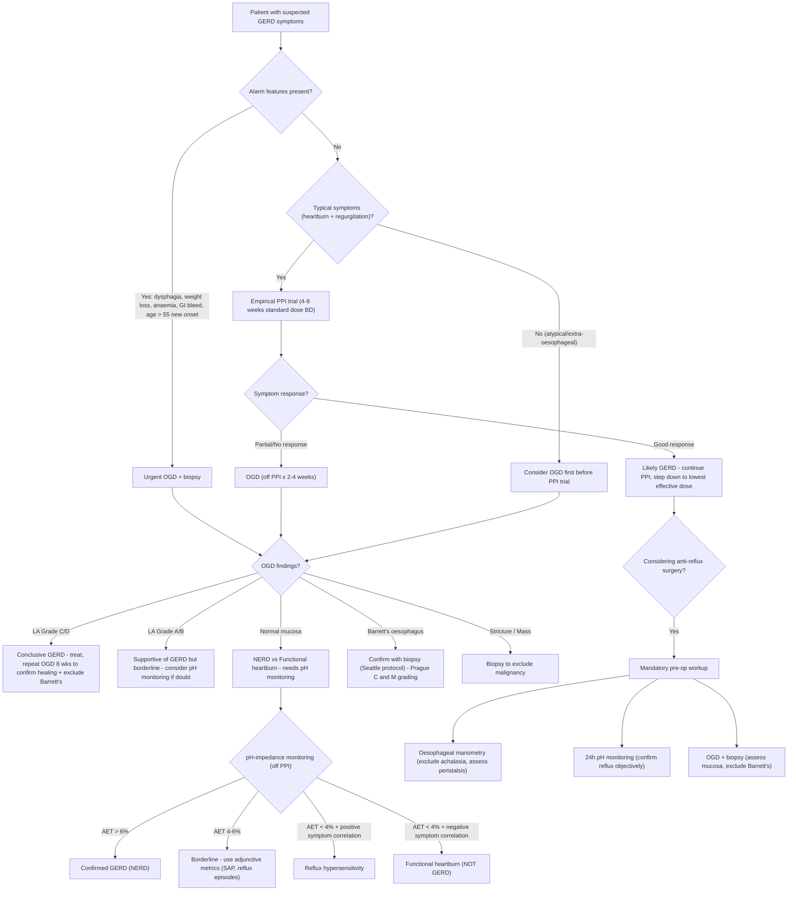

## Diagnostic Criteria & Diagnostic Algorithm for GERD

### Why Is Diagnosing GERD Not Straightforward?

Unlike many conditions where a single test gives you a definitive answer (e.g., troponin for MI, biopsy for cancer), **GERD has no single gold-standard diagnostic criterion that applies to all patients**. Here's why:

1. **Most GERD patients have normal endoscopy** (NERD = 60–70%) — so you can't rely on endoscopy alone to "rule in" GERD [2][6].
2. **pH monitoring is the most objective test**, but it's uncomfortable, not widely available, and still misses ~10–20% of true GERD [6].
3. **Symptom-based diagnosis is ~80–90% accurate** for typical presentations, but extra-oesophageal presentations are notoriously unreliable [6].

Therefore, GERD diagnosis relies on a **combination of methods**, applied in a stepwise fashion depending on the clinical scenario.

---

### Diagnostic Criteria — The 2022 Lyon Consensus (Updated from 2018)

The Lyon Consensus provides the most widely accepted framework for defining **objective evidence of GERD**. Think of it as a traffic-light system:

| Evidence Level | Criteria | Interpretation |
|:---|:---|:---|
| **Conclusive evidence FOR GERD** | ***LA Grade C or D oesophagitis on OGD*** | Pathological reflux confirmed — no further testing needed |
| | ***Long-segment Barrett's oesophagus (≥ 1 cm with intestinal metaplasia on biopsy)*** | Pathological reflux confirmed |
| | ***Peptic stricture on OGD*** | Pathological reflux confirmed |
| | ***Acid exposure time (AET) > 6% on ambulatory pH monitoring*** | Pathological reflux confirmed [6] |
| **Borderline / Inconclusive** | LA Grade A or B oesophagitis | May be normal variant (Grade A especially); supportive but not conclusive alone |
| | AET 4–6% | Grey zone — needs adjunctive metrics (symptom correlation, number of reflux episodes) |
| **Against GERD** | Normal OGD + AET < 4% + normal reflux episode count | GERD excluded — consider functional heartburn or reflux hypersensitivity |

<Callout title="Why LA Grade A Is No Longer Conclusive">
The 2022 Lyon Consensus downgraded LA Grade A oesophagitis because studies showed that up to 5–7.5% of asymptomatic healthy volunteers have LA Grade A changes on endoscopy. It has low specificity for pathological GERD. ***LA Grade C/D, however, is conclusive evidence of GERD*** — you don't even need pH monitoring.
</Callout>

---

### The Four Main Diagnostic Methods

***There are 4 main methods that can be used alone or in combination*** [6]:

1. ***Symptom questionnaires***
2. ***Upper endoscopy (OGD)***
3. ***Ambulatory 24-hour oesophageal pH monitoring***
4. ***Proton pump inhibitor (PPI) testing***

Let's dissect each.

---

### Investigation Modalities — Detailed Breakdown

#### 1. Symptom Questionnaires (Clinical History)

| Feature | Detail |
|:---|:---|
| **Principle** | Typical symptoms (heartburn + acid regurgitation) in a classic pattern have ~80–90% accuracy for diagnosing GERD [6] |
| **Validated tools** | GERD-Q (GERD Questionnaire), RDQ (Reflux Disease Questionnaire), GERD-HRQL |
| **Accuracy** | ***~80–90%*** [6] |
| **When sufficient alone** | Young patient (< 55), typical symptoms, no alarm features → can proceed directly to empirical PPI trial without investigation |
| **Limitations** | Cannot detect complications (stricture, Barrett's, cancer); cannot distinguish NERD from functional heartburn; poor accuracy for extra-oesophageal symptoms |

**Key symptom characteristics to elicit** [6]:
- ***Site***: Retrosternal area
- ***Onset***: After meals / leaning forward (bending) / lying flat in bed
- ***Character***: Burning pain
- ***Radiation***: Up towards the throat
- ***Associated symptoms***: Cough when lying down
- ***Time course***: More than once a week
- ***Exacerbating factors***: Alcohol, chocolate, caffeine, fatty meals, CCBs, anticholinergic drugs
- ***Relieving factors***: Antacids, acid-blocking drugs

---

#### 2. Proton Pump Inhibitor (PPI) Trial

| Feature | Detail |
|:---|:---|
| **Principle** | If symptoms are caused by acid reflux, suppressing acid should relieve them. ***Constitutes a therapeutic trial conducted over 1–4 weeks*** [6]. |
| **Protocol** | Standard-dose PPI (e.g., omeprazole 20 mg BD or esomeprazole 40 mg OD) for 4–8 weeks |
| **Interpretation** | ***Patients responding favourably are likely to have a reflux component to their symptoms*** [6] |
| **Sensitivity** | ~78% for erosive oesophagitis; lower (~50%) for NERD |
| **Specificity** | Moderate (~54%) — other acid-related conditions (PUD, functional dyspepsia, eosinophilic oesophagitis) may also improve |
| **Advantages** | Non-invasive, inexpensive, widely available, doubles as treatment |
| **Limitations** | Positive response does not definitively confirm GERD (placebo response rate ~20–40%); negative response does not exclude GERD (may need higher dose, longer trial, or non-acid reflux is the problem) |

<Callout title="PPI Trial — Practical Interpretation" type="idea">
Think of the PPI trial as a **screening test**, not a diagnostic test. A positive response makes GERD *likely* but doesn't prove it. A negative response should prompt further investigation (OGD ± pH monitoring) rather than abandoning the GERD diagnosis entirely. Also remember: some patients have **non-acid reflux** (bile, weakly acidic) that won't respond to PPIs — these need impedance-pH monitoring to detect.
</Callout>

---

#### 3. Upper Endoscopy — Oesophago-Gastro-Duodenoscopy (OGD)

This is the primary **investigation** (not first-line diagnostic tool) for GERD. It does NOT diagnose GERD per se — it detects **complications** and **excludes mimics**.

| Feature | Detail |
|:---|:---|
| **What it does** | ***Detects erosive oesophagitis and other macroscopic complications*** [6]. Direct visualisation of the oesophageal mucosa; allows biopsy. |
| **Key findings** | Erosive oesophagitis (LA Grade A–D), peptic stricture, Barrett's oesophagus, hiatus hernia, malignancy |
| **Sensitivity for GERD** | ***Only accounts for 20–40% of symptomatic patients*** — meaning 60–80% have normal endoscopy (NERD) [6] |
| **Interpretation** | ***Presence of lesions supports the diagnosis, but absence is unhelpful*** [6] — a normal OGD does NOT exclude GERD |
| **Biopsy indications** | Barrett's (confirm intestinal metaplasia + assess dysplasia), suspected malignancy, suspected eosinophilic oesophagitis (≥ 15 eos/HPF), suspected infective oesophagitis |

**Indications for OGD in GERD** [1][3][6]:
- ***Alarm features***: dysphagia, odynophagia, weight loss, anaemia, GI bleeding, persistent vomiting, epigastric mass
- ***Age > 55 with new-onset symptoms***
- ***Symptoms refractory to PPI trial***
- ***Screening for Barrett's*** in high-risk patients (chronic GERD > 5 years, male, age > 50, obesity, smoking, family history of Barrett's/oesophageal adenocarcinoma)
- ***Pre-operative assessment*** before anti-reflux surgery [3]

**OGD findings and their significance:**

| Finding | Significance | Next Steps |
|:---|:---|:---|
| ***Erosive oesophagitis (LA C/D)*** | Conclusive evidence of pathological GERD | Grade using LA classification; treat with PPI; repeat OGD in 8 weeks to confirm healing and exclude Barrett's |
| ***Erosive oesophagitis (LA A/B)*** | Supportive but borderline; consider confirmatory testing | If clinical picture fits → treat as GERD; if doubt → pH monitoring |
| ***Normal mucosa*** | NERD or functional heartburn or reflux hypersensitivity | pH-impedance monitoring to differentiate |
| ***Barrett's oesophagus*** | Salmon-pink velvety mucosa replacing pale glossy squamous epithelium; ***proximal migration of Z-line > 1 cm***; biopsy shows ***intestinal metaplasia with goblet cells*** [4][11] | Grade with Prague C&M; biopsy using ***Seattle protocol (every 1–2 cm in 4 quadrants)*** [4]; ± chromoendoscopy (***NBI, Lugol's iodine***) for higher sensitivity [4] |
| ***Peptic stricture*** | Smooth, concentric narrowing in distal oesophagus; long GERD history | Biopsy to exclude malignancy; endoscopic dilatation |
| ***Hiatus hernia*** | Upward displacement of Z-line; ***Hill classification*** on OGD [3] | Document type and size; assess GOJ competence |
| ***Mass / irregular ulcer*** | Suspect malignancy | Multiple biopsies; staging workup |

<Callout title="Barrett's Diagnostic Criteria on OGD" type="error">
***Two criteria must be fulfilled to diagnose Barrett's oesophagus*** [11]:
1. The **endoscopist** must document that **columnar epithelium lines the distal oesophagus** (salmon-pink velvety epithelium extending proximal to the GOJ)
2. **Histological examination** of the biopsy must reveal **specialised intestinal metaplasia** (characterised by goblet cells)

Without biopsy confirmation of goblet cells, you cannot call it Barrett's — you can only say "columnar-lined oesophagus."
</Callout>

**Important OGD landmarks** [11][12]:

- ***Gastro-oesophageal junction (GOJ/GEJ)***: defined endoscopically as the level of the **most proximal extent of gastric folds**. This is an imaginary anatomical line.
- ***Squamocolumnar junction (Z-line)***: the visible line where pale glossy squamous epithelium meets reddish velvety columnar epithelium.
- **Normal**: Z-line coincides with GOJ.
- **Barrett's**: Z-line is **proximal** to GOJ (i.e., columnar epithelium has replaced squamous epithelium in the distal oesophagus).

---

#### 4. Ambulatory 24-Hour Oesophageal pH Monitoring

This is the **most objective test** for quantifying acid reflux.

| Feature | Detail |
|:---|:---|
| **Status** | ***Gold standard*** for diagnosing pathological acid reflux [6] |
| **Availability** | ***Inconvenient, uncomfortable, and not widely available. Seldom used as first-line diagnostic tool*** [6] |
| **Accuracy** | ***Sensitivity ~80–90%*** [6] |

**Types of pH monitoring:**

| Type | Mechanism | Pros | Cons |
|:---|:---|:---|:---|
| ***Catheter-based pH monitoring*** | ***Slim catheter with pH-sensitive probe inserted through the nose, positioned 5 cm above the GOJ***. Intraluminal pH is recorded over 24 hours while patient performs normal activities [6]. | Well-validated; can correlate symptoms with reflux events | Uncomfortable; may alter behaviour (eat less, avoid triggers) → false negatives |
| ***Wireless pH monitoring (Bravo™ system)*** | ***Catheter-free system*** — a small pH capsule is endoscopically attached to the oesophageal mucosa 6 cm above the GOJ. Records pH wirelessly for 48–96 hours [6]. | More comfortable; longer recording period; more physiological data | Requires endoscopy for placement; capsule may detach prematurely; more expensive |
| ***Combined pH-impedance monitoring*** | Measures both **pH** (acid) AND **impedance** (detects liquid/gas bolus movement regardless of pH). Detects acid, weakly acidic, and non-acid reflux events. | Detects non-acid reflux (bile, weakly acidic); most comprehensive; essential "on PPI" testing | More complex interpretation; availability limited |

**Key measurements and interpretation** [6]:

| Parameter | Normal | Abnormal (Diagnostic of GERD) |
|:---|:---|:---|
| ***Acid exposure time (AET)*** — % of total study time with pH < 4 | < 4% | ***> 6% is diagnostic of reflux disease*** [6] |
| | | 4–6% = borderline (inconclusive) |
| **Number of reflux episodes** | < 40 in 24h (catheter); < 80 in 24h (Bravo 48h) | > 80 in 24h supports pathological reflux (Lyon 2022) |
| **DeMeester score** (composite) | < 14.7 | > 14.7 = abnormal (combines AET, number of episodes, longest episode, etc.) |
| **Symptom association probability (SAP)** | — | > 95% = positive symptom-reflux correlation |
| **Symptom index (SI)** | — | > 50% = positive |

**Indications for pH monitoring** [6]:
- ***Diagnosis of GERD is doubtful***
- ***Planning for endoscopic or surgical therapy*** (pre-operative confirmation of reflux is **mandatory** before anti-reflux surgery [3])
- ***Persistent symptoms despite PPIs*** — to determine if there is continued acid exposure (PPI failure) or non-acid reflux
- ***Persistent symptoms despite reflux surgery***

**"On PPI" vs "Off PPI" testing** — which to choose?

| Scenario | Test of Choice | Rationale |
|:---|:---|:---|
| **Never proven** GERD, no prior endoscopic evidence | pH monitoring **off PPI** (stop PPI ≥ 7 days) | Need to establish baseline acid exposure without treatment |
| **Proven** GERD (prior LA C/D or Barrett's) but **persistent symptoms on PPI** | pH-impedance monitoring **on PPI** | Already know they have GERD; question is whether current symptoms are due to breakthrough acid, non-acid reflux, or something else |

---

#### 5. Oesophageal Manometry (High-Resolution Manometry, HRM)

| Feature | Detail |
|:---|:---|
| **Principle** | ***Measures pressure inside the oesophagus*** — evaluates location and function of LES and oesophageal body peristalsis [6] |
| **What it detects** | LES resting pressure, LES relaxation (integrated relaxation pressure/IRP), peristaltic pattern |
| **Role in GERD** | ***NOT recommended in patients with uncomplicated GERD*** [6]. Its role is to **exclude motility disorders** that mimic GERD and to **assess peristalsis before anti-reflux surgery** |

**Indications** [6]:
- ***Diagnosis of GERD is doubtful*** — to exclude achalasia, DES, scleroderma
- ***Planning for endoscopic or surgical therapy*** — manometry before fundoplication is **mandatory** to:
  - Confirm the LES is anatomically locatable (for pH probe placement)
  - Assess oesophageal body peristalsis (***aperistalsis is a contraindication to Nissen fundoplication*** because the tight 360° wrap + absent peristalsis = severe post-op dysphagia [3])
  - Identify achalasia (which needs myotomy, not fundoplication)

**Manometric findings of an abnormal LES** [6]:
- ***Resting pressure < 6 mmHg***
- ***Overall length < 2 cm or abdominal length < 1 cm***

**Key manometric patterns to differentiate:**

| Condition | LES Resting Pressure | LES Relaxation (IRP) | Peristalsis |
|:---|:---|:---|:---|
| **GERD** | Normal or low | Normal | Normal or mildly impaired |
| **Achalasia** | Elevated | ***Failed (IRP ≥ 15 mmHg)*** | ***Aperistalsis*** |
| **DES** | Normal | Normal | Premature contractions (> 20%) |
| **Scleroderma** | Very low | Normal | Absent in distal 2/3 (smooth muscle) |

---

#### 6. Barium Swallow

| Feature | Detail |
|:---|:---|
| **Role in GERD** | Limited; largely superseded by OGD and pH monitoring |
| **Useful for** | Demonstrating hiatus hernia, peptic stricture morphology, anatomical assessment pre-surgery; ***suspected proximal oesophageal lesion, known complex tortuous stricture, or negative OGD but mechanical obstruction still suspected*** [12] |
| **GERD findings** | Free barium reflux into oesophagus (low sensitivity); hiatus hernia; stricture; mucosal irregularity |
| **Achalasia findings** | ***Bird's beak/rat-tail appearance*** (contracted LES + dilated proximal oesophagus) [8][12] |
| **Contrast choice** | ***Barium***: avoid if risk of perforation (barium peritonitis). ***Gastrografin***: avoid if risk of aspiration (chemical pneumonitis). If high aspiration risk, use ***Omnipaque*** (lower osmolarity, lower risk of pulmonary oedema) [9] |

---

#### 7. Additional/Adjunctive Investigations

| Investigation | When Used | Key Findings |
|:---|:---|:---|
| **CBC** | All patients with alarm features | Anaemia (iron-deficiency from chronic blood loss in erosive oesophagitis/Barrett's ulcer) |
| **H. pylori testing** | As part of dyspepsia workup; ***note: H. pylori is protective against Barrett's*** [4] | Urea breath test (most accurate non-invasive), stool antigen, serology; or CLO test/histology at OGD |
| **ECG / Cardiac workup** | If chest pain is the dominant symptom | Exclude CAD before attributing to GERD |
| **CXR** | If hiatus hernia suspected or pre-operative | ***Gastric bubble in retrocardiac area*** (hiatus hernia) [3]; aspiration pneumonia |
| **CT thorax with oral contrast** | Hiatus hernia characterisation | Diagnostic for type and size of hiatus hernia [3] |
| **Laryngoscopy** | Extra-oesophageal symptoms (hoarseness, globus) | Posterior laryngeal erythema, vocal cord oedema/granulomas (LPR) |

---

### Integrated Diagnostic Algorithm

<Callout title="The Diagnostic Pathway in Practice">

**Step 1**: History — typical vs atypical symptoms, alarm features, cardiac risk factors.

**Step 2**: If young + typical + no alarms → **PPI trial** (this is both diagnostic AND therapeutic).

**Step 3**: If alarms, atypical, PPI-refractory, or pre-surgical → **OGD**.

**Step 4**: If OGD normal + persistent symptoms → **pH-impedance monitoring** (the only way to differentiate NERD from functional heartburn from reflux hypersensitivity).

**Step 5**: If surgery considered → **manometry + pH monitoring + OGD** are all mandatory pre-operatively [3][6].

</Callout>

---

### Differentiating NERD, Functional Heartburn, and Reflux Hypersensitivity

This is a conceptually important distinction that relies on pH-impedance monitoring:

| Condition | Endoscopy | Acid Exposure Time | Symptom-Reflux Correlation | Pathophysiology |
|:---|:---|:---|:---|:---|
| **NERD** | Normal | ***Abnormal (AET > 6%)*** | Positive | True pathological reflux, but no visible mucosal damage |
| **Reflux hypersensitivity** | Normal | Normal (AET < 4%) | ***Positive*** (symptoms correlate with physiological reflux episodes) | Normal amount of reflux, but heightened visceral perception |
| **Functional heartburn** | Normal | Normal (AET < 4%) | ***Negative*** | No reflux correlation at all; central pain processing disorder |

> This matters because NERD responds to PPIs, reflux hypersensitivity partially responds, and functional heartburn does NOT respond to PPIs — it needs neuromodulators (e.g., TCAs, SSRIs) and psychological therapy.

---

### Pre-Operative Investigations Before Anti-Reflux Surgery

***Pre-op workup includes: oesophageal manometry, 24h ambulatory pH monitoring, and OGD with biopsy*** [3]:

| Investigation | Purpose | Critical Finding That Alters Management |
|:---|:---|:---|
| ***Oesophageal manometry*** | Assess peristalsis; exclude achalasia | ***Aperistalsis = contraindication to Nissen (360°) fundoplication*** → use partial wrap (Toupet 270°) or consider other options [3] |
| ***24h pH monitoring*** | Objective confirmation of pathological reflux | If AET < 4% with no symptom correlation, surgery will NOT help — reconsider diagnosis |
| ***OGD + biopsy*** | Assess mucosal status; exclude Barrett's, malignancy, stricture | Barrett's with dysplasia needs surveillance/ablation plan; malignancy needs staging, not fundoplication |

---

### Investigation Summary Table

| Investigation | First-Line? | What It Tells You | Key Diagnostic Threshold |
|:---|:---|:---|:---|
| ***Symptom questionnaire*** | Yes | Likelihood of GERD | ~80–90% accuracy [6] |
| ***PPI trial*** | Yes (if no alarms) | Symptom response supports GERD | Relief within 1–4 weeks [6] |
| ***OGD*** | If alarms or PPI-refractory | Mucosal damage, complications, excludes mimics | LA Grade C/D = conclusive; normal = unhelpful alone [6] |
| ***24h pH monitoring*** | If OGD normal + persistent symptoms | Acid exposure, symptom correlation | ***AET > 6% = diagnostic*** [6] |
| ***pH-impedance*** | Gold standard for refractory/atypical | Acid + non-acid reflux | AET + impedance events + SAP/SI |
| ***Oesophageal manometry*** | Pre-surgical or if motility disorder suspected | LES function, peristalsis | IRP ≥ 15 mmHg = achalasia; aperistalsis = avoid Nissen [3][6] |
| ***Barium swallow*** | Limited role | Anatomy (hiatus hernia, stricture) | Bird's beak = achalasia [12] |

---

<Callout title="High Yield Summary">

**Diagnostic criteria (Lyon Consensus 2022):**
- Conclusive GERD: LA Grade C/D oesophagitis, long-segment Barrett's, peptic stricture, or AET > 6%
- LA Grade A is no longer conclusive (may be normal variant)
- AET 4–6% is borderline

**Four main diagnostic methods (can be used alone or in combination):**
1. Symptom questionnaires (~80–90% accuracy)
2. PPI trial (1–4 weeks; therapeutic trial)
3. OGD (detects complications; normal in 60–80%)
4. 24h pH monitoring (gold standard; AET > 6% diagnostic)

**OGD indications**: alarm features, age > 55 new onset, PPI-refractory, Barrett's screening, pre-operative

**pH monitoring indications**: doubtful diagnosis, pre-surgical planning, persistent symptoms despite PPI/surgery

**Manometry indications**: NOT for uncomplicated GERD; used to exclude motility disorders and pre-operatively (aperistalsis → contraindication to Nissen)

**Pre-op triad**: Manometry + pH monitoring + OGD (all mandatory before anti-reflux surgery)

**Barrett's diagnosis requires TWO criteria**: endoscopic documentation of columnar-lined oesophagus + histological confirmation of intestinal metaplasia with goblet cells

</Callout>

---

<ActiveRecallQuiz
  title="Active Recall - Diagnosis of GERD"
  items={[
    {
      question: "What are the four main diagnostic methods for GERD and the approximate accuracy of symptom questionnaires?",
      markscheme: "Symptom questionnaires (80-90% accuracy), upper endoscopy/OGD (detects erosive disease in 20-40%), ambulatory 24h pH monitoring (gold standard, 80-90% sensitivity), PPI therapeutic trial (1-4 weeks, positive response supports GERD). Can be used alone or in combination.",
    },
    {
      question: "What acid exposure time threshold on 24h pH monitoring is diagnostic of GERD, and where is the probe positioned?",
      markscheme: "pH less than 4 for more than 6% of study time is diagnostic. Probe positioned 5 cm above the GOJ. AET 4-6% is borderline/inconclusive. Less than 4% is against GERD.",
    },
    {
      question: "A patient with longstanding GERD has an OGD showing salmon-pink velvety mucosa in the distal oesophagus. What two criteria must be fulfilled to diagnose Barrett's oesophagus?",
      markscheme: "1. Endoscopist documents columnar epithelium lining the distal oesophagus (proximal to GOJ). 2. Histological examination of biopsy confirms specialised intestinal metaplasia with goblet cells. Both are required for diagnosis.",
    },
    {
      question: "Why is oesophageal manometry mandatory before anti-reflux surgery, and what finding is a contraindication to Nissen fundoplication?",
      markscheme: "Manometry is needed to: (1) exclude achalasia (which needs myotomy not fundoplication), (2) assess oesophageal body peristalsis, (3) locate the LES for pH probe placement. Aperistalsis is a contraindication to Nissen (360 degree) fundoplication because the tight wrap plus absent peristalsis causes severe post-operative dysphagia. Use partial wrap (e.g. Toupet 270 degree) instead.",
    },
    {
      question: "Explain the difference between NERD, reflux hypersensitivity, and functional heartburn in terms of endoscopy, acid exposure time, and symptom-reflux correlation.",
      markscheme: "All three have normal endoscopy. NERD: abnormal AET (more than 6%), positive symptom correlation - true pathological reflux without visible damage. Reflux hypersensitivity: normal AET (less than 4%), positive symptom correlation - heightened visceral perception of physiological reflux. Functional heartburn: normal AET, negative symptom correlation - no reflux relationship, central pain processing disorder.",
    },
    {
      question: "When should pH monitoring be performed ON PPI versus OFF PPI?",
      markscheme: "Off PPI (stop 7 or more days): when GERD has never been objectively proven - establishes baseline acid exposure. On PPI (pH-impedance): when GERD is already proven (e.g. prior LA C/D or Barrett's) but patient has persistent symptoms on PPI - determines whether symptoms are due to breakthrough acid, non-acid reflux, or unrelated.",
    },
  ]}
/>

## References

[1] Lecture slides: GC 189. I can't swallow oesophageal cancer.pdf
[2] Senior notes: felixlai.md (GERD section, pp. 349–351)
[3] Senior notes: maxim.md (GERD surgical treatment, Hiatal hernia sections)
[4] Senior notes: maxim.md (Barrett's oesophagus section, p. 57)
[6] Senior notes: felixlai.md (GERD diagnosis and case study, pp. 352–358)
[8] Senior notes: felixlai.md (Achalasia diagnosis, pp. 361–362); maxim.md (Achalasia section)
[9] Senior notes: maxim.md (Dysphagia investigations, contrast choice)
[11] Senior notes: felixlai.md (Barrett's diagnostic criteria, p. 367)
[12] Senior notes: felixlai.md (Dysphagia investigations — OGD, barium swallow, manometry, pp. 325–326)
